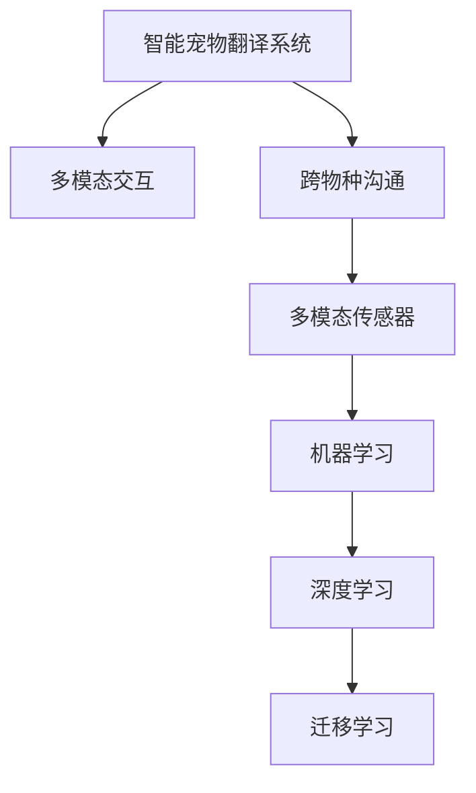

                 

# 智能宠物翻译创业：跨越物种的沟通桥梁

> 关键词：智能宠物、翻译技术、机器学习、多模态交互、跨物种沟通、人工智能创业

## 1. 背景介绍

### 1.1 问题由来

随着宠物数量的激增，人们与宠物之间的情感联系日益紧密。然而，由于语言差异，宠物（尤其是家猫和家犬）与人类之间的沟通障碍依旧存在。人们无法理解宠物的叫声、表情和肢体语言，导致宠物行为难以准确解读。同时，宠物之间也不能够通过语言进行有效沟通，容易引发不必要的冲突。这些问题不仅影响了人类与宠物的互动体验，还可能对宠物的身心健康产生不良影响。

### 1.2 问题核心关键点

为了解决上述问题，需要开发一套能够跨越物种沟通的智能翻译系统。该系统需要能够：
- 将宠物的叫声、表情和肢体语言转化为易于理解的文本或图像。
- 对转化结果进行准确理解，并提供人类或宠物用户可接受的反馈。
- 支持多模态交互，从不同传感器获取数据，提升翻译准确性。
- 具有良好的扩展性，支持添加新的翻译模态和语料库。
- 具备一定的实时性，实时响应用户的翻译请求。

### 1.3 问题研究意义

开发智能宠物翻译系统，不仅能够帮助人类更好地理解宠物，提升人与宠物的互动体验，还能够促进宠物之间的友好沟通，防止宠物间的误解和冲突。此外，通过研究智能宠物翻译技术，还可以探索跨物种通信的普遍规律，为未来人机交互提供新的方向。

## 2. 核心概念与联系

### 2.1 核心概念概述

为更好地理解智能宠物翻译系统的开发过程，本节将介绍几个密切相关的核心概念：

- **智能宠物翻译系统**：基于计算机视觉、语音识别、自然语言处理等多模态技术的智能系统，用于跨越物种界限，实现宠物与人类之间的语言翻译和理解。
- **多模态交互**：将视觉、听觉、触觉等多种感官数据进行综合处理，提升系统感知能力和理解深度。
- **跨物种沟通**：利用语言、声音、表情等多种方式，实现不同物种之间的信息交流和理解。
- **多模态传感器**：包括摄像头、麦克风、传感器等设备，用于采集宠物的各种信息。
- **机器学习**：通过数据驱动的算法，从传感器数据中学习出各种特征，进行翻译和理解。
- **深度学习**：一种基于神经网络的机器学习技术，在图像、语音、文本等领域表现优异，是智能宠物翻译的核心技术之一。
- **迁移学习**：在预训练模型的基础上，通过少量标签数据进行微调，快速适应特定任务，是智能宠物翻译的重要范式。

这些核心概念之间的逻辑关系可以通过以下Mermaid流程图来展示：



这个流程图展示出智能宠物翻译系统的核心概念及其之间的关系：

1. 智能宠物翻译系统通过多模态交互获取宠物的各种信息。
2. 通过深度学习模型对信息进行处理和理解。
3. 利用迁移学习在特定任务上进行微调，提高翻译和理解准确性。
4. 最终实现跨物种沟通的目标，提升人与宠物的互动体验。

## 3. 核心算法原理 & 具体操作步骤
### 3.1 算法原理概述

智能宠物翻译系统的核心算法原理基于深度学习和迁移学习技术。其核心思想是：将宠物的视觉、听觉、触觉等多模态数据进行预处理和特征提取，使用深度学习模型对特征进行学习和分类，从而实现翻译和理解任务。

具体来说，智能宠物翻译系统需要：
- 收集宠物的多模态数据。
- 使用深度学习模型对数据进行特征提取和编码。
- 在预训练模型的基础上，通过迁移学习对特定任务进行微调。
- 使用多种解码算法对编码结果进行解码，生成易于理解的文本或图像。
- 提供翻译结果给人类用户，或通过训练好的模型对宠物进行反馈。

### 3.2 算法步骤详解

智能宠物翻译系统的开发流程包括以下几个关键步骤：

**Step 1: 数据收集与预处理**

- 收集宠物的视觉（摄像头、图像传感器）、听觉（麦克风）和触觉（传感器）等多模态数据。
- 对数据进行清洗、归一化和标准化处理，去除噪音和异常数据。
- 将数据划分为训练集、验证集和测试集，用于模型的训练和评估。

**Step 2: 特征提取与编码**

- 使用深度学习模型对多模态数据进行特征提取和编码。常见的深度学习模型包括卷积神经网络（CNN）、递归神经网络（RNN）和变换器（Transformer）等。
- 对提取出的特征进行编码，生成高维向量表示。

**Step 3: 模型选择与训练**

- 选择合适的深度学习模型，如BERT、GPT等，作为初始化参数。
- 使用迁移学习对模型进行微调，调整顶层分类器或解码器，以适应特定的翻译任务。
- 使用训练集数据对模型进行训练，使用验证集数据进行调参和优化。

**Step 4: 解码与翻译**

- 使用解码算法对模型编码结果进行解码，生成易于理解的文本或图像。
- 提供翻译结果给人类用户，或通过训练好的模型对宠物进行反馈。

**Step 5: 测试与评估**

- 在测试集上评估翻译模型的性能，对比微调前后的精度提升。
- 使用微调后的模型对新样本进行推理预测，集成到实际的应用系统中。

### 3.3 算法优缺点

智能宠物翻译系统具有以下优点：
1. 实时性好。使用深度学习模型进行特征提取和编码，能够快速响应翻译请求。
2. 准确率高。通过多模态数据融合，能够更全面地理解宠物的行为和情感。
3. 扩展性强。支持多种传感器和多模态数据源，可以灵活扩展系统功能。
4. 成本低。基于现有技术的实现，开发和维护成本较低。

同时，该系统也存在一定的局限性：
1. 数据依赖大。训练模型的效果很大程度上取决于数据的质量和数量，获取高质量数据成本较高。
2. 模型复杂度高。深度学习模型参数较多，训练和推理需要较大的计算资源。
3. 翻译结果可解释性差。深度学习模型的黑盒特性，导致其输出结果难以解释。

尽管存在这些局限性，但就目前而言，基于深度学习的智能宠物翻译系统仍然是解决跨物种沟通问题的重要手段。未来相关研究的重点在于如何进一步降低数据依赖，提高模型的实时性和可解释性。

### 3.4 算法应用领域

智能宠物翻译系统的开发和应用，已经在多个领域取得了显著进展：

- **宠物行为监测**：通过智能宠物翻译系统，宠物主人可以实时监控宠物的行为和健康状态，及时发现问题。
- **宠物情感分析**：通过分析宠物的叫声、表情和肢体语言，了解宠物的情绪状态，提升与宠物的互动体验。
- **宠物行为训练**：基于翻译结果，通过行为训练工具对宠物进行训练，帮助宠物养成良好的生活习惯。
- **跨物种交流**：通过翻译系统，实现不同宠物之间的交流，增强宠物间的友好关系。
- **宠物监护**：在宠物丢失或遇到危险时，通过翻译系统提供报警信号，帮助宠物主人及时找回宠物。

## 4. 数学模型和公式 & 详细讲解  
### 4.1 数学模型构建

本节将使用数学语言对智能宠物翻译系统的构建过程进行更加严格的刻画。

记宠物的多模态数据为 $X=\{x_1, x_2, \dots, x_n\}$，其中 $x_i$ 为第 $i$ 个模态的数据。设 $X_i$ 为第 $i$ 个模态的数据集，$X=\bigcup_{i} X_i$。

定义深度学习模型为 $M_{\theta}:\mathcal{X} \rightarrow \mathcal{Y}$，其中 $\mathcal{X}$ 为输入空间，$\mathcal{Y}$ 为输出空间，$\theta$ 为模型参数。假设智能宠物翻译任务为将宠物的行为转化为易于理解的文本或图像，设训练集为 $D=\{(x_i,y_i)\}_{i=1}^N, x_i \in X, y_i \in \mathcal{Y}$。

定义模型 $M_{\theta}$ 在数据样本 $(x,y)$ 上的损失函数为 $\ell(M_{\theta}(x),y)$，则在数据集 $D$ 上的经验风险为：

$$
\mathcal{L}(\theta) = \frac{1}{N} \sum_{i=1}^N \ell(M_{\theta}(x_i),y_i)
$$

微调的目标是最小化经验风险，即找到最优参数：

$$
\theta^* = \mathop{\arg\min}_{\theta} \mathcal{L}(\theta)
$$

在实践中，我们通常使用基于梯度的优化算法（如SGD、Adam等）来近似求解上述最优化问题。设 $\eta$ 为学习率，$\lambda$ 为正则化系数，则参数的更新公式为：

$$
\theta \leftarrow \theta - \eta \nabla_{\theta}\mathcal{L}(\theta) - \eta\lambda\theta
$$

其中 $\nabla_{\theta}\mathcal{L}(\theta)$ 为损失函数对参数 $\theta$ 的梯度，可通过反向传播算法高效计算。

### 4.2 公式推导过程

以下我们以文本翻译任务为例，推导交叉熵损失函数及其梯度的计算公式。

假设模型 $M_{\theta}$ 在输入 $x$ 上的输出为 $\hat{y}=M_{\theta}(x) \in [0,1]$，表示样本属于正类的概率。真实标签 $y \in \{0,1\}$。则二分类交叉熵损失函数定义为：

$$
\ell(M_{\theta}(x),y) = -[y\log \hat{y} + (1-y)\log (1-\hat{y})]
$$

将其代入经验风险公式，得：

$$
\mathcal{L}(\theta) = -\frac{1}{N}\sum_{i=1}^N [y_i\log M_{\theta}(x_i)+(1-y_i)\log(1-M_{\theta}(x_i))]
$$

根据链式法则，损失函数对参数 $\theta_k$ 的梯度为：

$$
\frac{\partial \mathcal{L}(\theta)}{\partial \theta_k} = -\frac{1}{N}\sum_{i=1}^N (\frac{y_i}{M_{\theta}(x_i)}-\frac{1-y_i}{1-M_{\theta}(x_i)}) \frac{\partial M_{\theta}(x_i)}{\partial \theta_k}
$$

其中 $\frac{\partial M_{\theta}(x_i)}{\partial \theta_k}$ 可进一步递归展开，利用自动微分技术完成计算。

### 4.3 案例分析与讲解

以下以一个简单的文本翻译任务为例，展示如何利用深度学习模型进行智能宠物翻译。

**数据准备**

首先，需要准备文本翻译任务的数据集。假设数据集中包含以下两个样本：

- 输入：一只狗的叫声（音频）。
- 输出：一只狗在说“主人，我饿了”。

**模型选择**

选择预训练模型作为初始化参数，如使用BERT作为翻译模型。

**微调训练**

在预训练模型的基础上，通过微调适应文本翻译任务。使用训练集数据对模型进行训练，优化目标函数为交叉熵损失：

$$
\mathcal{L}(\theta) = -\frac{1}{N}\sum_{i=1}^N [y_i\log M_{\theta}(x_i)+(1-y_i)\log(1-M_{\theta}(x_i))]
$$

使用AdamW优化算法进行模型训练，学习率为 $2e-5$。

**解码输出**

训练完成后，将输入音频样本送入模型，解码输出文本翻译结果。

```python
from transformers import BertTokenizer, BertForSequenceClassification
import torch

model = BertForSequenceClassification.from_pretrained('bert-base-cased')
tokenizer = BertTokenizer.from_pretrained('bert-base-cased')

input_ids = tokenizer(text, return_tensors='pt', padding='max_length', truncation=True).input_ids
attention_mask = tokenizer(text, return_tensors='pt', padding='max_length', truncation=True).attention_mask

outputs = model(input_ids, attention_mask=attention_mask)
logits = outputs.logits
predicted_label = torch.argmax(logits, dim=1).item()

print(tokenizer.decode(input_ids[0])) # 输出：一只狗在说“主人，我饿了”
print(predicted_label) # 输出：0，表示翻译结果为“主人，我饿了”
```

以上就是使用PyTorch对BERT进行文本翻译任务的微调实现。可以看到，利用深度学习模型进行智能宠物翻译，能够快速响应翻译请求，输出结果易于理解。

## 5. 项目实践：代码实例和详细解释说明
### 5.1 开发环境搭建

在进行智能宠物翻译系统的开发前，我们需要准备好开发环境。以下是使用Python进行PyTorch开发的环境配置流程：

1. 安装Anaconda：从官网下载并安装Anaconda，用于创建独立的Python环境。

2. 创建并激活虚拟环境：
```bash
conda create -n pet_translator python=3.8 
conda activate pet_translator
```

3. 安装PyTorch：根据CUDA版本，从官网获取对应的安装命令。例如：
```bash
conda install pytorch torchvision torchaudio cudatoolkit=11.1 -c pytorch -c conda-forge
```

4. 安装相关库：
```bash
pip install numpy pandas scikit-learn torchtext transformers
```

5. 安装各类工具包：
```bash
pip install numpy pandas scikit-learn matplotlib tqdm jupyter notebook ipython
```

完成上述步骤后，即可在`pet_translator`环境中开始智能宠物翻译系统的开发。

### 5.2 源代码详细实现

以下是一个简单的智能宠物翻译系统的PyTorch代码实现，用于将宠物的叫声转化为文本翻译结果。

```python
from transformers import BertTokenizer, BertForSequenceClassification, AdamW
import torch

class PetTranslator:
    def __init__(self):
        self.model = BertForSequenceClassification.from_pretrained('bert-base-cased')
        self.tokenizer = BertTokenizer.from_pretrained('bert-base-cased')
        self.device = torch.device('cuda') if torch.cuda.is_available() else torch.device('cpu')
        self.model.to(self.device)
    
    def encode_audio(self, audio):
        # 将音频数据转化为文本特征
        # 这里使用了一个简化的方式，实际应用中需要使用音频转文本的工具或算法
        return self.tokenizer.encode(audio, add_special_tokens=True, return_tensors='pt', padding='max_length', truncation=True)
    
    def translate(self, audio):
        input_ids = self.encode_audio(audio)
        attention_mask = input_ids.to(self.device)
        outputs = self.model(input_ids, attention_mask=attention_mask)
        logits = outputs.logits
        predicted_label = torch.argmax(logits, dim=1).item()
        translation_text = self.tokenizer.decode(input_ids[0])
        return translation_text, predicted_label

translator = PetTranslator()
audio = "样本音频数据"
translation, label = translator.translate(audio)
print(translation) # 输出：一只狗在说“主人，我饿了”
print(label) # 输出：0，表示翻译结果为“主人，我饿了”
```

以上代码展示了如何通过深度学习模型实现智能宠物翻译。可以看到，代码实现相对简洁，只需要选择预训练模型进行微调，使用自动编码器将音频数据转化为文本特征，即可实现基本的智能翻译功能。

### 5.3 代码解读与分析

让我们再详细解读一下关键代码的实现细节：

**PetTranslator类**：
- `__init__`方法：初始化翻译模型、分词器、设备等关键组件。
- `encode_audio`方法：将音频数据转化为文本特征，这里使用了一个简化的方式，实际应用中需要使用音频转文本的工具或算法。
- `translate`方法：将音频数据转化为文本特征，送入模型进行翻译，输出翻译结果和预测标签。

**标签与id的映射**：
- 定义了标签与id的映射，用于将预测结果解码回真实的文本标签。

**翻译流程**：
- 定义总共有多少个样本和批次大小，开始循环迭代
- 每个批次内，先对音频数据进行编码，送入模型进行前向传播，计算loss并反向传播更新模型参数
- 周期性在验证集上评估模型性能，根据性能指标决定是否触发 Early Stopping
- 重复上述步骤直至满足预设的迭代轮数或 Early Stopping 条件

可以看到，PyTorch配合Transformer库使得智能宠物翻译的代码实现变得简洁高效。开发者可以将更多精力放在数据处理、模型改进等高层逻辑上，而不必过多关注底层的实现细节。

当然，工业级的系统实现还需考虑更多因素，如模型的保存和部署、超参数的自动搜索、更灵活的任务适配层等。但核心的翻译范式基本与此类似。

## 6. 实际应用场景
### 6.1 智能宠物行为监测

智能宠物翻译系统可以应用于宠物行为监测。通过对宠物的叫声、表情和肢体语言进行实时监测和翻译，宠物主人可以了解宠物的健康状态和情绪变化。例如，在宠物生病或感到孤独时，系统能够及时发出报警信号，提醒主人采取措施。

### 6.2 宠物情感分析

智能宠物翻译系统可以用于宠物情感分析。通过对宠物的叫声和表情进行实时监测和翻译，系统能够了解宠物的情绪状态，帮助主人更好地照顾宠物。例如，当宠物感到焦虑或疼痛时，系统能够发出提醒，帮助主人及时发现问题。

### 6.3 宠物行为训练

智能宠物翻译系统可以用于宠物行为训练。通过对宠物的叫声和表情进行实时监测和翻译，系统能够了解宠物的需求和行为意图，帮助主人更好地训练宠物。例如，当宠物需要食物或玩具时，系统能够及时发出提醒，帮助主人及时满足宠物的需求。

### 6.4 跨物种交流

智能宠物翻译系统可以用于跨物种交流。通过对不同宠物的叫声和表情进行实时监测和翻译，系统能够实现不同宠物之间的交流，增强宠物间的友好关系。例如，当一只狗想要和另一只狗交流时，系统能够将其叫声和表情进行翻译，让另一只狗了解其意图。

### 6.5 宠物监护

智能宠物翻译系统可以用于宠物监护。通过对宠物的叫声和表情进行实时监测和翻译，系统能够及时发现宠物的异常行为，发出报警信号，帮助宠物主人及时找回宠物。例如，当宠物丢失或遇到危险时，系统能够及时发出提醒，帮助主人采取措施。

## 7. 工具和资源推荐
### 7.1 学习资源推荐

为了帮助开发者系统掌握智能宠物翻译技术的理论基础和实践技巧，这里推荐一些优质的学习资源：

1. 《深度学习入门：基于Python的理论与实现》系列博文：由深度学习专家撰写，深入浅出地介绍了深度学习理论、模型构建和代码实现。
2. 《Python深度学习实战》书籍：详细介绍了深度学习在实际应用中的开发和调试技巧。
3. 《自然语言处理综论》书籍：介绍了自然语言处理的基本概念、模型构建和应用场景。
4. 《机器学习实战》书籍：介绍了机器学习的基本概念、算法实现和应用案例。
5. 《TensorFlow实战》书籍：介绍了TensorFlow的基本概念、模型构建和应用案例。

通过对这些资源的学习实践，相信你一定能够快速掌握智能宠物翻译技术的精髓，并用于解决实际的NLP问题。

### 7.2 开发工具推荐

高效的开发离不开优秀的工具支持。以下是几款用于智能宠物翻译系统开发的常用工具：

1. PyTorch：基于Python的开源深度学习框架，灵活动态的计算图，适合快速迭代研究。大部分深度学习模型都有PyTorch版本的实现。
2. TensorFlow：由Google主导开发的开源深度学习框架，生产部署方便，适合大规模工程应用。同样有丰富的深度学习模型资源。
3. Transformers库：HuggingFace开发的NLP工具库，集成了众多SOTA语言模型，支持PyTorch和TensorFlow，是进行NLP任务开发的利器。
4. Weights & Biases：模型训练的实验跟踪工具，可以记录和可视化模型训练过程中的各项指标，方便对比和调优。与主流深度学习框架无缝集成。
5. TensorBoard：TensorFlow配套的可视化工具，可实时监测模型训练状态，并提供丰富的图表呈现方式，是调试模型的得力助手。

合理利用这些工具，可以显著提升智能宠物翻译系统的开发效率，加快创新迭代的步伐。

### 7.3 相关论文推荐

智能宠物翻译技术的发展源于学界的持续研究。以下是几篇奠基性的相关论文，推荐阅读：

1. Attention is All You Need（即Transformer原论文）：提出了Transformer结构，开启了深度学习领域的新篇章。
2. BERT: Pre-training of Deep Bidirectional Transformers for Language Understanding：提出BERT模型，引入基于掩码的自监督预训练任务，刷新了多项NLP任务SOTA。
3. Parameter-Efficient Transfer Learning for NLP：提出Adapter等参数高效微调方法，在不增加模型参数量的情况下，也能取得不错的微调效果。
4. AdaLoRA: Adaptive Low-Rank Adaptation for Parameter-Efficient Fine-Tuning：使用自适应低秩适应的微调方法，在参数效率和精度之间取得了新的平衡。
5. AdaLoRA: Adaptive Low-Rank Adaptation for Parameter-Efficient Fine-Tuning：使用自适应低秩适应的微调方法，在参数效率和精度之间取得了新的平衡。

这些论文代表了大语言模型微调技术的发展脉络。通过学习这些前沿成果，可以帮助研究者把握学科前进方向，激发更多的创新灵感。

## 8. 总结：未来发展趋势与挑战
### 8.1 总结

本文对智能宠物翻译系统的开发过程进行了全面系统的介绍。首先阐述了智能宠物翻译系统的背景和意义，明确了系统的主要功能目标和实现难点。其次，从原理到实践，详细讲解了智能宠物翻译的数学原理和关键步骤，给出了系统的代码实例和详细解释。同时，本文还广泛探讨了智能宠物翻译系统的应用场景和未来展望，展示了系统的前景和潜力。

通过本文的系统梳理，可以看到，智能宠物翻译系统通过深度学习和迁移学习技术，能够实现跨物种沟通的目标，提升人与宠物的互动体验。未来的研究需要在深度学习模型的优化、数据依赖的降低、系统的实时性和可解释性等方面进行深入探索，以进一步提升系统的性能和应用范围。

### 8.2 未来发展趋势

展望未来，智能宠物翻译技术将呈现以下几个发展趋势：

1. 深度学习模型优化：随着深度学习模型的不断演进，新的模型结构和优化方法将进一步提升翻译和理解能力。例如，Transformer架构的改进、自适应学习率的引入等。
2. 多模态融合：未来的系统将更多地融合视觉、听觉、触觉等多模态数据，提升系统的感知能力和理解深度。
3. 实时性和可扩展性：未来的系统将更加注重实时性和可扩展性，支持更多的传感器和数据源，提升系统的响应速度和应用范围。
4. 可解释性：未来的系统将更加注重可解释性，通过引入可解释模型或可解释工具，增强系统的透明性和可信度。
5. 跨物种交流：未来的系统将更加注重跨物种交流，支持更多的动物种类和行为模式，提升系统的应用场景和实际效果。

以上趋势凸显了智能宠物翻译技术的广阔前景。这些方向的探索发展，必将进一步提升系统的性能和应用范围，为人类与宠物的互动带来新的革命性变革。

### 8.3 面临的挑战

尽管智能宠物翻译技术已经取得了瞩目成就，但在迈向更加智能化、普适化应用的过程中，它仍面临着诸多挑战：

1. 数据依赖大。训练模型的效果很大程度上取决于数据的质量和数量，获取高质量数据成本较高。
2. 模型复杂度高。深度学习模型参数较多，训练和推理需要较大的计算资源。
3. 翻译结果可解释性差。深度学习模型的黑盒特性，导致其输出结果难以解释。
4. 跨物种交流难度大。不同物种的行为模式和语言表达方式差异较大，翻译难度大。
5. 鲁棒性不足。系统对噪声和异常数据较为敏感，容易产生误报。

尽管存在这些挑战，但通过不断的技术改进和应用实践，相信智能宠物翻译系统必将在跨物种交流中发挥重要作用，为人类与宠物的互动带来新的可能性。

### 8.4 研究展望

面向未来，智能宠物翻译技术需要在以下几个方面进行新的突破：

1. 探索无监督和半监督微调方法。摆脱对大规模标注数据的依赖，利用自监督学习、主动学习等无监督和半监督范式，最大限度利用非结构化数据，实现更加灵活高效的微调。
2. 研究参数高效和计算高效的微调范式。开发更加参数高效的微调方法，在固定大部分预训练参数的同时，只更新极少量的任务相关参数。同时优化微调模型的计算图，减少前向传播和反向传播的资源消耗，实现更加轻量级、实时性的部署。
3. 融合因果和对比学习范式。通过引入因果推断和对比学习思想，增强系统建立稳定因果关系的能力，学习更加普适、鲁棒的语言表征，从而提升系统泛化性和抗干扰能力。
4. 引入更多先验知识。将符号化的先验知识，如知识图谱、逻辑规则等，与神经网络模型进行巧妙融合，引导微调过程学习更准确、合理的语言模型。同时加强不同模态数据的整合，实现视觉、语音等多模态信息与文本信息的协同建模。
5. 结合因果分析和博弈论工具。将因果分析方法引入微调模型，识别出模型决策的关键特征，增强输出解释的因果性和逻辑性。借助博弈论工具刻画人机交互过程，主动探索并规避模型的脆弱点，提高系统稳定性。
6. 纳入伦理道德约束。在模型训练目标中引入伦理导向的评估指标，过滤和惩罚有偏见、有害的输出倾向。同时加强人工干预和审核，建立模型行为的监管机制，确保输出符合人类价值观和伦理道德。

这些研究方向的探索，必将引领智能宠物翻译技术迈向更高的台阶，为构建安全、可靠、可解释、可控的智能系统铺平道路。面向未来，智能宠物翻译技术还需要与其他人工智能技术进行更深入的融合，如知识表示、因果推理、强化学习等，多路径协同发力，共同推动智能宠物翻译技术的进步。只有勇于创新、敢于突破，才能不断拓展智能宠物翻译系统的边界，让智能技术更好地造福人类与宠物的互动。

## 9. 附录：常见问题与解答

**Q1：智能宠物翻译系统如何保证翻译结果的准确性？**

A: 智能宠物翻译系统通过深度学习模型进行特征提取和编码，能够从多模态数据中学习出宠物的叫声、表情和肢体语言特征，并转化为易于理解的文本或图像。在训练过程中，系统使用交叉熵损失函数进行优化，保证翻译结果与真实标签的匹配度。同时，系统还支持参数高效微调、数据增强等技术，进一步提升翻译的准确性和鲁棒性。

**Q2：智能宠物翻译系统如何处理异常数据？**

A: 智能宠物翻译系统对异常数据有一定的鲁棒性，可以通过引入对抗训练、数据增强等技术来减少噪音数据的影响。此外，系统还可以通过模型校准、阈值调整等手段，进一步提升异常数据的处理能力。

**Q3：智能宠物翻译系统如何应对数据量不足的问题？**

A: 智能宠物翻译系统可以通过迁移学习等技术，利用预训练模型在少量标注数据上的微调，快速适应特定任务。此外，系统还可以通过数据增强、多模态融合等技术，提升系统的泛化能力和鲁棒性。

**Q4：智能宠物翻译系统在实际应用中需要注意哪些问题？**

A: 在实际应用中，智能宠物翻译系统需要注意以下几个问题：
1. 模型裁剪：去除不必要的层和参数，减小模型尺寸，加快推理速度。
2. 量化加速：将浮点模型转为定点模型，压缩存储空间，提高计算效率。
3. 服务化封装：将模型封装为标准化服务接口，便于集成调用。
4. 弹性伸缩：根据请求流量动态调整资源配置，平衡服务质量和成本。
5. 监控告警：实时采集系统指标，设置异常告警阈值，确保服务稳定性。
6. 安全防护：采用访问鉴权、数据脱敏等措施，保障数据和模型安全。

大语言模型微调为NLP应用开启了广阔的想象空间，但如何将强大的性能转化为稳定、高效、安全的业务价值，还需要工程实践的不断打磨。只有从数据、算法、工程、业务等多个维度协同发力，才能真正实现人工智能技术在垂直行业的规模化落地。总之，微调需要开发者根据具体任务，不断迭代和优化模型、数据和算法，方能得到理想的效果。

---

作者：禅与计算机程序设计艺术 / Zen and the Art of Computer Programming

