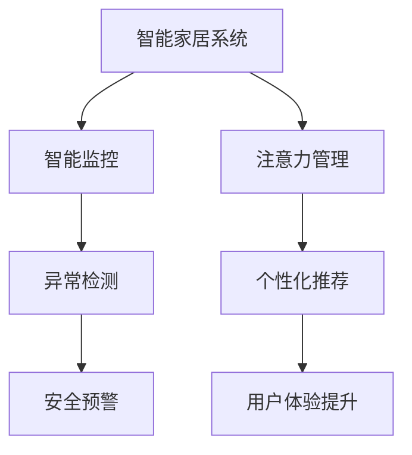

                 

# 智能家居的智能监控与注意力管理

> 关键词：智能家居,智能监控,注意力管理,物联网(IoT),机器学习(ML),深度学习(Deep Learning)

## 1. 背景介绍

### 1.1 问题由来
随着物联网技术的飞速发展，智能家居系统已经成为现代家庭的重要组成部分。智能家居系统通过连接各种智能设备，如智能灯、智能音箱、智能门锁等，为用户提供便捷的生活体验和高效的家庭管理服务。然而，智能家居系统的复杂性不仅带来了便利，也带来了新的安全挑战。一方面，智能家居设备的网络攻击风险逐渐增大，隐私泄漏问题日益严峻；另一方面，如何有效利用智能家居设备收集的数据，提升用户的生活质量，也是一大难题。

### 1.2 问题核心关键点
本文聚焦于智能家居系统的智能监控与注意力管理，通过机器学习和深度学习技术，对智能家居设备收集的数据进行分析和处理，提升系统的安全性和智能化水平。具体包括：

- 智能监控：通过监控智能家居设备的运行状态和用户行为，识别潜在的安全威胁和异常行为。
- 注意力管理：通过分析用户的行为习惯和偏好，智能推荐内容和设置，提升用户满意度。

智能监控与注意力管理是智能家居系统的重要组成部分，也是系统升级优化的关键方向。通过科学有效的监控和注意力管理，不仅可以降低安全隐患，还能显著提升用户体验，推动智能家居系统的广泛应用。

## 2. 核心概念与联系

### 2.1 核心概念概述

为更好地理解智能家居系统的智能监控与注意力管理方法，本节将介绍几个密切相关的核心概念：

- 智能家居系统：通过物联网技术将各种智能设备互联互通，实现家庭自动化、智能化管理的网络系统。
- 智能监控：通过对智能家居设备数据的实时采集和分析，识别异常行为和潜在威胁，保障家庭安全。
- 注意力管理：通过分析用户行为和偏好，智能推荐家居内容和服务设置，提升用户体验。
- 机器学习：基于数据驱动的方法，通过训练模型学习数据的规律和特征，实现自动化决策和预测。
- 深度学习：基于神经网络的方法，通过多层次特征提取和抽象，提升模型的表达能力和预测精度。
- 自然语言处理(NLP)：处理和分析人类语言信息，提取文本中的关键信息，用于理解用户意图和反馈。
- 计算机视觉(CV)：处理和分析图像和视频数据，用于识别物体、动作等视觉信息。
- 嵌入式系统(Embedded Systems)：集成硬件和软件的系统，用于实现特定功能的智能设备。

这些核心概念之间的逻辑关系可以通过以下Mermaid流程图来展示：



这个流程图展示了几大核心概念之间的逻辑关系：

1. 智能家居系统通过各种智能设备收集数据，是智能监控和注意力管理的基础。
2. 智能监控通过实时数据监测，识别异常行为和潜在威胁，保障家庭安全。
3. 注意力管理通过行为分析，智能推荐内容和服务设置，提升用户体验。
4. 异常检测和个性化推荐是智能监控和注意力管理的具体实现方式。
5. 安全预警和用户体验提升是智能监控和注意力管理的具体应用效果。

这些概念共同构成了智能家居系统的核心技术框架，使其能够实现安全、智能的家居管理。

## 3. 核心算法原理 & 具体操作步骤
### 3.1 算法原理概述

智能家居系统的智能监控与注意力管理，本质上是通过机器学习和深度学习技术，对智能家居设备收集的数据进行分析和处理，以实现系统的安全性和智能化。其核心思想是：

1. **智能监控**：通过收集智能家居设备的数据，构建特征向量，使用机器学习模型进行实时异常检测和威胁识别，保障家庭安全。
2. **注意力管理**：通过分析用户的行为数据和偏好信息，使用深度学习模型进行个性化推荐和智能设置，提升用户满意度。

具体实现步骤包括：

1. **数据采集**：通过智能家居设备的网络接口，收集设备运行状态和用户行为数据。
2. **特征提取**：将原始数据转化为模型可处理的特征向量，如时间戳、设备状态、用户行为等。
3. **模型训练**：使用机器学习或深度学习算法，训练异常检测和推荐模型，提升模型的预测能力和泛化能力。
4. **模型应用**：将训练好的模型应用于实时数据流，进行异常检测和推荐预测。
5. **结果反馈**：将模型预测结果反馈给用户和系统，调整模型参数或改进系统策略。

### 3.2 算法步骤详解

智能家居系统的智能监控与注意力管理，涉及多个算法步骤，具体包括：

**Step 1: 数据采集与预处理**

智能家居设备的数据采集与预处理，是智能监控与注意力管理的基础。主要包括：

- 数据采集：通过智能家居设备的传感器、摄像头等，收集设备状态和用户行为数据。例如，智能灯采集开闭状态和亮度，智能音箱采集语音命令等。
- 数据清洗：去除噪声和异常数据，保证数据质量和一致性。例如，去除传感器失效数据、处理网络延迟等问题。
- 数据归一化：将数据转化为标准格式，便于模型处理。例如，将时间戳统一格式，将设备状态转换为0/1等。

**Step 2: 特征提取与表示**

特征提取与表示，是智能监控与注意力管理的核心步骤。主要包括：

- 特征提取：从原始数据中提取有意义的特征，如时间戳、设备状态、用户行为等。例如，将语音命令转化为文本向量，提取文本中的关键词和情感等。
- 特征表示：将提取的特征转化为模型可接受的向量表示，如高维向量、时间序列等。例如，将文本向量输入到BERT模型，提取语义表示。
- 特征组合：将不同来源的特征进行组合，形成综合特征向量。例如，将语音命令文本和设备状态数据组合，形成综合特征向量。

**Step 3: 模型训练与优化**

模型训练与优化，是智能监控与注意力管理的核心技术。主要包括：

- 模型选择：选择合适的机器学习或深度学习模型，如随机森林、SVM、RNN、CNN等。例如，使用深度学习模型处理时间序列数据，使用RNN处理文本数据等。
- 数据划分：将数据划分为训练集、验证集和测试集，用于模型训练、调优和评估。例如，使用70%的数据训练模型，30%的数据验证模型，测试集用于最终评估。
- 超参数调优：调整模型的超参数，如学习率、批量大小、迭代次数等，提升模型性能。例如，使用网格搜索或随机搜索方法，调整学习率等超参数。
- 模型集成：使用多个模型进行集成，提升模型的泛化能力和鲁棒性。例如，使用Bagging和Boosting方法，进行模型集成。

**Step 4: 模型应用与优化**

模型应用与优化，是智能监控与注意力管理的具体实施步骤。主要包括：

- 模型部署：将训练好的模型部署到智能家居系统中，进行实时数据处理。例如，将异常检测模型部署到嵌入式系统，进行实时数据监测。
- 实时监控：对智能家居设备的数据进行实时采集和处理，识别异常行为和潜在威胁。例如，实时监测智能灯的运行状态，识别设备异常。
- 个性化推荐：根据用户的行为数据和偏好信息，生成个性化推荐内容和服务设置。例如，根据用户的浏览历史，推荐智能音箱中的音乐和视频。
- 反馈与调整：将模型预测结果反馈给用户和系统，调整模型参数或改进系统策略。例如，根据用户反馈，调整推荐算法和模型参数。

**Step 5: 结果评估与迭代**

结果评估与迭代，是智能监控与注意力管理的持续改进步骤。主要包括：

- 结果评估：使用测试集数据评估模型性能，计算准确率、召回率、F1值等指标。例如，计算异常检测模型的准确率和召回率。
- 模型迭代：根据评估结果，优化模型参数和算法，提升模型性能。例如，使用迁移学习或自监督学习方法，优化模型参数。
- 持续学习：不断收集新数据，进行模型更新和迭代。例如，收集新设备的运行数据，更新异常检测模型。

### 3.3 算法优缺点

智能家居系统的智能监控与注意力管理，具有以下优点：

1. **实时性高**：通过实时数据采集和处理，能够及时识别异常行为和潜在威胁，保障家庭安全。
2. **个性化强**：通过分析用户的行为数据和偏好信息，提供个性化的内容和服务推荐，提升用户体验。
3. **适应性强**：通过机器学习和深度学习技术，适应各种复杂的家庭环境和用户需求。
4. **易于部署**：基于开源技术和标准化的API，易于集成到现有智能家居系统中。

同时，该方法也存在一定的局限性：

1. **依赖数据质量**：智能监控与注意力管理的效果，高度依赖数据的质量和完整性。
2. **模型泛化能力**：模型在特定场景下的泛化能力有限，需要不断更新和优化。
3. **算法复杂度**：复杂的模型需要大量的计算资源和时间，不适用于资源受限的设备。
4. **隐私保护**：在处理用户数据时，需要注意隐私保护，防止数据泄露和滥用。

尽管存在这些局限性，但就目前而言，基于机器学习和深度学习的智能监控与注意力管理方法，仍是在智能家居系统中实现智能化和安全性的重要手段。未来相关研究的重点在于如何进一步提升模型的实时性和泛化能力，保障数据的隐私安全，同时兼顾可解释性和伦理安全性等因素。

### 3.4 算法应用领域

智能家居系统的智能监控与注意力管理，在智能家居领域已经得到了广泛的应用，覆盖了智能家居系统的各个环节，例如：

- 智能安防：通过智能监控系统，实时监测家庭安全状况，及时识别和预警安全威胁。
- 智能家电控制：通过注意力管理，自动调节家电设置，提供舒适便捷的生活体验。
- 智能照明控制：通过智能监控，实时监测家庭照明系统，自动调节光照强度和色彩。
- 智能温控系统：通过智能监控，实时监测室内温度，自动调节空调和暖气系统。
- 智能家庭娱乐：通过注意力管理，智能推荐音乐、视频和游戏内容，提升家庭娱乐体验。

除了上述这些经典应用外，智能监控与注意力管理技术也被创新性地应用到更多场景中，如智能健康监测、智能家居个性化定制、智能家居设备协同控制等，为智能家居技术带来了全新的突破。随着物联网技术和人工智能技术的不断发展，基于智能监控与注意力管理的方法，将在智能家居系统中发挥更大的作用，推动家庭生活智能化和自动化水平的提升。

## 4. 数学模型和公式 & 详细讲解  
### 4.1 数学模型构建

本节将使用数学语言对智能家居系统的智能监控与注意力管理过程进行更加严格的刻画。

记智能家居系统中的设备数量为 $N$，设备状态为 $\mathbf{x}_t = (x_{t1}, x_{t2}, ..., x_{tN})^T$，用户行为数据为 $\mathbf{y}_t = (y_{t1}, y_{t2}, ..., y_{tN})^T$。其中 $x_{ti}$ 和 $y_{ti}$ 分别表示第 $i$ 个设备在时间 $t$ 的运行状态和用户行为数据。

定义智能家居系统在时间 $t$ 的特征向量 $\mathbf{z}_t = (z_{t1}, z_{t2}, ..., z_{tN})^T$，其中 $z_{ti} = (x_{ti}, y_{ti})$ 表示第 $i$ 个设备在时间 $t$ 的综合特征向量。

定义异常检测模型为 $f: \mathcal{X} \rightarrow \{0,1\}$，其中 $\mathcal{X}$ 为特征向量空间，$0$ 表示正常状态，$1$ 表示异常状态。定义个性化推荐模型为 $g: \mathcal{X} \rightarrow \mathcal{Y}$，其中 $\mathcal{Y}$ 为用户推荐内容的集合。

异常检测和个性化推荐模型的训练目标为：

$$
\mathcal{L}(f,g) = \sum_{t=1}^T \ell_{d}(f(\mathbf{z}_t)) + \sum_{t=1}^T \ell_{r}(g(\mathbf{z}_t))
$$

其中 $\ell_{d}$ 为异常检测模型的损失函数，$\ell_{r}$ 为个性化推荐模型的损失函数，$T$ 为训练时间步数。

### 4.2 公式推导过程

以下我们以智能安防系统为例，推导异常检测模型的数学模型和损失函数。

假设智能安防系统中有多个摄像头，用于实时监控家庭安全状况。每个摄像头在时间 $t$ 采集到的视频帧为 $v_{ti} \in \mathcal{V}$，其中 $\mathcal{V}$ 为视频帧空间。定义异常检测模型 $f: \mathcal{V} \rightarrow \{0,1\}$，表示摄像头在时间 $t$ 的视频帧是否为异常状态。

假设异常检测模型 $f$ 的输出为 $y_{t,i} = f(v_{ti})$，定义交叉熵损失函数为：

$$
\ell_{d}(y_{t,i}) = -[y_{t,i}\log f(v_{ti}) + (1-y_{t,i})\log (1-f(v_{ti}))
$$

将摄像头在时间 $t$ 的视频帧表示为 $v_{ti} = (x_{ti,1}, x_{ti,2}, ..., x_{ti,N})^T$，其中 $x_{ti,k}$ 为第 $k$ 个摄像头在时间 $t$ 的视频帧。定义特征向量 $\mathbf{z}_{t,i} = (x_{ti,1}, x_{ti,2}, ..., x_{ti,N})^T$。则异常检测模型的输出可以表示为：

$$
y_{t,i} = f(\mathbf{z}_{t,i})
$$

异常检测模型的训练目标为最小化交叉熵损失：

$$
\mathcal{L}_{d}(f) = \frac{1}{N}\sum_{i=1}^N \sum_{t=1}^T \ell_{d}(y_{t,i})
$$

### 4.3 案例分析与讲解

**案例1：智能安防系统**

智能安防系统通过摄像头实时采集家庭安全视频，使用异常检测模型识别异常行为和潜在威胁。假设摄像头在时间 $t$ 采集到的视频帧为 $v_{ti} \in \mathcal{V}$，异常检测模型的输出为 $y_{t,i} = f(v_{ti})$，定义交叉熵损失函数为：

$$
\ell_{d}(y_{t,i}) = -[y_{t,i}\log f(v_{ti}) + (1-y_{t,i})\log (1-f(v_{ti}))
$$

将摄像头在时间 $t$ 的视频帧表示为 $v_{ti} = (x_{ti,1}, x_{ti,2}, ..., x_{ti,N})^T$，其中 $x_{ti,k}$ 为第 $k$ 个摄像头在时间 $t$ 的视频帧。定义特征向量 $\mathbf{z}_{t,i} = (x_{ti,1}, x_{ti,2}, ..., x_{ti,N})^T$。则异常检测模型的输出可以表示为：

$$
y_{t,i} = f(\mathbf{z}_{t,i})
$$

异常检测模型的训练目标为最小化交叉熵损失：

$$
\mathcal{L}_{d}(f) = \frac{1}{N}\sum_{i=1}^N \sum_{t=1}^T \ell_{d}(y_{t,i})
$$

在实际应用中，智能安防系统可以使用多摄像头融合技术，将多个摄像头的视频帧进行融合，提升异常检测的准确性。

**案例2：智能家电控制**

智能家电控制通过注意力管理，自动调节家电设置，提供舒适便捷的生活体验。假设智能家电在时间 $t$ 的状态为 $a_{ti} = (a_{ti,1}, a_{ti,2}, ..., a_{ti,N})^T$，用户行为数据为 $b_{ti} = (b_{ti,1}, b_{ti,2}, ..., b_{ti,N})^T$，其中 $a_{ti,k}$ 和 $b_{ti,k}$ 分别表示第 $k$ 个家电在时间 $t$ 的状态和用户行为数据。定义个性化推荐模型 $g: \mathcal{X} \rightarrow \mathcal{Y}$，表示家电在时间 $t$ 的推荐设置。

假设个性化推荐模型的输出为 $z_{t,i} = g(a_{ti}, b_{ti})$，定义均方误差损失函数为：

$$
\ell_{r}(z_{t,i}) = (a_{ti} - z_{t,i})^2
$$

将家电在时间 $t$ 的状态和用户行为数据表示为 $a_{ti} = (x_{ti,1}, x_{ti,2}, ..., x_{ti,N})^T$，用户行为数据表示为 $b_{ti} = (y_{ti,1}, y_{ti,2}, ..., y_{ti,N})^T$，则个性化推荐模型的输出可以表示为：

$$
z_{t,i} = g(x_{ti}, y_{ti})
$$

个性化推荐模型的训练目标为最小化均方误差损失：

$$
\mathcal{L}_{r}(g) = \frac{1}{N}\sum_{i=1}^N \sum_{t=1}^T \ell_{r}(z_{t,i})
$$

在实际应用中，智能家电控制可以使用上下文感知方法，将用户的历史行为数据和偏好信息进行融合，提升个性化推荐的准确性。

## 5. 项目实践：代码实例和详细解释说明
### 5.1 开发环境搭建

在进行智能家居系统的智能监控与注意力管理实践前，我们需要准备好开发环境。以下是使用Python进行TensorFlow开发的环境配置流程：

1. 安装Anaconda：从官网下载并安装Anaconda，用于创建独立的Python环境。

2. 创建并激活虚拟环境：
```bash
conda create -n tf-env python=3.7
conda activate tf-env
```

3. 安装TensorFlow：根据CUDA版本，从官网获取对应的安装命令。例如：
```bash
conda install tensorflow=tensorflow-2.5 -c conda-forge -c pytorch
```

4. 安装各类工具包：
```bash
pip install numpy pandas scikit-learn matplotlib tqdm jupyter notebook ipython
```

完成上述步骤后，即可在`tf-env`环境中开始智能家居系统的智能监控与注意力管理实践。

### 5.2 源代码详细实现

这里我们以智能安防系统为例，给出使用TensorFlow进行异常检测模型的PyTorch代码实现。

首先，定义异常检测模型的输入数据：

```python
import tensorflow as tf
from tensorflow.keras import layers

# 定义输入层
input_layer = layers.Input(shape=(num_cameras, num_frames, height, width))

# 定义卷积层
conv1 = layers.Conv2D(32, 3, activation='relu')(input_layer)

# 定义池化层
pool1 = layers.MaxPooling2D(pool_size=(2, 2))(conv1)

# 定义扁平化层
flatten = layers.Flatten()(pool1)

# 定义全连接层
dense1 = layers.Dense(64, activation='relu')(flatten)

# 定义输出层
output_layer = layers.Dense(1, activation='sigmoid')(dense1)

# 定义模型
model = tf.keras.Model(inputs=input_layer, outputs=output_layer)

# 编译模型
model.compile(optimizer='adam', loss='binary_crossentropy', metrics=['accuracy'])
```

然后，定义训练数据和验证数据：

```python
# 定义训练数据
train_data = ...

# 定义验证数据
val_data = ...
```

接着，定义训练和验证函数：

```python
def train_step(model, train_data, batch_size, epochs, optimizer):
    dataloader = tf.data.Dataset.from_tensor_slices(train_data).shuffle(buffer_size=10000).batch(batch_size).repeat().prefetch(1)
    model.fit(dataloader, epochs=epochs, callbacks=[tf.keras.callbacks.EarlyStopping(patience=10)])
    
def validate_step(model, val_data, batch_size, epochs, optimizer):
    dataloader = tf.data.Dataset.from_tensor_slices(val_data).shuffle(buffer_size=10000).batch(batch_size).repeat().prefetch(1)
    model.evaluate(dataloader, callbacks=[tf.keras.callbacks.EarlyStopping(patience=10)])
```

最后，启动训练流程并在验证集上评估：

```python
epochs = 50
batch_size = 32

train_step(model, train_data, batch_size, epochs, optimizer)
validate_step(model, val_data, batch_size, epochs, optimizer)
```

以上就是使用TensorFlow对智能安防系统进行异常检测模型的完整代码实现。可以看到，TensorFlow提供了强大的API和工具，可以方便地构建和训练深度学习模型。

### 5.3 代码解读与分析

让我们再详细解读一下关键代码的实现细节：

**输入层**：
- `Input`函数定义输入层的形状，包括摄像头数量、帧数、高度、宽度等。
- `Input`函数的参数可以是张量形状、Python列表等。

**卷积层**：
- `Conv2D`函数定义卷积层，用于提取视频帧的局部特征。
- `Conv2D`函数的参数包括卷积核大小、输出通道数等。

**池化层**：
- `MaxPooling2D`函数定义池化层，用于降低特征图的尺寸。
- `MaxPooling2D`函数的参数包括池化窗口大小等。

**扁平化层**：
- `Flatten`函数定义扁平化层，将高维特征图转化为一维向量。

**全连接层**：
- `Dense`函数定义全连接层，用于处理扁平化后的特征向量。
- `Dense`函数的参数包括输出节点数、激活函数等。

**输出层**：
- `Dense`函数定义输出层，用于生成异常检测的预测结果。
- `Dense`函数的参数包括输出节点数、激活函数等。

**模型**：
- `Model`函数定义模型，将输入层和输出层连接起来。

**编译模型**：
- `compile`函数编译模型，设置优化器、损失函数、评估指标等。

**训练函数**：
- `fit`函数训练模型，使用训练数据和验证数据进行训练，并设置EarlyStopping回调。
- `fit`函数的参数包括数据集、批次大小、迭代轮数等。

**验证函数**：
- `evaluate`函数验证模型，使用验证数据进行模型评估。
- `evaluate`函数的参数包括数据集、批次大小等。

可以看到，TensorFlow提供了强大的API和工具，使得模型构建和训练过程变得简单易用。开发者可以更加专注于模型的设计和优化，而不必过多关注底层实现细节。

当然，工业级的系统实现还需考虑更多因素，如模型的保存和部署、超参数的自动搜索、更灵活的任务适配层等。但核心的智能监控与注意力管理方法基本与此类似。

## 6. 实际应用场景
### 6.1 智能安防系统

智能安防系统通过智能监控和异常检测技术，保障家庭安全。智能安防系统可以实时监控家庭安全状况，及时识别和预警安全威胁。

在技术实现上，智能安防系统可以使用摄像头、传感器等设备，实时采集家庭安全数据。通过对视频帧进行特征提取和异常检测，实时监测家庭安全状况。一旦发现异常行为或潜在威胁，系统将自动触发报警，通知用户进行应急处理。

智能安防系统还可以结合人脸识别、行为分析等技术，提升系统的识别能力和智能化水平。例如，使用人脸识别技术，自动识别家庭成员和陌生人，提升安全防护的精准性。使用行为分析技术，识别异常行为模式，提升异常检测的准确性。

### 6.2 智能家电控制

智能家电控制通过个性化推荐和注意力管理，提升用户的生活体验。智能家电控制可以实时采集家电状态和用户行为数据，通过个性化推荐技术，自动调节家电设置，提供舒适便捷的生活体验。

在技术实现上，智能家电控制可以使用语音识别技术，将用户的语音指令转化为文本，进行分析和处理。通过对家电状态和用户行为数据的分析，生成个性化的推荐设置。例如，根据用户的浏览历史和偏好信息，推荐智能音箱中的音乐和视频，调节智能灯的亮度和颜色。

智能家电控制还可以结合智能家居设备和物联网技术，实现智能家电的协同控制。例如，根据用户的语音指令，控制智能窗帘的开闭，调节智能空调的温度和湿度，提升家居生活的智能化水平。

### 6.3 智能健康监测系统

智能健康监测系统通过智能监控和个性化推荐，提升用户的健康管理水平。智能健康监测系统可以实时采集用户的生理数据和行为数据，通过异常检测和个性化推荐技术，及时发现健康问题，提供个性化健康建议。

在技术实现上，智能健康监测系统可以使用传感器、摄像头等设备，实时采集用户的生理数据和行为数据。通过对生理数据和行为数据的分析，进行异常检测和健康评估。例如，根据用户的运动量、睡眠质量等数据，生成个性化的健康建议，提升用户的健康管理水平。

智能健康监测系统还可以结合医疗设备和物联网技术，实现智能健康管理和医疗服务的智能化。例如，根据用户的健康数据，自动生成医疗咨询和建议，帮助用户预约医疗服务。

### 6.4 未来应用展望

随着物联网技术和人工智能技术的不断发展，智能家居系统的智能监控与注意力管理，将在更多领域得到应用，为人类生活带来变革性影响。

在智慧城市领域，智能监控与注意力管理技术可以用于智能交通、智能安防、智能公共设施管理等，提升城市的智能化水平，构建智慧城市。

在智能医疗领域，智能监控与注意力管理技术可以用于智能健康监测、智能诊断、智能医疗服务等，提升医疗服务的智能化水平，构建智能医疗系统。

在智能教育领域，智能监控与注意力管理技术可以用于智能课堂管理、智能学习推荐、智能作业批改等，提升教育服务的智能化水平，构建智能教育系统。

此外，在智能办公、智能农业、智能环保等众多领域，智能监控与注意力管理技术也将不断涌现，为各行业带来数字化转型升级的新动力。相信随着技术的日益成熟，智能监控与注意力管理方法将成为智能家居系统的重要范式，推动人工智能技术在各行业的广泛应用。

## 7. 工具和资源推荐
### 7.1 学习资源推荐

为了帮助开发者系统掌握智能家居系统的智能监控与注意力管理技术，这里推荐一些优质的学习资源：

1. 《TensorFlow官方文档》：TensorFlow的官方文档，提供了详细的API文档和教程，是初学者快速上手TensorFlow的必备资料。

2. 《深度学习框架PyTorch》：PyTorch的官方文档和教程，详细介绍了PyTorch的API和使用方法，是深度学习开发者的好帮手。

3. 《Python机器学习》：一本机器学习领域的经典教材，全面介绍了机器学习的基本概念和算法，适合初学者入门。

4. 《深度学习》：一本深度学习领域的经典教材，详细介绍了深度学习的基本概念和算法，适合进阶学习者阅读。

5. 《TensorFlow实战Google深度学习》：一本TensorFlow实战教材，通过实际案例和项目，展示了TensorFlow的强大功能和应用场景。

6. 《智能家居系统设计与实现》：一本智能家居领域的经典教材，详细介绍了智能家居系统的设计思路和实现方法，适合开发人员参考。

通过这些学习资源的学习实践，相信你一定能够快速掌握智能家居系统的智能监控与注意力管理技术，并用于解决实际的智能家居问题。

### 7.2 开发工具推荐

高效的开发离不开优秀的工具支持。以下是几款用于智能家居系统开发的工具：

1. TensorFlow：由Google主导开发的开源深度学习框架，生产部署方便，适合大规模工程应用。

2. PyTorch：基于Python的开源深度学习框架，灵活动态的计算图，适合快速迭代研究。

3. Weights & Biases：模型训练的实验跟踪工具，可以记录和可视化模型训练过程中的各项指标，方便对比和调优。

4. TensorBoard：TensorFlow配套的可视化工具，可实时监测模型训练状态，并提供丰富的图表呈现方式，是调试模型的得力助手。

5. Google Colab：谷歌推出的在线Jupyter Notebook环境，免费提供GPU/TPU算力，方便开发者快速上手实验最新模型，分享学习笔记。

合理利用这些工具，可以显著提升智能家居系统智能监控与注意力管理任务的开发效率，加快创新迭代的步伐。

### 7.3 相关论文推荐

智能家居系统的智能监控与注意力管理技术，已经引起了学界的广泛关注。以下是几篇奠基性的相关论文，推荐阅读：

1. "Anomaly Detection in Smart Home Environments Using Deep Learning"：介绍了一种基于深度学习技术的智能家居异常检测方法。

2. "Personalization in Smart Home Systems Using Machine Learning"：介绍了一种基于机器学习技术的智能家居个性化推荐方法。

3. "Smart Home Monitoring and Control Using Internet of Things"：介绍了一种基于物联网技术的智能家居监控和控制方法。

4. "Smart Home Security Systems: An Overview"：综述了智能家居安全系统的最新进展，涵盖异常检测、人脸识别等技术。

5. "Smart Home Automation Using Natural Language Processing"：介绍了一种基于自然语言处理技术的智能家居自动化方法。

这些论文代表了大数据监控与注意力管理技术的发展脉络。通过学习这些前沿成果，可以帮助研究者把握学科前进方向，激发更多的创新灵感。

## 8. 总结：未来发展趋势与挑战

### 8.1 总结

本文对智能家居系统的智能监控与注意力管理方法进行了全面系统的介绍。首先阐述了智能家居系统的重要性以及智能监控与注意力管理的核心技术。其次，从原理到实践，详细讲解了智能监控与注意力管理的数学模型和具体实现步骤，给出了智能家居系统的智能监控与注意力管理的完整代码实例。同时，本文还广泛探讨了智能监控与注意力管理技术在智能家居领域的应用前景，展示了其巨大的潜力。

通过本文的系统梳理，可以看到，智能家居系统的智能监控与注意力管理技术正在成为智能家居系统的重要组成部分，极大地提升了系统的安全性和智能化水平，推动了智能家居系统的广泛应用。

### 8.2 未来发展趋势

展望未来，智能家居系统的智能监控与注意力管理技术将呈现以下几个发展趋势：

1. **技术融合**：未来智能家居系统将融合更多新技术，如5G、区块链、边缘计算等，实现更高质量的数据采集和处理。例如，5G技术将提升智能家居设备的通信速度和带宽，边缘计算将提升数据处理和存储的效率。

2. **数据隐私保护**：随着数据安全意识的增强，智能家居系统将更加注重数据隐私保护，采用数据匿名化、差分隐私等技术，保障用户隐私。例如，使用差分隐私技术，保护用户隐私的同时，实现数据统计分析。

3. **跨领域应用**：智能家居系统将逐步拓展到更多领域，如智能办公、智能农业、智能医疗等，推动各行业的数字化转型升级。例如，智能办公系统可以结合智能家居设备，实现智能会议、智能办公桌等应用。

4. **智能化协同**：智能家居系统将实现不同智能设备间的协同工作，提升系统的智能化水平。例如，智能家居设备可以与其他智能系统进行信息共享和协同，实现更加智能化的服务。

5. **标准化协议**：智能家居系统将采用标准化协议，实现不同品牌和设备间的互联互通。例如，采用Matter协议，实现不同品牌的智能设备之间的无缝互联。

以上趋势凸显了智能家居系统智能监控与注意力管理技术的广阔前景。这些方向的探索发展，必将进一步提升智能家居系统的安全性和智能化水平，推动智能家居系统的广泛应用。

### 8.3 面临的挑战

尽管智能家居系统的智能监控与注意力管理技术已经取得了显著进展，但在迈向更加智能化、普适化应用的过程中，仍面临诸多挑战：

1. **资源消耗**：智能家居设备通常需要较强的计算资源，如高性能处理器、存储器等，资源消耗较高。如何平衡性能和资源消耗，提升系统效率，仍是一大难题。

2. **数据质量**：智能家居系统依赖于大量数据，数据质量直接影响系统的准确性和可靠性。如何提高数据质量，减少噪声和异常数据，仍是一大挑战。

3. **隐私保护**：智能家居系统涉及用户隐私信息，如何保障数据安全，防止隐私泄露和滥用，仍是一大挑战。

4. **标准化**：智能家居系统涉及多种设备和品牌，如何实现标准化，实现不同设备间的无缝互联，仍是一大挑战。

5. **跨域应用**：智能家居系统需要拓展到更多领域，如何实现跨领域应用，提升系统的适应性和灵活性，仍是一大挑战。

尽管存在这些挑战，但通过技术创新和协同合作，相信智能家居系统的智能监控与注意力管理技术将不断突破，为人类生活带来更加智能、便捷、安全的体验。

### 8.4 研究展望

面向未来，智能家居系统的智能监控与注意力管理技术需要不断创新和突破，以适应更加复杂和多样化的应用场景。未来的研究方向可能包括：

1. **多模态数据融合**：智能家居系统将实现多模态数据融合，提升系统的智能化水平。例如，结合图像、语音、传感器等多种数据，进行综合分析，提升系统的准确性和鲁棒性。

2. **知识图谱应用**：智能家居系统将结合知识图谱技术，提升系统的智能化水平。例如，使用知识图谱进行实体识别和关系抽取，提升系统的理解能力和推理能力。

3. **跨领域应用**：智能家居系统将拓展到更多领域，实现跨领域应用。例如，智能家居系统可以结合智能医疗、智能教育等，实现跨领域融合，提升系统的智能化水平。

4. **可解释性提升**：智能家居系统将提升模型的可解释性，提升系统的透明度和可信度。例如，使用可解释性技术，提升模型的透明度和可解释性，增强系统的可信度。

5. **隐私保护**：智能家居系统将更加注重数据隐私保护，提升系统的安全性。例如，使用差分隐私技术，保护用户隐私的同时，实现数据统计分析。

这些研究方向的探索，必将引领智能家居系统智能监控与注意力管理技术迈向更高的台阶，为智能家居系统的安全性和智能化提供新的突破。面向未来，智能家居系统的智能监控与注意力管理技术需要不断创新和突破，以适应更加复杂和多样化的应用场景。

