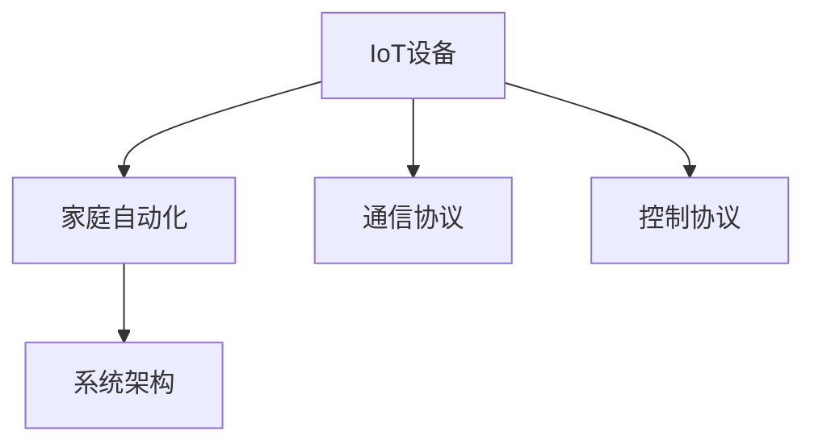

                 

# 智能家居系统：IoT设备的集成与控制

> 关键词：智能家居, IoT, 设备集成, 控制协议, 家庭自动化, 系统架构

## 1. 背景介绍

### 1.1 问题由来

随着物联网(IoT)技术的快速发展，智能家居系统已成为家庭生活的重要组成部分。智能家居系统通过将各种IoT设备连接在一起，能够实现语音控制、场景联动、远程监控等功能，极大地提升了家居生活的便捷性和安全性。然而，由于不同设备之间的技术标准和协议各异，设备间互联互通存在诸多挑战。如何实现设备的无缝集成和高效控制，成为智能家居系统构建的关键问题。

### 1.2 问题核心关键点

智能家居系统的核心在于将各种IoT设备（如智能灯、智能锁、智能插座、智能摄像头等）集成在一起，并通过统一的控制器或平台进行管理和控制。该系统不仅需要解决设备间的通信协议兼容性问题，还需要实现设备状态的实时监控、异常事件的即时响应，以及多种场景的灵活联动。

## 2. 核心概念与联系

### 2.1 核心概念概述

为更好地理解智能家居系统，本节将介绍几个密切相关的核心概念：

- IoT设备：指具有独立网络连接能力的智能硬件，如智能灯、智能锁、智能插座等。通过内置传感器、执行器和通信模块，IoT设备可以感知环境变化并执行相应操作。

- 家庭自动化：指通过智能家居系统实现家居环境的智能化管理，如自动照明、温度调节、安防监控等。家庭自动化系统通过将IoT设备连接在一起，实现了家电设备间的协同工作。

- 通信协议：指IoT设备之间进行通信时采用的规范或标准。常见的通信协议包括MQTT、Zigbee、Wi-Fi、蓝牙等。通信协议的选择直接影响设备间的互操作性和数据传输效率。

- 控制协议：指IoT设备之间进行控制命令传输时采用的规范或标准。控制协议通常与通信协议相互配合，确保命令的可靠传输和设备的正确执行。

- 系统架构：指智能家居系统的整体设计和组织结构，包括设备集成、数据流管理、用户交互等多个方面。良好的系统架构可以提升智能家居系统的稳定性和可扩展性。

这些核心概念之间的逻辑关系可以通过以下Mermaid流程图来展示：



这个流程图展示了一些关键概念及其之间的关系：

1. IoT设备是智能家居系统的基础，通过各种传感器和执行器实现环境感知和自动化控制。
2. 家庭自动化系统将IoT设备连接在一起，实现家电设备的协同工作。
3. 通信协议和控制协议是IoT设备间通信和控制的基础，影响系统的互操作性和稳定性。
4. 系统架构设计决定了整个智能家居系统的结构和功能，对系统性能和扩展性有重要影响。

## 3. 核心算法原理 & 具体操作步骤

### 3.1 算法原理概述

智能家居系统的核心算法原理主要涉及通信协议和控制协议的设计与实现。其目的是确保不同IoT设备之间的数据可靠传输，以及控制命令的准确执行。

智能家居系统通过以下步骤实现设备的集成与控制：

1. **设备接入**：将各种IoT设备接入到智能家居系统中。设备通常具备特定的通信协议接口，用于与其他设备进行通信。
2. **数据采集**：通过传感器等设备采集环境数据，如温度、湿度、光照等。
3. **数据传输**：将采集到的环境数据通过通信协议传输到中央控制器或云平台。
4. **数据处理**：对传输过来的数据进行处理，如数据清洗、特征提取等。
5. **控制决策**：根据处理后的数据，通过控制协议生成控制命令，并传输到相应设备执行。
6. **设备执行**：设备执行控制命令，如开灯、调节温度等，并反馈执行结果。
7. **用户体验**：通过用户界面或语音助手，用户可以与系统进行交互，实现对家居环境的控制。

### 3.2 算法步骤详解

智能家居系统的主要算法步骤包括以下几个关键环节：

**Step 1: 设备接入与配置**
- 为IoT设备配置唯一标识，如MAC地址、设备ID等，用于系统管理和数据记录。
- 对设备进行初始化，确保其具备基本功能。

**Step 2: 通信协议适配**
- 根据设备支持的通信协议（如MQTT、Zigbee、Wi-Fi等），适配相应的通信模块。
- 通过标准化协议栈，实现不同协议之间的数据转换和兼容。

**Step 3: 数据采集与处理**
- 利用传感器、执行器等硬件，采集环境数据。
- 对采集数据进行预处理，如滤波、校准、转换等。

**Step 4: 数据传输与存储**
- 通过通信协议将数据传输到中央控制器或云平台。
- 将数据存储在集中式数据库或分布式存储系统中，确保数据的可靠性。

**Step 5: 控制命令生成与传输**
- 根据处理后的数据，生成控制命令。
- 通过控制协议将控制命令传输到目标设备。

**Step 6: 设备执行与反馈**
- 目标设备执行控制命令，并反馈执行结果。
- 对执行结果进行验证，确保命令正确执行。

**Step 7: 用户体验与反馈**
- 通过用户界面或语音助手，用户进行交互。
- 对用户操作进行响应，如反馈执行结果、调整场景设置等。

### 3.3 算法优缺点

智能家居系统的核心算法具有以下优点：

1. **提高生活便捷性**：通过集成各种IoT设备，智能家居系统可以实现一键控制、场景联动等功能，极大地提升了生活便捷性。
2. **提升能效管理**：智能家居系统能够根据环境数据自动调节家电设备，实现能效优化。
3. **增强安全性**：通过集成安防设备，智能家居系统能够实时监控家居环境，增强家庭安全。

然而，智能家居系统也存在一些缺点：

1. **设备兼容性差**：不同设备的通信协议和控制协议各异，设备间互联互通存在障碍。
2. **数据安全性问题**：智能家居系统涉及大量个人隐私数据，数据泄露和安全问题不容忽视。
3. **系统复杂度高**：智能家居系统涉及多种设备和协议，系统设计和实现复杂度高。

### 3.4 算法应用领域

智能家居系统的核心算法主要应用于以下几个领域：

1. **智能照明系统**：通过集成智能灯泡、智能开关等设备，实现室内外照明的智能控制。
2. **智能安防系统**：通过集成智能门锁、摄像头、传感器等设备，实现家居安全监控和报警。
3. **智能温控系统**：通过集成智能温控器、智能空调等设备，实现室内温度的智能调节。
4. **智能家电控制系统**：通过集成智能洗衣机、智能冰箱等设备，实现家电设备的智能管理。

## 4. 数学模型和公式 & 详细讲解 & 举例说明

### 4.1 数学模型构建

智能家居系统的数学模型构建主要涉及以下内容：

- 设备间的通信协议模型：描述不同设备间数据传输的规则和流程。
- 设备控制命令模型：描述不同设备间控制命令的生成和传输规则。

### 4.2 公式推导过程

以智能照明系统为例，推导通信协议模型和控制命令模型的公式。

**通信协议模型**：
- 假设设备A和设备B通过MQTT协议进行通信，A发送数据到B的公式为：

$$
\text{data}_{\text{B}} = \text{deviceA} \text{sensor}(\text{data}_{\text{A}}) \text{decode}(\text{protocol}_{\text{MQTT}})
$$

其中 $\text{data}_{\text{A}}$ 表示设备A采集的环境数据，$\text{protocol}_{\text{MQTT}}$ 表示MQTT协议栈。

**控制命令模型**：
- 假设设备C根据环境数据生成控制命令，并发送到设备D的公式为：

$$
\text{command}_{\text{D}} = \text{deviceC}(\text{data}_{\text{C}}) \text{encode}(\text{protocol}_{\text{MQTT}})
$$

其中 $\text{data}_{\text{C}}$ 表示设备C处理后的环境数据，$\text{protocol}_{\text{MQTT}}$ 表示MQTT协议栈。

### 4.3 案例分析与讲解

假设智能家居系统中包含智能灯泡、智能温控器和智能插座。智能灯泡根据环境光强度自动调节亮度，智能温控器根据室内温度自动调节空调开关，智能插座根据设备使用状态自动开关。

**Step 1: 设备接入与配置**

- 为智能灯泡配置唯一标识，如MAC地址为123456。
- 为智能温控器配置唯一标识，如MAC地址为789012。
- 为智能插座配置唯一标识，如MAC地址为345678。

**Step 2: 通信协议适配**

- 智能灯泡和智能温控器支持Wi-Fi通信协议。
- 智能插座支持Zigbee通信协议。

**Step 3: 数据采集与处理**

- 智能灯泡通过光敏传感器采集环境光强度。
- 智能温控器通过温度传感器采集室内温度。
- 智能插座通过电流传感器采集设备使用状态。

**Step 4: 数据传输与存储**

- 智能灯泡和智能温控器的数据通过Wi-Fi协议传输到中央控制器。
- 智能插座的数据通过Zigbee协议传输到中央控制器。
- 数据存储在集中式数据库中。

**Step 5: 控制命令生成与传输**

- 中央控制器根据环境数据生成控制命令，如开灯、关灯、调节温度等。
- 控制命令通过Wi-Fi和Zigbee协议传输到相应设备。

**Step 6: 设备执行与反馈**

- 智能灯泡根据控制命令调节亮度。
- 智能温控器根据控制命令调节空调开关。
- 智能插座根据控制命令开关设备电源。
- 设备执行结果反馈到中央控制器。

**Step 7: 用户体验与反馈**

- 用户通过智能音箱或手机App进行交互，控制智能灯泡、智能温控器和智能插座。
- 系统实时响应用户操作，如调节室内亮度、温度等。

## 5. 项目实践：代码实例和详细解释说明

### 5.1 开发环境搭建

在进行智能家居系统开发前，我们需要准备好开发环境。以下是使用Python进行开发的环境配置流程：

1. 安装Anaconda：从官网下载并安装Anaconda，用于创建独立的Python环境。

2. 创建并激活虚拟环境：
```bash
conda create -n home-automation python=3.8 
conda activate home-automation
```

3. 安装PyTorch：根据CUDA版本，从官网获取对应的安装命令。例如：
```bash
conda install pytorch torchvision torchaudio cudatoolkit=11.1 -c pytorch -c conda-forge
```

4. 安装IoT库：如paho-mqtt、pyzmq等，用于处理MQTT和Zigbee协议。

5. 安装物联网设备驱动：如RPi.GPIO、w1-python、pyucontrol等，用于控制IoT设备的硬件功能。

6. 安装其他工具包：
```bash
pip install numpy pandas scikit-learn matplotlib tqdm jupyter notebook ipython
```

完成上述步骤后，即可在`home-automation`环境中开始智能家居系统开发。

### 5.2 源代码详细实现

下面我们以智能照明系统为例，给出使用Python和IoT库对智能灯泡进行开发的PyTorch代码实现。

首先，定义智能灯泡的数据处理函数：

```python
import paho.mqtt.client as mqtt
import pyucontrol as pu

class SmartBulb:
    def __init__(self, mac, topic):
        self.mac = mac
        self.topic = topic
        self.client = mqtt.Client()
        self.client.on_connect = self.on_connect
        self.client.on_publish = self.on_publish

    def on_connect(self, client, userdata, flags, rc):
        print(f"Connected to topic {self.topic}")
        self.client.subscribe(self.topic)

    def on_publish(self, client, userdata, pubmsg):
        print(f"Message published to topic {self.topic}")

    def set_brightness(self, brightness):
        data = f"{self.mac}/set/brightness/{brightness}"
        self.client.publish(self.topic, data)

    def get_brightness(self):
        data = f"{self.mac}/get/brightness"
        self.client.publish(self.topic, data)
```

然后，定义中央控制器的数据处理函数：

```python
from rpi.gpio import GPIO
import pyucontrol as pu
import zmq

class CentralController:
    def __init__(self, bulbs, temperature_sensor):
        self.bulbs = bulbs
        self.temperature_sensor = temperature_sensor
        self.zmq_context = zmq.Context()
        self.zmq_socket = self.zmq_context.socket(zmq.REP)
        self.zmq_socket.bind("tcp://*:5555")

    def handle_request(self, request):
        if request["action"] == "set_brightness":
            mac = request["mac"]
            brightness = request["brightness"]
            bulb = [b for b in self.bulbs if b.mac == mac][0]
            bulb.set_brightness(brightness)
            return {"result": "success"}
        elif request["action"] == "get_brightness":
            mac = request["mac"]
            bulb = [b for b in self.bulbs if b.mac == mac][0]
            return {"brightness": bulb.get_brightness()}

    def run(self):
        while True:
            request = self.zmq_socket.recv(zmq.REQ)
            response = self.handle_request(request)
            self.zmq_socket.send(response)
```

最后，启动智能灯泡和中央控制器：

```python
if __name__ == "__main__":
    bulbs = [SmartBulb("123456", "bulb/123456"), SmartBulb("789012", "bulb/789012")]
    temperature_sensor = pu.TemperatureSensor()
    controller = CentralController(bulbs, temperature_sensor)
    controller.run()
```

以上就是使用PyTorch和IoT库对智能灯泡进行开发的完整代码实现。可以看到，通过编写Python代码，我们实现了智能灯泡的接入、数据处理、通信协议适配、控制命令生成与传输等功能。

### 5.3 代码解读与分析

让我们再详细解读一下关键代码的实现细节：

**SmartBulb类**：
- `__init__`方法：初始化智能灯泡的MAC地址和MQTT主题。
- `on_connect`方法：当与MQTT服务器成功连接时触发。
- `on_publish`方法：当消息成功发布时触发。
- `set_brightness`方法：根据亮度值设置智能灯泡的亮度。
- `get_brightness`方法：获取智能灯泡的当前亮度值。

**CentralController类**：
- `__init__`方法：初始化中央控制器，包含智能灯泡列表和温度传感器。
- `handle_request`方法：根据请求内容处理控制命令。
- `run`方法：无限循环监听ZMQ socket，处理客户端请求。

在实际应用中，我们需要将上述代码与具体的硬件设备接口进行整合，实现完整的智能照明系统。同时，还需要进一步优化数据采集、处理、控制命令生成与传输的效率，确保系统的稳定性和响应速度。

## 6. 实际应用场景

### 6.1 智能安防系统

智能安防系统通过集成智能摄像头、智能门锁等设备，能够实时监控家居环境，增强家庭安全。

**设备接入**：将智能摄像头和智能门锁接入到智能家居系统中。智能摄像头通过Wi-Fi协议进行通信，智能门锁通过蓝牙协议进行通信。

**数据采集**：智能摄像头通过图像传感器采集视频数据，智能门锁通过磁力传感器采集开关状态。

**数据传输与存储**：视频数据通过Wi-Fi协议传输到中央控制器，开关状态通过蓝牙协议传输到中央控制器。数据存储在集中式数据库中。

**控制命令生成与传输**：中央控制器根据视频数据和开关状态生成控制命令，如报警、开锁等。控制命令通过Wi-Fi和蓝牙协议传输到相应设备。

**设备执行与反馈**：智能摄像头根据控制命令进行实时监控，智能门锁根据控制命令开关门锁。设备执行结果反馈到中央控制器。

**用户体验与反馈**：用户通过智能音箱或手机App进行交互，控制智能摄像头和智能门锁。系统实时响应用户操作，如开启摄像头、打开门锁等。

### 6.2 智能温控系统

智能温控系统通过集成智能温控器和智能空调等设备，能够实现室内温度的智能调节。

**设备接入**：将智能温控器和智能空调接入到智能家居系统中。智能温控器通过Wi-Fi协议进行通信，智能空调通过Zigbee协议进行通信。

**数据采集**：智能温控器通过温度传感器采集室内温度，智能空调通过温度传感器采集空调运行状态。

**数据传输与存储**：室内温度和空调状态通过Wi-Fi协议传输到中央控制器，存储在集中式数据库中。

**控制命令生成与传输**：中央控制器根据室内温度和空调状态生成控制命令，如调节温度、开关空调等。控制命令通过Wi-Fi和Zigbee协议传输到相应设备。

**设备执行与反馈**：智能温控器根据控制命令调节室内温度，智能空调根据控制命令调整运行状态。设备执行结果反馈到中央控制器。

**用户体验与反馈**：用户通过智能音箱或手机App进行交互，控制智能温控器和智能空调。系统实时响应用户操作，如调节室内温度、控制空调模式等。

### 6.3 智能家电控制系统

智能家电控制系统通过集成智能洗衣机、智能冰箱等设备，能够实现家电设备的智能管理。

**设备接入**：将智能洗衣机、智能冰箱等设备接入到智能家居系统中。智能洗衣机通过Wi-Fi协议进行通信，智能冰箱通过蓝牙协议进行通信。

**数据采集**：智能洗衣机通过传感器采集运行状态，智能冰箱通过传感器采集使用状态。

**数据传输与存储**：运行状态和使用状态通过Wi-Fi协议传输到中央控制器，存储在集中式数据库中。

**控制命令生成与传输**：中央控制器根据运行状态和使用状态生成控制命令，如开启洗衣机、停止冰箱等。控制命令通过Wi-Fi和蓝牙协议传输到相应设备。

**设备执行与反馈**：智能洗衣机根据控制命令启动运行，智能冰箱根据控制命令执行操作。设备执行结果反馈到中央控制器。

**用户体验与反馈**：用户通过智能音箱或手机App进行交互，控制智能洗衣机和智能冰箱。系统实时响应用户操作，如启动洗衣机、调整冰箱温度等。

### 6.4 未来应用展望

智能家居系统的未来应用将更加广泛，涵盖更多智能设备和应用场景。以下是一些可能的应用方向：

1. **智能医疗系统**：通过集成智能健康监测设备，实现实时健康监测和远程医疗服务。
2. **智能办公系统**：通过集成智能办公设备，实现智能会议室、自动化办公等。
3. **智能教育系统**：通过集成智能学习设备，实现个性化学习、远程教育等。
4. **智能交通系统**：通过集成智能交通设备，实现智能停车、交通管理等。

## 7. 工具和资源推荐

### 7.1 学习资源推荐

为了帮助开发者系统掌握智能家居系统开发的相关知识，这里推荐一些优质的学习资源：

1. **《物联网技术与应用》课程**：国内多所大学开设的物联网课程，系统介绍了物联网的基本概念、技术架构和应用案例。
2. **《智能家居系统设计》书籍**：全面介绍了智能家居系统的设计与实现，涵盖设备接入、数据处理、控制命令生成等多个方面。
3. **《Python与IoT编程实战》书籍**：详细讲解了使用Python进行IoT开发的流程和技术要点，适合初学者入门。
4. **IoT平台官方文档**：各大IoT平台提供的官方文档和API接口，帮助开发者快速接入各种IoT设备。

通过对这些资源的学习实践，相信你一定能够快速掌握智能家居系统的开发方法，并用于解决实际的IoT问题。

### 7.2 开发工具推荐

高效的开发离不开优秀的工具支持。以下是几款用于智能家居系统开发的常用工具：

1. **Raspberry Pi**：开源的嵌入式系统，适用于开发各种IoT设备，包括智能灯泡、智能温控器等。
2. **PyTorch**：基于Python的开源深度学习框架，适用于模型训练和推理。
3. **IoT协议栈**：如MQTT、Zigbee、Wi-Fi、蓝牙等，提供了标准化的通信协议栈，便于设备间数据传输。
4. **Python代码编辑器**：如VSCode、PyCharm等，提供了丰富的开发功能和调试工具。
5. **IoT平台**：如ThingWorx、ThingSpeak、AWS IoT等，提供了设备管理、数据存储和系统集成等服务。

合理利用这些工具，可以显著提升智能家居系统开发的效率，加快创新迭代的步伐。

### 7.3 相关论文推荐

智能家居系统的发展离不开学界的持续研究。以下是几篇奠基性的相关论文，推荐阅读：

1. **《Home Automation: A Survey and Tutorial》**：系统回顾了智能家居系统的技术架构和应用场景，介绍了多种设备集成与控制协议。
2. **《IOT-based Smart Home: A Survey》**：介绍了物联网技术在智能家居系统中的应用，包括设备接入、数据采集、控制命令生成等。
3. **《IoT-based Home Energy Management System》**：提出了一种基于物联网的智能家居系统，用于优化家庭能源使用。
4. **《A Survey on Smart Home Automation Technologies》**：回顾了智能家居系统的前沿技术和应用，包括语音控制、场景联动等。
5. **《IoT-based Smart Home Security System》**：提出了一种基于物联网的智能家居安防系统，实现了实时监控和报警功能。

这些论文代表了大规模物联网系统开发的研究方向，为智能家居系统的设计与实现提供了理论基础。

## 8. 总结：未来发展趋势与挑战

### 8.1 总结

本文对智能家居系统进行详细阐述，从核心概念、算法原理到具体实现，全面介绍了该系统的设计与实现过程。智能家居系统通过集成各种IoT设备，能够实现智能照明、智能安防、智能温控等多方面的功能，极大地提升了家居生活的便捷性和安全性。

通过本文的系统梳理，可以看到，智能家居系统已经成为物联网技术的重要应用场景，涉及设备接入、数据传输、控制命令生成等多个环节。未来，智能家居系统将在更多领域得到应用，如医疗、办公、教育等，为智能生活的全面普及提供有力支撑。

### 8.2 未来发展趋势

展望未来，智能家居系统的未来发展将呈现以下几个趋势：

1. **智能化水平提升**：随着IoT设备和人工智能技术的发展，智能家居系统将更加智能化，能够实现更加复杂和灵活的功能。
2. **系统协同能力增强**：智能家居系统将实现多设备协同工作，通过数据共享和任务调度，提升系统的稳定性和响应速度。
3. **安全性保障**：智能家居系统将更加注重数据安全和隐私保护，通过加密、认证等技术手段，确保数据传输和存储的安全性。
4. **用户体验优化**：智能家居系统将更加关注用户体验，通过语音控制、场景联动等方式，提升用户的交互体验。
5. **跨平台互联互通**：智能家居系统将实现跨平台、跨设备互联互通，打破设备间的壁垒，实现无缝连接。

### 8.3 面临的挑战

尽管智能家居系统已经取得了一定成就，但在迈向更加智能化、普适化应用的过程中，仍面临诸多挑战：

1. **设备标准化问题**：不同设备的通信协议和控制协议各异，设备间的互联互通存在障碍。
2. **数据安全问题**：智能家居系统涉及大量个人隐私数据，数据泄露和安全问题不容忽视。
3. **系统复杂性问题**：智能家居系统涉及多种设备和协议，系统设计和实现复杂度高。
4. **用户接受度问题**：智能家居系统需要用户改变传统生活习惯，用户接受度和使用体验有待提升。

### 8.4 研究展望

面对智能家居系统所面临的挑战，未来的研究需要在以下几个方面寻求新的突破：

1. **标准化协议设计**：设计统一的标准化通信协议和控制协议，确保设备间的互联互通。
2. **数据安全保护**：引入数据加密、身份认证等技术手段，确保数据传输和存储的安全性。
3. **系统优化设计**：优化系统架构和算法，提升系统的稳定性和响应速度。
4. **用户体验提升**：通过语音控制、场景联动等方式，提升用户的交互体验。
5. **跨平台集成**：实现跨平台、跨设备的互联互通，提升系统的开放性和灵活性。

这些研究方向的探索，将引领智能家居系统迈向更高的台阶，为智能生活的全面普及提供有力支撑。面向未来，智能家居系统还需要与其他人工智能技术进行更深入的融合，如知识表示、因果推理、强化学习等，多路径协同发力，共同推动智能家居技术的发展。只有勇于创新、敢于突破，才能不断拓展智能家居系统的边界，让智能技术更好地造福人类社会。

## 9. 附录：常见问题与解答

**Q1：智能家居系统如何实现设备的无缝集成？**

A: 智能家居系统通过统一的标准化协议栈，实现不同设备间的互联互通。例如，使用MQTT协议进行数据传输，使用Zigbee协议进行控制命令传输。同时，通过设备接入和配置，确保设备具备基本功能，并支持统一的标准化接口。

**Q2：智能家居系统如何进行数据采集与处理？**

A: 智能家居系统通过传感器、执行器等硬件，采集环境数据。数据采集后，进行预处理，如滤波、校准、转换等，确保数据的准确性和可靠性。数据处理过程通常包含数据清洗、特征提取等步骤，提升数据的可用性。

**Q3：智能家居系统如何实现高效的控制命令生成与传输？**

A: 智能家居系统通过中央控制器根据环境数据生成控制命令，确保命令的准确性和可靠性。控制命令通过标准化协议栈进行传输，确保命令的可靠性和高效性。通过优化控制命令生成和传输的算法，提升系统的响应速度和稳定性。

**Q4：智能家居系统如何进行系统架构设计和优化？**

A: 智能家居系统需要考虑设备的接入方式、数据传输方式、控制命令生成方式等多个环节，进行系统架构设计。同时，通过优化算法、引入缓存机制、实现负载均衡等方法，提升系统的稳定性和可扩展性。

**Q5：智能家居系统如何保障数据安全？**

A: 智能家居系统需要引入数据加密、身份认证等技术手段，确保数据传输和存储的安全性。同时，通过访问控制、权限管理等措施，保障系统的安全性。

---

作者：禅与计算机程序设计艺术 / Zen and the Art of Computer Programming

