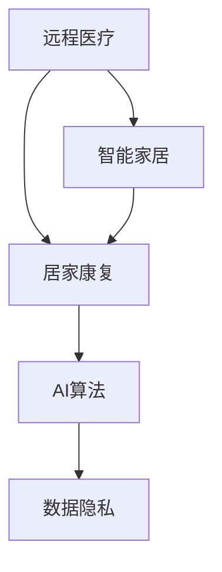

                 

# 智能居家康复创业：远程医疗的家庭延伸

## 1. 背景介绍

### 1.1 问题由来
随着全球人口老龄化和健康问题日益突出，传统的医疗服务模式已经无法满足日益增长的医疗需求。尤其在家庭康复和慢性病管理等领域，现有医疗体系面临资源不足、服务脱节等问题。与此同时，随着5G、物联网、AI等新兴技术的发展，远程医疗的潜力逐步被发掘。智能居家康复创业，旨在利用这些先进技术，为患者提供便捷、个性化的居家康复服务。

### 1.2 问题核心关键点
智能居家康复创业的核心在于如何将远程医疗技术与家庭康复无缝结合，提供高效、安全、个性化的服务。具体而言，包括以下几个关键点：
- **远程医疗技术**：通过远程监控、远程诊断、远程干预等手段，实时获取患者健康数据，提供专业医疗建议。
- **智能家居设备**：结合智能传感器、可穿戴设备等，实时监测患者生理指标，触发紧急报警。
- **个性化康复计划**：利用AI算法分析患者数据，制定个性化的康复方案，提升治疗效果。
- **数据隐私保护**：确保患者健康数据的安全存储和传输，防止隐私泄露。

### 1.3 问题研究意义
智能居家康复创业不仅能够有效缓解医疗资源紧张的问题，提升患者康复效果，还具有广阔的市场潜力和商业价值。它有望成为未来医疗健康行业的重要发展方向，促进智慧健康产业的创新和升级。

## 2. 核心概念与联系

### 2.1 核心概念概述

为了更好地理解智能居家康复创业的技术架构和方法，本节将介绍几个关键核心概念：

- **远程医疗**：通过网络将医疗服务延伸到患者家中，实现远程诊断、远程监控和远程干预等功能。
- **智能家居**：利用物联网技术，将家电、家具等设备连接，实现智能控制和自动化管理。
- **居家康复**：通过远程医疗和智能家居，为患者提供连续、个性化的康复护理服务。
- **AI算法**：利用机器学习、深度学习等算法，对患者数据进行分析处理，提供精准的医疗建议。
- **数据隐私**：保护患者隐私数据，确保数据传输和存储的安全性。

这些核心概念之间的逻辑关系可以通过以下Mermaid流程图来展示：



这个流程图展示出智能居家康复创业的关键技术环节：

1. 远程医疗通过网络将医疗服务延伸到患者家中。
2. 智能家居利用物联网技术，实现设备的智能控制。
3. 居家康复通过远程医疗和智能家居，提供个性化康复服务。
4. AI算法对患者数据进行分析，提升康复效果。
5. 数据隐私确保患者数据的安全。

## 3. 核心算法原理 & 具体操作步骤

### 3.1 算法原理概述

智能居家康复创业的算法原理，主要基于远程医疗和智能家居的融合，以及AI算法的数据分析处理能力。具体而言，包括以下几个关键环节：

1. **数据采集与传输**：通过智能传感器、可穿戴设备等采集患者生理数据，利用5G等网络技术传输至远程医疗平台。
2. **远程诊断与干预**：利用AI算法对采集数据进行分析，提供远程诊断和干预建议。
3. **个性化康复方案**：结合患者病情、生活习惯等，制定个性化的康复计划，并通过智能家居设备辅助实施。
4. **数据隐私保护**：采用加密、匿名化等技术，确保患者数据的安全传输和存储。

### 3.2 算法步骤详解

智能居家康复创业的算法实现步骤如下：

**Step 1: 数据采集与传输**
- 部署智能传感器和可穿戴设备，实时监测患者生理指标（如心率、血压、血糖等）。
- 利用5G网络技术，将采集的数据实时传输至远程医疗平台。

**Step 2: 远程诊断与干预**
- 在远程医疗平台上，采用AI算法对患者数据进行分析，识别异常情况。
- 利用远程视频通话、AI辅助诊断等技术，提供远程医疗咨询和干预建议。

**Step 3: 个性化康复方案**
- 结合患者病情、生活习惯等数据，利用AI算法分析生成个性化的康复方案。
- 通过智能家居设备的联动，实施康复方案，如自动调整床垫硬度、提醒服药等。

**Step 4: 数据隐私保护**
- 采用数据加密、匿名化处理等技术，确保患者数据的隐私安全。
- 建立严格的访问控制机制，防止未经授权的人员访问患者数据。

### 3.3 算法优缺点

智能居家康复创业的算法有以下优点：

- **高效便捷**：利用远程医疗和智能家居技术，实现全天候健康监测和康复服务，极大提升患者便利性。
- **精准个性化**：结合患者数据，通过AI算法分析生成个性化康复方案，提升治疗效果。
- **资源优化**：减少对医疗机构资源的依赖，降低医疗成本。

同时，该算法也存在以下局限性：

- **技术门槛高**：涉及远程医疗、物联网、AI等多个领域，技术实现复杂，需要多学科融合。
- **数据隐私风险**：患者数据的安全传输和存储需严格保护，防止隐私泄露。
- **设备成本高**：智能传感器、可穿戴设备等硬件成本较高，可能影响推广应用。

### 3.4 算法应用领域

智能居家康复创业的算法主要应用于以下几个领域：

1. **慢性病管理**：为心脏病、糖尿病等慢性病患者提供连续、个性化的康复护理服务。
2. **老年康复**：为老年人提供远程医疗咨询和智能家居设备的辅助，提升生活质量。
3. **残疾人康复**：为残疾人提供个性化的康复方案和智能家居设备的支持，促进其独立生活。
4. **急性病康复**：为手术后或急性病患者提供远程监控和干预，促进快速康复。
5. **心理健康**：利用远程医疗和智能家居技术，提供心理健康监测和干预，预防心理疾病。

## 4. 数学模型和公式 & 详细讲解 & 举例说明

### 4.1 数学模型构建

智能居家康复创业的数学模型构建，主要基于机器学习、深度学习和自然语言处理等多个领域的算法。

假设患者数据集为 $D=\{(x_i,y_i)\}_{i=1}^N$，其中 $x_i$ 为患者数据（如心率、血压等），$y_i$ 为相应的康复建议（如服药、休息等）。我们的目标是通过机器学习模型 $M_{\theta}$ 预测康复建议，即最小化损失函数 $\mathcal{L}(M_{\theta},D)$。

常用的损失函数包括交叉熵损失、均方误差损失等。以交叉熵损失为例，其公式为：

$$
\mathcal{L}(M_{\theta},D) = -\frac{1}{N}\sum_{i=1}^N y_i \log M_{\theta}(x_i) + (1-y_i)\log(1-M_{\theta}(x_i))
$$

### 4.2 公式推导过程

以一个简单的患者监测系统为例，说明基于机器学习模型的康复方案生成过程。

假设患者数据 $x_i$ 为一个一维向量，康复建议 $y_i$ 为二分类问题（如是否服药）。利用二分类支持向量机（SVM）作为模型 $M_{\theta}$，其预测函数为 $M_{\theta}(x_i)=sign(\sum_{j=1}^n w_j x_{ij} + b)$，其中 $w_j$ 和 $b$ 为模型参数。

通过最小化损失函数，求解得到最优模型参数：

$$
\theta^* = \mathop{\arg\min}_{\theta} \mathcal{L}(M_{\theta},D) = \mathop{\arg\min}_{\theta} \frac{1}{N}\sum_{i=1}^N \Big[y_i \log M_{\theta}(x_i) + (1-y_i)\log(1-M_{\theta}(x_i))\Big]
$$

通过求解上述优化问题，即可得到患者数据与康复建议之间的关系模型。

### 4.3 案例分析与讲解

以一个实际案例来说明智能居家康复创业的算法应用：

**案例背景**：一名糖尿病患者，需定期监测血糖水平，并根据血糖值调整饮食和运动计划。

**算法实现**：
1. 部署智能血糖监测仪，实时采集患者血糖数据。
2. 利用5G网络传输数据至远程医疗平台。
3. 在平台上采用支持向量机模型，对患者血糖数据进行分析。
4. 根据分析结果，生成个性化的饮食和运动建议，并通过智能家居设备（如智能音箱）进行提醒。

**效果评估**：
- 通过对比患者自我监测和系统推荐的血糖值，评估系统推荐准确率。
- 收集患者反馈，评估其对系统推荐的接受度和使用便捷性。

## 5. 项目实践：代码实例和详细解释说明

### 5.1 开发环境搭建

在进行智能居家康复创业的算法实践前，我们需要准备好开发环境。以下是使用Python进行PyTorch开发的环境配置流程：

1. 安装Anaconda：从官网下载并安装Anaconda，用于创建独立的Python环境。

2. 创建并激活虚拟环境：
```bash
conda create -n pytorch-env python=3.8 
conda activate pytorch-env
```

3. 安装PyTorch：根据CUDA版本，从官网获取对应的安装命令。例如：
```bash
conda install pytorch torchvision torchaudio cudatoolkit=11.1 -c pytorch -c conda-forge
```

4. 安装TensorFlow：
```bash
pip install tensorflow==2.7.0
```

5. 安装Flask：用于搭建Web服务。
```bash
pip install flask
```

6. 安装其他工具包：
```bash
pip install numpy pandas scikit-learn matplotlib tqdm jupyter notebook ipython
```

完成上述步骤后，即可在`pytorch-env`环境中开始项目实践。

### 5.2 源代码详细实现

以下是基于智能居家康复创业的示例代码实现，以患者血糖监测系统为例：

```python
from flask import Flask, request, jsonify
from sklearn.svm import SVC
import numpy as np
import pandas as pd

app = Flask(__name__)

# 加载训练好的模型
model = SVC()
with open('svm_model.pkl', 'rb') as f:
    model.load(f)

@app.route('/predict', methods=['POST'])
def predict():
    data = request.json
    # 提取血糖数据
    x = np.array([data['glucose']])
    # 预测康复建议
    y_pred = model.predict(x)
    return jsonify(y_pred[0])

if __name__ == '__main__':
    app.run(debug=True)
```

### 5.3 代码解读与分析

让我们再详细解读一下关键代码的实现细节：

**Flask框架**：
- 通过Flask框架，搭建Web服务，提供API接口供前端调用。
- `@app.route` 装饰器定义API接口路径。
- `request` 对象获取客户端发送的JSON数据。

**模型加载与预测**：
- 使用SVM模型加载训练好的参数，并应用到患者数据上进行预测。
- `np.array` 将数据转换为Numpy数组，便于模型处理。
- `model.predict` 对患者数据进行预测，返回康复建议。

**API响应**：
- 通过 `jsonify` 将预测结果转换为JSON格式，返回给客户端。

**运行结果展示**：
```python
from flask import Flask, request, jsonify
from sklearn.svm import SVC
import numpy as np
import pandas as pd

app = Flask(__name__)

# 加载训练好的模型
model = SVC()
with open('svm_model.pkl', 'rb') as f:
    model.load(f)

@app.route('/predict', methods=['POST'])
def predict():
    data = request.json
    # 提取血糖数据
    x = np.array([data['glucose']])
    # 预测康复建议
    y_pred = model.predict(x)
    return jsonify(y_pred[0])

if __name__ == '__main__':
    app.run(debug=True)
```

可以看到，Flask框架使得搭建Web服务变得简洁高效。开发者可以将更多精力放在模型训练和数据处理等核心逻辑上，而不必过多关注底层的实现细节。

当然，在实际应用中，还需要考虑更多因素，如用户接口、安全认证、数据存储等。但核心的算法实现基本与此类似。

## 6. 实际应用场景

### 6.1 智能居家康复系统

智能居家康复系统是智能居家康复创业的核心应用场景。它通过结合远程医疗和智能家居技术，为患者提供全天候、个性化的康复护理服务。

具体而言，智能居家康复系统包括以下几个关键组件：

1. **智能传感器**：部署在患者家中，实时监测生理指标（如心率、血压、血糖等）。
2. **可穿戴设备**：如智能手环、智能手表，实时监测患者活动数据，生成健康报告。
3. **远程医疗平台**：提供数据存储、分析、诊断和干预等服务。
4. **智能家居设备**：如智能音箱、智能灯光，根据康复方案自动调整环境。
5. **个性化康复方案**：通过AI算法分析患者数据，制定个性化的康复计划，并同步至智能家居设备。

智能居家康复系统能够实时监测患者健康状况，及时响应异常情况，提供专业医疗建议和康复指导，提升患者康复效果和生活质量。

### 6.2 远程医疗咨询

远程医疗咨询是智能居家康复创业的重要应用之一。通过智能家居设备和远程医疗平台，医生和患者可以进行实时视频通话，提供远程诊断和干预建议。

具体而言，远程医疗咨询包括以下几个关键环节：

1. **视频通话**：通过视频通话，医生可以实时观察患者情况，进行远程诊断和干预。
2. **医疗数据共享**：患者可以将智能传感器和可穿戴设备采集的数据实时传输至远程医疗平台，供医生参考。
3. **AI辅助诊断**：利用AI算法对患者数据进行分析，辅助医生做出精准诊断。
4. **健康报告生成**：根据患者数据和诊断结果，生成健康报告，提供详细的康复建议。

远程医疗咨询能够有效缓解医疗资源紧张的问题，提升患者康复效果，特别适合偏远地区和特殊人群。

### 6.3 智能家居设备联动

智能家居设备联动是智能居家康复创业的重要技术实现手段。通过智能家居设备和远程医疗平台的协同工作，可以提供更加智能化、个性化的康复服务。

具体而言，智能家居设备联动包括以下几个关键环节：

1. **设备联动**：智能家居设备（如智能音箱、智能灯光、智能床垫）根据康复方案自动调整环境，提升患者舒适度和健康状况。
2. **数据分析**：利用AI算法对智能家居设备采集的数据进行分析，优化康复方案。
3. **用户反馈**：收集患者对康复方案的反馈，不断优化设备联动效果。
4. **设备维护**：定期检测智能家居设备的运行状态，确保其正常工作。

智能家居设备联动能够提升患者的居家体验，促进其积极参与康复过程，增强康复效果。

### 6.4 未来应用展望

随着5G、物联网、AI等技术的不断进步，智能居家康复创业具有广阔的市场前景和应用空间。未来，该领域将面临以下几个主要发展趋势：

1. **技术融合**：智能居家康复创业将与其他新兴技术如5G、AIoT（人工智能物联网）等进行深度融合，提升系统的智能化水平。
2. **数据共享**：智能居家康复创业将与其他健康信息平台如电子病历、基因检测等进行数据共享，提供更全面的健康管理服务。
3. **服务普及**：随着技术成本的降低和用户接受度的提高，智能居家康复创业将逐步普及到更多家庭，提升整体健康水平。
4. **个性化定制**：通过AI算法分析用户数据，提供更加个性化的康复方案，提升用户满意度。
5. **跨界合作**：智能居家康复创业将与保险公司、养老机构等进行合作，提供更全面的健康保障服务。

未来，智能居家康复创业将逐步成为家庭健康管理的重要手段，为人类健康事业带来深远影响。

## 7. 工具和资源推荐

### 7.1 学习资源推荐

为了帮助开发者系统掌握智能居家康复创业的理论基础和实践技巧，这里推荐一些优质的学习资源：

1. **《机器学习实战》**：斯坦福大学机器学习课程，全面介绍了机器学习的基本概念和实践技巧，适合入门学习。
2. **《深度学习》**：Deep Learning Specialization课程，由Andrew Ng主讲，深入浅出地介绍了深度学习的基本原理和应用方法。
3. **《TensorFlow实战》**：TensorFlow官方文档，提供了丰富的实战示例和教程，适合快速上手TensorFlow开发。
4. **《Flask Web开发》**：Flask官方文档，提供了详细的Web开发指南和最佳实践，适合快速上手Web开发。
5. **《Python数据科学手册》**：全面介绍了Python在数据科学中的应用，适合数据处理和分析。

通过学习这些资源，相信你一定能够快速掌握智能居家康复创业的理论基础和实践技巧，并用于解决实际的医疗问题。

### 7.2 开发工具推荐

高效的开发离不开优秀的工具支持。以下是几款用于智能居家康复创业开发的常用工具：

1. **Jupyter Notebook**：免费的Jupyter Notebook环境，支持Python和R等语言，适合快速迭代研究。
2. **Anaconda**：强大的Python环境管理工具，支持多语言和库的快速安装和部署。
3. **TensorBoard**：TensorFlow配套的可视化工具，可实时监测模型训练状态，提供丰富的图表呈现方式。
4. **Weights & Biases**：模型训练的实验跟踪工具，可以记录和可视化模型训练过程中的各项指标，方便对比和调优。
5. **PyTorch Lightning**：轻量级的PyTorch框架，提供了简单易用的API和高效的训练加速器。

合理利用这些工具，可以显著提升智能居家康复创业的开发效率，加快创新迭代的步伐。

### 7.3 相关论文推荐

智能居家康复创业的研究源于学界的持续研究。以下是几篇奠基性的相关论文，推荐阅读：

1. **《远程医疗：现状、挑战与未来》**：总结了远程医疗的发展历程和现状，探讨了面临的挑战和未来的发展方向。
2. **《智能家居技术及其应用》**：介绍了智能家居技术的基本原理和应用案例，为智能居家康复创业提供了技术基础。
3. **《深度学习在医疗健康领域的应用》**：总结了深度学习在医疗健康领域的应用，包括图像识别、语音识别、自然语言处理等。
4. **《基于智能家居的慢性病管理研究》**：介绍了智能家居设备在慢性病管理中的应用，为智能居家康复创业提供了实践案例。
5. **《面向家庭的远程医疗系统设计与实现》**：介绍了远程医疗系统在家庭中的应用，为智能居家康复创业提供了系统架构。

这些论文代表了大语言模型微调技术的发展脉络。通过学习这些前沿成果，可以帮助研究者把握学科前进方向，激发更多的创新灵感。

## 8. 总结：未来发展趋势与挑战

### 8.1 总结

本文对智能居家康复创业的算法原理和操作步骤进行了全面系统的介绍。首先阐述了智能居家康复创业的背景和意义，明确了其在缓解医疗资源紧张、提升患者康复效果方面的独特价值。其次，从原理到实践，详细讲解了智能居家康复创业的算法实现流程，给出了实际项目开发的代码实例。同时，本文还广泛探讨了智能居家康复创业在智能居家康复系统、远程医疗咨询、智能家居设备联动等多个应用场景中的具体实现，展示了智能居家康复创业的广阔应用前景。此外，本文精选了智能居家康复创业的学习资源、开发工具和相关论文，力求为读者提供全方位的技术指引。

通过本文的系统梳理，可以看到，智能居家康复创业是一项技术密集型的创新项目，涉及远程医疗、智能家居、AI算法等多个领域。它有望成为未来医疗健康行业的重要发展方向，为人类健康事业带来深远影响。

### 8.2 未来发展趋势

展望未来，智能居家康复创业将呈现以下几个发展趋势：

1. **技术融合**：智能居家康复创业将与其他新兴技术如5G、AIoT（人工智能物联网）等进行深度融合，提升系统的智能化水平。
2. **数据共享**：智能居家康复创业将与其他健康信息平台如电子病历、基因检测等进行数据共享，提供更全面的健康管理服务。
3. **服务普及**：随着技术成本的降低和用户接受度的提高，智能居家康复创业将逐步普及到更多家庭，提升整体健康水平。
4. **个性化定制**：通过AI算法分析用户数据，提供更加个性化的康复方案，提升用户满意度。
5. **跨界合作**：智能居家康复创业将与保险公司、养老机构等进行合作，提供更全面的健康保障服务。

以上趋势凸显了智能居家康复创业的广阔前景。这些方向的探索发展，必将进一步提升智能居家康复创业的性能和应用范围，为人类健康事业带来深远影响。

### 8.3 面临的挑战

尽管智能居家康复创业技术已经取得了显著进展，但在迈向更加智能化、普适化应用的过程中，它仍面临诸多挑战：

1. **技术门槛高**：涉及远程医疗、智能家居、AI等多个领域，技术实现复杂，需要多学科融合。
2. **数据隐私风险**：患者数据的安全传输和存储需严格保护，防止隐私泄露。
3. **设备成本高**：智能传感器、可穿戴设备等硬件成本较高，可能影响推广应用。
4. **数据质量差**：智能家居设备采集的数据质量不稳定，影响系统预测准确率。
5. **系统复杂度高**：智能居家康复创业涉及多个系统组件，集成和调试复杂，易出现兼容性问题。
6. **用户接受度低**：部分用户对新技术接受度较低，可能影响系统推广。

### 8.4 研究展望

面对智能居家康复创业所面临的种种挑战，未来的研究需要在以下几个方面寻求新的突破：

1. **技术优化**：通过优化算法和系统架构，提升智能居家康复创业的性能和稳定性。
2. **数据隐私保护**：采用更先进的数据加密和匿名化技术，确保患者数据的安全。
3. **设备成本降低**：通过技术创新和市场化推广，降低智能家居设备的成本，提高用户接受度。
4. **数据质量提升**：优化智能家居设备的数据采集和处理算法，提升数据质量。
5. **系统集成优化**：通过统一的API接口和标准化协议，优化系统集成，提高系统兼容性。
6. **用户教育**：加强用户教育和培训，提升用户对智能居家康复创业的认知和接受度。

这些研究方向的探索，必将引领智能居家康复创业技术迈向更高的台阶，为人类健康事业带来新的突破。

## 9. 附录：常见问题与解答

**Q1：智能居家康复创业的算法原理是什么？**

A: 智能居家康复创业的算法原理主要基于远程医疗和智能家居的融合，以及AI算法的数据分析处理能力。通过部署智能传感器和可穿戴设备，实时采集患者生理指标和活动数据，利用5G网络传输至远程医疗平台。在平台上，利用AI算法对患者数据进行分析，提供远程诊断和干预建议，并根据康复方案自动调整智能家居设备，提升患者康复效果和生活质量。

**Q2：智能居家康复创业的核心技术有哪些？**

A: 智能居家康复创业的核心技术主要包括：
1. 远程医疗技术：通过网络将医疗服务延伸到患者家中，实现远程诊断、远程监控和远程干预。
2. 智能家居技术：利用物联网技术，将家电、家具等设备连接，实现智能控制和自动化管理。
3. AI算法：利用机器学习、深度学习等算法，对患者数据进行分析处理，提供精准的医疗建议。
4. 数据隐私保护：采用加密、匿名化等技术，确保患者数据的安全传输和存储。

**Q3：智能居家康复创业的实施步骤是什么？**

A: 智能居家康复创业的实施步骤包括：
1. 部署智能传感器和可穿戴设备，实时监测患者生理指标和活动数据。
2. 利用5G网络传输数据至远程医疗平台。
3. 在平台上采用AI算法对患者数据进行分析，提供远程诊断和干预建议。
4. 根据康复方案，自动调整智能家居设备。
5. 收集患者反馈，不断优化康复方案和设备联动效果。

**Q4：智能居家康复创业的优缺点是什么？**

A: 智能居家康复创业的优点包括：
1. 高效便捷：通过远程医疗和智能家居技术，实现全天候健康监测和康复服务，极大提升患者便利性。
2. 精准个性化：结合患者数据，通过AI算法分析生成个性化康复方案，提升治疗效果。
3. 资源优化：减少对医疗机构资源的依赖，降低医疗成本。

缺点包括：
1. 技术门槛高：涉及远程医疗、智能家居、AI等多个领域，技术实现复杂，需要多学科融合。
2. 数据隐私风险：患者数据的安全传输和存储需严格保护，防止隐私泄露。
3. 设备成本高：智能传感器、可穿戴设备等硬件成本较高，可能影响推广应用。

**Q5：智能居家康复创业的未来发展方向是什么？**

A: 智能居家康复创业的未来发展方向包括：
1. 技术融合：智能居家康复创业将与其他新兴技术如5G、AIoT（人工智能物联网）等进行深度融合，提升系统的智能化水平。
2. 数据共享：智能居家康复创业将与其他健康信息平台如电子病历、基因检测等进行数据共享，提供更全面的健康管理服务。
3. 服务普及：随着技术成本的降低和用户接受度的提高，智能居家康复创业将逐步普及到更多家庭，提升整体健康水平。
4. 个性化定制：通过AI算法分析用户数据，提供更加个性化的康复方案，提升用户满意度。
5. 跨界合作：智能居家康复创业将与保险公司、养老机构等进行合作，提供更全面的健康保障服务。

---

作者：禅与计算机程序设计艺术 / Zen and the Art of Computer Programming

