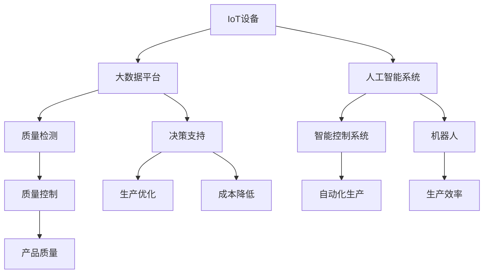

                 

## 1. 背景介绍

### 1.1 问题由来

随着全球经济一体化的加速和全球制造业竞争的加剧，提升工厂的生产效率、降低成本、提升产品质量已成为各制造业企业迫切需求。传统的生产方式依赖大量的人力、物力投入，管理成本高、效率低。信息技术的高速发展为智能制造提供了新的可能性，使得生产过程的自动化和数据驱动成为可能。

近年来，“智能工厂”一词频繁出现在业界、媒体和政府政策文件中，成为推动制造业智能化升级的关键概念。智能工厂通过应用物联网、大数据、人工智能等先进技术，实现生产流程的自动化、数据化、精准化，提高生产效率，降低生产成本，提升产品质量，助力制造业的转型升级。

### 1.2 问题核心关键点

智能工厂的核心在于以下几个关键点：

1. **自动化生产流程**：通过引入机器人、自动化设备、自动化生产线和智能控制系统，实现生产过程的全自动化，减少人工干预，提高生产效率和精度。
2. **数据驱动决策**：收集生产全过程的数据，运用大数据分析、机器学习等技术，对生产过程进行监控和优化，提升决策的科学性和准确性。
3. **灵活调整生产**：通过数据分析和预测，及时调整生产计划和生产资源配置，实现柔性生产，提升应对市场变化的能力。
4. **设备健康管理**：通过实时监控设备状态和运行数据，预测设备故障，实现设备的全生命周期管理，减少停机时间，提升生产线的稳定性。
5. **质量检测和控制**：应用计算机视觉、传感器等技术，实现对产品质量的自动检测和控制，减少人工检测的误差，提升产品质量的一致性。

这些关键点共同构成了智能工厂的核心框架，使得传统工厂向智能工厂转型成为可能。通过理解这些关键点，可以更好地把握智能工厂的构建思路和技术手段。

### 1.3 问题研究意义

研究智能工厂的解决方案，对于提升制造业企业的生产效率、降低成本、提升产品质量，具有重要意义：

1. **提高生产效率**：通过自动化生产流程，实现生产线的全自动化，减少人工干预，提升生产效率。
2. **降低生产成本**：通过数据驱动决策，优化生产流程，减少资源浪费，降低生产成本。
3. **提升产品质量**：通过质量检测和控制，实现对产品质量的自动检测和控制，提升产品质量的一致性。
4. **增强柔性生产能力**：通过灵活调整生产计划和资源配置，提高生产线的柔性，快速响应市场需求变化。
5. **促进产业升级**：智能工厂的建设推动制造业向智能化方向升级，提升行业整体竞争力。

## 2. 核心概念与联系

### 2.1 核心概念概述

为更好地理解智能工厂的自动化与数据驱动生产，本节将介绍几个密切相关的核心概念：

- **物联网(IoT)**：通过各种传感器、标签、RFID等设备，实时采集生产数据，实现设备的互联互通。
- **大数据**：从生产设备、质量检测、物流运输等多个环节收集海量数据，进行清洗、分析和挖掘，提取有价值的信息，为决策提供支持。
- **人工智能(AI)**：应用机器学习、深度学习等技术，对大数据进行建模和预测，优化生产流程，提升决策科学性。
- **机器人**：应用机械臂、AGV等自动化设备，实现生产流程的自动化，减少人工干预。
- **智能控制系统**：应用PLC、SCADA等系统，对生产设备和生产流程进行实时监控和控制，提升生产线的稳定性。
- **质量检测**：应用计算机视觉、传感器等技术，对生产过程中的产品质量进行自动检测和控制，确保产品一致性。
- **数据中台**：集中管理生产数据，实现数据的集成、存储、计算和分析，为生产优化提供数据支撑。

这些核心概念之间的逻辑关系可以通过以下Mermaid流程图来展示：



这个流程图展示出智能工厂中各个核心概念之间的联系：

1. IoT设备实时采集生产数据，并将数据传输到大数据平台。
2. 大数据平台对数据进行清洗、分析和挖掘，提取有价值的信息，提供给决策支持系统。
3. 人工智能系统对大数据进行建模和预测，优化生产流程，提供决策支持。
4. 质量检测系统利用传感器等设备对产品质量进行自动检测和控制，确保产品一致性。
5. 智能控制系统对生产设备和生产流程进行实时监控和控制，提升生产线的稳定性。
6. 机器人自动化设备减少人工干预，提高生产效率。
7. 决策支持系统根据数据和模型预测，灵活调整生产计划和资源配置。

这些概念共同构成了智能工厂的核心技术框架，使得生产过程自动化、数据驱动化成为可能。通过理解这些概念，可以更好地把握智能工厂的技术手段和管理模式。

## 3. 核心算法原理 & 具体操作步骤
### 3.1 算法原理概述

智能工厂的自动化与数据驱动生产主要通过以下核心算法实现：

1. **设备健康监测算法**：通过实时采集设备的运行数据，运用统计学和机器学习技术，预测设备故障，实现设备的全生命周期管理。
2. **生产调度优化算法**：应用数据驱动的预测模型，优化生产计划和资源配置，提高生产线的柔性。
3. **质量检测与控制算法**：应用计算机视觉、传感器等技术，对生产过程中的产品质量进行自动检测和控制。
4. **异常检测与诊断算法**：利用机器学习技术，对生产过程进行实时监控，及时发现异常情况，进行故障诊断和处理。

这些算法共同构成了智能工厂的技术核心，使得生产过程自动化和数据驱动成为可能。

### 3.2 算法步骤详解

智能工厂的自动化与数据驱动生产主要包括以下几个关键步骤：

**Step 1: 数据采集与预处理**
- 部署物联网设备，采集生产设备的实时数据。
- 清洗数据，去除噪声和异常值，处理缺失数据。

**Step 2: 数据存储与管理**
- 使用大数据平台，集中存储和管理生产数据。
- 建立数据仓库和数据湖，提供高效的数据访问和分析服务。

**Step 3: 数据分析与建模**
- 应用机器学习算法，对生产数据进行建模和预测。
- 应用深度学习算法，挖掘数据中的复杂关系和模式。

**Step 4: 决策支持与优化**
- 建立决策支持系统，提供基于数据的决策支持。
- 应用优化算法，优化生产计划和资源配置。

**Step 5: 生产监控与控制**
- 应用智能控制系统，实时监控生产设备和生产流程。
- 应用自动化设备，实现生产过程的自动化。

**Step 6: 质量检测与控制**
- 应用计算机视觉和传感器技术，自动检测产品质量。
- 应用质量控制算法，确保产品质量的一致性。

### 3.3 算法优缺点

智能工厂的自动化与数据驱动生产方法具有以下优点：

1. **提高生产效率**：通过自动化设备和优化算法，减少人工干预，提升生产效率。
2. **降低生产成本**：通过数据驱动决策和优化算法，减少资源浪费，降低生产成本。
3. **提升产品质量**：通过质量检测与控制算法，确保产品质量的一致性。
4. **增强柔性生产能力**：通过灵活调整生产计划和资源配置，提高生产线的柔性。
5. **促进产业升级**：推动制造业向智能化方向升级，提升行业整体竞争力。

同时，该方法也存在一定的局限性：

1. **高初期投资**：物联网设备、大数据平台、智能控制系统等基础设施的建设成本较高，需要较大初始投资。
2. **数据质量要求高**：数据采集和存储过程需要保证数据的准确性和完整性，否则会影响数据分析和决策结果。
3. **技术复杂度高**：智能工厂的建设需要多学科技术的集成和协同，技术复杂度较高。
4. **操作难度大**：生产设备的管理和维护需要高度专业的技术支持，操作难度大。

尽管存在这些局限性，但就目前而言，智能工厂的自动化与数据驱动生产方法仍是智能制造的重要方向。未来相关研究的重点在于如何降低建设成本，提高数据质量，简化系统操作，使智能工厂更易于部署和应用。

### 3.4 算法应用领域

智能工厂的自动化与数据驱动生产方法，已经在多个领域得到了广泛应用，例如：

- **汽车制造**：通过智能工厂的建设，实现汽车生产流程的自动化和数据驱动，提升生产效率和产品质量。
- **电子制造**：应用智能工厂技术，实现电子产品生产的自动化和数据驱动，降低生产成本，提升生产灵活性。
- **食品饮料**：通过智能工厂的建设，实现食品饮料生产的自动化和数据驱动，提升产品质量和食品安全。
- **服装制造**：应用智能工厂技术，实现服装生产的自动化和数据驱动，提高生产效率和灵活性。
- **家电制造**：通过智能工厂的建设，实现家电生产的自动化和数据驱动，提升生产效率和产品质量。

除了上述这些典型应用外，智能工厂技术还在更多领域得到创新性应用，如智能仓储、智能物流、智能医疗等，为各行各业带来变革性影响。

## 4. 数学模型和公式 & 详细讲解  
### 4.1 数学模型构建

本节将使用数学语言对智能工厂的自动化与数据驱动生产过程进行更加严格的刻画。

假设智能工厂的生产数据为 $D=\{(x_i,y_i)\}_{i=1}^N, x_i \in \mathcal{X}, y_i \in \mathcal{Y}$，其中 $x_i$ 为生产过程中的特征向量，$y_i$ 为对应的生产结果。

定义生产设备的健康状态为 $h_i \in \{0,1\}$，其中 $h_i=0$ 表示设备正常，$h_i=1$ 表示设备异常。

定义生产设备的故障概率为 $p(h_i=1|x_i)$，根据历史数据，可以通过统计学方法建模得到：

$$
p(h_i=1|x_i) = \frac{n_{i,1}}{n_i}
$$

其中 $n_{i,1}$ 为在特征 $x_i$ 下，设备出现故障的次数，$n_i$ 为在特征 $x_i$ 下，设备的总运行次数。

定义生产调度的优化目标为最小化生产成本和最大化生产效率，即：

$$
\min \left\{ \sum_{i=1}^N C_i(h_i) \right\}
$$

$$
\max \left\{ \sum_{i=1}^N \frac{1}{h_i} \right\}
$$

其中 $C_i(h_i)$ 为在特征 $x_i$ 下，设备处于故障状态 $h_i$ 时的生产成本，$h_i$ 为设备的状态。

### 4.2 公式推导过程

以下我们以设备健康监测为例，推导健康状态概率的计算公式。

假设历史数据集为 $D=\{(x_i,h_i)\}_{i=1}^N$，定义设备健康的条件概率：

$$
p(h_i=1|x_i) = \frac{n_{i,1}}{n_i}
$$

其中 $n_{i,1}$ 为在特征 $x_i$ 下，设备出现故障的次数，$n_i$ 为在特征 $x_i$ 下，设备的总运行次数。

通过最大似然估计，可以计算 $p(h_i=1|x_i)$ 的值：

$$
\hat{p}(h_i=1|x_i) = \frac{\sum_{x_j \in \mathcal{X}} \delta_{x_i}(x_j) n_{j,1}}{\sum_{x_j \in \mathcal{X}} \delta_{x_i}(x_j) n_j}
$$

其中 $\delta_{x_i}(x_j)$ 为特征 $x_i$ 与 $x_j$ 是否相同的示性函数。

在得到设备健康状态的概率后，可以应用贝叶斯公式，计算设备健康状态的预测概率：

$$
p(h_i=1|x_i) = \frac{p(h_i=1|x_i)}{p(h_i=0|x_i)} = \frac{p(h_i=1|x_i)}{1-p(h_i=1|x_i)}
$$

这样，通过计算设备的健康状态概率，可以预测设备的故障概率，实现设备的全生命周期管理。

## 5. 项目实践：代码实例和详细解释说明
### 5.1 开发环境搭建

在进行智能工厂解决方案的实践前，我们需要准备好开发环境。以下是使用Python进行PyTorch开发的环境配置流程：

1. 安装Anaconda：从官网下载并安装Anaconda，用于创建独立的Python环境。

2. 创建并激活虚拟环境：
```bash
conda create -n pytorch-env python=3.8 
conda activate pytorch-env
```

3. 安装PyTorch：根据CUDA版本，从官网获取对应的安装命令。例如：
```bash
conda install pytorch torchvision torchaudio cudatoolkit=11.1 -c pytorch -c conda-forge
```

4. 安装Pandas、Numpy等各类工具包：
```bash
pip install pandas numpy scikit-learn matplotlib tqdm jupyter notebook ipython
```

完成上述步骤后，即可在`pytorch-env`环境中开始实践。

### 5.2 源代码详细实现

下面我们以设备健康监测为例，给出使用PyTorch进行智能工厂系统开发的PyTorch代码实现。

首先，定义设备健康状态的概率模型：

```python
import torch
import torch.nn as nn
import torch.optim as optim

class HealthModel(nn.Module):
    def __init__(self, input_size):
        super(HealthModel, self).__init__()
        self.fc1 = nn.Linear(input_size, 100)
        self.fc2 = nn.Linear(100, 1)
    
    def forward(self, x):
        x = torch.relu(self.fc1(x))
        x = torch.sigmoid(self.fc2(x))
        return x
```

然后，定义训练和评估函数：

```python
def train_model(model, train_dataset, valid_dataset, batch_size, learning_rate):
    model.train()
    criterion = nn.BCELoss()
    optimizer = optim.Adam(model.parameters(), lr=learning_rate)
    
    for epoch in range(num_epochs):
        for i, (features, labels) in enumerate(train_loader):
            optimizer.zero_grad()
            outputs = model(features)
            loss = criterion(outputs, labels)
            loss.backward()
            optimizer.step()
            
            if (i+1) % 100 == 0:
                print(f'Epoch {epoch+1}, Batch {i+1}, Loss: {loss:.4f}')
    
    model.eval()
    correct = 0
    total = 0
    with torch.no_grad():
        for features, labels in valid_loader:
            outputs = model(features)
            _, predicted = torch.max(outputs.data, 1)
            total += labels.size(0)
            correct += (predicted == labels).sum().item()
    
    print(f'Accuracy on the validation set: {(100 * correct / total):.2f}%')
```

接着，启动训练流程：

```python
num_epochs = 100
batch_size = 32
learning_rate = 0.001

model = HealthModel(input_size)
train_dataset = # your training dataset
valid_dataset = # your validation dataset

train_model(model, train_dataset, valid_dataset, batch_size, learning_rate)
```

以上就是使用PyTorch进行智能工厂系统开发的完整代码实现。可以看到，利用PyTorch的强大封装，可以便捷地搭建和训练健康状态概率模型。

### 5.3 代码解读与分析

让我们再详细解读一下关键代码的实现细节：

**HealthModel类**：
- `__init__`方法：定义模型结构，包含两个全连接层。
- `forward`方法：定义前向传播计算过程，输出健康状态概率。

**train_model函数**：
- 定义损失函数为二分类交叉熵损失，优化器为Adam。
- 在每个epoch内，遍历训练集数据，对每个批次的样本进行前向传播和反向传播，更新模型参数。
- 在每个epoch结束后，在验证集上评估模型性能，输出准确率。

**训练流程**：
- 定义总的epoch数和batch size，开始循环迭代
- 每个epoch内，先在训练集上训练，输出每个批次的损失
- 在验证集上评估，输出模型准确率
- 所有epoch结束后，输出验证集上的最终准确率

可以看到，PyTorch的强大封装和便捷接口，使得智能工厂系统的开发和训练过程变得更加高效和简洁。开发者可以将更多精力放在模型改进和算法优化上，而不必过多关注底层的实现细节。

当然，工业级的系统实现还需考虑更多因素，如模型的保存和部署、超参数的自动搜索、更灵活的任务适配层等。但核心的自动化与数据驱动生产范式基本与此类似。

## 6. 实际应用场景
### 6.1 智能仓储系统

智能仓储系统是智能工厂的重要组成部分，通过应用物联网、大数据、AI等技术，实现仓储管理的自动化和智能化。智能仓储系统通常包括：

- **自动分拣系统**：通过AGV小车、机械臂等设备，实现货物的自动分拣和搬运。
- **智能存储管理**：应用RFID、标签等设备，实时监控货物的位置和状态，提升仓库利用率。
- **库存优化**：利用数据分析和预测技术，优化库存水平，减少库存积压和缺货情况。

通过应用智能仓储系统，可以大幅提升仓库管理效率，降低管理成本，提高仓储运行的稳定性和安全性。

### 6.2 智能物流系统

智能物流系统是智能工厂的重要组成部分，通过应用物联网、大数据、AI等技术，实现物流管理的自动化和智能化。智能物流系统通常包括：

- **路径规划**：应用GIS、GPS等技术，实时获取物流数据，规划最优运输路径。
- **运输调度**：应用大数据分析，预测物流需求，优化运输资源配置。
- **异常检测与处理**：应用机器学习技术，实时监控物流数据，及时发现异常情况，进行故障诊断和处理。

通过应用智能物流系统，可以提升物流管理效率，降低物流成本，提高物流运行的稳定性和安全性。

### 6.3 智能检测系统

智能检测系统是智能工厂的重要组成部分，通过应用计算机视觉、传感器等技术，实现生产过程中产品质量的自动检测和控制。智能检测系统通常包括：

- **视觉检测**：应用计算机视觉技术，识别和分类产品缺陷。
- **传感器检测**：应用传感器技术，实时监测产品质量参数。
- **质量控制**：应用数据驱动的算法，自动调整生产参数，确保产品质量。

通过应用智能检测系统，可以提升产品质量的一致性，减少人工检测的误差，提高生产效率。

### 6.4 未来应用展望

随着物联网、大数据、AI等技术的发展，智能工厂的自动化与数据驱动生产将不断深入应用，带来更多创新的可能性。

在智能仓储、智能物流、智能检测等场景下，未来的智能工厂将实现更加智能化、自动化的运作模式，提升整体生产效率和产品质量。

在工业4.0背景下，智能工厂的应用范围将不断扩展，涵盖更多垂直行业，如能源、化工、医药、食品等，助力各行业的智能化升级。

此外，智能工厂技术还将向智能家居、智能城市等更多领域扩展，推动社会向智能化方向迈进。

## 7. 工具和资源推荐
### 7.1 学习资源推荐

为了帮助开发者系统掌握智能工厂的自动化与数据驱动生产，这里推荐一些优质的学习资源：

1. **《Python深度学习》**：谷歌DeepMind的深度学习开源项目，介绍了深度学习在图像识别、自然语言处理、语音识别等领域的最新进展。
2. **《深度学习入门》**：清华大学出版社出版的深度学习教材，系统介绍了深度学习的基本概念、模型架构和训练技巧。
3. **《TensorFlow实战》**：谷歌TensorFlow官方文档和实战指南，介绍了TensorFlow的使用方法和经典应用案例。
4. **《大数据技术与应用》**：阿里巴巴集团出版的数据库管理和大数据处理教材，介绍了大数据技术的基本概念、数据采集与存储、数据处理与分析等内容。
5. **《机器学习实战》**：O'Reilly出版社出版的机器学习实战指南，介绍了机器学习的基本算法和实际应用案例。

通过学习这些资源，可以系统掌握智能工厂的自动化与数据驱动生产所需的技术和知识，为智能工厂的建设提供坚实的理论基础。

### 7.2 开发工具推荐

高效的开发离不开优秀的工具支持。以下是几款用于智能工厂系统开发的常用工具：

1. **IoT平台**：如ThingWorx、ThingLink等，用于采集生产设备的实时数据，实现设备的互联互通。
2. **大数据平台**：如Hadoop、Spark等，用于集中存储和管理生产数据，提供高效的数据访问和分析服务。
3. **机器学习平台**：如TensorFlow、PyTorch等，用于建立和训练各种机器学习模型，支持深度学习和统计学建模。
4. **工业互联网平台**：如GE Predix、SAP IoT等，用于构建和部署智能工厂系统，实现生产流程的自动化和数据驱动化。
5. **智能控制系统**：如Siemens Step7、Rockwell Automation Studio 5000等，用于实时监控生产设备和生产流程，实现生产线的自动化控制。

合理利用这些工具，可以显著提升智能工厂系统的开发效率，加快创新迭代的步伐。

### 7.3 相关论文推荐

智能工厂的自动化与数据驱动生产技术源于学界的持续研究。以下是几篇奠基性的相关论文，推荐阅读：

1. **《智能工厂：一种基于物联网和人工智能的新型制造模式》**：介绍智能工厂的建设思路和技术手段，探讨智能工厂的应用前景和挑战。
2. **《基于物联网和大数据技术的智能仓储系统》**：介绍物联网和大数据在智能仓储中的应用，探讨智能仓储系统对仓储管理的优化效果。
3. **《智能物流系统的设计与实现》**：介绍智能物流系统的构建思路和技术实现，探讨智能物流系统对物流管理的优化效果。
4. **《智能检测系统在汽车制造中的应用》**：介绍计算机视觉和传感器技术在智能检测中的应用，探讨智能检测系统对产品质量的优化效果。

这些论文代表了大规模生产自动化和数据驱动生产技术的发展脉络。通过学习这些前沿成果，可以帮助研究者把握学科前进方向，激发更多的创新灵感。

## 8. 总结：未来发展趋势与挑战

### 8.1 总结

本文对智能工厂的自动化与数据驱动生产进行了全面系统的介绍。首先阐述了智能工厂的建设思路和技术手段，明确了自动化和数据驱动生产的核心目标。其次，从原理到实践，详细讲解了智能工厂的关键算法和操作步骤，给出了智能工厂系统开发的完整代码实例。同时，本文还探讨了智能工厂在实际应用中的各类场景和未来应用前景，展示了自动化与数据驱动生产技术的广阔前景。

通过本文的系统梳理，可以看到，智能工厂的自动化与数据驱动生产技术正在成为制造业智能化升级的关键方向，极大地提高了生产效率、降低了生产成本、提升了产品质量，促进了制造业的转型升级。未来，伴随物联网、大数据、AI等技术的发展，智能工厂的建设将不断深入应用，带来更多创新的可能性。

### 8.2 未来发展趋势

展望未来，智能工厂的自动化与数据驱动生产技术将呈现以下几个发展趋势：

1. **全流程自动化**：未来智能工厂将实现从生产计划到执行的全流程自动化，减少人工干预，提升生产效率。
2. **多模态融合**：未来智能工厂将引入视觉、听觉、触觉等多模态信息，实现更加全面、准确的生产监控和控制。
3. **设备自适应**：未来智能工厂将应用AI技术，实现设备的自适应学习和优化，提升生产线的柔性和灵活性。
4. **智能运维**：未来智能工厂将应用AI技术，实现设备的全生命周期管理和运维优化，提升生产线的稳定性和可靠性。
5. **智能决策**：未来智能工厂将应用AI技术，实现生产决策的自动化和优化，提升生产决策的科学性和准确性。

这些趋势凸显了智能工厂的自动化与数据驱动生产技术的广阔前景。这些方向的探索发展，必将进一步提升制造业的生产效率和产品质量，推动制造业向智能化方向升级。

### 8.3 面临的挑战

尽管智能工厂的自动化与数据驱动生产技术已经取得了瞩目成就，但在迈向更加智能化、普适化应用的过程中，它仍面临着诸多挑战：

1. **高初期投资**：物联网设备、大数据平台、智能控制系统等基础设施的建设成本较高，需要较大初始投资。
2. **数据质量要求高**：数据采集和存储过程需要保证数据的准确性和完整性，否则会影响数据分析和决策结果。
3. **技术复杂度高**：智能工厂的建设需要多学科技术的集成和协同，技术复杂度较高。
4. **操作难度大**：生产设备的管理和维护需要高度专业的技术支持，操作难度大。
5. **安全性和隐私保护**：智能工厂的数据安全和隐私保护需要高度重视，防止数据泄露和滥用。
6. **跨领域集成难度大**：智能工厂涉及多个领域和部门，跨领域集成和协同管理需要建立统一的规范和标准。

尽管存在这些挑战，但智能工厂的自动化与数据驱动生产技术无疑代表着制造业的智能化未来。未来相关研究的重点在于如何降低建设成本，提高数据质量，简化系统操作，确保数据安全和隐私保护，以及加强跨领域集成和协同管理。

### 8.4 研究展望

面对智能工厂的自动化与数据驱动生产技术面临的挑战，未来的研究需要在以下几个方面寻求新的突破：

1. **无监督和半监督学习**：摆脱对大规模标注数据的依赖，利用自监督学习、主动学习等无监督和半监督范式，最大限度利用非结构化数据，实现更加灵活高效的智能工厂。
2. **参数高效微调方法**：开发更加参数高效的微调方法，在固定大部分预训练参数的同时，只更新极少量的任务相关参数，提高智能工厂的建设效率。
3. **因果推理**：应用因果推断方法，增强智能工厂的决策可靠性和因果解释性，提升智能工厂的智能水平。
4. **跨领域知识融合**：将符号化的先验知识，如知识图谱、逻辑规则等，与神经网络模型进行巧妙融合，引导智能工厂的学习过程，增强知识表示和应用能力。
5. **知识图谱与智能工厂结合**：将知识图谱技术与智能工厂结合，提升智能工厂的知识整合能力，实现知识驱动的生产决策。
6. **多模态智能制造**：应用多模态技术，实现视觉、听觉、触觉等多模态信息的协同建模，提升智能工厂的感知和控制能力。

这些研究方向的探索，必将引领智能工厂技术迈向更高的台阶，为制造业智能化升级提供更多的技术支撑。面向未来，智能工厂的自动化与数据驱动生产技术需要与其他人工智能技术进行更深入的融合，如知识表示、因果推理、强化学习等，多路径协同发力，共同推动智能制造的发展。只有勇于创新、敢于突破，才能不断拓展智能工厂的边界，让智能制造技术更好地造福人类社会。

## 9. 附录：常见问题与解答

**Q1：智能工厂的核心是什么？**

A: 智能工厂的核心在于实现生产流程的自动化和数据驱动化，通过物联网、大数据、AI等技术，实现生产过程的自动化、数据驱动决策、设备全生命周期管理、质量检测与控制、柔性生产等。

**Q2：智能工厂的建设需要哪些基础设施？**

A: 智能工厂的建设需要以下基础设施：
1. IoT设备，用于实时采集生产数据。
2. 大数据平台，用于集中存储和管理生产数据。
3. 智能控制系统，用于实时监控生产设备和生产流程。
4. 自动化设备，如AGV小车、机械臂等，用于实现生产过程的自动化。
5. 质量检测设备，如传感器、计算机视觉设备等，用于实现生产过程中产品质量的自动检测和控制。

**Q3：智能工厂的系统架构是怎样的？**

A: 智能工厂的系统架构通常包括：
1. 物联网层，用于实时采集生产数据。
2. 大数据层，用于集中存储和管理生产数据。
3. 智能控制层，用于实时监控生产设备和生产流程。
4. 自动化层，用于实现生产过程的自动化。
5. 质量检测层，用于实现生产过程中产品质量的自动检测和控制。
6. 应用层，用于实现生产优化、设备管理、生产监控等功能。

**Q4：智能工厂如何实现设备全生命周期管理？**

A: 智能工厂通过实时采集设备的运行数据，运用统计学和机器学习技术，预测设备故障，实现设备的全生命周期管理。具体来说，可以通过以下步骤实现：
1. 部署物联网设备，采集生产设备的实时数据。
2. 清洗数据，去除噪声和异常值，处理缺失数据。
3. 应用机器学习算法，对生产数据进行建模和预测。
4. 应用深度学习算法，挖掘数据中的复杂关系和模式。
5. 建立设备健康状态的概率模型，计算设备健康状态的概率。
6. 应用贝叶斯公式，计算设备健康状态的预测概率，实现设备故障的预测。

**Q5：智能工厂在实际应用中需要考虑哪些因素？**

A: 智能工厂在实际应用中需要考虑以下因素：
1. 高初期投资：物联网设备、大数据平台、智能控制系统等基础设施的建设成本较高，需要较大初始投资。
2. 数据质量要求高：数据采集和存储过程需要保证数据的准确性和完整性，否则会影响数据分析和决策结果。
3. 技术复杂度高：智能工厂的建设需要多学科技术的集成和协同，技术复杂度较高。
4. 操作难度大：生产设备的管理和维护需要高度专业的技术支持，操作难度大。
5. 安全性和隐私保护：智能工厂的数据安全和隐私保护需要高度重视，防止数据泄露和滥用。
6. 跨领域集成难度大：智能工厂涉及多个领域和部门，跨领域集成和协同管理需要建立统一的规范和标准。

通过充分考虑这些因素，智能工厂的系统设计和建设才能更加科学、合理，具备更强的稳定性和实用性。

---

作者：禅与计算机程序设计艺术 / Zen and the Art of Computer Programming

