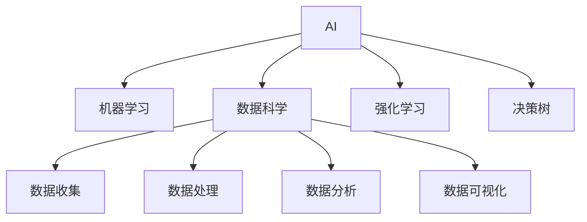

                 

# 最少的计算机科学先决条件学习 AI

> 关键词：AI入门, 无代码AI, 决策树, 强化学习, 机器学习, 数据科学

## 1. 背景介绍

在信息爆炸的时代，人工智能（AI）已经成为各行各业提升效率、优化决策的重要工具。然而，要真正理解和应用AI技术，却需要具备一定的计算机科学基础。对于非计算机背景的初学者来说，入门AI往往是一个巨大的挑战。

本博客旨在为零基础的读者提供一条轻松入门的AI学习路径，让读者在尽可能少的计算机科学先决条件下，掌握AI的基本概念和应用方法。通过理解AI的核心算法和实现技术，读者将能够构建出简单且有效的AI解决方案，解决实际问题。

## 2. 核心概念与联系

### 2.1 核心概念概述

为了更好地理解AI的基本原理和应用方法，本节将介绍几个核心概念：

- **AI与机器学习**：AI是计算机科学的一个分支，旨在创建可以执行智能任务的机器。机器学习是AI的一个子领域，通过算法使机器能够从数据中学习规律，进行预测和决策。
- **数据科学**：数据科学是将数据转化为可操作的知识和洞察力的学科。它包括数据收集、处理、分析和可视化等环节，是构建AI模型的重要基础。
- **强化学习**：强化学习是一种通过试错来优化决策的机器学习方法，广泛应用于游戏、机器人、金融等领域。
- **决策树**：决策树是一种基于树结构的分类算法，通过递归划分数据集来构建决策规则。

这些核心概念之间的逻辑关系可以通过以下Mermaid流程图来展示：



这个流程图展示了一些核心概念之间的联系：

1. AI和机器学习是AI的重要组成部分，通过机器学习算法使机器能够自主学习。
2. 数据科学提供了数据收集、处理、分析和可视化的技术，是机器学习模型的基础。
3. 强化学习和决策树是机器学习中的两种具体方法，用于解决不同类型的学习问题。

## 3. 核心算法原理 & 具体操作步骤

### 3.1 算法原理概述

AI的核心算法可以分为三大类：监督学习、无监督学习和强化学习。这些算法通过不同的方式从数据中学习规律，以实现特定的任务目标。

- **监督学习**：通过已知的输入和输出数据，训练模型进行预测或分类。常见算法包括线性回归、逻辑回归、决策树、支持向量机等。
- **无监督学习**：通过未标记的数据，发现数据的内在结构和模式。常见算法包括聚类、降维、关联规则等。
- **强化学习**：通过试错来优化决策，通过奖励和惩罚机制引导学习过程。常见算法包括Q-learning、SARSA、策略梯度等。

### 3.2 算法步骤详解

以下将详细介绍监督学习中的一种基本算法——决策树的学习步骤：

#### 3.2.1 数据准备

1. 收集数据集：数据集是决策树模型的基础，可以从公开数据集（如Kaggle）下载，也可以从实际业务中收集。
2. 数据清洗：去除缺失值、异常值等，保证数据质量。
3. 数据划分：将数据集划分为训练集和测试集，以保证模型的泛化能力。

#### 3.2.2 特征选择

1. 特征提取：从原始数据中提取有意义的特征，如文本中的词频、图像中的像素值等。
2. 特征选择：选择对分类有显著影响的特征，可以使用信息增益、互信息等方法进行评估。

#### 3.2.3 模型构建

1. 初始化决策树：选择一个根节点，根据特征进行分裂。
2. 递归分裂：在每个节点上进行特征选择和分裂，直到满足停止条件。
3. 模型评估：在测试集上评估模型的准确率和误差，调整参数进行优化。

### 3.3 算法优缺点

决策树的优点包括：

- 易于理解和解释，适合用于解释性要求高的场景。
- 能够处理离散和连续型数据，不需要对数据进行特殊处理。
- 可以处理多分类问题，适合处理各种类型的数据。

决策树的缺点包括：

- 容易过拟合，特别是在数据量较小的情况下。
- 对于噪声数据敏感，需要进行数据清洗。
- 需要手动选择特征，依赖于特征选择方法。

### 3.4 算法应用领域

决策树广泛用于分类、回归、特征选择等多个领域：

- 在金融领域，用于预测股票价格、评估信用风险等。
- 在医疗领域，用于诊断疾病、推荐治疗方案等。
- 在电商领域，用于推荐商品、预测用户行为等。
- 在自然语言处理领域，用于文本分类、情感分析等。

## 4. 数学模型和公式 & 详细讲解 & 举例说明

### 4.1 数学模型构建

决策树的数学模型可以表示为一个树形结构，其中每个节点表示一个特征，每个分支表示一个特征值，每个叶节点表示一个分类结果。

### 4.2 公式推导过程

以一个二分类问题为例，假设有一个特征 $X$ 和两个特征值 $x_1, x_2$，决策树的划分过程可以表示为：

1. 选择最优特征 $X_i$：根据信息增益（熵减少）选择最优特征。
2. 划分数据集：根据特征值 $x_i$ 将数据集分为两个子集 $D_1, D_2$。
3. 递归构建子树：对每个子集递归应用步骤1和步骤2，构建子树。

### 4.3 案例分析与讲解

以下是一个简单的决策树案例，用于预测水果的种类：

| 特征  | 结果   | 决策树构建过程 |
|-------|--------|--------------|
| 颜色  | 苹果   |      A       |
| 颜色  | 香蕉   |      B       |
| 硬度  | 苹果   |    C -> A    |
| 硬度  | 香蕉   |    C -> B    |
| 大小  | 苹果   |    C -> A    |
| 大小  | 香蕉   |    C -> B    |

这个决策树表示：如果水果是苹果，且颜色是红色，那么就是苹果；如果水果是香蕉，且颜色是黄色，那么就是香蕉。

## 5. 项目实践：代码实例和详细解释说明

### 5.1 开发环境搭建

进行决策树项目实践前，需要准备一些开发工具和环境。以下是使用Python进行决策树开发的流程：

1. 安装Python：从官网下载并安装Python，推荐使用3.x版本。
2. 安装Scikit-learn：这是一个常用的Python机器学习库，包含多种机器学习算法。可以使用pip安装：

   ```
   pip install scikit-learn
   ```

3. 准备数据集：可以从公开数据集下载，如UCI机器学习库中的Iris数据集，也可以从实际业务中收集。

### 5.2 源代码详细实现

以下是一个简单的决策树分类器的Python代码实现：

```python
from sklearn.tree import DecisionTreeClassifier
from sklearn.datasets import load_iris
from sklearn.model_selection import train_test_split

# 加载数据集
iris = load_iris()
X = iris.data
y = iris.target

# 划分训练集和测试集
X_train, X_test, y_train, y_test = train_test_split(X, y, test_size=0.3, random_state=42)

# 创建决策树分类器
clf = DecisionTreeClassifier()

# 训练模型
clf.fit(X_train, y_train)

# 评估模型
score = clf.score(X_test, y_test)
print("模型准确率：", score)
```

### 5.3 代码解读与分析

这段代码包含以下步骤：

1. 加载数据集：使用Scikit-learn库的load_iris函数加载Iris数据集，包含三个特征（花萼长度、花萼宽度、花瓣长度、花瓣宽度）和三种分类（山鸢尾、变色鸢尾、维吉尼亚鸢尾）。
2. 数据划分：使用train_test_split函数将数据集划分为训练集和测试集，测试集占比30%。
3. 创建模型：使用DecisionTreeClassifier函数创建一个决策树分类器。
4. 训练模型：使用fit函数对训练集进行模型训练。
5. 评估模型：使用score函数在测试集上评估模型的准确率，输出结果。

## 6. 实际应用场景

### 6.1 智能推荐系统

智能推荐系统广泛应用于电商、新闻、视频等多个领域。通过决策树模型，可以根据用户的历史行为和偏好，预测其可能感兴趣的商品、新闻或视频，提高用户满意度和转化率。

### 6.2 医疗诊断系统

医疗诊断系统可以通过决策树模型对患者的症状和病史进行分析，预测可能的疾病种类，辅助医生进行诊断。这对于资源有限、医疗资源分布不均的地区尤为重要。

### 6.3 金融风险评估

金融风险评估系统可以基于历史交易数据和市场动态，通过决策树模型评估客户的信用风险、预测股票价格等，帮助金融机构进行风险控制和投资决策。

### 6.4 未来应用展望

未来，决策树模型将继续在多个领域发挥重要作用。随着数据量和计算能力的提升，决策树模型将更加精确、高效。同时，决策树与其他机器学习算法、深度学习技术的结合，将带来更多的创新应用。

## 7. 工具和资源推荐

### 7.1 学习资源推荐

为了帮助读者系统掌握决策树的基本概念和应用方法，这里推荐一些优质的学习资源：

1. **《Python机器学习》**：这本书全面介绍了机器学习的基本概念和Python实现，包括决策树等算法。
2. **Coursera机器学习课程**：由斯坦福大学Andrew Ng教授主讲，讲解了机器学习的基本原理和实现方法，适合初学者入门。
3. **Scikit-learn官方文档**：Scikit-learn库提供了丰富的决策树实现和文档，是学习和实践决策树的好资源。
4. **Kaggle竞赛**：Kaggle平台上有多场决策树竞赛，可以通过实践学习决策树的应用方法。

### 7.2 开发工具推荐

1. **Python**：Python是机器学习领域的标准语言，拥有丰富的库和工具，适合决策树等算法的开发。
2. **Jupyter Notebook**：一个交互式的编程环境，适合进行数据探索和算法实验。
3. **Scikit-learn**：一个常用的Python机器学习库，包含多种机器学习算法，包括决策树等。
4. **TensorBoard**：用于可视化模型训练和推理结果的工具。

### 7.3 相关论文推荐

以下是几篇经典的决策树相关论文，推荐阅读：

1. **《决策树算法及其应用》**：介绍了决策树的算法原理和应用方法，适合入门学习。
2. **《A Survey on Decision Tree Ensemble Methods for Classification》**：综述了各种决策树集成方法，包括随机森林、梯度提升树等。
3. **《Decision Tree Classifier and Its Applications in Web Use Case Management》**：介绍了决策树在Web应用中的具体应用案例。

## 8. 总结：未来发展趋势与挑战

### 8.1 总结

本文系统介绍了决策树的基本原理和应用方法，帮助读者在尽可能少的计算机科学先决条件下，快速掌握AI的基本概念和应用方法。通过理解决策树的核心算法和实现技术，读者将能够构建出简单且有效的AI解决方案，解决实际问题。

通过本文的系统梳理，可以看到，决策树作为AI领域的一个重要算法，已经在金融、医疗、电商等多个领域得到广泛应用。未来，伴随数据量和计算能力的提升，决策树模型将更加精确、高效，并在更多领域发挥重要作用。

### 8.2 未来发展趋势

展望未来，决策树模型将呈现以下几个发展趋势：

1. **算法优化**：未来的决策树算法将更加高效、准确，通过优化特征选择、剪枝等方法提升性能。
2. **模型集成**：决策树与其他机器学习算法、深度学习技术的结合，将带来更多的创新应用。
3. **实时化应用**：随着数据流量的增加，实时化的决策树模型将得到广泛应用，提升决策效率和用户满意度。
4. **多模态数据融合**：决策树模型将与图像、语音等多模态数据融合，提高数据理解和建模能力。

### 8.3 面临的挑战

尽管决策树模型已经取得了一定的成果，但在迈向更加智能化、普适化应用的过程中，它仍面临一些挑战：

1. **数据依赖性高**：决策树模型的效果依赖于数据质量，需要大量的标注数据进行训练。
2. **过拟合风险**：决策树模型容易过拟合，特别是在数据量较小的情况下。
3. **可解释性不足**：决策树模型的决策过程缺乏可解释性，难以对其内部工作机制进行解释。

### 8.4 研究展望

面对决策树模型面临的挑战，未来的研究需要在以下几个方面寻求新的突破：

1. **无监督学习**：探索基于无监督学习方法的决策树算法，降低对标注数据的依赖。
2. **集成算法**：开发新的决策树集成算法，提高模型的泛化能力和性能。
3. **多模态数据融合**：研究多模态数据融合方法，提升模型的综合建模能力。
4. **模型优化**：优化决策树模型的算法和实现，提高其效率和可解释性。

这些研究方向的探索，将推动决策树模型向更高的台阶发展，为构建智能系统提供更可靠、更高效的工具。

## 9. 附录：常见问题与解答

**Q1: 什么是决策树？**

A: 决策树是一种基于树结构的分类算法，通过递归划分数据集来构建决策规则。它将数据集分为多个子集，每个子集对应一个特征，通过特征选择和分裂，构建出一个树形结构，最终输出分类结果。

**Q2: 决策树的优缺点是什么？**

A: 决策树的优点包括易于理解和解释，能够处理离散和连续型数据，适合处理各种类型的数据。缺点包括容易过拟合，对于噪声数据敏感，需要手动选择特征。

**Q3: 如何使用决策树进行数据分类？**

A: 使用决策树进行数据分类需要以下步骤：

1. 数据准备：收集数据集，进行数据清洗和特征提取。
2. 特征选择：选择对分类有显著影响的特征。
3. 模型构建：初始化决策树，根据特征进行分裂。
4. 模型评估：在测试集上评估模型的准确率和误差，调整参数进行优化。

**Q4: 决策树在实际应用中需要注意什么？**

A: 在实际应用中，决策树需要注意以下几点：

1. 数据质量：数据集的质量直接影响决策树的效果，需要进行数据清洗和特征选择。
2. 特征选择：选择合适的特征对分类有显著影响，需要进行特征选择和评估。
3. 过拟合：决策树容易过拟合，需要进行剪枝等方法优化。
4. 可解释性：决策树模型缺乏可解释性，需要对模型进行解释和调试。

**Q5: 如何优化决策树模型？**

A: 优化决策树模型需要以下步骤：

1. 特征选择：选择对分类有显著影响的特征，可以使用信息增益、互信息等方法进行评估。
2. 剪枝：对决策树进行剪枝，减少过拟合风险。
3. 模型集成：使用随机森林、梯度提升树等集成方法，提高模型的泛化能力和性能。
4. 参数调整：调整决策树的参数，如树深度、叶节点数量等，优化模型效果。

通过以上步骤，可以构建出高效、准确的决策树模型，解决实际问题。

---

作者：禅与计算机程序设计艺术 / Zen and the Art of Computer Programming

