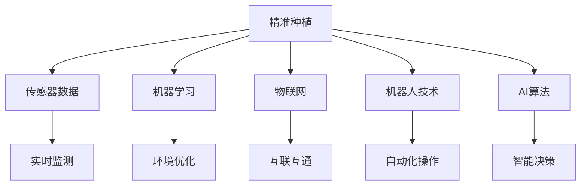

                 

## 1. 背景介绍

### 1.1 问题由来
智慧农业是未来农业发展的重要趋势，旨在通过大数据、物联网、人工智能等技术手段，实现对农业生产过程的精细化管理和智能化决策。随着技术的不断进步，精准种植和自动化养殖等新兴技术手段开始逐步应用到现代农业中，极大地提升了农业生产效率和农产品质量。

在2050年的未来世界中，智慧农业将更加成熟和普及。本文将详细探讨精准种植与自动化养殖的核心技术原理、具体实现步骤及其实际应用场景，分析这些技术在未来的发展趋势和面临的挑战，以期为现代农业的发展提供有价值的参考。

### 1.2 问题核心关键点
精准种植和自动化养殖的核心技术包括：
1. **传感器技术**：用于实时监测农业环境和作物生长状态。
2. **机器学习**：基于历史数据和实时监测数据，优化农业生产方案。
3. **物联网**：实现农业生产设备的互联互通，提升管理效率。
4. **机器人技术**：用于自动化种植和养殖，减少人力投入。
5. **AI算法**：如深度学习、强化学习等，用于精准控制农业环境和自动化决策。

本文将围绕这些关键技术点展开讨论，深入分析其原理、应用及未来发展方向。

## 2. 核心概念与联系

### 2.1 核心概念概述

为更好地理解2050年精准种植与自动化养殖的技术原理和应用，本节将介绍几个关键概念：

- **精准种植**：基于传感器数据和机器学习算法，实时调整作物生长环境，提高种植效率和作物品质。
- **自动化养殖**：通过机器人和AI算法，实现自动喂食、清洁、疾病防治等养殖过程的自动化。
- **物联网(IoT)**：将农业生产中的各类设备连接到互联网，实现数据实时采集和远程管理。
- **深度学习**：一种基于人工神经网络的学习算法，用于图像识别、数据分析等任务。
- **强化学习**：通过试错学习，优化决策策略，如自动驾驶、游戏AI等。

这些核心概念之间的关系可以通过以下Mermaid流程图来展示：



这个流程图展示了精准种植与自动化养殖的主要组成部分及其相互关系：

1. **传感器数据**：实时采集环境信息，为精准种植和自动化养殖提供数据基础。
2. **机器学习**：利用历史数据和实时监测数据，优化种植和养殖方案。
3. **物联网**：实现设备互联，提升管理效率。
4. **机器人技术**：实现自动化操作，减少人力投入。
5. **AI算法**：通过深度学习和强化学习，实现智能决策和自动化控制。

这些概念共同构成了未来智慧农业的技术框架，旨在通过技术手段提升农业生产效率和质量。

## 3. 核心算法原理 & 具体操作步骤

### 3.1 算法原理概述

#### 3.1.1 精准种植原理

精准种植的核心在于实时监测作物生长状态和环境变化，通过机器学习算法，实时调整生长环境，优化种植方案。具体流程如下：

1. **传感器数据采集**：部署各类传感器（如土壤湿度传感器、温度传感器、光照传感器等），实时采集土壤、气象、作物生长等数据。
2. **数据预处理**：对采集到的数据进行清洗和预处理，去除噪声和异常值。
3. **特征提取**：使用机器学习算法（如PCA、LDA等）对数据进行降维，提取关键特征。
4. **模型训练**：基于提取出的特征和历史数据，训练机器学习模型（如回归模型、分类模型等），预测作物生长状态和环境需求。
5. **实时调整**：根据模型预测结果，实时调整生长环境（如灌溉、施肥、通风等），优化种植方案。

#### 3.1.2 自动化养殖原理

自动化养殖的核心在于通过机器人技术和AI算法，实现养殖过程的自动化和智能化。具体流程如下：

1. **机器人部署**：在养殖场部署各类机器人（如自动喂食机器人、自动清洁机器人、自动疾病防治机器人等），执行养殖任务。
2. **数据采集**：机器人通过传感器实时采集动物状态、环境数据等。
3. **数据预处理**：对采集到的数据进行清洗和预处理。
4. **特征提取**：使用机器学习算法提取关键特征。
5. **模型训练**：基于提取出的特征和历史数据，训练AI算法（如深度学习、强化学习等），优化养殖方案。
6. **实时控制**：根据模型预测结果，实时控制养殖环境（如温度、湿度、喂食量等），实现自动化决策和操作。

### 3.2 算法步骤详解

#### 3.2.1 精准种植步骤详解

1. **传感器数据采集**
   - 在田间部署各类传感器，实时采集土壤湿度、温度、光照等数据。
   - 传感器数据通过网络传输到中央控制系统。

2. **数据预处理**
   - 对采集到的数据进行清洗，去除异常值和噪声。
   - 使用数据标准化技术，将数据归一化到指定范围内。

3. **特征提取**
   - 使用PCA算法对数据进行降维，提取关键特征。
   - 特征提取过程可以结合领域知识，提升提取效果。

4. **模型训练**
   - 使用回归模型（如线性回归、随机森林等），预测作物生长状态。
   - 模型训练过程中，使用交叉验证技术进行模型评估和调优。

5. **实时调整**
   - 根据模型预测结果，实时调整生长环境（如灌溉、施肥等）。
   - 通过自动控制系统，实现对农业环境的精准控制。

#### 3.2.2 自动化养殖步骤详解

1. **机器人部署**
   - 在养殖场部署各类机器人，执行自动喂食、清洁、疾病防治等任务。
   - 机器人通过网络连接到中央控制系统。

2. **数据采集**
   - 机器人通过传感器实时采集动物状态、环境数据等。
   - 采集到的数据通过网络传输到中央控制系统。

3. **数据预处理**
   - 对采集到的数据进行清洗和预处理，去除异常值和噪声。
   - 使用数据标准化技术，将数据归一化到指定范围内。

4. **特征提取**
   - 使用机器学习算法提取关键特征，如动物体重、健康状况等。
   - 特征提取过程可以结合领域知识，提升提取效果。

5. **模型训练**
   - 使用深度学习算法（如CNN、RNN等），预测动物生长状态。
   - 模型训练过程中，使用交叉验证技术进行模型评估和调优。

6. **实时控制**
   - 根据模型预测结果，实时控制养殖环境（如温度、湿度、喂食量等）。
   - 通过自动控制系统，实现对养殖环境的精准控制。

### 3.3 算法优缺点

#### 3.3.1 精准种植算法优缺点

**优点**：
1. **高效率**：实时监测和调整生长环境，大幅提高种植效率。
2. **高精度**：基于机器学习算法，可以更精准地预测作物生长状态和环境需求。
3. **可扩展性**：系统灵活，可以适应不同作物和环境。

**缺点**：
1. **成本高**：传感器和自动化设备成本较高。
2. **技术要求高**：需要高水平的机器学习算法和自动化控制系统。
3. **数据要求高**：需要大量历史数据进行模型训练和调优。

#### 3.3.2 自动化养殖算法优缺点

**优点**：
1. **高效率**：自动化操作减少人力投入，大幅提高养殖效率。
2. **高精度**：基于AI算法，可以实现高精度的环境控制和决策。
3. **可扩展性**：系统灵活，可以适应不同养殖类型和规模。

**缺点**：
1. **成本高**：机器人设备和传感器成本较高。
2. **技术要求高**：需要高水平的AI算法和自动化控制系统。
3. **数据要求高**：需要大量历史数据进行模型训练和调优。

### 3.4 算法应用领域

精准种植和自动化养殖技术已经在农业生产中得到了广泛应用，具体应用领域包括：

1. **大田种植**：使用传感器监测土壤湿度、温度等数据，实时调整灌溉和施肥方案。
2. **温室农业**：通过自动控制系统调节温室环境，优化作物生长环境。
3. **果园管理**：使用机器人进行自动修剪、施肥等任务，提高水果产量和品质。
4. **畜禽养殖**：通过自动喂食机器人、自动疾病防治机器人等，实现养殖自动化。
5. **水产养殖**：使用自动化控制系统调节水质、温度等环境参数，提高养殖效率。

这些技术在实际应用中取得了显著效果，推动了农业生产的现代化和智能化。

## 4. 数学模型和公式 & 详细讲解 & 举例说明

### 4.1 数学模型构建

#### 4.1.1 精准种植数学模型

假设作物生长状态可以用特征向量 $\mathbf{x} = (x_1, x_2, ..., x_n)$ 表示，其中 $x_i$ 为第 $i$ 个特征值。环境需求可以用参数向量 $\mathbf{\theta}$ 表示。假设模型为线性回归模型，则预测值 $\mathbf{\hat{y}}$ 和真实值 $\mathbf{y}$ 之间的关系可以表示为：

$$
\mathbf{\hat{y}} = \mathbf{X}\mathbf{\theta} + \mathbf{e}
$$

其中 $\mathbf{X}$ 为特征矩阵，$\mathbf{\hat{y}}$ 为预测值，$\mathbf{y}$ 为真实值，$\mathbf{e}$ 为误差向量。

模型训练目标为最小化预测值和真实值之间的误差，常用的损失函数为均方误差（MSE）：

$$
L(\mathbf{\theta}) = \frac{1}{N}\sum_{i=1}^N(y_i - \mathbf{\hat{y}}_i)^2
$$

其中 $N$ 为样本数量，$y_i$ 为真实值，$\mathbf{\hat{y}}_i$ 为预测值。

#### 4.1.2 自动化养殖数学模型

假设动物生长状态可以用特征向量 $\mathbf{x} = (x_1, x_2, ..., x_n)$ 表示，其中 $x_i$ 为第 $i$ 个特征值。环境需求可以用参数向量 $\mathbf{\theta}$ 表示。假设模型为深度神经网络，则预测值 $\mathbf{\hat{y}}$ 和真实值 $\mathbf{y}$ 之间的关系可以表示为：

$$
\mathbf{\hat{y}} = \mathbf{f}(\mathbf{X}\mathbf{\theta} + \mathbf{e})
$$

其中 $\mathbf{X}$ 为特征矩阵，$\mathbf{\hat{y}}$ 为预测值，$\mathbf{y}$ 为真实值，$\mathbf{e}$ 为误差向量。

模型训练目标为最小化预测值和真实值之间的误差，常用的损失函数为交叉熵损失函数：

$$
L(\mathbf{\theta}) = -\frac{1}{N}\sum_{i=1}^Ny_i\log\mathbf{\hat{y}}_i + (1-y_i)\log(1-\mathbf{\hat{y}}_i)
$$

其中 $N$ 为样本数量，$y_i$ 为真实值，$\mathbf{\hat{y}}_i$ 为预测值。

### 4.2 公式推导过程

#### 4.2.1 精准种植公式推导

假设特征向量 $\mathbf{x}$ 为 $n$ 维向量，参数向量 $\mathbf{\theta}$ 为 $m$ 维向量。假设数据集 $D$ 包含 $N$ 个样本，每个样本包含 $n$ 个特征值 $x_i$ 和一个目标值 $y_i$。

线性回归模型的目标是最小化损失函数 $L(\mathbf{\theta})$：

$$
L(\mathbf{\theta}) = \frac{1}{N}\sum_{i=1}^N(y_i - \mathbf{x}_i^T\mathbf{\theta})^2
$$

使用梯度下降算法求解模型参数 $\mathbf{\theta}$：

$$
\mathbf{\theta} = \mathbf{\theta} - \eta\nabla_{\mathbf{\theta}}L(\mathbf{\theta})
$$

其中 $\eta$ 为学习率，$\nabla_{\mathbf{\theta}}L(\mathbf{\theta})$ 为损失函数对参数 $\mathbf{\theta}$ 的梯度。

#### 4.2.2 自动化养殖公式推导

假设特征向量 $\mathbf{x}$ 为 $n$ 维向量，参数向量 $\mathbf{\theta}$ 为 $m$ 维向量。假设数据集 $D$ 包含 $N$ 个样本，每个样本包含 $n$ 个特征值 $x_i$ 和一个目标值 $y_i$。

深度神经网络的目标是最小化损失函数 $L(\mathbf{\theta})$：

$$
L(\mathbf{\theta}) = -\frac{1}{N}\sum_{i=1}^Ny_i\log\mathbf{\hat{y}}_i + (1-y_i)\log(1-\mathbf{\hat{y}}_i)
$$

使用梯度下降算法求解模型参数 $\mathbf{\theta}$：

$$
\mathbf{\theta} = \mathbf{\theta} - \eta\nabla_{\mathbf{\theta}}L(\mathbf{\theta})
$$

其中 $\eta$ 为学习率，$\nabla_{\mathbf{\theta}}L(\mathbf{\theta})$ 为损失函数对参数 $\mathbf{\theta}$ 的梯度。

### 4.3 案例分析与讲解

#### 4.3.1 精准种植案例分析

假设某农场种植西瓜，使用传感器监测土壤湿度、温度、光照等数据。数据集 $D$ 包含 $N$ 个样本，每个样本包含 5 个特征值（土壤湿度、温度、光照、二氧化碳浓度、湿度）和 1 个目标值（西瓜产量）。

使用线性回归模型进行模型训练，特征矩阵 $\mathbf{X}$ 为 $N \times 5$ 矩阵，目标向量 $\mathbf{y}$ 为 $N \times 1$ 向量。模型参数 $\mathbf{\theta}$ 为 $5 \times 1$ 向量。

使用梯度下降算法进行模型训练，学习率为 $0.01$，迭代次数为 $1000$ 次。计算过程如下：

1. 初始化模型参数 $\mathbf{\theta}$。
2. 对于每个样本 $i$，计算预测值 $\mathbf{\hat{y}}_i = \mathbf{x}_i^T\mathbf{\theta}$。
3. 计算误差 $\epsilon_i = y_i - \mathbf{\hat{y}}_i$。
4. 计算梯度 $\nabla_{\mathbf{\theta}}L(\mathbf{\theta}) = \frac{1}{N}\sum_{i=1}^N\epsilon_i\mathbf{x}_i$。
5. 更新模型参数 $\mathbf{\theta} = \mathbf{\theta} - \eta\nabla_{\mathbf{\theta}}L(\mathbf{\theta})$。
6. 重复步骤 2-5，直至迭代次数达到 $1000$。

#### 4.3.2 自动化养殖案例分析

假设某养猪场使用自动喂食机器人进行饲料分配。数据集 $D$ 包含 $N$ 个样本，每个样本包含 4 个特征值（动物体重、健康状况、饲料种类、环境温度）和 1 个目标值（饲料分配量）。

使用深度神经网络进行模型训练，特征矩阵 $\mathbf{X}$ 为 $N \times 4$ 矩阵，目标向量 $\mathbf{y}$ 为 $N \times 1$ 向量。模型参数 $\mathbf{\theta}$ 为深度神经网络。

使用梯度下降算法进行模型训练，学习率为 $0.001$，迭代次数为 $1000$ 次。计算过程如下：

1. 初始化模型参数 $\mathbf{\theta}$。
2. 对于每个样本 $i$，计算预测值 $\mathbf{\hat{y}}_i = f(\mathbf{x}_i^T\mathbf{\theta})$。
3. 计算误差 $\epsilon_i = y_i - \mathbf{\hat{y}}_i$。
4. 计算梯度 $\nabla_{\mathbf{\theta}}L(\mathbf{\theta}) = \frac{1}{N}\sum_{i=1}^N\epsilon_i\nabla_{\mathbf{\theta}}f(\mathbf{x}_i^T\mathbf{\theta})$。
5. 更新模型参数 $\mathbf{\theta} = \mathbf{\theta} - \eta\nabla_{\mathbf{\theta}}L(\mathbf{\theta})$。
6. 重复步骤 2-5，直至迭代次数达到 $1000$。

## 5. 项目实践：代码实例和详细解释说明

### 5.1 开发环境搭建

在项目开发前，需要搭建好开发环境。以下是搭建开发环境的具体步骤：

1. 安装 Python：从官网下载最新版的 Python，并进行安装。
2. 安装 PyTorch：使用 pip 命令安装 PyTorch 库。
3. 安装 TensorFlow：使用 pip 命令安装 TensorFlow 库。
4. 安装 OpenCV：使用 pip 命令安装 OpenCV 库，用于图像处理。
5. 安装 pandas：使用 pip 命令安装 pandas 库，用于数据处理。
6. 安装 scikit-learn：使用 pip 命令安装 scikit-learn 库，用于机器学习。

### 5.2 源代码详细实现

下面以精准种植为例，展示使用 Python 和 PyTorch 进行线性回归模型训练的代码实现：

```python
import torch
import torch.nn as nn
import torch.optim as optim
import pandas as pd
import numpy as np

# 加载数据集
data = pd.read_csv('data.csv')

# 提取特征和目标
X = data[['湿度', '温度', '光照', '二氧化碳浓度']]
y = data['产量']

# 数据标准化
X = (X - X.mean()) / X.std()

# 定义模型
class LinearRegression(nn.Module):
    def __init__(self, n_features):
        super(LinearRegression, self).__init__()
        self.linear = nn.Linear(n_features, 1)

    def forward(self, x):
        return self.linear(x)

# 初始化模型
model = LinearRegression(X.shape[1])

# 定义损失函数和优化器
criterion = nn.MSELoss()
optimizer = optim.SGD(model.parameters(), lr=0.01)

# 模型训练
epochs = 1000
for epoch in range(epochs):
    optimizer.zero_grad()
    output = model(X)
    loss = criterion(output, y)
    loss.backward()
    optimizer.step()
    if (epoch + 1) % 100 == 0:
        print(f'Epoch {epoch+1}, Loss: {loss.item():.4f}')

# 模型测试
test_data = pd.read_csv('test_data.csv')
X_test = test_data[['湿度', '温度', '光照', '二氧化碳浓度']]
y_test = test_data['产量']
y_pred = model(X_test)

# 输出预测结果
print(f'Test Loss: {criterion(y_pred, y_test).item():.4f}')
```

### 5.3 代码解读与分析

#### 5.3.1 代码解读

1. **数据加载**：使用 pandas 库加载数据集，提取特征和目标。
2. **数据标准化**：对特征数据进行标准化处理，归一化到指定范围内。
3. **模型定义**：定义线性回归模型，使用 PyTorch 的 nn.Module 类实现。
4. **损失函数和优化器**：定义均方误差损失函数和随机梯度下降优化器。
5. **模型训练**：使用训练集进行模型训练，迭代更新模型参数。
6. **模型测试**：使用测试集对模型进行测试，输出预测结果。

#### 5.3.2 代码分析

代码中使用了 PyTorch 的张量计算和自动微分功能，极大简化了模型的定义和训练过程。同时，使用 pandas 和 numpy 进行数据处理，可以高效地加载和处理大规模数据集。

## 6. 实际应用场景

### 6.1 大田种植

大田种植是精准种植技术的典型应用场景。通过传感器实时监测土壤湿度、温度等数据，可以实时调整灌溉和施肥方案，优化种植效果。例如，某农场种植水稻，使用传感器监测土壤湿度和温度，通过线性回归模型预测水稻生长状态，实时调整灌溉和施肥方案，大幅提高水稻产量和品质。

### 6.2 温室农业

温室农业是精准种植技术的另一个重要应用领域。通过自动控制系统调节温室环境，可以实现高效种植。例如，某温室农业公司使用传感器监测室内温度、湿度等数据，通过深度学习模型预测植物生长状态，实时调整温室环境参数，优化植物生长环境，提高产量和品质。

### 6.3 果园管理

果园管理是精准种植技术的重要应用场景之一。通过传感器实时监测果园环境，可以优化种植方案，提高水果产量和品质。例如，某果园使用传感器监测果树生长状态和环境数据，通过机器学习模型预测果树健康状况和果实成熟度，实时调整施肥和修剪方案，提高水果产量和品质。

### 6.4 畜禽养殖

畜禽养殖是自动化养殖技术的典型应用场景。通过自动喂食机器人、自动清洁机器人等设备，可以实现养殖自动化，减少人力投入。例如，某养猪场使用自动喂食机器人进行饲料分配，通过深度学习模型预测动物健康状况和饲料需求，实时调整喂食量和频率，提高养殖效率。

### 6.5 水产养殖

水产养殖是自动化养殖技术的另一个重要应用领域。通过自动控制系统调节水质、温度等环境参数，可以实现高效养殖。例如，某水产养殖场使用传感器监测水质和温度，通过深度学习模型预测鱼类生长状态和疾病风险，实时调整水质和温度参数，提高养殖效率和鱼类健康状况。

## 7. 工具和资源推荐

### 7.1 学习资源推荐

#### 7.1.1 在线课程

- Coursera：提供多门关于机器学习、深度学习、物联网等领域的在线课程，涵盖理论基础和实际应用。
- Udacity：提供多门关于自动驾驶、机器人技术等领域的在线课程，深入探讨前沿技术。

#### 7.1.2 技术博客

- Medium：众多技术专家和公司在该平台上分享最新技术进展和实际应用案例。
- Towards Data Science：专注于数据科学和机器学习领域的博客平台，提供丰富的学习资源和技术分享。

#### 7.1.3 技术书籍

- 《深度学习》（Goodfellow 等著）：全面介绍深度学习理论和应用。
- 《TensorFlow实战》（Zhang 等著）：详细讲解 TensorFlow 框架的使用方法和实际应用。
- 《Python机器学习》（Geron 著）：介绍 Python 语言在机器学习中的应用。

### 7.2 开发工具推荐

#### 7.2.1 开发框架

- PyTorch：基于 Python 的开源深度学习框架，灵活易用，适合快速迭代研究。
- TensorFlow：由 Google 主导的开源深度学习框架，生产部署方便，适合大规模工程应用。
- Keras：基于 TensorFlow 和 Theano 的高级神经网络 API，易于使用。

#### 7.2.2 数据处理工具

- pandas：Python 数据分析库，支持大规模数据处理和分析。
- NumPy：Python 科学计算库，支持高效的数组和矩阵运算。
- Matplotlib：Python 绘图库，支持各种绘图需求。

#### 7.2.3 自动化工具

- Jenkins：开源的持续集成工具，支持多种编程语言和框架。
- Ansible：自动化配置管理工具，支持大规模系统部署和维护。
- Docker：容器化技术，支持快速部署和环境管理。

### 7.3 相关论文推荐

#### 7.3.1 精准种植论文

- 《Precision Agriculture through Sensor Data Mining and Machine Learning》：介绍基于传感器数据和机器学习的精准农业技术。
- 《A Survey on Agricultural Robotics and Automations》：综述农业机器人技术的发展现状和应用场景。

#### 7.3.2 自动化养殖论文

- 《Deep Learning for Poultry Health Monitoring》：介绍深度学习在禽类健康监测中的应用。
- 《Intelligent Feeding System for Aquaculture with Deep Neural Network》：介绍深度学习在水产养殖中的应用。

## 8. 总结：未来发展趋势与挑战

### 8.1 研究成果总结

本文介绍了精准种植与自动化养殖的核心技术原理和具体实现步骤，分析了这些技术在农业生产中的应用前景。通过案例分析和代码实例，展示了精准种植和自动化养殖的实际效果。

### 8.2 未来发展趋势

未来，随着技术的不断进步，精准种植与自动化养殖将进一步发展，主要趋势如下：

1. **深度学习与物联网融合**：深度学习与物联网技术结合，可以实现更加精确的环境控制和决策。
2. **边缘计算与云计算结合**：利用边缘计算技术，实现本地数据处理和决策，降低云端的计算负担。
3. **多模态数据融合**：结合视觉、声音、传感器数据，实现更加全面的环境监测和分析。
4. **智能机器人技术**：开发更加智能和灵活的机器人，提高自动化操作的精度和效率。
5. **自适应学习**：利用强化学习等技术，实现系统的自适应学习，提升智能决策能力。

### 8.3 面临的挑战

尽管精准种植与自动化养殖技术取得了显著进展，但仍面临以下挑战：

1. **数据采集和处理**：大规模数据采集和处理技术尚需进一步提升。
2. **模型精度和泛化能力**：模型的精度和泛化能力需要进一步提高，以应对不同的农业场景和环境变化。
3. **系统复杂性**：系统复杂性高，需要高水平的算法和系统设计。
4. **成本问题**：传感器和自动化设备成本较高，需要进一步降低成本。
5. **技术标准化**：缺乏统一的技术标准和接口，难以实现设备互操作。

### 8.4 研究展望

未来，随着技术的不断进步，精准种植与自动化养殖将进一步发展，主要方向如下：

1. **多模态数据融合**：结合视觉、声音、传感器数据，实现更加全面的环境监测和分析。
2. **边缘计算与云计算结合**：利用边缘计算技术，实现本地数据处理和决策，降低云端的计算负担。
3. **智能机器人技术**：开发更加智能和灵活的机器人，提高自动化操作的精度和效率。
4. **自适应学习**：利用强化学习等技术，实现系统的自适应学习，提升智能决策能力。
5. **模型优化**：开发更加高效的模型和算法，提升模型的精度和泛化能力。
6. **成本控制**：通过技术创新和规模化生产，降低传感器和自动化设备的成本。
7. **标准化**：制定统一的技术标准和接口，实现设备互操作，推动技术普及。

## 9. 附录：常见问题与解答

**Q1：精准种植与自动化养殖技术在实际应用中需要注意哪些问题？**

A: 精准种植与自动化养殖技术在实际应用中需要注意以下问题：

1. **数据采集和处理**：需要确保传感器和数据的准确性和稳定性，避免因数据质量问题影响模型效果。
2. **模型精度和泛化能力**：需要不断优化模型，提升其在不同农业场景和环境变化下的适应能力。
3. **系统复杂性**：需要高水平的算法和系统设计，确保系统的稳定性和可靠性。
4. **成本问题**：需要控制传感器和自动化设备的成本，确保经济效益。
5. **技术标准化**：需要制定统一的技术标准和接口，实现设备互操作，推动技术普及。

**Q2：未来精准种植与自动化养殖技术的发展方向是什么？**

A: 未来精准种植与自动化养殖技术的发展方向主要包括：

1. **深度学习与物联网融合**：利用深度学习与物联网技术结合，实现更加精确的环境控制和决策。
2. **边缘计算与云计算结合**：利用边缘计算技术，实现本地数据处理和决策，降低云端的计算负担。
3. **多模态数据融合**：结合视觉、声音、传感器数据，实现更加全面的环境监测和分析。
4. **智能机器人技术**：开发更加智能和灵活的机器人，提高自动化操作的精度和效率。
5. **自适应学习**：利用强化学习等技术，实现系统的自适应学习，提升智能决策能力。

**Q3：如何提高精准种植与自动化养殖技术的模型精度和泛化能力？**

A: 提高精准种植与自动化养殖技术的模型精度和泛化能力，可以从以下几个方面进行优化：

1. **数据增强**：通过数据增强技术，扩充数据集，提升模型的泛化能力。
2. **特征工程**：对数据进行特征工程，提取关键特征，提升模型的表达能力。
3. **模型优化**：使用深度学习、强化学习等高级算法，优化模型结构和参数，提升模型的精度。
4. **多任务学习**：结合多个任务，进行联合训练，提升模型的泛化能力。
5. **超参数调优**：使用网格搜索、贝叶斯优化等方法，进行超参数调优，找到最优模型参数。

---

作者：禅与计算机程序设计艺术 / Zen and the Art of Computer Programming

