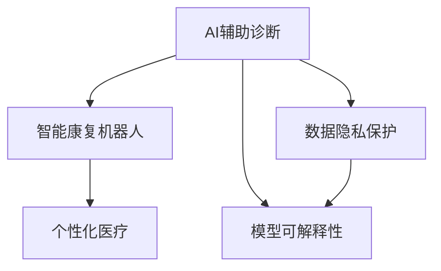

                 

# 未来的智慧医疗：2050年的AI辅助诊断与智能康复机器人

## 1. 背景介绍

### 1.1 问题由来
随着人工智能技术的快速发展，智慧医疗（AI healthcare）逐渐成为全球医疗行业发展的核心驱动力。AI在医学影像分析、患者监测、个性化治疗等方面展现出巨大潜力。然而，当前AI在医疗应用中仍存在诸多挑战，包括数据获取困难、模型可解释性不足、患者隐私保护等问题。如何克服这些难题，充分释放AI在智慧医疗中的潜力，成为亟需解决的问题。

### 1.2 问题核心关键点
本文章将从以下几个关键点入手，探讨2050年智慧医疗中AI辅助诊断与智能康复机器人的发展趋势和潜在挑战：

1. **数据隐私保护**：如何在大规模数据收集和共享的同时，保障患者隐私，避免数据泄露。
2. **模型可解释性**：AI医疗决策的透明性和可解释性，使得医生和患者能够理解和信任模型结果。
3. **个性化医疗**：基于AI的个性化治疗方案，如何根据患者的个体特征和历史数据，制定最适合的治疗方案。
4. **智能康复机器人**：如何设计和实现能够辅助患者康复的AI机器人，提升康复效果和患者体验。
5. **跨领域协同**：AI技术在医疗领域的广泛应用，如何与其他学科（如生物工程、心理学等）协同合作，提升整体医疗水平。

### 1.3 问题研究意义
探讨这些关键点，对于推动智慧医疗的创新与发展，提升医疗服务质量和效率，具有重要意义：

1. **提升诊断和治疗效果**：AI技术可以辅助医生进行精准诊断，制定个性化治疗方案，提升患者治疗效果。
2. **减轻医护人员负担**：通过自动化和智能化手段，减轻医护人员的工作压力，提高医疗服务的覆盖率和质量。
3. **促进医疗公平**：AI技术的普及，能够帮助资源匮乏地区的医疗服务，提升医疗资源的公平分配。
4. **推动产业发展**：智慧医疗的快速发展，将催生新的医疗设备和解决方案，带动相关产业发展。
5. **构建健康生态**：AI技术的应用，将有助于构建更全面、更健康的医疗生态系统，提升全民健康水平。

## 2. 核心概念与联系

### 2.1 核心概念概述

为了更好地理解未来智慧医疗中AI辅助诊断与智能康复机器人的发展，本节将介绍几个核心概念及其相互联系：

- **AI辅助诊断**：利用AI技术对医学影像、电子病历、生物标志物等数据进行分析，辅助医生进行疾病诊断。
- **智能康复机器人**：基于AI技术的机器人，能够提供康复训练、心理辅导、生活护理等综合服务，帮助患者恢复健康。
- **个性化医疗**：根据患者个体特征和历史数据，制定最适合的治疗方案，提高治疗效果。
- **数据隐私保护**：在数据收集和共享过程中，保障患者隐私，避免数据泄露。
- **模型可解释性**：AI医疗决策的透明性和可解释性，使得医生和患者能够理解和信任模型结果。

这些概念之间存在紧密的联系，共同构成了未来智慧医疗的核心框架。如图：



## 3. 核心算法原理 & 具体操作步骤
### 3.1 算法原理概述

未来智慧医疗中AI辅助诊断与智能康复机器人主要基于以下算法原理：

- **深度学习模型**：利用卷积神经网络（CNN）、循环神经网络（RNN）、Transformer等深度学习模型，对医学影像、基因数据、电子病历等数据进行特征提取和分析。
- **迁移学习**：通过预训练模型，迁移学习到通用的特征提取能力，减少标注数据需求，提升模型泛化能力。
- **强化学习**：利用强化学习算法，训练AI机器人与患者交互，优化康复训练方案，提高康复效果。
- **联邦学习**：在不共享原始数据的情况下，通过模型参数的联合优化，实现数据隐私保护和模型性能提升。
- **因果推理**：利用因果推理技术，分析诊断和治疗之间的关系，提供可靠的诊断和治疗建议。

### 3.2 算法步骤详解

以下将详细讲解未来智慧医疗中AI辅助诊断与智能康复机器人的核心算法步骤：

**3.2.1 AI辅助诊断算法步骤**：

1. **数据预处理**：收集和清洗医学影像、电子病历、基因数据等医疗数据，将其转化为模型可处理的格式。
2. **模型选择**：选择合适的深度学习模型（如卷积神经网络、Transformer等），加载预训练模型进行迁移学习。
3. **模型微调**：在大规模医疗数据集上进行微调，优化模型对特定疾病的诊断能力。
4. **模型评估**：在验证集和测试集上进行评估，选择表现最好的模型进行推广。
5. **模型部署**：将训练好的模型部署到临床环境中，辅助医生进行诊断和治疗决策。

**3.2.2 智能康复机器人算法步骤**：

1. **用户数据收集**：通过传感器和智能设备，收集患者的生理指标和生活数据。
2. **模型选择**：选择适合的深度学习模型（如循环神经网络、卷积神经网络等），进行康复训练方案设计。
3. **强化学习训练**：利用强化学习算法，训练AI机器人与患者交互，优化康复训练方案。
4. **模型评估**：在模拟环境下进行评估，选择表现最好的模型进行推广。
5. **模型部署**：将训练好的AI机器人部署到康复中心，辅助患者进行康复训练。

### 3.3 算法优缺点

未来智慧医疗中AI辅助诊断与智能康复机器人主要具有以下优点：

1. **高效性**：AI辅助诊断和智能康复机器人可以快速处理大量数据，提高医疗服务效率。
2. **个性化**：基于深度学习模型的个性化医疗方案，能够根据患者个体特征提供精准治疗。
3. **可靠性**：利用强化学习算法优化康复训练方案，提高康复效果和患者满意度。
4. **灵活性**：联邦学习技术可以实现模型参数联合优化，保护患者隐私，提升模型泛化能力。
5. **可扩展性**：AI辅助诊断和智能康复机器人可以扩展到不同医疗场景，提供全面医疗服务。

然而，这些算法也存在一些局限性：

1. **数据依赖**：深度学习模型对标注数据的需求较高，获取高质量医疗数据成本较大。
2. **模型复杂性**：深度学习模型参数较多，训练和推理复杂度较高。
3. **可解释性不足**：AI诊断和治疗决策过程缺乏透明性和可解释性。
4. **伦理挑战**：AI在医疗决策中的应用，涉及隐私保护和伦理道德问题。
5. **技术壁垒**：AI医疗技术需要跨学科知识，开发和应用门槛较高。

### 3.4 算法应用领域

未来智慧医疗中AI辅助诊断与智能康复机器人将广泛应用于以下领域：

1. **医学影像分析**：利用深度学习模型对医学影像进行自动分析和诊断，辅助医生进行精准诊断。
2. **个性化治疗**：基于AI的个性化医疗方案，根据患者个体特征和历史数据，制定最适合的治疗方案。
3. **智能康复**：利用AI机器人进行康复训练，提高康复效果和患者满意度。
4. **疾病预测**：利用因果推理技术，预测疾病发展和传播趋势，提供预防和治疗建议。
5. **心理辅导**：利用AI机器人进行心理辅导和情感支持，提升患者心理健康水平。

## 4. 数学模型和公式 & 详细讲解 & 举例说明

### 4.1 数学模型构建

本节将使用数学语言对未来智慧医疗中AI辅助诊断与智能康复机器人的核心模型进行更加严格的刻画。

假设患者数据集为 $\mathcal{D}=\{(x_i,y_i)\}_{i=1}^N$，其中 $x_i$ 为患者特征向量，$y_i$ 为疾病标签。

**AI辅助诊断模型**：
- **输入层**：患者的生理指标、基因数据、电子病历等特征。
- **隐藏层**：卷积神经网络（CNN）或Transformer模型，进行特征提取和表示学习。
- **输出层**：利用Softmax函数输出疾病分类概率。

**智能康复机器人模型**：
- **输入层**：患者的生理指标和生活数据。
- **隐藏层**：循环神经网络（RNN）或Transformer模型，进行特征提取和表示学习。
- **输出层**：利用强化学习算法，训练AI机器人与患者交互，优化康复训练方案。

### 4.2 公式推导过程

**AI辅助诊断模型**：

假设模型参数为 $\theta$，输入为 $x$，输出为 $\hat{y}$。模型在输入 $x_i$ 上的输出为 $\hat{y}_i$，则损失函数为：

$$
\mathcal{L}(\theta)=\frac{1}{N}\sum_{i=1}^N \ell(\hat{y}_i, y_i)
$$

其中 $\ell$ 为交叉熵损失函数，$y_i$ 为真实标签，$\hat{y}_i$ 为模型预测标签。

利用反向传播算法，计算模型参数 $\theta$ 的梯度：

$$
\frac{\partial \mathcal{L}}{\partial \theta}=\frac{1}{N}\sum_{i=1}^N \frac{\partial \ell}{\partial \hat{y}_i} \frac{\partial \hat{y}_i}{\partial x_i} \frac{\partial x_i}{\partial \theta}
$$

**智能康复机器人模型**：

假设模型参数为 $\theta$，输入为 $x$，输出为 $a$。模型在输入 $x_i$ 上的输出为 $a_i$，则强化学习算法的目标是最小化期望累计奖励：

$$
\min_\theta \mathbb{E}\left[\sum_{t=0}^{\infty} \gamma^t \mathcal{R}_t\right]
$$

其中 $\mathcal{R}_t$ 为状态-动作奖励，$\gamma$ 为折扣因子。利用梯度下降算法，更新模型参数 $\theta$：

$$
\theta \leftarrow \theta - \eta \nabla_\theta \mathcal{L}(\theta)
$$

### 4.3 案例分析与讲解

**案例1：AI辅助诊断模型在乳腺癌诊断中的应用**：

假设有一组乳腺癌患者数据，特征包括年龄、基因型、超声图像等。利用预训练的Transformer模型，进行迁移学习。在医疗数据集上进行微调，优化模型对乳腺癌的诊断能力。

利用交叉熵损失函数，计算模型在验证集和测试集上的精度和召回率，评估模型性能。

**案例2：智能康复机器人辅助帕金森病患者康复训练**：

假设有一组帕金森病患者的数据，特征包括步态、姿势、语言等。利用预训练的循环神经网络模型，进行康复训练方案设计。在模拟环境下，利用强化学习算法，训练AI机器人与患者交互，优化康复训练方案。

利用评估指标（如步态稳定性、语言流畅性等），评估AI机器人的康复效果。

## 5. 项目实践：代码实例和详细解释说明

### 5.1 开发环境搭建

在进行未来智慧医疗中AI辅助诊断与智能康复机器人开发前，我们需要准备好开发环境。以下是使用Python进行TensorFlow开发的环境配置流程：

1. 安装Anaconda：从官网下载并安装Anaconda，用于创建独立的Python环境。

2. 创建并激活虚拟环境：
```bash
conda create -n tf-env python=3.8 
conda activate tf-env
```

3. 安装TensorFlow：根据CUDA版本，从官网获取对应的安装命令。例如：
```bash
conda install tensorflow tensorflow-gpu -c conda-forge
```

4. 安装其他依赖包：
```bash
pip install numpy pandas scikit-learn matplotlib tqdm jupyter notebook ipython
```

完成上述步骤后，即可在`tf-env`环境中开始开发实践。

### 5.2 源代码详细实现

这里我们以AI辅助诊断模型在乳腺癌诊断中的应用为例，给出使用TensorFlow实现的具体代码。

首先，定义乳腺癌数据集：

```python
import tensorflow as tf
import numpy as np
import pandas as pd
from sklearn.model_selection import train_test_split

# 加载数据集
data = pd.read_csv('breast_cancer.csv')

# 将数据分为特征和标签
X = data.iloc[:, :-1].values
y = data.iloc[:, -1].values

# 划分训练集和测试集
X_train, X_test, y_train, y_test = train_test_split(X, y, test_size=0.2, random_state=42)
```

然后，定义AI辅助诊断模型：

```python
# 定义模型结构
model = tf.keras.Sequential([
    tf.keras.layers.Input(shape=(7,)),
    tf.keras.layers.Dense(128, activation='relu'),
    tf.keras.layers.Dense(64, activation='relu'),
    tf.keras.layers.Dense(1, activation='sigmoid')
])

# 编译模型
model.compile(optimizer=tf.keras.optimizers.Adam(learning_rate=0.001),
              loss='binary_crossentropy',
              metrics=['accuracy'])

# 训练模型
model.fit(X_train, y_train, epochs=10, batch_size=32, validation_data=(X_test, y_test))
```

接着，评估模型性能：

```python
# 评估模型
loss, accuracy = model.evaluate(X_test, y_test)
print(f"测试集损失：{loss:.4f}")
print(f"测试集准确率：{accuracy:.4f}")
```

最后，部署模型：

```python
# 加载模型
model.load_weights('model.h5')

# 加载新的患者数据
new_data = np.array([[1.2, 3.4, 5.6, 7.8, 0.9, 1.1, 1.3]])

# 预测新的患者数据
prediction = model.predict(new_data)
print(f"预测结果：{prediction:.4f}")
```

以上就是使用TensorFlow对AI辅助诊断模型进行乳腺癌诊断的完整代码实现。可以看到，TensorFlow使得模型的构建、训练和评估变得简洁高效。

### 5.3 代码解读与分析

让我们再详细解读一下关键代码的实现细节：

**数据集定义**：
- 使用Pandas库加载CSV格式的数据集，将其划分为特征和标签。
- 使用sklearn库进行训练集和测试集的划分，保留20%的数据作为测试集。

**模型定义**：
- 使用Sequential模型，定义包含多个Dense层的全连接网络，输出为sigmoid函数。
- 使用Adam优化器，设置学习率为0.001。
- 设置损失函数为二分类交叉熵，评估指标为准确率。

**模型训练**：
- 使用fit方法，对训练集进行10次迭代训练，每次迭代32个样本。
- 使用validation_data参数，在测试集上进行评估。

**模型评估**：
- 使用evaluate方法，对测试集进行评估，输出损失和准确率。

**模型部署**：
- 使用load_weights方法，加载预训练的模型权重。
- 定义新的患者数据，使用predict方法进行预测，输出预测结果。

## 6. 实际应用场景

### 6.1 智能康复机器人辅助帕金森病患者康复训练

未来的智能康复机器人将在帕金森病患者的康复训练中发挥重要作用。帕金森病是一种常见的中枢神经系统疾病，严重影响患者的生活质量。智能康复机器人能够根据患者的具体情况，提供个性化的康复训练方案，帮助患者恢复日常活动能力。

具体而言，智能康复机器人可以包含以下功能：
- **步态训练**：通过传感器监测患者步态，提供步态康复训练方案。
- **语言训练**：利用语音识别和自然语言处理技术，辅助患者进行语言康复训练。
- **心理辅导**：通过智能语音助手，提供情感支持和心理咨询服务。
- **生活护理**：帮助患者完成日常生活中的简单任务，如穿衣、进食等。

**案例：智能康复机器人在帕金森病患者中的应用**：

假设有一名帕金森病患者，使用智能康复机器人进行康复训练。机器人通过传感器监测患者步态，生成个性化的步态康复训练方案。通过语音识别技术，机器人辅助患者进行语言康复训练，提升患者语言表达能力。通过智能语音助手，机器人提供情感支持和心理咨询服务，帮助患者缓解心理压力。

## 7. 工具和资源推荐

### 7.1 学习资源推荐

为了帮助开发者系统掌握未来智慧医疗中AI辅助诊断与智能康复机器人的技术基础和实践技巧，这里推荐一些优质的学习资源：

1. 《深度学习在医学影像分析中的应用》系列博文：由AI医疗技术专家撰写，深入浅出地介绍了深度学习在医学影像分析中的各种应用。

2. 《AI在康复机器人中的应用》课程：斯坦福大学开设的AI与康复机器人相关课程，涵盖机器人感知、决策、控制等方面的知识。

3. 《智慧医疗：AI驱动的医疗未来》书籍：详细介绍了AI在医疗领域的各种应用，包括医学影像分析、个性化医疗、智能康复等。

4. OpenAI、Google Health等机构发布的各类研究论文和代码，涵盖AI医疗技术的最新进展。

5. HuggingFace官方文档：TensorFlow和TensorFlow Hub的官方文档，提供了丰富的预训练模型和微调样例代码。

通过对这些资源的学习实践，相信你一定能够快速掌握未来智慧医疗中AI辅助诊断与智能康复机器人的精髓，并用于解决实际的医疗问题。

### 7.2 开发工具推荐

高效的开发离不开优秀的工具支持。以下是几款用于未来智慧医疗中AI辅助诊断与智能康复机器人开发的常用工具：

1. TensorFlow：由Google主导开发的深度学习框架，具有灵活的计算图和丰富的优化器，适合大规模模型训练。
2. TensorFlow Hub：Google推出的模型库，集成了多种预训练模型和组件，方便开发者快速部署。
3. PyTorch：Facebook开源的深度学习框架，灵活的动态图设计，适合快速原型开发。
4. Keras：高层次的深度学习框架，支持多种模型架构，易于使用。
5. OpenVINO：英特尔推出的深度学习推理引擎，优化模型在嵌入式设备上的运行效率。

合理利用这些工具，可以显著提升未来智慧医疗中AI辅助诊断与智能康复机器人开发的效率，加速创新迭代的步伐。

### 7.3 相关论文推荐

未来智慧医疗中AI辅助诊断与智能康复机器人技术的发展源于学界的持续研究。以下是几篇奠基性的相关论文，推荐阅读：

1. "AI in Healthcare: A Review"：由国际学术期刊Journal of Healthcare Engineering发表，详细介绍了AI在医疗领域的应用现状和未来趋势。
2. "Deep Learning for Medical Imaging Analysis"：由国际学术会议ICML发表，介绍了深度学习在医学影像分析中的各种技术。
3. "AI-Enhanced Rehabilitation Robotics for Neurological Disorders"：由IEEE transactions on Neural Systems and Rehabilitation Engineering发表，介绍了AI在康复机器人中的应用。
4. "Transfer Learning in Healthcare"：由Nature reviews in biomedical engineering发表，介绍了迁移学习在医疗领域的应用。
5. "Personalized Medicine and AI"：由Nature Reviews Genetics发表，介绍了个性化医疗与AI技术结合的应用。

这些论文代表了大规模医疗AI技术的发展脉络。通过学习这些前沿成果，可以帮助研究者把握学科前进方向，激发更多的创新灵感。

## 8. 总结：未来发展趋势与挑战

### 8.1 研究成果总结

本文对未来智慧医疗中AI辅助诊断与智能康复机器人技术进行了全面系统的介绍。首先阐述了AI在医疗领域的应用背景和意义，明确了AI辅助诊断和智能康复机器人在智慧医疗中的核心价值。其次，从原理到实践，详细讲解了未来智慧医疗中AI辅助诊断与智能康复机器人的数学模型和操作步骤，给出了实际应用场景的代码实例和详细解释说明。

通过本文的系统梳理，可以看到，未来智慧医疗中AI辅助诊断与智能康复机器人技术将在医学影像分析、个性化治疗、康复训练等多个领域大放异彩，显著提升医疗服务的智能化水平。未来，伴随AI技术的不断进步，AI医疗系统将能够更好地服务于患者，提高医疗服务的质量和效率。

### 8.2 未来发展趋势

展望未来，未来智慧医疗中AI辅助诊断与智能康复机器人技术将呈现以下几个发展趋势：

1. **AI诊断准确性提升**：随着深度学习模型的不断优化，AI在医学影像分析、基因诊断等方面的准确性将进一步提升，能够更好地辅助医生进行诊断和治疗。
2. **个性化治疗方案优化**：基于AI的个性化医疗方案将更加精准，能够根据患者的个体特征和历史数据，制定最适合的治疗方案。
3. **智能康复机器人普及**：智能康复机器人在康复训练、生活护理等方面的应用将更加广泛，能够提升患者的生活质量。
4. **数据隐私保护技术进步**：未来将会有更多数据隐私保护技术被应用于AI医疗系统，保障患者隐私和数据安全。
5. **跨学科融合创新**：AI医疗技术将与其他学科（如生物工程、心理学等）进行更深入的融合，推动医疗技术创新和产业发展。

### 8.3 面临的挑战

尽管未来智慧医疗中AI辅助诊断与智能康复机器人技术已经取得了瞩目成就，但在迈向更加智能化、普适化应用的过程中，仍面临诸多挑战：

1. **数据获取困难**：高质量医疗数据获取成本较高，尤其是大规模标注数据，成为制约AI医疗发展的瓶颈。
2. **模型可解释性不足**：AI医疗决策的透明性和可解释性不足，难以满足医生和患者的信任需求。
3. **伦理道德问题**：AI在医疗决策中的应用，涉及隐私保护和伦理道德问题，需要更多的法规和规范来保障。
4. **技术复杂度高**：AI医疗技术需要跨学科知识，开发和应用门槛较高。
5. **硬件资源需求高**：AI医疗系统需要高性能计算设备和大量存储资源，对硬件设施提出较高要求。

### 8.4 研究展望

面对未来智慧医疗中AI辅助诊断与智能康复机器人技术面临的挑战，未来的研究需要在以下几个方面寻求新的突破：

1. **数据获取优化**：探索无监督学习和半监督学习技术，利用非结构化数据和弱标注数据，降低对大规模标注数据的依赖。
2. **模型可解释性提升**：开发更加透明和可解释的AI模型，提升医生和患者对AI决策的理解和信任。
3. **伦理道德规范制定**：制定AI医疗技术应用的伦理道德规范，确保数据隐私和模型公平性。
4. **跨学科技术融合**：推动AI技术与其他学科（如生物工程、心理学等）的协同创新，提升医疗技术整体水平。
5. **硬件资源优化**：开发轻量级AI模型和优化算法，提升计算效率和推理速度，降低硬件资源需求。

## 9. 附录：常见问题与解答

**Q1：AI辅助诊断与智能康复机器人在医疗应用中存在哪些挑战？**

A: AI辅助诊断与智能康复机器人在医疗应用中面临的主要挑战包括：
1. 数据获取困难：高质量医疗数据获取成本较高，尤其是大规模标注数据，成为制约AI医疗发展的瓶颈。
2. 模型可解释性不足：AI医疗决策的透明性和可解释性不足，难以满足医生和患者的信任需求。
3. 伦理道德问题：AI在医疗决策中的应用，涉及隐私保护和伦理道德问题，需要更多的法规和规范来保障。
4. 技术复杂度高：AI医疗技术需要跨学科知识，开发和应用门槛较高。
5. 硬件资源需求高：AI医疗系统需要高性能计算设备和大量存储资源，对硬件设施提出较高要求。

**Q2：如何提高AI辅助诊断与智能康复机器人的可解释性？**

A: 提高AI辅助诊断与智能康复机器人的可解释性，需要从以下几个方面进行改进：
1. 透明化决策过程：利用可解释性技术（如LIME、SHAP等），解释AI模型的决策过程。
2. 可视化模型输出：通过可视化工具（如TensorBoard、Netron等），展示模型的输入输出关系和内部结构。
3. 引入专家知识：将符号化的先验知识（如知识图谱、逻辑规则等）与神经网络模型进行融合，提高模型可解释性。

**Q3：未来智慧医疗中AI辅助诊断与智能康复机器人技术的应用前景如何？**

A: 未来智慧医疗中AI辅助诊断与智能康复机器人技术将在医学影像分析、个性化治疗、康复训练等多个领域大放异彩，显著提升医疗服务的智能化水平。具体应用前景包括：
1. 医学影像分析：利用深度学习模型对医学影像进行自动分析和诊断，辅助医生进行精准诊断。
2. 个性化治疗：基于AI的个性化医疗方案，根据患者个体特征和历史数据，制定最适合的治疗方案。
3. 智能康复：利用AI机器人进行康复训练，提高康复效果和患者满意度。
4. 疾病预测：利用因果推理技术，预测疾病发展和传播趋势，提供预防和治疗建议。
5. 心理辅导：利用AI机器人进行心理辅导和情感支持，提升患者心理健康水平。

总之，未来智慧医疗中AI辅助诊断与智能康复机器人技术将为医疗行业带来革命性变化，提升医疗服务质量和效率，推动医疗技术创新和产业发展。

---

作者：禅与计算机程序设计艺术 / Zen and the Art of Computer Programming

