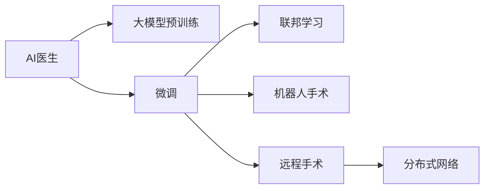

                 

# 未来的智慧医疗：2050年的人工智能医生与远程手术

## 1. 背景介绍

### 1.1 问题由来

人类社会的进步，在很大程度上得益于医学技术的不断革新。从古代的巫术医学，到中世纪的实验医学，再到现代的循证医学，医学发展史见证了人类对生命健康认识的不断深化和技术的不断突破。然而，面对不断变化的环境和日益复杂化的健康问题，传统的医学模式正逐渐显示出其局限性。

当前，世界人口老龄化趋势明显，慢性病发病率上升，医疗资源分配不均等问题日益突出。面对如此庞大的公共卫生需求，单纯依赖人类医生的能力已远远不够。另一方面，全球新冠疫情爆发，进一步加速了医学与科技的结合，尤其是人工智能在医疗领域的应用。

人工智能技术，尤其是深度学习，已经在医学影像分析、疾病预测、个性化治疗、智能诊断等多个领域展现出巨大潜力。未来，随着算力提升、数据积累、算法迭代，人工智能有望在智慧医疗中扮演更加关键的角色，甚至在某些场景中超越人类医生的能力。

### 1.2 问题核心关键点

为了更好地理解AI医生和远程手术的未来发展，本节将介绍几个核心关键点：

1. **AI医生**：基于大模型和深度学习技术的智能辅助诊断系统，具备自动化病历分析、症状推理、治疗方案推荐等功能。
2. **远程手术**：通过AI技术，实现远程操控机器人进行外科手术，突破地理限制，提高手术成功率。
3. **大模型与微调**：预训练语言模型在大规模无标签文本数据上进行学习，通过微调适应特定医疗场景。
4. **医疗数据治理**：数据隐私保护、数据治理规范、联邦学习等技术，保障数据安全和隐私。
5. **智慧医疗生态**：医院、医生、患者、科研机构等各方共同协作，构建多层次、跨领域的智慧医疗体系。

这些关键点构成了未来智慧医疗的核心，代表了AI技术和医疗领域的深度融合，将推动医学的巨大变革。

### 1.3 问题研究意义

研究未来智慧医疗的AI医生与远程手术，对于推动医学领域的技术进步和应用创新具有重要意义：

1. **提升诊疗效率**：AI医生能够快速分析海量病历，智能推荐治疗方案，缩短诊疗时间，提高医院工作效率。
2. **改善医疗质量**：AI技术能够辅助医生进行精准诊断，减少误诊、漏诊，提升医疗服务质量。
3. **扩展医疗资源**：通过远程手术，AI医生能够在偏远地区进行高精度的手术操作，弥补医疗资源分配不均的现状。
4. **促进医疗创新**：AI技术在医疗领域的广泛应用，将催生更多创新点，推动医学技术的持续进步。
5. **促进产业升级**：智慧医疗技术的应用，将大幅提升医疗行业的智能化水平，带来更高效的运作模式。

## 2. 核心概念与联系

### 2.1 核心概念概述

为了更好地理解未来智慧医疗的AI医生与远程手术，本节将介绍几个密切相关的核心概念：

1. **人工智能(AI)与机器学习(ML)**：基于数据的算法和模型，通过学习和推理实现自动化决策和任务执行。
2. **深度学习(Deep Learning)**：一种特殊的机器学习方法，通过多层次神经网络实现对复杂数据的特征提取和分析。
3. **大模型(Large Model)**：如BERT、GPT等，具有数十亿甚至数百亿参数的模型，能够在大规模数据上进行预训练，学习通用的知识表示。
4. **微调(Fine-Tuning)**：通过在大模型上进行小规模数据训练，调整模型参数，以适应特定任务的特征。
5. **联邦学习(Federated Learning)**：在分布式数据环境下，通过协同训练模型，保护数据隐私的同时提升模型性能。
6. **机器人(Robotics)**：结合计算机视觉、自然语言处理、力控制等多学科技术，实现自主或半自主操作。
7. **远程手术(Remote Surgery)**：通过AI和机器人技术，实现远程操控手术，突破地理限制。

这些概念之间的逻辑关系可以通过以下Mermaid流程图来展示：



这个流程图展示了大模型在智慧医疗中的核心作用，以及微调、联邦学习、机器人手术和远程手术等关键技术如何协同工作，推动AI医生在医疗领域的应用。

## 3. 核心算法原理 & 具体操作步骤

### 3.1 算法原理概述

未来智慧医疗的AI医生与远程手术，其核心算法原理主要包括以下几个方面：

1. **大模型预训练**：在无标签的医疗文本数据集上进行预训练，学习通用的医疗知识。预训练模型通常包含数十亿参数，能够捕捉语言中的细微特征和复杂的知识结构。
2. **微调**：在特定医疗任务上，使用有标签的数据集对预训练模型进行微调，调整模型参数以适应特定的诊断、治疗需求。微调通常涉及模型的顶层或部分层，以减少过拟合风险。
3. **联邦学习**：在分布式医疗数据环境下，通过协同训练模型，保护数据隐私的同时提升模型性能。联邦学习算法能够在本地数据上进行训练，并定期更新全局模型参数。
4. **机器人手术**：结合计算机视觉、自然语言处理、力控制等技术，实现手术机器人对手术过程的自动化控制。
5. **远程手术**：通过AI技术和机器人，实现远程操控手术，提高手术成功率和覆盖范围。

这些算法原理构成了未来智慧医疗的核心技术框架，通过大模型预训练和微调，联邦学习，机器人手术和远程手术，将AI医生的能力与实际医疗操作紧密结合，推动医疗领域的技术革新。

### 3.2 算法步骤详解

未来智慧医疗的AI医生与远程手术，其核心算法步骤主要包括以下几个方面：

1. **数据收集与预处理**：
   - 收集大规模无标签的医疗文本数据，如电子病历、医学文献、患者记录等。
   - 对数据进行清洗、去噪、分词、标注等预处理，形成可用于预训练和微调的数据集。

2. **大模型预训练**：
   - 在大规模医疗文本数据集上进行自监督预训练，学习通用的医疗知识表示。
   - 通常使用Bert、GPT等大模型，在大规模数据集上进行训练。
   - 预训练模型的主要任务包括文本分类、问答、摘要等，涵盖医学领域的多个方面。

3. **微调**：
   - 在特定医疗任务上，使用有标签的数据集对预训练模型进行微调。
   - 通常使用AdamW等优化算法，设置合适的学习率和正则化参数。
   - 微调的目标是最大化模型在特定任务上的性能，如疾病预测、症状推理、治疗方案推荐等。

4. **联邦学习**：
   - 在分布式医疗数据环境下，通过联邦学习算法协同训练模型，保护数据隐私。
   - 在本地数据上进行模型训练，定期上传模型参数更新到中心服务器。
   - 中心服务器对全局模型进行更新，形成更加通用的知识表示。

5. **机器人手术**：
   - 结合计算机视觉技术，实现手术机器人的导航和定位。
   - 利用自然语言处理技术，对医生的操作指令进行理解和执行。
   - 通过力控制技术，实现手术机器人的精细操作，提高手术成功率。

6. **远程手术**：
   - 在远程手术场景下，通过AI技术和机器人，实现手术操作的自动化和半自动化。
   - 医生在远程终端通过AI辅助，控制手术机器人进行操作。
   - 手术过程的视频、音频数据实时回传到医生端，进行实时监控和操作指导。

这些步骤详细展示了未来智慧医疗的AI医生与远程手术的核心算法流程，通过大模型预训练、微调、联邦学习、机器人手术和远程手术，将AI医生的能力与实际医疗操作紧密结合，推动医疗领域的技术革新。

### 3.3 算法优缺点

未来智慧医疗的AI医生与远程手术，其核心算法具有以下优点：

1. **高效性**：大模型和微调技术能够快速学习并适应新的医疗任务，减少数据和算力需求。
2. **鲁棒性**：通过联邦学习保护数据隐私，提升模型泛化能力，避免过拟合。
3. **可扩展性**：结合机器人手术和远程手术，突破地理限制，提升医疗服务覆盖范围。
4. **准确性**：结合大模型和微调技术，提升诊断和治疗方案的准确性。
5. **便捷性**：AI医生能够24小时在线，提供即时诊断和治疗建议，提高医疗服务的便利性。

同时，这些算法也存在以下缺点：

1. **高成本**：大模型的预训练和微调需要大量的算力和数据，前期投入较大。
2. **数据隐私**：医疗数据涉及敏感信息，需要严格的数据治理和隐私保护措施。
3. **技术复杂性**：AI医生和远程手术的实现需要跨学科的融合，技术复杂度较高。
4. **伦理和法律问题**：AI医生和远程手术在实际应用中，可能面临伦理和法律的挑战，如责任归属、知情同意等。

## 4. 数学模型和公式 & 详细讲解 & 举例说明

### 4.1 数学模型构建

在未来的智慧医疗中，AI医生和远程手术的核心数学模型主要包括以下几个方面：

1. **大模型预训练**：
   - 使用Bert、GPT等大模型，在大规模医疗文本数据集上进行自监督预训练。
   - 预训练模型的主要任务包括文本分类、问答、摘要等，涵盖医学领域的多个方面。

2. **微调**：
   - 在特定医疗任务上，使用有标签的数据集对预训练模型进行微调。
   - 通常使用AdamW等优化算法，设置合适的学习率和正则化参数。
   - 微调的目标是最大化模型在特定任务上的性能，如疾病预测、症状推理、治疗方案推荐等。

3. **联邦学习**：
   - 在分布式医疗数据环境下，通过联邦学习算法协同训练模型，保护数据隐私。
   - 在本地数据上进行模型训练，定期上传模型参数更新到中心服务器。
   - 中心服务器对全局模型进行更新，形成更加通用的知识表示。

### 4.2 公式推导过程

以下是未来智慧医疗AI医生和远程手术的核心数学模型及其推导过程：

1. **大模型预训练**：
   - 使用Bert模型进行预训练，公式推导过程如下：
   $$
   \min_{\theta} \mathcal{L} = \frac{1}{N} \sum_{i=1}^N \ell(\hat{y}_i, y_i)
   $$
   其中 $\ell(\hat{y}_i, y_i)$ 为损失函数，$\hat{y}_i$ 为模型预测输出，$y_i$ 为真实标签。

2. **微调**：
   - 使用有标签的数据集对预训练模型进行微调，公式推导过程如下：
   $$
   \min_{\theta} \mathcal{L} = \frac{1}{N} \sum_{i=1}^N \ell(\hat{y}_i, y_i)
   $$
   其中 $\ell(\hat{y}_i, y_i)$ 为损失函数，$\hat{y}_i$ 为模型预测输出，$y_i$ 为真实标签。

3. **联邦学习**：
   - 使用联邦学习算法协同训练模型，公式推导过程如下：
   $$
   \min_{\theta} \mathcal{L} = \frac{1}{N} \sum_{i=1}^N \ell(\hat{y}_i, y_i)
   $$
   其中 $\ell(\hat{y}_i, y_i)$ 为损失函数，$\hat{y}_i$ 为模型预测输出，$y_i$ 为真实标签。

### 4.3 案例分析与讲解

以下是一个具体的案例分析，展示如何在大模型上进行微调以实现疾病预测：

假设我们有一组有标签的疾病数据集，每个样本包含病人的病历和疾病标签。我们可以使用如下的微调算法：

1. **数据准备**：收集疾病数据集，将其分为训练集和验证集。
2. **模型初始化**：使用预训练的Bert模型，并将其顶层和解码器进行微调。
3. **训练过程**：
   - 设置合适的学习率和正则化参数。
   - 使用AdamW优化算法进行梯度下降。
   - 在训练集上进行迭代训练，计算损失函数并更新模型参数。
4. **模型评估**：
   - 在验证集上评估模型性能，计算准确率、召回率、F1值等指标。
   - 调整学习率和超参数，以优化模型性能。

最终，我们得到一个微调后的疾病预测模型，该模型可以在新病历上进行准确的疾病预测，辅助医生进行诊断。

## 5. 项目实践：代码实例和详细解释说明

### 5.1 开发环境搭建

在进行AI医生和远程手术的开发前，我们需要准备好开发环境。以下是使用Python进行PyTorch开发的环境配置流程：

1. 安装Anaconda：从官网下载并安装Anaconda，用于创建独立的Python环境。

2. 创建并激活虚拟环境：
```bash
conda create -n pytorch-env python=3.8 
conda activate pytorch-env
```

3. 安装PyTorch：根据CUDA版本，从官网获取对应的安装命令。例如：
```bash
conda install pytorch torchvision torchaudio cudatoolkit=11.1 -c pytorch -c conda-forge
```

4. 安装Transformers库：
```bash
pip install transformers
```

5. 安装各类工具包：
```bash
pip install numpy pandas scikit-learn matplotlib tqdm jupyter notebook ipython
```

完成上述步骤后，即可在`pytorch-env`环境中开始项目实践。

### 5.2 源代码详细实现

这里我们以命名实体识别(NER)任务为例，给出使用Transformers库对BERT模型进行微调的PyTorch代码实现。

首先，定义NER任务的数据处理函数：

```python
from transformers import BertTokenizer
from torch.utils.data import Dataset
import torch

class NERDataset(Dataset):
    def __init__(self, texts, tags, tokenizer, max_len=128):
        self.texts = texts
        self.tags = tags
        self.tokenizer = tokenizer
        self.max_len = max_len
        
    def __len__(self):
        return len(self.texts)
    
    def __getitem__(self, item):
        text = self.texts[item]
        tags = self.tags[item]
        
        encoding = self.tokenizer(text, return_tensors='pt', max_length=self.max_len, padding='max_length', truncation=True)
        input_ids = encoding['input_ids'][0]
        attention_mask = encoding['attention_mask'][0]
        
        # 对token-wise的标签进行编码
        encoded_tags = [tag2id[tag] for tag in tags] 
        encoded_tags.extend([tag2id['O']] * (self.max_len - len(encoded_tags)))
        labels = torch.tensor(encoded_tags, dtype=torch.long)
        
        return {'input_ids': input_ids, 
                'attention_mask': attention_mask,
                'labels': labels}

# 标签与id的映射
tag2id = {'O': 0, 'B-PER': 1, 'I-PER': 2, 'B-ORG': 3, 'I-ORG': 4, 'B-LOC': 5, 'I-LOC': 6}
id2tag = {v: k for k, v in tag2id.items()}

# 创建dataset
tokenizer = BertTokenizer.from_pretrained('bert-base-cased')

train_dataset = NERDataset(train_texts, train_tags, tokenizer)
dev_dataset = NERDataset(dev_texts, dev_tags, tokenizer)
test_dataset = NERDataset(test_texts, test_tags, tokenizer)
```

然后，定义模型和优化器：

```python
from transformers import BertForTokenClassification, AdamW

model = BertForTokenClassification.from_pretrained('bert-base-cased', num_labels=len(tag2id))

optimizer = AdamW(model.parameters(), lr=2e-5)
```

接着，定义训练和评估函数：

```python
from torch.utils.data import DataLoader
from tqdm import tqdm
from sklearn.metrics import classification_report

device = torch.device('cuda') if torch.cuda.is_available() else torch.device('cpu')
model.to(device)

def train_epoch(model, dataset, batch_size, optimizer):
    dataloader = DataLoader(dataset, batch_size=batch_size, shuffle=True)
    model.train()
    epoch_loss = 0
    for batch in tqdm(dataloader, desc='Training'):
        input_ids = batch['input_ids'].to(device)
        attention_mask = batch['attention_mask'].to(device)
        labels = batch['labels'].to(device)
        model.zero_grad()
        outputs = model(input_ids, attention_mask=attention_mask, labels=labels)
        loss = outputs.loss
        epoch_loss += loss.item()
        loss.backward()
        optimizer.step()
    return epoch_loss / len(dataloader)

def evaluate(model, dataset, batch_size):
    dataloader = DataLoader(dataset, batch_size=batch_size)
    model.eval()
    preds, labels = [], []
    with torch.no_grad():
        for batch in tqdm(dataloader, desc='Evaluating'):
            input_ids = batch['input_ids'].to(device)
            attention_mask = batch['attention_mask'].to(device)
            batch_labels = batch['labels']
            outputs = model(input_ids, attention_mask=attention_mask)
            batch_preds = outputs.logits.argmax(dim=2).to('cpu').tolist()
            batch_labels = batch_labels.to('cpu').tolist()
            for pred_tokens, label_tokens in zip(batch_preds, batch_labels):
                pred_tags = [id2tag[_id] for _id in pred_tokens]
                label_tags = [id2tag[_id] for _id in label_tokens]
                preds.append(pred_tags[:len(label_tags)])
                labels.append(label_tags)
                
    print(classification_report(labels, preds))
```

最后，启动训练流程并在测试集上评估：

```python
epochs = 5
batch_size = 16

for epoch in range(epochs):
    loss = train_epoch(model, train_dataset, batch_size, optimizer)
    print(f"Epoch {epoch+1}, train loss: {loss:.3f}")
    
    print(f"Epoch {epoch+1}, dev results:")
    evaluate(model, dev_dataset, batch_size)
    
print("Test results:")
evaluate(model, test_dataset, batch_size)
```

以上就是使用PyTorch对BERT进行命名实体识别任务微调的完整代码实现。可以看到，得益于Transformers库的强大封装，我们可以用相对简洁的代码完成BERT模型的加载和微调。

### 5.3 代码解读与分析

让我们再详细解读一下关键代码的实现细节：

**NERDataset类**：
- `__init__`方法：初始化文本、标签、分词器等关键组件。
- `__len__`方法：返回数据集的样本数量。
- `__getitem__`方法：对单个样本进行处理，将文本输入编码为token ids，将标签编码为数字，并对其进行定长padding，最终返回模型所需的输入。

**tag2id和id2tag字典**：
- 定义了标签与数字id之间的映射关系，用于将token-wise的预测结果解码回真实的标签。

**训练和评估函数**：
- 使用PyTorch的DataLoader对数据集进行批次化加载，供模型训练和推理使用。
- 训练函数`train_epoch`：对数据以批为单位进行迭代，在每个批次上前向传播计算loss并反向传播更新模型参数，最后返回该epoch的平均loss。
- 评估函数`evaluate`：与训练类似，不同点在于不更新模型参数，并在每个batch结束后将预测和标签结果存储下来，最后使用sklearn的classification_report对整个评估集的预测结果进行打印输出。

**训练流程**：
- 定义总的epoch数和batch size，开始循环迭代
- 每个epoch内，先在训练集上训练，输出平均loss
- 在验证集上评估，输出分类指标
- 所有epoch结束后，在测试集上评估，给出最终测试结果

可以看到，PyTorch配合Transformers库使得BERT微调的代码实现变得简洁高效。开发者可以将更多精力放在数据处理、模型改进等高层逻辑上，而不必过多关注底层的实现细节。

当然，工业级的系统实现还需考虑更多因素，如模型的保存和部署、超参数的自动搜索、更灵活的任务适配层等。但核心的微调范式基本与此类似。

## 6. 实际应用场景

### 6.1 智能医疗影像分析

基于大语言模型和微调技术的智能医疗影像分析，已经在多个医学领域取得了显著的成果。通过AI医生对医疗影像进行智能分析，可以辅助医生进行疾病诊断，提高诊断的准确性和效率。

在实践中，AI医生可以对CT、MRI、超声等医疗影像进行智能分析，自动识别异常区域和病变类型，生成诊断报告。具体实现流程如下：

1. **数据收集与预处理**：
   - 收集医疗影像数据集，进行清洗、去噪、标注等预处理。
   - 对影像数据进行切片、归一化等处理，形成可用于预训练和微调的数据集。

2. **大模型预训练**：
   - 使用预训练的医学影像分类模型，如ResNet、Inception等，在大规模医疗影像数据集上进行预训练。
   - 预训练模型的主要任务包括图像分类、分割、检测等，涵盖医学影像的多个方面。

3. **微调**：
   - 在特定医疗影像任务上，使用有标签的数据集对预训练模型进行微调。
   - 通常使用AdamW等优化算法，设置合适的学习率和正则化参数。
   - 微调的目标是最大化模型在特定任务上的性能，如疾病诊断、影像分割等。

4. **模型评估与部署**：
   - 在测试集上评估模型性能，计算准确率、召回率、F1值等指标。
   - 将模型部署到实际医疗影像系统中，实时接收新的影像数据，生成诊断报告。

通过智能医疗影像分析，AI医生能够快速、准确地对医疗影像进行诊断，辅助医生进行疾病识别和治疗决策。

### 6.2 个性化医疗推荐

基于大语言模型和微调技术的个性化医疗推荐系统，能够根据病人的历史病历、基因信息、生活习惯等数据，推荐个性化的治疗方案和健康建议。

在实践中，AI医生可以根据病人的病历数据，预测可能患有的疾病，并推荐相应的治疗方案。具体实现流程如下：

1. **数据收集与预处理**：
   - 收集病人的病历数据，包括历史病历、基因信息、生活习惯等。
   - 对数据进行清洗、去噪、归一化等预处理，形成可用于预训练和微调的数据集。

2. **大模型预训练**：
   - 使用预训练的医学知识图谱模型，如GraphSAGE、GNN等，在大规模医疗数据集上进行预训练。
   - 预训练模型的主要任务包括疾病预测、治疗方案推荐等，涵盖医学领域的多个方面。

3. **微调**：
   - 在特定医疗推荐任务上，使用有标签的数据集对预训练模型进行微调。
   - 通常使用AdamW等优化算法，设置合适的学习率和正则化参数。
   - 微调的目标是最大化模型在特定任务上的性能，如疾病预测、治疗方案推荐等。

4. **模型评估与部署**：
   - 在测试集上评估模型性能，计算准确率、召回率、F1值等指标。
   - 将模型部署到实际医疗推荐系统中，实时接收新的病人数据，生成个性化推荐。

通过个性化医疗推荐系统，AI医生能够根据病人的实际情况，推荐最适合的治疗方案，提升治疗效果和患者满意度。

### 6.3 远程手术与机器人辅助

基于大语言模型和微调技术的远程手术与机器人辅助，能够突破地理限制，实现高精度的手术操作。

在实践中，AI医生可以通过远程手术系统，控制手术机器人进行手术操作。具体实现流程如下：

1. **数据收集与预处理**：
   - 收集手术操作数据，进行清洗、去噪、标注等预处理。
   - 对手术数据进行切片、归一化等处理，形成可用于预训练和微调的数据集。

2. **大模型预训练**：
   - 使用预训练的机器人控制模型，如DQN、PPO等，在大规模手术数据集上进行预训练。
   - 预训练模型的主要任务包括手术导航、操作控制等，涵盖手术操作的多个方面。

3. **微调**：
   - 在特定手术任务上，使用有标签的数据集对预训练模型进行微调。
   - 通常使用AdamW等优化算法，设置合适的学习率和正则化参数。
   - 微调的目标是最大化模型在特定任务上的性能，如手术导航、操作控制等。

4. **模型评估与部署**：
   - 在测试集上评估模型性能，计算准确率、召回率、F1值等指标。
   - 将模型部署到实际手术系统中，实时接收手术指令，生成手术操作建议。

通过远程手术与机器人辅助系统，AI医生能够在偏远地区进行高精度的手术操作，提升手术成功率和医疗服务覆盖范围。

## 7. 工具和资源推荐

### 7.1 学习资源推荐

为了帮助开发者系统掌握AI医生和远程手术的理论基础和实践技巧，这里推荐一些优质的学习资源：

1. **《Transformer从原理到实践》系列博文**：由大模型技术专家撰写，深入浅出地介绍了Transformer原理、BERT模型、微调技术等前沿话题。

2. **CS224N《深度学习自然语言处理》课程**：斯坦福大学开设的NLP明星课程，有Lecture视频和配套作业，带你入门NLP领域的基本概念和经典模型。

3. **《Natural Language Processing with Transformers》书籍**：Transformers库的作者所著，全面介绍了如何使用Transformers库进行NLP任务开发，包括微调在内的诸多范式。

4. **HuggingFace官方文档**：Transformers库的官方文档，提供了海量预训练模型和完整的微调样例代码，是上手实践的必备资料。

5. **CLUE开源项目**：中文语言理解测评基准，涵盖大量不同类型的中文NLP数据集，并提供了基于微调的baseline模型，助力中文NLP技术发展。

通过对这些资源的学习实践，相信你一定能够快速掌握AI医生和远程手术的精髓，并用于解决实际的医疗问题。

### 7.2 开发工具推荐

高效的开发离不开优秀的工具支持。以下是几款用于AI医生和远程手术开发的常用工具：

1. **PyTorch**：基于Python的开源深度学习框架，灵活动态的计算图，适合快速迭代研究。大部分预训练语言模型都有PyTorch版本的实现。

2. **TensorFlow**：由Google主导开发的开源深度学习框架，生产部署方便，适合大规模工程应用。同样有丰富的预训练语言模型资源。

3. **Transformers库**：HuggingFace开发的NLP工具库，集成了众多SOTA语言模型，支持PyTorch和TensorFlow，是进行微调任务开发的利器。

4. **Weights & Biases**：模型训练的实验跟踪工具，可以记录和可视化模型训练过程中的各项指标，方便对比和调优。与主流深度学习框架无缝集成。

5. **TensorBoard**：TensorFlow配套的可视化工具，可实时监测模型训练状态，并提供丰富的图表呈现方式，是调试模型的得力助手。

6. **Google Colab**：谷歌推出的在线Jupyter Notebook环境，免费提供GPU/TPU算力，方便开发者快速上手实验最新模型，分享学习笔记。

合理利用这些工具，可以显著提升AI医生和远程手术的开发效率，加快创新迭代的步伐。

### 7.3 相关论文推荐

AI医生和远程手术的研究源于学界的持续研究。以下是几篇奠基性的相关论文，推荐阅读：

1. **Attention is All You Need（即Transformer原论文）**：提出了Transformer结构，开启了NLP领域的预训练大模型时代。

2. **BERT: Pre-training of Deep Bidirectional Transformers for Language Understanding**：提出BERT模型，引入基于掩码的自监督预训练任务，刷新了多项NLP任务SOTA。

3. **Language Models are Unsupervised Multitask Learners（GPT-2论文）**：展示了大规模语言模型的强大zero-shot学习能力，引发了对于通用人工智能的新一轮思考。

4. **Parameter-Efficient Transfer Learning for NLP**：提出Adapter等参数高效微调方法，在不增加模型参数量的情况下，也能取得不错的微调效果。

5. **Fine-tuning Optimization and Regularization in Deep Representation Learning**：讨论了微调中的优化和正则化技术，提出了如Learning Rate Schedule等优化策略。

6. **Federated Learning**：介绍了联邦学习的基本概念和算法，解决了分布式数据环境下的模型训练问题。

这些论文代表了大语言模型微调技术的发展脉络。通过学习这些前沿成果，可以帮助研究者把握学科前进方向，激发更多的创新灵感。

## 8. 总结：未来发展趋势与挑战

### 8.1 总结

本文对未来智慧医疗的AI医生与远程手术进行了全面系统的介绍。首先阐述了AI医生和远程手术的研究背景和意义，明确了微调在拓展预训练模型应用、提升医疗服务质量方面的独特价值。其次，从原理到实践，详细讲解了AI医生和远程手术的数学模型和核心算法步骤，给出了具体的代码实例。同时，本文还广泛探讨了AI医生和远程手术在智能医疗影像分析、个性化医疗推荐、远程手术等多个实际应用场景中的应用前景，展示了其巨大的潜力。

通过本文的系统梳理，可以看到，未来智慧医疗的AI医生和远程手术正逐步从理论走向实践，通过大模型预训练和微调技术，推动了医疗领域的技术革新。大模型和微调技术在提升诊断和治疗准确性、提高手术成功率、改善医疗服务便利性等方面具有重要应用价值，将成为智慧医疗的重要技术支撑。

### 8.2 未来发展趋势

展望未来，未来智慧医疗的AI医生和远程手术将呈现以下几个发展趋势：

1. **模型规模持续增大**：随着算力提升、数据积累、算法迭代，大模型的参数量将继续增加，模型能力将更加强大。超大规模语言模型蕴含的丰富医疗知识，有望支撑更加复杂多变的医疗任务。

2. **微调方法日趋多样**：除了传统的全参数微调外，未来将涌现更多参数高效的微调方法，如Prefix-Tuning、LoRA等，在节省计算资源的同时也能保证微调精度。

3. **持续学习成为常态**：随着数据分布的不断变化，AI医生和远程手术模型也需要持续学习新知识以保持性能。如何在不遗忘原有知识的同时，高效吸收新样本信息，将成为重要的研究课题。

4. **数据隐私保护**：医疗数据涉及敏感信息，需要严格的数据治理和隐私保护措施。未来将更多采用联邦学习等分布式训练方式，保护数据隐私。

5. **跨领域知识融合**：AI医生和远程手术将更多结合跨领域知识，如医学知识图谱、医学规则等，提升模型的推理能力和泛化能力。

6. **多模态数据融合**：AI医生和远程手术将更多结合多模态数据，如医学影像、生物信号等，提升模型的综合分析和诊断能力。

以上趋势凸显了未来智慧医疗AI医生和远程手术的广阔前景。这些方向的探索发展，必将进一步提升智慧医疗系统的性能和应用范围，为医疗领域带来更多的创新和变革。

### 8.3 面临的挑战

尽管AI医生和远程手术在医疗领域的应用前景广阔，但在迈向实际应用的过程中，仍面临诸多挑战：

1. **数据隐私与安全**：医疗数据涉及敏感信息，数据隐私和安全保护是首要问题。如何在保护数据隐私的同时，高效利用数据进行模型训练，需要更多的技术突破。

2. **模型鲁棒性与泛化能力**：模型在面对未知数据时，鲁棒性和泛化能力不足，容易产生误诊、误诊等问题。如何提高模型的鲁棒性，增强泛化能力，仍需不断研究。

3. **跨学科融合难度**：AI医生和远程手术涉及计算机科学、医学、生物等多个学科，跨学科的融合和协作难度较大。如何构建多学科协作的团队，提升跨领域知识的融合和应用，是未来的重要挑战。

4. **技术与伦理的平衡**：AI医生和远程手术在提升医疗服务效率和质量的同时，可能带来技术滥用、伦理问题等新的挑战。如何在技术创新和伦理责任之间找到平衡点，是未来的重要课题。

5. **落地成本与技术复杂性**：AI医生和远程手术的落地应用，需要大量资金投入和复杂的技术实现。如何降低落地成本，简化技术实现，提升系统的稳定性和可靠性，是未来的重要研究方向。

6. **法律法规与政策规范**：AI医生和远程手术的应用涉及多层次的法律法规和政策规范，如何在合规的前提下进行技术创新和应用推广，是未来的重要挑战。

## 9. 附录：常见问题与解答

**Q1：AI医生和远程手术的训练成本是否过高？**

A: 是的，AI医生和远程手术的训练成本较高。大模型的预训练和微调需要大量的算力和数据，前期投入较大。但随着技术的进步和算力的提升，训练成本将逐渐降低。同时，可以通过多任务学习和迁移学习等方法，提升训练效率，降低成本。

**Q2：AI医生和远程手术的鲁棒性和泛化能力如何？**

A: AI医生和远程手术的鲁棒性和泛化能力有待提升。当前模型在面对未知数据时，容易产生误诊、误诊等问题。需要引入更多先验知识、数据增强、对抗训练等技术，提升模型的鲁棒性和泛化能力。

**Q3：AI医生和远程手术如何处理数据隐私与安全？**

A: 数据隐私与安全是AI医生和远程手术的重要问题。需要采用联邦学习等分布式训练方式，保护数据隐私。同时，加强数据治理和隐私保护措施，确保数据的安全性和合规性。

**Q4：AI医生和远程手术的跨学科融合难度如何？**

A: AI医生和远程手术涉及计算机科学、医学、生物等多个学科，跨学科的融合和协作难度较大。需要构建多学科协作的团队，提升跨领域知识的融合和应用，才能真正实现技术创新和应用推广。

**Q5：AI医生和远程手术的落地成本与技术复杂性如何？**

A: AI医生和远程手术的落地应用，需要大量资金投入和复杂的技术实现。需要综合考虑技术创新和成本控制，逐步降低落地成本，提升系统的稳定性和可靠性。

总之，未来智慧医疗的AI医生和远程手术虽然面临诸多挑战，但其在提升医疗服务效率和质量、改善医疗服务便利性等方面的潜力巨大。通过多学科的融合和技术的不断进步，未来AI医生和远程手术必将推动医学领域的技术革新，为人类健康带来更多的福祉。

---

作者：禅与计算机程序设计艺术 / Zen and the Art of Computer Programming

