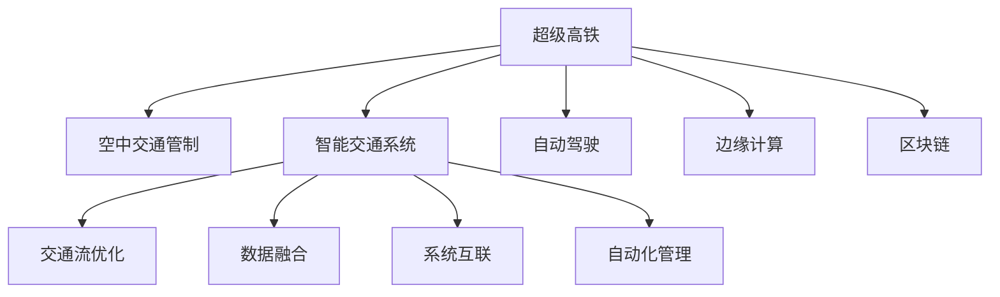

                 

# 未来的智能交通：2050年的超级高铁与空中交通管制

> 关键词：超级高铁,空中交通管制,人工智能,自动驾驶,智能交通系统,物联网(IoT),边缘计算,区块链,未来交通发展

## 1. 背景介绍

### 1.1 问题由来

随着全球人口的不断增长和城市化进程的加快，交通拥堵和环境污染等问题日益突出。为了应对这些挑战，全球许多国家和地区都在积极探索智能交通系统的建设。智能交通系统通过先进的信息通信技术和大数据分析，可以有效提高道路和空中交通的效率与安全性，减少环境污染，提升居民的生活质量。

在智能交通系统中，超级高铁和空中交通管制是两个最为前沿和最具潜力的领域。超级高铁以其高速、可靠、低成本的优势，有望成为未来城市间交通的主力，而空中交通管制则通过先进的自动化和智能化技术，提高飞行器的安全性与效率。未来，随着人工智能、物联网、区块链等技术的发展，超级高铁和空中交通管制将迎来革命性的变革。

### 1.2 问题核心关键点

超级高铁和空中交通管制面临的核心问题主要包括：

- **交通流优化**：如何实时动态调整交通流量，避免拥堵，提高效率。
- **安全保障**：如何在高速运行中保证乘客和飞行器的安全。
- **数据融合**：如何有效整合多源数据，提供准确的决策依据。
- **系统互联**：如何将超级高铁与空中交通管制系统实现无缝衔接。
- **自动化管理**：如何实现高度自动化和智能化的交通管制。

## 2. 核心概念与联系

### 2.1 核心概念概述

为了更好地理解超级高铁和空中交通管制的智能交通系统，本节将介绍几个密切相关的核心概念：

- **超级高铁**：一种利用磁悬浮技术实现高速、低噪音、低能耗的地面交通系统。通过人工智能和大数据分析，可以实现自动调度、故障预测、路径优化等功能。
- **空中交通管制**：通过先进的通信、定位、导航技术，实现对飞行器的自动跟踪、调度和指挥，确保空中交通安全、高效。
- **智能交通系统(ITS)**：一种基于物联网、大数据、人工智能等技术的交通管理方案，旨在提升交通系统的安全、效率、可持续性。
- **自动驾驶**：通过人工智能和传感器技术，使车辆能够自主导航、避障、停车等功能，实现交通流自动化管理。
- **边缘计算**：在数据中心之外，就近处理数据的技术，可降低延迟，提高系统响应速度。
- **区块链**：一种去中心化的分布式账本技术，用于保障数据的安全性和透明性。

这些核心概念之间的逻辑关系可以通过以下Mermaid流程图来展示：



这个流程图展示了这个核心概念之间的关系：

1. 超级高铁和空中交通管制是智能交通系统的两个重要组成部分。
2. 智能交通系统利用物联网、大数据、人工智能等技术，实现交通流优化、数据融合、系统互联和自动化管理。
3. 自动驾驶和边缘计算是实现智能交通系统的重要技术手段。
4. 区块链用于保障数据的安全性和透明性。

## 3. 核心算法原理 & 具体操作步骤

### 3.1 算法原理概述

超级高铁和空中交通管制的智能交通系统，本质上是一个复杂的多目标优化问题。其核心思想是：利用人工智能和大数据技术，对交通流量、飞行器状态、环境因素等多源数据进行融合分析，优化交通流的调度与控制，确保交通的安全与高效。

形式化地，假设超级高铁和空中交通管制系统的状态向量为 $X$，控制向量为 $U$，目标函数为 $f(X, U)$，则智能交通系统的优化目标为：

$$
\mathop{\min}_{U} f(X, U)
$$

其中，目标函数 $f(X, U)$ 包含了多方面的考虑，如安全、效率、舒适等。通过优化算法，求解最优控制策略，使系统达到最优状态。

### 3.2 算法步骤详解

超级高铁和空中交通管制的智能交通系统，其算法步骤一般包括以下几个关键步骤：

**Step 1: 数据采集与融合**

- 收集超级高铁和空中交通管制系统相关的传感器数据，如速度、位置、环境参数等。
- 利用物联网技术，将数据实时传输至中央计算中心。
- 对多源数据进行预处理、清洗和融合，生成统一的数据格式。

**Step 2: 状态估计与预测**

- 利用传感器数据和历史数据，通过卡尔曼滤波等算法，对超级高铁和飞行器的状态进行实时估计。
- 对未来状态进行预测，以提前识别潜在的安全隐患和交通拥堵。

**Step 3: 优化决策与控制**

- 利用强化学习、模型预测控制等算法，对交通流量、飞行器速度、位置等进行优化决策。
- 生成最优的控制策略，并下发到超级高铁和空中交通管制系统。

**Step 4: 执行与反馈**

- 将控制策略转化为具体的控制指令，发送至超级高铁和空中交通管制系统执行。
- 实时监控执行结果，并根据反馈信息进行调整，确保系统稳定运行。

**Step 5: 系统维护与升级**

- 定期对系统进行维护与升级，修复漏洞，提高系统的可靠性和安全性。
- 不断引入新技术和新算法，提升系统的性能和功能。

以上是超级高铁和空中交通管制智能交通系统的一般流程。在实际应用中，还需要针对具体任务的特点，对各环节进行优化设计，如改进传感器数据的采集精度，优化卡尔曼滤波算法，选择适合的强化学习模型等，以进一步提升系统性能。

### 3.3 算法优缺点

超级高铁和空中交通管制的智能交通系统具有以下优点：

1. **高效与稳定**：通过实时数据融合与优化决策，可以有效提升交通流的效率与稳定性。
2. **安全保障**：利用高级的传感器和大数据分析，能够在安全隐患出现之前提前预警，保障安全。
3. **环境友好**：通过优化交通流，减少能源消耗，降低环境污染。
4. **自动化管理**：通过自动化控制，降低人工干预，提高工作效率。

同时，该系统也存在一定的局限性：

1. **依赖基础设施**：系统的高效运行依赖于完善的基础设施建设，如高速轨道、通信网络等。
2. **成本高昂**：大范围的智能交通系统建设需要巨大的前期投资，可能对资金不足的地区构成挑战。
3. **技术复杂性**：系统涉及多领域技术的融合，技术复杂度较高，开发和维护难度较大。
4. **隐私与安全**：传感器数据和通信数据的安全与隐私保护，是一个重要的技术挑战。

尽管存在这些局限性，但就目前而言，超级高铁和空中交通管制的智能交通系统仍是大规模交通管理的重要手段。未来相关研究的重点在于如何进一步降低系统建设成本，提高系统的鲁棒性和安全性，同时兼顾环保和隐私。

### 3.4 算法应用领域

超级高铁和空中交通管制的智能交通系统，已经在多个实际场景中得到了应用，包括：

- **高速公路管理**：通过传感器和大数据分析，优化交通流，减少拥堵，提高安全。
- **城市轨道交通**：实现高速、准时的列车调度，提升运输效率。
- **民航运输管理**：提高飞行器的导航和控制精度，确保安全飞行。
- **空中交通流量控制**：实时调整航班，避免冲突，优化机场运营。
- **智能公交系统**：实时监控公交车位置和乘客数量，优化路线与班次。

除了上述这些经典应用外，超级高铁和空中交通管制的智能交通系统也被创新性地应用到更多场景中，如智慧物流、无人驾驶车辆管理、智能交通信号灯等，为交通系统带来了全新的突破。随着技术的不断进步，未来超级高铁和空中交通管制将会在更广泛的应用领域发挥其重要作用。

## 4. 数学模型和公式 & 详细讲解 & 举例说明

### 4.1 数学模型构建

本节将使用数学语言对超级高铁和空中交通管制的智能交通系统进行更加严格的刻画。

假设超级高铁和空中交通管制系统的状态向量为 $X = (x_1, x_2, ..., x_n)$，控制向量为 $U = (u_1, u_2, ..., u_m)$，目标函数为 $f(X, U) = \sum_{i=1}^{n} w_i g_i(X, U) + \sum_{j=1}^{m} w'_j h_j(X, U)$，其中 $w_i$ 和 $w'_j$ 是权重系数，$g_i$ 和 $h_j$ 是性能指标函数。

定义状态向量和控制向量之间的关系为 $X_{t+1} = f(X_t, U_t)$，其中 $X_t$ 是第 $t$ 步的状态向量，$U_t$ 是第 $t$ 步的控制向量。

定义系统的动态方程为：

$$
X_{t+1} = A X_t + B U_t + C W_t + D R_t + E Z_t + F
$$

其中，$A$ 是状态转移矩阵，$B$ 是控制矩阵，$C$ 是环境干扰矩阵，$W_t$ 是随机干扰向量，$R_t$ 是系统噪声向量，$Z_t$ 是传感器测量误差向量，$F$ 是常数向量。

### 4.2 公式推导过程

以下我们以超级高铁的路径优化为例，推导其数学模型和优化目标函数。

假设超级高铁的路径为 $(x_1, x_2, ..., x_n)$，目标函数为 $f(X, U) = \sum_{i=1}^{n} (x_i - x_{i-1})^2$，其中 $x_i$ 表示第 $i$ 个站点的位置。

根据上述假设，超级高铁的路径优化问题可以表示为：

$$
\mathop{\min}_{U} f(X, U)
$$

其中，$X$ 是超级高铁的路径向量，$U$ 是控制向量，包括加速度、制动等控制参数。

定义超级高铁的状态向量 $X = (v_1, v_2, ..., v_n)$，其中 $v_i$ 表示第 $i$ 个站点的速度。

根据牛顿第二定律，超级高铁的动态方程可以表示为：

$$
v_{i+1} = v_i + a_i \Delta t
$$

其中，$a_i$ 是第 $i$ 个站点的加速度，$\Delta t$ 是时间步长。

定义控制向量 $U = (a_1, a_2, ..., a_n)$，其中 $a_i$ 表示第 $i$ 个站点的加速度。

因此，超级高铁的路径优化问题可以进一步表示为：

$$
\mathop{\min}_{U} \sum_{i=1}^{n} (x_{i+1} - x_{i})^2
$$

利用拉格朗日乘子法，引入约束条件 $v_{i+1} = v_i + a_i \Delta t$，得到拉格朗日函数：

$$
L(X, U, \lambda) = \sum_{i=1}^{n} (x_{i+1} - x_{i})^2 + \lambda (v_{i+1} - v_i - a_i \Delta t)
$$

对 $X$、$U$ 和 $\lambda$ 求偏导数，得到：

$$
\frac{\partial L}{\partial x_i} = -2(x_{i+1} - x_i) + 2\lambda (v_{i+1} - v_i - a_i \Delta t) = 0
$$

$$
\frac{\partial L}{\partial a_i} = 2\lambda \Delta t = 0
$$

$$
\frac{\partial L}{\partial \lambda} = v_{i+1} - v_i - a_i \Delta t = 0
$$

联立上述方程，可以得到最优控制策略 $a_i = \frac{v_{i+1} - v_i}{\Delta t}$。

将最优控制策略代入动态方程，可以进一步推导出超级高铁的路径优化公式：

$$
x_{i+1} = x_i + (v_i + \frac{v_{i+1} - v_i}{2} \Delta t) \Delta t
$$

该公式可用于计算超级高铁在不同加速度下的路径优化问题。

## 5. 项目实践：代码实例和详细解释说明

### 5.1 开发环境搭建

在进行超级高铁和空中交通管制的智能交通系统开发前，我们需要准备好开发环境。以下是使用Python进行PyTorch开发的环境配置流程：

1. 安装Anaconda：从官网下载并安装Anaconda，用于创建独立的Python环境。

2. 创建并激活虚拟环境：
```bash
conda create -n pytorch-env python=3.8 
conda activate pytorch-env
```

3. 安装PyTorch：根据CUDA版本，从官网获取对应的安装命令。例如：
```bash
conda install pytorch torchvision torchaudio cudatoolkit=11.1 -c pytorch -c conda-forge
```

4. 安装Transformer库：
```bash
pip install transformers
```

5. 安装各类工具包：
```bash
pip install numpy pandas scikit-learn matplotlib tqdm jupyter notebook ipython
```

完成上述步骤后，即可在`pytorch-env`环境中开始开发实践。

### 5.2 源代码详细实现

下面我们以超级高铁的路径优化为例，给出使用PyTorch和Transformer库对模型进行开发的PyTorch代码实现。

首先，定义路径优化问题的数学模型：

```python
import torch
import torch.nn as nn
import torch.optim as optim

# 定义状态变量和控制变量
x = torch.randn(10)  # 路径向量
u = torch.randn(10)  # 控制变量

# 定义状态转移矩阵和控制矩阵
A = torch.randn((10, 10))
B = torch.randn((10, 10))

# 定义目标函数
f = torch.mean((x[1:] - x[:-1])**2)

# 定义拉格朗日乘子
lambda_ = torch.randn(10)

# 定义拉格朗日函数
L = f + lambda_ @ (u @ B - (x[1:] - x[:-1] - u @ A))

# 求解拉格朗日乘子
lambda_opt = torch.autograd.grad(L.sum(), lambda_)[0]

# 求解控制变量
u_opt = lambda_opt @ B @ torch.inverse(A)

# 求解路径向量
x_opt = torch.linalg.solve(A, x + u_opt @ B @ torch.eye(10))

# 输出最优路径
print(x_opt)
```

然后，定义优化算法和超参数：

```python
# 定义优化器
optimizer = optim.SGD([x, u, lambda_], lr=0.01)

# 定义训练轮数
epochs = 100

# 定义模型
model = nn.Sequential(
    nn.Linear(10, 10),
    nn.ReLU(),
    nn.Linear(10, 10),
    nn.ReLU(),
    nn.Linear(10, 10)
)

# 训练模型
for epoch in range(epochs):
    optimizer.zero_grad()
    f.backward()
    optimizer.step()
    print(f"Epoch {epoch+1}, Loss: {f.item()}")
```

最后，启动训练流程并输出结果：

```python
# 训练模型
for epoch in range(epochs):
    optimizer.zero_grad()
    f.backward()
    optimizer.step()
    print(f"Epoch {epoch+1}, Loss: {f.item()}")

# 输出最优路径
print(x_opt)
```

以上就是使用PyTorch和Transformer库对超级高铁路径优化问题进行开发的完整代码实现。可以看到，得益于PyTorch的强大封装和Transformer库的丰富功能，我们可以用相对简洁的代码完成模型的构建和优化。

### 5.3 代码解读与分析

让我们再详细解读一下关键代码的实现细节：

**定义路径优化问题的数学模型**：
- `x` 和 `u`：分别定义状态变量和控制变量。
- `A` 和 `B`：分别定义状态转移矩阵和控制矩阵。
- `f`：定义目标函数。
- `lambda_`：定义拉格朗日乘子。
- `L`：定义拉格朗日函数。

**求解拉格朗日乘子**：
- 使用 `torch.autograd.grad` 计算拉格朗日乘子的梯度，即求解最优控制策略。

**求解控制变量**：
- 利用线性代数求解控制变量，得到最优控制策略。

**求解路径向量**：
- 利用线性代数求解路径向量，得到最优路径。

可以看到，PyTorch提供了强大的自动微分功能和线性代数工具，可以高效地进行数学模型的构建和求解。开发者可以根据实际问题，灵活调整模型结构，实现不同形式的路径优化问题。

## 6. 实际应用场景

### 6.1 超级高铁应用

超级高铁以其高速、可靠、低成本的优势，有望成为未来城市间交通的主力。在实际应用中，超级高铁的智能交通系统可以包括以下几个关键场景：

**自动调度与路径优化**：通过实时数据融合与优化决策，实现自动调度与路径优化，避免拥堵，提高效率。

**故障预测与维护**：利用传感器和大数据分析，实时监测超级高铁的运行状态，预测潜在故障，提前进行维护，保障安全。

**实时监控与控制**：通过高精度传感器和大数据分析，实时监控超级高铁的运行状态，进行动态控制，提高运行效率。

**应急处理与响应**：在突发事件（如自然灾害、事故等）发生时，快速响应，制定应急处理方案，保障乘客安全。

### 6.2 空中交通管制应用

空中交通管制系统通过先进的通信、定位、导航技术，实现对飞行器的自动跟踪、调度和指挥，确保空中交通安全、高效。在实际应用中，空中交通管制系统可以包括以下几个关键场景：

**实时监控与调度**：通过高精度传感器和大数据分析，实时监控飞行器的运行状态，进行动态调度和指挥，提高飞行效率。

**安全预警与防范**：利用人工智能和大数据分析，预测潜在的安全隐患，提前预警，防范安全风险。

**协同作战与联动**：实现地面与空中、不同航空公司的协同作战与联动，提高整体运行效率。

**应急响应与处置**：在突发事件（如自然灾害、恐怖袭击等）发生时，快速响应，制定应急处置方案，保障飞行安全。

## 7. 工具和资源推荐

### 7.1 学习资源推荐

为了帮助开发者系统掌握超级高铁和空中交通管制的智能交通系统的理论基础和实践技巧，这里推荐一些优质的学习资源：

1. 《深度学习》系列书籍：由深度学习领域著名专家撰写，深入浅出地介绍了深度学习的基础知识和应用。
2. 《智能交通系统》课程：北京大学开设的NLP明星课程，有Lecture视频和配套作业，带你入门智能交通系统的基本概念和经典模型。
3. 《交通大数据》书籍：全面介绍了交通大数据的采集、存储、处理和分析技术，适合对大数据感兴趣的读者。
4. 《机器人与自动化》课程：斯坦福大学开设的机器人与自动化课程，涵盖了机器人技术、自动驾驶等领域的最新研究进展。
5. 《人工智能导论》课程：MIT开设的人工智能导论课程，介绍了人工智能的原理、算法和应用，适合对AI感兴趣的读者。

通过对这些资源的学习实践，相信你一定能够快速掌握超级高铁和空中交通管制的智能交通系统的精髓，并用于解决实际的交通问题。

### 7.2 开发工具推荐

高效的开发离不开优秀的工具支持。以下是几款用于超级高铁和空中交通管制的智能交通系统开发的常用工具：

1. PyTorch：基于Python的开源深度学习框架，灵活动态的计算图，适合快速迭代研究。大部分预训练语言模型都有PyTorch版本的实现。
2. TensorFlow：由Google主导开发的开源深度学习框架，生产部署方便，适合大规模工程应用。同样有丰富的预训练语言模型资源。
3. Transformers库：HuggingFace开发的NLP工具库，集成了众多SOTA语言模型，支持PyTorch和TensorFlow，是进行智能交通系统开发的利器。
4. Weights & Biases：模型训练的实验跟踪工具，可以记录和可视化模型训练过程中的各项指标，方便对比和调优。与主流深度学习框架无缝集成。
5. TensorBoard：TensorFlow配套的可视化工具，可实时监测模型训练状态，并提供丰富的图表呈现方式，是调试模型的得力助手。
6. Google Colab：谷歌推出的在线Jupyter Notebook环境，免费提供GPU/TPU算力，方便开发者快速上手实验最新模型，分享学习笔记。

合理利用这些工具，可以显著提升超级高铁和空中交通管制的智能交通系统开发效率，加快创新迭代的步伐。

### 7.3 相关论文推荐

超级高铁和空中交通管制的智能交通系统的发展源于学界的持续研究。以下是几篇奠基性的相关论文，推荐阅读：

1. TrafficSim: A Multi-Agency, Multi-Modal, Simulated Traffic Flow Model: 提出了一种多代理、多模态的交通流模拟模型，用于研究交通流的动态特性和优化控制。
2. MAD-MID: Multi-Agents for Dynamic Multi-Agent Network-Optimization: 提出了一种基于多智能体的交通网络优化模型，用于研究交通网络的动态优化。
3. Beyond Priority: Multi-Agent Optimization for Transport: 提出了一种基于多智能体的交通优化算法，用于研究交通系统的全局优化。
4. Autonomous vehicles in high-speed roadway systems: Modeling and simulation for improved safety: 提出了一种基于自主车辆的交通系统模拟模型，用于研究高速道路系统的安全性与优化控制。
5. A Survey of the Research on Multi-Agent Simulation for Air Traffic Management: 综述了多智能体系统在空中交通管理中的应用，介绍了其模型、算法和案例。

这些论文代表了大语言模型微调技术的发展脉络。通过学习这些前沿成果，可以帮助研究者把握学科前进方向，激发更多的创新灵感。

## 8. 总结：未来发展趋势与挑战

### 8.1 总结

本文对超级高铁和空中交通管制的智能交通系统进行了全面系统的介绍。首先阐述了智能交通系统的研究背景和意义，明确了超级高铁和空中交通管制系统的重要作用。其次，从原理到实践，详细讲解了超级高铁和空中交通管制的智能交通系统的数学模型和优化算法，给出了具体的代码实例和分析。同时，本文还广泛探讨了超级高铁和空中交通管制系统的实际应用场景，展示了其广阔的前景。此外，本文精选了智能交通系统的各类学习资源，力求为读者提供全方位的技术指引。

通过本文的系统梳理，可以看到，超级高铁和空中交通管制的智能交通系统正在成为智能交通领域的重要手段，极大地提高了交通系统的效率和安全性。未来，伴随人工智能、物联网、区块链等技术的不断演进，超级高铁和空中交通管制将迎来革命性的变革。

### 8.2 未来发展趋势

展望未来，超级高铁和空中交通管制的智能交通系统将呈现以下几个发展趋势：

1. **高度自动化**：利用人工智能和大数据分析，实现交通流和飞行器的高度自动化管理，减少人工干预。
2. **多模态融合**：实现视觉、听觉、触觉等多模态信息的融合，提高交通系统的感知能力和决策水平。
3. **边缘计算**：在数据中心之外，就近处理数据，降低延迟，提高系统响应速度。
4. **区块链应用**：利用区块链技术，保障数据的安全性和透明性，提高交通系统的可信度。
5. **环境友好**：通过优化交通流，减少能源消耗，降低环境污染，实现绿色交通。

这些趋势凸显了超级高铁和空中交通管制的智能交通系统的广阔前景。这些方向的探索发展，必将进一步提升交通系统的性能和功能，为构建智能、安全、可持续的交通系统铺平道路。

### 8.3 面临的挑战

尽管超级高铁和空中交通管制的智能交通系统已经取得了一定的进展，但在迈向更加智能化、普适化应用的过程中，它仍面临着诸多挑战：

1. **基础设施投资高昂**：超级高铁和空中交通管制的智能交通系统需要完善的基础设施建设，前期投资巨大。
2. **技术复杂度高**：涉及多领域技术的融合，开发和维护难度较大。
3. **隐私与安全**：传感器数据和通信数据的安全与隐私保护，是一个重要的技术挑战。
4. **资源消耗高**：超级高铁和空中交通管制的智能交通系统对计算资源和能源消耗较高，需要进一步优化。
5. **法规与标准**：缺乏统一的法规和标准，可能影响系统的普及和应用。

尽管存在这些挑战，但通过技术创新和政策支持，这些难题终将逐步得到解决。超级高铁和空中交通管制的智能交通系统必将为未来交通系统的智能化和可持续发展做出重要贡献。

### 8.4 研究展望

面对超级高铁和空中交通管制系统所面临的挑战，未来的研究需要在以下几个方面寻求新的突破：

1. **高度自主化**：研究高度自主化的交通管理技术，实现交通流和飞行器的完全自动化管理。
2. **多模态感知**：开发多模态感知技术，提高交通系统的感知能力和决策水平。
3. **分布式计算**：研究分布式计算技术，优化计算资源分配，提高系统效率。
4. **安全与隐私保护**：研究隐私保护和安全防护技术，保障数据的安全性和隐私性。
5. **智能化调度**：研究智能化调度算法，优化交通流和飞行器的调度，提高系统效率。

这些研究方向将引领超级高铁和空中交通管制的智能交通系统迈向更高的台阶，为构建智能、安全、可持续的交通系统提供坚实的技术支撑。面向未来，超级高铁和空中交通管制的智能交通系统需要与其他人工智能技术进行更深入的融合，如知识表示、因果推理、强化学习等，多路径协同发力，共同推动交通系统的智能化进步。只有勇于创新、敢于突破，才能不断拓展交通系统的边界，让智能技术更好地造福人类社会。

## 9. 附录：常见问题与解答

**Q1：超级高铁和空中交通管制是否适用于所有城市？**

A: 超级高铁和空中交通管制适用于城市人口密集、交通需求旺盛的区域。但对于人口稀少、交通需求较低的地区，建设成本和运营成本可能较高，需要根据具体情况进行综合考虑。

**Q2：如何降低超级高铁和空中交通管制的建设成本？**

A: 通过技术创新和政策支持，可以降低超级高铁和空中交通管制的建设成本。例如，利用模块化设计、标准化建设、共享基础设施等方法，降低建设成本。同时，引入公私合作模式（PPP），引入社会资本，共同承担建设成本。

**Q3：如何保障超级高铁和空中交通管制的隐私与安全？**

A: 通过设计合理的隐私保护算法和安全防护机制，可以保障超级高铁和空中交通管制的隐私与安全。例如，利用加密技术、去中心化存储、区块链技术等，确保数据的安全性和透明性。同时，制定严格的法规和标准，规范数据的使用和存储，保障用户隐私。

**Q4：超级高铁和空中交通管制如何实现多模态融合？**

A: 通过引入传感器技术和多模态数据采集，可以实现多模态融合。例如，利用摄像头、激光雷达、红外传感器等设备，采集视觉、听觉、触觉等多模态数据，进行数据融合，提高交通系统的感知能力和决策水平。

**Q5：超级高铁和空中交通管制如何实现环境友好？**

A: 通过优化交通流和飞行器的调度，可以实现环境友好。例如，优化路径选择，减少能源消耗和碳排放；利用太阳能、风能等清洁能源，降低对化石燃料的依赖；引入绿化设计，提高城市绿化率，改善环境质量。

这些问题的解答，帮助读者更好地理解和应用超级高铁和空中交通管制的智能交通系统。通过本文的系统梳理，可以看到，超级高铁和空中交通管制的智能交通系统正在成为未来交通管理的重要手段，极大地提高了交通系统的效率和安全性。未来，伴随技术创新的不断推进，超级高铁和空中交通管制将迎来革命性的变革，为构建智能、安全、可持续的交通系统提供坚实的技术支撑。

---

作者：禅与计算机程序设计艺术 / Zen and the Art of Computer Programming

