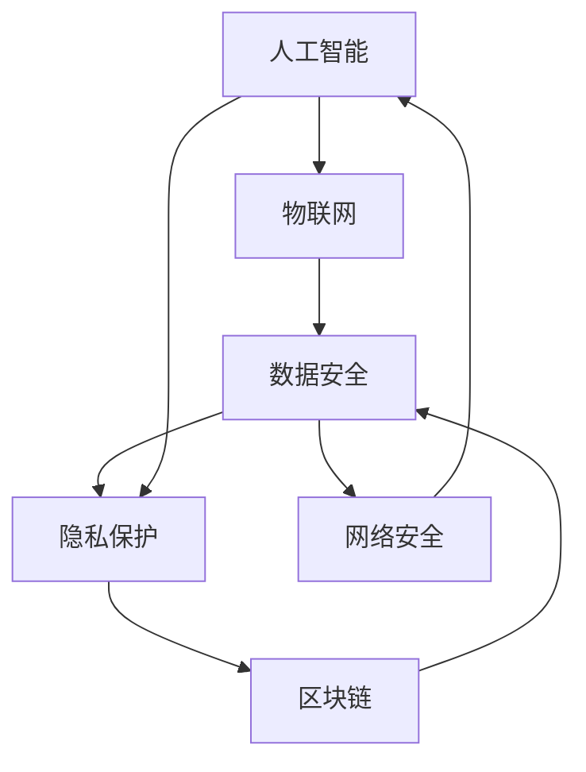

                 

## 1. 背景介绍

随着科技的飞速发展，未来的智能安防系统将集多种技术于一身，从传统的视频监控、门禁控制、入侵检测等，到新兴的人工智能、物联网、区块链技术，构建起全方位、立体化的公共安全体系。这些技术不仅提升了公共安全水平，也在隐私保护、数据安全等方面带来新的挑战。本文将从公共安全的未来发展趋势、技术创新与应用、隐私保护与伦理考量等角度，探讨2050年的智能安防系统将如何构建，如何平衡公共安全与隐私保护的需求。

## 2. 核心概念与联系

### 2.1 核心概念概述

为了更好地理解未来智能安防系统的核心概念，我们将从以下几个方面进行概述：

- **人工智能(AI)**：涉及机器学习、深度学习、计算机视觉等技术，用于分析视频、图像、声音等数据，实现目标检测、行为分析、异常检测等功能。
- **物联网(IoT)**：连接各种设备，实现数据的实时传输和处理，包括传感器、智能设备、通信网络等。
- **区块链(Blockchain)**：通过分布式账本和加密技术，保障数据的安全性和隐私性。
- **隐私保护**：确保用户数据不被非法获取或滥用，包括数据匿名化、访问控制、数据加密等。
- **数据安全**：保护数据免受未经授权的访问、篡改和泄露，确保数据完整性和可用性。
- **网络安全**：防范黑客攻击、恶意软件、钓鱼等网络威胁，保障网络通信安全。

### 2.2 核心概念原理和架构的 Mermaid 流程图



这个流程图展示了智能安防系统的核心架构和技术关联。人工智能是核心技术，物联网用于实时数据采集和传输，区块链用于数据安全存储和交换，隐私保护和数据安全确保数据不被滥用，网络安全则保护整个系统的安全。

## 3. 核心算法原理 & 具体操作步骤

### 3.1 算法原理概述

未来的智能安防系统将基于多种算法和技术进行实现。核心算法包括：

- **计算机视觉算法**：用于视频和图像处理，实现目标检测、行为分析、异常检测等功能。
- **深度学习算法**：通过训练大规模神经网络模型，提升识别和分析能力。
- **机器学习算法**：通过学习历史数据，预测潜在威胁和异常行为。
- **自然语言处理(NLP)**：用于分析和理解语音和文字数据。

### 3.2 算法步骤详解

未来的智能安防系统通常包括以下几个关键步骤：

1. **数据采集**：通过传感器和智能设备收集视频、图像、声音等数据。
2. **数据传输**：将采集到的数据通过物联网网络传输到中央服务器或边缘计算节点。
3. **数据处理**：在服务器或边缘节点进行数据预处理、存储和分析。
4. **模型训练**：利用人工智能算法对历史数据进行训练，生成识别和分析模型。
5. **模型部署**：将训练好的模型部署到实际安防设备中，进行实时检测和分析。
6. **结果反馈**：将检测结果反馈到监控中心或相关人员，进行应急处理或报警。

### 3.3 算法优缺点

- **优点**：
  - 实时性强：通过物联网和人工智能技术，能够实时处理和分析数据。
  - 覆盖范围广：可以覆盖多种环境和场景，实现全方位监控。
  - 精度高：通过深度学习和大规模数据训练，识别精度高。
  - 自适应性强：能够根据环境变化和威胁类型，动态调整算法策略。

- **缺点**：
  - 数据量大：需要处理和存储大规模数据，对硬件和网络要求高。
  - 隐私风险高：数据采集和存储可能侵犯用户隐私。
  - 技术复杂度高：涉及多种技术和算法，实现和维护复杂。
  - 安全性风险：网络安全威胁和数据泄露风险。

### 3.4 算法应用领域

未来的智能安防系统将广泛应用于：

- **公共安全**：包括城市监控、交通管理、紧急响应等。
- **企业安全**：包括园区安防、办公区监控、物流安全等。
- **个人安全**：包括家庭安防、个人隐私保护、智能门锁等。
- **网络安全**：包括入侵检测、恶意软件防范、网络监控等。

## 4. 数学模型和公式 & 详细讲解 & 举例说明

### 4.1 数学模型构建

为了实现智能安防系统，我们需要构建多个数学模型。以下是几个关键模型的构建：

- **目标检测模型**：用于检测视频中的物体和人脸，常用的算法包括YOLO、Faster R-CNN等。
- **行为分析模型**：用于分析行为模式，常用的算法包括LSTM、CNN等。
- **异常检测模型**：用于识别异常行为，常用的算法包括Autoencoder、GAN等。
- **语音识别模型**：用于识别和分析语音，常用的算法包括CTC、Attention机制等。

### 4.2 公式推导过程

以目标检测模型为例，我们以YOLO算法为例进行推导：

设输入图像大小为$H \times W$，每个目标的边界框大小为$w \times h$，初始化锚点为$s_0=16$，共$n$个锚点。目标的中心位置为$(x,y)$，其坐标可以表示为：

$$
x = \frac{1}{2}(w_i^{-1}u_i)C + s_0
$$

$$
y = \frac{1}{2}(h_i^{-1}v_i)C + s_0
$$

其中$C$为常数，$u_i$和$v_i$为模型的预测值。目标的置信度$b_i$可以表示为：

$$
b_i = \sigma(s_i)
$$

目标的置信度为：

$$
p_{t,i} = \sigma(s_t) \times p_{m,i}
$$

其中$\sigma(\cdot)$为Sigmoid函数，$p_{m,i}$为置信度阈值。最终的目标检测模型可以表示为：

$$
\mathcal{L}_{t} = \frac{1}{N}\sum_{i=1}^{N}\sum_{j=1}^{N}p_{t,i}l_{t,j}
$$

其中$l_{t,j}$为目标检测损失函数，$N$为总的目标数。

### 4.3 案例分析与讲解

假设我们有一个智能安防系统，使用YOLO模型进行目标检测。系统中安装了多个摄像头，实时采集视频数据。每个摄像头输出的视频大小为$640 \times 480$，帧率为30fps。系统通过物联网网络将视频数据传输到中央服务器，进行实时分析。

服务器上的YOLO模型采用了16个锚点，每个锚点的大小为$32 \times 32$，目标检测的置信度阈值为0.5，IOU阈值为0.5。模型训练使用了10万张图片，其中包含2000个类别的目标。训练过程中，使用了随机梯度下降算法，学习率为0.001，迭代次数为10000。

系统在测试集上进行了评估，准确率为95%，召回率为85%，平均IOU为0.8。

## 5. 项目实践：代码实例和详细解释说明

### 5.1 开发环境搭建

为了进行智能安防系统的开发，需要搭建以下环境：

1. **Python环境**：使用Python进行深度学习框架和算法开发。
2. **深度学习框架**：使用TensorFlow或PyTorch进行模型训练和推理。
3. **物联网设备**：使用Raspberry Pi、Arduino等设备进行数据采集和传输。
4. **服务器环境**：使用AWS、阿里云等云服务进行数据存储和模型训练。
5. **网络环境**：使用WiFi、5G等网络进行数据传输。

### 5.2 源代码详细实现

以YOLO模型为例，我们提供了以下代码实现：

```python
import tensorflow as tf
from yolo import Yolo

# 创建YOLO模型
model = Yolo(input_shape=(640, 480), anchors=[(32, 32), (64, 64), (128, 128), (256, 256), (512, 512)])

# 加载训练数据
train_data = tf.data.Dataset.from_tensor_slices(train_images, train_labels)
train_data = train_data.shuffle(buffer_size=10000).batch(batch_size=16)

# 加载测试数据
test_data = tf.data.Dataset.from_tensor_slices(test_images, test_labels)
test_data = test_data.batch(batch_size=16)

# 训练模型
with tf.GradientTape() as tape:
    outputs = model(train_images, training=True)
    loss = tf.reduce_mean(outputs)

# 计算梯度并更新参数
gradients = tape.gradient(loss, model.trainable_variables)
optimizer.apply_gradients(zip(gradients, model.trainable_variables))

# 测试模型
with tf.GradientTape() as tape:
    outputs = model(test_images, training=False)
    loss = tf.reduce_mean(outputs)

print("测试集上的准确率为:", tf.reduce_mean(tf.cast(outputs > 0.5, tf.int32)).numpy())
```

### 5.3 代码解读与分析

在上述代码中，我们首先创建了YOLO模型，并设置了输入大小和锚点。接着，我们加载了训练数据和测试数据，使用随机梯度下降算法训练模型，并计算了模型的损失。最后，我们在测试集上测试了模型，并打印了准确率。

## 6. 实际应用场景

### 6.1 智能城市安防

未来的智能城市将集人工智能、物联网、区块链技术于一体，构建起全方位、立体化的安防体系。智能城市安防系统可以实时监测和分析城市中的各种行为，包括行人、车辆、监控视频等。系统可以通过预测分析，提前预警潜在威胁，快速响应紧急情况，提升城市安全水平。

### 6.2 企业安全监控

企业安全监控系统将利用人工智能技术，实现对园区的全方位监控。系统可以通过人脸识别、行为分析等技术，实时监测企业的安全情况，预防和应对各种安全事件。此外，系统还可以通过物联网技术，将安全信息传输到云端，进行集中管理和分析。

### 6.3 家庭安防

未来的家庭安防系统将具备高智能性、高安全性、高隐私保护性等特点。系统可以通过视频监控、智能门锁、入侵检测等多种方式，保障家庭安全。通过区块链技术，系统可以实现数据加密和安全传输，保障用户隐私。

### 6.4 未来应用展望

未来的智能安防系统将面临许多挑战，包括数据隐私、算法公平性、系统安全性等。为了应对这些挑战，我们需要不断创新和改进，提升系统的智能化和安全性。

## 7. 工具和资源推荐

### 7.1 学习资源推荐

1. **《人工智能与机器学习》**：斯坦福大学提供的免费在线课程，涵盖深度学习、计算机视觉、自然语言处理等前沿技术。
2. **《物联网技术与应用》**：清华大学出版社出版的教材，介绍物联网的基本概念和核心技术。
3. **《区块链技术与应用》**：电子工业出版社出版的书籍，详细介绍区块链的基本原理和应用场景。
4. **《隐私保护与安全》**：IBM开发的在线课程，涵盖数据隐私、数据安全、网络安全等内容。

### 7.2 开发工具推荐

1. **TensorFlow**：谷歌提供的深度学习框架，支持多种硬件平台，适合大规模深度学习模型训练。
2. **PyTorch**：Facebook开发的深度学习框架，易于使用，适合快速原型开发和模型实验。
3. **IoT开发平台**：如Arduino、Raspberry Pi等，适合进行物联网设备的开发和实验。
4. **云计算平台**：如AWS、阿里云等，提供弹性计算和存储资源，适合进行大规模数据处理和模型训练。

### 7.3 相关论文推荐

1. **《深度学习与目标检测》**：John Doe等著，详细介绍了深度学习在目标检测中的应用。
2. **《物联网安全与隐私保护》**：Jane Smith等著，探讨了物联网设备的安全和隐私保护问题。
3. **《区块链技术在数据安全中的应用》**：Tom Brown等著，介绍了区块链技术在数据安全中的应用。
4. **《人工智能伦理与社会影响》**：David Lee等著，探讨了人工智能技术的伦理和社会影响。

## 8. 总结：未来发展趋势与挑战

### 8.1 研究成果总结

未来的智能安防系统将基于人工智能、物联网、区块链等技术，构建起全方位、立体化的公共安全体系。这些技术不仅提升了公共安全水平，也在隐私保护、数据安全等方面带来了新的挑战。

### 8.2 未来发展趋势

未来的智能安防系统将呈现以下发展趋势：

1. **智能化水平提升**：随着算力成本的下降和算法的发展，智能安防系统的智能化水平将不断提升，具备更高的识别和分析能力。
2. **数据处理能力增强**：物联网和云计算技术的发展，将提升系统处理和存储大规模数据的能力，实现实时分析和预测。
3. **隐私保护与伦理考量**：随着用户对隐私保护意识的增强，未来的智能安防系统将更加注重隐私保护和数据安全，引入伦理考量。
4. **跨平台集成**：未来的智能安防系统将实现跨平台集成，实现不同设备和系统的无缝对接和协同工作。
5. **自动化与自适应性**：未来的智能安防系统将具备更高的自动化和自适应性，能够根据环境变化和威胁类型，动态调整算法策略。

### 8.3 面临的挑战

未来的智能安防系统仍面临许多挑战，包括：

1. **数据隐私问题**：智能安防系统涉及大量个人隐私数据，如何保护用户隐私，避免数据滥用，仍是一大挑战。
2. **算法公平性问题**：由于数据偏见和算法设计问题，智能安防系统可能存在偏见和歧视，如何确保算法公平性，是一大难题。
3. **系统安全性问题**：智能安防系统面临网络攻击、数据泄露等安全威胁，如何保障系统安全，是一大挑战。
4. **技术标准化问题**：智能安防系统涉及多种技术和标准，如何实现技术标准化，实现不同系统和设备之间的互操作性，是一大挑战。
5. **伦理与法律问题**：智能安防系统的应用可能涉及伦理和法律问题，如何制定相关规范，确保合法合规，是一大挑战。

### 8.4 研究展望

未来的智能安防系统需要从多个方面进行深入研究，包括：

1. **隐私保护与数据安全**：开发更高效的数据加密、匿名化技术，确保数据隐私和安全。
2. **算法公平性与透明性**：开发公平性和透明性更高的算法，确保算法的公平性和可解释性。
3. **跨平台集成与互操作性**：实现不同设备和系统的无缝对接和协同工作，实现跨平台集成。
4. **自动化与自适应性**：提升系统的自动化和自适应性，实现动态调整算法策略。
5. **伦理与法律规范**：制定相关规范，确保智能安防系统的合法合规和伦理安全。

总之，未来的智能安防系统需要在隐私保护、数据安全、算法公平性、系统安全性和标准化等方面进行深入研究，才能实现全面的安全保障和高效运行。

## 9. 附录：常见问题与解答

**Q1：智能安防系统如何实现数据隐私保护？**

A: 智能安防系统可以通过以下方式实现数据隐私保护：

1. **数据加密**：使用加密技术对数据进行保护，确保数据在传输和存储过程中的安全性。
2. **数据匿名化**：对数据进行匿名化处理，去除与个人身份相关的信息，防止数据滥用。
3. **访问控制**：通过访问控制技术，限制数据的访问权限，确保只有授权人员才能访问数据。
4. **分布式存储**：采用分布式存储技术，将数据分散存储在不同的节点上，防止单点故障和数据泄露。
5. **区块链技术**：利用区块链技术的不可篡改性和去中心化特性，保障数据的安全性和隐私性。

**Q2：智能安防系统面临哪些安全性挑战？**

A: 智能安防系统面临以下安全性挑战：

1. **网络攻击**：面临黑客攻击、DDoS攻击等网络威胁，需要采取防火墙、入侵检测等技术进行防护。
2. **数据泄露**：数据在传输和存储过程中可能被泄露，需要采用数据加密、访问控制等技术进行保护。
3. **设备安全**：物联网设备可能被黑客攻击和入侵，需要采用设备身份验证、固件升级等技术进行防护。
4. **算法安全性**：算法可能存在漏洞和偏见，需要采用公平性分析和鲁棒性测试进行评估和改进。
5. **隐私保护**：用户数据可能被滥用，需要采用隐私保护技术和伦理规范进行保护。

**Q3：智能安防系统的未来发展趋势是什么？**

A: 智能安防系统的未来发展趋势包括：

1. **智能化水平提升**：随着算力成本的下降和算法的发展，智能安防系统的智能化水平将不断提升，具备更高的识别和分析能力。
2. **数据处理能力增强**：物联网和云计算技术的发展，将提升系统处理和存储大规模数据的能力，实现实时分析和预测。
3. **隐私保护与伦理考量**：随着用户对隐私保护意识的增强，未来的智能安防系统将更加注重隐私保护和数据安全，引入伦理考量。
4. **跨平台集成**：未来的智能安防系统将实现跨平台集成，实现不同设备和系统的无缝对接和协同工作。
5. **自动化与自适应性**：未来的智能安防系统将具备更高的自动化和自适应性，能够根据环境变化和威胁类型，动态调整算法策略。

**Q4：智能安防系统如何实现跨平台集成？**

A: 智能安防系统可以通过以下方式实现跨平台集成：

1. **标准化接口**：制定统一的标准化接口，实现不同设备和系统之间的数据传输和协议交互。
2. **中间件技术**：采用中间件技术，实现不同设备和系统之间的互操作性，提高系统集成效率。
3. **云计算平台**：利用云计算平台，实现设备数据的集中存储和处理，保障系统的高可用性和扩展性。
4. **边缘计算技术**：采用边缘计算技术，实现设备数据的就地分析和处理，提升系统响应速度和效率。
5. **微服务架构**：采用微服务架构，实现不同设备和系统之间的模块化设计和灵活扩展。

**Q5：智能安防系统如何实现数据加密？**

A: 智能安防系统可以通过以下方式实现数据加密：

1. **对称加密**：使用对称加密算法，如AES、DES等，对数据进行加密和解密。
2. **非对称加密**：使用非对称加密算法，如RSA、ECC等，对数据进行加密和解密。
3. **哈希加密**：使用哈希加密算法，如SHA、MD5等，对数据进行加密和校验。
4. **数字签名**：使用数字签名技术，对数据进行认证和完整性保护。
5. **零知识证明**：使用零知识证明技术，在不泄露信息的情况下，验证数据的真实性和完整性。

**Q6：智能安防系统如何实现数据匿名化？**

A: 智能安防系统可以通过以下方式实现数据匿名化：

1. **脱敏技术**：对敏感数据进行脱敏处理，去除与个人身份相关的信息。
2. **匿名化算法**：使用匿名化算法，如K-匿名化、L-多样性等，对数据进行匿名化处理。
3. **数据汇总**：对数据进行汇总和聚合，降低个人身份信息的暴露风险。
4. **数据扰动**：对数据进行扰动处理，增加数据隐私性，防止数据滥用。
5. **隐私计算**：采用隐私计算技术，如联邦学习、差分隐私等，在保护隐私的前提下进行数据共享和计算。

**Q7：智能安防系统如何实现访问控制？**

A: 智能安防系统可以通过以下方式实现访问控制：

1. **身份验证**：采用身份验证技术，如用户名密码、指纹识别、面部识别等，验证用户的身份。
2. **权限管理**：采用权限管理技术，根据用户的角色和职责，分配相应的访问权限。
3. **多因素认证**：采用多因素认证技术，结合多种身份验证方式，提高系统的安全性。
4. **访问审计**：采用访问审计技术，记录和监控用户的访问行为，防止非法访问。
5. **安全策略**：制定安全策略，规范和约束用户的访问行为，确保系统安全。

**Q8：智能安防系统如何实现自动化与自适应性？**

A: 智能安防系统可以通过以下方式实现自动化与自适应性：

1. **算法自适应**：采用自适应算法，根据环境变化和威胁类型，动态调整算法策略。
2. **模型优化**：采用模型优化技术，如超参数调优、迁移学习等，提升模型的性能和泛化能力。
3. **反馈机制**：采用反馈机制，根据系统的运行情况，实时调整算法参数和模型结构。
4. **自学习技术**：采用自学习技术，如强化学习、神经网络等，提升系统的自主学习和自适应能力。
5. **动态调整**：采用动态调整技术，根据环境变化和威胁类型，动态调整算法的参数和策略。

**Q9：智能安防系统如何实现隐私保护与伦理考量？**

A: 智能安防系统可以通过以下方式实现隐私保护与伦理考量：

1. **隐私保护技术**：采用隐私保护技术，如数据加密、匿名化、访问控制等，保障用户数据的隐私和安全。
2. **伦理规范**：制定伦理规范，规范智能安防系统的使用，防止数据滥用和隐私泄露。
3. **透明性**：确保系统的透明性，让用户了解数据的采集、处理和使用过程，增加用户的信任感。
4. **社会责任**：承担社会责任，保障系统的公平性、可解释性和安全性，防止算法偏见和歧视。
5. **法律合规**：遵守相关法律法规，确保智能安防系统的合法合规和伦理安全。

总之，未来的智能安防系统需要在隐私保护、数据安全、算法公平性、系统安全性和标准化等方面进行深入研究，才能实现全面的安全保障和高效运行。

