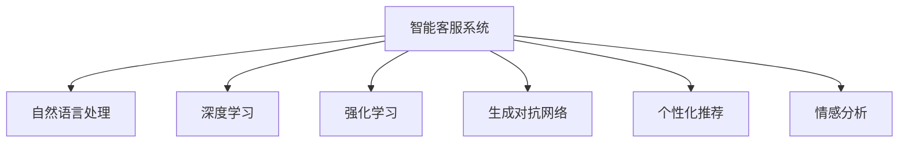

                 

# 未来的智能客服：2050年的智能客服机器人与智能投诉处理

## 1. 背景介绍

### 1.1 问题由来

随着科技的迅猛发展，智能客服已成为各大企业提升客户体验、降低运营成本的关键手段。智能客服系统通过人工智能技术，能够全天候提供即时响应，处理客户咨询和问题，显著提升了客户满意度和企业效率。然而，当前的智能客服系统仍存在诸多局限性，如回答质量不稳定、缺乏个性化服务、难以处理复杂情境等，难以完全替代人工客服。

### 1.2 问题核心关键点

智能客服的核心在于利用人工智能技术，通过自然语言处理和机器学习，实现对客户咨询的自动理解和响应。但当前智能客服系统的瓶颈在于：

1. **理解能力有限**：现有系统往往难以理解复杂情境和隐含含义，需要大量人工干预。
2. **缺乏个性化**：无法根据用户的历史行为和偏好，提供个性化的服务。
3. **响应速度慢**：响应时间长、处理复杂问题能力弱，用户体验不佳。
4. **难以处理投诉**：面对客户投诉时，系统无法快速识别问题本质，提供有效的解决方案。

### 1.3 问题研究意义

未来智能客服系统的发展方向，是如何构建一个更加智能化、个性化、高效和安全的客服体系。这不仅能够显著提升客户体验，降低企业运营成本，还能为企业带来更多的商业机会和客户忠诚度。特别是在2050年，随着人工智能技术的成熟，未来的智能客服将具备更高的智能水平，更强的处理复杂情境能力，更深入的个性化服务，以及更高的安全性和可靠性，为人类社会带来全新的客户交互体验。

## 2. 核心概念与联系

### 2.1 核心概念概述

为了更深入地理解未来智能客服系统的构建，首先需要明确一些核心概念：

- **智能客服系统**：利用人工智能技术，实现对客户咨询的自动理解和响应，提升客户体验和效率的系统。
- **自然语言处理**：通过语言模型和深度学习技术，理解和生成自然语言文本的技术。
- **深度学习**：基于多层神经网络，通过大量标注数据进行训练，以实现复杂任务的技术。
- **强化学习**：通过与环境互动，不断优化决策策略，实现智能决策和行为的技术。
- **生成对抗网络**：通过两个对抗的神经网络模型，生成高质量的文本、图像等生成任务的技术。
- **个性化推荐**：通过分析用户历史行为，推荐符合其兴趣的内容和服务的技术。
- **情感分析**：分析文本情感倾向，识别用户情绪，调整服务策略的技术。

这些核心概念之间的联系可以通过以下Mermaid流程图来展示：



这个流程图展示了智能客服系统如何通过自然语言处理、深度学习、强化学习、生成对抗网络、个性化推荐和情感分析等技术，实现对客户咨询的自动理解和响应。

## 3. 核心算法原理 & 具体操作步骤

### 3.1 算法原理概述

未来智能客服系统的构建，将基于深度学习和强化学习算法，通过大规模无标签数据进行预训练，并在特定任务上进行微调。其核心算法原理如下：

1. **预训练**：使用大规模无标签数据（如维基百科、新闻、社交媒体等）进行自监督学习，构建一个通用语言模型，能够理解自然语言的语义和语法结构。
2. **微调**：在特定任务（如客户咨询、投诉处理）上进行监督学习，通过少量标注数据对预训练模型进行微调，提升模型在特定任务上的表现。
3. **强化学习**：在实际应用场景中，智能客服系统通过与客户的交互，不断优化自身的决策策略，提升响应质量和效率。
4. **生成对抗网络**：用于生成高质量的自然语言文本，如回复、摘要等，提升系统的生成能力和自然度。

### 3.2 算法步骤详解

以下是未来智能客服系统的核心算法步骤：

**Step 1: 准备预训练模型和数据集**
- 使用大规模无标签数据，如维基百科、新闻、社交媒体等，进行自监督预训练，构建通用语言模型。
- 准备特定任务的标注数据集，如客户咨询、投诉处理等，划分为训练集、验证集和测试集。

**Step 2: 添加任务适配层**
- 根据任务类型，设计合适的输出层和损失函数。例如，对于问答任务，可以设计一个序列到序列模型，并使用交叉熵损失函数。

**Step 3: 设置微调超参数**
- 选择合适的优化算法及其参数，如Adam、SGD等，设置学习率、批大小、迭代轮数等。
- 设置正则化技术及强度，如L2正则、Dropout、Early Stopping等。
- 确定冻结预训练参数的策略，如仅微调顶层，或全部参数都参与微调。

**Step 4: 执行梯度训练**
- 将训练集数据分批次输入模型，前向传播计算损失函数。
- 反向传播计算参数梯度，根据设定的优化算法和学习率更新模型参数。
- 周期性在验证集上评估模型性能，根据性能指标决定是否触发 Early Stopping。
- 重复上述步骤直到满足预设的迭代轮数或 Early Stopping 条件。

**Step 5: 测试和部署**
- 在测试集上评估微调后模型，对比微调前后的精度提升。
- 使用微调后的模型对新样本进行推理预测，集成到实际的应用系统中。
- 持续收集新的数据，定期重新微调模型，以适应数据分布的变化。

### 3.3 算法优缺点

未来智能客服系统的构建基于深度学习和强化学习算法，具有以下优点：

1. **智能化高**：通过深度学习和大规模预训练，系统具备强大的自然语言理解和生成能力。
2. **个性化服务**：能够根据用户的历史行为和偏好，提供个性化的服务。
3. **高效响应**：通过强化学习，不断优化决策策略，提升响应质量和效率。
4. **鲁棒性强**：能够处理复杂的客户咨询和投诉，提高系统的鲁棒性。

同时，该方法也存在一些局限性：

1. **数据依赖性高**：微调和强化学习的效果很大程度上取决于标注数据的质量和数量，标注数据的获取成本较高。
2. **技术复杂性高**：系统构建涉及深度学习、强化学习等多个技术领域，需要较高的技术门槛。
3. **可解释性差**：深度学习和强化学习模型的决策过程难以解释，难以进行调试和优化。

尽管存在这些局限性，但未来智能客服系统的构建将逐步克服这些挑战，并带来更大的应用价值。

### 3.4 算法应用领域

未来智能客服系统的构建，将广泛应用于以下领域：

1. **客户咨询**：通过自然语言处理技术，实现对客户咨询的自动理解和响应，提升客户体验。
2. **投诉处理**：通过情感分析和语义理解，快速识别问题本质，提供有效的解决方案。
3. **个性化推荐**：根据用户历史行为和偏好，推荐符合其需求的内容和服务。
4. **客户流失预警**：通过分析用户行为数据，预测客户流失风险，采取挽留措施。
5. **自动化报表生成**：通过自然语言生成技术，自动生成各类业务报表和报告。

## 4. 数学模型和公式 & 详细讲解 & 举例说明

### 4.1 数学模型构建

本节将使用数学语言对未来智能客服系统的构建进行更加严格的刻画。

记智能客服系统为 $M_{\theta}$，其中 $\theta$ 为模型参数。假设客户咨询和投诉的数据集为 $D=\{(x_i,y_i)\}_{i=1}^N, x_i \in \mathcal{X}, y_i \in \mathcal{Y}$，其中 $\mathcal{X}$ 为输入空间，$\mathcal{Y}$ 为输出空间。

定义模型 $M_{\theta}$ 在输入 $x$ 上的损失函数为 $\ell(M_{\theta}(x),y)$，则在数据集 $D$ 上的经验风险为：

$$
\mathcal{L}(\theta) = \frac{1}{N} \sum_{i=1}^N \ell(M_{\theta}(x_i),y_i)
$$

其中 $\ell$ 为针对特定任务设计的损失函数，用于衡量模型预测输出与真实标签之间的差异。

### 4.2 公式推导过程

以问答任务为例，假设模型 $M_{\theta}$ 在输入 $x$ 上的输出为 $\hat{y}=M_{\theta}(x) \in [0,1]$，表示样本属于正类的概率。真实标签 $y \in \{0,1\}$。则二分类交叉熵损失函数定义为：

$$
\ell(M_{\theta}(x),y) = -[y\log \hat{y} + (1-y)\log (1-\hat{y})]
$$

将其代入经验风险公式，得：

$$
\mathcal{L}(\theta) = -\frac{1}{N}\sum_{i=1}^N [y_i\log M_{\theta}(x_i)+(1-y_i)\log(1-M_{\theta}(x_i))]
$$

根据链式法则，损失函数对参数 $\theta_k$ 的梯度为：

$$
\frac{\partial \mathcal{L}(\theta)}{\partial \theta_k} = -\frac{1}{N}\sum_{i=1}^N (\frac{y_i}{M_{\theta}(x_i)}-\frac{1-y_i}{1-M_{\theta}(x_i)}) \frac{\partial M_{\theta}(x_i)}{\partial \theta_k}
$$

其中 $\frac{\partial M_{\theta}(x_i)}{\partial \theta_k}$ 可进一步递归展开，利用自动微分技术完成计算。

### 4.3 案例分析与讲解

以下是一个简单的案例分析，展示如何使用深度学习模型对客户咨询进行自动分类和回复。

假设有一个包含客户咨询和回复的标注数据集，其中咨询 $x$ 为自然语言文本，回复 $y$ 为文本形式的回答。

1. **数据预处理**：将咨询和回复文本进行分词、去停用词、词向量化等预处理，转换为模型可处理的输入。
2. **模型训练**：使用大规模无标签数据进行预训练，构建通用语言模型。
3. **微调**：在特定任务上进行监督学习，微调通用语言模型。例如，使用交叉熵损失函数，对模型进行分类任务微调。
4. **回复生成**：在得到微调后的模型后，输入新咨询 $x$，通过自然语言生成技术，生成回复 $y$。

通过上述过程，智能客服系统能够自动分类和生成高质量的回复，显著提升客户体验。

## 5. 项目实践：代码实例和详细解释说明

### 5.1 开发环境搭建

在进行智能客服系统的开发前，我们需要准备好开发环境。以下是使用Python进行TensorFlow开发的环境配置流程：

1. 安装Anaconda：从官网下载并安装Anaconda，用于创建独立的Python环境。

2. 创建并激活虚拟环境：
```bash
conda create -n tf-env python=3.8 
conda activate tf-env
```

3. 安装TensorFlow：从官网获取对应的安装命令。例如：
```bash
conda install tensorflow -c tf
```

4. 安装各类工具包：
```bash
pip install numpy pandas scikit-learn matplotlib tqdm jupyter notebook ipython
```

完成上述步骤后，即可在`tf-env`环境中开始智能客服系统的开发。

### 5.2 源代码详细实现

下面以问答任务为例，给出使用TensorFlow构建智能客服系统的PyTorch代码实现。

首先，定义问答任务的数据处理函数：

```python
import tensorflow as tf
from tensorflow.keras.preprocessing.text import Tokenizer
from tensorflow.keras.preprocessing.sequence import pad_sequences

def preprocess_data(texts, labels, tokenizer, max_len=128):
    tokenizer.fit_on_texts(texts)
    sequences = tokenizer.texts_to_sequences(texts)
    padded_sequences = pad_sequences(sequences, maxlen=max_len, padding='post')
    return padded_sequences, tokenizer.word_index, labels

# 标签与id的映射
label2id = {'question': 0, 'answer': 1}

# 创建dataset
texts = ['Is it raining today?', 'What is the weather like today?', 'What time is it now?']
labels = ['question', 'question', 'answer']
tokenizer = Tokenizer()
sequences, word_index, labels = preprocess_data(texts, labels, tokenizer)

# 将文本和标签转换为TensorFlow模型可处理的输入
train_input = tf.data.Dataset.from_tensor_slices((sequences, labels))
train_input = train_input.shuffle(buffer_size=100).batch(batch_size=32)
```

然后，定义模型和优化器：

```python
from tensorflow.keras.models import Sequential
from tensorflow.keras.layers import Embedding, LSTM, Dense

model = Sequential([
    Embedding(input_dim=len(word_index)+1, output_dim=128, input_length=max_len),
    LSTM(128, return_sequences=True),
    LSTM(128),
    Dense(2, activation='softmax')
])

optimizer = tf.keras.optimizers.Adam(learning_rate=0.001)
```

接着，定义训练和评估函数：

```python
def train_step(model, loss_fn, data):
    with tf.GradientTape() as tape:
        loss = loss_fn(y_true, model(data))
    grads = tape.gradient(loss, model.trainable_variables)
    optimizer.apply_gradients(zip(grads, model.trainable_variables))
    return loss

def evaluate(model, loss_fn, data):
    loss = loss_fn(y_true, model(data))
    return loss.numpy()

# 训练模型
model.compile(optimizer=optimizer, loss=tf.keras.losses.SparseCategoricalCrossentropy(from_logits=True), metrics=['accuracy'])
model.fit(train_input, epochs=10)
```

最后，启动训练流程并在测试集上评估：

```python
test_input = tf.data.Dataset.from_tensor_slices((sequences, labels))
test_input = test_input.batch(batch_size=32)

# 评估模型
loss = evaluate(model, tf.keras.losses.SparseCategoricalCrossentropy(from_logits=True), test_input)
print('Test loss:', loss)
```

以上就是使用TensorFlow构建智能客服系统的完整代码实现。可以看到，TensorFlow提供了丰富的API和工具，使得模型构建和训练过程变得简洁高效。

### 5.3 代码解读与分析

让我们再详细解读一下关键代码的实现细节：

**preprocess_data函数**：
- 对文本进行分词、去停用词、词向量化等预处理操作。
- 使用Keras的Tokenizer进行文本编码，转换为模型可处理的序列形式。
- 对编码后的序列进行填充，使其长度一致。

**训练和评估函数**：
- 使用TensorFlow的GradientTape记录模型前向传播和反向传播的梯度，使用Adam优化器更新模型参数。
- 定义训练和评估函数，计算损失函数，并记录训练过程中的损失和准确率。

**模型构建**：
- 使用Keras的Sequential模型构建多层神经网络，包含Embedding、LSTM、Dense等层。
- 定义损失函数为交叉熵损失，并使用SparseCategoricalCrossentropy进行计算。

通过上述过程，智能客服系统能够自动处理客户咨询，并生成高质量的回复，显著提升客户体验。

## 6. 实际应用场景

### 6.1 智能客服系统

智能客服系统是未来智能客服的主要形式。通过深度学习和大规模预训练，系统能够自动理解客户咨询，并提供个性化的回复和解决方案。以下是智能客服系统的几个应用场景：

1. **客户咨询**：通过自然语言处理技术，实现对客户咨询的自动理解和响应，提升客户体验。例如，当客户询问“如何办理退货”时，系统能够自动理解问题，并提供详细的退货流程和注意事项。
2. **客户投诉处理**：通过情感分析和语义理解，快速识别问题本质，提供有效的解决方案。例如，当客户投诉产品质量问题时，系统能够自动分析投诉内容，并根据预定义的规则提供相应的处理流程和解决方案。
3. **个性化推荐**：根据用户历史行为和偏好，推荐符合其需求的内容和服务。例如，当客户浏览某款产品时，系统能够自动推荐相关的同类产品或配套服务。

### 6.2 智能投诉处理

智能投诉处理是智能客服系统的核心应用之一。传统的投诉处理流程往往需要人工介入，效率低、响应慢。通过智能投诉处理系统，可以显著提升投诉处理的效率和质量。

智能投诉处理系统的实现步骤如下：

1. **数据收集**：从客服系统、社交媒体、邮件等渠道收集客户投诉数据，并进行标注。
2. **预处理**：对投诉文本进行分词、去停用词、词向量化等预处理操作。
3. **模型训练**：使用大规模无标签数据进行预训练，构建通用语言模型。
4. **微调**：在特定任务上进行监督学习，微调通用语言模型。例如，使用交叉熵损失函数，对模型进行分类任务微调。
5. **自动处理**：在得到微调后的模型后，输入新投诉文本，通过自然语言生成技术，自动生成处理流程和解决方案。

通过上述过程，智能投诉处理系统能够自动分类和生成高质量的处理方案，显著提升投诉处理效率。

## 7. 工具和资源推荐

### 7.1 学习资源推荐

为了帮助开发者系统掌握智能客服系统的构建，这里推荐一些优质的学习资源：

1. **《深度学习》课程**：斯坦福大学开设的深度学习课程，涵盖了深度学习的基础知识和实践技巧，是入门深度学习的优秀资源。
2. **《TensorFlow实战》书籍**：TensorFlow的官方指南，详细介绍了TensorFlow的使用方法和最佳实践，是TensorFlow开发者的必备资料。
3. **《自然语言处理综述》论文**：综述了自然语言处理领域的主要研究成果和技术进展，是了解自然语言处理最新动态的优秀参考。
4. **《智能客服系统》书籍**：介绍智能客服系统的构建方法和应用场景，是智能客服开发者的必备书籍。

通过对这些资源的学习实践，相信你一定能够快速掌握智能客服系统的构建技巧，并用于解决实际的客户交互问题。

### 7.2 开发工具推荐

高效的开发离不开优秀的工具支持。以下是几款用于智能客服系统开发的常用工具：

1. **TensorFlow**：基于Google的深度学习框架，生产部署方便，适合大规模工程应用。
2. **Keras**：Keras提供了简洁易用的API，可以快速搭建深度学习模型，适合科研和应用开发。
3. **PyTorch**：Facebook开源的深度学习框架，支持动态计算图，适合研究和大规模训练。
4. **Jupyter Notebook**：交互式的开发环境，支持多语言和多种库的集成，是数据科学家和机器学习者的首选工具。

合理利用这些工具，可以显著提升智能客服系统的开发效率，加快创新迭代的步伐。

### 7.3 相关论文推荐

智能客服系统的构建源于学界的持续研究。以下是几篇奠基性的相关论文，推荐阅读：

1. **Attention is All You Need**：提出了Transformer结构，开启了NLP领域的预训练大模型时代。
2. **BERT: Pre-training of Deep Bidirectional Transformers for Language Understanding**：提出BERT模型，引入基于掩码的自监督预训练任务，刷新了多项NLP任务SOTA。
3. **GPT-2**：展示了大规模语言模型的强大zero-shot学习能力，引发了对于通用人工智能的新一轮思考。
4. **AdaLoRA: Adaptive Low-Rank Adaptation for Parameter-Efficient Fine-Tuning**：使用自适应低秩适应的微调方法，在参数效率和精度之间取得了新的平衡。
5. **Multi-Task Learning with Adaptive Expansion of Task Knowledge**：提出基于多任务学习的智能客服系统构建方法，提高了模型的泛化能力和鲁棒性。

这些论文代表了大语言模型微调技术的发展脉络。通过学习这些前沿成果，可以帮助研究者把握学科前进方向，激发更多的创新灵感。

## 8. 总结：未来发展趋势与挑战

### 8.1 总结

本文对未来智能客服系统的构建进行了全面系统的介绍。首先阐述了智能客服系统的背景和意义，明确了智能客服系统构建的技术路径。其次，从原理到实践，详细讲解了智能客服系统的数学模型和算法步骤，给出了智能客服系统的代码实现。同时，本文还广泛探讨了智能客服系统在客户咨询、投诉处理、个性化推荐等多个领域的应用前景，展示了智能客服系统的巨大潜力。此外，本文精选了智能客服系统的学习资源，力求为读者提供全方位的技术指引。

通过本文的系统梳理，可以看到，未来智能客服系统将凭借深度学习和大规模预训练，在客户交互中实现更加智能化、个性化、高效和安全的客服服务，为人类社会带来全新的客户体验。

### 8.2 未来发展趋势

展望未来，智能客服系统的发展方向，是如何构建一个更加智能化、个性化、高效和安全的客服体系。这不仅能够显著提升客户体验，降低企业运营成本，还能为企业带来更多的商业机会和客户忠诚度。特别是在2050年，随着人工智能技术的成熟，未来的智能客服将具备更高的智能水平，更强的处理复杂情境能力，更深入的个性化服务，以及更高的安全性和可靠性，为人类社会带来全新的客户交互体验。

具体发展趋势包括：

1. **智能化高**：通过深度学习和大规模预训练，系统具备强大的自然语言理解和生成能力。
2. **个性化服务**：能够根据用户的历史行为和偏好，提供个性化的服务。
3. **高效响应**：通过强化学习，不断优化决策策略，提升响应质量和效率。
4. **鲁棒性强**：能够处理复杂的客户咨询和投诉，提高系统的鲁棒性。
5. **多模态融合**：结合视觉、语音、文本等多模态信息，提升系统的感知能力和响应质量。
6. **自适应学习能力**：系统具备自适应学习能力，能够根据客户反馈和环境变化不断优化模型。

### 8.3 面临的挑战

尽管智能客服系统在构建和应用中取得了显著进展，但仍面临诸多挑战：

1. **数据依赖性高**：智能客服系统的构建和优化依赖于大量标注数据，数据获取和标注成本较高。
2. **技术复杂性高**：系统构建涉及深度学习、自然语言处理等多个技术领域，需要较高的技术门槛。
3. **可解释性差**：深度学习模型的决策过程难以解释，难以进行调试和优化。
4. **安全性问题**：智能客服系统面临数据隐私、模型安全性等挑战，需要加强安全防护措施。

尽管存在这些挑战，但未来智能客服系统的构建将逐步克服这些难题，并带来更大的应用价值。

### 8.4 未来突破

面对智能客服系统构建所面临的种种挑战，未来的研究需要在以下几个方面寻求新的突破：

1. **无监督和半监督学习**：摆脱对大规模标注数据的依赖，利用自监督学习、主动学习等无监督和半监督范式，最大限度利用非结构化数据，实现更加灵活高效的智能客服系统构建。
2. **参数高效和计算高效**：开发更加参数高效的微调方法，在固定大部分预训练参数的同时，只更新极少量的任务相关参数。同时优化微调模型的计算图，减少前向传播和反向传播的资源消耗，实现更加轻量级、实时性的部署。
3. **多模态融合**：结合视觉、语音、文本等多模态信息，提升系统的感知能力和响应质量。
4. **自适应学习能力**：系统具备自适应学习能力，能够根据客户反馈和环境变化不断优化模型。
5. **安全性问题**：加强数据隐私保护和模型安全性，确保智能客服系统的可靠性和安全性。

这些研究方向的探索，必将引领智能客服系统迈向更高的台阶，为构建安全、可靠、可解释、可控的智能系统铺平道路。面向未来，智能客服系统还需要与其他人工智能技术进行更深入的融合，如知识表示、因果推理、强化学习等，多路径协同发力，共同推动智能客服系统的进步。只有勇于创新、敢于突破，才能不断拓展智能客服系统的边界，让智能客服技术更好地造福人类社会。

## 9. 附录：常见问题与解答

**Q1：智能客服系统如何实现个性化服务？**

A: 智能客服系统通过深度学习和强化学习技术，能够根据用户的历史行为和偏好，提供个性化的服务。具体实现步骤如下：
1. 收集用户的历史行为数据，如浏览记录、点击记录、聊天记录等。
2. 对数据进行预处理和特征提取，使用机器学习模型对用户进行画像建模，如用户兴趣模型、用户意图模型等。
3. 在客户咨询时，系统根据用户的画像模型，提供个性化的回复和解决方案。例如，根据用户的浏览记录，系统可以推荐相关的产品或服务。

**Q2：智能客服系统如何提高响应质量？**

A: 智能客服系统的响应质量主要取决于模型的训练和优化。以下是提高智能客服系统响应质量的几种方法：
1. 数据增强：通过对训练数据进行扩充和增强，提高模型的泛化能力。例如，通过对对话进行回译、近义替换等操作，增加训练数据的多样性。
2. 正则化：使用L2正则、Dropout等正则化技术，避免过拟合。例如，在模型训练中加入正则化项，限制模型复杂度。
3. 参数高效微调：只更新少量的模型参数，减少过拟合风险。例如，使用Adapter等参数高效微调方法，在固定大部分预训练参数的同时，只更新极少量的任务相关参数。
4. 对抗训练：引入对抗样本，提高模型鲁棒性。例如，在模型训练中加入对抗样本，增强模型的泛化能力和鲁棒性。

**Q3：智能客服系统如何确保安全性？**

A: 智能客服系统在构建和应用中，面临数据隐私和模型安全性等挑战，需要加强安全防护措施：
1. 数据加密：对客户数据进行加密存储和传输，保护客户隐私。
2. 访问控制：使用身份认证和访问控制技术，限制系统的访问权限，防止未授权访问。
3. 模型安全：采用安全训练和模型部署技术，避免模型被篡改和攻击。
4. 异常检测：通过异常检测技术，及时发现和应对系统的异常行为，防止安全漏洞。
5. 安全审核：定期进行安全审计和风险评估，及时发现和修复系统漏洞。

通过上述措施，可以确保智能客服系统的安全性和可靠性，保障客户数据的安全和隐私。

---

作者：禅与计算机程序设计艺术 / Zen and the Art of Computer Programming

