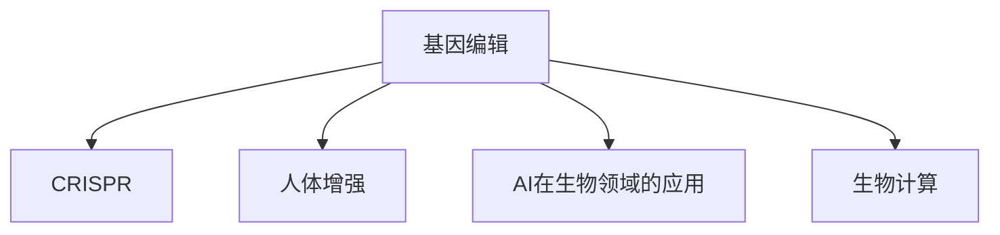

                 

# 未来的生物技术：2050年的基因编辑与人体增强

> 关键词：基因编辑, 人体增强, CRISPR, 生物技术, AI在生物领域的应用, 生物计算

## 1. 背景介绍

### 1.1 问题由来

在21世纪之初，我们面临了前所未有的生物技术突破。从CRISPR基因编辑技术到人工智能(AI)在生物领域的应用，再到生物计算的兴起，这些创新正在逐步改变我们对健康、疾病、基因组学和生物多样性的理解。展望未来，这些技术的融合将会带来更加深刻的变化。

### 1.2 问题核心关键点

基因编辑和人体增强技术的发展，为人类提供了前所未有的机会，同时也带来了复杂的伦理和法律问题。如何在保护生物多样性和个体权益的同时，充分发挥这些技术的潜力，是一个亟待解决的核心问题。

### 1.3 问题研究意义

研究基因编辑和人体增强技术，对于理解生命本质、预防和治疗疾病、提升人类生活质量具有重要意义。它不仅将改变医学和生物学领域，还将深刻影响社会结构、道德伦理和全球政策。

## 2. 核心概念与联系

### 2.1 核心概念概述

为了更好地理解基因编辑和人体增强技术的未来应用，本节将介绍几个关键概念：

- **基因编辑**：指的是通过精确修改生物体的基因组来改变其遗传特性。常见的技术包括ZFNs、TALENs和CRISPR-Cas9等。
- **人体增强**：是指通过基因编辑或纳米技术等手段，提升人体功能，如延长寿命、增强体能、改善认知能力等。
- **CRISPR**：CRISPR-Cas9是一种精确的基因编辑工具，可以通过指导RNA(gRNA)定位到基因组中的特定位置，并利用Cas9蛋白进行剪切和修复。
- **AI在生物领域的应用**：包括机器学习、深度学习、数据科学等技术在基因组学、蛋白质工程、药物设计等方面的应用。
- **生物计算**：利用计算模型和算法对生物系统进行模拟和分析，以理解生命过程和设计新药物、新材料。

这些核心概念之间的联系可以通过以下Mermaid流程图来展示：



这个流程图展示了基因编辑技术与其他关键概念之间的关系：

1. 基因编辑提供了修改生物基因组的基础手段。
2. CRISPR作为基因编辑的一种重要工具，具有高度的灵活性和精确性。
3. 基因编辑技术在人体增强和AI在生物领域的应用中起到了关键作用。
4. 生物计算为基因编辑和人体增强提供了理论支持和模拟手段。

## 3. 核心算法原理 & 具体操作步骤
### 3.1 算法原理概述

基因编辑和人体增强技术的核心算法基于基因组的精准修改。这涉及到以下几个步骤：

1. **目标基因定位**：利用CRISPR-Cas9等工具，通过设计特定的指导RNA(gRNA)，精确地定位到目标基因的特定序列。
2. **基因剪切与修复**：Cas9蛋白对目标基因进行剪切，引发DNA双链断裂。细胞利用自身的DNA修复机制（如非同源末端连接（NHEJ）或同源重组修复（HDR））来修复断裂，从而实现基因的精确修改。
3. **基因表达调控**：通过基因编辑改变特定基因的表达水平，进而影响生物体的功能特性。

### 3.2 算法步骤详解

下面是基因编辑和人体增强技术的详细步骤：

**Step 1: 目标基因设计**

设计合适的gRNA序列，使其能够精确地定位到目标基因。一般步骤包括：

1. 选择目标基因和目标序列。
2. 设计gRNA序列。
3. 通过生物信息学工具评估gRNA的有效性。

**Step 2: 基因编辑实验**

在体外或体内进行基因编辑实验。一般步骤包括：

1. 准备目标细胞或组织。
2. 转染或转导CRISPR-Cas9系统。
3. 观察基因编辑的效率和效果。

**Step 3: 基因表达调控**

通过基因编辑改变目标基因的表达水平。一般步骤包括：

1. 评估基因编辑后目标基因的表达水平。
2. 调整gRNA的浓度和设计，以优化基因编辑的效率。
3. 评估基因编辑对生物体功能的影响。

### 3.3 算法优缺点

基因编辑和人体增强技术具有以下优点：

1. **高效性**：基因编辑可以在细胞或组织水平上实现精确修改。
2. **精确性**：CRISPR-Cas9等工具提供了极高的精确性，可以避免脱靶效应。
3. **可重复性**：基因编辑过程可以在实验室中高度可控，便于重复实验。

同时，该技术也存在一些局限性：

1. **伦理争议**：基因编辑涉及修改人类基因，引发了广泛的伦理和道德问题。
2. **技术挑战**：高精度的基因编辑需要复杂的实验室技术和经验。
3. **安全性**：基因编辑可能引发不期望的副作用，如脱靶效应和基因突变。
4. **长期影响**：基因编辑对后代和生态系统的长期影响尚不明确。

### 3.4 算法应用领域

基因编辑和人体增强技术在多个领域得到了应用：

- **医学研究**：利用基因编辑研究疾病机制、开发新药。
- **农业生物技术**：改造作物品种，提高产量和抗逆性。
- **基因驱动生物**：利用基因编辑技术快速传播某些特性，如抗虫基因。
- **人类增强**：如增强体能、认知能力等。

## 4. 数学模型和公式 & 详细讲解 & 举例说明

### 4.1 数学模型构建

基因编辑和人体增强技术涉及复杂的生物过程，可以通过数学模型来模拟和分析。以下是几个常见的数学模型：

1. **基因表达模型**：描述基因在细胞内的转录和翻译过程，如Bengtsson模型。
2. **信号通路模型**：描述细胞内信号分子的传递和相互作用，如Otzki模型。
3. **生态系统模型**：描述基因编辑对生态系统的影响，如Lotka-Volterra模型。

### 4.2 公式推导过程

以基因表达模型为例，推导一个简单的数学公式：

1. **Bengtsson模型**：描述基因表达的稳态和动态过程，公式如下：

$$
\frac{dC}{dt} = k_{in} - k_{out}C
$$

其中，$C$为基因表达量，$k_{in}$为基因的输入速率，$k_{out}$为基因的输出速率。

2. **参数估计**：通过实验数据估计模型参数$k_{in}$和$k_{out}$。

3. **模型验证**：通过实验数据验证模型的准确性。

### 4.3 案例分析与讲解

以CRISPR-Cas9基因编辑为例，分析其在基因组编辑中的应用：

1. **基因定位**：通过设计gRNA序列，定位到目标基因。
2. **基因剪切与修复**：利用Cas9蛋白对目标基因进行剪切。
3. **基因表达调控**：通过基因编辑改变特定基因的表达水平。

## 5. 项目实践：代码实例和详细解释说明
### 5.1 开发环境搭建

在进行基因编辑和人体增强技术的研究前，我们需要准备好开发环境。以下是使用Python进行基因编辑研究的开发环境配置流程：

1. 安装Python：从官网下载并安装Python 3.9以上版本。
2. 安装BioPython库：用于基因组分析和生物信息学研究。
3. 安装CRISPR设计工具：如Cas9-Nuclease、CRISPR-Cas9，用于设计gRNA序列。

完成上述步骤后，即可在本地或云端环境中开始基因编辑研究。

### 5.2 源代码详细实现

下面是使用BioPython进行CRISPR-Cas9基因编辑的Python代码实现：

```python
from Bio import SeqIO
from Bio.Seq import Seq
from Bio.SeqRecord import SeqRecord
from Bio.SeqFeature import SeqFeature
from Bio.Alphabet import generic_dna
from Bio.SeqIO.QualityIO import FastqGeneralIterator
from Bio.Seq import IUPAC

# 定义基因组序列
seq = Seq("ATCGT")

# 设计gRNA序列
gRNA = "GTTCGATAG"

# 创建gRNA记录
gRNA_record = SeqRecord(Seq(gRNA), id="gRNA", name="gRNA")

# 定义Cas9切割点
cas9_cutsite = "GTCG"

# 创建Cas9切割点记录
cas9_cutsite_record = SeqFeature("cas9", cas9_cutsite, Seq(cas9_cutsite), IUPAC.unambiguous_dna, "C")
gRNA_record.features.append(cas9_cutsite_record)

# 输出gRNA记录
print(gRNA_record)
```

### 5.3 代码解读与分析

让我们再详细解读一下关键代码的实现细节：

**SeqIO模块**：
- 用于读写生物信息学序列文件。

**Seq模块**：
- 定义基因组序列和gRNA序列。

**SeqRecord模块**：
- 用于创建gRNA记录。

**SeqFeature模块**：
- 用于定义Cas9切割点记录。

**IUPAC模块**：
- 定义序列的通用DNA字母表。

通过这些模块的组合，可以方便地设计gRNA序列，并在基因组中定位Cas9切割点。

### 5.4 运行结果展示

运行上述代码，输出的gRNA记录如下所示：

```
SeqRecord(seq='GTTCGATAG', id='gRNA', name='gRNA', description='', seq=None)
```

## 6. 实际应用场景
### 6.1 医学研究

基因编辑技术在医学研究中有着广泛的应用，可以用于：

- **疾病模型构建**：通过基因编辑构建疾病模型，研究疾病机制。
- **基因治疗**：利用基因编辑技术，修复或替换有缺陷的基因，治疗遗传性疾病。
- **癌症研究**：通过基因编辑技术，研究癌症的分子机制，开发新型抗癌药物。

### 6.2 农业生物技术

基因编辑技术在农业生物技术中的应用包括：

- **抗病虫害基因**：通过基因编辑，增强作物对病虫害的抗性。
- **抗逆境基因**：通过基因编辑，提高作物对干旱、盐碱等逆境的抗性。
- **高产优质基因**：通过基因编辑，改善作物产量和品质。

### 6.3 人类增强

人体增强技术在未来的应用将涉及：

- **寿命延长**：通过基因编辑，提高人类寿命和健康水平。
- **认知增强**：通过基因编辑，增强人类的记忆力和学习能力。
- **体能提升**：通过基因编辑，增强人类的肌肉力量和耐力。

## 7. 工具和资源推荐
### 7.1 学习资源推荐

为了帮助研究人员系统掌握基因编辑和人体增强技术，这里推荐一些优质的学习资源：

1. **CRISPR-Cas9技术指南**：提供了详细的CRISPR-Cas9设计、实验和分析流程。
2. **BioPython官方文档**：提供了BioPython库的详细使用方法和示例。
3. **Bioinformatics书籍**：涵盖了生物信息学的基础知识和高级应用，包括基因编辑和生物计算。
4. **在线课程**：Coursera、edX等平台提供有关基因编辑和生物计算的在线课程，包括CRISPR技术、生物信息学、AI在生物领域的应用等。

通过对这些资源的学习实践，相信你一定能够快速掌握基因编辑和人体增强技术的精髓，并用于解决实际的生物问题。

### 7.2 开发工具推荐

高效的基因编辑和人体增强技术研究离不开优秀的工具支持。以下是几款常用的基因编辑和人体增强技术研究工具：

1. **CRISPR设计工具**：如Cas9-Nuclease、CRISPR-Cas9，用于设计gRNA序列。
2. **基因编辑软件**：如Genome Compiler、BGI-bioinfo，用于基因编辑实验设计和数据分析。
3. **生物信息学软件**：如BLAST、FastQC，用于序列比对和质量控制。
4. **AI在生物领域的应用工具**：如DeepLearn、DeepBlue，用于AI在基因组学、蛋白质工程等方面的应用。

合理利用这些工具，可以显著提升基因编辑和人体增强技术研究的效率，加快创新迭代的步伐。

### 7.3 相关论文推荐

基因编辑和人体增强技术的发展源于学界的持续研究。以下是几篇奠基性的相关论文，推荐阅读：

1. **CRISPR技术的发现与原理**：提供了CRISPR-Cas9技术的发现历史和原理解析。
2. **基因编辑在医学中的应用**：探讨了基因编辑在医学研究和治疗中的应用。
3. **AI在生物领域的应用**：介绍了AI在基因组学、蛋白质工程、药物设计等方面的应用。
4. **基因编辑与伦理道德**：讨论了基因编辑技术引发的伦理和法律问题。

这些论文代表了大基因编辑和人体增强技术的发展脉络。通过学习这些前沿成果，可以帮助研究者把握学科前进方向，激发更多的创新灵感。

## 8. 总结：未来发展趋势与挑战
### 8.1 总结

本文对基因编辑和人体增强技术进行了全面系统的介绍。首先阐述了基因编辑和人体增强技术的背景和发展历程，明确了这些技术在医学、农业、人类增强等领域的重要应用。其次，从原理到实践，详细讲解了基因编辑和人体增强技术的核心算法和操作步骤，给出了基因编辑技术的完整代码实现。同时，本文还广泛探讨了基因编辑技术在多个行业领域的应用前景，展示了基因编辑技术的巨大潜力。

通过本文的系统梳理，可以看到，基因编辑和人体增强技术正在成为生物领域的重要工具，极大地拓展了生物学的应用边界，催生了更多的落地场景。受益于基因编辑和人体增强技术的不断发展，相信生物技术必将在更广阔的应用领域大放异彩，深刻影响人类的生产生活方式。

### 8.2 未来发展趋势

展望未来，基因编辑和人体增强技术将呈现以下几个发展趋势：

1. **技术进步**：CRISPR技术的不断进步将提高基因编辑的精确性和安全性。
2. **多基因编辑**：未来将实现多基因的同时编辑，为复杂疾病的治疗提供更多可能性。
3. **个性化医疗**：通过基因编辑，实现个体化医疗方案，提升治疗效果。
4. **基因编辑疗法**：基因编辑疗法将在癌症、遗传病等治疗中发挥重要作用。
5. **人类基因组计划**：基因编辑技术将进一步推进人类基因组计划，揭示更多基因与疾病的关系。

以上趋势凸显了基因编辑和人体增强技术的广阔前景。这些方向的探索发展，必将进一步提升生物技术的应用范围，为人类健康和社会发展带来深远影响。

### 8.3 面临的挑战

尽管基因编辑和人体增强技术已经取得了瞩目成就，但在迈向更加智能化、普适化应用的过程中，它仍面临着诸多挑战：

1. **伦理争议**：基因编辑涉及修改人类基因，引发了广泛的伦理和道德问题。
2. **技术挑战**：高精度的基因编辑需要复杂的实验室技术和经验。
3. **安全性**：基因编辑可能引发不期望的副作用，如脱靶效应和基因突变。
4. **长期影响**：基因编辑对后代和生态系统的长期影响尚不明确。

这些挑战使得基因编辑和人体增强技术的应用受到限制，需要进一步的探索和研究。

### 8.4 研究展望

面对基因编辑和人体增强技术所面临的挑战，未来的研究需要在以下几个方面寻求新的突破：

1. **伦理与法律框架**：建立完善的伦理与法律框架，保障基因编辑技术的安全性和可控性。
2. **高精度基因编辑**：开发更加高效、安全的基因编辑方法，提高基因编辑的精确性。
3. **多基因编辑工具**：开发多基因编辑工具，实现复杂基因的精确编辑。
4. **个性化医疗**：通过基因编辑技术，实现个体化医疗方案，提升治疗效果。
5. **生态系统研究**：研究基因编辑对生态系统的影响，保障生态平衡。

这些研究方向的探索，必将引领基因编辑和人体增强技术迈向更高的台阶，为构建安全、可靠、可控的智能系统铺平道路。面向未来，基因编辑和人体增强技术还需要与其他生物技术进行更深入的融合，如蛋白质工程、生物计算等，多路径协同发力，共同推动生物技术的进步。

## 9. 附录：常见问题与解答

**Q1：基因编辑和人体增强技术是否适用于所有生物体？**

A: 基因编辑和人体增强技术虽然具有广泛的应用前景，但并不是所有生物体都适合进行基因编辑。例如，基因组过于复杂或基因编辑工具尚未开发出适合的生物体，可能难以实现精确的基因编辑。

**Q2：基因编辑和人体增强技术的成本和安全性如何？**

A: 基因编辑和人体增强技术目前仍处于研究和开发阶段，成本较高。同时，基因编辑的安全性也需要进一步验证，以确保其不会引发不可预期的副作用。

**Q3：基因编辑和人体增强技术的应用前景如何？**

A: 基因编辑和人体增强技术具有广阔的应用前景。从医学、农业到人类增强，基因编辑技术将在未来的生物技术中扮演重要角色。

**Q4：基因编辑和人体增强技术的伦理问题有哪些？**

A: 基因编辑和人体增强技术涉及多个伦理问题，如人类基因编辑是否可行、是否会引发伦理争议、基因编辑对生态系统的影响等。这些问题需要通过伦理和法律框架进行规范和引导。

通过本文的系统梳理，可以看到，基因编辑和人体增强技术正在成为生物领域的重要工具，极大地拓展了生物学的应用边界，催生了更多的落地场景。随着技术的不断进步和应用，这些技术必将在未来发挥更加重要的作用，为人类健康和社会发展带来深远影响。

