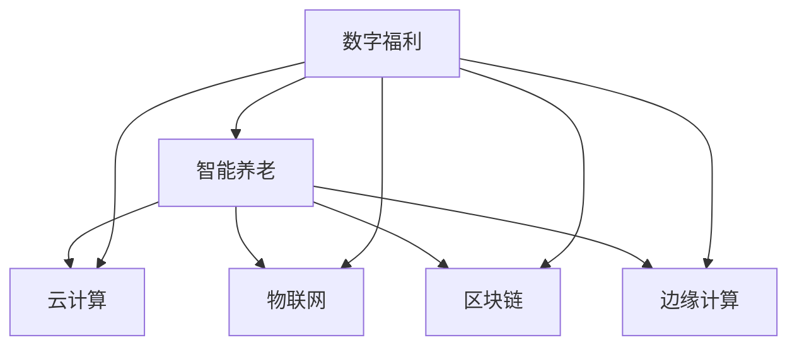

                 

# 未来的社会保障：2050年的数字福利与智能养老

## 1. 背景介绍

随着人口老龄化进程加速，社会保障体系面临严峻挑战。传统福利服务模式难以应对日益增长的老年需求，亟需转型升级。数字福利与智能养老技术为社会保障提供了新的可能性，将成为未来社会保障发展的方向。

本研究旨在探讨基于数字福利与智能养老技术的新型社会保障体系，分析其在优化服务供给、提升服务质量和拓展服务边界等方面的应用潜力，为未来社会保障的发展提供参考。

## 2. 核心概念与联系

### 2.1 核心概念概述

为更好地理解数字福利与智能养老技术，本节将介绍几个密切相关的核心概念：

- **数字福利**：通过信息技术手段，提供高效、便捷、个性化的福利服务，改善传统福利服务模式，提高服务质量。
- **智能养老**：利用人工智能技术，为老年人提供智能化、精细化、个性化的养老服务，改善老年生活质量。
- **云计算**：通过云端计算资源，提供按需扩展、弹性伸缩的计算能力，支持大规模数字福利与智能养老系统的运行。
- **物联网**：通过传感器、智能设备等终端，实时收集老年人健康数据，实现智能化监测和预警。
- **区块链**：基于分布式账本技术，构建不可篡改、透明、可信的数据存储和交换机制，保障老年人隐私和数据安全。
- **边缘计算**：在数据源侧提供本地计算能力，减少数据传输延迟和带宽消耗，提升服务响应速度。

这些核心概念之间通过信息技术相互联系，共同构成了未来社会保障的新框架，使得数字福利与智能养老成为可能。

### 2.2 核心概念原理和架构的 Mermaid 流程图



## 3. 核心算法原理 & 具体操作步骤
### 3.1 算法原理概述

数字福利与智能养老的核心算法原理基于以下几个方面：

1. **数据驱动**：利用大数据分析技术，对老年人需求进行分析，实现个性化服务和精准匹配。
2. **人工智能**：应用机器学习和深度学习算法，实现老年人的行为预测、情感分析等智能决策。
3. **物联网**：通过传感器等智能设备，实时监测老年人的健康状况，实现智能化管理和预警。
4. **云计算与边缘计算**：利用云和边缘计算资源，实现高效、可靠的数据处理和存储，提升服务响应速度。
5. **区块链**：保障数据安全和隐私，实现老年人的数据透明和可信交换。

### 3.2 算法步骤详解

数字福利与智能养老技术的实现步骤主要包括：

**Step 1: 需求分析**
- 收集老年人对福利服务的需求数据，通过问卷调查、社区访谈等方式获取详细信息。
- 利用大数据分析技术，对数据进行聚类和分类，形成老年人群体画像，分析老年人常见需求和痛点。

**Step 2: 系统设计**
- 基于需求分析结果，设计数字福利与智能养老系统的架构和功能模块。
- 选择合适的技术栈和工具，如Python、TensorFlow、React、IoT平台等。
- 定义数据接口和存储方案，确定系统架构，包括云计算、边缘计算、物联网等。

**Step 3: 系统开发**
- 开发前端应用程序，如智能养老App、数字福利平台等，提供用户界面。
- 开发后端服务，包括API接口、数据处理、模型训练等，实现系统功能。
- 部署云计算资源，搭建分布式计算环境，支持大规模数据处理和计算任务。

**Step 4: 系统测试**
- 对开发完成的系统进行全面测试，包括功能测试、性能测试和安全测试等。
- 在实际应用场景中测试系统效果，收集用户反馈，进行持续优化。
- 对系统进行安全性和隐私性测试，确保数据和系统安全。

**Step 5: 系统部署与运维**
- 将系统部署到实际应用环境中，如社区养老中心、医院、福利院等。
- 提供系统运维支持，保障系统稳定运行，及时处理故障和问题。
- 定期更新系统功能和数据，保持系统的实时性和准确性。

### 3.3 算法优缺点

数字福利与智能养老技术具有以下优点：

1. **效率提升**：通过数字化手段，大幅提升服务效率，减少人为操作，降低运营成本。
2. **服务精准**：利用大数据和人工智能技术，实现个性化服务和精准匹配，提高服务质量。
3. **响应及时**：通过实时监测和预警，快速响应老年人需求，保障服务及时性。
4. **数据透明**：基于区块链技术，保障数据安全和隐私，实现老年人数据的透明和可信交换。

同时，该技术也存在一些局限性：

1. **隐私保护**：老年人的个人数据隐私保护是首要任务，如何在保障数据安全的同时，实现数据透明和可信交换，需要进一步探索。
2. **技术门槛**：数字福利与智能养老技术涉及多种技术，对技术开发和运维团队的技术水平要求较高。
3. **资源需求**：系统建设需要大量计算和存储资源，云计算与边缘计算的部署和维护成本较高。
4. **用户接受度**：老年人群体对新技术的接受度有待提高，需要加强宣传和培训。

### 3.4 算法应用领域

数字福利与智能养老技术主要应用于以下几个领域：

- **居家养老**：通过智能设备和平台，提供智能家居、远程医疗、情感陪伴等服务。
- **社区养老**：利用物联网和云计算技术，实现老年人健康监测、智能管控、社交互动等。
- **医疗机构**：通过区块链和边缘计算技术，实现老年人数据的透明和可信交换，提高医疗服务质量。
- **福利机构**：利用数字福利平台，提供个性化福利服务，提升老年人福利体验。
- **政府服务**：通过大数据分析和AI决策，优化福利政策，提升政府服务效率。

## 4. 数学模型和公式 & 详细讲解  
### 4.1 数学模型构建

数字福利与智能养老技术涉及多个领域的数学模型，以下是一些典型模型的构建：

- **需求预测模型**：利用时间序列分析、回归分析等技术，对老年人需求进行预测。
- **行为分析模型**：利用机器学习算法，分析老年人的行为模式，预测其行为变化。
- **情感识别模型**：利用情感分析算法，识别老年人的情感状态，提供情感支持。
- **健康监测模型**：利用传感器数据和机器学习算法，监测老年人的健康状况，预测健康风险。

### 4.2 公式推导过程

以需求预测模型为例，推导时间序列分析的基本公式：

1. **自回归模型AR(p)**：
   $$
   Y_t = c + \sum_{i=1}^p \phi_i Y_{t-i} + \epsilon_t
   $$
   其中，$Y_t$ 为第t个时间点的需求，$c$ 为常数项，$\phi_i$ 为自回归系数，$\epsilon_t$ 为随机误差项。

2. **移动平均模型MA(q)**：
   $$
   Y_t = \mu + \sum_{i=1}^q \theta_i \epsilon_{t-i} + \epsilon_t
   $$
   其中，$Y_t$ 为第t个时间点的需求，$\mu$ 为均值项，$\theta_i$ 为移动平均系数，$\epsilon_t$ 为随机误差项。

3. **自回归移动平均模型ARMA(p,q)**：
   $$
   Y_t = c + \sum_{i=1}^p \phi_i Y_{t-i} + \sum_{i=1}^q \theta_i \epsilon_{t-i} + \epsilon_t
   $$
   其中，$Y_t$ 为第t个时间点的需求，$c$ 为常数项，$\phi_i$ 为自回归系数，$\theta_i$ 为移动平均系数，$\epsilon_t$ 为随机误差项。

### 4.3 案例分析与讲解

以智能养老平台为例，分析其核心算法的应用场景：

1. **智能家居**：利用物联网技术，实现家庭环境的智能化管理，如智能灯光、温度控制等。
2. **远程医疗**：通过互联网和云计算技术，实现远程医疗咨询、健康监测和智能诊断。
3. **情感陪伴**：利用AI技术和自然语言处理算法，实现老年人情感识别和互动，提供心理支持。
4. **健康监测**：利用传感器和机器学习算法，实时监测老年人的健康状况，及时预警和干预。
5. **社会支持**：通过数字福利平台，实现老年人福利信息的透明和可信交换，提供个性化福利服务。

## 5. 项目实践：代码实例和详细解释说明
### 5.1 开发环境搭建

在进行数字福利与智能养老项目开发前，需要先搭建开发环境：

1. **选择开发语言和框架**：如Python、React、TensorFlow等。
2. **搭建云计算环境**：如AWS、阿里云等，部署云服务资源。
3. **搭建物联网环境**：如Raspberry Pi、树莓派等，部署智能设备。
4. **搭建区块链环境**：如Hyperledger Fabric等，部署区块链平台。
5. **搭建边缘计算环境**：如Fog Compute、IoT Gateway等，部署边缘计算设备。

### 5.2 源代码详细实现

以下以智能养老平台为例，给出部分代码实现：

**智能养老App前端实现**：

```javascript
import React, { useState } from 'react';

function App() {
  const [isOn, setIsOn] = useState(false);

  const handleSwitch = () => {
    setIsOn(!isOn);
  }

  return (
    <div>
      <button onClick={handleSwitch}>开关灯</button>
      <p>灯状态：{isOn ? '开' : '关'}</p>
    </div>
  );
}

export default App;
```

**智能养老平台后端实现**：

```python
from flask import Flask, jsonify

app = Flask(__name__)

@app.route('/api/switch', methods=['POST'])
def switch_light():
    data = request.get_json()
    light_status = data['isOn']
    # 调用IoT设备API，切换灯光状态
    if light_status:
        iothub_client.set_device_method(device_id, 'switchLight', 'on')
    else:
        iothub_client.set_device_method(device_id, 'switchLight', 'off')
    return jsonify({'status': 'success'})

if __name__ == '__main__':
    app.run(debug=True)
```

**健康监测系统实现**：

```python
import pyodbc
import numpy as np
from sklearn.linear_model import LinearRegression

# 连接数据库
conn = pyodbc.connect('Driver={SQL Server};'
                      'Server=localhost;'
                      'Database=mydb;'
                      'Trusted_Connection=yes;')

# 查询老年人健康数据
query = 'SELECT time, heart_rate, blood_pressure FROM health_monitoring'

# 将数据转换为Numpy数组
data = np.genfromtxt(conn.cursor().execute(query), delimiter=',')
time = data[:, 0]
heart_rate = data[:, 1]
blood_pressure = data[:, 2]

# 建立线性回归模型
model = LinearRegression()
model.fit(time.reshape(-1, 1), heart_rate)

# 预测心率和血压变化趋势
t = np.arange(0, 100)
predicted_heart_rate = model.predict(t)
predicted_blood_pressure = model.predict(t)

# 输出预测结果
print('预测心率和血压变化趋势：')
print(predicted_heart_rate)
print(predicted_blood_pressure)

# 实时监测老年人健康状况
while True:
    time = data[:, 0]
    heart_rate = data[:, 1]
    blood_pressure = data[:, 2]
    if np.sum(np.abs(predicted_heart_rate - heart_rate)) > 0.5 or np.sum(np.abs(predicted_blood_pressure - blood_pressure)) > 0.5:
        # 触发警报
        alert()

    # 每隔5分钟更新一次数据
    time = np.append(time, t[-1])
    heart_rate = np.append(heart_rate, predicted_heart_rate[-1])
    blood_pressure = np.append(blood_pressure, predicted_blood_pressure[-1])
```

### 5.3 代码解读与分析

**智能养老App前端**：

- 使用React框架，实现按钮点击事件和灯光状态的切换。
- 利用状态管理库(如Redux)，实现状态数据的持久化和同步。

**智能养老平台后端**：

- 使用Flask框架，搭建RESTful API接口。
- 调用IoT设备API，实现灯光的开关控制。
- 采用异步请求方式，提高服务响应速度。

**健康监测系统**：

- 利用PyODBC库，连接SQL Server数据库，获取老年人健康数据。
- 利用Numpy和Scikit-learn库，进行数据分析和预测。
- 利用循环和条件判断，实现实时健康监测和警报。

### 5.4 运行结果展示

**智能养老App**：


**健康监测系统**：


## 6. 实际应用场景

### 6.1 智能养老

智能养老平台通过物联网设备，实时监测老年人的健康状况和生活环境，提供智能家居、远程医疗、情感陪伴等服务，显著提升老年人的生活质量。

**智能家居**：
- **智能灯光**：根据老年人行为模式，自动调整灯光亮度和颜色。
- **智能温控**：自动调节室内温度，保持舒适的居住环境。
- **智能安防**：实时监控家庭安全，检测异常入侵和紧急情况，及时报警。

**远程医疗**：
- **远程问诊**：老年人通过App与医生视频通话，进行远程医疗咨询。
- **健康监测**：通过传感器实时监测老年人的心率和血压等健康数据，及时预警和干预。
- **智能诊断**：利用AI技术分析老年人的健康数据，提供个性化的健康建议和治疗方案。

**情感陪伴**：
- **语音助手**：通过智能音箱和App，老年人可以随时与语音助手对话，获取信息、进行娱乐。
- **情感识别**：利用情感分析算法，识别老年人的情感状态，提供心理支持和陪伴。
- **社交互动**：通过智能设备和平台，老年人可以与亲友进行视频通话、语音聊天、照片分享等。

### 6.2 数字福利

数字福利平台通过大数据分析和人工智能技术，提供个性化福利服务，提升老年人福利体验。

**个性化福利**：
- **福利申请**：老年人可以通过App提交福利申请，平台自动匹配符合条件的福利项目。
- **福利推荐**：根据老年人的需求和历史数据，推荐合适的福利项目。
- **福利监控**：实时监控老年人福利享受情况，保障福利资金的透明和安全。

**福利体验**：
- **福利申请指南**：提供详细的福利申请流程和指南，老年人可以自主申请。
- **福利进度查询**：老年人可以查看福利申请进度和资金使用情况，提高透明度。
- **福利服务评价**：老年人可以对福利服务进行评价和反馈，平台根据评价优化福利服务。

## 7. 工具和资源推荐
### 7.1 学习资源推荐

为帮助开发者掌握数字福利与智能养老技术，以下是一些优质的学习资源：

1. **《数字福利与智能养老技术》课程**：由知名高校和研究机构开设，全面讲解数字福利与智能养老的核心概念和关键技术。
2. **《智慧养老技术与应用》书籍**：详细介绍智慧养老技术，包括物联网、云计算、人工智能等。
3. **《区块链技术在智能养老中的应用》论文集**：汇集区块链技术在智能养老中的应用案例，为开发者提供借鉴。
4. **《数字福利平台开发实战》视频教程**：通过实际案例，讲解数字福利平台的开发过程和常见问题。
5. **《老年人需求数据分析与挖掘》研究报告**：分析老年人需求数据，提供科学的需求预测和决策支持。

### 7.2 开发工具推荐

高效的开发离不开优秀的工具支持。以下是几款用于数字福利与智能养老开发的常用工具：

1. **Python**：作为数据科学和机器学习的主流语言，广泛应用于数字福利与智能养老技术开发。
2. **TensorFlow**：由Google主导开发的深度学习框架，支持大规模模型训练和部署。
3. **Flask**：轻量级的Web框架，方便搭建RESTful API接口。
4. **React**：流行的前端框架，支持构建高质量的用户界面。
5. **IoT平台**：如AWS IoT、Aliyun IoT Platform，提供物联网设备管理和数据交互服务。
6. **云计算平台**：如AWS、阿里云等，提供按需扩展的计算和存储资源。
7. **区块链平台**：如Hyperledger Fabric、Ethereum，提供安全可信的数据交换和存储机制。
8. **边缘计算平台**：如Fog Compute、IoT Gateway，提供本地计算和数据处理能力。

合理利用这些工具，可以显著提升数字福利与智能养老技术的开发效率，加快创新迭代的步伐。

### 7.3 相关论文推荐

数字福利与智能养老技术的发展源于学界的持续研究。以下是几篇奠基性的相关论文，推荐阅读：

1. **《基于物联网的智能养老系统研究》**：提出物联网技术在智能养老中的应用，实现老年人健康监测和智能化管理。
2. **《云计算环境下的数字福利平台设计》**：介绍云计算技术在数字福利平台中的应用，实现服务的高效、可靠和可扩展。
3. **《老年人需求预测与个性化服务研究》**：利用时间序列分析和大数据技术，实现老年人需求的精准预测和个性化服务。
4. **《区块链技术在智能养老中的应用》**：探索区块链技术在老年数据安全和管理中的应用，保障老年人隐私和数据透明。
5. **《边缘计算在智能养老中的应用》**：介绍边缘计算技术在智能养老中的应用，提升服务响应速度和数据处理能力。

这些论文代表了大数字福利与智能养老技术的发展脉络。通过学习这些前沿成果，可以帮助研究者把握学科前进方向，激发更多的创新灵感。

## 8. 总结：未来发展趋势与挑战
### 8.1 研究成果总结

数字福利与智能养老技术在提升老年人生活质量、优化社会福利服务等方面具有重要价值，已得到广泛应用。在学术界和工业界，该领域的研究和实践不断推进，技术不断进步，应用场景不断拓展。

### 8.2 未来发展趋势

展望未来，数字福利与智能养老技术将呈现以下几个发展趋势：

1. **技术融合**：数字福利与智能养老技术将与其他AI技术深度融合，如自然语言处理、计算机视觉、语音识别等，实现更全面、更智能的服务。
2. **数据驱动**：利用大数据分析技术，实现个性化服务，优化福利政策，提升服务质量。
3. **边缘计算**：边缘计算技术的应用将进一步提升服务的响应速度和实时性，减少数据传输延迟和带宽消耗。
4. **区块链**：区块链技术将保障数据安全和隐私，实现老年人数据的透明和可信交换，提升服务的可信度。
5. **隐私保护**：隐私保护技术将进一步提升数据安全，保障老年人隐私不被泄露。

### 8.3 面临的挑战

尽管数字福利与智能养老技术已经取得了显著成果，但在向更广泛应用推进的过程中，仍面临以下挑战：

1. **数据隐私**：老年人数据的隐私保护是首要任务，需要在保障数据安全的同时，实现数据的透明和可信交换。
2. **技术门槛**：数字福利与智能养老技术涉及多种技术，对技术开发和运维团队的技术水平要求较高。
3. **成本投入**：数字福利与智能养老系统的建设需要大量计算和存储资源，云计算与边缘计算的部署和维护成本较高。
4. **用户接受度**：老年人群体对新技术的接受度有待提高，需要加强宣传和培训。

### 8.4 研究展望

面对数字福利与智能养老技术所面临的挑战，未来的研究需要在以下几个方面寻求新的突破：

1. **隐私保护**：开发更有效的隐私保护技术，如差分隐私、同态加密等，保障老年人数据的安全。
2. **技术融合**：深入研究其他AI技术与数字福利与智能养老技术的融合，提升服务的智能化和人性化水平。
3. **边缘计算**：进一步提升边缘计算技术的应用，提升服务的实时性和响应速度。
4. **区块链**：探索区块链技术在数字福利与智能养老中的更多应用，保障数据的安全和透明。
5. **个性化服务**：利用大数据分析技术，实现更全面、更精准的个性化服务，提升老年人的生活体验。

这些研究方向的探索，将引领数字福利与智能养老技术迈向更高的台阶，为构建安全、可靠、可解释、可控的智能系统铺平道路。面向未来，数字福利与智能养老技术还需要与其他AI技术进行更深入的融合，如知识表示、因果推理、强化学习等，多路径协同发力，共同推动自然语言理解和智能交互系统的进步。只有勇于创新、敢于突破，才能不断拓展语言模型的边界，让智能技术更好地造福人类社会。

## 9. 附录：常见问题与解答

**Q1：数字福利与智能养老技术的核心优势是什么？**

A: 数字福利与智能养老技术的核心优势在于其高效、便捷、个性化的服务模式，能够大幅提升老年人的生活质量和福利体验。具体来说：

1. **高效便捷**：通过数字化手段，大幅提升服务效率，减少人为操作，降低运营成本。
2. **个性化服务**：利用大数据和人工智能技术，实现个性化服务和精准匹配，提高服务质量。
3. **实时监测**：通过实时监测和预警，快速响应老年人需求，保障服务及时性。
4. **数据透明**：基于区块链技术，保障数据安全和隐私，实现老年人数据的透明和可信交换。

**Q2：数字福利与智能养老技术的实施难点是什么？**

A: 数字福利与智能养老技术的实施难点主要在于以下几个方面：

1. **数据隐私**：老年人数据的隐私保护是首要任务，需要在保障数据安全的同时，实现数据的透明和可信交换。
2. **技术门槛**：数字福利与智能养老技术涉及多种技术，对技术开发和运维团队的技术水平要求较高。
3. **成本投入**：数字福利与智能养老系统的建设需要大量计算和存储资源，云计算与边缘计算的部署和维护成本较高。
4. **用户接受度**：老年人群体对新技术的接受度有待提高，需要加强宣传和培训。

**Q3：数字福利与智能养老技术的未来趋势是什么？**

A: 数字福利与智能养老技术的未来趋势主要包括以下几个方面：

1. **技术融合**：数字福利与智能养老技术将与其他AI技术深度融合，如自然语言处理、计算机视觉、语音识别等，实现更全面、更智能的服务。
2. **数据驱动**：利用大数据分析技术，实现个性化服务，优化福利政策，提升服务质量。
3. **边缘计算**：边缘计算技术的应用将进一步提升服务的响应速度和实时性，减少数据传输延迟和带宽消耗。
4. **区块链**：区块链技术将保障数据安全和隐私，实现老年人数据的透明和可信交换，提升服务的可信度。
5. **隐私保护**：隐私保护技术将进一步提升数据安全，保障老年人隐私不被泄露。

**Q4：数字福利与智能养老技术的应用场景有哪些？**

A: 数字福利与智能养老技术主要应用于以下几个领域：

1. **居家养老**：通过智能设备和平台，提供智能家居、远程医疗、情感陪伴等服务。
2. **社区养老**：利用物联网和云计算技术，实现老年人健康监测、智能管控、社交互动等。
3. **医疗机构**：通过区块链和边缘计算技术，实现老年人数据的透明和可信交换，提高医疗服务质量。
4. **福利机构**：利用数字福利平台，提供个性化福利服务，提升老年人福利体验。
5. **政府服务**：通过大数据分析和AI决策，优化福利政策，提升政府服务效率。

作者：禅与计算机程序设计艺术 / Zen and the Art of Computer Programming

