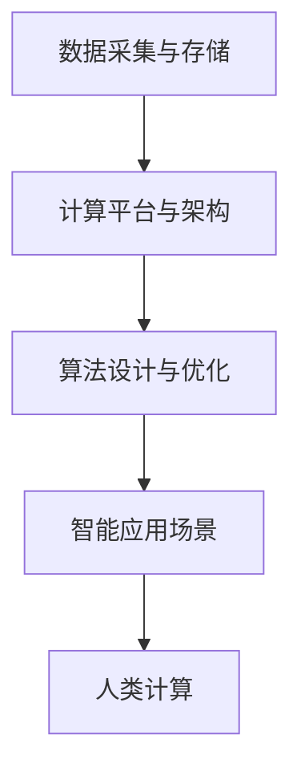

                 

## 1. 背景介绍

### 1.1 问题由来

在数字化的新时代，人类计算成为推动社会进步的关键力量。从早期的计算机算计到人工智能(AI)技术的发展，人类计算的应用场景日益丰富，涉及自动驾驶、智能医疗、智能制造、智慧城市等众多领域。这些技术的核心驱动就是人类计算，即通过强大的数据处理能力和智能化算法，实现自动化的信息处理和决策支持。

然而，随着数据量的爆炸性增长和计算能力的飞速提升，人类计算面临的挑战也日益严峻。从算法的优化设计，到数据的存储和管理，再到应用系统的集成与部署，每一步都需精细化地考虑，以实现更高效、更智能的计算应用。

### 1.2 问题核心关键点

人类计算的关键在于高效的数据处理和智能的算法设计。当前，人类计算技术主要依赖于三个核心组成部分：

- **数据采集与存储**：数据的获取和存储是实现计算的基础，包括传感器数据、用户行为数据、企业业务数据等，数据的多样化和高质量对计算效果有重要影响。
- **算法设计与优化**：算法是实现计算目标的核心，包括深度学习、机器学习、自然语言处理、图像处理等，算法的创新和优化直接关系到计算效果。
- **计算平台与架构**：计算平台和架构是实现计算任务的载体，包括云计算、分布式计算、边缘计算等，平台的灵活性和可扩展性对计算性能有决定性作用。

这三个组成部分共同构成了人类计算的完整生态，形成了智能化应用的支撑体系。

### 1.3 问题研究意义

研究人类计算的应用场景和技术架构，对于推动社会信息化、智能化的进步具有重要意义：

- **提升生产力**：通过自动化和智能化的信息处理，可以大幅提升各行各业的生产效率，降低人力成本。
- **改善用户体验**：智能化计算系统能够提供个性化的服务，改善用户的互动体验，提升生活品质。
- **促进创新发展**：算法和计算平台的不断进步，可以激发更多的创新应用场景，推动技术的持续发展。
- **构建智慧社会**：将智能化技术应用到城市治理、环境保护、公共安全等场景，可以构建更安全、高效、可持续的社会生态。
- **保障数据安全**：在计算应用中引入数据加密、隐私保护等安全机制，确保数据安全，防止信息滥用。

## 2. 核心概念与联系

### 2.1 核心概念概述

为了更好地理解人类计算的应用场景和技术架构，本节将介绍几个密切相关的核心概念：

- **人类计算(Human Computing)**：指通过计算机技术，提升人类处理信息的能力和效率，实现自动化的决策和任务执行。
- **计算平台与架构(Computational Platform and Architecture)**：指支持计算任务的基础设施，包括云计算、分布式计算、边缘计算等，为数据处理和算法实现提供硬件支撑。
- **数据驱动(DataSource-Driven)**：指计算应用以数据为核心驱动，通过数据获取、存储和分析，实现计算目标。
- **算法设计与优化(Algorithm Design and Optimization)**：指根据计算目标，设计相应的算法模型，并通过优化算法提升计算性能。
- **智能应用场景(Intelligent Application Scenarios)**：指在特定应用场景下，通过人类计算技术实现自动化的信息处理和决策支持，如智能医疗、智能制造、智慧城市等。

这些核心概念之间的逻辑关系可以通过以下Mermaid流程图来展示：



这个流程图展示了大规模数据采集、存储、计算平台、算法设计、智能应用场景之间的逻辑关系：

1. 数据采集与存储：数据来源多样，需要有效的收集和管理机制。
2. 计算平台与架构：提供高效、灵活的计算能力，支持算法实现。
3. 算法设计与优化：通过算法模型解决具体的计算问题。
4. 智能应用场景：将算法应用到实际业务中，实现智能化应用。
5. 人类计算：最终提升人类的信息处理能力，实现自动化决策。

这些核心概念共同构成了人类计算的完整生态，为智能化应用的实现提供了坚实基础。

## 3. 核心算法原理 & 具体操作步骤

### 3.1 算法原理概述

人类计算的核心在于通过算法设计和优化，实现自动化的信息处理和决策支持。目前，人类计算的主要算法范式包括：

- **深度学习(Deep Learning)**：利用多层神经网络实现数据的特征提取和分类，常用于图像识别、语音识别等任务。
- **机器学习(Machine Learning)**：通过训练模型，自动学习数据特征，常用于推荐系统、自然语言处理等任务。
- **自然语言处理(Natural Language Processing, NLP)**：处理和理解人类语言，实现信息抽取、文本分类、情感分析等任务。
- **计算机视觉(Computer Vision)**：处理和理解视觉数据，实现目标检测、图像识别、人脸识别等任务。
- **强化学习(Reinforcement Learning)**：通过与环境的交互，训练智能体进行决策，常用于自动驾驶、游戏智能等任务。
- **知识图谱(Knowledge Graph)**：构建语义化的知识网络，辅助决策和推理，常用于医疗诊断、知识管理等任务。

这些算法技术相互融合，构建起人类计算的核心算法框架，为智能化应用提供了坚实支撑。

### 3.2 算法步骤详解

人类计算的应用场景开发通常包括以下关键步骤：

**Step 1: 数据收集与处理**

- **数据收集**：确定数据来源，包括传感器数据、用户行为数据、企业业务数据等。
- **数据预处理**：清洗和处理数据，如去噪、归一化、特征提取等，保证数据的质量和可用性。

**Step 2: 算法设计与优化**

- **算法选择**：根据计算目标，选择合适的算法模型，如深度学习、机器学习等。
- **模型训练**：使用标注数据训练模型，调整超参数和模型结构，优化模型性能。
- **模型评估**：通过验证集评估模型效果，选择最优模型。

**Step 3: 计算平台与架构部署**

- **计算平台选择**：选择适合的应用场景的计算平台，如云计算、分布式计算、边缘计算等。
- **架构设计**：设计系统的整体架构，包括数据流、任务调度、资源管理等，确保系统的高效性和可扩展性。
- **系统集成**：将训练好的模型部署到计算平台，实现自动化处理。

**Step 4: 应用测试与部署**

- **测试**：在测试环境中模拟实际应用场景，测试系统性能和稳定性。
- **部署**：将系统部署到生产环境中，监控系统运行状态，确保系统的稳定性和可靠性。

**Step 5: 持续优化**

- **反馈与优化**：根据实际应用中的反馈，优化模型和算法，提升系统性能。
- **迭代更新**：定期更新数据和算法，保持系统的先进性和实用性。

通过以上步骤，可以实现高效、智能的人类计算应用，提升系统的性能和应用范围。

### 3.3 算法优缺点

人类计算的核心算法具有以下优点：

- **高效性**：通过自动化处理，可以大幅提升数据处理效率，节省人力成本。
- **智能性**：通过算法设计和优化，可以实现智能化决策和应用，提升用户体验。
- **灵活性**：算法和平台具有高度的灵活性，能够适应不同的应用场景和需求。
- **可扩展性**：系统的架构设计考虑了可扩展性，可以方便地添加新的计算任务和功能。

同时，这些算法也存在一定的局限性：

- **数据依赖**：算法的效果高度依赖于数据质量，数据不足或质量不高将影响算法效果。
- **计算资源消耗**：算法实现需要高性能的计算资源，对硬件设备要求较高。
- **算法复杂度**：一些算法模型如深度学习，训练复杂度高，需要大量的计算资源和时间。
- **结果可解释性**：算法模型通常被视为"黑盒"系统，其内部工作机制难以解释，影响用户信任。
- **数据隐私和安全**：数据采集和处理过程中，需要考虑隐私保护和数据安全，防止信息泄露和滥用。

尽管存在这些局限性，但人类计算的核心算法在多领域应用中仍展现出强大的生命力，为各行各业带来了显著的效益。

### 3.4 算法应用领域

人类计算的核心算法已在多个领域得到了广泛应用，以下是一些典型场景：

- **自动驾驶**：利用计算机视觉和深度学习技术，实现车辆路径规划、障碍物检测、行人识别等功能。
- **智能医疗**：通过自然语言处理和机器学习技术，实现医疗记录自动化、疾病预测、智能诊断等功能。
- **智能制造**：使用计算机视觉和机器学习技术，实现质量检测、设备维护、故障诊断等功能。
- **智慧城市**：利用传感器数据和机器学习技术，实现交通管理、环境监测、公共安全等功能。
- **金融科技**：通过自然语言处理和机器学习技术，实现舆情分析、风险评估、智能投顾等功能。
- **零售电商**：利用推荐系统和深度学习技术，实现个性化推荐、库存管理、营销分析等功能。
- **智能客服**：结合自然语言处理和机器学习技术，实现智能问答、情感分析、客户意图识别等功能。

## 4. 数学模型和公式 & 详细讲解 & 举例说明

### 4.1 数学模型构建

人类计算的数学模型构建通常涉及数据预处理、特征提取、算法训练等步骤。以深度学习模型为例，其数学模型构建流程如下：

**Step 1: 数据预处理**

- **归一化**：将数据归一化到[-1,1]或[0,1]区间，避免梯度消失或爆炸。
- **数据增强**：通过随机裁剪、旋转、缩放等方法，扩充数据集，提升模型泛化能力。

**Step 2: 特征提取**

- **卷积层**：通过卷积操作提取图像数据的空间特征。
- **池化层**：通过池化操作降低特征维度，减少计算复杂度。
- **全连接层**：将特征图转换为向量，进行分类或回归。

**Step 3: 算法训练**

- **损失函数**：定义损失函数，衡量模型预测与真实标签之间的差异。
- **优化器**：使用梯度下降等优化算法，更新模型参数，最小化损失函数。
- **超参数**：调整学习率、批量大小、迭代次数等超参数，优化模型性能。

### 4.2 公式推导过程

以深度学习中的卷积神经网络(CNN)为例，其基本公式如下：

$$
f(x) = g(\sum_{i=1}^{n} \sum_{j=1}^{m} w_{i,j} * f_{i-1,j-1}(x) + b
$$

其中，$f(x)$表示输入数据$x$的卷积结果，$g$为激活函数，$w_{i,j}$为卷积核权重，$b$为偏置项，$f_{i-1,j-1}(x)$为前一层卷积结果。

该公式描述了CNN的基本计算过程，通过卷积操作提取数据的空间特征，再通过激活函数引入非线性，最终得到卷积结果。

在实际应用中，卷积神经网络通常包含多个卷积层和池化层，以提取不同层次的特征，通过全连接层进行分类或回归。

### 4.3 案例分析与讲解

以图像识别为例，CNN模型可以用于提取图像的空间特征，如图像中的边缘、角点等。通过多次卷积和池化操作，模型可以逐渐抽象出高层次的特征，如物体的形状、颜色等。最后，通过全连接层进行分类，将输入图像与各个类别进行匹配，输出识别结果。

在实际应用中，CNN模型常用于图像分类、物体检测、人脸识别等任务。通过调整卷积核大小、数量等参数，可以适应不同的应用场景。同时，通过迁移学习、数据增强等方法，可以进一步提升模型性能。

## 5. 项目实践：代码实例和详细解释说明

### 5.1 开发环境搭建

在进行人类计算项目开发前，我们需要准备好开发环境。以下是使用Python进行TensorFlow开发的环境配置流程：

1. 安装Anaconda：从官网下载并安装Anaconda，用于创建独立的Python环境。

2. 创建并激活虚拟环境：
```bash
conda create -n tf-env python=3.8 
conda activate tf-env
```

3. 安装TensorFlow：根据CUDA版本，从官网获取对应的安装命令。例如：
```bash
conda install tensorflow-gpu==2.7.0 -c pytorch -c conda-forge
```

4. 安装TensorBoard：
```bash
pip install tensorboard
```

5. 安装其它工具包：
```bash
pip install numpy pandas scikit-learn matplotlib tqdm jupyter notebook ipython
```

完成上述步骤后，即可在`tf-env`环境中开始项目实践。

### 5.2 源代码详细实现

下面我们以图像识别任务为例，给出使用TensorFlow进行卷积神经网络训练的PyTorch代码实现。

首先，定义图像数据处理函数：

```python
import numpy as np
import tensorflow as tf
from tensorflow.keras.preprocessing.image import ImageDataGenerator

def preprocess_image(x):
    x = tf.image.resize(x, (224, 224))
    x = tf.keras.applications.mobilenet_v2.preprocess_input(x)
    return x
```

然后，定义模型：

```python
from tensorflow.keras.applications.mobilenet_v2 import MobileNetV2
from tensorflow.keras.layers import Dense, Flatten

model = MobileNetV2(weights='imagenet', include_top=False, input_shape=(224, 224, 3))

x = model.output
x = Flatten()(x)
x = Dense(1024, activation='relu')(x)
predictions = Dense(1000, activation='softmax')(x)
```

接着，定义损失函数和优化器：

```python
from tensorflow.keras.losses import categorical_crossentropy
from tensorflow.keras.optimizers import Adam

loss_fn = categorical_crossentropy
optimizer = Adam(learning_rate=0.001)
```

最后，定义训练和评估函数：

```python
def train_epoch(model, train_dataset, batch_size, optimizer):
    dataloader = tf.keras.utils.PourDownloader(train_dataset)
    model.trainable = True
    for batch in dataloader:
        with tf.GradientTape() as tape:
            x = tf.image.convert_image_dtype(batch[0], tf.float32)
            x = preprocess_image(x)
            logits = model(x)
            loss = loss_fn(targets=batch[1], predictions=logits)
        grads = tape.gradient(loss, model.trainable_weights)
        optimizer.apply_gradients(zip(grads, model.trainable_weights))
    return loss

def evaluate(model, test_dataset, batch_size):
    dataloader = tf.keras.utils.PourDownloader(test_dataset)
    model.eval()
    losses = []
    for batch in dataloader:
        with tf.GradientTape() as tape:
            x = tf.image.convert_image_dtype(batch[0], tf.float32)
            x = preprocess_image(x)
            logits = model(x)
            loss = loss_fn(targets=batch[1], predictions=logits)
        losses.append(loss.numpy())
    return np.mean(losses)
```

启动训练流程并在测试集上评估：

```python
epochs = 10
batch_size = 32

model.compile(optimizer=optimizer, loss=loss_fn, metrics=['accuracy'])

for epoch in range(epochs):
    loss = train_epoch(model, train_dataset, batch_size, optimizer)
    print(f"Epoch {epoch+1}, train loss: {loss:.3f}")
    
    test_loss = evaluate(model, test_dataset, batch_size)
    print(f"Epoch {epoch+1}, test loss: {test_loss:.3f}")
```

以上就是使用TensorFlow进行卷积神经网络训练的完整代码实现。可以看到，通过TensorFlow提供的高级API，我们可以快速搭建并训练深度学习模型。

### 5.3 代码解读与分析

让我们再详细解读一下关键代码的实现细节：

**preprocess_image函数**：
- **resize**方法：将输入图像的大小调整为224x224像素，这是MobileNetV2模型的输入尺寸。
- **preprocess_input**方法：对图像进行预处理，包括中心裁剪、标准化等操作，使得输入图像符合MobileNetV2模型的要求。

**模型定义**：
- **MobileNetV2模型**：使用预训练的MobileNetV2模型作为特征提取器，可以大幅提升模型的计算效率。
- **全连接层**：在顶层添加全连接层，进行分类任务，输出1000个类别的概率分布。

**损失函数和优化器**：
- **categorical_crossentropy**：定义交叉熵损失函数，适用于多分类任务。
- **Adam优化器**：选择Adam优化器，调整学习率，更新模型参数。

**训练和评估函数**：
- **train_epoch函数**：在训练集上进行迭代训练，计算损失并更新模型参数。
- **evaluate函数**：在测试集上进行评估，计算损失并返回平均损失。

**训练流程**：
- **epochs**：定义总的训练轮数。
- **batch_size**：定义批处理大小，决定每次迭代训练的样本数量。
- **model.compile**：编译模型，指定损失函数和优化器。
- **训练循环**：在每个epoch内，先训练，后评估，输出训练和测试损失。

可以看到，TensorFlow提供了丰富的工具和API，使得深度学习模型的实现和训练变得简单易行。开发者可以通过这些工具，快速构建和优化深度学习模型，实现高效的人类计算应用。

## 6. 实际应用场景

### 6.1 智能医疗

智能医疗是近年来迅速发展的应用场景，利用人类计算技术，可以实现智能诊断、疾病预测、个性化治疗等功能。

例如，通过自然语言处理技术，可以对病历记录进行自动化分析，提取病人的关键信息，如病史、症状、检查结果等。利用深度学习技术，可以对病人的病历数据进行分类和预测，辅助医生进行诊断和治疗。同时，通过计算机视觉技术，可以对医学影像进行分析和诊断，如X光片、CT扫描等，提高诊断准确性和效率。

### 6.2 智能制造

智能制造是工业4.0的重要组成部分，利用人类计算技术，可以实现生产过程的自动化和智能化。

例如，通过计算机视觉技术，可以对生产线上的设备进行实时监控，识别和定位异常情况，如设备故障、零件缺陷等，及时发出预警和维护指令，保障生产线的稳定运行。利用深度学习技术，可以对生产数据进行分析和预测，优化生产计划和工艺流程，提升生产效率和产品质量。同时，通过机器学习技术，可以对生产过程进行智能控制和优化，实现生产过程的自动化和智能化。

### 6.3 智慧城市

智慧城市是城市信息化的重要方向，利用人类计算技术，可以实现智能交通、环境监测、公共安全等功能。

例如，通过传感器数据和机器学习技术，可以实现交通流量分析和预测，优化交通信号控制，减少交通拥堵和事故。利用计算机视觉技术，可以对城市环境进行实时监测，如空气质量、噪音污染等，提升城市环境质量。同时，通过自然语言处理技术，可以实现智能客服和信息查询，提升城市服务水平。

## 7. 工具和资源推荐

### 7.1 学习资源推荐

为了帮助开发者系统掌握人类计算的理论基础和实践技巧，这里推荐一些优质的学习资源：

1. 《深度学习》系列书籍：斯坦福大学Andrew Ng教授的经典教材，详细介绍了深度学习的基本原理和实现方法。
2. 《Python深度学习》：由Francois Chollet所著，介绍了TensorFlow和Keras框架的使用方法，适合初学者入门。
3. CS224N《深度学习与自然语言处理》课程：斯坦福大学开设的NLP明星课程，涵盖深度学习、自然语言处理等前沿知识。
4. TensorFlow官方文档：TensorFlow的官方文档，提供了详细的API和教程，是快速入门和深入学习的首选资源。
5. PyTorch官方文档：PyTorch的官方文档，提供了丰富的教程和示例代码，适合深度学习研究的开发者。

通过对这些资源的学习实践，相信你一定能够快速掌握人类计算的理论基础和实践技巧，并用于解决实际的计算问题。

### 7.2 开发工具推荐

高效的开发离不开优秀的工具支持。以下是几款用于人类计算开发的常用工具：

1. TensorFlow：由Google主导开发的深度学习框架，生产部署方便，适合大规模工程应用。
2. PyTorch：Facebook开发的深度学习框架，灵活高效，适合研究性质的深度学习开发。
3. TensorBoard：TensorFlow配套的可视化工具，可实时监测模型训练状态，并提供丰富的图表呈现方式。
4. Weights & Biases：模型训练的实验跟踪工具，可以记录和可视化模型训练过程中的各项指标，方便对比和调优。
5. Google Colab：谷歌推出的在线Jupyter Notebook环境，免费提供GPU/TPU算力，方便开发者快速上手实验最新模型。

合理利用这些工具，可以显著提升人类计算开发的效率，加快创新迭代的步伐。

### 7.3 相关论文推荐

人类计算的核心技术不断发展，以下几篇奠基性的相关论文，推荐阅读：

1. ImageNet Classification with Deep Convolutional Neural Networks：提出深度卷积神经网络，在ImageNet数据集上刷新了计算机视觉任务的SOTA。
2. Rethinking the Inception Architecture for Computer Vision：提出Inception网络结构，大幅提升了深度学习模型的计算效率。
3. ResNet: Deep Residual Learning for Image Recognition：提出残差网络，解决了深度学习模型中的梯度消失问题。
4. Fast R-CNN: Towards Real-Time Object Detection with Region Proposal Networks：提出Fast R-CNN网络，实现了实时目标检测。
5. AlphaGo Zero: Mastering the Game of Go without Human Knowledge：提出AlphaGo Zero算法，实现了在无监督学习下围棋的突破。

这些论文代表了大规模数据采集、存储、计算平台、算法设计、智能应用场景等方面的进展，为人类计算技术的不断进步提供了理论基础。

## 8. 总结：未来发展趋势与挑战

### 8.1 总结

本文对人类计算的应用场景和技术架构进行了全面系统的介绍。首先阐述了人类计算的现状和意义，明确了数据采集与存储、算法设计与优化、计算平台与架构之间的逻辑关系。其次，从原理到实践，详细讲解了深度学习模型的构建流程和实现细节，给出了图像识别的代码实例。同时，本文还广泛探讨了人类计算在智能医疗、智能制造、智慧城市等多个行业领域的应用前景，展示了人类计算技术的广泛应用。

通过本文的系统梳理，可以看到，人类计算技术的核心算法和工具，已经在多个领域展现了强大的生命力，为社会的信息化和智能化进程带来了深远影响。未来，随着深度学习、自然语言处理、计算机视觉等技术的发展，人类计算的应用场景将更加广泛，技术能力将更加强大。

### 8.2 未来发展趋势

展望未来，人类计算技术将呈现以下几个发展趋势：

1. **模型复杂度提升**：深度学习模型的参数量将继续增加，计算复杂度也将进一步提高。超大型的预训练模型和超大规模的数据集，将带来更高的模型性能和更广泛的应用范围。
2. **算法多样性增强**：除了传统的深度学习算法，更多先进的算法将涌现，如强化学习、生成对抗网络等，提供更灵活、更高效的计算方案。
3. **跨领域融合**：人类计算技术将与物联网、区块链、边缘计算等技术进行深度融合，实现多领域、多模态的信息协同。
4. **智能化水平提升**：人类计算系统将进一步提高智能化水平，能够处理更加复杂的计算任务，如自然语言理解和生成、视觉识别和生成、语音识别和生成等。
5. **数据隐私保护**：随着数据隐私保护意识的增强，人类计算系统将更加注重数据隐私和安全，采用数据脱敏、加密等技术，确保数据安全。

这些趋势将进一步推动人类计算技术的发展，为各行各业带来更多的机遇和挑战。

### 8.3 面临的挑战

尽管人类计算技术已经取得了显著进展，但在迈向更加智能化、普适化应用的过程中，仍面临诸多挑战：

1. **数据质量与多样性**：高质量、多样化数据是计算应用的基石，但数据采集和处理过程中，容易出现数据缺失、噪音等问题。
2. **计算资源消耗**：深度学习等复杂算法需要高性能的计算资源，大规模数据集和模型训练需要大量的计算资源。
3. **模型可解释性**：深度学习模型通常被视为"黑盒"系统，难以解释其内部工作机制和决策逻辑，影响用户信任。
4. **系统稳定性**：复杂计算任务容易受到外界干扰，系统稳定性有待进一步提升。
5. **算法公平性**：深度学习模型可能存在偏见和歧视，需要在算法设计和训练过程中加以纠正。

面对这些挑战，人类计算技术的进一步发展需要从数据、算法、系统、应用等多个维度协同发力，以实现更加智能化、高效化、安全化的计算应用。

### 8.4 研究展望

未来，人类计算技术需要在以下几个方向进行研究：

1. **数据增强与预处理**：如何通过数据增强和预处理技术，提升数据质量，丰富数据多样性。
2. **算法优化与创新**：如何通过算法优化和创新，提升计算性能，降低计算复杂度。
3. **系统架构设计**：如何设计高效、灵活、可扩展的计算平台和架构，满足不同应用场景的需求。
4. **跨领域融合**：如何将人类计算技术与其他领域的技术进行深度融合，实现多领域、多模态的信息协同。
5. **智能化与自动化**：如何通过智能化和自动化技术，提升计算系统的自适应能力和自动化水平。

这些研究方向的探索，必将引领人类计算技术的进一步发展，为各行各业带来更多的创新应用和变革。

## 9. 附录：常见问题与解答

**Q1：如何确保数据的质量和多样性？**

A: 确保数据的质量和多样性是数据预处理的关键步骤。以下是一些常见的方法：
1. **数据清洗**：通过数据清洗工具，去除噪声、错误和重复数据，提高数据质量。
2. **数据增强**：通过随机裁剪、旋转、缩放等方法，扩充数据集，提升数据多样性。
3. **数据融合**：将不同来源的数据进行融合，形成更全面、更可靠的数据集。

**Q2：如何提升计算模型的可解释性？**

A: 提升计算模型的可解释性是当前深度学习研究的重要方向。以下是一些常见的方法：
1. **可视化技术**：使用可视化工具，展示模型的内部工作机制和决策逻辑，如t-SNE、LIME等。
2. **解释性模型**：使用解释性较强的模型，如决策树、线性回归等，替代复杂的深度学习模型。
3. **规则集成**：将规则化的知识与模型进行集成，增强模型的可解释性。

**Q3：如何提升计算系统的稳定性？**

A: 提升计算系统的稳定性需要从多个方面进行优化：
1. **模型鲁棒性**：通过数据增强、对抗训练等方法，提升模型的鲁棒性，防止过拟合和泛化能力不足。
2. **系统监控**：实时监控系统的运行状态，及时发现和处理异常情况。
3. **负载均衡**：采用负载均衡技术，合理分配计算资源，防止系统过载。

**Q4：如何处理跨领域融合带来的挑战？**

A: 跨领域融合带来诸多挑战，以下是一些常见的方法：
1. **多模态数据融合**：将不同模态的数据进行融合，形成统一的数据表示。
2. **领域适应**：通过迁移学习和数据增强技术，提高模型在不同领域的泛化能力。
3. **跨领域协同**：将不同领域的知识进行协同，提升系统整体的智能化水平。

**Q5：如何实现算法的公平性？**

A: 实现算法的公平性需要从多个方面进行优化：
1. **数据偏见校正**：在数据采集和处理过程中，注意消除数据中的偏见和歧视。
2. **算法设计公平**：在设计算法时，考虑公平性指标，如平等性、无歧视性等。
3. **模型评估公平**：在模型评估过程中，引入公平性指标，如性别、种族、年龄等。

通过这些方法，可以在确保数据质量和多样性的同时，提升计算模型的可解释性、系统稳定性、跨领域融合能力和算法公平性，实现高效、智能化的人类计算应用。

---

作者：禅与计算机程序设计艺术 / Zen and the Art of Computer Programming

