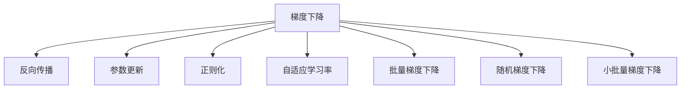

                 

# 梯度下降优化：从理论到实践

> 关键词：梯度下降,优化算法,反传播,反向传播,正则化,参数更新,深度学习,机器学习,神经网络

## 1. 背景介绍

### 1.1 问题由来
随着深度学习技术的广泛应用，优化算法在训练深度神经网络中起着至关重要的作用。梯度下降算法（Gradient Descent Algorithm）作为一种基本的优化算法，其核心思想是通过不断调整模型参数，使损失函数达到最小值。梯度下降算法的原理简单，实现容易，广泛应用于机器学习和深度学习中。

然而，传统的梯度下降算法在处理大规模数据和复杂模型时，容易陷入局部最优解，收敛速度慢。为了解决这些问题，学者们不断探索新的优化算法，如Adam、Adagrad、RMSprop等。这些算法在提升收敛速度和避免局部最优解方面取得了显著成效。

### 1.2 问题核心关键点
梯度下降算法的核心在于其通过反向传播（Backpropagation）计算损失函数对模型参数的梯度，并根据梯度信息更新参数。在实际应用中，为了提高算法的效率和稳定性，需要进行参数更新、正则化等操作。此外，梯度下降算法在不同场景下可能有不同的实现方式和变种算法，因此需要深入理解其原理和优化策略。

## 2. 核心概念与联系

### 2.1 核心概念概述

为更好地理解梯度下降算法的优化过程，本节将介绍几个密切相关的核心概念：

- 梯度下降算法（Gradient Descent Algorithm）：一种基本的优化算法，通过计算损失函数对模型参数的梯度，不断更新参数以最小化损失函数。
- 反向传播（Backpropagation）：一种计算复杂网络梯度的方法，将损失函数对模型参数的梯度从输出层向输入层逐层传播，计算每个参数的梯度值。
- 参数更新（Parameter Update）：根据计算出的梯度值更新模型参数，减小损失函数。
- 正则化（Regularization）：通过在损失函数中加入正则项，限制模型参数的大小，防止过拟合。
- 自适应学习率（Adaptive Learning Rate）：根据当前的梯度大小和参数更新情况动态调整学习率，提高算法收敛速度。
- 批量梯度下降（Batch Gradient Descent）：在每次迭代中使用全部样本计算梯度，更新参数。
- 随机梯度下降（Stochastic Gradient Descent, SGD）：在每次迭代中使用一个样本计算梯度，更新参数，提高计算效率。
- 小批量梯度下降（Mini-Batch Gradient Descent）：在每次迭代中使用部分样本计算梯度，更新参数，兼顾计算效率和更新精度。

这些核心概念之间的逻辑关系可以通过以下Mermaid流程图来展示：



这个流程图展示了一组基本概念之间的逻辑关系：

1. 梯度下降算法通过反向传播计算梯度，更新参数。
2. 正则化、自适应学习率等技术用来优化参数更新。
3. 批量梯度下降、随机梯度下降、小批量梯度下降等策略用来决定每次迭代使用多少样本。

## 3. 核心算法原理 & 具体操作步骤
### 3.1 算法原理概述

梯度下降算法的基本原理是通过不断调整模型参数，使得损失函数最小化。假设损失函数为 $L(\theta)$，其中 $\theta$ 为模型参数。梯度下降算法的目标是最小化损失函数 $L(\theta)$，其数学表达为：

$$
\theta^* = \mathop{\arg\min}_{\theta} L(\theta)
$$

在每次迭代中，梯度下降算法通过计算损失函数对参数 $\theta$ 的梯度，更新参数，使得损失函数逐渐减小。设当前参数为 $\theta_t$，梯度为 $g_t$，学习率为 $\alpha$，则参数的更新公式为：

$$
\theta_{t+1} = \theta_t - \alpha g_t
$$

其中，$g_t = \nabla_{\theta}L(\theta_t)$ 为损失函数对参数 $\theta$ 的梯度，$\alpha$ 为学习率。

### 3.2 算法步骤详解

梯度下降算法的具体步骤如下：

**Step 1: 初始化模型参数**
- 随机初始化模型参数 $\theta_0$，一般从较小的值开始。

**Step 2: 计算梯度**
- 使用反向传播算法计算损失函数对模型参数的梯度 $g_t$。

**Step 3: 参数更新**
- 根据当前参数 $\theta_t$ 和梯度 $g_t$，使用公式 $\theta_{t+1} = \theta_t - \alpha g_t$ 更新模型参数。

**Step 4: 迭代**
- 重复上述步骤，直到满足预设的收敛条件（如损失函数变化小于某个阈值）或者迭代次数达到预设的最大次数。

### 3.3 算法优缺点

梯度下降算法具有以下优点：
1. 实现简单：梯度下降算法的原理和实现都相对简单，容易理解和实现。
2. 灵活性高：梯度下降算法可以通过调整学习率、正则化等参数，适应不同的问题。
3. 普适性强：梯度下降算法适用于大多数优化问题，包括线性回归、逻辑回归、神经网络等。

同时，梯度下降算法也存在一定的局限性：
1. 易陷入局部最优解：梯度下降算法容易陷入局部最优解，特别是当梯度方向不明确时。
2. 收敛速度慢：对于大规模数据和复杂模型，梯度下降算法的收敛速度较慢。
3. 需要手动调参：学习率、批量大小等参数需要手动调整，设置不当可能导致算法失效。

尽管存在这些局限性，但梯度下降算法仍是优化问题中最基本、最常用的一种算法，其他优化算法如Adam、Adagrad等都是基于梯度下降算法的变种。

### 3.4 算法应用领域

梯度下降算法在机器学习和深度学习领域得到了广泛的应用，覆盖了几乎所有常见问题，例如：

- 线性回归：通过最小化损失函数，求解最优参数，使得预测值与真实值误差最小。
- 逻辑回归：通过最小化损失函数，求解最优参数，使得模型能够准确分类样本。
- 神经网络：通过反向传播计算梯度，更新模型参数，训练神经网络模型。
- 支持向量机：通过最小化损失函数，求解最优超平面，分割不同类别的样本。
- 深度强化学习：通过梯度下降算法，优化策略网络参数，使智能体能够获得最大奖励。

除了上述这些经典任务外，梯度下降算法也被创新性地应用到更多场景中，如可控生成、图像处理、自然语言处理等，为机器学习和深度学习技术带来了新的突破。

## 4. 数学模型和公式 & 详细讲解  
### 4.1 数学模型构建

本节将使用数学语言对梯度下降算法的优化过程进行更加严格的刻画。

设损失函数为 $L(\theta)$，其中 $\theta$ 为模型参数。梯度下降算法的目标是最小化损失函数 $L(\theta)$，其数学表达为：

$$
\theta^* = \mathop{\arg\min}_{\theta} L(\theta)
$$

在每次迭代中，梯度下降算法通过计算损失函数对参数 $\theta$ 的梯度，更新参数，使得损失函数逐渐减小。设当前参数为 $\theta_t$，梯度为 $g_t$，学习率为 $\alpha$，则参数的更新公式为：

$$
\theta_{t+1} = \theta_t - \alpha g_t
$$

其中，$g_t = \nabla_{\theta}L(\theta_t)$ 为损失函数对参数 $\theta$ 的梯度，$\alpha$ 为学习率。

### 4.2 公式推导过程

以下我们以线性回归为例，推导梯度下降算法的公式及其梯度的计算方法。

假设线性回归模型为 $y=\theta^Tx$，其中 $y$ 为真实值，$\theta$ 为模型参数。定义损失函数为均方误差损失（Mean Squared Error Loss）：

$$
L(\theta) = \frac{1}{2N}\sum_{i=1}^N (y_i - \theta^Tx_i)^2
$$

在每次迭代中，梯度下降算法通过计算损失函数对模型参数 $\theta$ 的梯度，更新参数。设当前参数为 $\theta_t$，梯度为 $g_t$，则有：

$$
g_t = \frac{\partial L(\theta)}{\partial \theta} = \frac{1}{N}\sum_{i=1}^N (y_i - \theta_t^Tx_i)x_i
$$

因此，参数的更新公式为：

$$
\theta_{t+1} = \theta_t - \alpha g_t = \theta_t - \alpha \frac{1}{N}\sum_{i=1}^N (y_i - \theta_t^Tx_i)x_i
$$

这就是线性回归问题中梯度下降算法的具体实现。通过不断迭代更新参数 $\theta$，使得模型预测值与真实值误差逐渐减小。

## 5. 项目实践：代码实例和详细解释说明
### 5.1 开发环境搭建

在进行梯度下降算法实践前，我们需要准备好开发环境。以下是使用Python进行SciPy和NumPy开发的Python3.6及以上版本的环境配置流程：

1. 安装Anaconda：从官网下载并安装Anaconda，用于创建独立的Python环境。

2. 创建并激活虚拟环境：
```bash
conda create -n gradient-env python=3.6 
conda activate gradient-env
```

3. 安装SciPy：
```bash
pip install scipy
```

4. 安装NumPy：
```bash
pip install numpy
```

5. 安装各类工具包：
```bash
pip install matplotlib pandas jupyter notebook
```

完成上述步骤后，即可在`gradient-env`环境中开始梯度下降算法的开发。

### 5.2 源代码详细实现

这里我们以线性回归为例，给出使用SciPy和NumPy实现梯度下降算法的完整代码实现。

```python
import numpy as np
from scipy.optimize import minimize

# 定义损失函数
def loss_function(theta, X, y):
    return 0.5 * np.sum((X.dot(theta) - y) ** 2) / len(y)

# 定义梯度函数
def gradient(theta, X, y):
    return (X.T.dot(X.dot(theta) - y)) / len(y)

# 初始化参数
theta_0 = np.random.randn(X.shape[1])

# 使用minimize函数进行优化
result = minimize(fun=loss_function, x0=theta_0, jac=gradient, args=(X, y), method='BFGS', options={'disp': True})

# 输出最终参数
print("Final Parameters:", result.x)
```

### 5.3 代码解读与分析

让我们再详细解读一下关键代码的实现细节：

**minimize函数**：
- `fun`参数：损失函数的函数表达式。
- `x0`参数：初始参数值。
- `jac`参数：梯度函数的函数表达式。
- `args`参数：传递给损失函数和梯度函数的额外参数。
- `method`参数：优化方法，这里使用BFGS算法。
- `options`参数：优化算法的参数设置，如是否显示进度信息。

**梯度函数**：
- 计算损失函数对模型参数 $\theta$ 的梯度，通过链式法则展开得到。

**初始化参数**：
- 使用随机数初始化模型参数 $\theta_0$，一般选择较小的随机数避免过拟合。

通过这段代码，可以看出梯度下降算法在实际应用中的基本实现流程。SciPy的优化函数`minimize`能够自动完成梯度计算和参数更新，极大简化了代码的实现。

当然，工业级的系统实现还需考虑更多因素，如模型保存和部署、超参数搜索、分布式计算等。但核心的梯度下降算法基本与此类似。

## 6. 实际应用场景
### 6.1 线性回归模型训练

在实际应用中，梯度下降算法被广泛应用于线性回归模型的训练。线性回归是一种基本的统计学习模型，通过最小化损失函数，求解最优参数，使得预测值与真实值误差最小。

假设有一个线性回归模型 $y = \theta^Tx$，其中 $y$ 为真实值，$\theta$ 为模型参数。通过梯度下降算法，不断更新模型参数 $\theta$，使得模型预测值与真实值误差逐渐减小。具体实现中，可以定义损失函数 $L(\theta) = \frac{1}{2N}\sum_{i=1}^N (y_i - \theta^Tx_i)^2$，然后使用梯度下降算法不断更新参数，直到收敛。

### 6.2 图像处理中的滤波算法

在图像处理中，梯度下降算法也被用来实现各种滤波算法。以均值滤波为例，假设有一个灰度图像 $I$，通过计算每个像素点的梯度，并将梯度信息用于计算滤波结果。具体实现中，可以定义梯度函数 $G(x) = \nabla I(x)$，然后使用梯度下降算法不断更新像素值，直到收敛。

### 6.3 自然语言处理中的语言模型训练

在自然语言处理中，梯度下降算法被用来训练语言模型。语言模型是一种描述文本序列概率的模型，通过最小化损失函数，求解最优参数，使得模型能够准确地预测下一个词。具体实现中，可以定义损失函数 $L(\theta) = -\frac{1}{N}\sum_{i=1}^N \log P(x_i|\theta)$，其中 $P(x_i|\theta)$ 为模型在参数 $\theta$ 下的概率分布，然后使用梯度下降算法不断更新参数，直到收敛。

### 6.4 未来应用展望

随着梯度下降算法的不断演进，其在更多领域得到应用，为机器学习和深度学习技术带来了新的突破。

在智慧医疗领域，梯度下降算法被用来训练疾病预测模型，帮助医生准确诊断病情。通过最小化损失函数，求解最优参数，使得模型能够准确预测疾病的发生概率，提高诊疗效率。

在智能教育领域，梯度下降算法被用来训练推荐系统，个性化推荐学生学习内容。通过最小化损失函数，求解最优参数，使得模型能够根据学生的学习历史和兴趣，推荐最合适的学习资源，提升学习效果。

在智慧城市治理中，梯度下降算法被用来训练智能交通系统，优化交通流量。通过最小化损失函数，求解最优参数，使得模型能够实时调整交通信号灯，提高交通效率。

此外，在企业生产、社会治理、文娱传媒等众多领域，梯度下降算法也将不断涌现，为机器学习和深度学习技术带来了新的应用场景。

## 7. 工具和资源推荐
### 7.1 学习资源推荐

为了帮助开发者系统掌握梯度下降算法的理论基础和实践技巧，这里推荐一些优质的学习资源：

1. 《深度学习》系列博文：由机器学习专家撰写，深入浅出地介绍了深度学习的基本原理和优化算法。

2. 《机器学习实战》书籍：一本经典的机器学习入门书籍，详细介绍了各种优化算法及其实现方法。

3. 《深度学习框架》书籍：全面介绍了深度学习框架如TensorFlow、PyTorch等，包括梯度下降算法及其变种。

4. Coursera《Machine Learning》课程：斯坦福大学开设的机器学习明星课程，涵盖优化算法的基本概念和实现方法。

5. DeepLearning.AI《深度学习专项课程》：由吴恩达等人讲授，系统介绍了深度学习的各种优化算法及其应用。

通过对这些资源的学习实践，相信你一定能够快速掌握梯度下降算法的精髓，并用于解决实际的机器学习和深度学习问题。

### 7.2 开发工具推荐

高效的开发离不开优秀的工具支持。以下是几款用于梯度下降算法开发的常用工具：

1. Scikit-learn：一个Python机器学习库，提供了各种优化算法和模型，包括梯度下降算法。

2. TensorFlow：由Google主导开发的开源深度学习框架，提供了各种优化器，支持梯度下降算法的实现。

3. PyTorch：一个开源的深度学习框架，提供了各种优化器，支持梯度下降算法的实现。

4. Weights & Biases：模型训练的实验跟踪工具，可以记录和可视化模型训练过程中的各项指标，方便对比和调优。

5. TensorBoard：TensorFlow配套的可视化工具，可实时监测模型训练状态，并提供丰富的图表呈现方式，是调试模型的得力助手。

合理利用这些工具，可以显著提升梯度下降算法的开发效率，加快创新迭代的步伐。

### 7.3 相关论文推荐

梯度下降算法在机器学习和深度学习领域的发展，离不开学界的持续研究。以下是几篇奠基性的相关论文，推荐阅读：

1. S. Boyd and L. Vandenberghe.《Convex Optimization》：介绍凸优化理论，是理解梯度下降算法的数学基础。

2. D. C. Park.《Optimization Methods Based on Descent Methods》：系统介绍了各种梯度下降算法及其变种，如批量梯度下降、随机梯度下降、小批量梯度下降等。

3. Y. Bengio, G. Hinton, and S. Kingsbury.《Stochastic Gradient Descent Learning for Deep Learning》：介绍梯度下降算法在深度学习中的应用，以及各种优化算法的实现方法。

4. T. Pock and L. Vandenberghe.《A Survey of Splitting Methods for Structured Composite Optimization Problems》：介绍各种迭代算法在优化问题中的应用，包括梯度下降算法及其变种。

这些论文代表了大语言模型微调技术的发展脉络。通过学习这些前沿成果，可以帮助研究者把握学科前进方向，激发更多的创新灵感。

## 8. 总结：未来发展趋势与挑战
### 8.1 总结

本文对梯度下降算法的优化过程进行了全面系统的介绍。首先阐述了梯度下降算法的背景和意义，明确了其作为机器学习和深度学习中最基本、最常用的优化算法之一，具有普适性和灵活性。其次，从原理到实践，详细讲解了梯度下降算法的数学模型和具体操作步骤，给出了梯度下降算法的完整代码实现。同时，本文还广泛探讨了梯度下降算法在多个领域的应用前景，展示了其在现实场景中的广泛应用。

通过本文的系统梳理，可以看到，梯度下降算法是机器学习和深度学习中不可或缺的一部分，其基本原理和实现方法在理论和实践上都具有重要意义。未来，随着优化算法的不断演进，梯度下降算法将在更广泛的应用场景中发挥重要作用，进一步推动机器学习和深度学习技术的发展。

### 8.2 未来发展趋势

展望未来，梯度下降算法将呈现以下几个发展趋势：

1. 自适应学习率：随着学习率的不断优化，自适应学习率算法如Adam、Adagrad、RMSprop等将得到更广泛的应用，提高算法的收敛速度和稳定性。

2. 批量大小优化：随着数据量的增加，批量大小（Batch Size）的优化问题将变得更为重要。合理的批量大小可以在保证计算效率的同时，提高优化效果。

3. 分布式训练：随着模型规模的不断增大，分布式训练将成为训练深度神经网络的重要手段。梯度下降算法需要与其他分布式优化算法结合，实现高效的并行计算。

4. 多目标优化：随着多目标优化问题的不断涌现，梯度下降算法需要与其他优化算法结合，解决复杂的优化问题。

5. 算法变种探索：未来将涌现更多梯度下降算法的变种和优化方法，如Nesterov加速梯度、二阶优化算法等，提高算法效率和稳定性。

6. 鲁棒性增强：随着模型的广泛应用，梯度下降算法的鲁棒性问题将变得更为重要。未来的研究将更加注重算法的鲁棒性，确保模型在各种环境下都能够稳定运行。

这些趋势凸显了梯度下降算法的广阔前景。这些方向的探索发展，必将进一步提升优化算法的性能和应用范围，为机器学习和深度学习技术的发展带来新的突破。

### 8.3 面临的挑战

尽管梯度下降算法在机器学习和深度学习中得到了广泛应用，但在实际应用中仍面临诸多挑战：

1. 收敛速度慢：对于大规模数据和复杂模型，梯度下降算法的收敛速度较慢，容易陷入局部最优解。

2. 过拟合问题：对于大规模数据和复杂模型，梯度下降算法容易过拟合，导致模型泛化性能下降。

3. 学习率设置困难：学习率的设定需要根据数据分布和模型复杂度进行调整，设置不当可能导致算法失效。

4. 计算资源需求高：梯度下降算法在大规模数据和复杂模型上计算资源需求较高，对硬件设备提出了较高要求。

5. 算法鲁棒性不足：梯度下降算法在面对数据噪声和模型参数不稳定时，鲁棒性较差，容易失效。

6. 无法处理非凸优化问题：梯度下降算法在面对非凸优化问题时，容易陷入局部最优解，无法找到全局最优解。

正视梯度下降算法面临的这些挑战，积极应对并寻求突破，将是梯度下降算法走向成熟的必由之路。相信随着学界和产业界的共同努力，这些挑战终将一一被克服，梯度下降算法必将在构建高效、稳定、可扩展的优化系统时发挥重要作用。

### 8.4 研究展望

面对梯度下降算法所面临的种种挑战，未来的研究需要在以下几个方面寻求新的突破：

1. 探索自适应学习率算法：通过引入自适应学习率算法，根据梯度大小和参数更新情况动态调整学习率，提高算法收敛速度和稳定性。

2. 优化批量大小：通过优化批量大小，找到最优的计算效率和优化效果，实现高效梯度计算。

3. 结合分布式计算：通过结合分布式计算，实现高效并行梯度计算，提高算法效率。

4. 引入多目标优化算法：通过引入多目标优化算法，解决复杂的多目标优化问题。

5. 增强鲁棒性：通过引入鲁棒性增强技术，提高算法在面对数据噪声和模型参数不稳定时的稳定性。

6. 处理非凸优化问题：通过引入非凸优化算法，解决梯度下降算法在面对非凸优化问题时的不足。

这些研究方向的探索，必将引领梯度下降算法技术迈向更高的台阶，为机器学习和深度学习技术的发展提供新的动力。

## 9. 附录：常见问题与解答

**Q1：梯度下降算法的收敛速度如何影响模型训练？**

A: 梯度下降算法的收敛速度对模型训练有着重要的影响。当收敛速度较慢时，模型训练需要消耗更多的时间，效率较低。当收敛速度较快时，模型训练可以在较短时间内得到较好的结果，提高训练效率。因此，选择合适的收敛速度和优化算法，对于模型训练的效率和效果都至关重要。

**Q2：梯度下降算法是否适用于所有优化问题？**

A: 梯度下降算法并不适用于所有优化问题，特别是对于非凸优化问题和目标函数不可导的问题。在面对这些优化问题时，需要结合其他优化算法，如共轭梯度算法、拉格朗日乘子法等。

**Q3：梯度下降算法如何避免陷入局部最优解？**

A: 避免陷入局部最优解的方法有很多，如随机梯度下降、小批量梯度下降、自适应学习率等。此外，还可以引入其他优化算法，如共轭梯度算法、牛顿法等，以提高算法的全局搜索能力。

**Q4：梯度下降算法的计算效率如何提升？**

A: 提升梯度下降算法的计算效率，需要考虑多个因素，如批量大小、学习率、正则化等。合理的批量大小可以在保证计算效率的同时，提高优化效果。自适应学习率算法如Adam、Adagrad等，也可以显著提高算法的计算效率和收敛速度。

**Q5：梯度下降算法在实际应用中存在哪些限制？**

A: 梯度下降算法在实际应用中存在一些限制，如对数据分布的敏感性、对模型参数的不稳定性、对计算资源的高需求等。因此，在实际应用中，需要结合其他优化算法和鲁棒性增强技术，才能确保算法在各种环境下都能够稳定运行。

通过这些问题的解答，可以看到梯度下降算法在实际应用中的基本原理和优化策略，理解其应用场景和局限性，有助于更好地掌握和应用梯度下降算法。

---

作者：禅与计算机程序设计艺术 / Zen and the Art of Computer Programming

