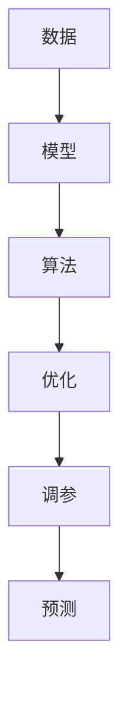

                 

# 模型思维:快速认知复杂世界的捷径

## 1. 背景介绍

### 1.1 问题由来

在当今信息爆炸的时代，人类面临的信息量前所未有地庞大。无论是经济、社会还是科技，都需要对复杂多变的数据进行分析，以便做出明智的决策。然而，人的认知能力有限，面对大量数据，往往感到难以招架，无法迅速找到问题的本质和解决方案。

模型思维作为一种高效的认知工具，通过将复杂问题抽象为数学模型，借助计算机算法求解，能够在短时间内获得清晰的洞察和解决问题的策略。随着机器学习和人工智能的普及，模型思维的应用领域越来越广，已经成为快速认知复杂世界的捷径。

### 1.2 问题核心关键点

模型思维的核心在于利用数学模型和计算机算法对现实世界进行建模和推理。它的主要特点包括：

- **抽象与简化**：将复杂问题抽象为数学模型，并简化为可计算的表达式。
- **算法求解**：利用计算机算法求解模型，获得具体的结果和推断。
- **优化与调参**：通过优化模型参数和算法，提高求解的准确性和效率。

在实际应用中，模型思维可以帮助人们快速理解复杂的系统、预测未来的趋势、优化决策方案等。因此，掌握模型思维成为现代科技工作者必备的能力。

## 2. 核心概念与联系

### 2.1 核心概念概述

为更好地理解模型思维的工作原理和应用，本节将介绍几个关键概念及其相互联系：

- **模型**：对现实世界现象的抽象和简化，用于表达和推导问题的数学表达式。
- **算法**：解决问题的具体计算步骤和规则，常与模型配套使用。
- **数据**：模型求解的输入，用于训练和验证模型的准确性。
- **优化**：通过调整模型参数和算法，提高求解的准确性和效率。
- **调参**：根据实际数据和目标，选择或优化模型参数，以获得最佳性能。
- **预测**：利用模型和算法对未知数据进行预测和推理。

这些概念通过计算机程序和数据流相互连接，构成了一个完整的模型思维框架。

### 2.2 核心概念原理和架构的 Mermaid 流程图



这个流程图展示了模型思维的核心架构：

1. 数据通过模型抽象为数学表达式。
2. 算法用于求解模型，得到具体的结果。
3. 优化和调参提高求解的准确性和效率。
4. 预测和推理对新数据进行应用。

这种架构使模型思维成为解决复杂问题的强大工具。

## 3. 核心算法原理 & 具体操作步骤

### 3.1 算法原理概述

模型思维的核心是利用数学模型和算法对数据进行建模和求解。其基本流程包括：

1. **建模**：将问题抽象为数学模型，确定输入、输出和目标函数。
2. **求解**：利用算法计算模型，获得最优解或近似解。
3. **验证**：通过实际数据验证模型的准确性和可靠性。
4. **优化**：调整模型参数和算法，提升求解效率和准确性。

模型思维的算法原理基于数学优化理论，如线性规划、非线性规划、凸优化、概率模型等。

### 3.2 算法步骤详解

以下是模型思维的一般操作流程：

**Step 1: 收集数据**
- 根据问题需求，收集相关的数据集，包含输入、输出、噪声等信息。
- 数据应尽可能多样化，以覆盖问题的不同方面。

**Step 2: 建立模型**
- 将问题抽象为数学模型，如线性回归、逻辑回归、支持向量机等。
- 确定模型的输入、输出和损失函数，如均方误差、交叉熵等。
- 选择合适的算法和优化器，如梯度下降、Adam、随机梯度下降等。

**Step 3: 训练模型**
- 使用部分数据集（训练集）训练模型，调整参数，最小化损失函数。
- 使用验证集评估模型性能，调整超参数，如学习率、批量大小等。

**Step 4: 预测验证**
- 使用未见过的数据集（测试集）验证模型的泛化能力。
- 计算模型的精度、召回率、F1值等指标，评估模型性能。

**Step 5: 优化和调参**
- 根据测试集结果，调整模型参数和算法，优化模型性能。
- 引入正则化、交叉验证等技术，防止过拟合。

### 3.3 算法优缺点

模型思维的主要优点包括：

- **高效**：能够快速处理和分析大量数据，提供高效的解决方案。
- **精确**：通过数学模型和算法，可以获得高精度的结果。
- **可解释**：数学模型和算法具有高度的可解释性，方便理解和学习。

但其缺点也不容忽视：

- **复杂性**：建立模型和求解过程复杂，需要较强的数学和编程能力。
- **数据需求**：模型训练需要大量高质量的数据，数据的获取和处理成本高。
- **不可预测性**：模型的结果依赖于数据和算法，对异常情况缺乏灵活性。

## 4. 数学模型和公式 & 详细讲解 & 举例说明

### 4.1 数学模型构建

在模型思维中，数学模型是解决问题的关键。以下是一个简单的线性回归模型的数学模型构建：

设输入数据为 $x_i = (x_{i1}, x_{i2}, ..., x_{in})$，目标数据为 $y_i$，线性回归模型的目标是最小化损失函数：

$$
J(\theta) = \frac{1}{2m} \sum_{i=1}^m (y_i - \theta^T x_i)^2
$$

其中 $\theta$ 为模型参数，$(x_i, y_i)$ 为训练集中的数据点。

### 4.2 公式推导过程

线性回归模型的求解步骤如下：

1. 计算损失函数的导数：

$$
\frac{\partial J(\theta)}{\partial \theta_j} = \frac{1}{m} \sum_{i=1}^m (y_i - \theta^T x_i)x_{ij}
$$

2. 令导数等于0，解方程组：

$$
\frac{1}{m} \sum_{i=1}^m (y_i - \theta^T x_i)x_{ij} = 0, j = 1, 2, ..., n
$$

3. 得到模型参数：

$$
\theta_j = \frac{\sum_{i=1}^m x_{ij}y_i}{\sum_{i=1}^m x_{ij}^2}, j = 1, 2, ..., n
$$

### 4.3 案例分析与讲解

考虑一个房价预测模型，输入数据为房屋面积 $x_i$，目标数据为房屋价格 $y_i$。根据线性回归模型，可以得到模型参数 $\theta_j$，进而预测新房的房价。

## 5. 项目实践：代码实例和详细解释说明

### 5.1 开发环境搭建

在进行模型思维实践前，我们需要准备好开发环境。以下是使用Python进行Scikit-learn开发的环境配置流程：

1. 安装Anaconda：从官网下载并安装Anaconda，用于创建独立的Python环境。

2. 创建并激活虚拟环境：
```bash
conda create -n scikit-learn-env python=3.8 
conda activate scikit-learn-env
```

3. 安装Scikit-learn：
```bash
pip install scikit-learn
```

4. 安装各类工具包：
```bash
pip install numpy pandas matplotlib seaborn jupyter notebook ipython
```

完成上述步骤后，即可在`scikit-learn-env`环境中开始模型思维实践。

### 5.2 源代码详细实现

下面我们以房价预测为例，给出使用Scikit-learn进行线性回归的PyTorch代码实现。

首先，定义数据处理函数：

```python
import numpy as np
import pandas as pd
from sklearn.model_selection import train_test_split
from sklearn.linear_model import LinearRegression
from sklearn.metrics import mean_squared_error

# 数据集处理函数
def load_data(file_path):
    data = pd.read_csv(file_path)
    X = data[['area']]
    y = data['price']
    return X, y

# 数据集划分函数
def train_test_split(X, y, test_size=0.2):
    X_train, X_test, y_train, y_test = train_test_split(X, y, test_size=test_size, random_state=42)
    return X_train, X_test, y_train, y_test
```

然后，定义模型和优化器：

```python
# 线性回归模型
def linear_regression(X, y):
    X_train, X_test, y_train, y_test = train_test_split(X, y, test_size=0.2)
    model = LinearRegression()
    model.fit(X_train, y_train)
    y_pred = model.predict(X_test)
    mse = mean_squared_error(y_test, y_pred)
    return model, mse
```

最后，启动训练流程并在测试集上评估：

```python
from sklearn.metrics import mean_squared_error

# 加载数据
X, y = load_data('data.csv')

# 训练模型
model, mse = linear_regression(X, y)
print(f"Mean Squared Error: {mse:.3f}")

# 使用模型预测新数据
new_X = np.array([[200]])
new_y = model.predict(new_X)
print(f"Predicted Price: {new_y[0]}")
```

以上就是使用Scikit-learn进行房价预测模型的完整代码实现。可以看到，Scikit-learn提供了强大的数据处理和模型训练功能，能够显著简化模型思维的实现过程。

### 5.3 代码解读与分析

让我们再详细解读一下关键代码的实现细节：

**load_data函数**：
- 读取数据集文件，并提取输入数据和目标数据。
- 使用sklearn的train_test_split函数将数据集划分为训练集和测试集。

**train_test_split函数**：
- 将数据集划分为训练集和测试集。
- 设置随机种子，确保结果的可复现性。

**linear_regression函数**：
- 训练线性回归模型，得到模型参数和均方误差。
- 使用模型对测试集进行预测，并计算均方误差。

**训练流程**：
- 加载数据集。
- 训练模型，计算均方误差。
- 使用模型预测新数据。

可以看到，Scikit-learn的API使得模型思维的代码实现变得简洁高效。开发者可以将更多精力放在数据处理、模型改进等高层逻辑上，而不必过多关注底层的实现细节。

当然，工业级的系统实现还需考虑更多因素，如模型的保存和部署、超参数的自动搜索、更灵活的模型适配层等。但核心的模型思维基本与此类似。

## 6. 实际应用场景

### 6.1 金融风险管理

在金融领域，模型思维被广泛应用于风险管理。通过分析历史交易数据，建立预测模型，可以评估贷款违约概率、预测市场波动、识别欺诈行为等，为风险控制提供数据支持。

在实际应用中，可以使用机器学习算法（如逻辑回归、支持向量机、随机森林等）对金融数据进行建模和分析。模型可以学习到风险的规律和特征，对未来的金融行为进行预测和预警。

### 6.2 工业生产优化

工业生产中，模型思维可以用于优化生产流程和资源分配。通过分析生产数据，建立预测模型，可以优化生产线调度、减少物料浪费、提高生产效率等，为企业带来更高的经济效益。

在实际应用中，可以使用时间序列分析模型（如ARIMA、LSTM等）对生产数据进行建模和预测。模型可以学习到生产过程中的规律和趋势，优化生产计划，减少停机时间，提升生产效率。

### 6.3 医疗健康管理

医疗健康领域，模型思维可以用于预测疾病流行趋势、诊断病情、制定治疗方案等。通过分析医疗数据，建立预测模型，可以为医生提供科学决策支持，提高医疗服务的质量和效率。

在实际应用中，可以使用机器学习算法（如决策树、随机森林、深度学习等）对医疗数据进行建模和分析。模型可以学习到疾病的规律和特征，预测病情发展，制定治疗方案，提高诊断和治疗的准确性和效率。

### 6.4 未来应用展望

随着模型思维技术的发展，未来将在更多领域得到应用，为各行各业带来变革性影响。

在智慧城市治理中，模型思维可以用于交通流量预测、能源需求分析、公共安全预警等，提高城市管理的自动化和智能化水平，构建更安全、高效的城市系统。

在智慧农业管理中，模型思维可以用于作物生长预测、病虫害防治、气象灾害预警等，提高农业生产的安全性和效率，保障国家粮食安全。

在智慧教育领域，模型思维可以用于学生成绩预测、学习行为分析、个性化推荐等，因材施教，促进教育公平，提高教学质量。

除此之外，在工业设计、工业设计、机器人控制、自动驾驶等众多领域，模型思维也将不断涌现，为各行各业带来新的创新突破。

## 7. 工具和资源推荐

### 7.1 学习资源推荐

为了帮助开发者系统掌握模型思维的理论基础和实践技巧，这里推荐一些优质的学习资源：

1. 《机器学习》书籍：由Tom Mitchell和Peter Flach等专家共同撰写，系统讲解了机器学习的基本概念、算法和应用。
2. 《深度学习》书籍：由Ian Goodfellow等专家撰写，全面介绍了深度学习的前沿理论和技术。
3. 《统计学习方法》书籍：由李航等专家撰写，深入讲解了统计学习的基本原理和算法。
4. Coursera《机器学习》课程：由Andrew Ng教授开设，系统介绍了机器学习的基本概念和算法。
5. edX《深度学习》课程：由Coursera和DeepMind合作开设，系统讲解了深度学习的前沿理论和实践。

通过对这些资源的学习实践，相信你一定能够快速掌握模型思维的精髓，并用于解决实际的工程问题。

### 7.2 开发工具推荐

高效的开发离不开优秀的工具支持。以下是几款用于模型思维开发的常用工具：

1. Scikit-learn：基于Python的开源机器学习库，提供丰富的算法和工具，适合快速原型开发。
2. TensorFlow：由Google主导开发的深度学习框架，生产部署方便，适合大规模工程应用。
3. PyTorch：基于Python的开源深度学习框架，灵活动态的计算图，适合快速迭代研究。
4. Weights & Biases：模型训练的实验跟踪工具，可以记录和可视化模型训练过程中的各项指标，方便对比和调优。与主流深度学习框架无缝集成。
5. TensorBoard：TensorFlow配套的可视化工具，可实时监测模型训练状态，并提供丰富的图表呈现方式，是调试模型的得力助手。

合理利用这些工具，可以显著提升模型思维的开发效率，加快创新迭代的步伐。

### 7.3 相关论文推荐

模型思维技术的发展源于学界的持续研究。以下是几篇奠基性的相关论文，推荐阅读：

1. Perceptron: A Probabilistic Model for Information Retrieval：提出感知器模型，奠定了深度学习的理论基础。
2. Backpropagation: Applying the chain rule to minimize a cost function：提出反向传播算法，使得神经网络模型能够进行高效训练。
3. Boosting a Multi-Class Decision Tree: A Hybrid Model for Genomic Data Classification：提出集成学习模型，提高机器学习的泛化能力和稳定性。
4. Support Vector Machines：提出支持向量机模型，解决非线性分类问题。
5. A New Multilayer Feedforward Networks for Image Recognition：提出多层前馈神经网络模型，实现图像识别任务。

这些论文代表了大模型思维的发展脉络。通过学习这些前沿成果，可以帮助研究者把握学科前进方向，激发更多的创新灵感。

## 8. 总结：未来发展趋势与挑战

### 8.1 总结

本文对模型思维的基本概念和应用进行了全面系统的介绍。首先阐述了模型思维在复杂问题求解中的重要性，明确了模型思维在模型构建、算法求解、优化调参等环节的工作原理和操作步骤。其次，通过具体案例展示了模型思维在实际应用中的具体实现，并探讨了其在金融风险管理、工业生产优化、医疗健康管理等领域的广泛应用。

通过本文的系统梳理，可以看到，模型思维作为一种高效的认知工具，已经成为解决复杂问题的强大手段。掌握模型思维，可以更好地理解和应用大数据和机器学习技术，提升决策的科学性和效率。

### 8.2 未来发展趋势

展望未来，模型思维将呈现以下几个发展趋势：

1. **自动化和智能化**：随着机器学习和人工智能的发展，模型思维的自动化和智能化水平将不断提高。未来将出现更多自动化的模型构建和调参工具，如AutoML、模型压缩等。
2. **跨领域融合**：模型思维将与其他领域的技术进行更深入的融合，如自然语言处理、图像处理、时间序列分析等。多领域的协同建模将带来更全面的解决方案。
3. **实时性和可解释性**：模型思维的实时性和可解释性将不断提升。未来将出现更多实时化的模型和算法，同时保证模型的可解释性，方便用户理解和应用。
4. **高精度和高效率**：模型思维的精度和效率将进一步提升。未来将出现更多高性能的模型和算法，如深度学习、增强学习等，使得模型思维能够更好地应对复杂问题。
5. **可扩展性和可复用性**：模型思维的模块化和可扩展性将不断提高。未来将出现更多模块化和可复用的模型和算法，方便开发者快速构建和应用。

这些趋势将使得模型思维更加强大和灵活，为解决复杂问题提供更多可能。

### 8.3 面临的挑战

尽管模型思维已经取得了一定的成就，但在迈向更加智能化、普适化应用的过程中，仍面临诸多挑战：

1. **数据质量和多样性**：模型思维的准确性和泛化能力依赖于数据的质量和多样性。数据偏差、噪音等问题可能导致模型失效。
2. **模型复杂性和计算资源**：高精度和高性能的模型需要大量的计算资源，同时模型复杂性不断增加，难以在大规模系统中部署和优化。
3. **模型可解释性和公平性**：模型的决策过程和结果可解释性不足，缺乏透明度，可能带来误导性和歧视性问题。
4. **模型鲁棒性和适应性**：模型对异常情况和不确定性缺乏鲁棒性，可能出现“过拟合”现象，难以适应复杂多变的数据环境。
5. **模型更新和维护**：模型思维的模型和算法需要定期更新和维护，才能保持其有效性。这对模型的开发和部署带来了新的挑战。

这些挑战需要研究者不断创新和改进，才能使得模型思维技术更加成熟和可靠。

### 8.4 研究展望

面对模型思维技术面临的挑战，未来的研究需要在以下几个方面寻求新的突破：

1. **数据处理和特征工程**：研究如何高效地处理和分析数据，挖掘数据的潜在价值，减少数据偏差和噪音，提高模型的泛化能力。
2. **模型压缩和加速**：研究如何压缩和加速模型，减少计算资源需求，提升模型的实时性和可扩展性。
3. **模型可解释性**：研究如何增强模型的可解释性，提高模型的透明度和可信度，方便用户理解和应用。
4. **模型鲁棒性**：研究如何增强模型的鲁棒性和适应性，提高模型的泛化能力和鲁棒性，减少“过拟合”现象。
5. **跨领域融合**：研究如何将模型思维与其他领域的技术进行融合，实现多领域的协同建模，带来更全面的解决方案。

这些研究方向的探索，必将引领模型思维技术迈向更高的台阶，为构建安全、可靠、可解释、可控的智能系统铺平道路。面向未来，模型思维还需要与其他人工智能技术进行更深入的融合，如自然语言处理、图像处理、增强学习等，多路径协同发力，共同推动人工智能技术的进步。只有勇于创新、敢于突破，才能不断拓展模型思维的边界，让智能技术更好地造福人类社会。

## 9. 附录：常见问题与解答

**Q1：模型思维是否适用于所有领域？**

A: 模型思维适用于大部分领域，但需根据具体情况进行调整。对于数据结构简单、规则明确的领域，模型思维的效果较好；而对于数据复杂、规则不明确的领域，可能需要结合领域知识进行调整。

**Q2：如何选择合适的模型和算法？**

A: 选择模型和算法时，需考虑数据的特征、问题的性质和目标。例如，对于分类问题，可以使用逻辑回归、决策树、支持向量机等算法；对于回归问题，可以使用线性回归、随机森林、深度学习等算法。

**Q3：模型思维的计算资源需求高吗？**

A: 模型思维的计算资源需求较高，特别是深度学习和深度强化学习等模型。因此，选择合适的计算资源和优化算法非常重要。可以通过GPU加速、模型压缩、分布式训练等技术减少计算资源需求。

**Q4：模型思维的可解释性如何？**

A: 模型思维的可解释性较好，特别是线性回归、逻辑回归、决策树等简单模型。但对于复杂的深度学习模型，其内部机制难以解释，需要进行进一步的研究和改进。

**Q5：模型思维能否应对复杂多变的场景？**

A: 模型思维在处理复杂多变的场景时，需要不断优化和调整模型和算法。例如，对于时间序列数据，可以使用ARIMA、LSTM等模型；对于非线性数据，可以使用深度神经网络等模型。

总之，模型思维作为一种高效的认知工具，已经广泛应用于各行各业，成为解决复杂问题的强大手段。掌握模型思维，可以更好地理解和应用大数据和机器学习技术，提升决策的科学性和效率。

