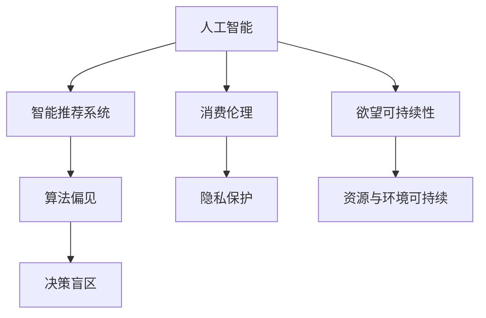

                 

# 欲望的可持续性：AI时代的消费伦理

> 关键词：人工智能,消费伦理,可持续发展,欲望,智能推荐,算法偏见,隐私保护,数据驱动,消费心理学

## 1. 背景介绍

### 1.1 问题由来

随着人工智能(AI)技术的迅猛发展，数字化和智能化的消费模式已成为新常态。消费者在享受AI带来的便捷、高效的同时，也面临着一系列深层次的伦理问题。AI算法的驱动下，消费者的欲望被放大，甚至扭曲，导致资源过度消耗和环境污染加剧，引发了一系列社会、经济和生态问题。

具体表现为：
- **过度消费**：智能推荐系统通过精准化营销和个性化定制，诱导消费者购买超出实际需要的商品和服务。
- **信息不对称**：算法推荐对消费者产生信息屏蔽效应，使其难以全面了解商品和服务的信息，从而做出更加理性和负责任的消费决策。
- **隐私泄露**：消费者的行为数据被过度采集和分析，隐私权和数据安全受到严重威胁。
- **算法偏见**：AI算法可能会基于历史数据和隐性偏见，对特定人群或群体产生歧视性推荐，加剧社会不公。
- **决策盲区**：消费者对AI算法的运行机制和决策过程缺乏了解，难以控制其行为。

这些问题直接挑战了消费伦理，对社会可持续发展的目标构成了威胁。本文旨在通过分析AI时代消费伦理的核心问题，提出实现欲望可持续性的策略，为构建一个更加公正、和谐、可持续的消费环境提供思路。

## 2. 核心概念与联系

### 2.1 核心概念概述

- **人工智能(AI)**：利用计算机算法模拟人类智能过程的技术，包括机器学习、深度学习、自然语言处理等。AI在消费领域的应用，使得个性化推荐、智能客服、自动化购物等成为可能。
- **消费伦理**：研究消费者在购买、使用商品和服务过程中的道德责任和行为规范，追求消费行为与环境、社会、经济可持续发展的统一。
- **欲望可持续性**：指通过合理的消费行为管理，使得个人欲望与资源、环境、社会责任等保持平衡，实现长远的可持续性发展。
- **智能推荐系统**：利用AI技术对消费者行为数据进行分析，提供个性化的商品推荐，提升消费体验。
- **算法偏见**：AI算法在训练和应用过程中可能引入的历史偏见，导致对特定人群或群体的歧视性推荐。
- **隐私保护**：保护消费者数据隐私，确保个人信息不被滥用和泄露。

这些概念之间的逻辑关系可以通过以下Mermaid流程图来展示：



这个流程图展示的核心概念及其之间的关系：

1. 人工智能技术通过智能推荐系统，影响消费者的欲望和行为。
2. 消费伦理指导消费者在AI驱动下的消费行为，追求可持续性发展。
3. 欲望可持续性是消费伦理的核心目标，涉及资源、环境和社会的平衡。
4. 智能推荐系统中的算法偏见可能导致决策盲区，影响隐私保护和公平性。
5. 隐私保护是实现欲望可持续性的重要保障。

## 3. 核心算法原理 & 具体操作步骤
### 3.1 算法原理概述

智能推荐系统基于AI技术，通过分析消费者的历史行为、搜索记录、社交网络等信息，预测其未来消费需求，提供个性化商品推荐。其核心算法包括协同过滤、基于内容的推荐、矩阵分解、深度学习等。

具体来说，协同过滤算法通过分析用户和商品之间的关系，推荐相似商品；基于内容的推荐则通过分析商品属性，推荐功能类似的产品；矩阵分解算法通过将用户-商品矩阵分解为低维空间，提高推荐效果；深度学习算法则通过构建复杂神经网络模型，捕捉用户行为与商品特征之间的非线性关系。

### 3.2 算法步骤详解

智能推荐系统的具体操作步骤主要分为以下几个步骤：

**Step 1: 数据收集与预处理**
- 收集消费者的历史行为数据，包括浏览记录、购买记录、评分数据等。
- 对数据进行清洗、去重、归一化等预处理操作，确保数据质量。

**Step 2: 特征提取**
- 提取消费者和商品的特征，如用户性别、年龄、兴趣标签，商品类别、价格、描述等。
- 使用特征工程技术，将原始数据转换为可供模型使用的数值型特征。

**Step 3: 模型训练与优化**
- 选择适合的推荐算法，如协同过滤、矩阵分解、深度学习等，构建推荐模型。
- 利用历史数据对模型进行训练，优化模型参数。

**Step 4: 推荐生成与反馈**
- 输入新的消费者行为数据，利用训练好的模型生成推荐结果。
- 根据用户反馈调整推荐模型，持续优化推荐效果。

### 3.3 算法优缺点

智能推荐系统的优点包括：
- **高效性**：通过数据分析和模型预测，实现快速精准推荐，提升消费体验。
- **个性化**：提供个性化推荐，满足消费者多样化需求。
- **经济效益**：通过精准营销，提升商家销售转化率，降低运营成本。

缺点包括：
- **算法偏见**：模型可能基于历史数据和隐性偏见，导致对特定人群或群体的歧视性推荐。
- **隐私风险**：大量收集和分析消费者数据，可能泄露隐私，引发伦理问题。
- **过度消费**：过度个性化的推荐，可能诱导过度消费，影响资源可持续性。

### 3.4 算法应用领域

智能推荐系统已经在多个领域得到广泛应用，包括电子商务、视频流媒体、社交媒体、在线旅游等。通过分析用户行为，提供个性化推荐，提升用户满意度，同时也为商家带来了巨大的商业价值。

## 4. 数学模型和公式 & 详细讲解  
### 4.1 数学模型构建

智能推荐系统通常使用矩阵分解、协同过滤、深度学习等算法。以协同过滤算法为例，设用户-商品评分矩阵为 $R$，用户数为 $m$，商品数为 $n$，用户行为矩阵为 $U$，商品特征矩阵为 $V$。协同过滤模型可表示为：

$$
R \approx U \times V
$$

其中 $U$ 为 $m \times k$ 的矩阵，$V$ 为 $k \times n$ 的矩阵，$k$ 为嵌入维度。

### 4.2 公式推导过程

协同过滤算法的目标是找到最优的 $U$ 和 $V$，使得它们相乘的结果逼近原始评分矩阵 $R$。通过矩阵分解，可以将复杂问题转换为优化问题。目标函数可表示为：

$$
\min_{U,V} \| R - U \times V \|_F^2
$$

其中 $\| \cdot \|_F$ 表示矩阵的 Frobenius 范数。使用奇异值分解(SVD)，可得到最优的 $U$ 和 $V$。

### 4.3 案例分析与讲解

以Netflix推荐系统为例，Netflix 用户行为矩阵包含数百万用户对数十万部电影的评分数据。通过协同过滤算法，Netflix 能够推荐用户可能感兴趣的未观看电影，提升用户满意度，增加观看时长，提升广告收入。然而，协同过滤算法可能存在数据稀疏性和冷启动问题，影响推荐效果。

## 5. 项目实践：代码实例和详细解释说明
### 5.1 开发环境搭建

在进行智能推荐系统开发前，需要准备Python开发环境，并安装必要的库。具体步骤如下：

1. 安装Anaconda：从官网下载并安装Anaconda，用于创建独立的Python环境。
```bash
conda create -n py3k python=3.8
conda activate py3k
```

2. 安装必要的库：
```bash
pip install pandas numpy scikit-learn scikit-learn
```

### 5.2 源代码详细实现

以下是一个使用Python和Scikit-learn库实现协同过滤算法的代码示例。

```python
from sklearn.decomposition import TruncatedSVD

# 导入用户行为数据
user_behavior = pd.read_csv('user_behavior.csv')

# 创建协同过滤模型
model = TruncatedSVD(n_components=10)

# 训练模型
model.fit(user_behavior)

# 生成推荐结果
recommendations = model.transform(user_behavior)
```

### 5.3 代码解读与分析

**协同过滤代码解析**：
- 首先导入必要的库，包括 `pandas` 用于数据处理，`sklearn.decomposition` 中的 `TruncatedSVD` 用于协同过滤算法。
- 读取用户行为数据，并进行预处理。
- 创建协同过滤模型，设置嵌入维度为 10。
- 训练模型，将用户行为数据映射到低维空间。
- 使用训练好的模型生成推荐结果。

**数据预处理**：
- 在实际应用中，数据预处理是非常重要的一环，包括数据清洗、特征提取、归一化等操作。

**模型训练与优化**：
- 协同过滤算法通过最小化矩阵分解误差，优化模型参数。在实际应用中，可能需要调整嵌入维度等超参数，以达到最佳推荐效果。

**推荐生成与反馈**：
- 利用训练好的模型，对新用户行为进行预测，生成推荐结果。
- 根据用户反馈调整推荐模型，持续优化推荐效果。

## 6. 实际应用场景

### 6.1 智能推荐系统的实际应用

智能推荐系统已经在多个领域得到广泛应用，包括电子商务、视频流媒体、社交媒体、在线旅游等。通过分析用户行为，提供个性化推荐，提升用户满意度，同时也为商家带来了巨大的商业价值。

**电子商务**：电商网站通过智能推荐系统，向用户推荐相关商品，提升转化率和复购率。例如，Amazon 的推荐引擎能够根据用户浏览记录和购买历史，生成个性化的商品推荐，提升用户体验。

**视频流媒体**：Netflix、YouTube 等平台利用协同过滤和深度学习算法，推荐用户可能感兴趣的电影和视频，提升用户留存率和观看时长。例如，Netflix 通过协同过滤算法，向用户推荐未观看电影，增加用户观看时长。

**社交媒体**：社交平台如Facebook、微信等，利用智能推荐系统向用户推荐好友、兴趣群组、相关文章等，提升用户活跃度和粘性。例如，Facebook 通过推荐系统，向用户推荐可能感兴趣的内容，增加用户互动。

**在线旅游**：旅游平台如携程、去哪儿等，利用智能推荐系统向用户推荐目的地、酒店、景点等，提升用户体验和预订量。例如，携程通过协同过滤算法，向用户推荐相关旅游产品，增加预订量。

### 6.2 智能推荐系统面临的挑战

智能推荐系统虽然带来了诸多便利，但也面临一些挑战：

**算法偏见**：模型可能基于历史数据和隐性偏见，对特定人群或群体产生歧视性推荐。例如，招聘网站可能对男性和女性用户提供不同的推荐，影响就业公平。

**隐私风险**：大量收集和分析消费者数据，可能泄露隐私，引发伦理问题。例如，社交媒体平台可能通过推荐系统追踪用户行为，侵犯用户隐私。

**过度消费**：过度个性化的推荐，可能诱导过度消费，影响资源可持续性。例如，电商平台可能通过推荐系统向用户推荐高价商品，诱导过度消费。

**数据质量问题**：数据稀疏性和冷启动问题，影响推荐效果。例如，新用户可能缺乏历史行为数据，难以提供精准推荐。

## 7. 工具和资源推荐
### 7.1 学习资源推荐

为了帮助开发者系统掌握智能推荐系统的理论基础和实践技巧，这里推荐一些优质的学习资源：

1. **推荐系统实战**：由知名专家撰写，系统介绍推荐系统的算法原理和应用实践，适合实战开发。
2. **协同过滤算法**：介绍协同过滤算法的原理、优缺点、应用场景等，适合深入理解。
3. **深度学习推荐系统**：介绍基于深度学习的推荐系统，包括模型结构、优化策略等，适合高阶学习。
4. **TensorFlow推荐系统**：使用TensorFlow实现推荐系统，适合实践学习。

通过这些资源的学习实践，相信你一定能够快速掌握智能推荐系统的精髓，并用于解决实际的消费伦理问题。

### 7.2 开发工具推荐

高效的开发离不开优秀的工具支持。以下是几款用于智能推荐系统开发的常用工具：

1. **Python**：Python 语言简洁易用，拥有丰富的库和工具，适合开发推荐系统。
2. **TensorFlow**：由Google主导开发的深度学习框架，适合构建复杂推荐模型。
3. **Pandas**：数据处理和分析库，适合处理和清洗推荐数据。
4. **Scikit-learn**：机器学习库，适合实现协同过滤等传统推荐算法。
5. **Jupyter Notebook**：交互式编程环境，适合实验和调试推荐算法。

合理利用这些工具，可以显著提升智能推荐系统的开发效率，加快创新迭代的步伐。

### 7.3 相关论文推荐

智能推荐系统的发展源于学界的持续研究。以下是几篇奠基性的相关论文，推荐阅读：

1. **协同过滤推荐系统**：介绍协同过滤算法的原理和应用，适合初学者。
2. **深度学习推荐系统**：介绍基于深度学习的推荐系统，适合进阶学习。
3. **推荐系统中的冷启动问题**：解决新用户的推荐问题，适合实际应用。

这些论文代表了大规模推荐系统的发展脉络。通过学习这些前沿成果，可以帮助研究者把握学科前进方向，激发更多的创新灵感。

## 8. 总结：未来发展趋势与挑战

### 8.1 总结

本文对基于AI技术的智能推荐系统进行了全面系统的介绍。首先阐述了智能推荐系统的核心算法原理和操作步骤，详细讲解了智能推荐系统的数学模型和公式推导，给出了推荐系统开发的完整代码实例。同时，本文还广泛探讨了智能推荐系统在实际应用中面临的伦理问题，提出了实现欲望可持续性的策略。

通过本文的系统梳理，可以看到，智能推荐系统在提供个性化服务的同时，也带来了诸多伦理问题。这些问题的解决需要技术、伦理、法律等多方面的共同努力。只有全面考虑用户的利益和社会责任，才能构建一个更加公正、和谐、可持续的消费环境。

### 8.2 未来发展趋势

展望未来，智能推荐系统的应用将更加广泛，技术也将更加先进。以下是几大发展趋势：

**技术创新**：未来的推荐系统将更加智能化和个性化，通过引入更多先进算法和数据融合技术，提供更加精准和高效的推荐。例如，基于深度学习的推荐系统将利用更复杂的网络结构和更多的特征工程，提高推荐效果。

**数据驱动**：推荐系统的推荐效果将更多地依赖于高质量的数据和先进的算法，通过对用户行为和产品特征的深度挖掘，实现精准推荐。例如，社交媒体推荐系统将利用多模态数据和先进的数据挖掘技术，提供更加多样和精准的推荐。

**隐私保护**：随着隐私保护意识的增强，推荐系统将更加注重用户隐私保护，采用更先进的数据加密和匿名化技术，确保用户数据的安全和隐私。例如，推荐系统将采用联邦学习和差分隐私等技术，保护用户数据隐私。

**公平性和普适性**：未来的推荐系统将更加注重公平性和普适性，避免对特定人群或群体的歧视性推荐，实现更加公平和普适的推荐。例如，推荐系统将采用公平性评估指标，评估和改进算法的公平性。

**实时性和可扩展性**：推荐系统将更加注重实时性和可扩展性，能够快速响应用户需求，支持大规模数据处理。例如，推荐系统将采用流式处理和分布式计算技术，提高实时性和可扩展性。

这些趋势将推动智能推荐系统向更高的层次发展，提供更加智能、公平、安全的推荐服务，为消费者带来更好的消费体验。

### 8.3 面临的挑战

尽管智能推荐系统已经取得了诸多成就，但在迈向更加智能化、普适化应用的过程中，它仍面临着诸多挑战：

**算法偏见**：模型可能基于历史数据和隐性偏见，对特定人群或群体产生歧视性推荐。如何消除偏见，实现公平推荐，是未来推荐系统的重要挑战。

**隐私保护**：大量收集和分析消费者数据，可能泄露隐私，引发伦理问题。如何保护用户隐私，防止数据滥用，是推荐系统的重要任务。

**过度消费**：过度个性化的推荐，可能诱导过度消费，影响资源可持续性。如何避免过度消费，实现可持续发展，是推荐系统的关键问题。

**数据质量问题**：数据稀疏性和冷启动问题，影响推荐效果。如何提高数据质量，解决新用户的推荐问题，是推荐系统的技术挑战。

这些挑战需要技术、伦理、法律等多方面的共同努力，才能实现智能推荐系统的可持续发展。

### 8.4 研究展望

未来的推荐系统研究需要在以下几个方面寻求新的突破：

**公平性评估**：引入公平性评估指标，评估推荐系统的公平性，改进算法设计。例如，可以使用公平性指标如ROPE (Representativeness of Preferential Outcomes)评估推荐系统的公平性。

**隐私保护技术**：采用联邦学习和差分隐私等技术，保护用户隐私。例如，可以使用联邦学习实现模型训练，确保用户数据不泄露。

**多模态数据融合**：利用多模态数据，提高推荐系统的多样性和精准性。例如，可以利用图像、语音等多模态数据，提升推荐系统的推荐效果。

**持续学习**：引入持续学习技术，使推荐系统能够不断学习新数据，适应不断变化的用户需求。例如，可以使用在线学习算法，持续更新推荐模型。

**增强可解释性**：增强推荐系统的可解释性，帮助用户理解推荐过程。例如，可以使用可解释性方法，生成推荐理由和解释。

这些研究方向将引领推荐系统向更高的层次发展，提供更加智能、公平、安全的推荐服务，为消费者带来更好的消费体验。

## 9. 附录：常见问题与解答

**Q1：如何缓解智能推荐系统的算法偏见问题？**

A: 缓解智能推荐系统的算法偏见问题，可以从以下几个方面入手：
1. 数据多样性：确保数据来源多样化，避免数据偏见。例如，推荐系统可以收集来自不同来源、不同背景的数据，提高推荐系统的公平性。
2. 公平性评估：引入公平性评估指标，评估推荐系统的公平性，改进算法设计。例如，可以使用ROPE (Representativeness of Preferential Outcomes)等指标，评估推荐系统的公平性。
3. 多算法组合：采用多种推荐算法组合，避免单一算法偏见。例如，可以结合协同过滤、矩阵分解、深度学习等多种算法，提高推荐系统的公平性。

**Q2：如何保护智能推荐系统的用户隐私？**

A: 保护智能推荐系统的用户隐私，可以从以下几个方面入手：
1. 数据匿名化：对用户数据进行匿名化处理，确保用户隐私不泄露。例如，可以使用差分隐私技术，对用户数据进行随机扰动。
2. 数据加密：对用户数据进行加密处理，确保数据在传输和存储过程中不被窃取。例如，可以使用AES、RSA等加密算法，对用户数据进行加密。
3. 联邦学习：采用联邦学习技术，将数据分布式存储在多个设备上，避免数据集中存储带来的隐私风险。例如，可以利用联邦学习技术，实现推荐系统的分布式训练。
4. 隐私保护算法：采用隐私保护算法，如隐私增强学习方法，保护用户隐私。例如，可以使用LDP (Local Differential Privacy)算法，保护用户隐私。

**Q3：如何避免智能推荐系统的过度消费问题？**

A: 避免智能推荐系统的过度消费问题，可以从以下几个方面入手：
1. 合理设置推荐阈值：通过合理设置推荐阈值，避免过度推荐。例如，可以设置推荐次数上限，避免过度推荐。
2. 多目标优化：将推荐目标设置为多元目标，兼顾用户满意度、商家利益和资源可持续性。例如，可以使用多目标优化方法，优化推荐系统的推荐效果。
3. 提示推荐：通过提示推荐，引导用户理性消费。例如，可以在推荐页面提示用户理性消费，避免过度消费。
4. 动态调整推荐策略：根据用户反馈动态调整推荐策略，避免过度推荐。例如，可以根据用户反馈，调整推荐策略，减少过度推荐。

这些措施可以在一定程度上缓解智能推荐系统的过度消费问题，帮助用户实现欲望的可持续性。

**Q4：如何提高智能推荐系统的数据质量？**

A: 提高智能推荐系统的数据质量，可以从以下几个方面入手：
1. 数据清洗：对原始数据进行清洗和预处理，确保数据质量。例如，可以使用数据清洗工具，去除噪声和异常值。
2. 数据增强：通过数据增强技术，提高数据的多样性和丰富性。例如，可以通过数据合成和数据增强技术，提高数据的多样性。
3. 多模态数据融合：利用多模态数据，提高数据质量。例如，可以利用图像、语音等多模态数据，提升推荐系统的数据质量。
4. 数据标注：对数据进行标注和标准化处理，确保数据的一致性和准确性。例如，可以对数据进行标注和标准化处理，确保数据的一致性。

通过这些措施，可以提高智能推荐系统的数据质量，提高推荐效果。

**Q5：如何提高智能推荐系统的实时性和可扩展性？**

A: 提高智能推荐系统的实时性和可扩展性，可以从以下几个方面入手：
1. 流式处理：采用流式处理技术，实时响应用户需求。例如，可以采用流式处理技术，实时响应用户请求，提高推荐系统的实时性。
2. 分布式计算：采用分布式计算技术，提高推荐系统的可扩展性。例如，可以采用分布式计算技术，提高推荐系统的可扩展性。
3. 缓存机制：采用缓存机制，减少重复计算和数据传输。例如，可以使用缓存机制，减少重复计算和数据传输，提高推荐系统的实时性和可扩展性。
4. 负载均衡：采用负载均衡技术，均衡系统负载。例如，可以采用负载均衡技术，均衡系统负载，提高推荐系统的可扩展性。

通过这些措施，可以提高智能推荐系统的实时性和可扩展性，提高推荐效果。

---

作者：禅与计算机程序设计艺术 / Zen and the Art of Computer Programming

