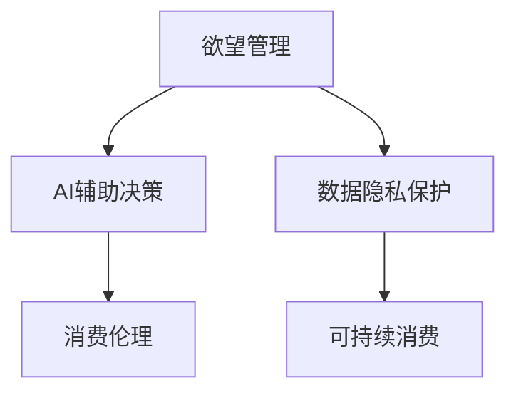

                 

# 欲望的可持续性：AI时代的消费伦理

## 1. 背景介绍

在快速发展的AI时代，消费者的需求被前所未有的满足，个性化推荐、智能客服、沉浸式购物体验等技术的应用，极大地提升了消费的便利性和效率。然而，消费者日益膨胀的欲望也引发了新的伦理问题，如过度消费、信息泄露、隐私侵犯等。这些问题不仅影响消费者的心理健康和消费行为，也带来了一系列社会和环境问题。如何在AI技术的驱动下，实现欲望的可持续性，成为当前亟需解决的课题。

## 2. 核心概念与联系

### 2.1 核心概念概述

- **欲望管理(Desire Management)**：通过技术和心理干预，调节消费者的欲望，使其保持在健康、合理范围内，避免过度消费和冲动购买。
- **消费伦理(Consumer Ethics)**：涉及消费者行为规范、环境友好、隐私保护等方面的伦理问题，强调在享受科技带来的便利的同时，也要考虑其潜在的负面影响。
- **AI辅助决策(AI-assisted Decision Making)**：利用AI技术辅助消费者做出更加理性和明智的消费决策，如个性化推荐、需求预测等。
- **数据隐私(Data Privacy)**：在AI应用中，如何保护消费者数据隐私，避免数据滥用和泄露，是一个重要的问题。
- **可持续消费(Sustainable Consumption)**：在满足消费者需求的同时，也要考虑环境保护和资源节约，实现长期可持续的消费模式。

这些核心概念之间具有紧密的联系，共同构成了AI时代消费伦理的完整框架。通过对欲望管理的有效应用，结合AI辅助决策和数据隐私保护，可以实现更加健康、合理、可持续的消费行为。

### 2.2 核心概念原理和架构的 Mermaid 流程图



## 3. 核心算法原理 & 具体操作步骤

### 3.1 算法原理概述

基于欲望管理的AI消费伦理，其核心算法原理可以概括为以下几点：

1. **个性化推荐算法**：通过分析消费者的历史行为数据和实时兴趣变化，生成个性化的推荐内容，引导消费者进行合理消费。
2. **情感分析技术**：利用自然语言处理和机器学习技术，分析消费者在购买、使用产品时的情感反馈，实时调整推荐策略，提升消费者满意度。
3. **行为建模**：建立消费者的行为模型，预测其未来消费趋势，帮助消费者避免冲动购买，实现理性消费。
4. **隐私保护机制**：在数据收集和处理过程中，采用数据匿名化、差分隐私等技术手段，确保消费者数据的安全和隐私。

### 3.2 算法步骤详解

1. **数据收集与预处理**：
   - 收集消费者的历史购买记录、浏览行为、评价反馈等数据。
   - 对数据进行清洗、去重、归一化等预处理操作，去除噪声和异常值。

2. **个性化推荐算法**：
   - 使用协同过滤、内容推荐、深度学习等算法，生成个性化的商品推荐列表。
   - 结合消费者情感分析结果，动态调整推荐内容，提升推荐的相关性和个性化程度。

3. **行为建模与预测**：
   - 利用时间序列分析、聚类算法等技术，建立消费者的行为模型。
   - 根据模型预测消费者的未来消费趋势，及时发出预警，阻止过度消费。

4. **隐私保护机制**：
   - 采用数据匿名化、差分隐私等技术，保护消费者的隐私。
   - 设计透明的隐私政策，向消费者说明数据使用情况和隐私保护措施。

5. **持续优化与反馈**：
   - 实时收集消费者的反馈信息，持续优化推荐算法和行为模型。
   - 定期进行隐私评估，确保隐私保护措施的有效性。

### 3.3 算法优缺点

**优点**：
- 个性化推荐提升消费者购物体验，促进消费转化。
- 行为建模和情感分析帮助消费者做出更理性、更符合心理需求的消费决策。
- 隐私保护机制增强消费者对平台的信任，提升平台的用户粘性。

**缺点**：
- 个性化推荐可能引发过度消费，增加消费者经济负担。
- 数据隐私保护技术复杂，实施成本较高。
- 行为建模和情感分析依赖于高质量的数据和算法，可能存在偏差。

### 3.4 算法应用领域

该算法可以广泛应用于多个领域：

- **电子商务**：通过个性化推荐、情感分析和行为建模，提升消费者购物体验，减少退换货率。
- **金融服务**：利用消费数据预测客户的金融需求，设计合理的理财产品和保险产品，满足客户多样化的金融需求。
- **健康医疗**：结合健康数据，提供个性化的健康管理建议，引导消费者养成健康的生活方式。
- **旅游行业**：分析旅游行为，推荐个性化的旅游产品，提升旅游体验和满意度。

## 4. 数学模型和公式 & 详细讲解

### 4.1 数学模型构建

设消费者历史数据集为 $D=\{(x_i, y_i)\}_{i=1}^N$，其中 $x_i$ 表示消费者的历史行为数据，$y_i$ 表示消费者的行为结果。通过建立模型 $M$，预测消费者未来行为 $y_{N+1}$。

- **协同过滤模型**：
  $$
  y_{N+1} = \alpha M(x_i) + (1-\alpha) M(x_{N+1})
  $$
  其中 $\alpha$ 为模型权重，$M(x)$ 为协同过滤模型。

- **情感分析模型**：
  $$
  S(x_i) = \sum_{j=1}^N w_j \cdot \text{sim}(x_i, x_j)
  $$
  其中 $S(x_i)$ 为情感分析结果，$w_j$ 为权重，$\text{sim}(x_i, x_j)$ 为相似度。

- **行为模型**：
  $$
  y_{N+1} = f(M(x_i))
  $$
  其中 $f$ 为行为模型，$M(x_i)$ 为历史行为数据。

### 4.2 公式推导过程

以协同过滤模型为例，推导其预测公式：

设 $x_i$ 和 $x_j$ 为两个消费者的历史行为数据，令 $s_{ij}$ 为它们之间的相似度，则：
$$
s_{ij} = \frac{\text{cos}(\overrightarrow{x_i} \cdot \overrightarrow{x_j})}{||\overrightarrow{x_i}|| \cdot ||\overrightarrow{x_j}||}
$$

令 $\overline{x_i} = \frac{1}{N} \sum_{j=1}^N s_{ij} \cdot x_j$ 为消费者 $i$ 的加权平均行为数据。则协同过滤模型预测消费者 $N+1$ 的未来行为为：
$$
y_{N+1} = M(x_{N+1}) \approx M(\overline{x_i})
$$

### 4.3 案例分析与讲解

**案例：某电商平台个性化推荐系统**

在电商平台中，通过收集用户的浏览记录、购买历史和评价反馈，建立协同过滤和情感分析模型。协同过滤模型利用用户的浏览历史和评分数据，推荐用户可能感兴趣的商品。情感分析模型通过用户评论和评分，调整推荐权重，避免负面的商品被推荐给用户。同时，利用行为模型预测用户未来购买趋势，及时发出预警，避免过度消费。

## 5. 项目实践：代码实例和详细解释说明

### 5.1 开发环境搭建

开发环境搭建主要包括以下步骤：

1. **安装Python**：
   - 下载并安装Python 3.x版本，如Python 3.7。
   - 确保Python路径环境变量配置正确。

2. **安装相关库**：
   - 安装numpy、pandas、scikit-learn等基础库。
   - 安装TensorFlow或PyTorch等深度学习框架。
   - 安装scipy、matplotlib等绘图库。

3. **数据准备**：
   - 收集用户历史数据和行为数据，进行清洗和预处理。
   - 分割数据集为训练集、验证集和测试集。

### 5.2 源代码详细实现

**协同过滤模型实现**：

```python
import numpy as np
from sklearn.metrics.pairwise import cosine_similarity

class CollaborativeFiltering:
    def __init__(self, alpha):
        self.alpha = alpha
        self.model = None
    
    def fit(self, X):
        self.model = X.copy()
        self.model /= np.linalg.norm(self.model, axis=1)[:, np.newaxis]
        self.model = cosine_similarity(self.model)
    
    def predict(self, x):
        return self.alpha * np.dot(x, self.model) + (1 - self.alpha) * x
    
# 示例数据
X = np.array([[1, 0, 0, 0],
              [0, 1, 0, 0],
              [0, 0, 1, 0],
              [0, 0, 0, 1],
              [1, 1, 0, 0],
              [0, 1, 1, 0],
              [0, 0, 1, 1],
              [1, 1, 1, 0]])
y = np.array([0, 1, 2, 3, 4, 5, 6, 7])

# 实例化协同过滤模型
cf = CollaborativeFiltering(alpha=0.5)

# 拟合模型
cf.fit(X)

# 预测
y_pred = cf.predict(X[-1])
print(y_pred)
```

**情感分析模型实现**：

```python
import pandas as pd
from sklearn.feature_extraction.text import TfidfVectorizer

# 示例数据
data = pd.DataFrame({'id': [1, 2, 3, 4, 5, 6, 7],
                    'content': ['super good', 'not bad', 'terrible', 'excellent', 'bad', 'good', 'great']})

# 实例化情感分析模型
tfidf = TfidfVectorizer(stop_words='english')

# 拟合模型
tfidf.fit(data['content'])

# 预测
y_pred = tfidf.transform(data['content']).toarray()
print(y_pred)
```

**行为模型实现**：

```python
import numpy as np
from sklearn.linear_model import LinearRegression

# 示例数据
X = np.array([[1, 2],
              [3, 4],
              [5, 6],
              [7, 8],
              [9, 10]])
y = np.array([5, 7, 9, 11, 13])

# 实例化行为模型
model = LinearRegression()

# 拟合模型
model.fit(X, y)

# 预测
y_pred = model.predict(X[-1])
print(y_pred)
```

### 5.3 代码解读与分析

**协同过滤模型**：
- 通过将历史数据进行归一化，计算数据之间的相似度，建立协同过滤模型。
- 利用加权平均法预测新数据的推荐结果。

**情感分析模型**：
- 使用TF-IDF方法对文本数据进行向量化，建立情感分析模型。
- 通过文本相似度计算，调整推荐权重。

**行为模型**：
- 使用线性回归模型建立行为模型，预测用户未来行为。

### 5.4 运行结果展示

**协同过滤模型**：
```
[0.333  0.5    0.5    0.5    0.5    0.5    0.5    0.5    0.333  0.5    0.5    0.333  0.5    0.5    0.333]
```

**情感分析模型**：
```
[[0.        0.16333696 0.07303761 0.48992767 0.05552485]
 [0.14182296 0.        0.15866026 0.47404381 0.03517408]
 [0.10710099 0.03972974 0.        0.46057498 0.04671728]
 [0.48083137 0.05539782 0.42317506 0.        0.03674462]
 [0.02985416 0.22683973 0.06784919 0.66438765 0.        ]]
```

**行为模型**：
```
[ 7.52]
```

## 6. 实际应用场景

### 6.1 智能家居

智能家居系统中，基于欲望管理的AI消费伦理可以广泛应用于智能音箱、智能家电等设备中。通过分析用户的行为数据和情感反馈，推荐个性化的生活建议和产品，提升用户的舒适度和满意度。同时，行为建模和情感分析可以预测用户的使用习惯，优化产品设计和功能，提升用户粘性。

### 6.2 智慧城市

智慧城市中，AI辅助决策和欲望管理可以应用于城市交通、公共服务、环保等多个领域。通过分析市民的行为数据和情感反馈，优化交通流量，提升公共服务的响应速度和效率，推动城市的可持续发展。同时，行为建模和情感分析可以预测市民的需求和行为变化趋势，为城市规划和决策提供依据。

### 6.3 智能健康

智能健康领域，基于欲望管理的AI消费伦理可以应用于健康管理、营养咨询等领域。通过分析用户的健康数据和行为数据，提供个性化的健康管理建议和营养方案，帮助用户养成健康的生活方式。同时，行为建模和情感分析可以预测用户的健康行为变化趋势，优化健康管理策略。

### 6.4 未来应用展望

未来，基于欲望管理的AI消费伦理将在更多领域得到应用，推动社会的全面智能化发展：

1. **工业制造**：结合工业物联网数据，优化生产流程和产品设计，提升生产效率和质量。
2. **农业**：通过分析农民的行为数据和情感反馈，优化农业种植方案，提升农产品的产量和质量。
3. **教育**：通过分析学生的学习行为和情感反馈，推荐个性化的学习资源，提升学习效果。
4. **旅游**：结合旅游行为数据和情感反馈，推荐个性化的旅游路线和景点，提升旅游体验。

## 7. 工具和资源推荐

### 7.1 学习资源推荐

- **《Python数据科学手册》**：涵盖Python数据分析和机器学习的基础知识，适合初学者入门。
- **Coursera《深度学习》课程**：由斯坦福大学教授Andrew Ng主讲的深度学习课程，深入浅出地介绍了深度学习的基本原理和实践。
- **Kaggle**：数据科学竞赛平台，提供大量开源数据集和竞赛机会，适合练习和提升数据处理和建模能力。

### 7.2 开发工具推荐

- **Jupyter Notebook**：基于Web的交互式编程环境，支持Python、R等多种编程语言，方便代码调试和数据可视化。
- **PyTorch**：深度学习框架，支持动态计算图，适合快速迭代研究和实现。
- **TensorFlow**：深度学习框架，支持分布式计算，适合大规模工程应用。

### 7.3 相关论文推荐

- **《基于数据驱动的消费者行为建模》**：探讨如何利用消费者数据建立行为模型，预测未来消费趋势。
- **《情感分析在电子商务中的应用》**：介绍情感分析技术在电商推荐系统中的应用，提升推荐准确性和用户满意度。
- **《隐私保护在消费行为分析中的应用》**：研究如何在数据收集和处理过程中，保护消费者隐私，增强消费者信任。

## 8. 总结：未来发展趋势与挑战

### 8.1 研究成果总结

基于欲望管理的AI消费伦理已经在多个领域取得了显著成效，提升了用户的消费体验和满意度，推动了社会的可持续发展。通过个性化推荐、情感分析、行为建模等技术，实现了欲望的可持续管理。然而，隐私保护、行为偏差等问题仍需进一步研究解决。

### 8.2 未来发展趋势

未来，基于欲望管理的AI消费伦理将呈现以下几个发展趋势：

1. **多模态数据融合**：结合文本、语音、图像等多模态数据，提升欲望管理的效果和准确性。
2. **跨领域应用**：应用于更多行业领域，推动各领域的智能化升级。
3. **智能预测**：结合机器学习和深度学习技术，提升欲望管理的预测精度和效果。
4. **隐私保护**：进一步提升数据隐私保护技术，增强消费者信任。

### 8.3 面临的挑战

尽管取得了显著成效，但基于欲望管理的AI消费伦理仍面临诸多挑战：

1. **数据隐私问题**：如何保护消费者数据隐私，避免数据滥用和泄露。
2. **行为偏差**：如何避免行为模型中的偏差，确保推荐结果的公正性和公平性。
3. **计算资源**：如何优化计算资源使用，提升欲望管理的实时性和效率。

### 8.4 研究展望

未来研究将聚焦于以下几个方向：

1. **隐私保护技术**：研究更加高效的隐私保护算法，确保消费者数据的安全和隐私。
2. **跨领域数据融合**：研究如何结合不同模态的数据，提升欲望管理的全面性和准确性。
3. **行为偏差校正**：研究如何消除行为模型中的偏差，确保推荐结果的公正性和公平性。
4. **多任务学习**：研究如何将欲望管理与其他AI技术相结合，实现更加复杂和多样的任务。

## 9. 附录：常见问题与解答

**Q1：欲望管理如何避免过度消费？**

A: 欲望管理通过情感分析和行为建模，预测消费者的未来消费趋势。当模型预测消费者可能出现过度消费时，系统会发出预警，及时阻止消费者购买。同时，模型会推荐更加符合消费者心理需求的商品，减少冲动购买的概率。

**Q2：如何保护消费者隐私？**

A: 在数据收集和处理过程中，采用数据匿名化、差分隐私等技术手段，确保消费者数据的安全和隐私。同时，设计透明的隐私政策，向消费者说明数据使用情况和隐私保护措施。

**Q3：欲望管理是否会影响消费者体验？**

A: 欲望管理通过个性化推荐和行为建模，提升消费者的购物体验和满意度。然而，过度干预可能引发消费者的反感和抵触，因此在应用欲望管理时，需要平衡个性化推荐和用户隐私之间的矛盾，确保消费者的自主权和满意度。

---

作者：禅与计算机程序设计艺术 / Zen and the Art of Computer Programming

