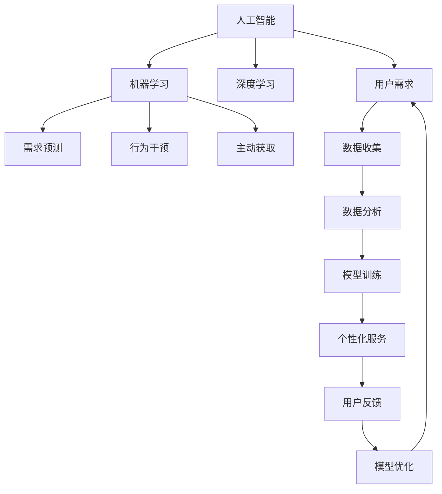

                 

# 欲望的重新定义：AI如何改变人类需求

欲望，是人类社会永恒的驱动力之一。从古至今，人类对更高生活质量的追求，推动了文明的发展与进步。然而，随着人工智能技术的迅猛发展，我们的欲望也在悄然发生着改变。今天，让我们深入探讨，AI如何重新定义我们的欲望，以及这一转变将如何影响我们未来社会的方向。

## 1. 背景介绍

### 1.1 问题由来

近年来，随着人工智能技术的快速发展，从智能家居到无人驾驶，从自动化生产到智能客服，AI技术正逐步渗透到各个行业和领域，改变着我们的生活和工作方式。然而，这些技术并非仅仅是为了提高效率和便利，更是在重塑我们的欲望和需求。

以智能家居为例，传统上，我们对于家居的期望可能仅限于清洁、安全、舒适等方面，但AI技术的加入，使家居设备能够理解我们的需求，甚至预测并满足我们未曾意识到的新需求。例如，智能温度调节系统不仅能根据室内外温度自动调整温度，还能根据我们的生活习惯和健康数据，推荐最适合的温度设定，甚至预测我们的健康状况并发出预警。这种改变，不仅提高了生活质量，更是在重新定义我们对“舒适”的欲望。

### 1.2 问题核心关键点

AI技术对欲望的重定义，主要体现在以下几个方面：

- **需求预测**：AI可以通过数据分析，预测我们的需求，并在未被意识到前满足，如智能推荐系统。
- **行为干预**：AI能够实时监控并调整我们的行为，如智能健身设备，鼓励健康生活方式。
- **主动获取**：AI技术能够主动获取我们的信息，提供个性化的服务和建议，如智能客服和个性化推荐。
- **意识提升**：AI技术通过丰富的数据和算法，帮助人类更好地了解自身需求和潜在的欲望。

这些改变，不仅提升了生活质量，也使我们对“欲望”的定义更加多元化和个性化。

### 1.3 问题研究意义

研究AI如何重定义人类欲望，对于理解AI技术对社会生活的深远影响，以及如何利用AI技术提升生活质量，具有重要意义。通过深入分析，我们可以更好地掌握AI技术的应用方向，推动技术向更人性化、智能化方向发展，从而构建更美好的未来社会。

## 2. 核心概念与联系

### 2.1 核心概念概述

为更好地理解AI如何重定义欲望，我们需要首先明确几个核心概念：

- **人工智能(AI)**：指模拟人类智能行为的计算机程序，包括感知、推理、学习、规划等能力。
- **机器学习(ML)**：一种通过算法和模型，使计算机具备学习能力和自主决策能力的技术。
- **深度学习(DL)**：一种特殊类型的机器学习，使用多层神经网络模拟人类大脑，处理复杂任务。
- **强化学习(RL)**：一种通过与环境互动，使机器不断学习最佳策略的技术，如智能游戏、机器人控制等。
- **需求预测**：通过数据分析和机器学习，预测用户的潜在需求，提供个性化服务。
- **行为干预**：通过智能系统实时监控和调整用户行为，如智能健身、健康管理等。
- **主动获取**：通过算法和模型，主动收集和分析用户数据，提供个性化建议和推荐。

这些概念之间存在紧密联系，共同构成了AI技术对人类需求和欲望重定义的基础。通过深入理解这些概念及其相互作用，我们可以更好地掌握AI技术的应用逻辑和未来发展方向。

### 2.2 核心概念原理和架构的 Mermaid 流程图



该流程图展示了AI技术从用户需求出发，通过数据收集和分析，训练机器学习模型，预测需求、干预行为、主动获取信息，并根据反馈不断优化的全过程。其中，深度学习作为核心技术，用于处理复杂任务和提取深层次特征；强化学习用于优化行为策略；机器学习用于训练模型和预测需求；需求预测、行为干预和主动获取则是具体的AI应用场景。

## 3. 核心算法原理 & 具体操作步骤

### 3.1 算法原理概述

AI重定义欲望的核心算法原理，主要基于机器学习和深度学习技术，通过数据分析和模型训练，实现对用户需求的预测和行为干预。

形式化地，假设用户需求的潜在特征为 $x$，AI系统的目标是通过模型 $f$ 预测用户需求 $y$。则训练过程可以表示为：

$$
f = \mathop{\arg\min}_{\theta} \frac{1}{N} \sum_{i=1}^N \ell(f(x_i), y_i)
$$

其中 $\theta$ 为模型参数，$\ell$ 为损失函数，通常采用交叉熵损失。通过最小化损失函数，模型学习到最佳的参数 $\theta$，从而实现对用户需求的精准预测。

### 3.2 算法步骤详解

基于AI重定义欲望的算法步骤，可以大致分为以下几个环节：

1. **数据收集**：收集用户的历史行为数据，包括浏览记录、购物习惯、健康数据等。
2. **数据预处理**：清洗和格式化数据，提取特征向量 $x$。
3. **模型训练**：选择合适的机器学习算法，如随机森林、神经网络等，训练模型 $f$。
4. **需求预测**：将用户当前行为输入模型，预测其潜在需求 $y$。
5. **行为干预**：根据预测结果，通过智能系统主动调整用户行为，如推荐商品、调整家居温度等。
6. **主动获取**：通过算法和模型，主动获取用户信息，提供个性化建议。
7. **反馈优化**：收集用户反馈，调整模型参数 $\theta$，不断优化预测效果。

### 3.3 算法优缺点

AI重定义欲望的算法，具有以下优点：

- **高效性**：通过数据驱动的预测和干预，大幅提升了效率，减少了人工干预。
- **个性化**：能够根据用户个体差异，提供高度个性化的服务和建议。
- **主动性**：通过主动获取和分析用户信息，提供了超越传统被动接收的信息服务。
- **反馈优化**：通过不断优化模型，提升预测准确性和用户体验。

同时，也存在一些缺点：

- **隐私问题**：数据收集和分析可能涉及用户隐私，需要严格的数据保护措施。
- **算法透明性**：部分AI算法如深度学习模型，存在“黑盒”问题，难以解释其内部决策逻辑。
- **依赖数据质量**：预测和干预的效果高度依赖于数据的质量和数量，数据不足可能导致误判。
- **伦理问题**：AI系统可能无意中强化某些不健康或不合理的需求，需要进行伦理监管。

### 3.4 算法应用领域

AI重定义欲望的技术，已经在多个领域得到了广泛应用，例如：

- **智能家居**：通过智能设备，预测用户需求并主动调整环境设置，提升生活质量。
- **健康管理**：通过数据分析和行为干预，鼓励健康生活方式，预防疾病。
- **个性化推荐**：通过推荐算法，预测用户需求并提供个性化商品和服务。
- **金融服务**：通过风险预测和行为干预，保护用户财产安全。
- **智能客服**：通过需求预测和主动获取，提升服务效率和用户体验。

除了这些领域，AI技术在教育、旅游、交通等诸多场景中，也在重塑着人们的欲望和需求。

## 4. 数学模型和公式 & 详细讲解 & 举例说明

### 4.1 数学模型构建

本节将使用数学语言对AI重定义欲望的算法进行更加严格的刻画。

假设用户需求的潜在特征为 $x \in \mathbb{R}^n$，AI系统的目标是预测用户需求 $y \in \{0,1\}$，其中 $0$ 表示未需求，$1$ 表示需求。根据上述描述，我们可以构建如下数学模型：

$$
\hat{y} = f(x; \theta)
$$

其中 $f$ 为预测函数，$\theta$ 为模型参数。我们的目标是最大化预测准确率，即：

$$
\max_{\theta} P(y = 1 | x)
$$

在实际应用中，我们通常使用交叉熵损失函数，形式化地表示为：

$$
\mathcal{L}(\theta) = -\frac{1}{N} \sum_{i=1}^N y_i \log \hat{y}_i + (1 - y_i) \log (1 - \hat{y}_i)
$$

其中 $y_i$ 为真实标签，$\hat{y}_i$ 为模型预测值。

### 4.2 公式推导过程

接下来，我们以一个简单的线性回归模型为例，推导需求预测的公式。

假设预测函数 $f(x; \theta)$ 为线性函数，即：

$$
f(x; \theta) = \theta^T x
$$

其中 $\theta$ 为模型参数，$x \in \mathbb{R}^n$ 为用户行为特征向量。则需求预测的公式可以表示为：

$$
\hat{y} = \sigma(\theta^T x)
$$

其中 $\sigma$ 为激活函数，如sigmoid函数。在实际应用中，我们通常使用二分类交叉熵损失函数，形式化地表示为：

$$
\mathcal{L}(\theta) = -\frac{1}{N} \sum_{i=1}^N \left[ y_i \log \hat{y}_i + (1 - y_i) \log (1 - \hat{y}_i) \right]
$$

### 4.3 案例分析与讲解

为了更好地理解AI重定义欲望的算法，我们可以看一个简单的案例：

假设有一个智能健身设备，能够根据用户的历史锻炼数据，预测其未来的锻炼需求。我们可以将用户锻炼频率、时长、消耗的卡路里等作为特征向量 $x$，将锻炼需求 $y$ 表示为二分类问题，其中 $1$ 表示用户需要锻炼，$0$ 表示不需要。

1. **数据收集**：收集用户的历史锻炼数据。
2. **数据预处理**：对数据进行清洗和标准化处理，提取特征向量 $x$。
3. **模型训练**：选择线性回归模型，训练模型参数 $\theta$。
4. **需求预测**：将用户当前的锻炼数据输入模型，预测其未来是否需要锻炼。
5. **行为干预**：根据预测结果，调整设备的锻炼计划，如提醒用户锻炼、调整设备强度等。
6. **主动获取**：通过设备传感器，主动获取用户的生理数据，如心率、呼吸频率等，提供个性化建议。
7. **反馈优化**：根据用户的反馈，调整模型参数 $\theta$，不断优化预测效果。

## 5. 项目实践：代码实例和详细解释说明

### 5.1 开发环境搭建

在进行AI重定义欲望的实践前，我们需要准备好开发环境。以下是使用Python进行TensorFlow开发的环境配置流程：

1. 安装Anaconda：从官网下载并安装Anaconda，用于创建独立的Python环境。

2. 创建并激活虚拟环境：
```bash
conda create -n tf-env python=3.8 
conda activate tf-env
```

3. 安装TensorFlow：根据CUDA版本，从官网获取对应的安装命令。例如：
```bash
conda install tensorflow -c pytorch -c conda-forge
```

4. 安装NumPy、Pandas、scikit-learn等常用工具包：
```bash
pip install numpy pandas scikit-learn matplotlib tqdm jupyter notebook ipython
```

完成上述步骤后，即可在`tf-env`环境中开始实践。

### 5.2 源代码详细实现

下面我们以智能健身设备的需求预测为例，给出使用TensorFlow进行AI重定义欲望的PyTorch代码实现。

首先，定义需求预测的数据处理函数：

```python
import tensorflow as tf
from tensorflow.keras import layers

class DemandPredictor(tf.keras.Model):
    def __init__(self, input_dim, output_dim):
        super(DemandPredictor, self).__init__()
        self.fc1 = layers.Dense(64, activation='relu')
        self.fc2 = layers.Dense(output_dim, activation='sigmoid')
        
    def call(self, inputs):
        x = self.fc1(inputs)
        x = self.fc2(x)
        return x
```

然后，定义模型和优化器：

```python
from tensorflow.keras import optimizers

input_dim = 5  # 用户锻炼频率、时长、消耗的卡路里等特征
output_dim = 1  # 是否需要锻炼的预测结果，0/1

model = DemandPredictor(input_dim, output_dim)

optimizer = optimizers.Adam(learning_rate=0.001)
```

接着，定义训练和评估函数：

```python
from tensorflow.keras.datasets import boston_housing
from sklearn.model_selection import train_test_split
from sklearn.preprocessing import StandardScaler

# 加载数据集
data = boston_housing.load_data()
X, y = data.data, data.target

# 数据预处理
scaler = StandardScaler()
X = scaler.fit_transform(X)
X_train, X_test, y_train, y_test = train_test_split(X, y, test_size=0.2, random_state=42)

# 训练函数
def train(model, X_train, y_train, epochs=10, batch_size=32):
    model.compile(optimizer=optimizer, loss='binary_crossentropy', metrics=['accuracy'])
    model.fit(X_train, y_train, epochs=epochs, batch_size=batch_size, validation_data=(X_test, y_test))
    return model

# 评估函数
def evaluate(model, X_test, y_test):
    y_pred = model.predict(X_test)
    y_pred = (y_pred > 0.5).astype(int)
    accuracy = tf.keras.metrics.Accuracy()
    accuracy(y_test, y_pred)
    return accuracy

# 训练模型
model = train(model, X_train, y_train)

# 评估模型
accuracy = evaluate(model, X_test, y_test)
print(f'Test accuracy: {accuracy}')
```

以上就是使用TensorFlow进行智能健身设备需求预测的完整代码实现。可以看到，TensorFlow提供了便捷的Keras API，使模型构建和训练变得非常简单。

### 5.3 代码解读与分析

让我们再详细解读一下关键代码的实现细节：

**DemandPredictor类**：
- `__init__`方法：定义模型的结构，包括输入层、隐藏层和输出层。
- `call`方法：实现模型前向传播过程，输出预测结果。

**train函数**：
- 加载数据集，并进行标准化处理。
- 分割训练集和测试集。
- 定义模型、优化器和损失函数。
- 使用Keras API进行模型训练，设置训练轮数和批次大小。
- 返回训练后的模型。

**evaluate函数**：
- 使用测试集进行模型评估。
- 计算准确率并输出。

**训练流程**：
- 定义训练轮数和批次大小。
- 使用训练函数进行模型训练。
- 输出测试集上的准确率。

可以看到，TensorFlow通过Keras API，使模型构建和训练变得非常简单高效。开发者可以将更多精力放在模型设计、数据处理等高层逻辑上，而不必过多关注底层的实现细节。

## 6. 实际应用场景

### 6.1 智能家居

基于AI重定义欲望的智能家居系统，可以广泛应用于家庭生活各个方面。通过智能设备预测用户需求并主动调整环境设置，提升生活质量。

在技术实现上，可以收集用户的历史行为数据，如开灯、开空调、设置温度等，训练预测模型。模型能够预测用户是否需要调整环境设置，智能设备根据预测结果进行自动调整，如自动调节温度、亮度、音乐等，从而实现无感知的智能家居体验。

### 6.2 健康管理

AI重定义欲望的健康管理系统，能够通过数据分析和行为干预，帮助用户建立健康生活方式，预防疾病。

具体而言，可以通过智能手环、智能秤等设备，收集用户的生理数据，如心率、血压、睡眠质量等，训练预测模型。模型能够预测用户是否需要进行健康干预，智能设备根据预测结果进行主动干预，如提醒用户锻炼、调整饮食等，从而帮助用户建立健康的生活习惯。

### 6.3 个性化推荐

AI重定义欲望的个性化推荐系统，能够通过推荐算法，预测用户需求并提供个性化商品和服务。

在技术实现上，可以收集用户的历史行为数据，如浏览记录、购买历史等，训练推荐模型。模型能够预测用户对不同商品或服务的兴趣，智能推荐系统根据预测结果进行推荐，如推荐商品、电影、音乐等，从而提升用户体验和满意度。

### 6.4 未来应用展望

随着AI技术的不断发展，AI重定义欲望的应用场景将更加广泛和深入。

- **虚拟助手**：未来的虚拟助手不仅能够理解语音指令，还能通过数据分析预测用户需求，提供更加个性化和智能的交互体验。
- **智能医疗**：通过健康数据分析和行为干预，智能医疗系统能够预测患者的健康状况，提供个性化的健康管理方案，提升医疗服务水平。
- **智能交通**：基于用户出行习惯和需求预测，智能交通系统能够提供个性化的出行方案，提升交通效率和舒适度。
- **智能教育**：通过数据分析和行为干预，智能教育系统能够预测学生的学习需求，提供个性化的学习方案，提升学习效果。

这些应用场景展示了AI重定义欲望的巨大潜力，未来必将进一步推动社会各领域的智能化进程。

## 7. 工具和资源推荐

### 7.1 学习资源推荐

为了帮助开发者系统掌握AI重定义欲望的理论基础和实践技巧，这里推荐一些优质的学习资源：

1. 《深度学习》系列博文：由深度学习领域专家撰写，深入浅出地介绍了深度学习的基本原理和前沿技术。
2. CS231n《卷积神经网络》课程：斯坦福大学开设的深度学习明星课程，有Lecture视频和配套作业，带你入门深度学习的基础和经典模型。
3. 《机器学习实战》书籍：详细介绍了机器学习算法及其应用，包括需求预测、行为干预等场景。
4. Kaggle竞赛：参加Kaggle的数据科学竞赛，实战练习需求预测、推荐系统等任务，提升实战能力。

通过对这些资源的学习实践，相信你一定能够快速掌握AI重定义欲望的精髓，并用于解决实际的NLP问题。

### 7.2 开发工具推荐

高效的开发离不开优秀的工具支持。以下是几款用于AI重定义欲望开发的常用工具：

1. TensorFlow：由Google主导开发的深度学习框架，生产部署方便，适合大规模工程应用。
2. PyTorch：基于Python的开源深度学习框架，灵活动态的计算图，适合快速迭代研究。
3. Keras：高层次的深度学习API，使用简单高效，适合快速原型开发和实验。
4. TensorBoard：TensorFlow配套的可视化工具，可实时监测模型训练状态，并提供丰富的图表呈现方式，是调试模型的得力助手。
5. Weights & Biases：模型训练的实验跟踪工具，可以记录和可视化模型训练过程中的各项指标，方便对比和调优。

合理利用这些工具，可以显著提升AI重定义欲望的开发效率，加快创新迭代的步伐。

### 7.3 相关论文推荐

AI重定义欲望的发展源于学界的持续研究。以下是几篇奠基性的相关论文，推荐阅读：

1. Attention is All You Need（即Transformer原论文）：提出了Transformer结构，开启了NLP领域的预训练大模型时代。
2. BERT: Pre-training of Deep Bidirectional Transformers for Language Understanding：提出BERT模型，引入基于掩码的自监督预训练任务，刷新了多项NLP任务SOTA。
3. 《The Elements of AI》：芬兰教育部出版的免费MOOC课程，讲解AI技术及其应用，适合初学者入门。
4. 《AI Superpowers》：关于AI技术的全面分析，探讨了AI技术对全球社会经济的影响。

这些论文代表了大模型重定义欲望的发展脉络。通过学习这些前沿成果，可以帮助研究者把握学科前进方向，激发更多的创新灵感。

## 8. 总结：未来发展趋势与挑战

### 8.1 总结

本文对AI重定义欲望的方法进行了全面系统的介绍。首先阐述了AI技术对欲望重定义的研究背景和意义，明确了AI技术在重塑人类需求和欲望方面的独特价值。其次，从原理到实践，详细讲解了AI重定义欲望的数学原理和关键步骤，给出了AI重定义欲望任务开发的完整代码实例。同时，本文还广泛探讨了AI重定义欲望在智能家居、健康管理、个性化推荐等多个行业领域的应用前景，展示了AI技术对人类生活的深远影响。此外，本文精选了AI重定义欲望的技术学习资源，力求为读者提供全方位的技术指引。

通过本文的系统梳理，可以看到，AI技术在重定义欲望方面，正在不断拓展人类的生活边界，带来更多元、更个性化的体验。未来，伴随AI技术的持续演进，我们可以期待一个更加智能化、个性化的世界。

### 8.2 未来发展趋势

展望未来，AI重定义欲望技术将呈现以下几个发展趋势：

1. **智能化程度提升**：随着深度学习模型的不断进步，AI重定义欲望的智能化程度将进一步提升，能够更精准地预测和干预用户需求。
2. **个性化程度加深**：通过更丰富的数据和更先进的算法，AI重定义欲望的个性化推荐和行为干预将更加精准，提供更多元化的服务体验。
3. **普适性增强**：未来AI重定义欲望的应用将更加普及，覆盖更多行业和生活场景，带来更广泛的智能化影响。
4. **实时性提升**：通过更高效的计算和优化技术，AI重定义欲望的应用将具备更高的实时性，能够快速响应用户需求。
5. **跨领域融合**：AI重定义欲望的应用将更多地与其他技术领域融合，如物联网、区块链等，构建更完整的智能生态。

这些趋势凸显了AI重定义欲望技术的广阔前景。这些方向的探索发展，必将进一步提升AI技术的应用价值，推动人类社会的全面智能化转型。

### 8.3 面临的挑战

尽管AI重定义欲望技术已经取得了瞩目成就，但在迈向更加智能化、普适化应用的过程中，它仍面临诸多挑战：

1. **隐私保护**：数据收集和分析可能涉及用户隐私，需要严格的数据保护措施，确保用户信息的安全。
2. **算法透明性**：部分AI算法如深度学习模型，存在“黑盒”问题，难以解释其内部决策逻辑，需要进行透明性和可解释性研究。
3. **伦理问题**：AI系统可能无意中强化某些不健康或不合理的需求，需要进行伦理监管，避免误导和滥用。
4. **计算资源**：AI重定义欲望的应用需要大量的计算资源，如何降低计算成本，提升系统效率，仍是重要课题。
5. **用户接受度**：部分用户可能对AI系统的不透明性和干预行为感到不适，需要提高用户对AI系统的理解和信任。

### 8.4 研究展望

面对AI重定义欲望所面临的种种挑战，未来的研究需要在以下几个方面寻求新的突破：

1. **隐私保护技术**：开发更加安全的隐私保护算法，如联邦学习、差分隐私等，保护用户隐私。
2. **可解释性研究**：开发可解释的AI模型，如可解释深度学习、透明性算法等，提高模型的透明性和可解释性。
3. **伦理监管机制**：建立AI系统的伦理监管机制，如用户同意机制、审查制度等，确保AI系统应用的合理性。
4. **计算优化技术**：开发高效的计算优化技术，如模型压缩、量化加速等，降低计算成本，提升系统效率。
5. **用户教育**：提高用户对AI系统的理解，通过教育和技术普及，提升用户对AI系统的信任和接受度。

这些研究方向的探索，必将引领AI重定义欲望技术迈向更高的台阶，为构建安全、可靠、可解释、可控的智能系统铺平道路。面向未来，AI重定义欲望技术还需要与其他人工智能技术进行更深入的融合，如知识表示、因果推理、强化学习等，多路径协同发力，共同推动自然语言理解和智能交互系统的进步。只有勇于创新、敢于突破，才能不断拓展AI重定义欲望的边界，让智能技术更好地造福人类社会。

## 9. 附录：常见问题与解答

**Q1：AI重定义欲望技术是否适用于所有用户？**

A: AI重定义欲望技术适用于大多数用户，尤其是那些对智能化生活有较高需求的用户。然而，对于一些对隐私保护有高度要求的用户，或对AI系统有强烈抵触情绪的用户，仍需考虑其适用性。

**Q2：AI重定义欲望技术是否会带来潜在的伦理问题？**

A: 是的，AI重定义欲望技术可能带来潜在的伦理问题。例如，AI系统可能会无意中强化某些不健康或不合理的需求，如过度消费、娱乐等。因此，需要建立AI系统的伦理监管机制，确保其应用的合理性和安全性。

**Q3：AI重定义欲望技术是否会影响用户的隐私权？**

A: 是的，AI重定义欲望技术需要大量用户数据进行训练和优化，可能涉及用户的隐私。因此，需要在数据收集和使用过程中，严格遵守隐私保护法规，如GDPR等，确保用户信息的安全。

**Q4：AI重定义欲望技术是否会影响用户的决策自由？**

A: 可能会影响。AI重定义欲望技术通过数据分析和行为干预，可能会改变用户的决策偏好和行为习惯，如增加某些产品的购买频率。然而，这种影响的程度和方向，仍需要进一步研究。

**Q5：AI重定义欲望技术是否会增加用户的依赖性？**

A: 可能会增加。AI重定义欲望技术通过智能预测和行为干预，能够极大地提升用户的生活质量和体验。然而，过度依赖AI系统，也可能削弱用户自主决策的能力。因此，需要在提升用户体验和维护用户自主性之间找到平衡。

作者：禅与计算机程序设计艺术 / Zen and the Art of Computer Programming

