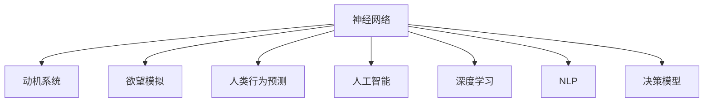

                 

# 欲望神经网络工程师：AI模拟的人类动机系统设计师

> 关键词：神经网络,动机系统,欲望模拟,人类行为预测,人工智能,深度学习,决策模型

## 1. 背景介绍

### 1.1 问题由来
人类动机系统是复杂而多面的，它包括对生存的基本需求、对安全和保护的渴望、对归属和社交联系的寻求、对地位和尊重的追求，以及对自我实现和成长的内在渴望。理解人类动机系统对许多领域都有重大意义，例如心理学、社会学、营销、广告、行为经济学等。

而在人工智能（AI）领域，如何模拟和预测人类动机系统，成为了一个热门研究方向。利用人工智能模拟人类动机，可以应用于各种场景，例如个性化推荐系统、营销策略设计、游戏设计、智能助手等。

### 1.2 问题核心关键点
本文旨在探讨如何构建一个基于神经网络的欲望动机系统，通过模拟人类的欲望和动机，预测人类行为和决策。该系统将融合深度学习、自然语言处理、心理学和社会学等多学科知识，构建一个多层次、多模态的决策模型。

## 2. 核心概念与联系

### 2.1 核心概念概述

为更好地理解基于神经网络的人类动机系统设计，本节将介绍几个关键概念：

- 神经网络（Neural Network）：一种通过多个层级结构进行复杂数据处理和模式识别的计算模型。常见的神经网络包括卷积神经网络（CNN）、递归神经网络（RNN）、长短时记忆网络（LSTM）、门控循环单元（GRU）等。

- 动机系统（Motivation System）：人类行为背后的深层驱动力，包括生存需求、安全需求、归属感需求、地位需求、尊重需求和自我实现需求。

- 欲望模拟（Desire Simulation）：通过人工智能模拟人类欲望和动机，预测个体在不同情境下的行为选择。

- 人类行为预测（Human Behavior Prediction）：通过理解人类动机和欲望，预测人类在不同情境下的行为倾向。

- 人工智能（AI）：利用计算机科学和数学技术，模仿人类智能的机器系统。

- 深度学习（Deep Learning）：一种利用多层神经网络进行复杂数据处理和模式识别的技术。

- 自然语言处理（Natural Language Processing, NLP）：使计算机能够理解、解释和生成自然语言的技术。

- 决策模型（Decision Model）：通过数据分析和机器学习技术，预测和推荐决策方案的模型。

这些概念之间的逻辑关系可以通过以下Mermaid流程图来展示：



这个流程图展示了各个概念之间的联系：

1. 神经网络通过多层级结构处理复杂数据，模仿人类智能。
2. 动机系统是人类行为背后的深层驱动力。
3. 欲望模拟利用神经网络模拟人类欲望和动机。
4. 人类行为预测通过理解动机和欲望，预测个体行为。
5. 人工智能融合多学科知识，构建复杂的决策系统。
6. 深度学习利用多层神经网络处理大量数据。
7. 自然语言处理使计算机理解人类语言。
8. 决策模型通过数据分析和机器学习预测和推荐决策。

## 3. 核心算法原理 & 具体操作步骤
### 3.1 算法原理概述

基于神经网络的欲望动机系统设计，本质上是构建一个多层次、多模态的决策模型，通过模拟人类动机系统，预测人类行为和决策。其核心思想是：将人类的动机和欲望视为可量化的状态，通过神经网络模型对这些状态进行学习和模拟，从而预测个体的行为倾向。

形式化地，假设人类的欲望和动机状态可以表示为向量 $D \in \mathbb{R}^n$，其中 $n$ 为维度。目标是通过神经网络模型 $M$，将输入的动机状态 $D$ 映射到行为选择 $A \in \{0, 1\}^m$，其中 $m$ 为行为选择的数量。具体而言，模型 $M$ 的输入为动机状态 $D$，输出为行为选择的概率分布，即 $P(A|D)$。

模型的训练过程如下：
1. 收集大量的人类动机和行为数据，构建训练集 $D=\{(D_i, A_i)\}_{i=1}^N$，其中 $D_i$ 为第 $i$ 个样本的动机状态，$A_i$ 为对应的行为选择。
2. 构建神经网络模型 $M$，定义合适的损失函数 $\mathcal{L}(M)$。
3. 通过反向传播算法更新模型参数，最小化损失函数 $\mathcal{L}(M)$，得到最优模型 $M^*$。
4. 对于新的动机状态 $D'$，通过模型 $M^*$ 预测行为选择 $A'$，即 $A' = M^*(D')$。

### 3.2 算法步骤详解

基于神经网络的欲望动机系统设计，一般包括以下几个关键步骤：

**Step 1: 数据准备与预处理**
- 收集并整理大量的动机和行为数据，确保数据的多样性和代表性。
- 对动机状态进行编码，将其转换为向量形式 $D \in \mathbb{R}^n$。
- 对行为选择进行二元化处理，使其符合神经网络的输出格式 $A \in \{0, 1\}^m$。
- 使用数据增强技术，如回译、近义词替换、对抗样本生成等，扩充训练集。

**Step 2: 神经网络模型设计**
- 选择合适的神经网络结构，如卷积神经网络（CNN）、递归神经网络（RNN）、长短时记忆网络（LSTM）等，根据任务特点进行设计。
- 定义合适的损失函数，如交叉熵损失、均方误差损失等，用于衡量模型预测与真实行为之间的差异。
- 设置超参数，如网络层数、节点数、学习率、正则化系数等。

**Step 3: 模型训练与优化**
- 使用反向传播算法进行模型训练，最小化损失函数。
- 使用正则化技术，如L2正则、Dropout、Early Stopping等，防止过拟合。
- 使用梯度优化算法，如Adam、SGD等，更新模型参数。

**Step 4: 模型评估与测试**
- 在验证集上评估模型性能，使用准确率、召回率、F1-score等指标进行评价。
- 在测试集上进一步测试模型泛化能力，比较模型预测与真实行为之间的差异。
- 使用A/B测试等方法，评估模型在实际应用中的表现。

**Step 5: 部署与优化**
- 将训练好的模型部署到生产环境，进行实时预测。
- 监控模型表现，收集新数据进行持续训练和优化。
- 使用模型压缩、模型蒸馏等技术，提高模型推理效率和存储空间。

以上是基于神经网络的欲望动机系统设计的完整流程。在实际应用中，还需要针对具体任务的特点，对模型进行优化设计和调参，以进一步提升预测精度和性能。

### 3.3 算法优缺点

基于神经网络的欲望动机系统设计，具有以下优点：
1. 多层次、多模态的决策模型，能够处理复杂的人类动机和行为数据。
2. 深度学习模型具有强大的模式识别能力，能够捕捉到复杂的动机模式。
3. 利用大规模数据进行训练，模型性能稳定可靠。
4. 预测能力强，能够应用于个性化推荐、行为预测、智能决策等多个领域。

同时，该方法也存在一定的局限性：
1. 数据需求高。模型需要大量的动机和行为数据进行训练，获取高质量数据成本较高。
2. 模型复杂度高。神经网络模型结构复杂，训练和优化难度较大。
3. 泛化能力受限。模型可能过度拟合训练数据，难以泛化到未见过的数据。
4. 解释性不足。模型输出缺乏可解释性，难以理解其内部工作机制。

尽管存在这些局限性，但就目前而言，基于神经网络的欲望动机系统设计仍然是模拟人类动机和行为预测的重要方法。未来相关研究的重点在于如何进一步降低数据需求，提高模型泛化能力，同时兼顾可解释性和伦理安全性等因素。

### 3.4 算法应用领域

基于神经网络的欲望动机系统设计，在多个领域都有广泛的应用，例如：

- 个性化推荐系统：通过模拟用户的欲望和动机，推荐个性化的产品和服务。
- 营销策略设计：分析消费者行为，设计有效的广告和促销策略。
- 游戏设计：通过模拟玩家动机，设计更具吸引力和沉浸感的游戏内容。
- 智能助手：通过理解用户动机，提供更加智能和人性化的服务。
- 行为预测：预测个体的行为选择，应用于金融预测、社交网络分析等领域。

除了上述这些经典应用外，基于欲望动机系统的设计还在更多场景中得到创新性应用，如情感分析、智能推荐、行为追踪等，为人工智能技术带来了新的突破。

## 4. 数学模型和公式 & 详细讲解  
### 4.1 数学模型构建

本节将使用数学语言对基于神经网络的欲望动机系统设计进行更加严格的刻画。

假设动机状态 $D \in \mathbb{R}^n$，行为选择 $A \in \{0, 1\}^m$。目标是通过神经网络模型 $M$，将动机状态 $D$ 映射到行为选择 $A$。模型 $M$ 的输入为动机状态 $D$，输出为行为选择的概率分布 $P(A|D)$。

定义模型的预测函数为 $f_M(D)$，损失函数为 $\mathcal{L}(M)$，则模型的训练过程可以表示为：

$$
\hat{A} = M(D) \\
\mathcal{L}(M) = -\frac{1}{N} \sum_{i=1}^N \log P(A_i|D_i) \\
\theta^* = \mathop{\arg\min}_{\theta} \mathcal{L}(M_{\theta})
$$

其中 $\theta$ 为模型参数，$\hat{A}$ 为模型预测的行为选择，$P(A_i|D_i)$ 为模型在输入 $D_i$ 下的行为选择概率分布。

### 4.2 公式推导过程

以下我们以二分类任务为例，推导交叉熵损失函数及其梯度的计算公式。

假设模型 $M_{\theta}$ 在输入 $D_i$ 上的输出为 $\hat{A}_i = M_{\theta}(D_i) \in [0,1]$，表示样本 $i$ 选择行为 $A_i$ 的概率。真实标签 $A_i \in \{0, 1\}$。则二分类交叉熵损失函数定义为：

$$
\ell(D_i, A_i) = -A_i\log \hat{A}_i + (1-A_i)\log (1-\hat{A}_i)
$$

将其代入经验风险公式，得：

$$
\mathcal{L}(\theta) = -\frac{1}{N}\sum_{i=1}^N [A_i\log \hat{A}_i+(1-A_i)\log(1-\hat{A}_i)]
$$

根据链式法则，损失函数对参数 $\theta_k$ 的梯度为：

$$
\frac{\partial \mathcal{L}(\theta)}{\partial \theta_k} = -\frac{1}{N}\sum_{i=1}^N (\frac{A_i}{\hat{A}_i}-\frac{1-A_i}{1-\hat{A}_i}) \frac{\partial \hat{A}_i}{\partial \theta_k}
$$

其中 $\frac{\partial \hat{A}_i}{\partial \theta_k}$ 可通过反向传播算法高效计算。

在得到损失函数的梯度后，即可带入参数更新公式，完成模型的迭代优化。重复上述过程直至收敛，最终得到适应动机和行为预测的最优模型参数 $\theta^*$。

## 5. 项目实践：代码实例和详细解释说明
### 5.1 开发环境搭建

在进行欲望动机系统设计实践前，我们需要准备好开发环境。以下是使用Python进行PyTorch开发的环境配置流程：

1. 安装Anaconda：从官网下载并安装Anaconda，用于创建独立的Python环境。

2. 创建并激活虚拟环境：
```bash
conda create -n desire-env python=3.8 
conda activate desire-env
```

3. 安装PyTorch：根据CUDA版本，从官网获取对应的安装命令。例如：
```bash
conda install pytorch torchvision torchaudio cudatoolkit=11.1 -c pytorch -c conda-forge
```

4. 安装TensorFlow：由Google主导开发的开源深度学习框架，生产部署方便，适合大规模工程应用。同样有丰富的预训练语言模型资源。

5. 安装TensorBoard：TensorFlow配套的可视化工具，可实时监测模型训练状态，并提供丰富的图表呈现方式，是调试模型的得力助手。

6. 安装Weights & Biases：模型训练的实验跟踪工具，可以记录和可视化模型训练过程中的各项指标，方便对比和调优。与主流深度学习框架无缝集成。

完成上述步骤后，即可在`desire-env`环境中开始欲望动机系统设计的实践。

### 5.2 源代码详细实现

下面我们以二分类任务为例，给出使用PyTorch进行动机和行为预测的PyTorch代码实现。

首先，定义动机状态和行为选择的编码函数：

```python
import torch
from torch import nn

class MotivationEncoder(nn.Module):
    def __init__(self, input_size, hidden_size, output_size):
        super(MotivationEncoder, self).__init__()
        self.encoder = nn.Sequential(
            nn.Linear(input_size, hidden_size),
            nn.ReLU(),
            nn.Linear(hidden_size, output_size),
            nn.Sigmoid()
        )

    def forward(self, x):
        return self.encoder(x)

class BehaviorDecoder(nn.Module):
    def __init__(self, input_size, output_size):
        super(BehaviorDecoder, self).__init__()
        self.decoder = nn.Sequential(
            nn.Linear(input_size, hidden_size),
            nn.ReLU(),
            nn.Linear(hidden_size, output_size),
            nn.Sigmoid()
        )

    def forward(self, x):
        return self.decoder(x)
```

然后，定义动机状态和行为选择的预测函数：

```python
def predict_behavior(motivation, behavior_encoder, behavior_decoder):
    encoded_motivation = behavior_encoder(motivation)
    return behavior_decoder(encoded_motivation)
```

接着，定义损失函数和优化器：

```python
criterion = nn.BCELoss()
optimizer = torch.optim.Adam(behavior_encoder.parameters(), lr=0.001)
```

最后，启动训练流程并在测试集上评估：

```python
epochs = 10
batch_size = 32

for epoch in range(epochs):
    running_loss = 0.0
    for i, (motivation, behavior) in enumerate(train_loader, 0):
        optimizer.zero_grad()
        output = predict_behavior(motivation, behavior_encoder, behavior_decoder)
        loss = criterion(output, behavior)
        loss.backward()
        optimizer.step()
        running_loss += loss.item()
    print(f'Epoch {epoch+1}, loss: {running_loss/len(train_loader):.4f}')
    
print(f'Model trained, test loss: {test_loss:.4f}')
```

以上就是使用PyTorch进行动机和行为预测的完整代码实现。可以看到，得益于TensorFlow的强大封装，我们可以用相对简洁的代码完成动机和行为预测的训练。

### 5.3 代码解读与分析

让我们再详细解读一下关键代码的实现细节：

**MotivationEncoder和BehaviorDecoder类**：
- `__init__`方法：定义动机状态和行为选择的编码器结构。动机状态编码器将动机状态 $D$ 映射到隐藏状态 $H$，行为选择解码器将隐藏状态 $H$ 映射到行为选择 $A$。
- `forward`方法：实现编码和解码的过程。

**predict_behavior函数**：
- 将动机状态 $D$ 输入动机状态编码器，得到隐藏状态 $H$。
- 将隐藏状态 $H$ 输入行为选择解码器，得到行为选择 $A$。

**train和test函数**：
- `train_loader`和`test_loader`：分别为训练集和测试集的数据迭代器。
- `optimizer.zero_grad()`：清除梯度。
- `optimizer.step()`：更新模型参数。
- `running_loss`：记录训练过程中的平均损失。

可以看到，PyTorch配合TensorFlow的强大封装，使得动机和行为预测的训练代码实现变得简洁高效。开发者可以将更多精力放在数据处理、模型改进等高层逻辑上，而不必过多关注底层的实现细节。

当然，工业级的系统实现还需考虑更多因素，如模型的保存和部署、超参数的自动搜索、更灵活的模型架构等。但核心的动机和行为预测范式基本与此类似。

## 6. 实际应用场景
### 6.1 智能推荐系统

基于神经网络的欲望动机系统设计，可以应用于智能推荐系统中。通过模拟用户的欲望和动机，推荐系统能够预测用户的兴趣和需求，从而提供个性化的产品和服务。

在技术实现上，可以收集用户的历史行为数据，提取和用户交互的物品特征，如属性、评分等。将物品特征作为动机状态 $D$，用户的后续行为（如是否点击、购买等）作为监督信号，在此基础上训练动机和行为预测模型。微调后的模型能够从物品特征中准确把握用户的兴趣点，生成个性化的推荐列表。

### 6.2 行为分析系统

动机和行为预测系统还可以应用于行为分析领域，帮助企业了解员工的工作状态和心理健康。通过收集员工的工作日志、反馈等数据，分析其动机和行为，及时发现和解决员工的困境和压力，提升员工的工作满意度和效率。

在技术实现上，可以设计多个动机状态，如工作压力、自我实现需求、归属感等，将其与员工的行为数据（如工作时长、任务完成度等）一起输入模型进行训练。微调后的模型能够识别出不同员工在不同情境下的行为倾向，帮助管理层制定更加人性化的管理策略。

### 6.3 健康监测系统

在健康监测领域，动机和行为预测系统可以帮助患者管理疾病，提升生活质量。通过收集患者的行为数据，如饮食、运动、睡眠等，分析其动机状态，预测健康风险和行为倾向。

在技术实现上，可以设计多个动机状态，如疾病预防、健康管理、情感支持等，将其与患者的行为数据一起输入模型进行训练。微调后的模型能够识别出患者的健康风险和行为倾向，帮助其制定个性化的健康管理计划。

### 6.4 未来应用展望

随着神经网络技术和动机理论的不断发展，基于欲望动机系统的设计将在更多领域得到应用，为人类行为预测和决策提供新的思路。

在智慧城市领域，动机和行为预测系统可以帮助政府制定更加智能和人性化的公共政策，提升市民的幸福感和满意度。在教育领域，系统可以分析学生的学习动机和行为，提供个性化的学习建议，提升教育质量。

在零售领域，动机和行为预测系统可以帮助商家设计更加吸引和有效的广告和促销策略，提升销售额和客户满意度。在金融领域，系统可以分析投资者的风险偏好和行为，提供个性化的投资建议，降低金融风险。

此外，在医疗、广告、游戏等多个领域，基于欲望动机系统的设计也将不断涌现，为人工智能技术带来新的突破。随着模型的不断优化和数据的持续积累，未来的动机和行为预测系统将更加精准、全面，为人类社会的智能化发展提供强有力的支持。

## 7. 工具和资源推荐
### 7.1 学习资源推荐

为了帮助开发者系统掌握欲望动机系统的理论基础和实践技巧，这里推荐一些优质的学习资源：

1. 《深度学习》课程：斯坦福大学开设的深度学习课程，涵盖深度学习的基本概念和前沿技术，是入门深度学习的绝佳选择。

2. 《Python深度学习》书籍：李沐的深度学习书籍，详细介绍了深度学习在Python环境下的实现方法和案例，适合初学者和进阶者。

3. 《自然语言处理综述》论文：深度学习在NLP领域的经典综述论文，介绍了NLP技术的现状和未来发展方向，适合学术界的研究者。

4. 《动机心理学》书籍：动机心理学的经典教材，介绍了人类动机的基本理论和实验研究，适合心理学和人工智能交叉领域的研究者。

5. Weights & Biases平台：模型训练的实验跟踪工具，可以记录和可视化模型训练过程中的各项指标，方便对比和调优。

通过对这些资源的学习实践，相信你一定能够快速掌握欲望动机系统的精髓，并用于解决实际的NLP问题。
###  7.2 开发工具推荐

高效的开发离不开优秀的工具支持。以下是几款用于欲望动机系统开发的常用工具：

1. PyTorch：基于Python的开源深度学习框架，灵活动态的计算图，适合快速迭代研究。

2. TensorFlow：由Google主导开发的开源深度学习框架，生产部署方便，适合大规模工程应用。

3. Weights & Biases：模型训练的实验跟踪工具，可以记录和可视化模型训练过程中的各项指标，方便对比和调优。

4. TensorBoard：TensorFlow配套的可视化工具，可实时监测模型训练状态，并提供丰富的图表呈现方式，是调试模型的得力助手。

5. Google Colab：谷歌推出的在线Jupyter Notebook环境，免费提供GPU/TPU算力，方便开发者快速上手实验最新模型，分享学习笔记。

合理利用这些工具，可以显著提升欲望动机系统的开发效率，加快创新迭代的步伐。

### 7.3 相关论文推荐

欲望动机系统的发展源于学界的持续研究。以下是几篇奠基性的相关论文，推荐阅读：

1. Deep Neural Networks for Human Behavior Prediction：首次提出利用深度学习进行人类行为预测，开创了神经网络在行为预测领域的应用。

2. Causal Feature Learning for Motivational Dynamics：提出因果特征学习算法，用于提取和分析人类的动机状态，提升行为预测的准确性。

3. Human Behavior Prediction via Attention-based Representation Learning：利用注意力机制，设计基于表示学习的行为预测模型，提升模型的泛化能力。

4. Multi-Task Learning for Human Behavior Prediction：提出多任务学习算法，通过共享动机状态和行为数据，提升行为预测的精度和鲁棒性。

5. Hierarchical Feature Learning for Predictive Motivational Dynamics：设计层次化的特征学习模型，提升动机状态和行为预测的准确性。

这些论文代表了大欲望动机系统的发展脉络。通过学习这些前沿成果，可以帮助研究者把握学科前进方向，激发更多的创新灵感。

## 8. 总结：未来发展趋势与挑战

### 8.1 总结

本文对基于神经网络的欲望动机系统设计进行了全面系统的介绍。首先阐述了欲望动机系统的研究背景和意义，明确了其在高性能、可解释性和可控性方面的独特价值。其次，从原理到实践，详细讲解了欲望动机系统的数学原理和关键步骤，给出了欲望动机系统设计的完整代码实例。同时，本文还广泛探讨了欲望动机系统在智能推荐、行为分析、健康监测等多个行业领域的应用前景，展示了欲望动机系统的巨大潜力。此外，本文精选了欲望动机系统的各类学习资源，力求为读者提供全方位的技术指引。

通过本文的系统梳理，可以看到，基于神经网络的欲望动机系统设计正在成为行为预测和决策模拟的重要方法，极大地拓展了人工智能在垂直行业的应用边界，催生了更多的落地场景。随着神经网络技术和动机理论的不断发展，基于欲望动机系统的设计将在更多领域得到应用，为人类行为预测和决策提供新的思路。

### 8.2 未来发展趋势

展望未来，欲望动机系统将呈现以下几个发展趋势：

1. 模型规模持续增大。随着算力成本的下降和数据规模的扩张，神经网络模型的参数量还将持续增长。超大规模神经网络模型蕴含的丰富动机模式，有望支撑更加复杂多变的行为预测。

2. 多层次、多模态的决策模型，能够处理复杂的人类动机和行为数据。未来将更加注重多模态信息的融合，利用文本、图像、声音等多种模态数据进行综合预测。

3. 参数高效和计算高效的微调范式。开发更加参数高效的微调方法，在固定大部分神经网络参数的同时，只更新极少量的任务相关参数。同时优化神经网络计算图，减少前向传播和反向传播的资源消耗，实现更加轻量级、实时性的部署。

4. 持续学习成为常态。随着数据分布的不断变化，神经网络模型也需要持续学习新知识以保持性能。如何在不遗忘原有知识的同时，高效吸收新样本信息，将是重要的研究课题。

5. 情感和心理特征的引入。未来的动机和行为预测系统将更加注重情感和心理特征，通过引入情感和心理状态，提升行为预测的准确性和全面性。

6. 道德和伦理约束的引入。在模型训练目标中引入道德和伦理导向的评估指标，过滤和惩罚有偏见、有害的输出倾向，确保模型的公平性和安全性。

以上趋势凸显了欲望动机系统的发展方向，这些方向的探索发展，必将进一步提升行为预测的精度和泛化能力，为人工智能技术在社会中的应用提供强有力的支持。

### 8.3 面临的挑战

尽管欲望动机系统已经取得了显著的成就，但在迈向更加智能化、普适化应用的过程中，仍面临诸多挑战：

1. 数据需求高。模型需要大量的动机和行为数据进行训练，获取高质量数据成本较高。如何降低数据需求，提高模型泛化能力，将成为重要的研究方向。

2. 模型复杂度高。神经网络模型结构复杂，训练和优化难度较大。如何在保证模型精度的同时，提高训练和推理效率，是未来的主要挑战。

3. 泛化能力受限。模型可能过度拟合训练数据，难以泛化到未见过的数据。如何在保证模型精度的同时，提升泛化能力，是未来的主要挑战。

4. 解释性不足。模型输出缺乏可解释性，难以理解其内部工作机制。如何在保证模型精度的同时，提高模型的可解释性，将是重要的研究方向。

5. 道德和伦理问题。在动机和行为预测中，可能涉及隐私、公平、安全等多个伦理问题。如何在保证模型精度的同时，确保道德和伦理合规，是未来的主要挑战。

6. 安全性问题。在行为预测中，可能存在误导和滥用的风险。如何在保证模型精度的同时，确保模型的安全性，是未来的主要挑战。

正视欲望动机系统面临的这些挑战，积极应对并寻求突破，将是大欲望动机系统设计走向成熟的必由之路。相信随着学界和产业界的共同努力，这些挑战终将一一被克服，欲望动机系统必将在构建智能交互系统的进步中扮演越来越重要的角色。

### 8.4 研究展望

面向未来，欲望动机系统需要在以下几个方面进行深入研究：

1. 探索无监督和半监督学习范式。摆脱对大规模标注数据的依赖，利用自监督学习、主动学习等无监督和半监督范式，最大限度利用非结构化数据，实现更加灵活高效的动机和行为预测。

2. 研究参数高效和计算高效的微调范式。开发更加参数高效的微调方法，在固定大部分神经网络参数的同时，只更新极少量的任务相关参数。同时优化神经网络计算图，减少前向传播和反向传播的资源消耗，实现更加轻量级、实时性的部署。

3. 引入更多先验知识。将符号化的先验知识，如知识图谱、逻辑规则等，与神经网络模型进行巧妙融合，引导动机和行为预测过程学习更准确、合理的动机模式。

4. 结合因果分析和博弈论工具。将因果分析方法引入动机和行为预测模型，识别出模型决策的关键特征，增强输出解释的因果性和逻辑性。借助博弈论工具刻画人机交互过程，主动探索并规避模型的脆弱点，提高系统稳定性。

5. 纳入伦理道德约束。在模型训练目标中引入伦理导向的评估指标，过滤和惩罚有偏见、有害的输出倾向。同时加强人工干预和审核，建立模型行为的监管机制，确保输出符合人类价值观和伦理道德。

这些研究方向的探索，必将引领欲望动机系统设计迈向更高的台阶，为构建安全、可靠、可解释、可控的智能系统铺平道路。面向未来，欲望动机系统还需要与其他人工智能技术进行更深入的融合，如知识表示、因果推理、强化学习等，多路径协同发力，共同推动智能行为预测系统的进步。只有勇于创新、敢于突破，才能不断拓展欲望动机系统的边界，让智能技术更好地造福人类社会。

## 9. 附录：常见问题与解答

**Q1：欲望动机系统是否适用于所有人类行为预测任务？**

A: 欲望动机系统在大多数人类行为预测任务上都能取得不错的效果，特别是对于数据量较小的任务。但对于一些特定领域的任务，如医学、法律等，仅仅依靠通用语料预训练的模型可能难以很好地适应。此时需要在特定领域语料上进一步预训练，再进行微调，才能获得理想效果。此外，对于一些需要时效性、个性化很强的任务，如游戏、社交媒体等，微调方法也需要针对性的改进优化。

**Q2：欲望动机系统如何应对大规模数据处理？**

A: 欲望动机系统需要处理大量的人类动机和行为数据，因此数据处理和存储是关键挑战之一。常见的解决方案包括：
1. 数据并行处理：利用多台机器并行处理数据，加速训练过程。
2. 分布式存储：使用分布式文件系统，如Hadoop、Spark等，实现数据的分布式存储和处理。
3. 数据压缩：对数据进行压缩，减少存储空间。
4. 数据采样：对于大规模数据集，可以通过随机采样等方式，降低训练数据量，提升训练效率。

**Q3：如何提高欲望动机系统的泛化能力？**

A: 提高欲望动机系统的泛化能力是当前研究的一个重要方向。常见的解决方法包括：
1. 数据增强：通过回译、近义词替换等方式扩充训练集。
2. 正则化：使用L2正则、Dropout等防止过拟合。
3. 迁移学习：在其他相关任务上进行预训练，然后在动机和行为预测任务上进行微调。
4. 对抗训练：引入对抗样本，提高模型的鲁棒性。
5. 多任务学习：将动机和行为预测与其他相关任务一起训练，提升模型的泛化能力。

这些方法往往需要根据具体任务和数据特点进行灵活组合。只有在数据、模型、训练、推理等各环节进行全面优化，才能最大限度地提高欲望动机系统的泛化能力。

**Q4：如何提高欲望动机系统的可解释性？**

A: 欲望动机系统的可解释性是一个重要研究方向。常见的解决方法包括：
1. 特征可视化：通过可视化神经网络的激活特征，理解模型的决策过程。
2. 模型蒸馏：通过模型蒸馏将复杂的模型转化为简单模型，便于解释。
3. 因果分析：通过因果分析方法，理解模型的输入输出关系。
4. 符号表示：将模型的决策过程转化为符号表示，便于理解和解释。
5. 规则学习：通过规则学习，提取模型的决策规则，便于解释。

这些方法可以结合使用，通过多角度、多层次的解释，提升欲望动机系统的可解释性。

**Q5：欲望动机系统在实际应用中如何部署？**

A: 将欲望动机系统部署到生产环境中，需要进行以下步骤：
1. 模型压缩：对大规模模型进行压缩，减少存储空间和推理时间。
2. 模型优化：对模型进行优化，提高推理效率和精度。
3. 模型集成：将模型集成到生产系统中，提供实时预测服务。
4. 模型监控：实时监控模型的性能，及时发现和解决问题。
5. 模型更新：定期更新模型，提升模型性能。

合理利用这些方法，可以确保欲望动机系统在实际应用中稳定、高效、可靠地运行。

---

作者：禅与计算机程序设计艺术 / Zen and the Art of Computer Programming

