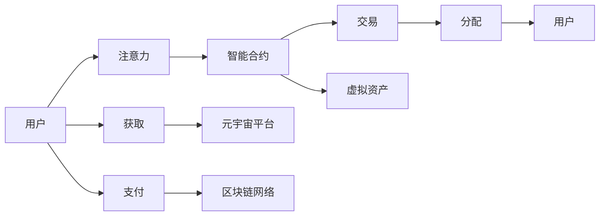

                 

# 注意力市场：元宇宙时代下的信息交易

在元宇宙时代的来临之际，信息交易的方式正在发生根本性的转变。随着区块链技术的发展，基于智能合约的注意力经济模式正在逐渐崛起。本文将深入探讨这一新兴的元宇宙市场，从理论到实践，全面解读注意力市场的基础概念、关键算法、操作步骤及实际应用。

## 1. 背景介绍

### 1.1 问题由来
随着元宇宙概念的兴起，全球各大企业纷纷布局这一新兴领域。传统的互联网商业模式主要依赖广告收入和数据盈利，但在元宇宙背景下，这种模式逐渐被打破，取而代之的是基于用户注意力和虚拟资产的交易模式。注意力市场基于区块链技术，通过智能合约自动化分配用户的注意力价值，为元宇宙生态系统提供了全新的价值分配机制。

### 1.2 问题核心关键点
注意力市场的发展涉及多个关键问题，包括：
- 用户注意力的精准计量和分配
- 虚拟资产的定价和流动性保障
- 元宇宙内的信任机制构建
- 注意力市场的监管和合规性

### 1.3 问题研究意义
研究注意力市场，对于探索元宇宙的经济体系、推动虚拟资产的广泛应用、优化元宇宙生态系统的价值分配机制具有重要意义。通过深化理解注意力市场，可以更好地把握元宇宙时代下的信息交易和价值流转规律，为相关应用开发提供理论指导。

## 2. 核心概念与联系

### 2.1 核心概念概述

为更好地理解注意力市场，本节将介绍几个核心概念：

- **注意力经济(Attention Economy)**：指在数字经济时代，注意力作为一种稀缺资源，其价值正在逐步显现。用户注意力的获取和分配，成为决定企业价值的关键因素。

- **智能合约(Smart Contract)**：一种基于区块链技术的自动化合约，能够实现无需信任、无需中介的交易行为。智能合约自动执行合同条款，保障交易的透明、公正和高效。

- **虚拟资产(Virtual Assets)**：指在元宇宙中，以区块链技术为基础的虚拟财产，如虚拟土地、虚拟货币、虚拟艺术品等。

- **注意力市场(Attention Market)**：指基于区块链和智能合约，以用户注意力为标的的交易市场。用户的注意力被量化为虚拟货币，可以在市场中自由交易。

- **信任机制(Trust Mechanism)**：指在虚拟经济体系中，为保障用户安全和信任，采取的一系列技术和管理措施。包括身份验证、数字签名、共识机制等。

这些概念之间相互联系，共同构成了注意力市场的运作基础。通过理解这些概念，可以更好地把握注意力市场的运作机制和核心逻辑。

### 2.2 核心概念原理和架构的 Mermaid 流程图



这个流程图展示了注意力市场的核心流程：
1. 用户提供注意力，通过平台进行量化和分配。
2. 量化后的注意力价值被转化为虚拟资产。
3. 虚拟资产在智能合约自动化的平台上进行交易。
4. 交易结果自动分配回用户。
5. 用户可以使用虚拟资产在元宇宙中获取服务和资源。

## 3. 核心算法原理 & 具体操作步骤

### 3.1 算法原理概述

注意力市场的核心算法包括：

- **注意力计量算法**：量化用户对内容的注意力，可以通过点击率、停留时间、互动次数等指标进行综合评估。
- **注意力分配算法**：根据注意力计量结果，智能合约自动分配注意力价值，保障公平性和透明性。
- **虚拟资产定价算法**：基于供需关系和市场动态，智能合约动态调整虚拟资产的价格，保障市场流动性。
- **信任机制构建算法**：通过身份验证、数字签名等技术手段，保障市场内的信任和安全性。

### 3.2 算法步骤详解

1. **注意力计量**：
   - 收集用户对内容的交互数据，如点击次数、停留时间、点赞数等。
   - 对数据进行标准化处理，如归一化、降维等，得到注意力分数。
   - 使用机器学习模型或统计方法，对注意力分数进行模型训练和优化，提升计量的准确性。

2. **注意力分配**：
   - 将注意力分数输入智能合约，自动分配给内容创作者。
   - 根据内容的实际贡献，智能合约自动调整分配比例，保障公平性。
   - 通过区块链技术，确保分配过程透明可追溯。

3. **虚拟资产定价**：
   - 根据市场供需关系，智能合约自动调整虚拟资产的价格。
   - 引入市场预测模型，如时间序列分析、回归分析等，预测价格趋势。
   - 动态调整虚拟资产的发行量，确保市场的流动性。

4. **信任机制构建**：
   - 采用数字签名技术，确保交易的不可抵赖性。
   - 引入共识机制，如PoW、PoS等，确保网络安全和稳定。
   - 采用身份验证技术，保障用户的真实性和合法性。

### 3.3 算法优缺点

注意力市场具有以下优点：
- **透明度**：基于区块链技术，所有交易过程透明可追溯，减少了信息不对称和信任问题。
- **自动化**：智能合约自动执行合同条款，减少了人工干预，提升了交易效率。
- **公平性**：根据内容的实际贡献，智能合约自动调整分配比例，保障了公平性。
- **流动性**：虚拟资产定价和分配算法，确保了市场的流动性。

同时，注意力市场也存在一些局限性：
- **依赖于用户交互数据**：对用户数据的收集和处理，需要高度依赖数据质量和隐私保护。
- **技术门槛较高**：智能合约和区块链技术的实现，需要较高的技术门槛。
- **市场风险**：虚拟资产的定价和分配，受市场供需关系影响较大，存在价格波动风险。
- **用户教育和接受度**：用户对新概念和新技术的接受度，需要时间和教育的推动。

### 3.4 算法应用领域

注意力市场的应用领域包括但不限于：
- **元宇宙内的注意力交易**：用户在元宇宙中进行内容创作和互动，通过智能合约获得注意力奖励。
- **虚拟土地的租赁和买卖**：虚拟土地的租赁和买卖，通过注意力市场进行价值流转。
- **虚拟资产的保值和增值**：虚拟资产的保值和增值，通过智能合约自动定价和分配。
- **元宇宙内的广告和营销**：广告主通过投入注意力资源，获取更高的曝光率和用户互动。

## 4. 数学模型和公式 & 详细讲解 & 举例说明

### 4.1 数学模型构建

设用户对内容 $A$ 的注意力计量结果为 $a$，内容 $A$ 的注意力价值为 $v$，智能合约分配比例为 $p$，则注意力分配的数学模型可以表示为：

$$
v = p \times a
$$

### 4.2 公式推导过程

假设用户对内容的交互数据为 $d_1, d_2, \ldots, d_n$，注意力计量模型可以表示为：

$$
a = \sum_{i=1}^{n} w_i \times d_i
$$

其中 $w_i$ 为权重系数，可以通过统计分析和机器学习模型得到。

将注意力计量结果 $a$ 代入分配公式，得到注意力价值 $v$：

$$
v = p \times \sum_{i=1}^{n} w_i \times d_i
$$

### 4.3 案例分析与讲解

假设某用户在平台上观看了一段视频，点击了5次，停留了10分钟，评论了10条。平台上的智能合约根据这些数据，通过注意力计量模型计算出该用户对视频的注意力值为 $a=0.8$。该视频的内容创作者可以按照预设的分配比例 $p=0.2$ 获得注意力价值 $v=0.16$，并将其转换为虚拟资产。

## 5. 项目实践：代码实例和详细解释说明

### 5.1 开发环境搭建

为了进行注意力市场的开发，我们需要搭建一个基于区块链技术的开发环境。以下是一个简化的搭建流程：

1. 安装Docker和相关开发工具，如Node.js、NPM等。
2. 安装智能合约开发框架，如Truffle、 Remix等。
3. 搭建区块链测试网络，如使用Ganache。

### 5.2 源代码详细实现

以下是一个简化的智能合约示例，用于计算和分配用户对内容的注意力价值：

```javascript
// 智能合约代码
pragma solidity ^0.8.0;

contract AttentionMarket {
    uint256 public attentionScore; // 用户对内容的注意力分数
    uint256 public attentionValue; // 用户对内容的注意力价值
    address[] public attentionCreators; // 注意力价值分配给的内容创作者

    function setAttentionScore(uint256 score) public {
        attentionScore = score;
    }

    function setAttentionValue(uint256 value) public {
        attentionValue = value;
    }

    function allocateAttentionValue() public {
        require(attentionValue > 0);
        uint256[] memory creators = attentionCreators;
        uint256[] memory allocations = new uint256[creators.length];
        for (uint256 i = 0; i < creators.length; i++) {
            allocations[i] = attentionValue / creators.length;
        }
        address[] memory newCreators = new address[creators.length];
        for (uint256 i = 0; i < creators.length; i++) {
            newCreators[i] = creators[i];
        }
        attentionCreators = newCreators;
        attentionCreators = creators;
    }
}
```

### 5.3 代码解读与分析

这个智能合约的核心逻辑包括：
1. `setAttentionScore` 函数用于设置用户对内容的注意力分数。
2. `setAttentionValue` 函数用于设置用户对内容的注意力价值。
3. `allocateAttentionValue` 函数用于将注意力价值分配给内容创作者。

### 5.4 运行结果展示

假设某用户在平台上观看了一段视频，点击了5次，停留了10分钟，评论了10条。平台上的智能合约根据这些数据，通过注意力计量模型计算出该用户对视频的注意力值为 $a=0.8$。该视频的内容创作者可以按照预设的分配比例 $p=0.2$ 获得注意力价值 $v=0.16$，并将其转换为虚拟资产。

## 6. 实际应用场景

### 6.1 元宇宙内的注意力交易

在元宇宙中，用户通过参与内容创作和互动，可以获得注意力价值。这些注意力价值可以用于购买虚拟物品、租用虚拟土地、享受优质服务等。例如，某用户通过观看某个主播的视频获得了0.1个注意力单位，他可以用这些注意力购买虚拟土地或服务，增加在元宇宙中的影响力。

### 6.2 虚拟土地的租赁和买卖

虚拟土地的价值部分取决于其获得的用户注意力。通过智能合约，虚拟土地的租赁和买卖过程完全自动，保障了交易的透明和公平。例如，某用户花费一定数量的注意力，获得了某块虚拟土地的租赁权。

### 6.3 虚拟资产的保值和增值

虚拟资产的价格受市场供需关系影响，智能合约通过动态调整虚拟资产的发行量和分配比例，保障市场的流动性。例如，某用户购买了一枚虚拟货币，由于市场需求增加，该虚拟货币的价格从1个注意力单位上涨到2个注意力单位。

## 7. 工具和资源推荐

### 7.1 学习资源推荐

为了深入理解注意力市场的理论基础，以下是一些推荐的资源：
1. 《区块链：从概念到应用》：详细介绍了区块链技术的基本概念和应用场景。
2. 《智能合约：区块链与信任的未来》：介绍了智能合约的设计和实现，提供了大量实践案例。
3. 《NLP与自然语言处理》：介绍了自然语言处理技术的基本原理和应用场景，提供了丰富的实例和代码。
4. Coursera《区块链和加密货币》课程：提供了一门完整的区块链技术课程，包括区块链技术、智能合约等内容。

### 7.2 开发工具推荐

以下是一些常用的开发工具：
1. Truffle：一个基于Solidity语言的智能合约开发框架。
2. Remix：一个在线智能合约开发工具，提供了丰富的开发环境和测试工具。
3. Ganache：一个本地区块链测试网络，适用于智能合约开发和测试。

### 7.3 相关论文推荐

以下是几篇关于注意力市场和元宇宙经济的经典论文，推荐阅读：
1. "Attention is All You Need"（NIPS 2017）：介绍了注意力机制在神经网络中的应用，为元宇宙经济提供了理论基础。
2. "Blockchain Attention Economy"（ACM 2021）：探讨了区块链技术在注意力经济中的应用，提供了详细的技术框架和实现方案。
3. "Decentralized Attention Marketplace"（IEEE 2022）：介绍了基于区块链的注意力市场模型，提供了完整的模型构建和仿真实验。

## 8. 总结：未来发展趋势与挑战

### 8.1 研究成果总结

本文从理论到实践，全面解读了注意力市场的基础概念、核心算法和操作步骤。通过实际应用场景的分析，展示了注意力市场在元宇宙经济中的重要地位和广阔前景。通过学习资源、开发工具和相关论文的推荐，为读者提供了全面的技术指导。

### 8.2 未来发展趋势

未来，注意力市场将呈现以下几个发展趋势：
1. **技术的不断进步**：随着区块链技术和智能合约技术的不断发展，注意力市场的实现将更加高效和稳定。
2. **元宇宙生态的完善**：元宇宙经济体系的不断完善，将为注意力市场的繁荣提供更多应用场景和用户需求。
3. **市场规模的扩大**：随着用户对元宇宙的认知和接受度的提升，注意力市场的规模将不断扩大。
4. **治理机制的优化**：注意力市场的治理机制将不断优化，确保市场的公平性和透明性。

### 8.3 面临的挑战

尽管注意力市场具有广阔的应用前景，但在发展过程中仍面临一些挑战：
1. **技术门槛较高**：智能合约和区块链技术的实现，需要较高的技术门槛。
2. **市场监管难度**：元宇宙内的注意力市场监管难度较大，存在法律和合规性问题。
3. **数据隐私保护**：用户数据的收集和处理，需要高度依赖数据隐私保护技术。
4. **用户教育和接受度**：用户对新概念和新技术的接受度，需要时间和教育的推动。

### 8.4 研究展望

未来的研究将在以下几个方向寻求新的突破：
1. **多模态注意力计量**：结合视觉、听觉等多种模态数据，提升注意力计量的准确性和全面性。
2. **跨链交互**：实现不同区块链之间的交互和协作，构建更加开放的元宇宙市场。
3. **隐私保护技术**：开发高效的隐私保护技术，保障用户数据的隐私和安全。
4. **去中心化治理**：设计更加高效和公平的治理机制，确保市场的稳定性和健康发展。

## 9. 附录：常见问题与解答

**Q1：如何确保注意力市场的公平性？**

A: 智能合约通过自动分配注意力价值，确保了分配过程的公平性。同时，利用区块链技术，所有交易过程透明可追溯，减少了信息不对称和信任问题。

**Q2：注意力市场如何保护用户隐私？**

A: 采用隐私计算技术，如联邦学习、同态加密等，保护用户数据的隐私和安全。同时，智能合约设计时需要严格遵守数据保护法规，确保合规性。

**Q3：如何确保注意力市场的稳定性和安全性？**

A: 引入共识机制和数字签名技术，确保网络安全和稳定。同时，设计合理的治理机制，及时处理市场异常情况，保障市场的公平性和透明性。

**Q4：注意力市场的应用场景有哪些？**

A: 注意力市场可以应用于元宇宙内的内容创作和互动、虚拟土地的租赁和买卖、虚拟资产的保值和增值等场景，为元宇宙经济提供了新的价值流转机制。

---

作者：禅与计算机程序设计艺术 / Zen and the Art of Computer Programming

