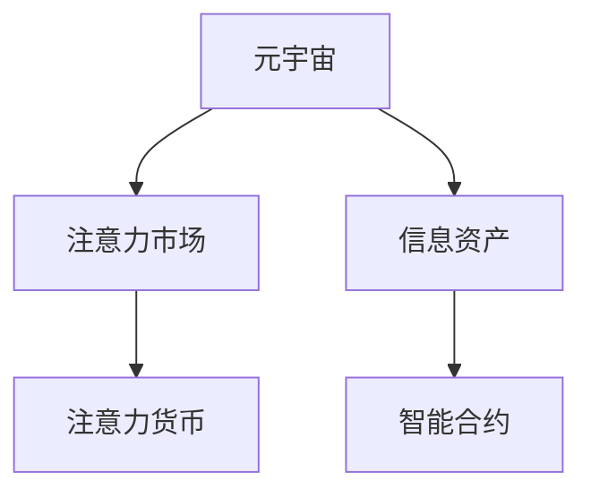

                 

# 注意力市场：元宇宙时代下的信息交易

> 关键词：元宇宙,注意力市场,信息交易,虚拟现实,数字资产,人工智能

## 1. 背景介绍

随着数字技术的迅猛发展，元宇宙（Metaverse）的概念逐渐走入大众视野，并成为未来技术发展的重要趋势。元宇宙是一个以数字形式构建的虚拟世界，其中用户可以互动、交流，并从事各种活动。这种虚拟空间正在改变人们的生活方式，同时也带来了新的经济活动模式和价值创造方式。其中，注意力市场（Attention Economy）便是元宇宙时代下一种新型的信息交易形态。

### 1.1 问题由来

在传统的经济体系中，商品和服务的价值通常基于其实用性和稀缺性。然而，随着数字媒介的普及，信息成为了一种重要的资源。在元宇宙时代，信息的价值进一步放大，成为重要的经济活动主体。如何有效分配和管理这些信息资源，成为了当前研究的重要问题。

### 1.2 问题核心关键点

注意力市场的核心在于如何衡量、分配和管理用户对信息资源（如内容、服务、广告等）的关注度。这些信息资源通过吸引用户的注意力来创造价值，因此如何在元宇宙中构建和运营这种新型的信息市场，是当前研究的重点。

## 2. 核心概念与联系

### 2.1 核心概念概述

为更好地理解元宇宙中的注意力市场，本节将介绍几个核心概念：

- 元宇宙（Metaverse）：以虚拟现实技术为基础，通过网络联结而成的沉浸式数字空间。元宇宙融合了虚拟与现实，为用户提供了丰富的交互体验。

- 注意力经济（Attention Economy）：基于用户注意力而非传统使用价值进行价值分配的新型经济体系。在元宇宙中，信息通过吸引用户的注意力来创造价值。

- 信息资产（Information Assets）：指在元宇宙中可交易的各类信息资源，包括内容、广告、服务、知识等。

- 注意力货币（Attention Currency）：在元宇宙中，用户注意力的流动形成了类似于货币的经济形态，通过奖赏机制、交易市场等方式进行管理。

- 智能合约（Smart Contracts）：一种基于区块链技术的自动执行合约，用于保证交易的透明性、可验证性和安全性。

这些概念构成了元宇宙中注意力市场的基础，共同构建了一种以注意力为核心的新型经济形态。

### 2.2 核心概念原理和架构的 Mermaid 流程图



## 3. 核心算法原理 & 具体操作步骤
### 3.1 算法原理概述

注意力市场的核心算法主要依赖于用户注意力度的测量和分配。以下是对该过程的概述：

1. **注意力测量**：
   - 通过对用户行为（如点击、浏览、互动）进行记录和分析，测量用户对信息资产的关注度。
   - 使用机器学习模型，如神经网络、决策树等，对用户行为进行建模，预测其注意力分布。

2. **注意力分配**：
   - 根据注意力测量结果，对信息资产进行价值评估，确定其市场价格。
   - 使用智能合约自动执行交易，保证交易的透明性、可验证性和安全性。

3. **市场机制**：
   - 构建注意力交易市场，允许信息资产在用户之间进行交换。
   - 设计相应的市场规则，如价格机制、竞价策略、交易费用等，保障市场的公平性和效率。

### 3.2 算法步骤详解

以下是基于注意力市场的核心算法详细步骤：

**Step 1: 用户行为数据收集与预处理**

- 使用数据采集工具，收集用户在元宇宙中的行为数据，包括点击次数、浏览时间、互动频率等。
- 对原始数据进行清洗、去重、归一化等预处理操作，得到高质量的用户行为数据。

**Step 2: 注意力测量模型构建**

- 选择适当的机器学习模型，如随机森林、深度神经网络等，用于构建用户注意力测量模型。
- 使用标记数据集对模型进行训练，使其能够准确预测用户对不同信息资产的关注度。

**Step 3: 注意力价值评估与定价**

- 根据模型预测的用户注意力度，对信息资产进行价值评估，确定其市场价格。
- 使用智能合约自动执行交易，确保交易的透明性和可验证性。

**Step 4: 注意力市场构建与运营**

- 建立注意力市场平台，允许用户进行信息资产的交易。
- 设计市场规则，如交易费用、竞价策略等，确保市场的公平性和效率。

### 3.3 算法优缺点

注意力市场的优点包括：

1. **数据驱动**：基于用户行为数据，通过算法模型精确预测用户注意力分布，提高了信息价值评估的准确性。
2. **自动执行**：使用智能合约进行自动交易，减少了人为干预，提高了交易的效率和透明度。
3. **灵活性高**：通过市场规则设计，灵活调整信息资产的定价策略，适应不同的市场环境。

但注意力市场也存在一些缺点：

1. **数据隐私问题**：用户行为数据的收集和分析可能涉及隐私泄露，需严格遵守数据保护法规。
2. **市场操控风险**：存在恶意用户通过虚假行为操控市场，影响价格公平性。
3. **算法依赖**：模型的准确性受数据质量影响较大，模型选择不当可能造成偏差。

### 3.4 算法应用领域

注意力市场作为一种新型的信息交易模式，可以在多个领域中得到应用：

- **元宇宙内容创作**：创作者可以通过吸引用户注意力获得虚拟货币激励，提高创作动力和质量。
- **广告与推广**：品牌可以通过精准投放广告，吸引用户关注，提高广告效果和ROI。
- **知识付费与教育**：在线教育平台可以通过注意力机制，向用户推荐个性化课程，提高用户参与度和学习效果。
- **虚拟资产交易**：NFT等虚拟资产可以通过注意力市场进行交易，体现其稀缺性和价值。

## 4. 数学模型和公式 & 详细讲解

### 4.1 数学模型构建

注意力市场的数学模型主要涉及以下几个部分：

1. **用户行为数据建模**：
   - 记用户行为数据为 $D=\{(x_i,y_i)\}_{i=1}^N$，其中 $x_i$ 为行为特征，$y_i$ 为注意力度。
   - 使用回归模型 $\hat{y} = f(x_i;\theta)$ 预测用户注意力度，其中 $\theta$ 为模型参数。

2. **信息资产价值评估**：
   - 记信息资产的价值为 $V$，与其对应的注意力度为 $A$。
   - 使用线性回归模型 $V = \alpha A + \beta$ 对信息资产进行价值评估，其中 $\alpha$ 和 $\beta$ 为回归系数。

3. **交易费用计算**：
   - 记交易费用为 $C$，根据交易金额 $T$ 和市场利率 $r$ 计算，即 $C = r \times T$。

### 4.2 公式推导过程

**用户行为数据建模**

假设用户行为特征 $x_i$ 为向量形式，模型 $\hat{y} = f(x_i;\theta)$ 为线性回归模型，则有：

$$
\hat{y} = \theta^T \phi(x_i)
$$

其中 $\theta$ 为模型参数，$\phi(x_i)$ 为特征映射函数，将 $x_i$ 映射为特征向量。

使用均方误差损失函数 $L=\frac{1}{N} \sum_{i=1}^N (y_i - \hat{y}_i)^2$ 进行模型训练，得到最优参数 $\hat{\theta}$。

**信息资产价值评估**

根据线性回归模型 $V = \alpha A + \beta$，可得信息资产价值 $V$ 与其注意力度 $A$ 之间的关系。其中 $\alpha$ 和 $\beta$ 为回归系数，可通过最小二乘法求解：

$$
\alpha = \frac{\sum_{i=1}^N (y_i - \hat{y}_i)A_i}{\sum_{i=1}^N (y_i - \hat{y}_i)^2}, \quad \beta = \bar{y} - \alpha \bar{A}
$$

其中 $\bar{y}$ 和 $\bar{A}$ 分别为 $y_i$ 和 $A_i$ 的均值。

**交易费用计算**

交易费用 $C$ 根据交易金额 $T$ 和市场利率 $r$ 计算，即：

$$
C = r \times T
$$

其中 $r$ 为市场利率，$T$ 为交易金额。

### 4.3 案例分析与讲解

**案例：元宇宙广告投放**

假设某品牌在元宇宙平台进行广告投放，需要计算广告的预期价值和交易费用。

**Step 1: 用户行为数据收集**
- 收集用户对广告的点击、浏览、互动数据，标记为 $D=\{(x_i,y_i)\}_{i=1}^N$。

**Step 2: 注意力测量模型训练**
- 使用随机森林模型对用户行为数据进行训练，得到模型 $\hat{y} = f(x_i;\theta)$。

**Step 3: 信息资产价值评估**
- 使用线性回归模型对广告点击率进行评估，得到广告的预期价值 $V = \alpha A + \beta$。

**Step 4: 交易费用计算**
- 根据市场利率 $r$ 和广告金额 $T$，计算交易费用 $C = r \times T$。

通过以上步骤，品牌可以准确计算广告的预期价值和交易费用，从而制定合理的投放策略。

## 5. 项目实践：代码实例和详细解释说明

### 5.1 开发环境搭建

在进行注意力市场相关开发前，我们需要准备好开发环境。以下是使用Python进行元宇宙注意力市场开发的流程：

1. 安装Anaconda：从官网下载并安装Anaconda，用于创建独立的Python环境。

2. 创建并激活虚拟环境：
```bash
conda create -n attention-market python=3.8 
conda activate attention-market
```

3. 安装PyTorch：根据CUDA版本，从官网获取对应的安装命令。例如：
```bash
conda install pytorch torchvision torchaudio cudatoolkit=11.1 -c pytorch -c conda-forge
```

4. 安装TensorFlow：由Google主导开发的开源深度学习框架，生产部署方便，适合大规模工程应用。同样有丰富的预训练语言模型资源。

5. 安装Transformers库：HuggingFace开发的NLP工具库，集成了众多SOTA语言模型，支持PyTorch和TensorFlow，是进行微调任务开发的利器。

6. 安装各类工具包：
```bash
pip install numpy pandas scikit-learn matplotlib tqdm jupyter notebook ipython
```

完成上述步骤后，即可在`attention-market`环境中开始注意力市场的开发。

### 5.2 源代码详细实现

以下是一个简单的代码示例，用于模拟元宇宙中的广告投放注意力市场。

首先，定义广告投放数据：

```python
import numpy as np

# 用户点击次数与广告价值的关系
clicks = np.array([1, 2, 3, 4, 5])
values = np.array([10, 20, 30, 40, 50])

# 用户点击次数
x = np.array([1, 2, 3, 4, 5])
```

然后，使用线性回归模型进行价值评估：

```python
from sklearn.linear_model import LinearRegression

# 建立线性回归模型
model = LinearRegression()
model.fit(x.reshape(-1, 1), values)
```

最后，计算广告的预期价值和交易费用：

```python
# 预测点击率为5的用户广告价值
y_pred = model.predict(5)

# 广告金额为1000元
T = 1000
# 市场利率为0.01
r = 0.01

# 计算交易费用
C = r * T
print(f"广告价值为：{y_pred}, 交易费用为：{C}")
```

运行以上代码，输出广告的预期价值和交易费用。

### 5.3 代码解读与分析

让我们再详细解读一下关键代码的实现细节：

**用户行为数据处理**

- `clicks`和`values`数组分别表示用户点击次数与广告价值，用于建立线性回归模型。

**线性回归模型构建**

- 使用`LinearRegression`类构建线性回归模型，对广告价值进行预测。

**交易费用计算**

- 根据市场利率和广告金额计算交易费用，使用`r * T`公式计算。

可以看到，使用Python结合机器学习库可以很方便地实现注意力市场的核心功能。开发者可以将更多精力放在模型改进和算法优化上，而不必过多关注底层的实现细节。

当然，工业级的系统实现还需考虑更多因素，如用户隐私保护、数据安全、市场监管等。但核心的注意力市场范式基本与此类似。

## 6. 实际应用场景

### 6.1 元宇宙内容创作

在元宇宙中，创作者可以通过吸引用户注意力获得虚拟货币激励，提高创作动力和质量。例如，音乐创作者可以通过在线表演吸引观众，获得虚拟货币的打赏。这种激励机制可以大幅提升创作者的积极性和参与度，加速元宇宙内容的丰富和发展。

### 6.2 广告与推广

品牌可以通过精准投放广告，吸引用户关注，提高广告效果和ROI。例如，某知名品牌在元宇宙平台进行广告推广，通过分析用户行为数据，预测其对广告的注意力度，确定投放策略，从而提高广告的点击率和转化率。

### 6.3 知识付费与教育

在线教育平台可以通过注意力机制，向用户推荐个性化课程，提高用户参与度和学习效果。例如，某在线教育平台根据用户的历史浏览记录和互动行为，预测其对不同课程的注意力度，从而推荐相关课程，提高学习效果和用户粘性。

### 6.4 虚拟资产交易

NFT等虚拟资产可以通过注意力市场进行交易，体现其稀缺性和价值。例如，某艺术家在元宇宙平台上发布自己的数字艺术品，通过吸引用户关注，获得虚拟货币的奖励。这种模式不仅增加了艺术品的曝光度，也提高了艺术家的收入。

## 7. 工具和资源推荐

### 7.1 学习资源推荐

为了帮助开发者系统掌握元宇宙中的注意力市场，这里推荐一些优质的学习资源：

1. 《元宇宙经济学》系列博文：由元宇宙技术专家撰写，深入浅出地介绍了元宇宙经济学的基本概念和前沿话题。

2. Coursera《元宇宙技术基础》课程：斯坦福大学开设的元宇宙技术课程，涵盖元宇宙的核心技术和应用，帮助初学者入门。

3. 《元宇宙经济学与法律》书籍：系统介绍了元宇宙经济和法律的基础理论，为开发者提供全面的知识框架。

4. GitHub上的元宇宙项目：众多开源元宇宙项目，可以深入了解元宇宙的实际应用和技术实现。

5. 《元宇宙用户行为分析》白皮书：深入分析了元宇宙用户的行为模式和注意力分布，为市场设计提供数据支持。

通过对这些资源的学习实践，相信你一定能够快速掌握元宇宙中注意力市场的精髓，并用于解决实际的元宇宙问题。

### 7.2 开发工具推荐

高效的开发离不开优秀的工具支持。以下是几款用于元宇宙注意力市场开发的常用工具：

1. Unity与Unreal Engine：主流的元宇宙游戏引擎，支持丰富的虚拟现实技术，适合构建沉浸式的元宇宙应用。

2. Python与Jupyter Notebook：Python是数据科学和机器学习的主流语言，Jupyter Notebook提供了交互式编程环境，便于开发者进行实验和调试。

3. TensorFlow与PyTorch：谷歌和Facebook开发的深度学习框架，支持大规模模型训练和部署。

4. TensorBoard与Weights & Biases：模型训练的实验跟踪工具，实时监测模型训练状态，提供丰富的图表呈现方式，便于调试和优化。

5. GitHub与Gitee：代码托管平台，方便开发者分享和协作开发元宇宙项目。

合理利用这些工具，可以显著提升元宇宙注意力市场开发的效率，加速技术迭代和应用落地。

### 7.3 相关论文推荐

元宇宙注意力市场的研究源于学界的持续探索。以下是几篇奠基性的相关论文，推荐阅读：

1. 《元宇宙中的信息经济：注意力与价值》论文：探讨了元宇宙中的注意力市场和信息价值分配机制。

2. 《元宇宙广告投放的注意力分析与优化》论文：通过分析用户注意力度，提出了元宇宙广告投放的优化策略。

3. 《元宇宙知识付费的注意力机制》论文：研究了元宇宙中知识付费的注意力机制，提出了个性化推荐算法。

4. 《元宇宙NFT市场的注意力货币设计》论文：探讨了元宇宙中NFT市场的注意力货币设计，提高了NFT的稀缺性和交易价值。

这些论文代表了大规模注意力市场的理论研究，为元宇宙中的信息交易提供了重要的理论支持。

## 8. 总结：未来发展趋势与挑战

### 8.1 总结

本文对元宇宙中的注意力市场进行了全面系统的介绍。首先阐述了元宇宙和注意力市场的研究背景和意义，明确了注意力市场在元宇宙经济中的独特价值。其次，从原理到实践，详细讲解了注意力市场的数学模型和关键操作步骤，给出了元宇宙广告投放的代码实例。同时，本文还探讨了注意力市场在元宇宙内容创作、广告投放、知识付费、虚拟资产交易等多个领域的应用前景，展示了注意力市场的前景。

通过本文的系统梳理，可以看到，注意力市场为元宇宙信息交易提供了全新的思路和方法，极大地拓展了元宇宙经济的可能性。元宇宙中的注意力市场正在成为一种重要的信息交易形态，对未来的经济和科技发展有着深远的影响。

### 8.2 未来发展趋势

展望未来，元宇宙中的注意力市场将呈现以下几个发展趋势：

1. **数据智能**：随着人工智能技术的不断进步，数据驱动的注意力测量和价值评估将更加精确和智能。
2. **个性化推荐**：通过深度学习和推荐算法，实现更加精准的用户推荐，提高用户参与度和满意度。
3. **跨平台交互**：打破不同元宇宙平台之间的壁垒，实现跨平台、无缝的用户互动和信息交换。
4. **自动化交易**：智能合约和自动化交易系统的普及，将极大提高市场交易的效率和透明度。
5. **隐私保护**：随着用户隐私意识的提高，数据保护和隐私管理将更加严格，相关的法规和技术也将不断完善。

这些趋势凸显了元宇宙注意力市场的前景，将为未来的元宇宙经济带来更多创新和突破。

### 8.3 面临的挑战

尽管元宇宙注意力市场潜力巨大，但在实现过程中，仍面临诸多挑战：

1. **数据隐私问题**：用户行为数据的收集和分析涉及隐私保护，需严格遵守数据保护法规。
2. **市场操控风险**：存在恶意用户通过虚假行为操控市场，影响价格公平性。
3. **算法依赖**：模型的准确性受数据质量影响较大，模型选择不当可能造成偏差。
4. **技术实现难度**：元宇宙中的交互复杂度较高，实现注意力的精确测量和价值评估需要高超的技术手段。

### 8.4 研究展望

未来的研究需要在以下几个方面寻求新的突破：

1. **数据隐私保护**：开发更加高效的数据加密和匿名化技术，保护用户隐私。
2. **市场公平性**：设计更加公平的市场机制，防范市场操控行为。
3. **算法优化**：引入更多前沿的机器学习算法，提升注意力测量和价值评估的准确性。
4. **跨平台交互**：打破不同元宇宙平台之间的壁垒，实现无缝交互和信息交换。

这些研究方向的探索，必将引领元宇宙注意力市场向更高的台阶，为元宇宙经济的发展提供更多的技术支持。

## 9. 附录：常见问题与解答

**Q1：元宇宙注意力市场的核心是什么？**

A: 元宇宙注意力市场的核心在于如何衡量和分配用户对信息资产的关注度。通过分析用户行为数据，建立注意力测量模型，预测其对不同信息资产的关注度，并据此进行价值评估和定价，从而实现信息资产的交易和分配。

**Q2：如何构建元宇宙中的注意力市场？**

A: 构建元宇宙中的注意力市场主要包括以下步骤：
1. 收集用户行为数据，建立注意力测量模型。
2. 对信息资产进行价值评估和定价。
3. 设计市场规则，实现自动交易。
4. 构建元宇宙市场平台，允许用户进行信息资产的交易。

**Q3：元宇宙注意力市场有哪些应用场景？**

A: 元宇宙注意力市场可以应用于多个领域，包括元宇宙内容创作、广告与推广、知识付费与教育、虚拟资产交易等。这些场景都需要通过用户对信息资产的关注度来创造价值，因此可以广泛应用注意力市场。

**Q4：如何提高元宇宙注意力市场的效率和公平性？**

A: 提高元宇宙注意力市场的效率和公平性主要依赖于以下几点：
1. 使用高效的数据分析和机器学习算法，提高注意力测量的准确性。
2. 设计公平的市场规则，防止市场操控行为。
3. 引入智能合约和自动化交易系统，提高交易的效率和透明度。
4. 保护用户隐私，确保数据的安全和隐私保护。

**Q5：元宇宙注意力市场的未来趋势是什么？**

A: 元宇宙注意力市场的未来趋势包括：
1. 数据智能：通过人工智能技术，提高注意力测量和价值评估的精确性。
2. 个性化推荐：实现更加精准的用户推荐，提高用户参与度和满意度。
3. 跨平台交互：打破不同元宇宙平台之间的壁垒，实现无缝交互和信息交换。
4. 自动化交易：智能合约和自动化交易系统的普及，提高市场交易的效率和透明度。

这些趋势将为元宇宙注意力市场带来更多的创新和突破，推动元宇宙经济的快速发展。

---

作者：禅与计算机程序设计艺术 / Zen and the Art of Computer Programming

