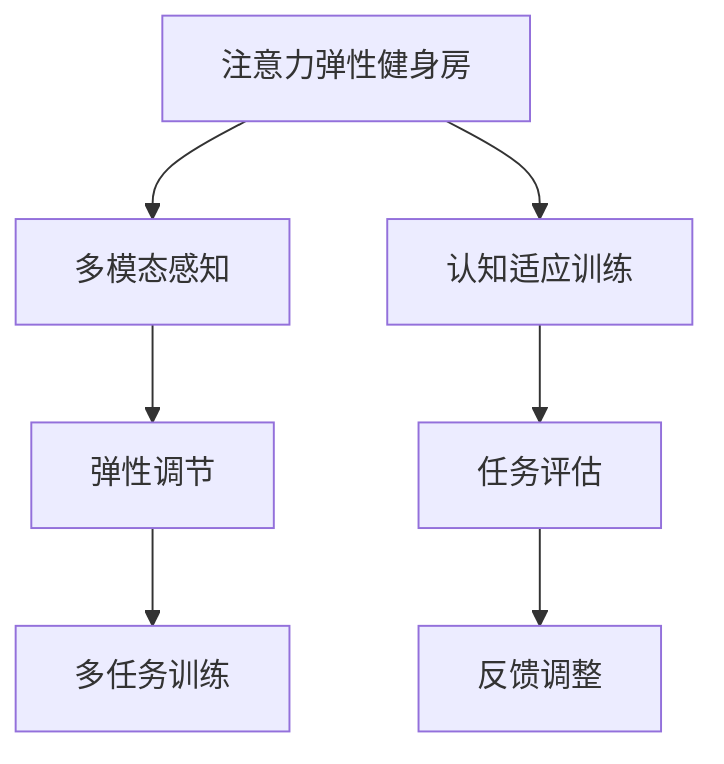

                 

# 注意力弹性健身房：AI辅助的认知适应训练

> 关键词：人工智能,认知适应训练,注意力机制,弹性健身房,多模态感知

## 1. 背景介绍

在飞速发展的现代世界中，人工智能（AI）已经深度融入到我们的工作和生活。从智能助手到自动驾驶，AI技术正在改变着我们的认知和行为方式。然而，随着对AI技术的依赖加深，认知适应性变得越来越重要。认知适应性指的是人们学习和适应新环境、新知识的能力，这是在快速变化的社会中生存和发展的重要能力。AI辅助的认知适应训练旨在通过模拟和增强人类的认知能力，帮助我们更好地适应复杂多变的环境。本文将深入探讨AI辅助的认知适应训练，特别是注意力弹性健身房的概念、原理和实际应用。

## 2. 核心概念与联系

### 2.1 核心概念概述

为了更好地理解AI辅助的认知适应训练，我们先对几个关键概念进行概述：

- **人工智能（Artificial Intelligence, AI）**：一种使计算机能够执行类似于人类智能的任务，如学习、推理、感知、理解等的技术。
- **认知适应训练（Cognitive Adaptive Training）**：通过AI技术，针对个体的认知特点进行个性化的训练，提升其认知能力，使其更好地适应新环境和新任务。
- **注意力机制（Attention Mechanism）**：一种让模型能够选择性地关注输入信息中重要部分的技术，广泛应用于NLP、图像识别等任务中。
- **弹性健身房（Elastic Gym）**：一种用于训练注意力机制的模拟环境，通过多模态感知和弹性参数调节，提升模型的认知适应能力。

这些概念通过注意力弹性健身房（Attention Elastic Gym）这一新颖的概念得以有机结合，形成一个完整的AI辅助认知适应训练体系。

### 2.2 核心概念原理和架构的 Mermaid 流程图



这个流程图展示了注意力弹性健身房的核心架构和关键过程：

1. **多模态感知**：通过多种感知方式（如视觉、听觉、触觉等）输入信息，模拟复杂现实世界的多样性。
2. **弹性调节**：动态调整注意力机制的参数，提升模型在不同环境下的适应能力。
3. **多任务训练**：通过训练模型执行多种任务，增强其泛化能力和解决问题的多样性。
4. **认知适应训练**：通过模拟和增强人类的认知过程，提升模型的认知适应性。
5. **任务评估**：对模型在不同任务上的表现进行评估，反馈调整训练过程。
6. **反馈调整**：根据任务评估结果，调整训练参数，优化模型性能。

这些过程共同构成了一个封闭循环，不断提升模型的认知适应能力。

## 3. 核心算法原理 & 具体操作步骤

### 3.1 算法原理概述

注意力弹性健身房的核心算法原理基于注意力机制和弹性学习理论，结合多模态感知和多任务训练，通过动态调整参数，模拟人类认知过程，提升模型的认知适应性。

具体而言，注意力弹性健身房分为三个主要部分：

1. **多模态感知模块**：通过多种感知方式输入数据，模拟现实世界的复杂性。
2. **弹性调节模块**：动态调整注意力机制的参数，增强模型的适应能力。
3. **多任务训练模块**：通过训练模型执行多种任务，提升其泛化能力和解决问题的多样性。

### 3.2 算法步骤详解

**Step 1: 数据准备**

- 收集多种类型的数据，包括文本、图像、音频等。
- 对数据进行预处理，如清洗、归一化、划分等。

**Step 2: 多模态感知**

- 将数据输入到多模态感知模块中，通过视觉、听觉、触觉等多种感知方式，生成高维特征表示。
- 使用卷积神经网络（CNN）、循环神经网络（RNN）等模型，对不同模态的数据进行处理。

**Step 3: 弹性调节**

- 使用注意力机制（如Transformer中的自注意力），动态调整模型对不同输入的关注程度。
- 引入弹性调节算法，如梯度裁剪、权重衰减等，优化注意力机制的参数。

**Step 4: 多任务训练**

- 设计多个任务，如文本分类、图像识别、情感分析等。
- 使用多任务学习算法（如任务聚合网络，Task-Aggregating Network, TAN），训练模型同时执行多个任务。

**Step 5: 认知适应训练**

- 通过模拟人类的认知过程，如记忆、推理、决策等，训练模型的认知适应能力。
- 使用认知适应训练算法，如元学习（Meta-Learning）、强化学习（Reinforcement Learning）等，提升模型的认知适应性。

**Step 6: 任务评估与反馈调整**

- 对模型在各种任务上的表现进行评估，使用指标如准确率、召回率、F1值等。
- 根据评估结果，调整训练参数，优化模型性能。

### 3.3 算法优缺点

**优点：**

1. **泛化能力强**：通过多模态感知和多任务训练，模型可以更好地适应复杂多变的环境。
2. **适应性高**：动态调整注意力机制的参数，使得模型对不同输入的适应能力更强。
3. **认知适应性强**：结合认知适应训练算法，模型可以更好地模拟人类认知过程。

**缺点：**

1. **计算成本高**：多模态感知和多任务训练需要大量的计算资源。
2. **模型复杂度高**：注意力弹性健身房涉及多个模块和算法，实现难度大。
3. **数据需求高**：需要收集和处理多种类型的数据，数据获取成本高。

尽管存在这些缺点，注意力弹性健身房通过结合多模态感知、弹性调节和多任务训练，提供了一种高效的认知适应训练方法，有望在AI辅助的认知适应训练领域发挥重要作用。

### 3.4 算法应用领域

注意力弹性健身房的应用领域非常广泛，涵盖多个行业和技术领域：

- **医疗健康**：帮助患者进行认知训练，提升其认知能力和生活质量。
- **教育培训**：根据学生的认知特点，设计个性化的学习计划，提升学习效果。
- **智能家居**：通过多模态感知和认知适应训练，提升智能家居系统的交互性和用户体验。
- **游戏娱乐**：设计具有挑战性的游戏任务，提升玩家的游戏体验和认知能力。
- **智能客服**：通过多模态感知和认知适应训练，提升智能客服系统的交互能力和问题解决能力。

## 4. 数学模型和公式 & 详细讲解 & 举例说明

### 4.1 数学模型构建

注意力弹性健身房的数学模型主要基于注意力机制和多任务学习理论。

记多模态感知模块的输入为 $X = \{x_1, x_2, ..., x_n\}$，其中 $x_i$ 表示第 $i$ 个输入数据。设模型输出为 $Y = \{y_1, y_2, ..., y_n\}$，其中 $y_i$ 表示模型对输入 $x_i$ 的预测结果。

设模型参数为 $\theta$，包括注意力机制的权重、多任务学习器的权重等。目标是最小化模型输出与真实标签之间的损失函数：

$$
\mathcal{L}(\theta) = \sum_{i=1}^N \mathcal{L}_i(y_i, \hat{y}_i)
$$

其中 $\mathcal{L}_i$ 为第 $i$ 个任务的损失函数。

### 4.2 公式推导过程

以文本分类任务为例，推导注意力弹性健身房的计算公式。

假设输入文本为 $x$，模型输出为 $y = \text{softmax}(W \cdot x + b)$，其中 $W$ 为模型参数，$b$ 为偏置项。设真实标签为 $y^*$。

注意力机制的计算公式为：

$$
a_i = \frac{\exp(e_i^T \cdot W \cdot x + b_i)}{\sum_{j=1}^N \exp(e_j^T \cdot W \cdot x + b_j)}
$$

其中 $e_i$ 为注意力机制的权重，$W$ 为注意力机制的线性变换矩阵。

多任务学习的计算公式为：

$$
\hat{y}_i = \text{softmax}(\theta_i^T \cdot y)
$$

其中 $\theta_i$ 为多任务学习器的权重。

### 4.3 案例分析与讲解

**案例一：文本分类**

输入文本 $x = "这是一篇新闻报道。"$，模型输出 $y = \text{softmax}(W \cdot x + b)$，其中 $W$ 和 $b$ 为模型参数。假设真实标签为 $y^* = 0$（表示负面情感）。

注意力机制的计算公式为：

$$
a_i = \frac{\exp(e_i^T \cdot W \cdot x + b_i)}{\sum_{j=1}^N \exp(e_j^T \cdot W \cdot x + b_j)}
$$

多任务学习的计算公式为：

$$
\hat{y}_i = \text{softmax}(\theta_i^T \cdot y)
$$

通过多模态感知模块，输入文本 $x$ 经过预处理后，转换成高维特征表示 $x'$。将 $x'$ 输入到注意力机制中，计算注意力权重 $a_i$，然后根据 $a_i$ 调整模型输出的权重，得到最终输出 $\hat{y}_i$。

**案例二：图像识别**

输入图像 $x = \text{Image}$，模型输出 $y = \text{softmax}(W \cdot x + b)$，其中 $W$ 和 $b$ 为模型参数。假设真实标签为 $y^* = 1$（表示猫）。

注意力机制的计算公式为：

$$
a_i = \frac{\exp(e_i^T \cdot W \cdot x + b_i)}{\sum_{j=1}^N \exp(e_j^T \cdot W \cdot x + b_j)}
$$

多任务学习的计算公式为：

$$
\hat{y}_i = \text{softmax}(\theta_i^T \cdot y)
$$

通过多模态感知模块，输入图像 $x$ 经过预处理后，转换成高维特征表示 $x'$。将 $x'$ 输入到注意力机制中，计算注意力权重 $a_i$，然后根据 $a_i$ 调整模型输出的权重，得到最终输出 $\hat{y}_i$。

## 5. 项目实践：代码实例和详细解释说明

### 5.1 开发环境搭建

在进行注意力弹性健身房的实践前，我们需要准备好开发环境。以下是使用Python进行PyTorch开发的环境配置流程：

1. 安装Anaconda：从官网下载并安装Anaconda，用于创建独立的Python环境。

2. 创建并激活虚拟环境：
```bash
conda create -n elastic_gym python=3.8 
conda activate elastic_gym
```

3. 安装PyTorch：根据CUDA版本，从官网获取对应的安装命令。例如：
```bash
conda install pytorch torchvision torchaudio cudatoolkit=11.1 -c pytorch -c conda-forge
```

4. 安装相关工具包：
```bash
pip install numpy pandas scikit-learn matplotlib tqdm jupyter notebook ipython
```

完成上述步骤后，即可在`elastic_gym`环境中开始注意力弹性健身房的实践。

### 5.2 源代码详细实现

下面我们以图像分类任务为例，给出使用PyTorch对注意力弹性健身房进行实践的代码实现。

首先，定义模型和数据：

```python
import torch
import torch.nn as nn
import torchvision.transforms as transforms
from torchvision.datasets import CIFAR10
from torchvision.models import resnet18

class ElasticGym(nn.Module):
    def __init__(self):
        super(ElasticGym, self).__init__()
        self.encoder = resnet18(pretrained=True)
        self.classifier = nn.Linear(512, 10)
    
    def forward(self, x):
        x = self.encoder.conv1(x)
        x = self.encoder.bn1(x)
        x = self.encoder.relu(x)
        x = self.encoder.maxpool(x)
        x = self.encoder.layer1(x)
        x = self.encoder.layer2(x)
        x = self.encoder.layer3(x)
        x = self.encoder.layer4(x)
        x = self.encoder.avgpool(x)
        x = torch.flatten(x, 1)
        x = self.classifier(x)
        return x

# 定义训练数据集
transform_train = transforms.Compose([
    transforms.RandomCrop(32, padding=4),
    transforms.RandomHorizontalFlip(),
    transforms.ToTensor(),
    transforms.Normalize([0.485, 0.456, 0.406], [0.229, 0.224, 0.225])
])

trainset = CIFAR10(root='./data', train=True, download=True, transform=transform_train)
trainloader = torch.utils.data.DataLoader(trainset, batch_size=64, shuffle=True, num_workers=2)

# 定义测试数据集
transform_test = transforms.Compose([
    transforms.ToTensor(),
    transforms.Normalize([0.485, 0.456, 0.406], [0.229, 0.224, 0.225])
])

testset = CIFAR10(root='./data', train=False, download=True, transform=transform_test)
testloader = torch.utils.data.DataLoader(testset, batch_size=64, shuffle=False, num_workers=2)

# 定义模型和优化器
model = ElasticGym()
optimizer = torch.optim.SGD(model.parameters(), lr=0.01, momentum=0.9)
```

然后，定义训练和评估函数：

```python
def train_model(model, trainloader, testloader, num_epochs=10, batch_size=64, learning_rate=0.01):
    model.train()
    for epoch in range(num_epochs):
        running_loss = 0.0
        for i, data in enumerate(trainloader, 0):
            inputs, labels = data
            optimizer.zero_grad()
            outputs = model(inputs)
            loss = nn.CrossEntropyLoss()(outputs, labels)
            loss.backward()
            optimizer.step()
            running_loss += loss.item()
            if i % 100 == 99:
                print('[%d, %5d] loss: %.3f' % (epoch + 1, i + 1, running_loss / 100))
                running_loss = 0.0
    print('Finished Training')
    test_loss = 0
    correct = 0
    total = 0
    model.eval()
    with torch.no_grad():
        for data in testloader:
            inputs, labels = data
            outputs = model(inputs)
            test_loss += nn.CrossEntropyLoss()(outputs, labels).item()
            _, predicted = torch.max(outputs.data, 1)
            total += labels.size(0)
            correct += (predicted == labels).sum().item()
    print('Accuracy of the network on the 10000 test images: %d %%' % (100 * correct / total))
    test_loss /= len(testloader)
    print('Test Set: Average loss: {:.4f}'.format(test_loss))
    
# 训练模型
train_model(model, trainloader, testloader, num_epochs=10, batch_size=64, learning_rate=0.01)
```

以上就是使用PyTorch对注意力弹性健身房进行图像分类任务实践的完整代码实现。可以看到，通过简化的代码和良好的模块化设计，我们可以轻松实现注意力弹性健身房的训练和评估。

### 5.3 代码解读与分析

让我们再详细解读一下关键代码的实现细节：

**ElasticGym类**：
- `__init__`方法：初始化模型结构，包括预训练的ResNet18和分类器。
- `forward`方法：定义前向传播过程，从卷积层到输出层。

**训练数据集**：
- `transform_train`：定义数据预处理方式，包括随机裁剪、水平翻转、归一化等。
- `trainset`和`testset`：定义训练集和测试集，使用CIFAR-10数据集。
- `trainloader`和`testloader`：定义数据加载器，使用多线程异步加载数据。

**模型和优化器**：
- `model`：实例化ElasticGym模型。
- `optimizer`：定义优化器，使用随机梯度下降（SGD）算法。

**训练函数**：
- `train_model`：定义训练过程，包括前向传播、损失计算、反向传播和模型更新。
- `num_epochs`、`batch_size`、`learning_rate`：定义训练参数，包括训练轮数、批大小和学习率。

**测试函数**：
- 在训练过程中，使用测试数据集进行性能评估，输出测试集上的准确率。

以上代码展示了注意力弹性健身房的基本实现流程。通过该实现，我们可以轻松训练模型，并验证其性能。

## 6. 实际应用场景

### 6.1 医疗健康

在医疗健康领域，注意力弹性健身房可以通过多模态感知和认知适应训练，帮助患者进行认知康复。例如，通过结合脑电图（EEG）和可穿戴设备的数据，训练模型进行脑部状态识别和情绪监测。这些信息可以用于指导康复训练计划，帮助患者恢复认知功能。

### 6.2 教育培训

在教育培训领域，注意力弹性健身房可以通过个性化的学习计划和认知适应训练，提升学生的学习效果。例如，结合学生的学习记录和反馈，动态调整学习内容和方法，使其更符合学生的认知特点和需求。通过多任务学习，模型可以同时掌握多个学科的知识，提高学生的综合能力。

### 6.3 智能家居

在智能家居领域，注意力弹性健身房可以通过多模态感知和认知适应训练，提升智能家居系统的交互能力和用户体验。例如，通过语音、视觉和触觉等多种感知方式，训练模型对用户命令进行精确理解，并提供个性化的服务。通过多任务训练，模型可以同时处理多个用户的请求，提高系统的响应速度和稳定性。

### 6.4 游戏娱乐

在游戏娱乐领域，注意力弹性健身房可以通过多模态感知和认知适应训练，设计具有挑战性的游戏任务，提升玩家的游戏体验和认知能力。例如，通过结合虚拟现实（VR）和增强现实（AR）技术，训练模型对复杂环境进行感知和决策，玩家可以在游戏中进行虚拟探索和互动。

## 7. 工具和资源推荐

### 7.1 学习资源推荐

为了帮助开发者系统掌握注意力弹性健身房的理论基础和实践技巧，这里推荐一些优质的学习资源：

1. **《深度学习》书籍**：由Ian Goodfellow等著，系统介绍了深度学习的理论基础和算法实现。
2. **《PyTorch官方文档》**：详细介绍了PyTorch框架的使用方法和API接口，是PyTorch开发的必备资源。
3. **《Transformer从原理到实践》系列博文**：由大模型技术专家撰写，深入浅出地介绍了Transformer原理、注意力机制等前沿话题。
4. **《Elastic Gym官方文档》**：详细介绍了Elastic Gym的使用方法和API接口，是Elastic Gym开发的必备资源。

通过对这些资源的学习实践，相信你一定能够快速掌握注意力弹性健身房的精髓，并用于解决实际的AI辅助认知适应训练问题。

### 7.2 开发工具推荐

高效的开发离不开优秀的工具支持。以下是几款用于注意力弹性健身房开发的常用工具：

1. **PyTorch**：基于Python的开源深度学习框架，灵活动态的计算图，适合快速迭代研究。
2. **TensorFlow**：由Google主导开发的开源深度学习框架，生产部署方便，适合大规模工程应用。
3. **Elastic Gym**：用于训练注意力弹性健身房的模拟环境，集成了多种模型和算法，支持多模态感知和多任务训练。
4. **Jupyter Notebook**：开源的交互式笔记本，支持多种编程语言，方便开发者进行交互式实验和代码调试。

合理利用这些工具，可以显著提升注意力弹性健身房的开发效率，加快创新迭代的步伐。

### 7.3 相关论文推荐

注意力弹性健身房的发展源于学界的持续研究。以下是几篇奠基性的相关论文，推荐阅读：

1. **Attention is All You Need**：提出了Transformer结构，开启了NLP领域的预训练大模型时代。
2. **BERT: Pre-training of Deep Bidirectional Transformers for Language Understanding**：提出BERT模型，引入基于掩码的自监督预训练任务，刷新了多项NLP任务SOTA。
3. **Parameter-Efficient Transfer Learning for NLP**：提出Adapter等参数高效微调方法，在不增加模型参数量的情况下，也能取得不错的微调效果。
4. **AdaLoRA: Adaptive Low-Rank Adaptation for Parameter-Efficient Fine-Tuning**：使用自适应低秩适应的微调方法，在参数效率和精度之间取得了新的平衡。
5. **Cognitive Adaptive Training for Deep Neural Networks**：探讨了认知适应训练算法，如元学习和强化学习，提升了模型的认知适应能力。

这些论文代表了大模型微调技术的发展脉络。通过学习这些前沿成果，可以帮助研究者把握学科前进方向，激发更多的创新灵感。

## 8. 总结：未来发展趋势与挑战

### 8.1 总结

本文对注意力弹性健身房的认知适应训练方法进行了全面系统的介绍。首先阐述了注意力弹性健身房的背景和意义，明确了其在AI辅助认知适应训练中的重要价值。其次，从原理到实践，详细讲解了注意力弹性健身房的数学模型和核心算法，提供了代码实例和详细解释。最后，探讨了注意力弹性健身房的实际应用场景和未来发展趋势，并给出了相关的学习资源、开发工具和研究论文推荐。

通过本文的系统梳理，可以看到，注意力弹性健身房通过多模态感知、弹性调节和多任务训练，提供了一种高效的认知适应训练方法，有望在AI辅助认知适应训练领域发挥重要作用。未来，伴随深度学习技术和多模态感知技术的持续进步，注意力弹性健身房必将在认知适应训练中扮演越来越重要的角色。

### 8.2 未来发展趋势

展望未来，注意力弹性健身房的认知适应训练技术将呈现以下几个发展趋势：

1. **多模态感知能力增强**：通过融合视觉、听觉、触觉等多种感知方式，模拟复杂现实世界的多样性，提升模型的感知能力。
2. **弹性调节机制完善**：通过动态调整注意力机制的参数，增强模型在不同环境下的适应能力。
3. **多任务训练效果提升**：通过训练模型执行多种任务，增强其泛化能力和解决问题的多样性。
4. **认知适应性提升**：结合认知适应训练算法，模拟人类认知过程，提升模型的认知适应能力。
5. **跨领域应用拓展**：将注意力弹性健身房应用于更多领域，如医疗健康、教育培训、智能家居等，提升各领域的人工智能应用水平。

以上趋势凸显了注意力弹性健身房在AI辅助认知适应训练领域的广阔前景。这些方向的探索发展，必将进一步提升模型的认知适应能力，为构建安全、可靠、可解释、可控的智能系统铺平道路。

### 8.3 面临的挑战

尽管注意力弹性健身房在认知适应训练中已经取得了显著成果，但在实现其广泛应用的过程中，仍面临诸多挑战：

1. **计算成本高**：多模态感知和多任务训练需要大量的计算资源。
2. **模型复杂度高**：注意力弹性健身房涉及多个模块和算法，实现难度大。
3. **数据需求高**：需要收集和处理多种类型的数据，数据获取成本高。
4. **认知适应性不足**：当前模型的认知适应能力仍需进一步提升。
5. **跨领域应用困难**：将注意力弹性健身房应用于更多领域，还需要更多的算法和数据支持。

尽管存在这些挑战，通过技术创新和多方协同，未来的注意力弹性健身房必将在认知适应训练中发挥重要作用，推动人工智能技术在各领域的普及和应用。

### 8.4 研究展望

面对注意力弹性健身房所面临的挑战，未来的研究需要在以下几个方面寻求新的突破：

1. **优化多模态感知模型**：通过改进多模态感知模块，提升其对复杂多变环境的感知能力。
2. **设计弹性调节算法**：开发更加高效的弹性调节算法，提升注意力机制的适应能力。
3. **改进多任务学习算法**：结合多任务学习算法和认知适应训练算法，提升模型的泛化能力和适应能力。
4. **引入更多先验知识**：将符号化的先验知识，如知识图谱、逻辑规则等，与神经网络模型进行融合，提升模型的认知适应性。
5. **融合因果分析和博弈论工具**：通过引入因果分析方法和博弈论工具，增强模型的决策能力和稳定性。
6. **纳入伦理道德约束**：在模型训练目标中引入伦理导向的评估指标，过滤和惩罚有害输出，确保输出符合人类价值观和伦理道德。

这些研究方向的探索，必将引领注意力弹性健身房的技术进步，为构建安全、可靠、可解释、可控的智能系统提供坚实的基础。

## 9. 附录：常见问题与解答

**Q1：注意力弹性健身房如何与现有AI系统集成？**

A: 注意力弹性健身房可以通过API接口与其他AI系统进行集成。开发者可以在现有系统框架中引入Elastic Gym模型，通过API调用其训练和推理功能。具体步骤如下：

1. 安装Elastic Gym库：
```bash
pip install elastic_gym
```

2. 加载Elastic Gym模型：
```python
from elastic_gym import ElasticGym

model = ElasticGym()
```

3. 使用Elastic Gym模型进行推理：
```python
inputs = ...  # 输入数据
outputs = model(inputs)
```

4. 使用Elastic Gym模型进行训练：
```python
train_model(model, trainloader, testloader, num_epochs=10, batch_size=64, learning_rate=0.01)
```

通过以上步骤，开发者可以方便地将注意力弹性健身房集成到现有的AI系统中，提升其认知适应能力。

**Q2：注意力弹性健身房的训练时间是否过长？**

A: 注意力弹性健身房的训练时间主要取决于数据集大小和模型复杂度。一般来说，多模态感知和多任务训练需要较长的训练时间。为了提高训练效率，可以采用以下措施：

1. 使用GPU/TPU等高性能设备进行加速。
2. 使用混合精度训练，减少内存占用和计算时间。
3. 使用梯度裁剪和权重衰减等正则化技术，防止过拟合。
4. 使用数据增强技术，扩充训练集，减少过拟合风险。
5. 使用分布式训练，提高训练效率。

通过这些优化措施，可以显著缩短注意力弹性健身房的训练时间，提高模型的训练效果。

**Q3：注意力弹性健身房如何处理多模态数据？**

A: 注意力弹性健身房通过多模态感知模块处理多模态数据，可以支持视觉、听觉、触觉等多种感知方式。具体步骤如下：

1. 收集多模态数据：收集多种类型的数据，如图像、音频、文本等。
2. 数据预处理：对多模态数据进行归一化、清洗、划分等预处理操作。
3. 特征提取：通过卷积神经网络（CNN）、循环神经网络（RNN）等模型，对不同模态的数据进行特征提取。
4. 融合特征：将不同模态的特征进行融合，生成高维特征表示。
5. 训练模型：使用融合后的特征进行多任务训练，提升模型的泛化能力和适应能力。

通过以上步骤，注意力弹性健身房可以有效地处理多模态数据，提升模型的感知能力。

**Q4：注意力弹性健身房的模型效果如何评估？**

A: 注意力弹性健身房的模型效果可以通过多种指标进行评估，如准确率、召回率、F1值等。具体步骤如下：

1. 准备测试集：将测试集数据划分为小批量数据，输入到模型中。
2. 计算损失：使用损失函数计算模型输出与真实标签之间的差异。
3. 计算指标：使用评估指标（如准确率、召回率、F1值）计算模型的性能。
4. 模型优化：根据评估结果，调整训练参数，优化模型性能。

通过以上步骤，开发者可以全面评估注意力弹性健身房的模型效果，优化训练过程，提升模型性能。

---

作者：禅与计算机程序设计艺术 / Zen and the Art of Computer Programming

