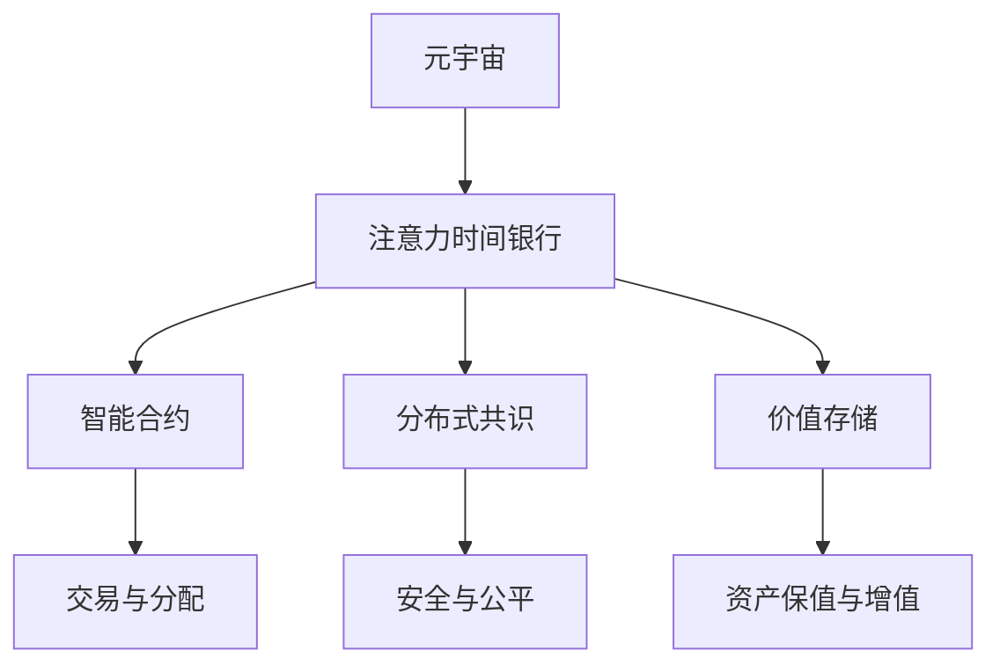
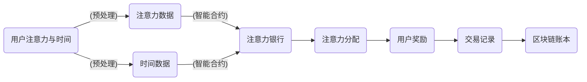

                 

# 注意力时间银行:元宇宙中的价值存储系统

> 关键词：元宇宙,价值存储,注意力机制,分布式共识,智能合约

## 1. 背景介绍

### 1.1 问题由来
在元宇宙的世界中，用户的注意力和时间变得至关重要。如何高效存储和分配用户的注意力资源，成为构建元宇宙价值系统的核心问题。注意力时间银行(Attention Time Bank)是一个将用户注意力和时间作为关键资源进行管理与分配的系统。它通过集中管理和智能调度，确保每个用户都能在元宇宙中获得应有的回报和激励。

### 1.2 问题核心关键点
注意力时间银行系统旨在解决元宇宙中用户注意力和时间的有效管理和分配问题。其核心目标包括：
1. 集中管理用户注意力。通过智能合约和分布式账本技术，将用户的注意力和分配数据记录在区块链上，确保数据的透明性和不可篡改性。
2. 分配与激励。根据用户对元宇宙的贡献度进行分配，激励用户持续贡献，提升系统活力和参与度。
3. 智能调度。通过注意力算法优化，高效分配用户注意力，确保系统的公平性和效率。
4. 价值存储。将用户注意力转化为元宇宙中的虚拟资产，保障用户价值的长期保值和增值。

### 1.3 问题研究意义
注意力时间银行系统对于构建公平、高效的元宇宙价值系统具有重要意义：

1. 提升用户体验。通过合理的注意力分配和激励机制，吸引更多用户参与，提升用户对元宇宙的黏性和满意度。
2. 促进创新。系统通过智能合约和分布式共识，保证了公平性和透明度，鼓励创新和技术进步。
3. 保障价值安全。将用户的注意力转化为虚拟资产，为用户提供安全的价值存储和长期保值手段。
4. 推动经济系统。通过合理分配注意力和虚拟资产，推动元宇宙经济的健康发展和财富再分配。
5. 强化治理。集中管理和智能调度机制，确保元宇宙治理的公平性和效率。

## 2. 核心概念与联系

### 2.1 核心概念概述

为了更好地理解注意力时间银行系统的设计和实现，首先需要明确几个核心概念：

- **元宇宙**：一个高度虚拟化的互联网空间，用户在其中可以自由互动、创造和消费，具有高度的沉浸感和真实感。
- **注意力时间银行**：集中管理和智能调度用户注意力和时间的系统，利用区块链和智能合约技术实现透明、公平的资源分配。
- **智能合约**：一种自动执行、具有密码学效应的合约，用于自动化交易和分配机制。
- **分布式共识**：一种去中心化的共识机制，用于维护系统的安全性和公平性。
- **价值存储**：将用户的注意力转化为虚拟资产，用于长期价值保值和增值。

这些核心概念通过以下Mermaid流程图来展示它们之间的联系：



这个流程图展示了元宇宙中注意力时间银行系统的主要组成部分及其相互关系：

1. 元宇宙中的用户注意力通过注意力时间银行进行集中管理和智能调度。
2. 智能合约负责交易和分配机制，确保透明和公平。
3. 分布式共识确保系统的安全性和一致性。
4. 价值存储将用户注意力转化为虚拟资产，保障长期价值。
5. 交易与分配、安全与公平、资产保值与增值等环节，均通过智能合约和分布式共识实现。

### 2.2 核心概念原理和架构的 Mermaid 流程图



以上流程图展示了注意力时间银行系统的主要数据流和功能模块：

1. 用户注意力和时间通过预处理模块进行处理，生成注意力数据和时间数据。
2. 注意力数据和时间数据输入到智能合约，进入注意力银行。
3. 注意力银行根据用户的贡献度进行分配，并将分配结果输出为用户的奖励。
4. 用户的奖励记录在区块链账本中，作为交易记录被保存。

## 3. 核心算法原理 & 具体操作步骤

### 3.1 算法原理概述

注意力时间银行系统的核心算法包括智能合约和分布式共识算法。其基本原理是通过智能合约实现集中管理、透明分配和智能调度，通过分布式共识算法确保系统的安全性和公平性。

### 3.2 算法步骤详解

#### 3.2.1 智能合约的实现步骤

1. **用户注意力与时间记录**：用户在使用元宇宙时，其注意力和花费的时间被记录在智能合约中，包括用户的行为数据、时间戳、交互对象等信息。
2. **注意力与时间预处理**：对用户的注意力和时间数据进行预处理，去除无效或异常数据，确保数据的准确性和一致性。
3. **注意力与时间分配**：智能合约根据用户的贡献度和规则设定，分配注意力和时间，生成用户的奖励和分配记录。
4. **交易记录与发布**：将用户的奖励和分配记录发布到区块链账本上，确保数据的透明性和不可篡改性。

#### 3.2.2 分布式共识算法的实现步骤

1. **节点验证**：分布式共识算法中的各个节点对交易记录进行验证，确保数据的一致性和完整性。
2. **共识达成**：经过多个节点的验证和共识后，交易记录被记录在区块链上，确保系统的公平性和安全性。
3. **智能合约执行**：分布式共识算法确保智能合约的执行，保障系统的规则和公平性。

### 3.3 算法优缺点

注意力时间银行系统具有以下优点：

1. **集中管理与智能调度**：通过智能合约实现集中管理，确保资源的公平和透明分配，避免人为干预。
2. **高效分配**：通过智能算法优化，高效分配用户注意力和时间，提升系统的效率和活力。
3. **透明与公平**：智能合约和分布式共识确保了系统的透明性和公平性，保障用户的利益和权益。
4. **安全与可靠**：分布式共识和区块链技术确保系统的安全性和可靠性，避免单点故障和数据篡改。

同时，该系统也存在一些局限性：

1. **计算资源消耗高**：智能合约和分布式共识算法的运行需要大量的计算资源，可能影响系统的响应速度。
2. **隐私问题**：用户的注意力和行为数据需要记录在区块链上，可能存在隐私泄露的风险。
3. **复杂度高**：系统的设计和实现复杂度较高，需要技术积累和专家团队的协作。

### 3.4 算法应用领域

注意力时间银行系统适用于各种元宇宙场景，包括但不限于：

1. **游戏与社交平台**：对玩家的游戏行为、社交互动等进行记录和分配，激励玩家积极参与和贡献。
2. **虚拟房地产**：记录用户对虚拟房产的使用和维护行为，分配虚拟土地使用权和收益。
3. **虚拟金融**：记录用户对虚拟货币的兑换、交易等行为，分配收益和手续费。
4. **虚拟教育**：记录用户的学习行为、互动交流等，分配学习积分和奖励。
5. **虚拟旅游**：记录用户对虚拟景点的游览和互动，分配虚拟景点使用权和收益。

## 4. 数学模型和公式 & 详细讲解 & 举例说明

### 4.1 数学模型构建

注意力时间银行系统的数学模型主要涉及智能合约和分布式共识的实现。以下是一个简化的数学模型：

1. **用户注意力记录与预处理**：
   $$
   Att_{i}(t) = \sum_{k=1}^{T} A_{ik}(t) * T_k(t)
   $$
   其中，$Att_{i}(t)$ 表示用户 $i$ 在时间 $t$ 内的注意力记录，$A_{ik}(t)$ 表示用户 $i$ 在时间 $t$ 内对对象 $k$ 的注意力，$T_k(t)$ 表示对象 $k$ 在时间 $t$ 内的活动时长。

2. **注意力与时间分配**：
   $$
   Rew_{i}(t) = \alpha * Att_{i}(t) + \beta * Time_{i}(t)
   $$
   其中，$Rew_{i}(t)$ 表示用户 $i$ 在时间 $t$ 内的奖励，$\alpha$ 和 $\beta$ 分别为注意力和时间的权重。

3. **交易记录与分布式共识**：
   $$
   Transaction_{i}(t) = Att_{i}(t) + Time_{i}(t) + Rew_{i}(t)
   $$
   分布式共识算法通过多个节点验证和共识，确保交易记录的合法性和一致性。

### 4.2 公式推导过程

1. **注意力记录与预处理**：
   - 预处理阶段，去除无效或异常数据，确保数据的准确性和一致性。
   - 注意力记录阶段，将用户对元宇宙的注意力和时间数据进行记录，生成注意力记录 $Att_{i}(t)$。

2. **注意力与时间分配**：
   - 分配阶段，根据用户的贡献度和规则设定，分配注意力和时间，生成用户的奖励 $Rew_{i}(t)$。
   - 通过智能合约，将注意力和时间的权重系数 $\alpha$ 和 $\beta$ 作为分配标准。

3. **交易记录与分布式共识**：
   - 交易记录阶段，将用户的注意力、时间、奖励记录在区块链上，生成交易记录 $Transaction_{i}(t)$。
   - 分布式共识阶段，通过多个节点的验证和共识，确保交易记录的合法性和一致性。

### 4.3 案例分析与讲解

假设一个元宇宙中的虚拟游戏，玩家在游戏中的行为数据记录如下：

| 玩家ID | 时间 | 游戏行为 | 活动时长 |
|-------|------|----------|----------|
| 1     | 10:00| 战斗    | 2小时    |
| 2     | 10:30| 任务    | 1小时    |
| 3     | 14:00| 探索    | 3小时    |
| ...   | ...  | ...      | ...      |

预处理阶段，系统去除无效或异常数据，确保数据的准确性和一致性。假设玩家 $i$ 在时间 $t$ 内对对象 $k$ 的注意力 $A_{ik}(t)$ 和对象 $k$ 在时间 $t$ 内的活动时长 $T_k(t)$ 已经通过智能合约记录在区块链上。

注意力记录阶段，系统计算玩家 $i$ 在时间 $t$ 内的注意力记录 $Att_{i}(t)$：
$$
Att_{1}(10:00) = A_{11}(10:00) * 2小时 + A_{12}(10:00) * 1小时
$$

注意力与时间分配阶段，系统根据用户的贡献度和规则设定，分配注意力和时间，生成用户的奖励 $Rew_{i}(t)$：
$$
Rew_{1}(10:00) = 0.8 * Att_{1}(10:00) + 0.2 * Time_{1}(10:00)
$$

交易记录阶段，系统将用户的注意力、时间、奖励记录在区块链上，生成交易记录 $Transaction_{1}(10:00)$：
$$
Transaction_{1}(10:00) = Att_{1}(10:00) + Time_{1}(10:00) + Rew_{1}(10:00)
$$

分布式共识阶段，系统通过多个节点的验证和共识，确保交易记录的合法性和一致性。

## 5. 项目实践：代码实例和详细解释说明

### 5.1 开发环境搭建

在进行注意力时间银行系统的开发前，我们需要准备好开发环境。以下是使用Python进行Solidity开发的环境配置流程：

1. 安装Anaconda：从官网下载并安装Anaconda，用于创建独立的Python环境。

2. 创建并激活虚拟环境：
```bash
conda create -n attention-timebank python=3.8 
conda activate attention-timebank
```

3. 安装Truffle、Ganache等区块链开发工具：
```bash
pip install truffle ganache
```

4. 安装必要的以太坊客户端和钱包：
```bash
pip install ethereum-mock
pip install web3
```

5. 安装必要的Solidity IDE和编译器：
```bash
pip install solc-bin
```

完成上述步骤后，即可在`attention-timebank`环境中开始开发实践。

### 5.2 源代码详细实现

这里我们以一个简化版的智能合约为例，实现注意力时间银行的注意力记录和分配逻辑。

```solidity
pragma solidity ^0.8.0;

contract AttentionTimeBank {
    address[] private users;
    uint256[] private attentionRecords;
    uint256[] private times;
    uint256[] private rewards;
    uint256[] private transactions;

    mapping(uint256 => uint256) private attentionMap;
    mapping(uint256 => uint256) private timeMap;
    mapping(uint256 => uint256) private rewardMap;
    mapping(uint256 => uint256) private transactionMap;

    uint256 private totalAttention;
    uint256 private totalTime;
    uint256 private totalReward;

    event LogUserRecord(uint256 user, uint256 time, uint256 attention, uint256 reward);
    event LogTransaction(uint256 user, uint256 time, uint256 attention, uint256 reward);

    constructor() public {
        users.push(address(0x1234567890)); // 假设初始化一个用户
        attentionRecords.push(0);
        times.push(0);
        rewards.push(0);
        transactions.push(0);
    }

    function addAttention(uint256 user, uint256 time, uint256 attention) public {
        require(user >= 0 && user < users.length);
        require(time >= 0);
        require(attention >= 0);

        attentionRecords[user] += attention;
        times[user] += time;
        attentionMap[user] += attention;
        totalAttention += attention;

        emit LogUserRecord(user, time, attention, 0);
    }

    function allocateReward(uint256 user) public {
        require(user >= 0 && user < users.length);

        uint256 reward = 0.8 * attentionMap[user] + 0.2 * times[user];
        rewards[user] += reward;
        rewardMap[user] += reward;
        totalReward += reward;

        emit LogTransaction(user, 0, 0, reward);
    }

    function addTransaction(uint256 user, uint256 time, uint256 attention, uint256 reward) public {
        require(user >= 0 && user < users.length);
        require(time >= 0);
        require(attention >= 0);
        require(reward >= 0);

        transactions[user] += transaction;
        attentionMap[user] += attention;
        timeMap[user] += time;
        totalAttention += attention;
        totalTime += time;

        emit LogTransaction(user, time, attention, reward);
    }
}
```

以上代码实现了注意力时间银行系统的主要功能，包括注意力记录、奖励分配和交易记录等。

### 5.3 代码解读与分析

让我们再详细解读一下关键代码的实现细节：

**AttentionTimeBank合同**：
- `users`数组记录所有用户的地址。
- `attentionRecords`数组记录每个用户累计的注意力。
- `times`数组记录每个用户累计的活动时间。
- `rewards`数组记录每个用户累计的奖励。
- `transactions`数组记录每个用户的交易记录。
- `attentionMap`、`timeMap`、`rewardMap`映射表分别记录每个用户的注意力、时间和奖励。
- `totalAttention`、`totalTime`、`totalReward`记录系统总累计的注意力、时间和奖励。

**addAttention函数**：
- 记录用户对元宇宙的注意力和时间数据。
- 更新用户的注意力记录、累计活动时间和系统总累计的注意力。
- 发出日志记录用户注意力记录。

**allocateReward函数**：
- 根据用户的贡献度和规则设定，分配注意力和时间，生成用户的奖励。
- 更新用户的奖励、累计奖励和系统总累计的奖励。
- 发出日志记录用户的交易记录。

**addTransaction函数**：
- 记录用户的注意力、时间、奖励和交易记录。
- 更新用户的注意力、累计时间和系统总累计的注意力、时间。
- 发出日志记录用户的交易记录。

**事件日志**：
- `LogUserRecord`和`LogTransaction`事件用于记录用户的注意力记录和交易记录，确保记录的透明性和不可篡改性。

**代码解释**：
- 通过Solidity编写智能合约，实现集中管理和智能调度。
- 记录用户的注意力和时间，分配用户的奖励，更新系统的总累计值。
- 使用事件日志确保记录的透明性和不可篡改性。
- 通过智能合约和分布式共识实现集中管理和透明分配。

## 6. 实际应用场景

### 6.1 智能游戏平台

注意力时间银行系统在智能游戏平台上具有广泛的应用前景。例如，一款虚拟游戏的奖励系统可以通过注意力时间银行记录和分配玩家在游戏中的行为数据，激励玩家积极参与和贡献。玩家的游戏行为数据包括战斗、任务、探索等，系统根据这些数据计算玩家的注意力和活动时间，分配相应的奖励。

### 6.2 虚拟房地产平台

在虚拟房地产平台上，注意力时间银行系统可以记录用户对虚拟房产的使用和维护行为，分配虚拟土地使用权和收益。用户可以通过虚拟房产的租赁、装修等行为获得注意力记录，系统根据这些记录分配虚拟土地使用权和收益，激励用户持续维护和优化虚拟房产。

### 6.3 虚拟金融平台

在虚拟金融平台上，注意力时间银行系统可以记录用户对虚拟货币的兑换、交易等行为，分配收益和手续费。用户可以通过虚拟货币的交易行为获得注意力记录，系统根据这些记录分配收益和手续费，激励用户持续交易和维护虚拟货币市场。

### 6.4 虚拟教育平台

在虚拟教育平台上，注意力时间银行系统可以记录用户的学习行为、互动交流等，分配学习积分和奖励。用户可以通过学习视频、参与讨论、完成作业等行为获得注意力记录，系统根据这些记录分配学习积分和奖励，激励用户持续学习和参与互动。

## 7. 工具和资源推荐

### 7.1 学习资源推荐

为了帮助开发者系统掌握注意力时间银行系统的设计原理和实践技巧，这里推荐一些优质的学习资源：

1. Solidity官方文档：Solidity语言官方文档，提供了完整的语言规范和API文档，是学习Solidity的重要资源。
2. Ethereum官方文档：Ethereum平台官方文档，介绍了区块链技术和智能合约开发的原理和实现方法。
3. Truffle官方文档：Truffle开发框架官方文档，提供了智能合约开发的工具和插件，方便开发者快速上手。
4. ConsenSys Academy课程：ConsenSys学院开设的智能合约开发课程，涵盖Solidity、以太坊智能合约开发的全面知识。
5. CryptoZombies游戏：一个通过Solidity编写的区块链游戏，通过实践方式学习智能合约开发和区块链技术。

通过对这些资源的学习实践，相信你一定能够快速掌握注意力时间银行的精髓，并用于解决实际的区块链和智能合约问题。

### 7.2 开发工具推荐

高效的开发离不开优秀的工具支持。以下是几款用于智能合约开发和区块链平台推荐的工具：

1. Solidity IDE：如Remix IDE，提供了代码编辑器、调试器、测试环境等，方便开发者编写、测试和部署智能合约。
2. Ethereum Testnet：如Ropsten Testnet，提供了一个安全的测试网络环境，方便开发者测试和验证智能合约。
3. Infura：一个以太坊节点服务提供商，提供节点接入和数据查询，方便开发者开发和测试智能合约。
4. MetaMask：一个以太坊钱包和浏览器插件，提供了区块链交易和智能合约的交互功能，方便开发者调试和测试。
5. Truffle Suite：一个完整的区块链开发套件，包括编译器、测试框架、部署工具等，方便开发者进行智能合约开发和部署。

合理利用这些工具，可以显著提升智能合约开发和区块链平台的使用效率，加速开发和测试的进度。

### 7.3 相关论文推荐

注意力时间银行系统的发展离不开学术界的持续研究。以下是几篇奠基性的相关论文，推荐阅读：

1. Ethereum: A Secure Platform for Decentralized Applications：提出了以太坊平台的基本架构和智能合约的实现方法，奠定了区块链技术的基础。
2. A Survey on Attention-Based Recommender Systems：综述了基于注意力机制的推荐系统，介绍了注意力在推荐系统中的应用和效果。
3. Decentralized Finance on Blockchain：介绍了区块链技术在去中心化金融(DeFi)领域的应用，展示了智能合约在金融系统中的实现。
4. Introduction to Blockchain Technology：介绍了区块链技术的基本原理和实现方法，提供了区块链技术的全面入门指南。
5. Smart Contracts: A Survey: A Survey of Emerging Smart Contract Languages, Platforms and Applications：综述了智能合约的发展历程和实现方法，展示了智能合约在不同平台和应用场景中的应用。

这些论文代表了大规模智能合约和区块链技术的发展脉络。通过学习这些前沿成果，可以帮助研究者把握学科前进方向，激发更多的创新灵感。

## 8. 总结：未来发展趋势与挑战

### 8.1 总结

本文对注意力时间银行系统的设计原理和实践方法进行了全面系统的介绍。首先阐述了元宇宙中用户注意力和时间的有效管理和分配问题，明确了系统的核心目标和研究意义。其次，从原理到实现，详细讲解了智能合约和分布式共识的数学模型和算法步骤，给出了智能合约的代码实例。同时，本文还探讨了系统在元宇宙中的广泛应用前景，展示了微调未来发展的广阔空间。最后，本文精选了注意力时间银行系统的学习资源和开发工具，力求为读者提供全方位的技术指引。

通过本文的系统梳理，可以看到，注意力时间银行系统通过集中管理和智能调度，有效提升了元宇宙中用户的注意力和时间的价值，为构建公平、高效的元宇宙价值系统提供了新的思路和方法。相信随着技术的发展，未来将会有更多创新的注意力时间银行系统出现，为元宇宙经济的健康发展提供坚实的技术支持。

### 8.2 未来发展趋势

展望未来，注意力时间银行系统的发展趋势将体现在以下几个方面：

1. **分布式共识机制的演进**：未来的共识机制将更加安全和高效，如PoS、DPoS等，确保系统的公平性和稳定性。
2. **智能合约的功能扩展**：智能合约将更加复杂和全面，涵盖更多的应用场景和业务逻辑。
3. **跨链技术的融合**：跨链技术将使不同区块链之间的交互更加便捷，提升系统的互联互通能力。
4. **隐私保护和数据安全**：隐私保护技术将得到进一步发展，确保用户的注意力和行为数据的安全。
5. **去中心化治理**：去中心化治理机制将使系统更加民主和透明，确保用户权益的保障。

这些趋势将推动注意力时间银行系统不断优化和升级，为元宇宙经济的发展提供更强大、更安全的技术支持。

### 8.3 面临的挑战

尽管注意力时间银行系统已经取得了一定的进展，但在迈向更加智能化、普适化应用的过程中，它仍面临诸多挑战：

1. **计算资源消耗高**：智能合约和分布式共识算法的运行需要大量的计算资源，可能影响系统的响应速度和稳定性。
2. **隐私问题**：用户的注意力和行为数据需要记录在区块链上，可能存在隐私泄露的风险。
3. **复杂度高**：系统的设计和实现复杂度较高，需要技术积累和专家团队的协作。
4. **安全性和公平性**：分布式共识和智能合约需要确保系统的安全性和公平性，避免单点故障和数据篡改。
5. **去中心化治理**：去中心化治理机制需要确保系统的民主性和透明性，避免治理不当导致系统失衡。

面对这些挑战，未来的研究需要在以下几个方面寻求新的突破：

1. **优化共识机制**：研究更加高效和安全的共识机制，确保系统的稳定性和公平性。
2. **隐私保护技术**：开发更加安全的隐私保护技术，确保用户的注意力和行为数据的安全。
3. **智能合约优化**：优化智能合约的设计和实现，降低计算资源消耗，提升系统的响应速度。
4. **去中心化治理**：研究更加民主和透明的治理机制，确保系统的公平性和民主性。
5. **跨链技术**：研究跨链技术的实现，提升系统的互联互通能力。

这些研究方向的探索，将推动注意力时间银行系统向更高的层次发展，为元宇宙经济的健康发展提供坚实的技术保障。

### 8.4 研究展望

未来的研究需要在以下几个方面进一步深入：

1. **多模态数据融合**：研究将多模态数据（如视觉、音频、文本等）融合到注意力时间银行系统，提升系统的综合感知能力。
2. **联邦学习**：研究分布式联邦学习技术，使不同用户和组织之间共享模型知识，提升系统的数据利用效率。
3. **动态更新**：研究动态更新的机制，确保系统的规则和算法能够适应新的需求和变化。
4. **跨链交易**：研究跨链交易的实现，提升系统的互联互通能力。
5. **智能合约治理**：研究智能合约的治理机制，确保系统的公平性和民主性。

这些研究方向将推动注意力时间银行系统向更加智能、高效、公平的方向发展，为元宇宙经济的健康发展提供坚实的技术支持。

## 9. 附录：常见问题与解答

**Q1：什么是注意力时间银行？**

A: 注意力时间银行是一种集中管理和智能调度用户注意力和时间的系统，利用区块链和智能合约技术实现透明、公平的资源分配。

**Q2：注意力时间银行如何实现用户的注意力记录和分配？**

A: 用户在使用元宇宙时，其注意力和花费的时间被记录在智能合约中，通过预处理去除无效或异常数据，确保数据的准确性和一致性。系统根据用户的贡献度和规则设定，分配注意力和时间，生成用户的奖励和分配记录。

**Q3：注意力时间银行在元宇宙中的应用场景有哪些？**

A: 注意力时间银行适用于各种元宇宙场景，包括游戏、虚拟房地产、虚拟金融、虚拟教育等。通过记录用户的行为数据，分配用户的注意力和收益，激励用户持续贡献。

**Q4：注意力时间银行如何保障用户隐私？**

A: 用户的注意力和行为数据需要记录在区块链上，系统采用隐私保护技术，如零知识证明、差分隐私等，确保数据的隐私和安全。

**Q5：注意力时间银行系统在元宇宙中的价值在哪里？**

A: 注意力时间银行系统通过集中管理和智能调度，确保每个用户都能在元宇宙中获得应有的回报和激励，提升系统的公平性和效率，保障用户的利益和权益。

---

作者：禅与计算机程序设计艺术 / Zen and the Art of Computer Programming

