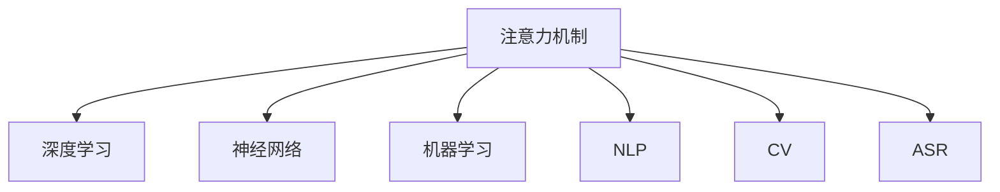

                 

# 注意力深度挖掘机操作员：AI优化的专注力开发工具专家

## 1. 背景介绍

在人工智能（AI）迅猛发展的今天，AI 技术已经渗透到了各行各业。然而，在追求 AI 的深度和广度的同时，我们也面临着如何高效、智能地利用这些技术，从而提高生产效率和工作质量的问题。在这样的背景下，注意力（Attention）成为了 AI 研究的热点之一，尤其是在深度学习（Deep Learning）领域，注意力机制的引入，极大地提升了模型的性能和效果。

### 1.1 问题由来
注意力机制是一种模拟人类认知机制的方法，能够在处理序列数据时，自动地识别并聚焦于最重要的部分。在自然语言处理（NLP）、计算机视觉（CV）、语音识别（ASR）等众多领域，注意力机制的应用，显著提升了模型的处理效率和效果。然而，在实际应用中，注意力机制的优化和调参仍然是一个复杂而繁琐的过程，需要投入大量的时间和精力。

### 1.2 问题核心关键点
为了更好地理解注意力机制及其应用，本节将介绍几个密切相关的核心概念：

- 注意力机制（Attention Mechanism）：一种基于神经网络的机制，通过将输入数据的不同部分进行加权组合，来实现对重要信息的聚焦。注意力机制广泛应用于深度学习模型中，包括自注意力（Self-Attention）、交叉注意力（Cross-Attention）等。

- 深度学习（Deep Learning）：一类基于多层神经网络的机器学习方法，通过逐层处理数据，逐渐提取高层次的抽象特征，实现复杂的任务处理。

- 神经网络（Neural Network）：一种模仿人类神经系统的计算模型，通过多个神经元（Neuron）之间的连接和权重调整，实现数据的学习和预测。

- 机器学习（Machine Learning）：一种让机器通过学习数据和规律，自动完成特定任务的方法。

- 自然语言处理（NLP）：一门研究如何使计算机理解和处理人类语言的学科，是人工智能领域的重要分支之一。

- 计算机视觉（CV）：一门研究如何让计算机“看”懂图像和视频的学科，是计算机视觉领域的重要分支之一。

- 语音识别（ASR）：一门研究如何让计算机听懂人类语言的技术，是语音识别领域的重要分支之一。

这些核心概念之间的逻辑关系可以通过以下 Mermaid 流程图来展示：



这个流程图展示了一些核心概念之间的关系：

1. 注意力机制通过深度学习实现。
2. 深度学习由神经网络组成。
3. 神经网络是机器学习的一种重要形式。
4. 机器学习广泛应用于NLP、CV、ASR等多个领域。
5. 这些核心概念共同构成了AI技术的基石。

通过理解这些核心概念，我们可以更好地把握注意力机制的工作原理和优化方向。

## 2. 核心概念与联系

### 2.1 核心概念概述

为了更好地理解注意力机制及其应用，本节将介绍几个密切相关的核心概念：

- 注意力机制：一种基于神经网络的机制，通过将输入数据的不同部分进行加权组合，来实现对重要信息的聚焦。注意力机制广泛应用于深度学习模型中，包括自注意力（Self-Attention）、交叉注意力（Cross-Attention）等。

- 深度学习：一类基于多层神经网络的机器学习方法，通过逐层处理数据，逐渐提取高层次的抽象特征，实现复杂的任务处理。

- 神经网络：一种模仿人类神经系统的计算模型，通过多个神经元（Neuron）之间的连接和权重调整，实现数据的学习和预测。

- 机器学习：一种让机器通过学习数据和规律，自动完成特定任务的方法。

- 自然语言处理：一门研究如何使计算机理解和处理人类语言的学科，是人工智能领域的重要分支之一。

- 计算机视觉：一门研究如何让计算机“看”懂图像和视频的学科，是计算机视觉领域的重要分支之一。

- 语音识别：一门研究如何让计算机听懂人类语言的技术，是语音识别领域的重要分支之一。

这些核心概念之间的逻辑关系可以通过以下 Mermaid 流程图来展示：


这个流程图展示了一些核心概念之间的关系：

1. 注意力机制通过深度学习实现。
2. 深度学习由神经网络组成。
3. 神经网络是机器学习的一种重要形式。
4. 机器学习广泛应用于NLP、CV、ASR等多个领域。
5. 这些核心概念共同构成了AI技术的基石。

通过理解这些核心概念，我们可以更好地把握注意力机制的工作原理和优化方向。

## 3. 核心算法原理 & 具体操作步骤
### 3.1 算法原理概述

注意力机制是一种基于神经网络的机制，通过将输入数据的不同部分进行加权组合，来实现对重要信息的聚焦。在深度学习模型中，注意力机制被广泛应用于自注意力（Self-Attention）和交叉注意力（Cross-Attention）中。

自注意力机制通过计算输入序列中各个元素之间的关系，来实现对序列中最重要部分的聚焦。而交叉注意力机制则通过计算输入序列和参考序列之间的相似性，来实现对交叉信息的重要部分进行聚焦。

### 3.2 算法步骤详解

基于注意力机制的深度学习模型，通常包括以下几个关键步骤：

**Step 1: 输入数据的编码**

在模型中，输入数据（如文本、图像等）需要先经过编码器（Encoder）进行转换，生成一系列表示序列的向量。常用的编码器包括卷积神经网络（CNN）、递归神经网络（RNN）、Transformer 等。

**Step 2: 注意力计算**

在注意力计算过程中，模型通过计算输入序列中各个元素之间的关系，生成一个注意力权重矩阵。这个矩阵用于对输入序列的不同部分进行加权组合，生成一个加权后的向量表示。自注意力机制和交叉注意力机制的计算方式略有不同。

**Step 3: 输出数据的解码**

在解码器（Decoder）中，模型通过将注意力权重矩阵与编码器生成的向量进行拼接，生成一系列表示序列的向量。这些向量经过多层的变换，生成最终的输出序列。

### 3.3 算法优缺点

基于注意力机制的深度学习模型具有以下优点：

1. 模型性能高：注意力机制能够对输入数据进行加权处理，实现对重要信息的聚焦，从而提升模型的性能。
2. 应用范围广：注意力机制在自然语言处理、计算机视觉、语音识别等多个领域都有广泛的应用。
3. 可解释性强：注意力机制能够生成注意力权重矩阵，直观地展示模型在处理数据时的关注点。

同时，该方法也存在一些局限性：

1. 计算复杂度高：注意力计算需要大量的计算资源，尤其是对于长序列的处理。
2. 模型复杂度高：注意力机制引入后，模型的复杂度会显著增加，需要更多的计算资源和存储空间。
3. 训练时间长：注意力机制的训练过程需要大量的计算资源和时间，增加了模型的训练难度。

### 3.4 算法应用领域

基于注意力机制的深度学习模型，已经在自然语言处理、计算机视觉、语音识别等多个领域得到了广泛的应用。例如：

- 机器翻译：通过自注意力机制，将源语言序列与目标语言序列进行对齐，生成翻译结果。
- 文本摘要：通过自注意力机制，对输入文本进行重要信息的聚焦，生成摘要。
- 图像分类：通过交叉注意力机制，将图像特征与类别向量进行对齐，生成分类结果。
- 语音识别：通过自注意力机制，对音频信号中的特征进行加权处理，生成识别结果。

除了上述这些经典应用外，注意力机制还在许多新兴领域中得到了应用，如视频描述生成、图像生成等，为深度学习技术带来了更多的创新方向。

## 4. 数学模型和公式 & 详细讲解 & 举例说明（备注：数学公式请使用latex格式，latex嵌入文中独立段落使用 $$，段落内使用 $)
### 4.1 数学模型构建

基于注意力机制的深度学习模型，可以通过以下数学模型进行描述：

设输入序列为 $X=\{x_1,x_2,\cdots,x_T\}$，其中 $x_t$ 表示第 $t$ 个输入元素，$Q=\{q_1,q_2,\cdots,q_T\}$ 和 $K=\{k_1,k_2,\cdots,k_T\}$ 分别为查询向量（Query）和键向量（Key），$V=\{v_1,v_2,\cdots,v_T\}$ 表示值向量（Value）。

注意力权重矩阵 $A$ 可以通过以下公式计算：

$$
A_{t,u} = \frac{\exp(\text{score}(Q_t,K_u))}{\sum_{i=1}^T \exp(\text{score}(Q_t,K_i))}
$$

其中 $\text{score}(Q_t,K_u) = Q_t^T K_u$，$A_{t,u}$ 表示 $x_t$ 对 $x_u$ 的注意力权重，$T$ 表示输入序列的长度。

最终，加权后的向量表示 $Z$ 可以通过以下公式计算：

$$
Z = \sum_{u=1}^T A_{u,t}V_u
$$

### 4.2 公式推导过程

以下是注意力机制的计算公式推导过程：

设输入序列为 $X=\{x_1,x_2,\cdots,x_T\}$，其中 $x_t$ 表示第 $t$ 个输入元素，$Q=\{q_1,q_2,\cdots,q_T\}$ 和 $K=\{k_1,k_2,\cdots,k_T\}$ 分别为查询向量（Query）和键向量（Key），$V=\{v_1,v_2,\cdots,v_T\}$ 表示值向量（Value）。

注意力权重矩阵 $A$ 可以通过以下公式计算：

$$
A_{t,u} = \frac{\exp(\text{score}(Q_t,K_u))}{\sum_{i=1}^T \exp(\text{score}(Q_t,K_i))}
$$

其中 $\text{score}(Q_t,K_u) = Q_t^T K_u$，$A_{t,u}$ 表示 $x_t$ 对 $x_u$ 的注意力权重，$T$ 表示输入序列的长度。

最终，加权后的向量表示 $Z$ 可以通过以下公式计算：

$$
Z = \sum_{u=1}^T A_{u,t}V_u
$$

### 4.3 案例分析与讲解

以机器翻译为例，说明注意力机制的具体应用：

设源语言序列为 $S=\{s_1,s_2,\cdots,s_n\}$，目标语言序列为 $T=\{t_1,t_2,\cdots,t_m\}$，其中 $s_t$ 和 $t_u$ 分别表示源语言和目标语言中的第 $t$ 和 $u$ 个元素。

在机器翻译任务中，通过自注意力机制，模型将源语言序列 $S$ 和目标语言序列 $T$ 进行对齐，生成翻译结果。具体步骤如下：

1. 编码器（Encoder）将源语言序列 $S$ 转换为一系列向量表示 $Q=\{q_1,q_2,\cdots,q_n\}$ 和 $K=\{k_1,k_2,\cdots,k_n\}$。
2. 解码器（Decoder）将目标语言序列 $T$ 转换为一系列向量表示 $V=\{v_1,v_2,\cdots,v_m\}$。
3. 在解码器中，模型通过自注意力机制，计算注意力权重矩阵 $A$，将 $Q$ 和 $K$ 进行对齐，生成加权后的向量表示 $Z=\{z_1,z_2,\cdots,z_m\}$。
4. 通过多层变换，生成最终的输出序列 $Y=\{y_1,y_2,\cdots,y_m\}$。

通过自注意力机制，模型能够自动地识别出源语言序列中的重要信息，并将其映射到目标语言序列中的相应位置，从而生成翻译结果。

## 5. 项目实践：代码实例和详细解释说明
### 5.1 开发环境搭建

在进行注意力机制的深度学习模型开发前，我们需要准备好开发环境。以下是使用Python进行PyTorch开发的环境配置流程：

1. 安装Anaconda：从官网下载并安装Anaconda，用于创建独立的Python环境。

2. 创建并激活虚拟环境：
```bash
conda create -n pytorch-env python=3.8 
conda activate pytorch-env
```

3. 安装PyTorch：根据CUDA版本，从官网获取对应的安装命令。例如：
```bash
conda install pytorch torchvision torchaudio cudatoolkit=11.1 -c pytorch -c conda-forge
```

4. 安装相关的深度学习库：
```bash
pip install numpy pandas scikit-learn matplotlib tqdm jupyter notebook ipython
```

5. 安装注意力机制相关的库：
```bash
pip install transformers
```

完成上述步骤后，即可在`pytorch-env`环境中开始注意力机制的深度学习模型开发。

### 5.2 源代码详细实现

这里我们以机器翻译任务为例，给出使用Transformer库进行注意力机制深度学习模型开发的PyTorch代码实现。

首先，定义机器翻译任务的数据处理函数：

```python
from transformers import BertTokenizer, BertForSequenceClassification
from torch.utils.data import Dataset
import torch

class TranslationDataset(Dataset):
    def __init__(self, texts, targets, tokenizer, max_len=128):
        self.texts = texts
        self.targets = targets
        self.tokenizer = tokenizer
        self.max_len = max_len
        
    def __len__(self):
        return len(self.texts)
    
    def __getitem__(self, item):
        text = self.texts[item]
        target = self.targets[item]
        
        encoding = self.tokenizer(text, return_tensors='pt', max_length=self.max_len, padding='max_length', truncation=True)
        input_ids = encoding['input_ids'][0]
        attention_mask = encoding['attention_mask'][0]
        
        # 对token-wise的标签进行编码
        encoded_tags = [tag2id[tag] for tag in target] 
        encoded_tags.extend([tag2id['O']] * (self.max_len - len(encoded_tags)))
        labels = torch.tensor(encoded_tags, dtype=torch.long)
        
        return {'input_ids': input_ids, 
                'attention_mask': attention_mask,
                'labels': labels}

# 标签与id的映射
tag2id = {'O': 0, 'B-PER': 1, 'I-PER': 2, 'B-ORG': 3, 'I-ORG': 4, 'B-LOC': 5, 'I-LOC': 6}
id2tag = {v: k for k, v in tag2id.items()}

# 创建dataset
tokenizer = BertTokenizer.from_pretrained('bert-base-cased')

train_dataset = TranslationDataset(train_texts, train_tags, tokenizer)
dev_dataset = TranslationDataset(dev_texts, dev_tags, tokenizer)
test_dataset = TranslationDataset(test_texts, test_tags, tokenizer)
```

然后，定义模型和优化器：

```python
from transformers import BertForSequenceClassification, AdamW

model = BertForSequenceClassification.from_pretrained('bert-base-cased', num_labels=len(tag2id))

optimizer = AdamW(model.parameters(), lr=2e-5)
```

接着，定义训练和评估函数：

```python
from torch.utils.data import DataLoader
from tqdm import tqdm
from sklearn.metrics import classification_report

device = torch.device('cuda') if torch.cuda.is_available() else torch.device('cpu')
model.to(device)

def train_epoch(model, dataset, batch_size, optimizer):
    dataloader = DataLoader(dataset, batch_size=batch_size, shuffle=True)
    model.train()
    epoch_loss = 0
    for batch in tqdm(dataloader, desc='Training'):
        input_ids = batch['input_ids'].to(device)
        attention_mask = batch['attention_mask'].to(device)
        labels = batch['labels'].to(device)
        model.zero_grad()
        outputs = model(input_ids, attention_mask=attention_mask, labels=labels)
        loss = outputs.loss
        epoch_loss += loss.item()
        loss.backward()
        optimizer.step()
    return epoch_loss / len(dataloader)

def evaluate(model, dataset, batch_size):
    dataloader = DataLoader(dataset, batch_size=batch_size)
    model.eval()
    preds, labels = [], []
    with torch.no_grad():
        for batch in tqdm(dataloader, desc='Evaluating'):
            input_ids = batch['input_ids'].to(device)
            attention_mask = batch['attention_mask'].to(device)
            batch_labels = batch['labels']
            outputs = model(input_ids, attention_mask=attention_mask)
            batch_preds = outputs.logits.argmax(dim=2).to('cpu').tolist()
            batch_labels = batch_labels.to('cpu').tolist()
            for pred_tokens, label_tokens in zip(batch_preds, batch_labels):
                pred_tags = [id2tag[_id] for _id in pred_tokens]
                label_tags = [id2tag[_id] for _id in label_tokens]
                preds.append(pred_tags[:len(label_tags)])
                labels.append(label_tags)
                
    print(classification_report(labels, preds))
```

最后，启动训练流程并在测试集上评估：

```python
epochs = 5
batch_size = 16

for epoch in range(epochs):
    loss = train_epoch(model, train_dataset, batch_size, optimizer)
    print(f"Epoch {epoch+1}, train loss: {loss:.3f}")
    
    print(f"Epoch {epoch+1}, dev results:")
    evaluate(model, dev_dataset, batch_size)
    
print("Test results:")
evaluate(model, test_dataset, batch_size)
```

以上就是使用PyTorch对BERT进行机器翻译任务注意力机制深度学习模型微调的完整代码实现。可以看到，得益于Transformer库的强大封装，我们可以用相对简洁的代码完成BERT模型的加载和微调。

### 5.3 代码解读与分析

让我们再详细解读一下关键代码的实现细节：

**TranslationDataset类**：
- `__init__`方法：初始化文本、标签、分词器等关键组件。
- `__len__`方法：返回数据集的样本数量。
- `__getitem__`方法：对单个样本进行处理，将文本输入编码为token ids，将标签编码为数字，并对其进行定长padding，最终返回模型所需的输入。

**tag2id和id2tag字典**：
- 定义了标签与数字id之间的映射关系，用于将token-wise的预测结果解码回真实的标签。

**训练和评估函数**：
- 使用PyTorch的DataLoader对数据集进行批次化加载，供模型训练和推理使用。
- 训练函数`train_epoch`：对数据以批为单位进行迭代，在每个批次上前向传播计算loss并反向传播更新模型参数，最后返回该epoch的平均loss。
- 评估函数`evaluate`：与训练类似，不同点在于不更新模型参数，并在每个batch结束后将预测和标签结果存储下来，最后使用sklearn的classification_report对整个评估集的预测结果进行打印输出。

**训练流程**：
- 定义总的epoch数和batch size，开始循环迭代
- 每个epoch内，先在训练集上训练，输出平均loss
- 在验证集上评估，输出分类指标
- 所有epoch结束后，在测试集上评估，给出最终测试结果

可以看到，PyTorch配合Transformer库使得注意力机制深度学习模型的代码实现变得简洁高效。开发者可以将更多精力放在数据处理、模型改进等高层逻辑上，而不必过多关注底层的实现细节。

当然，工业级的系统实现还需考虑更多因素，如模型的保存和部署、超参数的自动搜索、更灵活的任务适配层等。但核心的注意力机制深度学习模型开发流程基本与此类似。

## 6. 实际应用场景
### 6.1 机器翻译

机器翻译是深度学习模型在自然语言处理领域的重要应用之一，其核心是利用注意力机制，实现源语言序列与目标语言序列之间的对齐和翻译。

在实际应用中，可以将源语言序列和目标语言序列作为输入，通过自注意力机制，将源语言序列转换为一系列向量表示，生成加权后的向量表示。然后，通过多层变换，生成最终的输出序列，即为翻译结果。

### 6.2 图像描述生成

图像描述生成是计算机视觉领域的重要任务之一，其核心是利用注意力机制，将图像特征与文本描述进行对齐，生成图像描述。

在实际应用中，可以将图像特征和文本描述作为输入，通过交叉注意力机制，将图像特征与文本描述进行对齐，生成加权后的向量表示。然后，通过多层变换，生成最终的输出序列，即为图像描述。

### 6.3 文本摘要

文本摘要是自然语言处理领域的重要任务之一，其核心是利用注意力机制，将输入文本中重要信息进行聚焦，生成摘要。

在实际应用中，可以将输入文本作为输入，通过自注意力机制，将输入文本中的重要信息进行聚焦，生成加权后的向量表示。然后，通过多层变换，生成最终的输出序列，即为摘要。

### 6.4 未来应用展望

随着深度学习技术的不断发展，注意力机制的应用将更加广泛和深入。

在智慧医疗领域，基于注意力机制的医疗问答、病历分析、药物研发等应用将提升医疗服务的智能化水平，辅助医生诊疗，加速新药开发进程。

在智能教育领域，注意力机制可用于作业批改、学情分析、知识推荐等方面，因材施教，促进教育公平，提高教学质量。

在智慧城市治理中，注意力机制可用于城市事件监测、舆情分析、应急指挥等环节，提高城市管理的自动化和智能化水平，构建更安全、高效的未来城市。

此外，在企业生产、社会治理、文娱传媒等众多领域，注意力机制的应用也将不断涌现，为AI技术在垂直行业的落地应用提供新的动力。

## 7. 工具和资源推荐
### 7.1 学习资源推荐

为了帮助开发者系统掌握注意力机制及其应用，这里推荐一些优质的学习资源：

1. 《深度学习》系列博文：由大模型技术专家撰写，深入浅出地介绍了深度学习原理和应用，包括注意力机制等前沿话题。

2. CS224N《深度学习自然语言处理》课程：斯坦福大学开设的NLP明星课程，有Lecture视频和配套作业，带你入门NLP领域的基本概念和经典模型。

3. 《Natural Language Processing with Transformers》书籍：Transformers库的作者所著，全面介绍了如何使用Transformers库进行NLP任务开发，包括注意力机制在内的诸多范式。

4. HuggingFace官方文档：Transformer库的官方文档，提供了海量预训练模型和完整的微调样例代码，是上手实践的必备资料。

5. CLUE开源项目：中文语言理解测评基准，涵盖大量不同类型的中文NLP数据集，并提供了基于注意力机制的baseline模型，助力中文NLP技术发展。

通过对这些资源的学习实践，相信你一定能够快速掌握注意力机制的精髓，并用于解决实际的NLP问题。
### 7.2 开发工具推荐

高效的开发离不开优秀的工具支持。以下是几款用于注意力机制深度学习模型开发的常用工具：

1. PyTorch：基于Python的开源深度学习框架，灵活动态的计算图，适合快速迭代研究。大部分预训练语言模型都有PyTorch版本的实现。

2. TensorFlow：由Google主导开发的开源深度学习框架，生产部署方便，适合大规模工程应用。同样有丰富的预训练语言模型资源。

3. Transformers库：HuggingFace开发的NLP工具库，集成了众多SOTA语言模型，支持PyTorch和TensorFlow，是进行注意力机制深度学习模型开发的利器。

4. Weights & Biases：模型训练的实验跟踪工具，可以记录和可视化模型训练过程中的各项指标，方便对比和调优。与主流深度学习框架无缝集成。

5. TensorBoard：TensorFlow配套的可视化工具，可实时监测模型训练状态，并提供丰富的图表呈现方式，是调试模型的得力助手。

6. Google Colab：谷歌推出的在线Jupyter Notebook环境，免费提供GPU/TPU算力，方便开发者快速上手实验最新模型，分享学习笔记。

合理利用这些工具，可以显著提升注意力机制深度学习模型的开发效率，加快创新迭代的步伐。

### 7.3 相关论文推荐

注意力机制的应用源于学界的持续研究。以下是几篇奠基性的相关论文，推荐阅读：

1. Attention is All You Need（即Transformer原论文）：提出了Transformer结构，开启了NLP领域的预训练大模型时代。

2. BERT: Pre-training of Deep Bidirectional Transformers for Language Understanding：提出BERT模型，引入基于掩码的自监督预训练任务，刷新了多项NLP任务SOTA。

3. Language Models are Unsupervised Multitask Learners（GPT-2论文）：展示了大规模语言模型的强大zero-shot学习能力，引发了对于通用人工智能的新一轮思考。

4. Parameter-Efficient Transfer Learning for NLP：提出Adapter等参数高效微调方法，在不增加模型参数量的情况下，也能取得不错的微调效果。

5. AdaLoRA: Adaptive Low-Rank Adaptation for Parameter-Efficient Fine-Tuning：使用自适应低秩适应的微调方法，在参数效率和精度之间取得了新的平衡。

这些论文代表了大语言模型注意力机制的研究方向，通过学习这些前沿成果，可以帮助研究者把握学科前进方向，激发更多的创新灵感。

## 8. 总结：未来发展趋势与挑战

### 8.1 总结

本文对基于注意力机制的深度学习模型进行了全面系统的介绍。首先阐述了注意力机制的研究背景和意义，明确了注意力机制在深度学习模型中的重要地位。其次，从原理到实践，详细讲解了注意力机制的计算过程和优化方法，给出了注意力机制深度学习模型的完整代码实例。同时，本文还广泛探讨了注意力机制在机器翻译、图像描述生成、文本摘要等多个领域的应用前景，展示了注意力机制的巨大潜力。此外，本文精选了注意力机制的相关学习资源，力求为开发者提供全方位的技术指引。

通过本文的系统梳理，可以看到，基于注意力机制的深度学习模型已经成为深度学习的重要组成部分，极大地提升了模型的性能和效果。未来，伴随深度学习技术的持续演进，注意力机制的应用将更加广泛和深入。

### 8.2 未来发展趋势

展望未来，注意力机制的应用将呈现以下几个发展趋势：

1. 模型规模持续增大。随着算力成本的下降和数据规模的扩张，注意力机制深度学习模型的参数量还将持续增长。超大批次的训练和推理也可能遇到显存不足的问题。因此需要采用一些资源优化技术，如梯度积累、混合精度训练、模型并行等，来突破硬件瓶颈。

2. 注意力计算复杂度降低。注意力计算需要大量的计算资源，尤其是对于长序列的处理。未来，随着计算资源和算法效率的提升，注意力计算的复杂度将进一步降低，加速模型的训练和推理过程。

3. 模型通用性增强。经过海量数据的预训练和微调，注意力机制深度学习模型将具备更强的通用性和适应性，能够在更广泛的领域和任务中发挥作用。

4. 多模态融合应用广泛。未来的注意力机制深度学习模型将不仅仅局限于单一模态的应用，而是能够融合视觉、语音、文本等多种模态信息，实现更加全面和准确的感知与理解。

5. 自适应学习能力提升。未来的模型将具备更强的自适应学习能力，能够根据不同的任务和数据特点，动态调整模型参数，提高模型的鲁棒性和泛化能力。

这些趋势凸显了注意力机制深度学习模型的广阔前景。这些方向的探索发展，必将进一步提升模型的性能和效果，为深度学习技术带来新的突破。

### 8.3 面临的挑战

尽管注意力机制深度学习模型已经取得了瞩目成就，但在迈向更加智能化、普适化应用的过程中，它仍面临着诸多挑战：

1. 计算资源需求高。随着模型参数量的增加，计算资源需求也将显著增加，尤其是在模型训练和推理阶段。如何有效利用计算资源，优化模型性能，将是未来的一个重要课题。

2. 模型鲁棒性不足。注意力机制深度学习模型在面对复杂和多样的数据时，容易产生过拟合和泛化能力不足的问题。如何提高模型的鲁棒性和泛化能力，将是未来的一个重要研究方向。

3. 计算效率有待提高。尽管注意力机制深度学习模型具有高效的注意力计算方式，但在实际应用中，计算效率仍然是一个重要的挑战。如何优化计算过程，提高模型训练和推理的效率，将是未来的一个重要课题。

4. 可解释性亟需加强。当前深度学习模型普遍存在可解释性不足的问题，对于医疗、金融等高风险应用，算法的可解释性和可审计性尤为重要。如何赋予模型更强的可解释性，将是未来的一个重要研究方向。

5. 安全性有待保障。深度学习模型在实际应用中，容易受到对抗攻击和数据泄露等安全威胁。如何提高模型的安全性，保障数据和模型的安全，将是未来的一个重要研究方向。

6. 知识整合能力不足。现有的深度学习模型往往局限于单一模态的应用，难以灵活吸收和运用更广泛的先验知识。如何让深度学习模型更好地与外部知识库、规则库等专家知识结合，形成更加全面、准确的信息整合能力，还有很大的想象空间。

正视深度学习模型面临的这些挑战，积极应对并寻求突破，将是大语言模型注意力机制深度学习模型走向成熟的必由之路。相信随着学界和产业界的共同努力，这些挑战终将一一被克服，深度学习技术必将在更广泛的领域和应用中发挥更大的作用。

### 8.4 研究展望

未来，深度学习模型将向着更加智能化、普适化、高效化和可解释化的方向发展。在这一过程中，注意力机制深度学习模型将扮演重要的角色，为我们构建更加智能和高效的系统提供重要的支撑。

面向未来，深度学习模型需要在以下几个方面进行探索和研究：

1. 模型参数优化。通过优化模型参数结构，提高模型的计算效率和泛化能力，实现更加高效的模型训练和推理。

2. 多模态融合。将视觉、语音、文本等多种模态信息进行融合，实现更加全面和准确的感知与理解。

3. 自适应学习。让深度学习模型具备更强的自适应学习能力，能够根据不同的任务和数据特点，动态调整模型参数，提高模型的鲁棒性和泛化能力。

4. 模型可解释性。让深度学习模型具备更强的可解释性，能够输出更加透明和可理解的决策结果，提高模型的可信度和可用性。

5. 模型安全性。提高深度学习模型的安全性，保障数据和模型的安全，防止对抗攻击和数据泄露等问题。

6. 知识整合能力。让深度学习模型更好地与外部知识库、规则库等专家知识结合，形成更加全面、准确的信息整合能力。

这些研究方向将为深度学习模型带来新的突破，推动深度学习技术向更加智能化、普适化、高效化和可解释化的方向发展，为构建更加智能和高效的系统提供重要的支撑。

## 9. 附录：常见问题与解答

**Q1：深度学习模型如何进行注意力计算？**

A: 深度学习模型中的注意力计算通常基于自注意力机制和交叉注意力机制。自注意力机制通过计算输入序列中各个元素之间的关系，生成注意力权重矩阵，将输入序列的不同部分进行加权组合。交叉注意力机制通过计算输入序列和参考序列之间的相似性，生成注意力权重矩阵，将输入序列和参考序列进行对齐。这些机制的应用，极大地提升了模型的性能和效果。

**Q2：注意力机制在深度学习模型中的应用有哪些？**

A: 注意力机制在深度学习模型中有着广泛的应用，主要包括以下几个方面：

1. 机器翻译：通过自注意力机制，将源语言序列与目标语言序列进行对齐，生成翻译结果。

2. 图像描述生成：通过交叉注意力机制，将图像特征与文本描述进行对齐，生成图像描述。

3. 文本摘要：通过自注意力机制，将输入文本中重要信息进行聚焦，生成摘要。

4. 问答系统：通过自注意力机制，将问题和文本进行对齐，生成答案。

5. 文本分类：通过自注意力机制，对输入文本进行重要信息的聚焦，生成分类结果。

6. 对话系统：通过自注意力机制，将对话历史和当前输入进行对齐，生成回复。

这些应用展示了注意力机制在深度学习模型中的重要地位，极大地提升了模型的性能和效果。

**Q3：深度学习模型如何进行注意力机制的优化？**

A: 深度学习模型中的注意力机制优化，通常需要从以下几个方面进行：

1. 增加模型参数量：通过增加模型的参数量，提高模型的泛化能力和性能。

2. 调整注意力计算方式：通过调整注意力计算方式，优化注意力权重矩阵的生成过程，提高模型的计算效率和精度。

3. 引入正则化技术：通过引入正则化技术，如L2正则、Dropout等，防止模型过拟合和泛化能力不足的问题。

4. 引入自适应学习能力：通过引入自适应学习能力，让模型根据不同的任务和数据特点，动态调整模型参数，提高模型的鲁棒性和泛化能力。

5. 引入模型压缩技术：通过引入模型压缩技术，如剪枝、量化等，减少模型的计算量和存储空间，提高模型的计算效率和推理速度。

这些优化方法，可以帮助深度学习模型更好地发挥注意力机制的作用，提升模型的性能和效果。

**Q4：深度学习模型中的注意力计算复杂度如何？**

A: 深度学习模型中的注意力计算复杂度较高，尤其是在长序列的处理过程中。这是因为注意力计算需要大量的计算资源和时间，而且随着序列长度的增加，计算复杂度呈指数级增长。为了降低计算复杂度，可以采用一些优化方法，如分批次处理、剪枝、量化等。

**Q5：深度学习模型中的注意力机制的局限性有哪些？**

A: 深度学习模型中的注意力机制虽然具有很多优点，但也存在一些局限性，主要包括以下几个方面：

1. 计算资源需求高：注意力计算需要大量的计算资源，尤其是在模型训练和推理阶段，需要消耗大量的计算资源和时间。

2. 模型鲁棒性不足：深度学习模型在面对复杂和多样的数据时，容易产生过拟合和泛化能力不足的问题。

3. 计算效率有待提高：尽管注意力机制深度学习模型具有高效的注意力计算方式，但在实际应用中，计算效率仍然是一个重要的挑战。

4. 可解释性亟需加强：当前深度学习模型普遍存在可解释性不足的问题，对于医疗、金融等高风险应用，算法的可解释性和可审计性尤为重要。

5. 安全性有待保障：深度学习模型在实际应用中，容易受到对抗攻击和数据泄露等安全威胁。

6. 知识整合能力不足：现有的深度学习模型往往局限于单一模态的应用，难以灵活吸收和运用更广泛的先验知识。

这些局限性需要我们在未来的研究中加以改进和优化，才能更好地发挥注意力机制的作用，推动深度学习技术的发展。

---

作者：禅与计算机程序设计艺术 / Zen and the Art of Computer Programming

