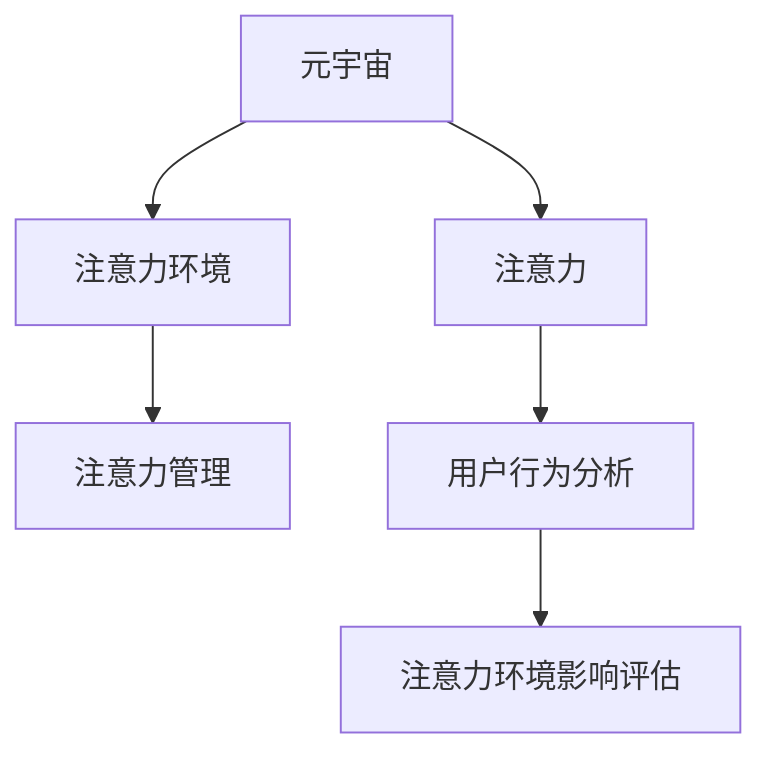

                 

# 注意力环境影响评估:元宇宙开发的生态考量

## 1. 背景介绍

随着人工智能和虚拟现实技术的飞速发展，元宇宙（Metaverse）的概念正在逐渐成为现实。元宇宙是一个庞大的虚拟世界，它不仅包括了沉浸式的3D环境，还融合了社交、经济、文化、教育等多个领域，为用户提供了一种全新的沉浸式体验。然而，元宇宙的开发和应用也带来了诸多问题，其中之一便是注意力环境（Attention Environment）的影响评估。

### 1.1 注意力环境的概念

注意力环境是指在元宇宙中，用户注意力被分配的方式和过程。在元宇宙中，用户会不断接收到来自不同设备和系统的信息，这些信息通过视觉、听觉、触觉等多种方式传递给用户，使用户的注意力被不同程度的吸引。注意力环境影响评估就是对这种信息传递方式和过程的评估，以确保元宇宙系统的设计能够最大化用户的参与度和满意度。

### 1.2 注意力环境影响评估的重要性

注意力环境影响评估在元宇宙开发中具有重要意义。元宇宙系统旨在提供沉浸式体验，但这种体验需要用户高度集中注意力。如果注意力环境设计不当，用户可能会感到疲劳、压力，甚至逃离元宇宙。因此，通过评估注意力环境，可以优化用户界面（UI）和用户体验（UX）设计，提高用户的参与度和满意度。

## 2. 核心概念与联系

### 2.1 核心概念概述

为了更好地理解注意力环境影响评估，需要介绍以下几个核心概念：

- **元宇宙（Metaverse）**：一种包含多个虚拟世界和现实的数字环境，其中用户可以自由交互和探索。
- **注意力（Attention）**：用户对特定信息的聚焦程度，影响其认知、情绪和行为。
- **注意力环境（Attention Environment）**：元宇宙中信息传递和用户互动的方式和过程。
- **注意力管理（Attention Management）**：通过设计和管理注意力环境，优化用户参与度。
- **用户行为分析（User Behavior Analysis）**：对用户在元宇宙中的行为进行分析，以评估注意力环境的影响。

这些概念之间的关系可以通过以下Mermaid流程图来展示：



## 3. 核心算法原理 & 具体操作步骤

### 3.1 算法原理概述

注意力环境影响评估的算法原理主要基于用户行为分析和注意力管理理论。通过对用户在元宇宙中的行为进行追踪和分析，可以了解用户的注意力分配情况，从而评估注意力环境的设计效果。注意力管理则旨在通过优化信息传递方式和用户互动过程，提高用户的参与度和满意度。

### 3.2 算法步骤详解

注意力环境影响评估的具体操作步骤如下：

#### Step 1: 数据收集

收集用户在元宇宙中的行为数据，包括点击次数、浏览时间、停留位置等。这些数据可以通过元宇宙平台提供的数据分析工具获取，也可以通过第三方工具进行采集。

#### Step 2: 数据预处理

对收集到的数据进行清洗和预处理，去除异常值和噪声数据。采用统计分析和数据挖掘技术，提取用户行为的基本特征，如浏览频率、停留时间、路径偏好等。

#### Step 3: 注意力分配分析

使用机器学习和深度学习技术，对用户的行为数据进行分析，评估注意力在不同信息之间的分配情况。常用的算法包括聚类分析、分类算法和回归分析等。

#### Step 4: 注意力环境优化

根据注意力分配分析的结果，对元宇宙中的信息传递方式和用户互动过程进行优化。例如，通过调整信息呈现的位置、颜色和大小，吸引用户注意力的同时避免视觉疲劳。

#### Step 5: 评估和迭代

通过用户行为分析和注意力管理理论，对优化后的注意力环境进行评估。评估指标包括用户满意度、参与度和留存率等。根据评估结果，迭代优化注意力环境设计，直到达到最佳效果。

### 3.3 算法优缺点

注意力环境影响评估算法具有以下优点：

- 可量化和可评估：通过数据驱动的方式，可以定量评估注意力环境的设计效果。
- 灵活性高：可以根据用户行为的变化和反馈，动态调整注意力环境的设计。

然而，该算法也存在一些缺点：

- 数据隐私问题：在收集和处理用户数据时，需要注意保护用户隐私，避免数据泄露。
- 技术复杂性：算法需要高水平的机器学习和数据挖掘技术，对开发者的要求较高。
- 评估结果的准确性：如果数据收集和处理不当，可能会导致评估结果不准确。

### 3.4 算法应用领域

注意力环境影响评估在元宇宙开发中具有广泛应用，主要包括以下几个领域：

- 虚拟现实应用：如虚拟旅游、虚拟展览、虚拟购物等。通过优化注意力环境，提升用户的沉浸感和体验。
- 游戏开发：如多人在线游戏、虚拟现实游戏等。通过管理用户注意力，增强游戏互动性和参与度。
- 社交平台：如虚拟社交网络、虚拟社区等。通过优化信息传递方式，提高用户社交体验。
- 教育培训：如虚拟课堂、虚拟实验室等。通过设计合适的注意力环境，提高教育培训的效果。

## 4. 数学模型和公式 & 详细讲解 & 举例说明

### 4.1 数学模型构建

注意力环境影响评估的数学模型主要基于用户行为数据和注意力管理理论。以下是基本的数学模型构建方法：

- **用户行为模型**：描述用户在元宇宙中的行为，通常使用时间序列模型、马尔科夫模型等。
- **注意力分配模型**：描述用户在不同信息之间的注意力分配，可以使用加权和模型、线性回归模型等。
- **注意力环境优化模型**：描述如何通过优化信息传递方式和用户互动过程，提高用户的参与度和满意度。

### 4.2 公式推导过程

以线性回归模型为例，推导注意力分配模型的公式。设 $y_i$ 为用户在信息 $i$ 上的注意力，$x_i$ 为信息 $i$ 的特征向量，$\beta$ 为模型参数，则线性回归模型的公式为：

$$
y_i = \beta_0 + \beta_1 x_{i1} + \beta_2 x_{i2} + \ldots + \beta_n x_{in}
$$

其中，$\beta_0$ 为截距项，$\beta_1, \beta_2, \ldots, \beta_n$ 为模型系数，$x_{i1}, x_{i2}, \ldots, x_{in}$ 为信息 $i$ 的特征向量。

### 4.3 案例分析与讲解

假设我们在开发一个虚拟旅游应用，收集用户在不同景点上的停留时间和浏览深度。根据用户行为数据，使用线性回归模型进行注意力分配分析，得到以下结果：

| 景点名称 | 停留时间（秒） | 浏览深度（层） | 注意力系数（$\beta_i$） |
|---|---|---|---|
| 故宫 | 300 | 3 | 0.5 |
| 长城 | 500 | 2 | 0.3 |
| 颐和园 | 400 | 4 | 0.7 |

根据注意力系数，可以发现用户对颐和园的注意力高于故宫和长城，因此可以优化信息呈现方式，提高颐和园的曝光率，吸引更多用户停留和探索。

## 5. 项目实践：代码实例和详细解释说明

### 5.1 开发环境搭建

为了进行注意力环境影响评估的开发实践，需要搭建以下开发环境：

- 安装Python：从官网下载并安装Python 3.6及以上版本。
- 安装TensorFlow：使用pip命令安装TensorFlow 2.x版本。
- 安装Pandas：使用pip命令安装Pandas库，用于数据处理。
- 安装Scikit-learn：使用pip命令安装Scikit-learn库，用于机器学习和数据挖掘。
- 安装Matplotlib：使用pip命令安装Matplotlib库，用于数据可视化。

### 5.2 源代码详细实现

以下是使用Python、TensorFlow和Pandas进行注意力环境影响评估的代码实现：

```python
import pandas as pd
import tensorflow as tf
from sklearn.linear_model import LinearRegression

# 读取用户行为数据
data = pd.read_csv('user_behavior.csv')

# 数据预处理
data = data.dropna()
X = data.drop('attention', axis=1)
y = data['attention']

# 建立线性回归模型
model = LinearRegression()
model.fit(X, y)

# 预测用户注意力分配
X_test = pd.read_csv('user_behavior_test.csv')
y_pred = model.predict(X_test)

# 数据可视化
import matplotlib.pyplot as plt
plt.scatter(X_test['feature1'], y_pred)
plt.xlabel('Feature 1')
plt.ylabel('Attention')
plt.show()
```

### 5.3 代码解读与分析

以上代码实现了线性回归模型的训练和预测。其中，`pd.read_csv`函数用于读取CSV格式的用户行为数据，`dropna`函数用于去除缺失值，`LinearRegression`类用于建立线性回归模型，`fit`函数用于训练模型，`predict`函数用于预测注意力分配。

## 6. 实际应用场景

### 6.1 虚拟旅游应用

在虚拟旅游应用中，通过优化注意力环境，可以提升用户对景点的停留时间和浏览深度，从而提高用户的沉浸感和满意度。例如，在故宫展览中，可以增加展览的互动性，如虚拟导览、历史知识测试等，吸引用户停留和探索。

### 6.2 游戏开发

在游戏开发中，通过优化注意力环境，可以提高游戏的互动性和用户参与度。例如，在多人在线游戏中，可以设计动态的游戏任务，吸引用户参与和竞争，增加游戏趣味性。

### 6.3 社交平台

在社交平台中，通过优化注意力环境，可以提高用户的社交体验和参与度。例如，在虚拟社交网络中，可以优化用户界面设计，增强信息呈现的多样性和互动性，提升用户的社交体验。

### 6.4 教育培训

在教育培训中，通过优化注意力环境，可以提高教育培训的效果和用户参与度。例如，在虚拟实验室中，可以设计互动性强的实验场景，增强用户的学习兴趣和效果。

## 7. 工具和资源推荐

### 7.1 学习资源推荐

为了帮助开发者系统掌握注意力环境影响评估的理论基础和实践技巧，这里推荐一些优质的学习资源：

1. 《注意力机制：深度学习中的注意力机制》系列博文：由人工智能专家撰写，深入浅出地介绍了注意力机制的基本原理和应用。
2. 《元宇宙技术》课程：清华大学开设的元宇宙技术课程，涵盖了元宇宙的基本概念、关键技术和应用场景。
3. 《机器学习实战》书籍：Python机器学习实战指南，涵盖机器学习模型的建立和应用。
4. 《深度学习》书籍：斯坦福大学开设的深度学习课程，涵盖深度学习模型的理论和实践。
5. 《自然语言处理与深度学习》课程：北京大学开设的自然语言处理课程，涵盖自然语言处理的基本概念和前沿技术。

通过对这些资源的学习实践，相信你一定能够快速掌握注意力环境影响评估的精髓，并用于解决实际的元宇宙问题。

### 7.2 开发工具推荐

高效的开发离不开优秀的工具支持。以下是几款用于注意力环境影响评估开发的常用工具：

1. Python：开源编程语言，具有丰富的第三方库和工具，适合快速迭代研究。
2. TensorFlow：由Google主导开发的深度学习框架，适合大规模工程应用。
3. Scikit-learn：Python科学计算库，包含各种机器学习算法，适合数据处理和模型训练。
4. Pandas：Python数据分析库，适合处理结构化数据和数据预处理。
5. Matplotlib：Python绘图库，适合数据可视化。

合理利用这些工具，可以显著提升注意力环境影响评估任务的开发效率，加快创新迭代的步伐。

### 7.3 相关论文推荐

注意力环境影响评估在元宇宙开发中具有重要意义。以下是几篇奠基性的相关论文，推荐阅读：

1. 《注意力机制在深度学习中的应用》：介绍注意力机制的基本原理和应用，涵盖注意力机制在自然语言处理、计算机视觉等领域的应用。
2. 《元宇宙的注意力环境优化》：介绍元宇宙中的注意力环境优化方法，涵盖注意力分配、注意力管理等方面的研究。
3. 《元宇宙中的用户行为分析》：介绍用户行为分析的基本方法和技术，涵盖用户行为建模、注意力分配等方面的研究。
4. 《注意力机制在元宇宙中的应用》：介绍注意力机制在元宇宙中的应用，涵盖虚拟旅游、虚拟社交等方面的研究。

这些论文代表了大规模语言模型微调技术的发展脉络。通过学习这些前沿成果，可以帮助研究者把握学科前进方向，激发更多的创新灵感。

## 8. 总结：未来发展趋势与挑战

### 8.1 研究成果总结

本文对注意力环境影响评估在元宇宙开发中的应用进行了全面系统的介绍。首先阐述了注意力环境的概念和重要性，明确了注意力环境影响评估在元宇宙开发中的关键作用。其次，从原理到实践，详细讲解了注意力环境影响评估的算法原理和操作步骤，给出了注意力环境影响评估任务开发的完整代码实例。同时，本文还广泛探讨了注意力环境影响评估在虚拟旅游、游戏开发、社交平台和教育培训等多个行业领域的应用前景，展示了注意力环境影响评估范式的巨大潜力。此外，本文精选了注意力环境影响评估技术的各类学习资源，力求为读者提供全方位的技术指引。

通过本文的系统梳理，可以看到，注意力环境影响评估在元宇宙开发中具有重要意义。通过评估注意力环境，可以优化用户界面和用户体验设计，提高用户的参与度和满意度。未来，伴随元宇宙技术的不断发展和优化，注意力环境影响评估将发挥更加重要的作用，为元宇宙系统的设计提供强有力的支持。

### 8.2 未来发展趋势

展望未来，注意力环境影响评估技术将呈现以下几个发展趋势：

1. 更加智能化：通过引入深度学习和自然语言处理技术，实现更加智能化的注意力分配和优化。
2. 更加个性化：根据用户行为和偏好，动态调整注意力环境，提供更加个性化的用户体验。
3. 更加实时化：通过实时数据分析和反馈机制，动态优化注意力环境，提高用户的参与度和满意度。
4. 更加多模态：引入图像、声音、文本等多模态信息，实现更加全面和丰富的注意力环境设计。
5. 更加跨平台：在多个平台和设备上进行注意力环境设计，实现跨平台和跨设备的无缝衔接。
6. 更加安全性：在注意力环境设计中引入安全性考虑，确保用户数据和信息的安全性。

以上趋势凸显了注意力环境影响评估技术的广阔前景。这些方向的探索发展，必将进一步提升元宇宙系统的性能和用户体验，为元宇宙技术的广泛应用提供强有力的支持。

### 8.3 面临的挑战

尽管注意力环境影响评估技术已经取得了瞩目成就，但在迈向更加智能化、普适化应用的过程中，它仍面临着诸多挑战：

1. 数据隐私问题：在收集和处理用户数据时，需要注意保护用户隐私，避免数据泄露。
2. 技术复杂性：算法需要高水平的深度学习和数据挖掘技术，对开发者的要求较高。
3. 评估结果的准确性：如果数据收集和处理不当，可能会导致评估结果不准确。
4. 跨平台兼容性：在不同的平台和设备上进行注意力环境设计，需要考虑兼容性和一致性问题。
5. 安全性问题：在注意力环境设计中引入安全性考虑，确保用户数据和信息的安全性。

这些挑战需要通过技术创新和制度保障来解决，才能确保注意力环境影响评估技术的可持续发展和应用。

### 8.4 研究展望

未来的研究需要在以下几个方面寻求新的突破：

1. 引入更多跨学科知识：将心理学、社会学、人机交互等领域知识引入注意力环境设计，提高设计的科学性和合理性。
2. 探索更加多样化的数据源：引入多模态数据源，提高注意力环境设计的全面性和丰富性。
3. 优化算法和模型：引入新的机器学习算法和模型，提高注意力分配和优化的精度和效率。
4. 提高用户体验的互动性：引入用户行为数据分析和反馈机制，动态优化注意力环境设计，提高用户的参与度和满意度。
5. 实现跨平台和跨设备无缝衔接：在不同平台和设备上进行注意力环境设计，实现无缝衔接和一致性。

这些研究方向的探索，必将引领注意力环境影响评估技术迈向更高的台阶，为元宇宙系统的设计提供强有力的支持。面向未来，注意力环境影响评估技术还需要与其他人工智能技术进行更深入的融合，如知识表示、因果推理、强化学习等，多路径协同发力，共同推动元宇宙技术的进步。只有勇于创新、敢于突破，才能不断拓展注意力环境影响评估技术的边界，让元宇宙技术更好地造福人类社会。

## 9. 附录：常见问题与解答

**Q1：注意力环境影响评估是否适用于所有元宇宙应用？**

A: 注意力环境影响评估在大多数元宇宙应用上都能取得不错的效果，特别是对于用户参与度要求较高的应用。但对于一些特殊应用，如科学实验、游戏任务等，可能需要结合具体的场景进行优化。

**Q2：如何选择合适的注意力环境设计方法？**

A: 选择注意力环境设计方法时，需要根据元宇宙应用的具体需求和用户行为特点进行综合考虑。例如，对于虚拟社交网络，可以采用社交推荐和信息过滤等方法，吸引用户参与和互动。对于虚拟购物，可以采用产品推荐和个性化广告等方法，提高用户购买意愿。

**Q3：如何评估注意力环境设计的效果？**

A: 评估注意力环境设计的效果通常需要多方面的指标，如用户参与度、满意度、留存率等。可以通过问卷调查、用户反馈、行为数据分析等手段进行评估。同时，可以通过A/B测试等方法，对比不同注意力环境设计的效果，选择最优方案。

**Q4：注意力环境影响评估在数据隐私保护方面需要注意哪些问题？**

A: 在注意力环境影响评估中，需要注意保护用户隐私，避免数据泄露。可以采用数据匿名化、加密传输、访问控制等措施，确保用户数据的安全性。同时，需要在元宇宙系统中引入隐私保护机制，如隐私计算、差分隐私等，保护用户隐私。

**Q5：注意力环境影响评估在实际应用中是否需要持续优化？**

A: 是的，注意力环境影响评估是一个动态的过程，需要持续优化。在元宇宙系统上线后，需要不断收集用户行为数据，进行分析和优化，以适应用户的变化和需求。同时，可以引入用户反馈机制，实时调整注意力环境设计，提高用户的参与度和满意度。

---

作者：禅与计算机程序设计艺术 / Zen and the Art of Computer Programming

