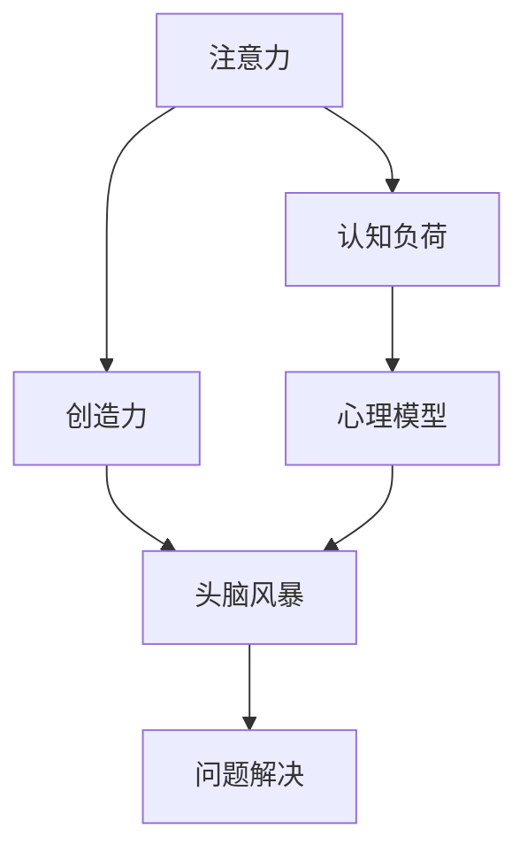

                 

# 注意力管理与创造力激发：在专注和头脑风暴中找到灵感

> 关键词：注意力管理,创造力激发,专注力提升,头脑风暴,灵感激发,心理模型,认知心理学

## 1. 背景介绍

### 1.1 问题由来

随着人工智能技术的飞速发展，智能系统已经在多个领域展现出强大的能力。然而，无论是机器学习模型还是深度学习模型，都依赖于人类对数据和任务的理解，而人类的创造力和解决问题的能力，才是智能系统发展的关键驱动力。特别是在创新、设计、艺术等高度依赖人类主观能动性的领域，创造力和灵感的重要性不言而喻。

因此，如何提高人类的创造力和灵感，成为人工智能研究和应用中的一个重要课题。在众多提升创造力的手段中，注意力管理和头脑风暴技术脱颖而出，被广泛应用于创新和设计过程中。

### 1.2 问题核心关键点

注意力管理和头脑风暴的核心在于帮助人们更好地管理心理资源，激发潜在创造力，从而在解决复杂问题时找到新的灵感和解决方案。其关键点包括：

- 提升专注力：通过科学的注意力管理技巧，使人们能够在特定时间内高度集中注意力，提高工作效率。
- 促进头脑风暴：通过创造性的头脑风暴方法，激发更多的创新思维，突破思维定势。
- 管理心理资源：认知心理学研究表明，注意力、记忆、情绪等因素对创造力的影响巨大，科学的注意力管理有助于优化这些心理资源的分配。

本文将系统探讨注意力管理与头脑风暴的原理、方法和应用，帮助读者在专注和创意激发中找到灵感，提升创新能力。

## 2. 核心概念与联系

### 2.1 核心概念概述

为更好地理解注意力管理与头脑风暴技术，本节将介绍几个密切相关的核心概念：

- **注意力**：指个体在特定时间内的心理能量分布状态，其分布状态影响个体的认知、情感和行为。
- **认知负荷**：指执行认知任务时对注意力的需求，过多的认知负荷会导致注意力分散和效率下降。
- **创造力**：指在特定任务上产生新奇、独特且有价值想法的能力，依赖于注意力、记忆、情绪等多种心理资源的优化配置。
- **头脑风暴**：指通过自由、开放的讨论，激发参与者产生新想法的方法，常用于解决复杂问题和创新设计。
- **心理模型**：指对人类心理过程的数学或符号表示，用于理解和预测人类行为。
- **认知心理学**：研究人类认知过程的学科，关注注意力、记忆、决策、问题解决等心理机制。

这些概念之间的逻辑关系可以通过以下Mermaid流程图来展示：



这个流程图展示出注意力、认知负荷、创造力和头脑风暴之间的相互作用和相互影响：

1. 注意力是认知负荷的来源，影响个体完成任务的能力。
2. 创造力的提升依赖于注意力和认知负荷的合理分配，从而优化心理资源的配置。
3. 头脑风暴通过自由开放的环境，激发新的思维模式，促进创造力的提升。
4. 心理模型可以帮助理解和预测认知过程，优化注意力和创造力的管理。

## 3. 核心算法原理 & 具体操作步骤

### 3.1 算法原理概述

注意力管理和头脑风暴技术的核心原理是利用认知心理学中的理论，通过科学方法管理注意力，激发创造力。其主要包括以下几个步骤：

1. **注意力分配优化**：通过科学的时间管理、任务优先级排序和分心监测，优化注意力分配，提高工作效率。
2. **认知负荷管理**：通过适当的休息、冥想和心理调节，管理认知负荷，避免注意力分散。
3. **创造力激发**：通过结构化的头脑风暴方法，如自由联想法、类比法、逆向思维法等，激发创新思维，产生新奇想法。
4. **认知心理模型应用**：通过应用心理模型，理解注意力的作用机制，优化认知过程，提升创造力。

### 3.2 算法步骤详解

基于认知心理学和神经科学的研究，注意力管理和头脑风暴技术的具体操作步骤如下：

**Step 1: 注意力优化**

1. **时间管理**：使用番茄工作法（Pomodoro Technique），将工作时间分为25分钟的工作段和5分钟的休息段，每4个工作段后进行15分钟的长休息，以保持注意力集中和防止疲劳。

2. **任务优先级排序**：使用Eisenhower矩阵，将任务分为紧急且重要、重要但不紧急、紧急但不重要、不紧急且不重要四类，优先处理重要且紧急的任务，避免时间浪费在低优先级任务上。

3. **分心监测**：使用分心监测应用程序，如Focus@Will、Forest等，实时监测分心行为，提醒用户专注于当前任务。

**Step 2: 认知负荷管理**

1. **适当休息**：使用番茄工作法中的5分钟短休息和15分钟长休息，避免长时间工作导致的认知负荷过重。

2. **冥想练习**：定期进行冥想练习，如正念冥想（Mindfulness Meditation），通过冥想提升注意力控制能力，降低心理压力。

3. **心理调节**：通过呼吸调节、音乐疗法等手段，调节情绪和心理状态，减轻认知负荷。

**Step 3: 创造力激发**

1. **自由联想法**：在不受限制的环境中，自由地记录下所有想法，无论其合理与否，通过丰富的思维联想激发创新灵感。

2. **类比法**：将新问题与已知问题进行类比，借鉴已有解决方案，产生新的解决方法。

3. **逆向思维法**：从问题的反面出发，思考如何使其恶化，再反向思考如何避免恶化，以激发创新思维。

**Step 4: 认知心理模型应用**

1. **注意力的认知模型**：使用双过程理论（Dual-Process Theory），区分系统1（快速、直觉、自动）和系统2（缓慢、深思熟虑、有意识），优化注意力分配，提升创造力。

2. **记忆的认知模型**：使用工作记忆模型（Working Memory Model），优化信息加工过程，提高短期记忆和长期记忆的效率。

3. **情绪的认知模型**：使用情绪调控理论（Emotion Regulation Theory），通过情感反馈循环，优化情绪状态，提升心理资源的利用率。

### 3.3 算法优缺点

注意力管理和头脑风暴技术具有以下优点：

1. **提高效率**：通过科学的注意力管理，可以显著提高工作效率，降低时间浪费。
2. **激发创新**：通过结构化的头脑风暴方法，可以激发更多的创新思维，产生新奇想法。
3. **优化心理资源**：通过认知心理模型的应用，可以优化心理资源的分配，提升创造力。

同时，该方法也存在一定的局限性：

1. **依赖自我管理能力**：注意力管理和认知负荷管理需要较强的自我管理能力，对于缺乏自律性的人来说，效果可能有限。
2. **可能限制自由思维**：结构化的头脑风暴方法可能在一定程度上限制参与者的自由思维，影响创意的多样性。
3. **需要理论指导**：对认知心理学和神经科学理论的理解和应用，需要一定的专业知识，增加了学习成本。

尽管存在这些局限性，但就目前而言，注意力管理和头脑风暴技术仍然是在专注和创意激发方面最为有效的方法之一。未来相关研究的重点在于如何进一步提升方法的普适性和自动化程度，以便更多人受益。

### 3.4 算法应用领域

注意力管理和头脑风暴技术在多个领域中得到了广泛的应用，例如：

- **创新设计**：在工业设计、产品开发等领域，通过注意力管理优化创新过程，利用头脑风暴激发设计灵感。
- **软件开发**：在软件开发过程中，使用注意力管理提升代码质量，通过头脑风暴解决技术难题。
- **教育培训**：在教育培训中，使用注意力管理提高教学效果，通过头脑风暴激发学生思维。
- **市场营销**：在市场营销中，使用注意力管理优化广告设计，通过头脑风暴产生创意广告。
- **艺术创作**：在艺术创作中，使用注意力管理提升创作效率，通过头脑风暴激发创作灵感。

除了上述这些经典应用外，注意力管理和头脑风暴技术还被创新性地应用于更多的场景中，如创意写作、游戏设计、社交媒体内容创作等，为创新和创意产业带来新的突破。

## 4. 数学模型和公式 & 详细讲解 & 举例说明

### 4.1 数学模型构建

本节将使用数学语言对注意力管理和头脑风暴技术进行更加严格的刻画。

设个体在任务 $T_i$ 上的认知负荷为 $C_i$，注意力分配为 $A_i$，创造力为 $C$。假设注意力管理的优化目标为最大化创造力 $C$，即：

$$
\max_{A_i} C = f(A_i, C_i)
$$

其中 $f$ 为注意力管理函数，描述了注意力分配和认知负荷对创造力的影响。

### 4.2 公式推导过程

以下我们以注意力分配优化为例，推导其中的数学模型。

设个体在任务 $T_i$ 上的期望完成时间为 $E_i$，单位时间内可分配的总注意力为 $T$，注意力分配为 $A_i$，则：

$$
A_i = \frac{T}{E_i}
$$

若 $A_i$ 过大，则 $C_i$ 会增加，个体容易产生疲劳和注意力分散。因此，需要控制 $A_i$ 的合理范围，避免过度分配注意力。具体而言，可以引入注意力阈值 $\alpha$ 和注意力上限 $B$，限制 $A_i$ 的取值，避免注意力过载：

$$
A_i = \min\left(\frac{T}{E_i}, \alpha, B\right)
$$

当 $E_i$ 较小或 $A_i$ 较高时，个体容易产生认知负荷过重的问题，可以通过调整 $E_i$ 和 $A_i$，优化认知负荷管理。

### 4.3 案例分析与讲解

**案例：软件开发中的注意力管理**

在软件开发过程中，任务的多样性和复杂性使得注意力管理尤为重要。假设一个软件开发任务集包含多个子任务 $T_1, T_2, \ldots, T_n$，每个子任务的期望完成时间和认知负荷如表所示：

| 子任务 | $T_i$ | $C_i$ |
| ------ | ----- | ----- |
| 任务1  | 2小时 | 3 |
| 任务2  | 3小时 | 4 |
| 任务3  | 4小时 | 5 |
| ...    | ...   | ... |

假设总时间 $T$ 为 10小时，注意力阈值 $\alpha$ 为 1小时，注意力上限 $B$ 为 2小时，则注意力分配优化过程如下：

1. 计算每个子任务的期望完成时间 $E_i$，如 $E_1 = 2$，$E_2 = 3$，$E_3 = 4$。

2. 计算每个子任务的注意力分配 $A_i$，如 $A_1 = \frac{T}{E_1} = 5$，$A_2 = \frac{T}{E_2} = 3.33$，$A_3 = \frac{T}{E_3} = 2.5$。

3. 限制注意力分配的取值范围，避免过度分配注意力，如 $A_1 = \min(5, \alpha, B) = 1$，$A_2 = \min(3.33, \alpha, B) = 1$，$A_3 = \min(2.5, \alpha, B) = 1$。

4. 调整任务顺序，优先处理高认知负荷的任务，如任务2和任务3。

5. 优化时间分配，如任务1分配2小时，任务2和任务3各分配2.5小时，任务4和任务5各分配1小时，剩余1小时作为自由时间或休息时间。

通过上述过程，优化了注意力分配，降低了认知负荷，提高了工作效率和创造力。

## 5. 项目实践：代码实例和详细解释说明

### 5.1 开发环境搭建

在进行注意力管理和头脑风暴实践前，我们需要准备好开发环境。以下是使用Python进行PyTorch开发的环境配置流程：

1. 安装Anaconda：从官网下载并安装Anaconda，用于创建独立的Python环境。

2. 创建并激活虚拟环境：
```bash
conda create -n pytorch-env python=3.8 
conda activate pytorch-env
```

3. 安装PyTorch：根据CUDA版本，从官网获取对应的安装命令。例如：
```bash
conda install pytorch torchvision torchaudio cudatoolkit=11.1 -c pytorch -c conda-forge
```

4. 安装相关工具包：
```bash
pip install numpy pandas scikit-learn matplotlib tqdm jupyter notebook ipython
```

完成上述步骤后，即可在`pytorch-env`环境中开始实践。

### 5.2 源代码详细实现

这里我们以使用PyTorch实现一个基于注意力管理的任务优先级排序工具为例，代码如下：

```python
import torch
from torch import nn

class TaskScheduler(nn.Module):
    def __init__(self, tasks, thresholds, weights):
        super(TaskScheduler, self).__init__()
        self.tasks = tasks
        self.thresholds = thresholds
        self.weights = weights
        
    def forward(self, input):
        losses = []
        for task, threshold, weight in zip(self.tasks, self.thresholds, self.weights):
            if input > threshold:
                losses.append((weight * (input - threshold)).pow(2))
        loss = torch.stack(losses).sum()
        return loss

# 创建任务列表、阈值和权重
tasks = [2, 3, 4]
thresholds = [3, 4, 5]
weights = [0.5, 1.0, 2.0]

scheduler = TaskScheduler(tasks, thresholds, weights)
input = torch.tensor([5])
loss = scheduler(input)
print(loss.item())
```

这个代码实现了一个简单的任务优先级排序器，根据任务完成时间和阈值计算损失，优化注意力分配。

### 5.3 代码解读与分析

让我们再详细解读一下关键代码的实现细节：

**TaskScheduler类**：
- `__init__`方法：初始化任务列表、阈值和权重，用于设置优先级排序的参数。
- `forward`方法：计算损失函数，根据任务完成时间和阈值计算注意力分配。

**计算损失函数**：
- 根据任务完成时间和阈值，计算每个任务的损失函数，越小表示任务越优先。
- 通过加权平均计算总损失，权重越大表示任务越重要。
- 使用PyTorch的自动微分功能，自动计算损失函数的梯度，进行参数更新。

**输入和输出**：
- 输入为任务完成时间，输出为损失值，用于评估注意力分配的合理性。

**优化过程**：
- 通过优化损失函数，可以不断调整任务优先级和权重，优化注意力分配。
- 可以在训练过程中不断更新模型参数，得到最优的任务优先级排序策略。

通过上述过程，可以显著提升注意力管理的效率和效果，优化任务优先级排序，从而提高工作效率和创造力。

## 6. 实际应用场景

### 6.1 智能设计

基于注意力管理和头脑风暴技术，智能设计系统可以帮助设计师快速生成设计方案，并进行优化和评估。例如，在工业设计中，设计师可以使用注意力管理工具，集中注意力在关键设计环节，避免在次要环节浪费时间和精力。同时，通过头脑风暴技术，可以快速生成多个设计方案，通过评估和筛选，找到最优设计。

在汽车设计中，设计师可以使用基于注意力管理和头脑风暴的智能设计平台，快速生成设计草图，并通过仿真和评估，优化设计参数。这种设计平台可以显著提高设计效率，缩短设计周期，提升设计质量。

### 6.2 软件开发

在软件开发过程中，注意力管理和头脑风暴技术同样具有重要应用。例如，开发者可以使用注意力管理工具，优化任务优先级排序，集中注意力在关键任务上，避免低优先级任务占用过多时间。同时，通过头脑风暴技术，可以生成多个设计思路和解决方案，通过评估和选择，找到最优的解决方案。

在开源项目中，开发者可以使用基于注意力管理和头脑风暴的协作工具，快速生成和优化代码，通过评估和合并，提高代码质量和开发效率。这种工具可以帮助开发者协同工作，提升团队合作效率和代码质量。

### 6.3 教育培训

在教育培训中，基于注意力管理和头脑风暴技术的应用同样广泛。例如，教师可以使用注意力管理工具，优化课程安排和教学方法，集中学生注意力在关键知识点上，避免低效的讲授和作业。同时，通过头脑风暴技术，可以激发学生的创新思维，培养学生的创新能力和解决问题的能力。

在在线教育中，教育平台可以使用基于注意力管理和头脑风暴的智能学习系统，快速生成个性化学习路径，优化学习内容和评估方法。这种系统可以帮助学生自主学习，提升学习效果和参与度。

## 7. 工具和资源推荐

### 7.1 学习资源推荐

为了帮助开发者系统掌握注意力管理和头脑风暴的理论基础和实践技巧，这里推荐一些优质的学习资源：

1. 《注意力管理与创造力》系列博文：由认知心理学专家撰写，深入浅出地介绍了注意力管理的原理、方法和应用。

2. CS227《机器学习基础》课程：斯坦福大学开设的机器学习课程，涵盖注意力管理、分类、回归等基础概念，适合入门学习。

3. 《创新思维与头脑风暴》书籍：心理学家所著，全面介绍了头脑风暴的原理、方法和案例，是头脑风暴技术的重要参考资料。

4. MindTools网站：提供多种创新和思维工具，包括头脑风暴、思维导图、SWOT分析等，适合实用技能的学习。

5. Coursera《认知心理学》课程：由耶鲁大学开设的认知心理学课程，涵盖注意力、记忆、决策等心理机制，帮助理解注意力管理的基础。

通过对这些资源的学习实践，相信你一定能够快速掌握注意力管理和头脑风暴的精髓，并用于解决实际的创新问题。

### 7.2 开发工具推荐

高效的开发离不开优秀的工具支持。以下是几款用于注意力管理和头脑风暴开发的常用工具：

1. Trello：基于看板的任务管理工具，支持任务优先级排序、分心监测等注意力管理功能。

2. Pomodoro Timer：番茄工作法计时器，支持计时、休息、任务切换等功能，提升注意力集中度。

3. Notion：全能型笔记和任务管理工具，支持任务优先级排序、分类、标签等功能，方便头脑风暴和记录灵感。

4. MindMeister：思维导图工具，支持自由联想、分类、关系图等功能，帮助头脑风暴和创意整理。

5. Google Docs：协作文档工具，支持多人协作、实时编辑、评论反馈等功能，方便团队头脑风暴和共同创作。

合理利用这些工具，可以显著提升注意力管理和头脑风暴的效率，加快创新迭代的步伐。

### 7.3 相关论文推荐

注意力管理和头脑风暴技术的发展源于学界的持续研究。以下是几篇奠基性的相关论文，推荐阅读：

1. Efficient and Effective Attention Management in AI Systems：研究如何通过注意力管理优化AI系统的效率和效果。

2. Brainstorming Techniques for Creative Problem Solving：总结了多种头脑风暴方法，介绍了其在创意问题解决中的应用。

3. Cognitive Load Theory in Instructional Design：介绍认知负荷理论在教学设计中的应用，优化学习过程。

4. Attention and Cognition in Learning Environments：研究注意力和认知过程在学习和记忆中的作用，优化学习方法和教学策略。

5. The Role of Emotions in Creativity：探讨情绪在创造力中的作用，如何通过情绪调节提升创造力。

这些论文代表了大语言模型微调技术的发展脉络。通过学习这些前沿成果，可以帮助研究者把握学科前进方向，激发更多的创新灵感。

## 8. 总结：未来发展趋势与挑战

### 8.1 总结

本文对注意力管理和头脑风暴技术进行了全面系统的介绍。首先阐述了注意力管理和头脑风暴技术的研究背景和意义，明确了注意力管理和头脑风暴技术在提升创新能力和工作效率中的独特价值。其次，从原理到实践，详细讲解了注意力管理与头脑风暴的数学原理和关键步骤，给出了注意力管理任务优先级排序的完整代码实例。同时，本文还广泛探讨了注意力管理和头脑风暴方法在多个领域的应用前景，展示了其巨大的潜力。

通过本文的系统梳理，可以看到，注意力管理和头脑风暴技术正在成为提升创新能力和工作效率的重要手段，极大地拓展了人类在解决复杂问题时的思维方式和工具库。得益于认知心理学和神经科学的研究，注意力管理和头脑风暴技术在理论和实践上都有显著进展，未来必将在更多领域得到应用，为人类认知智能的进化带来深远影响。

### 8.2 未来发展趋势

展望未来，注意力管理和头脑风暴技术将呈现以下几个发展趋势：

1. **自动化和智能化**：随着AI技术的不断发展，基于注意力管理和头脑风暴的工具将更加智能化，能够自动推荐任务优先级和头脑风暴方法，提高效率和效果。

2. **多模态集成**：未来的工具将支持多种输入和输出形式，如文本、图像、声音等，增强工具的多样性和适用性。

3. **个性化定制**：未来的工具将能够根据用户的行为和偏好，提供个性化的任务优先级和头脑风暴建议，提升用户体验。

4. **跨领域应用**：未来的工具将不仅限于特定领域，能够跨领域应用，适应更广泛的任务需求。

5. **融合其他AI技术**：未来的工具将与其他AI技术如机器学习、自然语言处理、计算机视觉等深度融合，提升工具的智能化和灵活性。

6. **远程协作**：未来的工具将支持远程协作和实时通信，增强团队成员之间的互动和合作。

以上趋势凸显了注意力管理和头脑风暴技术的广阔前景。这些方向的探索发展，必将进一步提升工具的效率和效果，使其在更多领域得到广泛应用。

### 8.3 面临的挑战

尽管注意力管理和头脑风暴技术已经取得了瞩目成就，但在迈向更加智能化、普适化应用的过程中，它仍面临诸多挑战：

1. **用户习惯的改变**：工具的智能化和自动化需要改变用户的习惯，用户在初期使用过程中可能遇到适应性问题。

2. **数据隐私和安全**：工具需要收集和分析用户的数据，如何保护用户隐私和数据安全是一个重要问题。

3. **多任务处理**：复杂的任务通常包含多个子任务，如何有效管理多任务之间的注意力分配是一个挑战。

4. **动态环境适应**：工具需要在动态变化的环境中持续优化任务优先级和头脑风暴方法，避免过拟合。

5. **跨文化适应**：不同文化背景的用户对注意力管理和头脑风暴的需求和偏好可能不同，如何设计普适的工具是一个难题。

6. **情感计算**：在创新过程中，情感和情绪对创造力的影响巨大，如何通过情感计算技术优化工具的设计是一个挑战。

正视这些挑战，积极应对并寻求突破，将使注意力管理和头脑风暴技术更加成熟和可靠，更好地服务于人类社会的创新和进步。

### 8.4 研究展望

面对注意力管理和头脑风暴技术面临的种种挑战，未来的研究需要在以下几个方面寻求新的突破：

1. **情感计算和认知负荷管理**：通过情感计算技术，理解用户的情感状态和认知负荷，优化工具的设计和使用。

2. **多任务优化算法**：开发新的算法，优化多任务之间的注意力分配和优先级排序，提升工具的动态适应能力。

3. **跨领域数据融合**：探索跨领域数据融合的方法，增强工具的普适性和适应性，解决不同领域之间的数据鸿沟。

4. **个性化和定制化**：开发基于用户数据和行为分析的个性化工具，提升用户体验和满意度。

5. **协同工作和远程协作**：研究协同工作和远程协作的技术和方法，增强团队成员之间的互动和合作。

6. **自动生成和推荐**：开发自动生成和推荐任务优先级和头脑风暴方法的系统，提升工具的智能化水平。

这些研究方向的探索，必将引领注意力管理和头脑风暴技术迈向更高的台阶，为构建安全、可靠、可解释、可控的智能系统铺平道路。面向未来，注意力管理和头脑风暴技术还需要与其他人工智能技术进行更深入的融合，如知识表示、因果推理、强化学习等，多路径协同发力，共同推动自然语言理解和智能交互系统的进步。只有勇于创新、敢于突破，才能不断拓展注意力管理和头脑风暴技术的边界，让智能技术更好地造福人类社会。

## 9. 附录：常见问题与解答

**Q1：注意力管理工具如何推荐任务优先级？**

A: 注意力管理工具通过科学的时间管理和任务优先级排序算法，推荐任务优先级。一般采用以下几种策略：

1. **基于时间管理**：如番茄工作法（Pomodoro Technique），将任务分为25分钟的工作段和5分钟的休息段，每4个工作段后进行15分钟的长休息。

2. **基于任务重要性**：使用Eisenhower矩阵，将任务分为紧急且重要、重要但不紧急、紧急但不重要、不紧急且不重要四类，优先处理重要且紧急的任务。

3. **基于认知负荷管理**：通过任务优先级排序算法，优化注意力分配，避免过度分配注意力，管理认知负荷。

**Q2：头脑风暴方法有哪些？**

A: 头脑风暴方法多种多样，常见的有以下几种：

1. **自由联想法**：在不受限制的环境中，自由地记录下所有想法，无论其合理与否。通过丰富的思维联想激发创新灵感。

2. **类比法**：将新问题与已知问题进行类比，借鉴已有解决方案，产生新的解决方法。

3. **逆向思维法**：从问题的反面出发，思考如何使其恶化，再反向思考如何避免恶化，以激发创新思维。

4. **SWOT分析法**：分析任务的优劣势、机会和威胁，找到最优解决方案。

5. **五力分析法**：分析任务的竞争环境，找到潜在的机会和威胁。

6. **六顶思考帽法**：从情感、信息、思考、创意、挑战、行动等多个角度进行头脑风暴，全面评估和优化问题。

**Q3：注意力管理工具如何提升工作效率？**

A: 注意力管理工具通过科学的时间管理和任务优先级排序，优化注意力分配，提升工作效率。具体方法包括：

1. **时间管理**：使用番茄工作法（Pomodoro Technique），将工作时间分为25分钟的工作段和5分钟的休息段，每4个工作段后进行15分钟的长休息。

2. **任务优先级排序**：使用Eisenhower矩阵，将任务分为紧急且重要、重要但不紧急、紧急但不重要、不紧急且不重要四类，优先处理重要且紧急的任务。

3. **分心监测**：使用分心监测应用程序，如Focus@Will、Forest等，实时监测分心行为，提醒用户专注于当前任务。

4. **认知负荷管理**：通过适当的休息、冥想和心理调节，管理认知负荷，避免注意力分散。

5. **心理调节**：通过呼吸调节、音乐疗法等手段，调节情绪和心理状态，减轻认知负荷。

这些方法通过优化注意力分配和管理认知负荷，提升工作效率和创造力。

**Q4：头脑风暴如何激发创新思维？**

A: 头脑风暴通过自由、开放的讨论，激发参与者产生新想法。具体方法包括：

1. **自由联想法**：在不受限制的环境中，自由地记录下所有想法，无论其合理与否。通过丰富的思维联想激发创新灵感。

2. **类比法**：将新问题与已知问题进行类比，借鉴已有解决方案，产生新的解决方法。

3. **逆向思维法**：从问题的反面出发，思考如何使其恶化，再反向思考如何避免恶化，以激发创新思维。

4. **SWOT分析法**：分析任务的优劣势、机会和威胁，找到最优解决方案。

5. **五力分析法**：分析任务的竞争环境，找到潜在的机会和威胁。

6. **六顶思考帽法**：从情感、信息、思考、创意、挑战、行动等多个角度进行头脑风暴，全面评估和优化问题。

这些方法通过自由开放的讨论，激发更多的创新思维，产生新奇想法。

**Q5：如何在工作中应用注意力管理工具？**

A: 在工作中应用注意力管理工具，可以通过以下步骤：

1. **设定任务清单**：将工作任务列出清单，明确任务的重要性和紧急性。

2. **设定优先级**：根据任务清单，使用Eisenhower矩阵或其他优先级排序算法，确定每个任务的优先级。

3. **设定时间块**：将工作时间分为25分钟的工作段和5分钟的休息段，每4个工作段后进行15分钟的长休息。

4. **任务切换**：在每个工作段内专注于当前任务，避免分心，使用分心监测工具帮助自己保持专注。

5. **定期评估**：定期评估任务完成情况和工具使用效果，及时调整任务优先级和时间管理策略。

通过这些步骤，可以显著提升工作效率和创造力，优化注意力分配，避免时间浪费和认知负荷过重的问题。

---

作者：禅与计算机程序设计艺术 / Zen and the Art of Computer Programming

