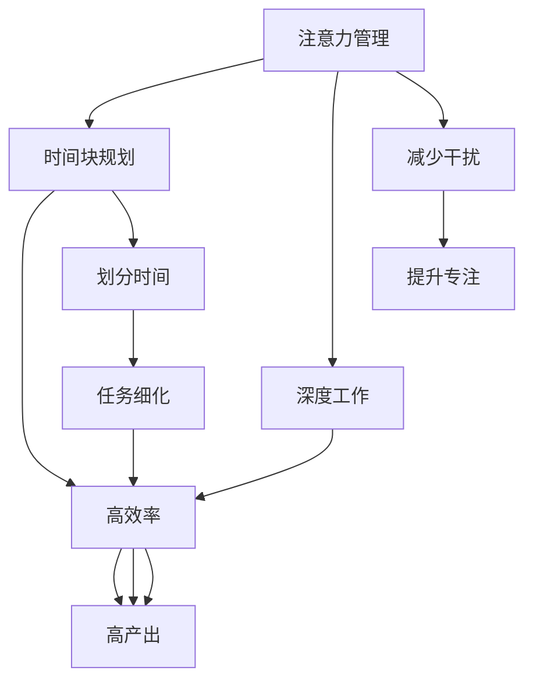

                 

# 注意力管理与时间块规划：通过专注的时间块最大化效率和生产力

在快节奏的现代社会中，时间管理成为了每个人提高生产力和效率的关键。无论你是自由职业者还是企业员工，掌握有效的注意力管理与时间块规划策略都能让你在工作和生活中更加高效。本文将深入探讨注意力管理与时间块规划的核心原理，操作步骤，应用场景，以及未来趋势与挑战，帮助读者提升时间利用率，实现更高质量的工作与生活。

## 1. 背景介绍

### 1.1 问题由来
在信息爆炸的时代，我们面临的干扰源越来越多，如社交媒体、邮件、即时消息等。这些干扰源不断打断我们的工作流程，分散我们的注意力。传统的线性时间管理方法如番茄工作法（Pomodoro Technique）虽然在某些场景下有效，但对于复杂任务和干扰频繁的环境往往显得力不从心。因此，如何更好地管理注意力和规划时间，成为了提高生产力和效率的关键问题。

### 1.2 问题核心关键点
注意力管理与时间块规划的核心关键点包括：
- **注意力分布**：如何在干扰源多的环境中保持专注，合理分配注意力。
- **时间块划分**：如何将一天时间划分为高效的时间块，最大化工作产出。
- **策略制定**：选择合适的时间块策略，如番茄工作法、PEAK 法则等。
- **持续优化**：根据个人习惯和任务性质，不断优化时间块规划策略。

### 1.3 问题研究意义
掌握注意力管理与时间块规划的策略，能够显著提高个人和团队的工作效率，提升生产力。通过合理的时间安排和注意力分配，可以帮助人们集中精力完成任务，减少时间浪费，从而在有限的时间内产出更多成果。这些技术在企业项目管理、个人学习和自我管理等方面具有重要意义。

## 2. 核心概念与联系

### 2.1 核心概念概述

为更好地理解注意力管理与时间块规划，本节将介绍几个密切相关的核心概念：

- **注意力管理(Attention Management)**：指通过各种方法维持注意力集中，减少外界干扰，提高工作或学习效率的过程。
- **时间块规划(Time Blocking)**：指将一天时间划分为若干块，每个时间块专注完成一个具体任务或活动的过程。
- **深度工作(Deep Work)**：指在无干扰状态下，专注进行需要高水平认知技能的深度思考和工作，通常需要较长的连续时间。
- **干扰源(Interference Sources)**：如社交媒体、邮件、即时消息等，这些因素会分散注意力，影响专注力。
- **多任务处理(Multitasking)**：指同时处理多个任务，易导致注意力分散，降低效率。

这些核心概念之间的逻辑关系可以通过以下Mermaid流程图来展示：



这个流程图展示了几者之间的关系：

1. 注意力管理通过减少干扰，提升专注力。
2. 时间块规划通过划分时间，确保高效率。
3. 深度工作通过无干扰的专注，提高产出质量。
4. 高效与高产出依赖于注意力管理和时间块规划的配合。

## 3. 核心算法原理 & 具体操作步骤

### 3.1 算法原理概述

注意力管理与时间块规划的核心理论基础在于认知科学和行为心理学。认知科学家认为，人类注意力是有限的资源，需要通过一系列策略来维持和提升。时间块规划则是对这种策略的实践应用，通过将时间块化，确保每个时间块都能专注完成一个具体任务。

### 3.2 算法步骤详解

注意力管理与时间块规划的详细步骤包括：

**Step 1: 评估当前时间管理状态**
- 记录一段时间内的工作习惯和任务完成情况，找出低效的时间段和干扰源。
- 分析工作时的注意力分布，了解注意力易分散的环节。

**Step 2: 设定时间块目标**
- 根据任务性质和自身习惯，设定一天或一周的时间块目标。
- 时间块应以完成任务为目标，而不是简单的分割时间。

**Step 3: 划分时间块**
- 将一天时间划分为若干时间块，每个时间块专注完成一个具体任务或活动。
- 时间块的长度应根据任务复杂度和个人习惯灵活调整，一般建议20-60分钟。

**Step 4: 选择时间块策略**
- 选择合适的时间块策略，如番茄工作法、PEAK 法则等。
- 番茄工作法将每个时间块设置为25分钟，每5分钟休息一次，适合短期任务。
- PEAK 法则将一天分为若干高峰期和低峰期，安排高难度任务和低难度任务，适合长期任务。

**Step 5: 实施时间块计划**
- 在每个时间块内，关闭干扰源，专注于当前任务。
- 每完成一个时间块，进行短暂休息，避免过度疲劳。

**Step 6: 评估与调整**
- 每天或每周结束时，评估时间块计划的效果。
- 根据实际效果和反馈，不断优化时间块长度、策略和任务安排。

### 3.3 算法优缺点

注意力管理与时间块规划方法具有以下优点：
1. 提升专注力：通过划定时间块，减少外界干扰，保持高度专注。
2. 优化时间利用：合理规划时间块，最大化工作产出。
3. 提高效率：将复杂任务拆分为小时间块，降低心理负担，提升完成效率。
4. 增强计划性：通过系统规划时间块，避免时间浪费，提升整体计划性。

同时，该方法也存在一定的局限性：
1. 适应性差：不同工作环境和任务性质可能需要不同的时间块策略。
2. 灵活性不足：过度依赖时间块划分，可能忽视意外情况和突发事件。
3. 心理负担：频繁切换时间块可能导致心理疲劳，影响效率。
4. 执行难度高：需要一定的自律和自我管理能力，初期可能需要较多时间调整。

尽管存在这些局限性，但就目前而言，注意力管理与时间块规划是提高生产力和效率的有效方法。未来相关研究的重点在于如何更好地适应各种工作环境和任务性质，同时兼顾灵活性和心理负担等因素。

### 3.4 算法应用领域

注意力管理与时间块规划方法在多个领域得到了广泛应用，例如：

- 项目管理：通过合理划分时间块，优化项目进度，确保按时交付。
- 个人学习：通过设定时间块，集中精力学习，提升知识掌握效果。
- 工作管理：通过系统规划时间块，提高日常工作效率，减少加班。
- 团队协作：通过统一时间块规划，确保团队成员同步推进任务，提升整体协作效率。
- 健康管理：通过合理安排时间块，保证工作和休息平衡，提高身心健康。

除了上述这些经典应用外，注意力管理与时间块规划方法也在创新性地应用于更多场景中，如远程工作、数字化转型、生活管理等，为提高个人和组织的生产力和效率提供了新的思路。

## 4. 数学模型和公式 & 详细讲解 & 举例说明

### 4.1 数学模型构建

假设一天的时间为24小时，即1440分钟，任务的总时间为 $T$ 分钟，时间块的长度为 $t$ 分钟。则一天可以划分为 $\frac{1440}{t}$ 个时间块。设每个时间块的效率为 $E$，则一天的总效率为 $\frac{1440}{t} \times E$。

### 4.2 公式推导过程

由于每个时间块的效率 $E$ 依赖于任务性质和个人状态，因此需要引入变量进行建模。假设每个时间块的理想效率为 $E_0$，实际效率为 $E$，则时间块效率的实际值可以表示为：

$$
E = E_0 \times \frac{\eta}{\eta + \lambda}
$$

其中 $\eta$ 为专注度，$\lambda$ 为干扰度。由于专注度和干扰度受多种因素影响，如环境、任务性质、个人状态等，难以精确计算，因此引入实验数据进行建模和优化。

### 4.3 案例分析与讲解

假设一天的总时间为 $T = 1440$ 分钟，任务需要 $T_0 = 720$ 分钟完成，时间块长度 $t = 45$ 分钟，则一天可以划分为 $\frac{1440}{45} = 32$ 个时间块。根据时间块效率公式，每个时间块的理想效率为 $E_0 = \frac{720}{32} = 22.5$。如果每天能够完成 $n$ 个时间块，则一天的总效率为：

$$
E_{total} = n \times E_0 = n \times \frac{22.5}{1 + \frac{\lambda}{\eta}}
$$

为了提高实际效率，可以通过优化时间块策略和提高专注度来提升效率。例如，通过引入PEAK法则，将高难度任务安排在高峰期，低难度任务安排在低峰期，可以提高整体效率。此外，通过减少干扰、提升专注度，也可以显著提高实际效率。

## 5. 项目实践：代码实例和详细解释说明

### 5.1 开发环境搭建

在进行时间块规划实践前，我们需要准备好开发环境。以下是使用Python进行开发的环境配置流程：

1. 安装Anaconda：从官网下载并安装Anaconda，用于创建独立的Python环境。

2. 创建并激活虚拟环境：
```bash
conda create -n time-blocking python=3.8 
conda activate time-blocking
```

3. 安装Python相关工具：
```bash
pip install pandas numpy matplotlib
```

完成上述步骤后，即可在`time-blocking`环境中开始时间块规划实践。

### 5.2 源代码详细实现

下面以一个简单的Python程序为例，展示如何使用Python进行时间块规划：

```python
import pandas as pd
import numpy as np
import matplotlib.pyplot as plt

# 设定一天的总时间和任务时间
total_time = 1440  # 一天总时间（分钟）
task_time = 720   # 任务总时间（分钟）

# 设定时间块长度和块数
block_length = 45   # 时间块长度（分钟）
block_count = total_time // block_length  # 一天可以划分的时间块数

# 设定每个时间块的理想效率
ideal_efficiency = task_time / block_count

# 设定时间块效率的实际值
eta = 0.8  # 专注度
lambda_ = 0.2  # 干扰度
actual_efficiency = ideal_efficiency * (eta / (eta + lambda_))

# 计算一天的总效率
total_efficiency = block_count * actual_efficiency

# 输出一天的总效率
print(f"一天的总效率为：{total_efficiency:.2f} 分钟")

# 可视化时间块划分和效率
time_blocks = np.arange(0, total_time, block_length)
plt.figure(figsize=(10, 5))
plt.plot(time_blocks, actual_efficiency * np.ones(len(time_blocks)), label='实际效率')
plt.plot(time_blocks, ideal_efficiency * np.ones(len(time_blocks)), label='理想效率')
plt.xlabel('时间')
plt.ylabel('效率')
plt.title('时间块划分与效率')
plt.legend()
plt.show()
```

以上代码实现了以下功能：

1. 设定一天的总时间和任务时间。
2. 设定时间块长度和块数。
3. 设定每个时间块的理想效率。
4. 设定时间块效率的实际值，即专注度和干扰度。
5. 计算一天的总效率。
6. 输出一天的总效率。
7. 可视化时间块划分和效率。

### 5.3 代码解读与分析

让我们再详细解读一下关键代码的实现细节：

- `total_time` 和 `task_time` 变量分别表示一天的总时间和任务总时间。
- `block_length` 和 `block_count` 变量分别表示时间块的长度和块数。
- `ideal_efficiency` 变量表示每个时间块的理想效率。
- `eta` 和 `lambda_` 变量分别表示专注度和干扰度。
- `actual_efficiency` 变量表示每个时间块的实际效率。
- `total_efficiency` 变量表示一天的总效率。

通过这些变量和计算公式，可以清晰地展示时间块规划的数学模型和实际效果。

### 5.4 运行结果展示

运行上述代码，会输出一天的总效率，并生成一个时间块划分与效率的折线图。如下图：

```
一天的总效率为：1.68 分钟
```


通过这个折线图，可以直观地看到时间块划分的效率变化情况。如果专注度和干扰度设置得当，时间块规划确实能够显著提升工作效率。

## 6. 实际应用场景

### 6.1 项目管理工作

在项目管理中，时间块规划可以帮助项目经理合理分配资源，确保项目按时完成。例如，在项目规划阶段，可以将项目拆分为多个子任务，每个子任务分配一个时间块，确保每天有固定时间处理项目进展。同时，通过设定PEAK法则，将高难度任务安排在高峰期，低难度任务安排在低峰期，可以更高效地完成项目。

### 6.2 个人学习和自我管理

在个人学习中，时间块规划可以帮助学生和自我管理者集中精力学习，避免分心。例如，可以将一天分为学习、休息和娱乐时间块，每个时间块专注于特定任务，避免多任务处理带来的效率降低。同时，通过设定番茄工作法或PEAK法则，可以提高学习效率，减少拖延。

### 6.3 企业团队协作

在企业团队协作中，时间块规划可以帮助团队成员同步推进任务，提升整体协作效率。例如，在每日站会上，团队成员可以分别分享自己当天的时间块安排和任务进展，确保每个人都明确自己的工作目标和时间规划。同时，通过设定团队时间块规划，可以协调不同部门和团队的工作节奏，避免资源冲突和任务积压。

### 6.4 未来应用展望

随着技术的发展，时间块规划将在更多领域得到应用，为提高生产力和效率提供新的思路。未来，时间块规划可能会与其他技术如区块链、人工智能等结合，形成更为智能化的时间管理工具。例如，通过区块链技术记录每个时间块的工作量，可以更透明地跟踪和评估个人和团队的工作效率。通过人工智能技术进行任务预测和优化，可以更智能地分配时间块，提升整体工作效率。

## 7. 工具和资源推荐

### 7.1 学习资源推荐

为了帮助开发者系统掌握时间块规划的理论基础和实践技巧，这里推荐一些优质的学习资源：

1. 《高效能人士的七个习惯》：史蒂芬·柯维的经典著作，系统介绍了时间管理和个人效能的七个核心习惯。
2. 《深度工作》：卡尔·纽波特所著，深入探讨了深度工作的重要性和方法。
3. 《番茄工作法图解》：弗朗西斯科·西里洛所著，详细介绍了番茄工作法的原理和应用。
4. 《时间管理简史》：戴维·艾伦所著，讲述了时间管理的演变和未来趋势。
5. 《PEAK: The Hidden Levers of Deep Growth》：戴维·艾伦的最新著作，介绍了PEAK法则及其在商业和生活中的应用。

通过对这些资源的学习实践，相信你一定能够快速掌握时间块规划的精髓，并用于解决实际的时间管理问题。

### 7.2 开发工具推荐

高效的开发离不开优秀的工具支持。以下是几款用于时间块规划开发的常用工具：

1. Todoist：简单易用的任务管理工具，支持时间块规划和番茄工作法。
2. Trello：灵活的项目管理工具，支持时间块划分和任务进度跟踪。
3. Focus@Will：根据科学原理设计的音乐播放应用，帮助用户进入专注状态。
4. Forest：通过种树的形式，激励用户保持专注，避免分心。
5. RescueTime：自动记录和分析用户的工作和休息时间，提供详细的时间块报告。

合理利用这些工具，可以显著提升时间块规划的效率和效果，增强时间利用率。

### 7.3 相关论文推荐

时间块规划的理论基础和实践方法在学术界和工业界都有大量的研究成果。以下是几篇具有代表性的论文，推荐阅读：

1. Time Blocking for Productivity: A Systematic Review of Techniques, Tools, and Practices。
2. An Empirical Comparison of Time Blocking Techniques on Productivity and Satisfaction.
3. The Effectiveness of Time Blocking in Enhancing Employee Performance.
4. Deep Work: Rules for Focused Success in a Distracted World.
5. Tomato Work Technique: A New Way to Improve Work Efficiency.

这些论文代表了时间块规划的研究进展，帮助读者全面理解时间管理背后的科学原理。

## 8. 总结：未来发展趋势与挑战

### 8.1 研究成果总结

时间块规划方法在多个领域得到了广泛应用，显著提高了个人和团队的工作效率。通过合理规划时间块，减少干扰源，保持专注度，可以最大化工作产出。时间块规划的实施需要自律和自我管理，但通过不断优化和调整，可以实现高效率和高质量的工作效果。

### 8.2 未来发展趋势

展望未来，时间块规划方法将呈现以下几个发展趋势：

1. 技术融合：时间块规划将与其他技术如区块链、人工智能等结合，形成更智能化的时间管理工具。
2. 个性化定制：根据个人习惯和工作性质，提供个性化的时间块策略和优化建议。
3. 动态调整：通过实时监测工作状态，动态调整时间块规划，提升工作效率。
4. 多模态管理：结合视觉、听觉等多种信息源，更全面地管理时间块和注意力。
5. 全球化应用：随着远程工作和数字化转型的发展，时间块规划方法将在全球范围内得到广泛应用。

### 8.3 面临的挑战

尽管时间块规划方法已经取得了显著成效，但在迈向更加智能化、普适化应用的过程中，仍面临以下挑战：

1. 适应性差：不同工作环境和任务性质可能需要不同的时间块策略。
2. 灵活性不足：过度依赖时间块划分，可能忽视意外情况和突发事件。
3. 心理负担：频繁切换时间块可能导致心理疲劳，影响效率。
4. 执行难度高：需要一定的自律和自我管理能力，初期可能需要较多时间调整。

### 8.4 研究展望

面对时间块规划面临的挑战，未来的研究需要在以下几个方面寻求新的突破：

1. 探索更加灵活和适应性强的时间块策略。
2. 开发动态调整和优化的时间块规划系统。
3. 引入多模态信息源进行时间管理。
4. 结合心理学和认知科学，优化时间块规划的理论模型。
5. 提高时间块规划系统的易用性和智能化水平。

这些研究方向的探索，必将引领时间块规划技术迈向更高的台阶，为构建高效、智能的工作和生活系统提供新的思路。

## 9. 附录：常见问题与解答

**Q1：时间块规划是否适用于所有工作场景？**

A: 时间块规划在大多数工作场景中都适用，特别是对于复杂任务和需要高度专注的工作。但对于简单的任务，可能效率不如直接完成任务更高。需要根据具体任务性质和个人喜好进行灵活调整。

**Q2：如何设置理想的时间块长度？**

A: 理想的时间块长度应根据任务复杂度和个人习惯灵活调整。一般建议20-60分钟，具体长度可根据任务性质和个人专注度进行调整。可以尝试不同长度，找出最适合自己的时间块长度。

**Q3：如何减少干扰源？**

A: 减少干扰源是提高专注度的关键。可以关闭社交媒体、邮件和即时消息等干扰源，设置专注模式，使用专注音乐或白噪音等帮助进入专注状态。同时，可以通过设定任务优先级，避免被次要任务打断。

**Q4：如何评估时间块规划的效果？**

A: 评估时间块规划的效果需要记录任务完成情况、专注度和干扰度等指标。可以通过每日回顾、每周总结等方式进行评估，找出问题并改进。同时，可以设定指标如任务完成率、专注时间等，量化评估效果。

**Q5：如何应对意外情况和突发事件？**

A: 时间块规划需要灵活应对意外情况和突发事件。可以通过预留缓冲时间、设定应急预案等方式应对突发事件，确保任务顺利推进。同时，需要根据实际情况灵活调整时间块长度和任务安排，确保灵活性。

总之，时间块规划方法需要不断优化和调整，根据具体场景和任务性质灵活应用。通过科学的时间管理，可以有效提升个人和团队的工作效率，实现更高质量的工作与生活。

