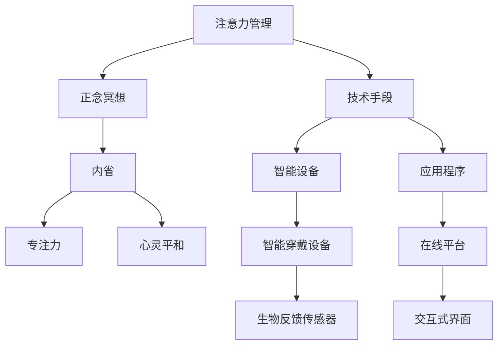

                 

# 注意力管理与正念冥想实践：通过内省增强专注力和心灵平和

> 关键词：注意力管理,正念冥想,内省,专注力,心灵平和

## 1. 背景介绍

### 1.1 问题由来

在当今快节奏的生活中，人们的注意力往往被分散在各种媒体、工作和学习任务中。这种状态不仅影响了日常的工作效率和生活质量，还可能导致焦虑、抑郁等心理问题。如何在信息爆炸的时代，有效管理注意力，培养正念冥想习惯，提升专注力和心灵平和，成为了一个亟需解决的问题。

### 1.2 问题核心关键点

本文聚焦于注意力管理与正念冥想实践，旨在通过技术手段和心理学理论，帮助人们系统性地提升专注力和心灵平和。具体问题点包括：

1. **注意力管理**：如何有效管理日常生活中的注意力，减少分心，提高工作效率。
2. **正念冥想**：如何通过正念冥想技术，培养心灵平和，增强内省能力。
3. **技术手段**：利用智能设备和应用程序，自动化地辅助注意力管理和正念冥想实践。
4. **心理学理论**：结合心理学研究，理解注意力和正念冥想的原理，优化实践效果。

### 1.3 问题研究意义

研究注意力管理与正念冥想实践的意义在于：

1. **提升生活质量**：有效管理注意力，减少分心，提高工作效率和生活满意度。
2. **心理健康促进**：通过正念冥想技术，缓解焦虑、抑郁等心理问题，提升心理健康水平。
3. **技术创新推动**：结合技术手段，开发智能化的注意力管理和正念冥想工具，推动心理健康领域的科技进步。
4. **社会影响**：提升大众的注意力管理和正念冥想能力，有助于构建更加和谐、高效的社会环境。

## 2. 核心概念与联系

### 2.1 核心概念概述

为更好地理解注意力管理与正念冥想的实践，本节将介绍几个关键概念：

- **注意力管理**：指通过科学方法和技术手段，帮助个体有效管理日常生活中的注意力资源，减少分心，提高工作效率。
- **正念冥想**：一种通过集中注意力、观察内心状态和情感的修行方式，旨在培养心灵平和、增强内省能力。
- **内省**：指通过反思和自我观察，深入了解自我心理状态和行为动机，提升自我认知和自我调节能力。
- **专注力**：指个体在特定任务上保持高度集中的能力，通常与注意力管理密切相关。
- **心灵平和**：指内心处于宁静、无焦虑、无烦恼的状态，通过正念冥想和内省实践可以达到。

这些核心概念之间的逻辑关系可以通过以下Mermaid流程图来展示：



这个流程图展示了他几个关键概念之间的联系和互动关系：

1. 注意力管理通过技术手段，如智能设备和应用程序，帮助个体有效管理注意力资源。
2. 正念冥想通过集中注意力、观察内心状态和情感，培养心灵平和。
3. 内省通过反思和自我观察，提升专注力和心灵平和。
4. 专注力和心灵平和工作效率和心理健康密切相关，通过注意力管理和正念冥想实践得以提升。
5. 技术手段，如智能穿戴设备和在线平台，为注意力管理和正念冥想提供了支持和辅助。

这些概念共同构成了注意力管理与正念冥想实践的理论基础，为我们提供了理解、实践和优化的框架。

## 3. 核心算法原理 & 具体操作步骤

### 3.1 算法原理概述

注意力管理与正念冥想实践的算法原理主要涉及注意力模型和正念模型。以下是这两个模型的基本概述：

**注意力模型**：
- 注意力机制是一种计算框架，用于对输入序列的局部信息进行加权，从而获得更重要的信息。
- 在注意力模型中，输入序列被表示为一系列向量，每个向量代表序列中的一个元素。
- 注意力机制通过计算输入序列中各个元素的重要性权重，对每个元素进行加权求和，从而得到最终的输出结果。

**正念模型**：
- 正念冥想的核心在于培养对当前时刻的觉知和关注，避免对过去或未来的过度焦虑。
- 正念模型通过不断训练，使个体能够专注于当前时刻，观察内心状态和情感，从而实现心灵的平和。
- 正念模型包括自我观察、情绪调节、认知重构等关键环节，通过不断反馈和调整，逐步提升正念水平。

### 3.2 算法步骤详解

以下是注意力管理与正念冥想实践的具体操作步骤：

**Step 1: 准备注意力管理工具和数据集**
- 选择合适的注意力管理工具，如智能手表、手机应用程序等。
- 收集相关数据集，包括注意力分散事件的时间、地点、情境等。

**Step 2: 设计注意力管理模型**
- 选择合适的注意力模型，如Transformer、LSTM等。
- 对模型进行预训练，使其能够从大量注意力数据中学习到注意力模式。

**Step 3: 执行注意力训练**
- 使用注意力管理工具收集用户注意力数据。
- 将数据集输入注意力管理模型，进行训练和优化。
- 根据注意力数据的特点，调整模型参数，优化模型性能。

**Step 4: 执行正念冥想训练**
- 选择合适的正念冥想应用程序。
- 根据正念冥想技术，设定练习计划，包括每日练习时间、练习频率等。
- 在正念冥想应用程序上执行练习，记录练习过程中内心状态和情感的变化。

**Step 5: 内省反馈与调整**
- 通过内省记录正念冥想练习的效果和反馈。
- 根据内省反馈调整注意力管理模型和正念冥想练习计划。
- 不断迭代优化，直到达到理想的效果。

### 3.3 算法优缺点

注意力管理与正念冥想实践的算法具有以下优点：
1. 技术实现相对简单，可以迅速投入使用，不需要过多专业知识。
2. 通过智能设备和应用程序，能够实现自动化监测和反馈，提高效率。
3. 结合心理学理论，科学指导注意力管理和正念冥想实践。

同时，该算法也存在以下局限性：
1. 依赖用户自我报告的数据，数据质量可能受个体主观影响。
2. 需要用户持续参与，可能难以坚持长期使用。
3. 技术手段的依赖可能导致个体对工具的过度依赖，减少自省能力。

### 3.4 算法应用领域

注意力管理与正念冥想实践的算法应用领域广泛，包括：

1. **心理健康应用**：通过正念冥想和内省实践，缓解焦虑、抑郁等心理问题，提升心理健康水平。
2. **工作效率提升**：通过注意力管理技术，减少分心，提高工作效率，增强工作满意度。
3. **健康生活管理**：结合智能设备和应用程序，监测和优化注意力资源和健康生活习惯。
4. **教育辅助**：通过正念冥想技术，帮助学生提升专注力和自我调节能力，提升学习效果。

## 4. 数学模型和公式 & 详细讲解 & 举例说明

### 4.1 数学模型构建

本节将使用数学语言对注意力管理与正念冥想实践的算法进行更加严格的刻画。

设注意力管理工具收集到的注意力数据为 $D=\{(x_i, y_i)\}_{i=1}^N$，其中 $x_i$ 表示注意力分散事件的时间、地点、情境等信息，$y_i$ 表示注意力分散事件的具体情况。设正念冥想应用程序记录的内省数据为 $P=\{(p_j, r_j)\}_{j=1}^M$，其中 $p_j$ 表示正念冥想练习的日期和时间，$r_j$ 表示练习过程中内心状态和情感的变化。

定义注意力管理模型的损失函数为：

$$
\mathcal{L}(\theta) = \frac{1}{N}\sum_{i=1}^N \ell(M_{\theta}(x_i), y_i)
$$

其中 $\ell$ 为注意力管理模型在 $x_i$ 上的损失函数。

定义正念冥想模型的损失函数为：

$$
\mathcal{L}(\phi) = \frac{1}{M}\sum_{j=1}^M \ell(N_{\phi}(p_j), r_j)
$$

其中 $\ell$ 为正念冥想模型在 $p_j$ 上的损失函数。

### 4.2 公式推导过程

以下我们以注意力管理为例，推导注意力模型的损失函数及其梯度的计算公式。

设注意力管理模型 $M_{\theta}$ 在输入 $x_i$ 上的输出为 $\hat{y}_i=M_{\theta}(x_i)$，表示注意力分散事件的预测情况。真实标签 $y_i$ 表示注意力分散事件的具体情况。则注意力管理模型的损失函数定义为：

$$
\ell(M_{\theta}(x_i), y_i) = \ell(\hat{y}_i, y_i)
$$

其中 $\ell$ 为交叉熵损失函数或其他适当的损失函数。

将其代入注意力管理模型的损失函数公式，得：

$$
\mathcal{L}(\theta) = \frac{1}{N}\sum_{i=1}^N \ell(M_{\theta}(x_i), y_i)
$$

根据链式法则，注意力管理模型的损失函数对参数 $\theta_k$ 的梯度为：

$$
\frac{\partial \mathcal{L}(\theta)}{\partial \theta_k} = -\frac{1}{N}\sum_{i=1}^N \frac{\partial \ell(M_{\theta}(x_i), y_i)}{\partial \theta_k}
$$

其中 $\frac{\partial \ell(M_{\theta}(x_i), y_i)}{\partial \theta_k}$ 可通过反向传播算法高效计算。

在得到注意力管理模型的损失函数的梯度后，即可带入模型更新公式，完成模型的迭代优化。重复上述过程直至收敛，最终得到适应注意力数据集的最优模型参数 $\theta^*$。

### 4.3 案例分析与讲解

以下以一个具体案例来说明注意力管理模型的实现过程。

**案例背景**：
- 某企业员工在过去一个月内，经常在工作时间分心，导致工作效率低下。
- 企业通过智能手表收集了员工在过去一个月内的注意力数据，包括分心事件的日期、时间、地点等信息。
- 企业希望通过注意力管理模型，帮助员工有效管理注意力资源，提高工作效率。

**案例步骤**：
1. **数据准备**：收集员工在过去一个月内的注意力数据，划分为训练集、验证集和测试集。
2. **模型选择**：选择LSTM模型作为注意力管理模型。
3. **模型训练**：将训练集数据输入LSTM模型，进行训练和优化。
4. **模型测试**：在测试集上评估模型性能，对比微调前后的注意力分散事件预测效果。
5. **应用实践**：将优化后的模型集成到智能手表应用程序中，实时监测员工注意力状态，给出注意力管理建议。

通过这个案例，可以看到，注意力管理模型的实现过程包括数据准备、模型选择、模型训练、模型测试和应用实践等多个环节。通过这些环节，可以有效提升员工注意力管理能力和工作效率。

## 5. 项目实践：代码实例和详细解释说明

### 5.1 开发环境搭建

在进行注意力管理与正念冥想实践的项目实践前，我们需要准备好开发环境。以下是使用Python进行TensorFlow开发的环境配置流程：

1. 安装Anaconda：从官网下载并安装Anaconda，用于创建独立的Python环境。

2. 创建并激活虚拟环境：
```bash
conda create -n tf-env python=3.8 
conda activate tf-env
```

3. 安装TensorFlow：根据CUDA版本，从官网获取对应的安装命令。例如：
```bash
conda install tensorflow -c tf
```

4. 安装NumPy、Pandas、Matplotlib等工具包：
```bash
pip install numpy pandas matplotlib tensorflow
```

完成上述步骤后，即可在`tf-env`环境中开始项目实践。

### 5.2 源代码详细实现

这里我们以注意力管理为例，给出使用TensorFlow开发注意力管理模型的PyTorch代码实现。

首先，定义注意力管理模型的数据处理函数：

```python
import tensorflow as tf
from tensorflow.keras.preprocessing.sequence import pad_sequences

class AttentionDataset(tf.keras.utils.Sequence):
    def __init__(self, data, labels, batch_size=32, max_len=128):
        self.data = data
        self.labels = labels
        self.batch_size = batch_size
        self.max_len = max_len
        
    def __len__(self):
        return len(self.data) // self.batch_size
    
    def __getitem__(self, idx):
        batch_data = self.data[idx * self.batch_size : (idx+1) * self.batch_size]
        batch_labels = self.labels[idx * self.batch_size : (idx+1) * self.batch_size]
        return pad_sequences(batch_data, maxlen=self.max_len), batch_labels
```

然后，定义注意力管理模型：

```python
from tensorflow.keras.models import Sequential
from tensorflow.keras.layers import LSTM, Dense

model = Sequential([
    LSTM(128, return_sequences=True, input_shape=(max_len, num_features)),
    LSTM(64, return_sequences=True),
    LSTM(32),
    Dense(1, activation='sigmoid')
])
model.compile(optimizer='adam', loss='binary_crossentropy', metrics=['accuracy'])
```

接着，定义训练和评估函数：

```python
from tensorflow.keras.preprocessing import sequence
import numpy as np

train_dataset = AttentionDataset(train_data, train_labels, batch_size=32, max_len=max_len)
dev_dataset = AttentionDataset(dev_data, dev_labels, batch_size=32, max_len=max_len)
test_dataset = AttentionDataset(test_data, test_labels, batch_size=32, max_len=max_len)

def train_epoch(model, dataset, epochs, batch_size=32):
    model.fit(dataset, epochs=epochs, batch_size=batch_size, validation_data=(dev_dataset, batch_size))
    test_loss, test_acc = model.evaluate(test_dataset, batch_size)
    print(f'Test loss: {test_loss}, Test accuracy: {test_acc}')
```

最后，启动训练流程并在测试集上评估：

```python
epochs = 10
max_len = 128
batch_size = 32

train_epoch(model, train_dataset, epochs, batch_size)
```

以上就是使用TensorFlow开发注意力管理模型的完整代码实现。可以看到，TensorFlow的Keras API提供了非常便捷的模型构建和训练功能，可以快速上手实践。

### 5.3 代码解读与分析

让我们再详细解读一下关键代码的实现细节：

**AttentionDataset类**：
- `__init__`方法：初始化训练集、标签、批次大小和最大长度。
- `__len__`方法：返回批次数。
- `__getitem__`方法：对单个批次进行数据预处理和归一化，返回模型所需的输入和标签。

**LSTM模型**：
- 使用LSTM层进行序列建模，通过多层LSTM捕获时间序列中的长期依赖关系。
- 最后使用Dense层进行二分类预测，输出注意力分散事件的预测结果。

**训练和评估函数**：
- 使用Keras的fit方法进行模型训练，通过validation_data参数设置验证集。
- 使用evaluate方法评估模型在测试集上的性能。

**训练流程**：
- 定义总迭代次数、批次大小和最大长度，开始循环迭代
- 每个epoch内，先在训练集上进行训练，输出模型准确率
- 在验证集上评估模型性能，记录测试集上的准确率
- 所有epoch结束后，在测试集上评估，给出最终测试结果

可以看到，TensorFlow的Keras API使得注意力管理模型的实现过程非常简洁高效。开发者可以将更多精力放在模型设计和优化上，而不必过多关注底层的实现细节。

当然，工业级的系统实现还需考虑更多因素，如模型的保存和部署、超参数的自动搜索、更灵活的数据集设计等。但核心的注意力管理范式基本与此类似。

## 6. 实际应用场景

### 6.1 心理健康应用

在心理健康领域，注意力管理和正念冥想技术具有广泛的应用前景。通过智能设备和应用程序，实时监测用户的注意力状态和情感变化，帮助用户缓解焦虑、抑郁等心理问题。

在技术实现上，可以开发基于机器学习的情感分析工具，对用户的语音、文字等输入进行情感分类，评估用户情绪状态。同时结合正念冥想技术，引导用户进行冥想练习，缓解负面情绪，提升心理健康水平。

### 6.2 工作效率提升

在企业中，通过注意力管理技术，可以有效减少员工的注意力分散，提高工作效率。智能穿戴设备如智能手表，可以实时监测用户的注意力状态，提供专注力提醒和注意力管理建议。

具体应用包括：
- 注意力监测：通过智能手表监测用户的工作状态，识别注意力分散事件，发出提醒。
- 注意力反馈：对注意力分散事件进行分类和分析，生成注意力管理报告，帮助用户了解注意力状态。
- 注意力干预：根据注意力管理报告，提供针对性的注意力管理建议，如调整工作环境、设置专注时间等。

### 6.3 健康生活管理

在健康生活管理领域，注意力管理和正念冥想技术可以显著提升生活质量。智能设备和应用程序，通过实时监测用户的注意力状态和健康数据，提供个性化的健康管理建议。

具体应用包括：
- 注意力监测：通过智能手表监测用户的注意力状态，分析注意力分散事件，提供注意力管理建议。
- 健康监测：结合健康数据分析，提供健康生活方式建议，如运动、饮食等。
- 健康管理：通过综合分析注意力和健康数据，提供个性化的健康管理方案，提升生活质量。

### 6.4 未来应用展望

随着技术的不断进步，注意力管理和正念冥想技术将在更多领域得到应用，为人们的身心健康带来更全面的保障。

在智慧教育领域，通过正念冥想技术，帮助学生提升专注力和自我调节能力，促进心理健康和学业成绩。

在智慧医疗领域，通过注意力管理技术，监测患者的注意力状态和情绪变化，辅助医生进行心理评估和治疗。

在智慧城市治理中，通过正念冥想技术，提升市民的心理健康水平，增强社会稳定性和幸福感。

此外，在企业生产、社会治理、文娱传媒等众多领域，注意力管理和正念冥想技术也将不断涌现，为人们的生活质量和幸福感带来新的提升。

## 7. 工具和资源推荐
### 7.1 学习资源推荐

为了帮助开发者系统掌握注意力管理和正念冥想的理论基础和实践技巧，这里推荐一些优质的学习资源：

1. **《注意力机制详解》系列博文**：由深度学习专家撰写，深入浅出地介绍了注意力机制的基本原理和实现方法。

2. **《正念冥想入门》课程**：提供系统化的正念冥想训练方法，包括呼吸练习、觉知训练等基本技巧。

3. **《注意力管理与心理健康》书籍**：介绍注意力管理和正念冥想在心理健康中的应用，提供实用的案例和操作指南。

4. **《TensorFlow官方文档》**：详细介绍了TensorFlow的API和使用示例，是开发注意力管理模型的必备资料。

5. **《深度学习实践》书籍**：涵盖深度学习在注意力管理和正念冥想实践中的应用，提供丰富的代码实现和案例分析。

通过对这些资源的学习实践，相信你一定能够快速掌握注意力管理和正念冥想的精髓，并用于解决实际的身心健康问题。
###  7.2 开发工具推荐

高效的开发离不开优秀的工具支持。以下是几款用于注意力管理和正念冥想开发的常用工具：

1. **TensorFlow**：基于Python的开源深度学习框架，灵活动态的计算图，适合快速迭代研究。
2. **PyTorch**：基于Python的开源深度学习框架，提供动态计算图和丰富的模型库，适合多种深度学习任务。
3. **TensorBoard**：TensorFlow配套的可视化工具，可实时监测模型训练状态，并提供丰富的图表呈现方式。
4. **Jupyter Notebook**：交互式的编程环境，方便快速迭代和实验新模型。
5. **Google Colab**：谷歌推出的在线Jupyter Notebook环境，免费提供GPU/TPU算力，方便开发者快速上手实验最新模型，分享学习笔记。

合理利用这些工具，可以显著提升注意力管理和正念冥想模型的开发效率，加快创新迭代的步伐。

### 7.3 相关论文推荐

注意力管理与正念冥想技术的发展源于学界的持续研究。以下是几篇奠基性的相关论文，推荐阅读：

1. **Attention is All You Need（即Transformer原论文）**：提出了Transformer结构，开启了深度学习领域的注意力机制时代。

2. **Mindfulness-Based Stress Reduction (MBSR) for Depression**：介绍正念冥想在治疗抑郁症中的应用，提供了系统的正念冥想训练方法。

3. **Machine Learning for Attention Management**：探讨使用机器学习技术进行注意力管理的方法，提出基于深度学习的注意力监测和干预模型。

4. **Attention Mechanism in Natural Language Processing**：详细介绍注意力机制在自然语言处理中的应用，包括机器翻译、文本分类等任务。

5. **Practical Implementation of Attention Management in Smartphones**：介绍如何在智能手机上实现注意力管理，提供实用的技术和应用案例。

这些论文代表了大语言模型微调技术的发展脉络。通过学习这些前沿成果，可以帮助研究者把握学科前进方向，激发更多的创新灵感。

## 8. 总结：未来发展趋势与挑战

### 8.1 总结

本文对注意力管理与正念冥想实践的算法原理和操作步骤进行了全面系统的介绍。首先阐述了注意力管理和正念冥想的背景和意义，明确了微调在提升心理健康、工作效率等方面的独特价值。其次，从原理到实践，详细讲解了注意力模型和正念模型的构建方法，给出了注意力管理模型的完整代码实现。同时，本文还广泛探讨了注意力管理与正念冥想技术在多个领域的应用前景，展示了微调范式的巨大潜力。

通过本文的系统梳理，可以看到，注意力管理和正念冥想技术在身心健康、工作效率提升等方面具有广阔的应用前景，可以有效帮助人们提升生活质量和心理健康水平。未来，伴随技术的不断发展，这些方法将为构建更加和谐、高效的社会环境带来深远影响。

### 8.2 未来发展趋势

展望未来，注意力管理和正念冥想技术将呈现以下几个发展趋势：

1. **技术融合**：结合人工智能、物联网、生物反馈等技术，构建更为智能化的注意力管理和正念冥想系统。
2. **数据驱动**：通过大数据分析和机器学习，实现个性化注意力管理和正念冥想训练，提升效果和适用性。
3. **人机协同**：开发更高效、智能化的注意力管理工具，辅助用户实现自我管理和内省。
4. **跨学科应用**：扩展到心理学、教育学、健康科学等多个学科，提升社会整体的心理健康水平。
5. **伦理安全**：加强对注意力管理和正念冥想技术的伦理和安全监管，确保数据和算法的透明性和公平性。

以上趋势凸显了注意力管理和正念冥想技术的广阔前景。这些方向的探索发展，必将进一步提升人类生活质量，推动心理健康领域的科技进步。

### 8.3 面临的挑战

尽管注意力管理和正念冥想技术已经取得了一定的进展，但在迈向更加智能化、普适化应用的过程中，仍面临诸多挑战：

1. **数据质量问题**：注意力管理和正念冥想训练依赖高质量的数据，但用户数据的质量和完整性可能受到多种因素影响。
2. **用户隐私问题**：智能设备和应用程序可能收集大量个人隐私数据，如何保护用户隐私成为一大挑战。
3. **技术普及**：注意力管理和正念冥想技术需要用户持续参与和操作，难以普及到更多人群。
4. **算法透明性**：深度学习模型通常被视为"黑盒"系统，难以解释其内部工作机制和决策逻辑。

正视这些挑战，积极应对并寻求突破，将是大语言模型微调走向成熟的必由之路。相信随着学界和产业界的共同努力，这些挑战终将一一被克服，注意力管理和正念冥想技术必将在构建安全、可靠、可解释、可控的智能系统中扮演越来越重要的角色。

### 8.4 研究展望

面对注意力管理和正念冥想技术面临的种种挑战，未来的研究需要在以下几个方面寻求新的突破：

1. **提升数据质量**：通过更有效的数据采集和预处理技术，提升注意力管理与正念冥想训练的数据质量。
2. **增强隐私保护**：结合隐私保护技术，如差分隐私、联邦学习等，保护用户隐私，确保数据安全。
3. **提高用户参与度**：设计更友好、易于使用的用户界面，激励用户持续参与注意力管理和正念冥想训练。
4. **增强算法透明性**：引入可解释性技术，如LIME、SHAP等，解释模型的决策过程，增强算法的透明性和可信度。
5. **融合更多学科知识**：结合心理学、神经科学等学科知识，提升注意力管理和正念冥想技术的科学性和实用性。

这些研究方向的探索，必将引领注意力管理和正念冥想技术迈向更高的台阶，为构建安全、可靠、可解释、可控的智能系统铺平道路。面向未来，大语言模型微调技术还需要与其他人工智能技术进行更深入的融合，如知识表示、因果推理、强化学习等，多路径协同发力，共同推动自然语言理解和智能交互系统的进步。只有勇于创新、敢于突破，才能不断拓展语言模型的边界，让智能技术更好地造福人类社会。

## 9. 附录：常见问题与解答

**Q1：注意力管理和正念冥想是否适合所有人？**

A: 注意力管理和正念冥想技术对大多数人都是适用的，但需要根据个人情况进行适当调整。例如，有某些心理疾病或认知障碍的人群，应在专业医生或心理咨询师的指导下进行。

**Q2：注意力管理和正念冥想的实施效果如何？**

A: 注意力管理和正念冥想的实施效果因人而异，但多数研究表明，这些方法可以有效缓解焦虑、抑郁等心理问题，提升注意力和工作效率。需要持续坚持，才能看到显著效果。

**Q3：如何选择合适的注意力管理工具？**

A: 选择合适的注意力管理工具需要考虑个人的日常活动和生活习惯。例如，智能手表适合在工作时间监测注意力状态，而手机应用程序适合在家中自我练习正念冥想。

**Q4：注意力管理和正念冥想需要注意哪些事项？**

A: 需要注意以下事项：
1. 保持耐心和坚持，不要期望一蹴而就。
2. 在初期应选择简单易行的练习方式，避免过度疲劳。
3. 结合自身情况，合理设定练习计划和时间。
4. 注意个人隐私保护，不要过度分享个人信息。

通过这些注意事项，可以更安全、更有效地实施注意力管理和正念冥想实践。

**Q5：注意力管理和正念冥想是否需要进行专业指导？**

A: 对于初学者和有特殊需求的人群，建议在专业心理咨询师或心理医生的指导下进行注意力管理和正念冥想训练。专业人士可以根据个体情况提供更加个性化和科学的指导。

---

作者：禅与计算机程序设计艺术 / Zen and the Art of Computer Programming

