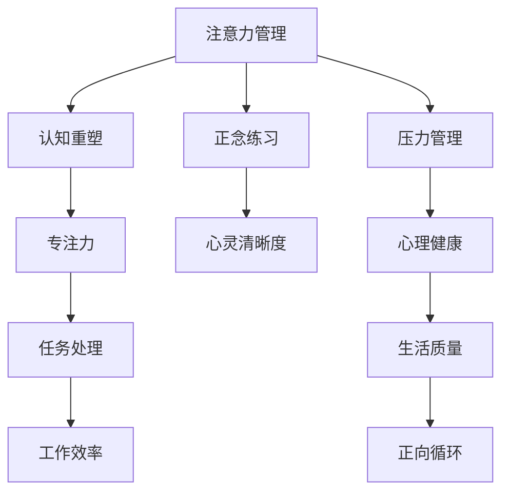

                 

# 注意力管理与正念练习：通过当下增强专注力和心灵清晰度

> 关键词：注意力管理,正念练习,专注力,心灵清晰度,认知重塑,工作效率,健康生活

## 1. 背景介绍

### 1.1 问题由来

在现代快节奏的生活中，注意力成为我们最为宝贵的资源之一。由于信息的爆炸式增长和科技的快速发展，人们每天面对的干扰源越来越多，从手机通知到邮件，从社交媒体到工作会议，这些都可能分走我们的注意力，导致效率低下，压力增加，甚至影响到我们的心理健康。如何在信息泛滥的环境中有效管理我们的注意力，提升工作效率和生活的质量，成为当前最热门的研究和讨论话题。

### 1.2 问题核心关键点

注意力管理的核心在于，如何通过认知重塑和行为干预，增强我们对自己注意力的控制，从而提升工作效率和生活的满意度。

本主题聚焦于注意力管理和正念练习，通过系统学习注意力管理的方法，结合正念练习，使我们能够通过当下的专注力和心灵的清晰度，更高效地处理信息，降低压力，提升生活质量。

### 1.3 问题研究意义

注意力管理与正念练习的理论研究和实践应用，对于提升个人和组织的工作效率，改善心理状态，构建健康的生活方式，具有深远的意义。具体包括：

1. 提高工作效率：注意力管理使我们能够更好地聚焦于当前任务，减少干扰，提升任务完成的速度和质量。
2. 缓解压力：正念练习有助于我们识别和管理压力源，降低焦虑和抑郁，提升心理韧性。
3. 改善生活质量：通过注意力管理，我们能够更加关注生活中的美好事物，提升生活的满意度。
4. 促进身心健康：注意力管理与正念练习的结合，使我们能够更好地与自己的身体和心灵建立连接，实现身心的和谐统一。

## 2. 核心概念与联系

### 2.1 核心概念概述

1. **注意力管理(Attention Management)**：指通过认知策略、行为干预等方法，增强个体对注意力的控制，提升工作和学习效率的过程。注意力管理的核心在于理解注意力的运作机制，采用恰当的策略和技巧来优化注意力资源的分配和使用。

2. **正念练习(Mindfulness Practice)**：指通过冥想、呼吸练习等方法，培养个体对当前时刻的觉察和接受，增强对自己身心状态的观察和理解。正念练习的目标在于培养一种对自身身心状态的非评判性觉察，从而提升心理韧性和生活满意度。

3. **专注力(Focus)**：指个体在特定任务上的注意力集中程度，包括注意力的持续时间和强度。专注力是高效完成任务的前提，通过注意力管理，我们可以提升专注力，提高工作的质量和效率。

4. **心灵清晰度(Clearness of Mind)**：指个体在当前时刻对自己身心状态的清晰觉察，包括情绪、思维、身体感受等。心灵清晰度的提升，有助于我们更好地处理信息，减少焦虑和压力，提升整体的生活质量。

5. **认知重塑(Cognitive Reframing)**：指通过认知行为策略，改变个体对当前情况和自身状态的认知，从而提升情绪和行为的积极性。认知重塑是注意力管理和正念练习的重要组成部分，通过重塑认知，我们可以更好地应对压力和挑战。

这些核心概念之间的联系可以用以下Mermaid流程图来展示：



这个流程图展示了一个完整的注意力管理系统，其中注意力管理是核心，通过认知重塑提升专注力，通过正念练习增强心灵清晰度，最终实现对工作效率、心理健康和生活质量的全面提升。

## 3. 核心算法原理 & 具体操作步骤

### 3.1 算法原理概述

注意力管理的核心算法原理主要包括：

1. **注意力模型(Attention Model)**：通过心理学和认知科学的研究，构建对注意力运作机制的理解，从而设计出能够提升注意力资源分配和管理的方法。
2. **正念练习模型(Mindfulness Practice Model)**：通过冥想、呼吸练习等方法，培养个体对当前时刻的觉察和接受，从而提升心理韧性和生活质量。
3. **认知重塑模型(Cognitive Reframing Model)**：通过认知行为策略，改变个体对当前情况和自身状态的认知，从而提升情绪和行为的积极性。

### 3.2 算法步骤详解

1. **注意力模型构建**：通过观察和实验，了解个体注意力分配和使用的规律，构建出能够提升注意力资源分配和管理的方法。这些方法包括时间管理技巧、工作环境优化、任务分解等。

2. **正念练习实施**：选择适合的冥想和呼吸练习，定期进行正念练习，逐步培养对自己身心状态的觉察和接受。这些练习可以包括每日冥想、呼吸练习、身体扫描等。

3. **认知重塑策略**：采用认知行为策略，重塑个体对当前情况和自身状态的认知，提升情绪和行为的积极性。这些策略包括自我肯定、正面思考、问题解决等。

### 3.3 算法优缺点

注意力管理与正念练习的算法具有以下优点：

1. **提升工作效率**：通过注意力管理，个体可以更好地聚焦于当前任务，减少干扰，提升任务完成的速度和质量。
2. **缓解压力**：正念练习有助于个体识别和管理压力源，降低焦虑和抑郁，提升心理韧性。
3. **改善生活质量**：通过注意力管理，个体能够更加关注生活中的美好事物，提升生活的满意度。
4. **促进身心健康**：注意力管理与正念练习的结合，使个体能够更好地与自己的身体和心灵建立连接，实现身心的和谐统一。

但这些算法也存在一些缺点：

1. **需要时间投入**：正念练习和注意力管理需要一定的练习时间和坚持度，初学者可能会感到困难。
2. **效果个体差异**：不同个体对注意力管理和正念练习的响应不同，效果可能存在差异。
3. **难以立即见效**：注意力管理和正念练习的效果往往需要一段时间才能显现，难以立即看到改进。

### 3.4 算法应用领域

注意力管理与正念练习的应用领域非常广泛，包括但不限于：

1. **工作和学习**：提高工作效率，提升学习效果，处理信息过载问题。
2. **心理健康**：缓解压力，降低焦虑和抑郁，提升心理韧性。
3. **人际关系**：改善人际关系，增强沟通和理解能力。
4. **身体健康**：增强身体感受，改善睡眠，提升身体健康。
5. **生活满意度**：提升生活质量，关注生活中的美好事物，增强幸福感。

## 4. 数学模型和公式 & 详细讲解 & 举例说明

### 4.1 数学模型构建

注意力管理与正念练习的数学模型主要涉及以下几个方面：

1. **时间管理模型(Time Management Model)**：通过线性规划等数学方法，优化个体时间的使用，提升工作效率。
2. **认知重塑模型(Cognitive Reframing Model)**：通过贝叶斯网络等方法，重塑个体对当前情况和自身状态的认知，提升情绪和行为的积极性。
3. **正念练习模型(Mindfulness Practice Model)**：通过统计学方法，分析正念练习对个体心理状态的影响，优化练习方法。

### 4.2 公式推导过程

以下是注意力管理与正念练习中几个关键模型的公式推导过程：

1. **时间管理模型**：假设个体有$n$项任务，每项任务需要$t_i$时间完成，总时间为$T$，任务优先级为$p_i$，则时间管理模型的目标是最小化完成所有任务所需时间，优化公式如下：

   $$
   \min_{x_i} \sum_{i=1}^n p_i x_i
   $$
   
   约束条件为：
   
   $$
   \sum_{i=1}^n x_i t_i \leq T
   $$
   
   其中，$x_i$表示任务$i$的完成时间。

2. **认知重塑模型**：通过贝叶斯网络重塑个体对当前情况和自身状态的认知，优化公式如下：

   $$
   \max_{\theta} P(\theta | x, y)
   $$
   
   其中，$\theta$表示个体的认知状态，$x$表示当前任务，$y$表示任务完成情况。

3. **正念练习模型**：通过统计学方法分析正念练习对个体心理状态的影响，优化公式如下：

   $$
   \min_{y} E[\text{Stress}(y)]
   $$
   
   其中，$y$表示正念练习的参数，$\text{Stress}(y)$表示个体在练习后的压力水平。

### 4.3 案例分析与讲解

以一个简单的案例来说明注意力管理与正念练习的实际应用：

假设一个人每天需要处理三项任务：邮件处理、项目管理、文档撰写，每项任务需要的时间分别为$10h$、$20h$、$15h$，总时间为$40h$，任务的优先级分别为$0.6$、$0.7$、$0.5$。

首先，通过时间管理模型可以计算出最优的时间分配，具体如下：

$$
\begin{align*}
\min_{x_1, x_2, x_3} & 0.6 x_1 + 0.7 x_2 + 0.5 x_3 \\
\text{s.t.} & x_1 + x_2 + x_3 = 40 \\
& x_1, x_2, x_3 \geq 0
\end{align*}
$$

通过求解上述线性规划问题，得到最优分配为：

$$
x_1 = 10, x_2 = 20, x_3 = 10
$$

即邮件处理和项目管理各占用$10h$，文档撰写占用$20h$。

然后，通过认知重塑模型，将注意力管理的结果进行内化，使其成为个体的认知状态，具体如下：

$$
\max_{\theta} P(\theta | x, y)
$$

其中，$\theta$表示个体的认知状态，$x$表示当前任务，$y$表示任务完成情况。通过认知重塑模型，个体可以更好地理解任务优先级和任务完成情况，从而提升工作效率。

最后，通过正念练习模型，对个体的心理状态进行监测和调整，具体如下：

$$
\min_{y} E[\text{Stress}(y)]
$$

其中，$y$表示正念练习的参数，$\text{Stress}(y)$表示个体在练习后的压力水平。通过正念练习模型，个体可以通过冥想、呼吸练习等方法缓解压力，提升心理韧性。

## 5. 项目实践：代码实例和详细解释说明

### 5.1 开发环境搭建

在进行注意力管理与正念练习的开发实践前，我们需要准备好开发环境。以下是使用Python进行PyTorch开发的环境配置流程：

1. 安装Anaconda：从官网下载并安装Anaconda，用于创建独立的Python环境。

2. 创建并激活虚拟环境：
```bash
conda create -n attention-practice python=3.8 
conda activate attention-practice
```

3. 安装PyTorch：根据CUDA版本，从官网获取对应的安装命令。例如：
```bash
conda install pytorch torchvision torchaudio cudatoolkit=11.1 -c pytorch -c conda-forge
```

4. 安装TensorBoard：用于可视化模型训练过程。
```bash
pip install tensorboard
```

5. 安装TensorFlow：用于正念练习中的时间管理模型和认知重塑模型。
```bash
pip install tensorflow
```

完成上述步骤后，即可在`attention-practice`环境中开始实践。

### 5.2 源代码详细实现

下面我们以时间管理模型的实现为例，给出使用PyTorch进行注意力管理的代码实现。

首先，定义时间管理问题的数据结构：

```python
import numpy as np

class TimeManagementProblem:
    def __init__(self, tasks, priorities, time_limit):
        self.tasks = tasks
        self.priorities = priorities
        self.time_limit = time_limit
```

然后，定义时间管理模型的求解函数：

```python
def solve_time_management_problem(problem):
    A = np.zeros((len(problem.tasks), len(problem.tasks) + 1))
    A[:, :-1] = problem.priorities
    A[:, -1] = -1
    b = np.zeros(len(problem.tasks))
    b[:len(problem.tasks)] = problem.time_limit
    
    c = np.ones(len(problem.tasks))
    c[:len(problem.tasks)] = problem.priorities
    
    # 构建线性规划问题
    linear_problem = LinearProgram()
    linear_problem.putconstrs(A, b, c)
    linear_problem.putvars(problem.tasks)
    
    # 求解线性规划问题
    linear_problem.solve()
    
    # 输出结果
    x = [linear_problem.get_var(i) for i in range(len(problem.tasks))]
    return x
```

接着，使用上述函数进行求解：

```python
# 定义任务和优先级
tasks = [10, 20, 15]
priorities = [0.6, 0.7, 0.5]
time_limit = 40

# 创建问题实例
problem = TimeManagementProblem(tasks, priorities, time_limit)

# 求解时间管理问题
x = solve_time_management_problem(problem)
print(x)
```

通过上述代码，我们得到了每项任务的最优分配时间。

### 5.3 代码解读与分析

让我们再详细解读一下关键代码的实现细节：

**TimeManagementProblem类**：
- `__init__`方法：初始化任务、优先级和时间限制等关键组件。

**solve_time_management_problem函数**：
- 首先，构建出线性规划问题的约束矩阵A和变量向量x，以及目标函数系数c和常数向量b。
- 然后，使用线性规划库求解问题。
- 最后，输出最优解x。

通过上述代码，我们可以看到，使用Python和线性规划库，我们可以轻松地求解时间管理问题，从而提升工作效率。

当然，实际应用中，我们还需要对时间管理模型进行进一步优化和扩展，如引入时间优先级、任务依赖等更多因素，以更好地反映实际场景。

## 6. 实际应用场景

### 6.1 智能工作平台

在智能工作平台中，注意力管理与正念练习的应用主要体现在以下几个方面：

1. **任务规划**：通过时间管理模型，智能工作平台可以自动规划任务优先级和时间分配，提升工作效率。
2. **状态监测**：利用正念练习模型，平台可以实时监测个体的工作状态，通过心率、注意力等指标，提供及时的调整建议。
3. **认知重塑**：通过认知重塑模型，平台可以帮助个体优化认知策略，提升情绪和行为的积极性。

### 6.2 教育培训

在教育培训领域，注意力管理与正念练习的应用主要体现在以下几个方面：

1. **课程设计**：通过时间管理模型，教育培训机构可以合理设计课程，提高教学效果。
2. **学生管理**：利用正念练习模型，教育机构可以监测学生的学习状态，及时提供心理支持。
3. **认知提升**：通过认知重塑模型，教育机构可以提升学生的认知能力，增强学习动力。

### 6.3 心理健康应用

在心理健康应用中，注意力管理与正念练习的应用主要体现在以下几个方面：

1. **心理评估**：通过认知重塑模型，心理健康应用可以评估个体的心理状态，提供个性化的调整建议。
2. **情绪管理**：利用正念练习模型，应用可以监测个体的情绪变化，及时提供干预措施。
3. **压力缓解**：通过注意力管理模型，应用可以帮助个体应对压力源，提升心理韧性。

## 7. 工具和资源推荐

### 7.1 学习资源推荐

为了帮助开发者系统掌握注意力管理与正念练习的理论基础和实践技巧，这里推荐一些优质的学习资源：

1. **《正念科学与实践》系列书籍**：由正念科学领域的知名专家撰写，深入浅出地介绍了正念练习的原理和实践方法。
2. **《时间管理科学与艺术》课程**：由时间管理专家开设的在线课程，涵盖时间管理的基本原理和技巧。
3. **《认知行为疗法基础》书籍**：介绍了认知行为疗法的基本原理和应用方法，帮助个体优化认知策略，提升情绪和行为的积极性。
4. **Coursera正念课程**：Coursera提供的正念课程，包括基础入门和进阶训练，涵盖正念练习的多个方面。
5. **《注意力科学基础》书籍**：介绍了注意力科学的基本原理和应用方法，帮助个体提升注意力的控制能力。

通过对这些资源的学习实践，相信你一定能够快速掌握注意力管理与正念练习的精髓，并用于解决实际的注意力管理问题。

### 7.2 开发工具推荐

高效的开发离不开优秀的工具支持。以下是几款用于注意力管理与正念练习开发的常用工具：

1. **PyTorch**：基于Python的开源深度学习框架，灵活动态的计算图，适合快速迭代研究。
2. **TensorFlow**：由Google主导开发的开源深度学习框架，生产部署方便，适合大规模工程应用。
3. **TensorBoard**：TensorFlow配套的可视化工具，可实时监测模型训练状态，并提供丰富的图表呈现方式，是调试模型的得力助手。
4. **Trello**：任务管理工具，通过卡片和列表的形式，帮助个体更好地规划和管理任务。
5. **Headspace**：正念练习应用，提供各类冥想和呼吸练习，帮助个体培养正念习惯。

合理利用这些工具，可以显著提升注意力管理与正念练习的开发效率，加快创新迭代的步伐。

### 7.3 相关论文推荐

注意力管理与正念练习的研究源于学界的持续研究。以下是几篇奠基性的相关论文，推荐阅读：

1. **《正念、注意力和认知控制：一个综述》**：由正念科学领域的知名学者撰写，总结了正念练习对认知控制的影响。
2. **《时间管理科学与艺术》**：由时间管理专家撰写，介绍了时间管理的理论基础和实践方法。
3. **《认知行为疗法基础》**：介绍了认知行为疗法的基本原理和应用方法，帮助个体优化认知策略，提升情绪和行为的积极性。
4. **《正念练习对认知控制的影响》**：研究了正念练习对认知控制的影响，提供了实验数据和分析。
5. **《认知重塑在心理健康中的应用》**：探讨了认知重塑在心理健康中的应用，提供了理论和方法。

这些论文代表了大语言模型微调技术的发展脉络。通过学习这些前沿成果，可以帮助研究者把握学科前进方向，激发更多的创新灵感。

## 8. 总结：未来发展趋势与挑战

### 8.1 总结

本文对注意力管理与正念练习进行了全面系统的介绍。首先阐述了注意力管理与正念练习的研究背景和意义，明确了注意力管理和正念练习在提升工作效率和改善心理健康方面的独特价值。其次，从原理到实践，详细讲解了注意力管理与正念练习的数学模型和操作步骤，给出了注意力管理任务开发的完整代码实例。同时，本文还广泛探讨了注意力管理与正念练习在智能工作平台、教育培训、心理健康等多个行业领域的应用前景，展示了注意力管理与正念练习的广泛应用空间。

通过本文的系统梳理，可以看到，注意力管理与正念练习在现代信息社会中的重要性日益凸显，通过系统的认知重塑和行为干预，我们可以更好地应对信息过载和压力，提升工作效率和心理韧性，构建健康的生活方式。未来，伴随注意力管理与正念练习技术的不断演进，相信我们能够更好地应对现代社会的挑战，实现身心的和谐统一。

### 8.2 未来发展趋势

展望未来，注意力管理与正念练习将呈现以下几个发展趋势：

1. **技术普及化**：随着人工智能和心理学的结合，注意力管理与正念练习将变得更加普适化，进入更多普通人的日常生活。
2. **数据驱动化**：利用大数据和机器学习技术，可以对注意力管理与正念练习的效果进行更精准的评估和优化。
3. **个性化定制**：通过个性化推荐和智能辅助，注意力管理与正念练习将更加贴合个体需求，提升效果和体验。
4. **跨学科融合**：注意力管理与正念练习将与其他领域的技术（如时间管理、情绪管理等）进行更深入的融合，提升应用效果。
5. **多模态应用**：结合视觉、听觉等多模态数据，注意力管理与正念练习将拓展应用场景，提升用户参与度。

以上趋势凸显了注意力管理与正念练习技术的广阔前景。这些方向的探索发展，必将进一步提升注意力管理与正念练习的普适性和有效性，为人类认知智能的进化带来深远影响。

### 8.3 面临的挑战

尽管注意力管理与正念练习技术已经取得了一定的进展，但在迈向更加智能化、普适化应用的过程中，仍面临诸多挑战：

1. **个体差异**：不同个体对注意力管理和正念练习的响应不同，效果可能存在差异。如何设计普适性强、效果显著的解决方案，将是重要的研究课题。
2. **技术接受度**：部分用户可能对注意力管理和正念练习存在抵触情绪，如何提升用户接受度和依从性，是一个重要的问题。
3. **隐私保护**：注意力管理和正念练习需要收集个体心理和生理数据，如何保护用户隐私，确保数据安全，是一个重要的伦理问题。
4. **技术落地**：如何将注意力管理和正念练习技术有效地应用于实际场景，如何设计合理的技术方案，实现技术落地，是一个重要的实践问题。
5. **效果评估**：如何科学地评估注意力管理和正念练习的效果，如何设计有效的评估指标，是一个重要的学术问题。

正视注意力管理和正念练习面临的这些挑战，积极应对并寻求突破，将使注意力管理与正念练习技术更加成熟，更加贴近实际应用。

### 8.4 研究展望

面对注意力管理和正念练习所面临的挑战，未来的研究需要在以下几个方面寻求新的突破：

1. **普适性增强**：设计更加普适的注意力管理和正念练习方法，使其能够适应不同个体和文化背景的需求。
2. **效果提升**：通过数据分析和算法优化，进一步提升注意力管理和正念练习的效果，使其能够更好地提升用户的工作效率和心理健康。
3. **技术融合**：将注意力管理和正念练习与其他技术进行融合，如AI辅助、脑波监测等，提升应用效果。
4. **伦理设计**：在设计和实施注意力管理和正念练习技术时，注重伦理和安全问题，保护用户隐私和数据安全。
5. **跨学科研究**：结合心理学、管理学、工程学等多学科知识，深入研究注意力管理和正念练习的内在机制，推动技术的全面发展。

这些研究方向的探索，必将使注意力管理和正念练习技术更加完善，更加贴合实际应用需求，为人类认知智能的进化提供新的动力。

## 9. 附录：常见问题与解答

**Q1：注意力管理与正念练习是否适用于所有个体？**

A: 注意力管理与正念练习的方法适用于大多数人，但不同个体对方法的响应可能存在差异。对于心理障碍严重的个体，可能需要专业的心理干预。

**Q2：注意力管理与正念练习的效果如何评估？**

A: 注意力管理与正念练习的效果评估可以通过多个指标进行，如工作效率、情绪稳定性、认知能力等。一般采用前后对比和对照组研究方法，以确保结果的科学性和可靠性。

**Q3：注意力管理与正念练习是否需要长期坚持？**

A: 是的。注意力管理与正念练习需要长期坚持，才能取得较好的效果。建议每天进行一定时间的正念练习，并逐步优化注意力管理的策略。

**Q4：注意力管理与正念练习是否适用于所有人？**

A: 大多数人都适合进行注意力管理与正念练习，但在实施时需要注意个体差异。对于有严重心理障碍的个体，可能需要专业的心理干预。

**Q5：注意力管理与正念练习对工作和生活有哪些具体影响？**

A: 注意力管理与正念练习可以帮助个体提升工作效率，缓解压力，提升生活质量，增强心理健康，从而更好地应对现代社会的挑战。

通过本文的系统梳理，可以看到，注意力管理与正念练习在现代信息社会中的重要性日益凸显，通过系统的认知重塑和行为干预，我们可以更好地应对信息过载和压力，提升工作效率和心理韧性，构建健康的生活方式。未来，伴随注意力管理与正念练习技术的不断演进，相信我们能够更好地应对现代社会的挑战，实现身心的和谐统一。

