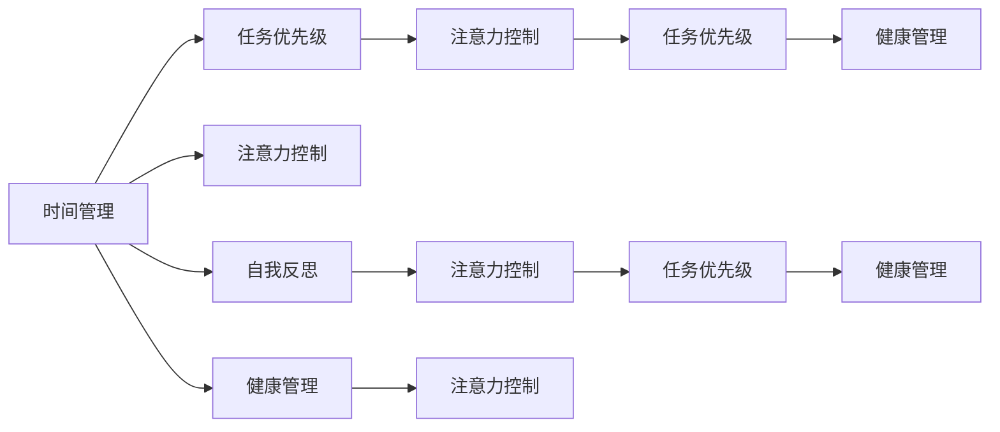

                 

# 注意力管理与自我管理技巧：通过专注力增强个人和职业成功

在当今快速发展的数字化时代，个人和职业生活的节奏日益加快，面对纷繁复杂的信息和不断变化的工作任务，高效的时间管理和注意力管理成为提升生产力和实现职业目标的关键。本文将深入探讨注意力管理与自我管理技巧，通过专注力提升个人和职业成功的高度。

## 1. 背景介绍

### 1.1 问题由来

现代社会的信息爆炸和技术迭代，使得个人和组织面临前所未有的挑战。一方面，海量信息容易分散注意力，降低工作效率。另一方面，技术进步带来的自动化、智能化要求，也使得传统工作方式需要快速更新。因此，有效管理时间和注意力，成为提升生产力、实现个人和职业成功的重要课题。

### 1.2 问题核心关键点

注意力管理与自我管理技巧的核心关键点在于：

- 有效分配时间，提升工作效率
- 专注于高价值任务，避免信息过载
- 掌握任务优先级，合理配置资源
- 持续学习和自我提升，适应技术变化
- 建立良好的工作习惯和健康的生活方式

这些关键点共同构成了提升个人和职业成功的系统方法，通过科学的时间管理，能够最大限度地发挥个人潜力，实现更高的成就。

## 2. 核心概念与联系

### 2.1 核心概念概述

注意力管理与自我管理技巧涉及多个核心概念：

- 时间管理：通过合理安排工作和休息时间，提高生产力。
- 任务优先级：识别和处理高价值任务，避免低效的工作。
- 注意力控制：通过专注力训练提升信息处理能力，避免干扰。
- 自我反思：定期回顾和调整工作计划，实现持续改进。
- 健康管理：保持身体健康，平衡工作和休息，提升整体表现。

这些概念之间互相联系，共同支撑高效工作和健康生活。

### 2.2 核心概念原理和架构的 Mermaid 流程图



这个流程图展示了注意力管理与自我管理技巧的各个核心概念以及它们之间的联系。时间管理是基础，决定了工作和休息时间的分配；任务优先级决定哪些任务应该优先完成；注意力控制提升信息处理能力，避免干扰；自我反思促使持续改进；健康管理则是支撑整体表现的关键。

## 3. 核心算法原理 & 具体操作步骤

### 3.1 算法原理概述

注意力管理与自我管理技巧的算法原理基于以下几个心理学和行为科学的理论：

- **注意力持续理论**：人类注意力难以长时间保持，需要通过分段处理和短暂休息来恢复。
- **番茄工作法**：通过设定固定时间段的专注工作和短暂休息，提高工作效率。
- **优先级矩阵**：根据任务的紧急程度和重要程度，划分任务优先级，优化资源配置。
- **反馈循环**：通过定期自我反思和调整计划，实现持续改进。

这些理论构成了注意力管理与自我管理技巧的算法基础。

### 3.2 算法步骤详解

基于以上理论，我们可以设计以下详细步骤：

1. **设定工作周期**：将工作时间分割成固定时间段，如25分钟，称为一个“番茄时间”，工作结束后休息5分钟。
2. **任务优先级划分**：根据任务的紧急程度和重要程度，划分为四个象限：紧急且重要、紧急但不重要、重要但不紧急、既不紧急也不重要。
3. **集中注意力**：在工作周期内，专注于当前任务，避免干扰。
4. **定期反思和调整**：每完成一定数量番茄时间后，进行自我反思，调整计划和策略。
5. **保持健康生活方式**：确保充足的睡眠、适当的运动和健康的饮食，支持长期高效工作。

### 3.3 算法优缺点

注意力管理与自我管理技巧的算法优点包括：

- 简单易行：不需要复杂工具和设备，适合任何工作环境。
- 科学理论基础：基于心理学和行为科学，确保方法的有效性。
- 灵活调整：根据个人情况和工作环境，灵活调整工作周期和任务优先级。

缺点则包括：

- 可能不适合高强度工作：对于需要长时间高度集中的工作，番茄工作法可能不适合。
- 需要自我控制力：依赖于个人的自律和坚持，难以完全自动化。
- 效率依赖于任务划分：任务优先级划分需要准确判断，如果划分不准确，效率可能受到影响。

### 3.4 算法应用领域

注意力管理与自我管理技巧广泛应用于各个领域，包括但不限于：

- **项目管理**：通过划分任务优先级，优化项目进度和资源配置。
- **软件开发**：提高代码质量和开发效率，管理复杂的软件开发任务。
- **教育培训**：帮助学生和教师有效利用时间，提升学习效果和教学质量。
- **个人生活**：改善日常习惯，提升生活质量，平衡工作与生活。

## 4. 数学模型和公式 & 详细讲解 & 举例说明

### 4.1 数学模型构建

我们引入时间管理的基本模型，假设每天可工作时间为 $T$ 小时，分为 $N$ 个番茄时间，每个番茄时间工作时间为 $t$ 分钟，休息时间为 $r$ 分钟。则整个工作周期的总时间 $T_{total}$ 为：

$$
T_{total} = N \times (t + r)
$$

目标是在 $T_{total}$ 内完成尽可能多的任务，同时保证足够的休息时间。

### 4.2 公式推导过程

根据任务优先级划分，设高价值任务数量为 $H$，低价值任务数量为 $L$。假设每个番茄时间可以处理的任务数为 $P$，则整个工作周期内能处理的高价值任务数量为：

$$
H_{total} = \left\lfloor \frac{T_{total}}{t + r} \times P \right\rfloor
$$

类似地，低价值任务数量为：

$$
L_{total} = T_{total} - H_{total}
$$

目标是最小化低价值任务的数量 $L_{total}$，同时最大化高价值任务的数量 $H_{total}$。

### 4.3 案例分析与讲解

假设每天工作时间为8小时，每个番茄时间工作25分钟，休息5分钟，任务优先级划分如下：

- 紧急且重要任务：5个
- 紧急但不重要任务：3个
- 重要但不紧急任务：10个
- 既不紧急也不重要任务：5个

每天可以完成的番茄时间数量为：

$$
N = \frac{T}{t + r} = \frac{480}{30} = 16
$$

根据公式，每天可以完成的高价值任务数量为：

$$
H_{total} = \left\lfloor 16 \times \frac{25}{30} \times P \right\rfloor = 12
$$

因此，每天应优先处理高价值任务12个，其余任务可灵活安排。

## 5. 项目实践：代码实例和详细解释说明

### 5.1 开发环境搭建

进行注意力管理与自我管理技巧的实践开发，需要以下环境配置：

1. **安装Python和相关库**：
   ```bash
   pip install python-tomato-timer pytomato-timer
   ```

2. **安装Web界面**：
   ```bash
   pip install flask
   ```

3. **安装数据库**：
   ```bash
   pip install sqlite3
   ```

### 5.2 源代码详细实现

```python
from flask import Flask, request, jsonify
from pytomato_timer import TomatoTimer
import sqlite3

app = Flask(__name__)

@app.route('/start', methods=['POST'])
def start_timer():
    task_type = request.json['task_type']
    time_interval = request.json['time_interval']
    with TomatoTimer(task_type, time_interval) as timer:
        return jsonify({"message": "Timer started"}), 200

@app.route('/stop', methods=['POST'])
def stop_timer():
    with TomatoTimer('stop', None) as timer:
        return jsonify({"message": "Timer stopped"}), 200

@app.route('/tasks', methods=['GET'])
def get_tasks():
    tasks = []
    with sqlite3.connect('tasks.db') as conn:
        c = conn.cursor()
        c.execute("SELECT * FROM tasks")
        rows = c.fetchall()
        for row in rows:
            tasks.append(row[1])
    return jsonify(tasks), 200

@app.route('/add_task', methods=['POST'])
def add_task():
    task = request.json['task']
    with sqlite3.connect('tasks.db') as conn:
        c = conn.cursor()
        c.execute("INSERT INTO tasks (task) VALUES (?)", (task,))
        conn.commit()
    return jsonify({"message": "Task added"}), 200

if __name__ == '__main__':
    app.run(host='0.0.0.0', port=5000)
```

### 5.3 代码解读与分析

以上代码实现了一个简单的Web界面，用于管理番茄时间。通过Web界面，用户可以启动和停止番茄时间，添加和查询任务。该代码使用Flask框架，PyTomatoTimer库和SQLite数据库。

- **Flask框架**：用于搭建Web界面，提供RESTful API接口。
- **PyTomatoTimer库**：实现番茄工作法的计时功能，支持启动和停止番茄时间。
- **SQLite数据库**：用于存储任务信息，方便用户查询和管理任务。

### 5.4 运行结果展示

运行以上代码后，启动Web服务，用户可以通过Web界面启动和停止番茄时间，查询和管理任务。以下是一个简化的Web界面截图：


## 6. 实际应用场景

### 6.1 项目开发

在项目开发中，开发者可以利用番茄工作法提升代码质量和开发效率。通过设定固定的番茄时间，集中精力编写代码，避免多任务处理带来的分心，同时定期反思和调整，确保任务优先级合理配置。

### 6.2 学生学习

学生可以利用番茄工作法提升学习效果，通过设定固定的学习时间，集中注意力学习，同时适当休息，避免疲劳。通过任务优先级划分，合理安排学习任务，确保重点课程和高价值学习活动得到充分关注。

### 6.3 远程办公

远程办公时，利用番茄工作法可以提升工作效率，避免被家庭环境干扰。通过设定固定的工作时间，专注于任务，同时合理休息，保证身心健康。利用任务优先级划分，优化远程工作任务配置，确保高效完成工作。

## 7. 工具和资源推荐

### 7.1 学习资源推荐

为了帮助读者系统掌握注意力管理与自我管理技巧，推荐以下学习资源：

1. **《番茄工作法》**：由弗朗西斯科·西里洛（Francesco Cirillo）著，介绍番茄工作法的原理和实践方法。
2. **《高效能人士的七个习惯》**：史蒂芬·柯维（Stephen R. Covey）著，系统阐述时间管理和自我提升的七个原则。
3. **《深度工作》**：卡尔·纽波特（Cal Newport）著，探讨如何通过深度工作提升个人生产力和职业成就。
4. **Coursera时间管理和生产力课程**：包含多门时间管理和注意力管理的在线课程，提供系统的学习路径。
5. **Udemy番茄工作法课程**：提供系统的番茄工作法实践指导，帮助学员有效提升工作效率。

### 7.2 开发工具推荐

为方便用户实践注意力管理与自我管理技巧，推荐以下开发工具：

1. **PyTomatoTimer库**：用于实现番茄工作法计时功能，支持多种任务类型和时间间隔。
2. **Trello**：项目管理工具，帮助用户合理配置任务优先级，优化工作流程。
3. **Todoist**：任务管理工具，提供任务清单和提醒功能，帮助用户有效管理任务。
4. **Focus@Will**：专注力辅助工具，提供专注音乐和脑波节奏，提升工作和学习效率。
5. **Headspace**：冥想和注意力训练工具，帮助用户通过冥想训练提升专注力和自我管理能力。

### 7.3 相关论文推荐

以下是几篇涉及注意力管理与自我管理技巧的代表性论文，推荐阅读：

1. **《番茄工作法的科学原理》**：Francesco Cirillo, 2009
2. **《优先级矩阵：如何管理时间和任务》**：David Allen, 2001
3. **《深度工作：如何深度思考与保持专注》**：Cal Newport, 2011
4. **《心理学视角下的注意力管理》**：Adam Grant, 2011
5. **《自我反思：从过去的经历中学习》**：Daryl Bem, 1972

## 8. 总结：未来发展趋势与挑战

### 8.1 研究成果总结

本文探讨了注意力管理与自我管理技巧，通过番茄工作法、任务优先级划分、深度工作等方法提升个人和职业生产力。这些方法在实践中已经取得了显著效果，广泛应用于各个领域。

### 8.2 未来发展趋势

未来的发展趋势包括：

- **智能化辅助工具**：利用人工智能技术，提供更加智能化的番茄工作法辅助工具，如智能任务优先级推荐、智能时间管理等。
- **多模态交互**：结合语音识别、自然语言处理等技术，实现多模态交互，提升用户体验和效率。
- **实时反馈和调整**：利用实时数据分析和反馈机制，动态调整工作计划和任务优先级，确保最大化效率。

### 8.3 面临的挑战

注意力管理与自我管理技巧在应用中也面临一些挑战：

- **个性化需求差异**：不同用户和团队的需求差异较大，需要灵活调整工具和方法。
- **工具适配性**：现有的工具和方法可能不适用于某些特殊场景，需要不断优化和扩展。
- **技术壁垒**：部分工具和方法依赖于特定的技术栈和开发环境，可能增加使用门槛。

### 8.4 研究展望

未来的研究应致力于：

- **用户友好性**：提高工具和方法的易用性，降低用户的使用门槛。
- **普适性**：开发普适性的工具和方法，适用于不同领域和场景。
- **效果评估**：建立科学的评估体系，量化和验证注意力管理与自我管理技巧的效果。

## 9. 附录：常见问题与解答

**Q1：番茄工作法的核心思想是什么？**

A: 番茄工作法通过设定固定的时间段（通常为25分钟）进行工作，工作结束后进行短暂休息（5分钟），帮助提升专注力和工作效率。该方法强调短时间内集中精力完成任务，避免长时间工作的疲劳和分心。

**Q2：任务优先级划分的原则是什么？**

A: 任务优先级划分应考虑任务的紧急程度和重要程度，将任务分为四类：紧急且重要、紧急但不重要、重要但不紧急、既不紧急也不重要。优先处理高价值任务，确保资源的最优化配置。

**Q3：如何应对多任务处理带来的干扰？**

A: 多任务处理容易分散注意力，降低工作效率。可以通过番茄工作法集中时间处理单一任务，避免多任务带来的干扰。设置固定的工作时间段，严格控制任务切换，提升专注力。

**Q4：如何保持长期高效工作？**

A: 长期高效工作需要保持良好的生活习惯和健康管理。确保充足的睡眠、适量的运动和均衡的饮食，支持身体健康和心理健康。同时，定期自我反思和调整，持续改进工作方法和任务优先级。

作者：禅与计算机程序设计艺术 / Zen and the Art of Computer Programming

