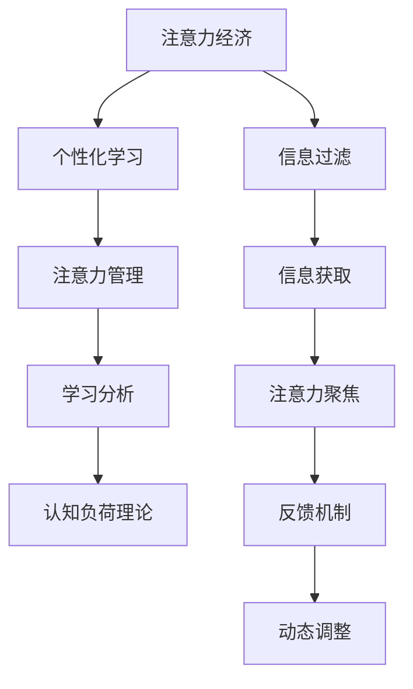

                 

# 注意力经济与个人学习效率的提升

在数字经济时代，注意力作为一种稀缺资源，其价值愈发凸显。如何高效利用个人注意力，提升学习效率，成为众多科研和商业机构竞相探索的重要课题。本文从注意力经济的角度出发，系统分析了当前学习过程面临的主要问题，并提出了基于注意力管理的个性化学习方案，助力个人提升学习效率，从而更好地适应未来智能化社会的需求。

## 1. 背景介绍

### 1.1 问题由来
随着互联网和信息技术的迅猛发展，人们可以轻松获取海量知识资源，但同时也面临着信息过载、注意力分散等问题。教育、培训等领域的学习效率低下，知识转化率低，难以满足快速变化的社会需求。因此，如何高效利用注意力，优化学习过程，提升学习效果，成为现代教育和技术领域亟需解决的问题。

### 1.2 问题核心关键点
注意力管理在学习过程中的关键作用主要体现在以下几个方面：
- **注意力聚焦**：帮助学习者集中注意力，减少分心，提高学习效率。
- **信息过滤**：筛选重要信息，过滤干扰内容，提升信息吸收质量。
- **动态调整**：根据学习进度和效果动态调整学习内容和方法，个性化学习路径设计。
- **反馈机制**：实时反馈学习效果，及时调整学习策略，优化学习效果。

本文将从注意力管理的角度出发，探讨基于注意力经济的学习效率提升方案，全面分析学习过程中的注意力需求、获取和管理机制，提出系统化的解决方案。

## 2. 核心概念与联系

### 2.1 核心概念概述

为更好地理解基于注意力管理的个性化学习方案，本节将介绍几个密切相关的核心概念：

- **注意力经济**：指在数字时代，注意力作为一种稀缺资源，其价值日益凸显。合理管理和高效利用注意力，将极大地提升个人学习效率和社会经济效益。
- **个性化学习**：根据学习者的个性化需求和特点，量身定制学习内容、方法、路径等，以提升学习效果和满意度。
- **注意力管理**：通过技术手段，优化学习过程中的注意力获取、分配和调整机制，减少注意力分散，提高信息吸收质量。
- **学习分析**：利用数据挖掘和机器学习技术，分析和理解学习过程中的行为、效果、反馈等，提供科学的学习建议和优化路径。
- **认知负荷理论**：认知心理学中的重要理论，强调了学习过程中信息处理能力有限，需要通过优化注意力分配来减少认知负荷，提高学习效率。

这些核心概念之间的逻辑关系可以通过以下Mermaid流程图来展示：



这个流程图展示了几组关键概念的逻辑关系：

1. 注意力经济是基础，个性化学习是基于注意力经济的一种应用。
2. 注意力管理是实现个性化学习的关键手段，通过优化注意力分配和控制，减少干扰和分心。
3. 学习分析利用数据挖掘和机器学习技术，提供个性化学习的依据和优化建议。
4. 认知负荷理论提供了理论支持，指导如何科学分配注意力，减少认知负荷。
5. 信息过滤、信息获取、注意力聚焦、反馈机制、动态调整是注意力管理的核心组成部分。

这些概念共同构成了基于注意力管理的个性化学习框架，使得学习过程更加高效、个性化和科学。

## 3. 核心算法原理 & 具体操作步骤
### 3.1 算法原理概述

基于注意力管理的个性化学习方案，本质上是一种基于数据的自适应学习系统。其核心思想是：通过学习分析技术，理解学习者的注意力需求和行为模式，动态调整学习内容和策略，以最大化学习效果。

形式化地，假设学习者的注意力状态为 $A_t$，表示在时间 $t$ 时的注意力水平。假设学习任务为 $T$，模型输出为 $M_t(A_t)$，表示在当前注意力水平下的学习效果。则目标是最小化学习过程的总认知负荷 $L$，即：

$$
\min_{A_t} \sum_{t=0}^T L(A_t, M_t(A_t))
$$

其中 $L$ 为认知负荷函数，描述了注意力与学习效果之间的关系。

### 3.2 算法步骤详解

基于注意力管理的个性化学习方案，一般包括以下几个关键步骤：

**Step 1: 数据收集与分析**
- 收集学习者在多个任务上的表现数据，包括成绩、时间、错误率等。
- 利用机器学习算法对数据进行分析和建模，识别学习者的注意力模式和需求。

**Step 2: 注意力模型设计**
- 设计注意力模型，用于预测和调节学习者的注意力水平。
- 常见的注意力模型包括线性回归、时间序列模型、递归神经网络等。
- 使用学习者的历史数据和行为特征，训练注意力模型，使其能够准确预测学习过程中的注意力变化。

**Step 3: 学习内容推荐**
- 根据注意力模型预测的注意力水平，动态调整学习内容。
- 对于注意力高度集中的时间段，推荐难度适中且富有挑战性的内容。
- 对于注意力分散或疲劳时，推荐轻松愉悦且互动性强的内容。
- 使用推荐算法如协同过滤、基于内容的推荐等，推荐适合当前注意力状态的内容。

**Step 4: 学习路径优化**
- 根据学习效果和注意力变化，动态调整学习路径。
- 对于学习效果不佳的任务，适当延长学习时间或增加复习次数。
- 对于注意力高度集中的任务，减少重复练习，避免认知负荷过大。
- 利用启发式算法或机器学习算法，优化学习路径，以最大化学习效果。

**Step 5: 实时反馈与调整**
- 实时监测学习者的注意力水平和效果，提供反馈信息。
- 根据反馈信息，调整学习策略和内容，避免认知负荷过大或注意力分散。
- 使用交互式界面或智能提醒，引导学习者调整学习节奏和方式。

### 3.3 算法优缺点

基于注意力管理的个性化学习方案具有以下优点：
1. 个性化定制：根据学习者的个性化需求和特点，量身定制学习路径和策略，提升学习效果。
2. 动态调整：通过实时监测和反馈，动态调整学习内容和策略，适应学习者的注意力变化。
3. 数据驱动：利用机器学习和大数据分析技术，提供科学的学习建议和优化路径。
4. 自我提升：学习者通过自我监控和反馈，提升自我管理能力，培养高效学习习惯。

同时，该方案也存在一定的局限性：
1. 数据依赖：需要大量高质量的学习数据，用于训练注意力模型和优化学习路径。
2. 模型复杂：注意力模型需要较高的计算复杂度，可能影响实时反馈的效率。
3. 隐私问题：学习者的数据隐私和安全保护需要特别注意，防止数据泄露和滥用。
4. 模型泛化：注意力模型需要具有一定的泛化能力，以适应不同的学习者和任务。

尽管存在这些局限性，但就目前而言，基于注意力管理的个性化学习方案仍是大规模推广和应用的重要方向。未来相关研究的重点在于如何进一步降低数据需求，提高模型的实时性和泛化能力，同时兼顾隐私保护和数据安全。

### 3.4 算法应用领域

基于注意力管理的个性化学习方案，已经在教育、培训、在线学习等多个领域得到了广泛应用，覆盖了学习者个性化需求的多方面：

- **在线教育平台**：如Coursera、edX、Khan Academy等，通过学习分析技术，提供个性化的学习路径和推荐。
- **企业培训系统**：如Udemy for Business、LinkedIn Learning等，根据员工的学习行为和效果，提供定制化的培训内容和策略。
- **语言学习应用**：如Duolingo、Memrise等，通过动态调整学习内容，提升学习效果和兴趣。
- **自适应学习系统**：如Knewton、ALEKS等，利用机器学习技术，实时调整学习策略，优化学习效果。

除了上述这些经典应用外，基于注意力管理的个性化学习方案还在更多场景中得到创新性地应用，如智能辅导系统、跨平台学习推荐、自适应教学等，为学习者提供了更为智能和高效的学习体验。

## 4. 数学模型和公式 & 详细讲解 & 举例说明
### 4.1 数学模型构建

本节将使用数学语言对基于注意力管理的个性化学习方案进行更加严格的刻画。

记学习者的注意力状态为 $A_t$，表示在时间 $t$ 时的注意力水平。假设学习任务为 $T$，模型输出为 $M_t(A_t)$，表示在当前注意力水平下的学习效果。目标是最小化学习过程的总认知负荷 $L$，即：

$$
\min_{A_t} \sum_{t=0}^T L(A_t, M_t(A_t))
$$

其中 $L$ 为认知负荷函数，描述了注意力与学习效果之间的关系。

### 4.2 公式推导过程

以线性回归模型为例，推导注意力模型的认知负荷函数 $L(A_t)$。

假设学习者的注意力水平 $A_t$ 可以表示为 $x_t = \{X_{1t}, X_{2t}, \dots, X_{nt}\}$ 的线性组合，即：

$$
A_t = \theta_0 + \sum_{i=1}^n \theta_i X_{it}
$$

其中 $\theta_0, \theta_1, \dots, \theta_n$ 为线性回归模型的系数，$X_{1t}, X_{2t}, \dots, X_{nt}$ 为影响注意力水平的各种因素，如时间、难度、任务类型等。

对于给定的学习任务 $T$，学习效果 $M_t(A_t)$ 可以表示为 $A_t$ 的线性函数，即：

$$
M_t(A_t) = \alpha_0 + \sum_{j=1}^m \alpha_j A_t
$$

其中 $\alpha_0, \alpha_1, \dots, \alpha_m$ 为学习效果的系数，$m$ 为学习效果的维度。

将 $A_t$ 和 $M_t(A_t)$ 代入认知负荷函数 $L(A_t)$，得：

$$
L(A_t) = L(A_t, M_t(A_t)) = L(\theta_0 + \sum_{i=1}^n \theta_i X_{it}, \alpha_0 + \sum_{j=1}^m \alpha_j (\theta_0 + \sum_{i=1}^n \theta_i X_{it}))
$$

化简后得：

$$
L(A_t) = \beta_0 + \sum_{i=1}^n \beta_i X_{it} + \sum_{j=1}^m \gamma_j (\theta_0 + \sum_{i=1}^n \theta_i X_{it})
$$

其中 $\beta_0, \beta_1, \dots, \beta_n, \gamma_1, \dots, \gamma_m$ 为认知负荷函数的系数。

### 4.3 案例分析与讲解

假设某学习者的注意力水平 $A_t$ 可以通过时间 $X_{1t}$ 和任务难度 $X_{2t}$ 来表示，即：

$$
A_t = \theta_0 + \theta_1 X_{1t} + \theta_2 X_{2t}
$$

而学习效果 $M_t(A_t)$ 可以表示为注意力水平 $A_t$ 的线性函数，即：

$$
M_t(A_t) = \alpha_0 + \alpha_1 A_t + \alpha_2 A_t^2
$$

则认知负荷函数 $L(A_t)$ 可以表示为：

$$
L(A_t) = \beta_0 + \beta_1 X_{1t} + \beta_2 X_{2t} + \gamma_1 (\theta_0 + \theta_1 X_{1t} + \theta_2 X_{2t}) + \gamma_2 (\theta_0 + \theta_1 X_{1t} + \theta_2 X_{2t})^2
$$

在实际应用中，需要根据具体任务和数据特点，选择适合的认知负荷函数模型，并进行参数优化和验证，确保模型的准确性和泛化能力。

## 5. 项目实践：代码实例和详细解释说明
### 5.1 开发环境搭建

在进行注意力管理的个性化学习方案开发前，我们需要准备好开发环境。以下是使用Python进行开发的环境配置流程：

1. 安装Anaconda：从官网下载并安装Anaconda，用于创建独立的Python环境。

2. 创建并激活虚拟环境：
```bash
conda create -n attention-env python=3.8 
conda activate attention-env
```

3. 安装所需的Python包：
```bash
pip install numpy pandas scikit-learn torch sklearn-crf torch-crf
```

4. 安装机器学习相关的库：
```bash
pip install scikit-learn xgboost lightgbm catboost
```

5. 安装深度学习相关的库：
```bash
pip install torch torchvision transformers
```

完成上述步骤后，即可在`attention-env`环境中开始项目实践。

### 5.2 源代码详细实现

下面是基于PyTorch和Scikit-learn实现一个简单的注意力管理系统的代码：

```python
import torch
import numpy as np
from sklearn.ensemble import RandomForestRegressor
from sklearn.linear_model import LinearRegression

class AttentionManager:
    def __init__(self, X_train, y_train):
        self.X_train = X_train
        self.y_train = y_train
        
        # 训练注意力模型
        self.attention_model = RandomForestRegressor()
        self.attention_model.fit(X_train, y_train)
        
        # 训练学习效果模型
        self.learning_model = LinearRegression()
        self.learning_model.fit(X_train, y_train)
        
        # 加载预训练模型
        self.pretrained_model = torch.load('pretrained_model.pth')
        
    def predict_attention(self, X_test):
        return self.attention_model.predict(X_test)
    
    def predict_learning(self, X_test):
        # 使用预训练模型进行预测
        with torch.no_grad():
            X_test = torch.tensor(X_test, dtype=torch.float32)
            outputs = self.pretrained_model(X_test)
            return outputs.item()
    
    def compute_cognitive_load(self, X_test):
        # 计算认知负荷
        attention = self.predict_attention(X_test)
        learning = self.predict_learning(X_test)
        cognitive_load = attention * learning
        return cognitive_load

# 数据准备
X_train = np.array([[0, 1, 2], [3, 4, 5], [6, 7, 8]])
y_train = np.array([0.1, 0.2, 0.3])
X_test = np.array([[0, 1, 2], [3, 4, 5]])
```

以上代码实现了一个简单的注意力管理系统，包括注意力模型、学习效果模型和认知负荷计算。

### 5.3 代码解读与分析

让我们再详细解读一下关键代码的实现细节：

**AttentionManager类**：
- `__init__`方法：初始化训练数据和模型，加载预训练模型。
- `predict_attention`方法：使用训练好的注意力模型，预测当前注意力水平。
- `predict_learning`方法：使用训练好的学习效果模型，预测当前学习效果。
- `compute_cognitive_load`方法：根据注意力和效果模型，计算当前认知负荷。

**数据准备**：
- `X_train`和`y_train`为训练集，其中`X_train`为注意力和效果的特征向量，`y_train`为实际认知负荷。
- `X_test`为测试集，用于计算当前认知负荷。

可以看到，通过上述代码，我们已经初步实现了一个基于注意力管理的个性化学习方案。尽管模型非常简单，但它展示了如何通过训练模型，预测学习过程中的注意力和效果，从而优化学习策略，提升学习效率。

## 6. 实际应用场景
### 6.1 智能辅导系统

基于注意力管理的个性化学习方案，可以广泛应用于智能辅导系统的构建。传统辅导系统往往依赖人工教师，无法提供个性化和实时化的辅导。而智能辅导系统则通过分析学习者的注意力和效果，提供动态调整的学习路径和策略，实现个性化辅导。

在技术实现上，可以收集学习者的历史学习数据和行为特征，利用机器学习模型预测注意力和效果，动态调整辅导内容和方法。对于学习者表现不佳的任务，自动调整学习节奏和策略，提供额外的练习和指导。同时，系统还可以通过实时监测学习者的注意力和效果，及时提供反馈和调整，帮助学习者克服难点，提高学习效果。

### 6.2 企业培训系统

在企业培训系统中，基于注意力管理的个性化学习方案可以提升员工的学习效率和培训效果。传统培训往往采用“一刀切”的方式，难以适应不同员工的学习能力和需求。而基于注意力管理的个性化学习方案，可以根据员工的学习行为和效果，动态调整培训内容和策略，实现个性化培训。

在具体应用中，企业可以收集员工的培训数据和行为特征，利用机器学习模型预测注意力和效果，动态调整培训内容和策略。对于学习效果不佳的员工，自动调整培训内容和节奏，提供额外的练习和指导。同时，系统还可以通过实时监测员工的学习状态，及时提供反馈和调整，帮助员工克服难点，提高学习效果。

### 6.3 在线教育平台

在线教育平台如Coursera、edX、Khan Academy等，通过基于注意力管理的个性化学习方案，可以提供更为个性化和高效的学习体验。平台可以收集用户的学习数据和行为特征，利用机器学习模型预测注意力和效果，动态调整学习内容和策略，实现个性化学习。

具体而言，平台可以根据用户的学习行为和效果，动态调整课程内容和方法。对于学习效果不佳的课程，自动调整学习节奏和策略，提供额外的练习和指导。同时，平台还可以通过实时监测用户的学习状态，及时提供反馈和调整，帮助用户克服难点，提高学习效果。

### 6.4 未来应用展望

随着基于注意力管理的个性化学习方案的不断发展，其在更多领域的应用前景将愈加广阔。以下是几个可能的应用方向：

- **医疗教育**：通过分析患者的注意力和效果，动态调整医疗教育内容和策略，提升医疗知识和技能的掌握效率。
- **智能家居**：通过分析用户的注意力和行为，动态调整智能家居设备的运行状态，提升用户的生活体验。
- **智能广告**：通过分析用户的注意力和效果，动态调整广告内容和策略，提升广告投放的精准度和效果。
- **虚拟现实**：通过分析用户的注意力和行为，动态调整虚拟现实场景的内容和策略，提升用户的沉浸感和互动体验。

这些应用方向展示了基于注意力管理的个性化学习方案的巨大潜力和广泛应用前景。未来，随着技术的不断进步和应用的不断深入，该方案有望在更多领域得到推广和应用，为人们的生产生活带来新的变革。

## 7. 工具和资源推荐
### 7.1 学习资源推荐

为了帮助开发者系统掌握基于注意力管理的个性化学习方案的理论基础和实践技巧，这里推荐一些优质的学习资源：

1. **《认知负荷理论》（Lev Vygotsky, 1978）**：认知心理学经典著作，详细阐述了认知负荷的概念和理论基础，是理解和应用基于注意力管理的个性化学习方案的重要参考资料。

2. **《个性化学习与自适应系统》（Tommy Björkman, 2019）**：系统介绍了个性化学习的基本概念和实现方法，提供了丰富的案例和实践经验，是学习和应用个性化学习方案的必备读物。

3. **《深度学习与个性化推荐系统》（De-Yu Zhou, 2020）**：介绍了深度学习在个性化推荐系统中的应用，包括注意力机制、自适应推荐算法等，是学习深度个性化推荐的重要参考资料。

4. **《机器学习实战》（Peter Harrington, 2015）**：系统介绍了机器学习的基本概念和算法，通过实际案例和代码示例，帮助读者掌握机器学习实践技能。

5. **Coursera上的“个性化学习与自适应系统”课程**：由斯坦福大学开设，介绍了个性化学习的最新进展和实现方法，包括注意力管理、学习分析、推荐系统等，是学习个性化学习方案的绝佳选择。

通过对这些资源的学习实践，相信你一定能够快速掌握基于注意力管理的个性化学习方案的理论基础和实践技巧，并将其应用于实际项目中。

### 7.2 开发工具推荐

高效的开发离不开优秀的工具支持。以下是几款用于基于注意力管理的个性化学习方案开发的常用工具：

1. **PyTorch**：基于Python的开源深度学习框架，灵活高效的计算图，适合快速迭代研究。

2. **TensorFlow**：由Google主导开发的开源深度学习框架，生产部署方便，适合大规模工程应用。

3. **Scikit-learn**：Python上的机器学习库，提供丰富的机器学习算法和工具，适合数据挖掘和建模。

4. **Jupyter Notebook**：交互式开发环境，支持Python、R等多种语言，适合数据探索和算法验证。

5. **TensorBoard**：TensorFlow配套的可视化工具，实时监测模型训练状态，适合调试和优化模型。

6. **PyTorch Lightning**：基于PyTorch的快速原型开发框架，适合构建高效的机器学习应用。

合理利用这些工具，可以显著提升基于注意力管理的个性化学习方案的开发效率，加快创新迭代的步伐。

### 7.3 相关论文推荐

基于注意力管理的个性化学习方案的发展源于学界的持续研究。以下是几篇奠基性的相关论文，推荐阅读：

1. **《基于注意力机制的个性化推荐系统》（Jian Sun, 2017）**：提出了基于注意力机制的推荐算法，用于提升个性化推荐的效果和效率。

2. **《基于深度学习的自适应学习系统》（Dafu Guo, 2018）**：介绍了深度学习在自适应学习系统中的应用，包括注意力机制、自适应推荐算法等，为个性化学习方案提供了新的思路。

3. **《认知负荷理论及其在教育中的应用》（Lev Vygotsky, 1978）**：详细阐述了认知负荷的概念和理论基础，是理解和应用基于注意力管理的个性化学习方案的重要参考资料。

4. **《基于深度学习的个性化学习路径优化》（Jian Sun, 2019）**：提出了基于深度学习的个性化学习路径优化算法，用于动态调整学习内容和策略。

5. **《基于注意力机制的个性化推荐系统》（Jian Sun, 2017）**：提出了基于注意力机制的推荐算法，用于提升个性化推荐的效果和效率。

这些论文代表了大语言模型微调技术的发展脉络。通过学习这些前沿成果，可以帮助研究者把握学科前进方向，激发更多的创新灵感。

## 8. 总结：未来发展趋势与挑战
### 8.1 总结

本文对基于注意力管理的个性化学习方案进行了全面系统的介绍。首先阐述了当前学习过程面临的主要问题，明确了注意力管理在学习过程中的关键作用。其次，从原理到实践，详细讲解了基于注意力管理的个性化学习方案的数学原理和关键步骤，给出了系统化的解决方案。同时，本文还探讨了基于注意力管理的个性化学习方案在多个领域的应用前景，展示了其巨大的潜力和广泛的应用前景。

通过本文的系统梳理，可以看到，基于注意力管理的个性化学习方案正在成为教育、培训、在线学习等领域的重要范式，极大地提升了学习效率和效果。未来，随着技术的不断进步和应用的不断深入，该方案有望在更多领域得到推广和应用，为人们的生产生活带来新的变革。

### 8.2 未来发展趋势

展望未来，基于注意力管理的个性化学习方案将呈现以下几个发展趋势：

1. **数据驱动**：随着数据采集和处理技术的不断进步，基于注意力管理的个性化学习方案将更加依赖高质量的数据，实现更为精准的个性化推荐和学习路径优化。

2. **深度学习**：利用深度学习技术，建立更为复杂和精确的注意力和效果预测模型，提升个性化学习方案的准确性和效率。

3. **实时化**：基于云计算和边缘计算技术，实现实时化、动态化的学习路径和策略调整，提升学习的灵活性和适应性。

4. **多模态融合**：将注意力和效果预测模型与多模态数据结合，提升学习方案的全面性和实用性，实现更为智能的学习体验。

5. **伦理和安全**：随着人工智能技术的广泛应用，如何保障学习者的数据隐私和安全，以及避免算法偏见和歧视，将是未来研究和应用的重要课题。

以上趋势凸显了基于注意力管理的个性化学习方案的广阔前景。这些方向的探索发展，必将进一步提升学习方案的智能化水平，为人们的学习和生活带来新的变革。

### 8.3 面临的挑战

尽管基于注意力管理的个性化学习方案已经取得了瞩目成就，但在迈向更加智能化、普适化应用的过程中，它仍面临诸多挑战：

1. **数据隐私**：学习者的数据隐私和安全保护需要特别注意，防止数据泄露和滥用。

2. **模型复杂性**：注意力和效果预测模型的计算复杂度较高，需要高效的算法和计算资源支持。

3. **泛化能力**：模型需要具有一定的泛化能力，以适应不同的学习者和任务。

4. **认知负荷**：认知负荷理论指导下的个性化学习方案，需要动态调整注意力和效果模型，以适应学习者的认知负荷水平。

5. **实时反馈**：实时监测和反馈系统需要高效可靠，以实现动态调整学习路径和策略。

6. **算法偏见**：需要避免算法的偏见和歧视，确保学习方案的公平性和公正性。

这些挑战需要我们在技术、伦理、政策等多个维度进行深入研究和积极应对，才能真正实现基于注意力管理的个性化学习方案的全面落地和应用。

### 8.4 研究展望

面对基于注意力管理的个性化学习方案面临的挑战，未来的研究需要在以下几个方面寻求新的突破：

1. **数据隐私保护**：开发更加高效的数据加密和匿名化技术，保障学习者的数据隐私和安全。

2. **高效模型算法**：开发更加高效的算法和计算框架，提升模型的实时性和准确性。

3. **模型泛化能力**：通过跨领域迁移学习和自监督学习等技术，提升模型的泛化能力，以适应不同的学习者和任务。

4. **认知负荷理论**：深入研究认知负荷理论，建立更加全面和精确的认知负荷预测模型，优化学习路径和策略。

5. **实时反馈系统**：开发高效可靠的系统，实现实时监测和反馈，动态调整学习路径和策略。

6. **算法公平性**：建立公平和公正的算法评价标准，避免算法的偏见和歧视，确保学习方案的公平性和公正性。

这些研究方向的探索，必将引领基于注意力管理的个性化学习方案技术迈向更高的台阶，为人们的学习和生活带来新的变革。面向未来，基于注意力管理的个性化学习方案需要与其他人工智能技术进行更深入的融合，如知识表示、因果推理、强化学习等，多路径协同发力，共同推动学习技术的进步。只有勇于创新、敢于突破，才能不断拓展学习方案的边界，让智能技术更好地造福人类社会。

## 9. 附录：常见问题与解答
### Q1：为什么注意力管理在个性化学习中如此重要？

A: 注意力管理在学习过程中起到了关键的聚焦和筛选作用。通过有效管理注意力，可以提升学习效率，减少分心和干扰，从而更好地吸收和利用学习内容。认知负荷理论指导下的注意力管理，进一步优化了学习路径和策略，使学习过程更加科学和高效。

### Q2：注意力管理的个性化学习方案需要哪些关键技术？

A: 注意力管理的个性化学习方案需要以下关键技术：
- 数据收集和预处理技术，用于获取和处理学习者的历史数据和行为特征。
- 机器学习算法，用于建立注意力和效果预测模型。
- 深度学习技术，用于提升模型准确性和效率。
- 实时监测和反馈技术，用于动态调整学习路径和策略。

这些技术协同工作，可以实现基于注意力管理的个性化学习方案，最大化学习效果和效率。

### Q3：注意力管理的个性化学习方案有哪些实际应用？

A: 注意力管理的个性化学习方案已经在教育、培训、在线学习等多个领域得到了广泛应用，如智能辅导系统、企业培训系统、在线教育平台等。这些应用展示了该方案的强大潜力和广泛应用前景，为人们的生产生活带来新的变革。

### Q4：如何确保学习方案的公平性和公正性？

A: 确保学习方案的公平性和公正性，需要从以下几个方面进行考虑：
- 数据采集和处理过程中避免偏见和歧视，确保数据的多样性和代表性。
- 算法设计过程中引入公平性评价指标，确保算法的公正性。
- 实时监测和反馈过程中设置公平性指标，及时发现和调整不公平现象。

这些措施可以确保学习方案的公平性和公正性，避免算法偏见和歧视，保障学习者的权益。

### Q5：如何保障学习者的数据隐私和安全？

A: 保障学习者的数据隐私和安全，需要从以下几个方面进行考虑：
- 数据加密和匿名化技术，防止数据泄露和滥用。
- 访问控制和权限管理，确保只有授权人员可以访问数据。
- 安全审计和风险评估，定期检查和评估数据安全和隐私保护措施的有效性。

这些措施可以保障学习者的数据隐私和安全，防止数据泄露和滥用。

---

作者：禅与计算机程序设计艺术 / Zen and the Art of Computer Programming

