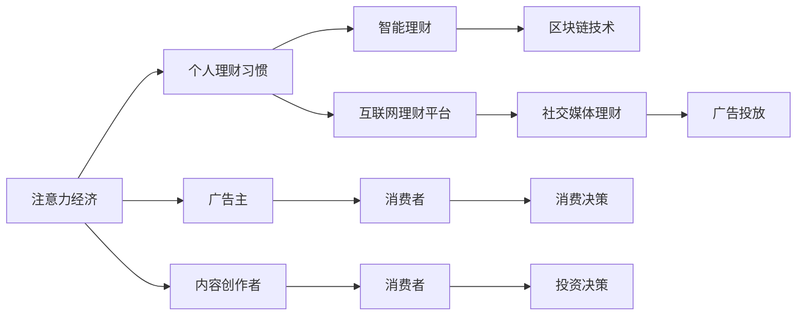

                 

# 注意力经济与个人理财习惯的变化

在数字化时代，注意力经济成为新的经济形态，个人理财习惯也随之发生深刻变化。本博客旨在探讨注意力经济对个人理财习惯的影响，以及如何利用技术手段优化个人理财决策。

## 1. 背景介绍

### 1.1 注意力经济的兴起

注意力经济，是指通过获取、控制和分配消费者的注意力，来创造经济价值的新型经济形态。在互联网时代，信息的爆炸性增长导致消费者注意力变得稀缺，广告主和内容创作者需要通过各种手段吸引用户的注意，从而实现商业变现。

注意力经济的出现，促使传统的商业模式向内容驱动和用户体验为中心的方向转变。个人理财习惯也受到这种变化的影响，从简单的存取款转向更加多元化和个性化的理财决策。

### 1.2 个人理财习惯的变化

在注意力经济的影响下，个人理财习惯发生了以下几方面的变化：

- **理财渠道的多样化**：不再局限于传统银行，互联网理财平台、社交媒体、区块链等新兴渠道成为新的理财选择。
- **理财内容的个性化**：根据用户偏好推荐个性化的理财方案，从被动接受转向主动选择。
- **理财决策的数字化**：利用大数据、人工智能等技术手段，优化理财决策过程，提升理财效率。

## 2. 核心概念与联系

### 2.1 核心概念概述

为了更好地理解注意力经济对个人理财习惯的影响，我们将涉及以下几个核心概念：

- **注意力经济**：通过吸引和利用消费者的注意力，实现经济价值创造的经济模式。
- **个人理财习惯**：个人在日常生活中的财务管理习惯和行为，包括储蓄、投资、消费等方面。
- **智能理财**：利用人工智能技术，自动化处理理财事务，提供个性化的理财建议。
- **区块链技术**：利用分布式账本和加密技术，提供安全可靠的金融服务。

### 2.2 核心概念原理和架构的 Mermaid 流程图



这张图展示了注意力经济与个人理财习惯的联系。广告主和内容创作者通过广告投放、社交媒体等渠道吸引消费者的注意力，进而影响消费者的消费和投资决策。智能理财和区块链技术为这种决策提供了技术支持。

## 3. 核心算法原理 & 具体操作步骤

### 3.1 算法原理概述

在注意力经济的背景下，个人理财习惯的优化主要通过以下算法实现：

- **用户行为分析**：利用机器学习算法，分析用户的历史消费和投资数据，预测用户未来的行为。
- **个性化推荐**：根据用户的兴趣和偏好，推荐个性化的理财产品和投资策略。
- **风险控制**：通过数据分析和机器学习模型，评估投资产品的风险，提出风险控制建议。
- **自动化投资**：利用算法自动化地进行投资组合优化，提升投资效率。

### 3.2 算法步骤详解

#### 3.2.1 用户行为分析

1. **数据收集**：收集用户的消费和投资数据，包括交易记录、历史理财行为、社交媒体互动等。
2. **特征工程**：对收集到的数据进行特征提取，如交易频率、投资期限、产品类别等。
3. **模型训练**：利用机器学习算法（如决策树、随机森林、神经网络等）对数据进行建模，预测用户未来的消费和投资行为。
4. **结果验证**：通过交叉验证等方法，评估模型的准确性和泛化能力。

#### 3.2.2 个性化推荐

1. **用户画像构建**：根据用户的消费和投资数据，构建用户画像，包括兴趣、风险偏好等。
2. **推荐算法设计**：设计推荐算法，如协同过滤、基于内容的推荐、深度学习推荐等，根据用户画像推荐个性化的理财产品和投资策略。
3. **结果展示**：将推荐结果展示给用户，并提供对比分析功能，帮助用户做出决策。

#### 3.2.3 风险控制

1. **风险评估**：利用机器学习模型评估投资产品的风险，包括市场风险、信用风险、流动性风险等。
2. **风险控制建议**：根据风险评估结果，提出相应的风险控制建议，如分散投资、设置止损点等。
3. **动态调整**：根据市场变化，动态调整投资组合，降低风险。

#### 3.2.4 自动化投资

1. **投资组合构建**：根据用户的风险偏好和市场情况，构建投资组合。
2. **自动化交易**：利用算法自动化地进行买卖操作，优化投资回报率。
3. **实时监控**：实时监控投资组合的表现，根据市场变化调整投资策略。

### 3.3 算法优缺点

#### 3.3.1 优点

- **提升效率**：通过自动化和个性化推荐，提升理财决策的效率和准确性。
- **降低风险**：利用风险评估模型，降低投资风险，保护用户资产。
- **优化资源配置**：通过智能算法优化理财资源的配置，提升投资回报率。

#### 3.3.2 缺点

- **数据隐私问题**：收集和分析用户数据可能引发隐私问题，需要采取相应的保护措施。
- **模型误判**：模型可能因数据不完整或偏差等原因出现误判，导致理财决策错误。
- **技术依赖性**：依赖于算法的准确性和稳定性，需要持续优化和维护。

### 3.4 算法应用领域

这些算法不仅在个人理财中得到广泛应用，还适用于以下领域：

- **智能投顾**：提供专业的投资建议，辅助用户进行投资决策。
- **风险管理**：利用大数据和机器学习模型，评估和管理金融风险。
- **区块链理财**：利用区块链技术提供透明、安全的理财服务。
- **消费金融**：分析用户消费行为，提供个性化贷款和信用评分服务。

## 4. 数学模型和公式 & 详细讲解 & 举例说明

### 4.1 数学模型构建

以推荐系统为例，构建推荐模型的数学模型。

设用户集合为 $U$，产品集合为 $I$，用户对产品的评分矩阵为 $R \in \mathbb{R}^{n \times m}$，其中 $n$ 为用户数，$m$ 为产品数。推荐系统通过训练模型，预测用户对产品的评分 $r_{ui}$。

推荐模型的目标是最小化预测误差 $\epsilon_{ui}$：

$$
\min_{\theta} \sum_{u=1}^n \sum_{i=1}^m \epsilon_{ui}^2
$$

其中 $\theta$ 为模型参数，$\epsilon_{ui}$ 为预测误差。

### 4.2 公式推导过程

#### 4.2.1 协同过滤模型

协同过滤模型基于用户的相似度和物品的相似度，推荐用户可能喜欢的物品。假设用户 $u$ 对物品 $i$ 的评分 $r_{ui}$ 可以通过以下公式计算：

$$
r_{ui} = \hat{r}_{ui} + \epsilon_{ui}
$$

其中 $\hat{r}_{ui}$ 为模型的预测评分，$\epsilon_{ui}$ 为误差项。

协同过滤模型有两种形式：用户协同过滤和物品协同过滤。用户协同过滤通过寻找与目标用户 $u$ 相似的 $k$ 个用户 $u_1, u_2, ..., u_k$，对物品 $i$ 的评分进行加权平均：

$$
\hat{r}_{ui} = \frac{\sum_{j=1}^k \alpha_{uj} r_{uj}}{\sum_{j=1}^k \alpha_{uj}}
$$

其中 $\alpha_{uj}$ 为相似度权重。

物品协同过滤通过寻找与物品 $i$ 相似的 $k$ 个物品 $i_1, i_2, ..., i_k$，对用户 $u$ 的评分进行加权平均：

$$
\hat{r}_{ui} = \frac{\sum_{j=1}^k \alpha_{ij} r_{uj}}{\sum_{j=1}^k \alpha_{ij}}
$$

其中 $\alpha_{ij}$ 为相似度权重。

#### 4.2.2 基于内容的推荐模型

基于内容的推荐模型通过分析物品的属性，预测用户对物品的评分。假设物品 $i$ 的属性向量为 $X_i$，用户 $u$ 对物品 $i$ 的评分 $r_{ui}$ 可以通过以下公式计算：

$$
r_{ui} = \hat{r}_{ui} + \epsilon_{ui}
$$

其中 $\hat{r}_{ui} = \sum_{j=1}^d \theta_j X_{ij} U_{uj}$，$d$ 为物品属性的维数，$U$ 为用户属性矩阵。

### 4.3 案例分析与讲解

#### 4.3.1 协同过滤推荐系统

某电商平台使用协同过滤推荐系统，推荐用户可能喜欢的商品。通过分析用户的浏览和购买记录，计算用户之间的相似度，生成用户和商品的相似度矩阵。然后根据相似度矩阵，推荐用户可能喜欢的商品。

#### 4.3.2 基于内容的推荐系统

某视频网站使用基于内容的推荐系统，推荐用户可能喜欢的视频。通过分析视频的内容标签，如导演、演员、类型等，生成视频的属性向量。然后根据用户的历史观看记录，预测用户对新视频的评分，推荐用户可能感兴趣的视频。

## 5. 项目实践：代码实例和详细解释说明

### 5.1 开发环境搭建

在实践前，需要搭建好开发环境。以下是一个Python环境搭建的示例：

1. **安装Python**：下载Python安装包，进行安装。
2. **安装依赖包**：通过pip安装依赖包，如NumPy、Pandas、Scikit-learn、TensorFlow等。
3. **搭建环境**：使用虚拟环境工具（如virtualenv）搭建Python环境。

### 5.2 源代码详细实现

以推荐系统为例，展示推荐系统的代码实现：

```python
import numpy as np
import pandas as pd
from sklearn.decomposition import TruncatedSVD
from sklearn.metrics.pairwise import cosine_similarity
from sklearn.feature_extraction.text import TfidfVectorizer

# 数据准备
data = pd.read_csv('ratings.csv')
users = data['user_id'].unique()
items = data['item_id'].unique()
ratings = data.pivot_table(index='user_id', columns='item_id', values='rating')

# 用户协同过滤推荐系统
def user_based_recommender(data, k=10):
    u, v = data.shape
    users = data.index.unique()
    ratings_mean = np.mean(ratings, axis=1)
    users_similarity = np.zeros((u, u))
    for i in range(u):
        for j in range(i, u):
            ui = ratings.loc[i].values
            uj = ratings.loc[j].values
            if np.count_nonzero(ui) > 0 and np.count_nonzero(uj) > 0:
                ui_mean = np.mean(ui)
                uj_mean = np.mean(uj)
                ui -= ui_mean
                uj -= uj_mean
                ui_similarity = cosine_similarity(ui.reshape(1, -1), uj.reshape(1, -1))[0][0]
                users_similarity[i][j] = ui_similarity
                users_similarity[j][i] = ui_similarity
    users_similarity = pd.DataFrame(users_similarity, index=users, columns=users)
    users_similarity = users_similarity.stack().reset_index().rename(columns={'level_2': 'user', 'level_1': 'neighbor'})
    users_similarity = pd.pivot_table(users_similarity, index='user', columns='neighbor', values='ratio')
    users_similarity /= np.sum(users_similarity, axis=1)[:, np.newaxis]
    recommender = TruncatedSVD(n_components=k)
    recommender.fit(users_similarity)
    return recommender

# 基于内容的推荐系统
def content_based_recommender(data, n_components=5):
    items = data['item_id'].unique()
    tfidf = TfidfVectorizer(stop_words='english', max_features=n_components)
    tfidf_matrix = tfidf.fit_transform(data['description'])
    svd = TruncatedSVD(n_components=n_components)
    svd.fit(tfidf_matrix)
    tfidf_matrix = svd.transform(tfidf_matrix)
    return tfidf_matrix
```

### 5.3 代码解读与分析

以上代码展示了协同过滤和基于内容的推荐系统的实现。协同过滤推荐系统通过计算用户之间的相似度，推荐用户可能喜欢的物品。基于内容的推荐系统通过分析物品的属性，预测用户对物品的评分，推荐用户可能感兴趣的视频。

## 6. 实际应用场景

### 6.1 智能投顾

某金融科技公司开发智能投顾系统，通过分析用户的历史投资数据，提供个性化的投资建议。系统利用机器学习模型，预测用户对不同投资产品的评分，并根据评分结果推荐最优的投资组合。

### 6.2 风险管理

某银行利用机器学习模型评估贷款申请的风险，通过分析借款人的历史信用记录、收入水平、还款能力等数据，预测贷款违约的概率。系统利用风险评估模型，提出风险控制建议，降低银行的贷款风险。

### 6.3 区块链理财

某区块链理财平台利用智能合约和区块链技术，提供透明、安全的理财服务。平台通过智能合约自动化处理用户的理财事务，保护用户的资产安全，并提供个性化的理财建议。

## 7. 工具和资源推荐

### 7.1 学习资源推荐

1. **《推荐系统》**：涵盖推荐系统的基本原理和算法实现。
2. **《Python数据科学手册》**：提供Python编程语言在数据科学中的应用。
3. **《深度学习》**：介绍深度学习的基础理论和算法实现。
4. **Kaggle**：提供大量的数据集和竞赛项目，帮助学习者实践数据科学技能。

### 7.2 开发工具推荐

1. **PyTorch**：一个强大的深度学习框架，支持动态计算图和多种深度学习算法。
2. **TensorFlow**：一个广泛使用的深度学习框架，支持分布式计算和多种深度学习算法。
3. **Jupyter Notebook**：一个交互式编程环境，支持Python等编程语言。
4. **Hadoop**：一个分布式计算框架，支持大规模数据处理。

### 7.3 相关论文推荐

1. **《推荐系统》**：一篇关于推荐系统理论的综述论文。
2. **《深度学习中的注意力机制》**：介绍注意力机制在深度学习中的应用。
3. **《智能投顾：金融科技的未来》**：一篇关于智能投顾技术的展望论文。

## 8. 总结：未来发展趋势与挑战

### 8.1 研究成果总结

本博客探讨了注意力经济对个人理财习惯的影响，通过机器学习算法，分析和优化用户的理财决策。重点介绍了协同过滤和基于内容的推荐系统的实现方法，并展示了实际应用场景。

### 8.2 未来发展趋势

未来，个人理财习惯将进一步受到数字化和智能化的影响。智能理财、区块链理财等技术将更加普及，个人理财决策将更加个性化和智能化。同时，大数据、人工智能等技术将不断演进，进一步提升理财系统的效率和安全性。

### 8.3 面临的挑战

尽管智能理财和区块链理财等技术不断发展，但仍面临以下挑战：

- **数据隐私问题**：收集和分析用户数据可能引发隐私问题。
- **技术复杂性**：智能理财和区块链理财系统需要高水平的技术支持。
- **用户接受度**：智能理财和区块链理财系统需要用户信任和接受。

### 8.4 研究展望

未来的研究可以聚焦于以下方向：

- **隐私保护技术**：研究如何保护用户的隐私，防止数据泄露。
- **系统优化**：优化智能理财和区块链理财系统的性能和稳定性。
- **用户教育**：提升用户对智能理财和区块链理财系统的认知和接受度。

## 9. 附录：常见问题与解答

**Q1：智能理财系统如何保护用户隐私？**

A: 智能理财系统通常会收集用户的个人数据，包括消费记录、投资偏好等。为保护用户隐私，可以采取以下措施：

1. **数据加密**：对用户数据进行加密存储和传输，防止数据泄露。
2. **数据匿名化**：对用户数据进行匿名化处理，保护用户隐私。
3. **权限控制**：对用户数据进行严格的权限控制，只有经过授权的第三方才能访问。

**Q2：区块链理财系统的优势和劣势是什么？**

A: 区块链理财系统具有以下优势：

1. **透明度**：区块链技术提供透明的账本记录，用户可以随时查看交易记录。
2. **安全性**：区块链技术利用分布式账本和加密技术，保障用户资产的安全。
3. **去中心化**：区块链技术实现去中心化管理，降低系统故障和攻击风险。

但区块链理财系统也存在以下劣势：

1. **技术复杂性**：区块链技术复杂，需要较高的技术门槛。
2. **交易成本高**：区块链交易手续费较高，不适合高频交易。
3. **性能瓶颈**：区块链网络交易速度较慢，可能影响理财系统的效率。

**Q3：如何优化推荐系统的算法？**

A: 优化推荐系统的算法可以采取以下措施：

1. **特征工程**：通过特征工程提升模型的准确性，如特征选择、特征缩放等。
2. **算法优化**：优化推荐算法的参数，如协同过滤的相似度计算、基于内容的特征选择等。
3. **模型集成**：通过集成多个推荐模型，提升系统的性能和稳定性。
4. **实时更新**：实时更新推荐模型，适应数据的变化。

总之，通过不断优化算法和数据处理，智能理财和区块链理财系统将不断提升用户体验，实现个人理财的智能化和个性化。

