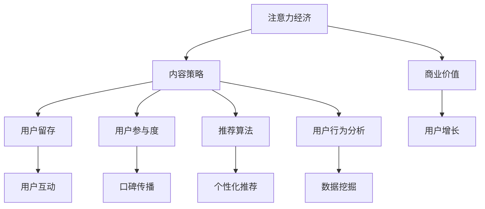

                 

# 注意力经济与内容策略规划与实施：吸引并留住受众

> 关键词：注意力经济,内容策略,用户留存,用户参与度,推荐算法,用户行为分析

## 1. 背景介绍

### 1.1 问题由来
在互联网时代，信息过载和注意力稀缺成为常态。用户从海量的内容中筛选有效信息，其成本与效率问题日益凸显。于是，注意力经济应运而生，即在有限的注意力资源下，如何通过优质的内容创造和合理的策略规划，最大化地吸引并留住受众，成为现代企业数字化转型的重要课题。

### 1.2 问题核心关键点
在注意力经济的背景下，内容策略规划与实施成为企业竞争力的重要体现。内容策略不仅关注内容的生产与分发，还涵盖用户分析、用户需求预测、推荐系统等多个环节，以实现精准用户画像和高效内容匹配，从而提升用户参与度和满意度。

### 1.3 问题研究意义
通过科学的注意力经济和内容策略，企业可以更好地理解用户行为，优化内容生产和分发策略，实现用户留存与增长。这不仅有助于提升用户体验和品牌价值，还能为企业带来可持续的商业利益。

## 2. 核心概念与联系

### 2.1 核心概念概述

为更好地理解注意力经济与内容策略，本节将介绍几个密切相关的核心概念：

- 注意力经济(Attention Economy)：指在信息爆炸的时代，通过争夺用户的注意力资源，从而实现商业价值的经济模式。

- 内容策略(Content Strategy)：指制定和执行内容生成、分发、管理和优化计划，以实现目标受众的吸引和留存。

- 用户留存(User Retention)：指用户在一定时间内继续使用产品或服务的能力，是衡量产品成功的重要指标。

- 用户参与度(User Engagement)：指用户与产品或内容互动的程度，包括点击、分享、评论等行为，直接影响用户体验和口碑传播。

- 推荐算法(Recommendation Algorithm)：指通过分析用户行为，推荐可能感兴趣的个性化内容，提升用户体验和满意度。

- 用户行为分析(User Behavior Analysis)：指收集、处理和分析用户与产品或内容互动的数据，理解用户需求和行为模式，为内容策略和推荐算法提供数据支持。

这些核心概念之间的逻辑关系可以通过以下Mermaid流程图来展示：



这个流程图展示了一系列概念之间的联系：

1. 注意力经济通过优质内容争夺用户注意力。
2. 内容策略指导内容的生产与分发，以吸引和留存用户。
3. 用户留存和参与度直接关系到用户体验和口碑传播。
4. 推荐算法提升用户对内容的满意度，促进参与度和留存。
5. 用户行为分析为策略规划提供数据支持，推动内容创新和优化。

这些概念共同构成了注意力经济与内容策略的实践框架，为企业实现商业价值提供了指导。

## 3. 核心算法原理 & 具体操作步骤
### 3.1 算法原理概述

注意力经济与内容策略的规划与实施，本质上是一种基于数据驱动的决策过程。其核心思想是通过收集和分析用户数据，构建用户画像，并结合内容推荐和优化技术，实现精准的内容匹配和分发，最终吸引和留住用户。

形式化地，假设有一群用户 $U$，其兴趣特征为 $\{x_i\}_{i=1}^N$。内容策略的目标是最大化用户参与度 $E$ 和用户留存率 $R$，即：

$$
\max \left\{ E, R \right\} = \max_{x_i \in U} \left\{ \sum_{i=1}^N f(x_i) \right\}
$$

其中 $f(x_i)$ 为衡量用户参与度和留存率的函数，可以包括点击率、停留时间、购买行为等。

为了实现上述目标，内容策略的规划可以分为以下几个步骤：

1. 用户画像构建：收集和分析用户行为数据，构建用户兴趣和行为特征。
2. 内容推荐优化：结合推荐算法和内容分析，实现个性化内容推荐。
3. 策略迭代优化：根据用户反馈和行为数据，不断优化推荐策略和内容生成计划。

### 3.2 算法步骤详解

基于上述原理，注意力经济与内容策略的实施过程可以细化为以下几个关键步骤：

**Step 1: 用户画像构建**
- 定义用户画像：收集和分析用户行为数据，定义用户的兴趣标签和行为特征。
- 用户行为数据采集：通过网站、应用、社交媒体等渠道，收集用户的浏览、点击、评论、购买等行为数据。
- 数据清洗与预处理：去除异常值和缺失值，对数据进行归一化和标准化处理。
- 用户画像表示：将用户行为特征转化为向量表示，便于算法处理。

**Step 2: 内容推荐优化**
- 内容特征提取：从文本、图片、视频等形式的内容中提取特征，使用自然语言处理(NLP)、计算机视觉(CV)等技术。
- 相似度计算：计算用户兴趣与内容特征之间的相似度，可以采用余弦相似度、欧式距离等算法。
- 推荐算法选择：根据任务需求选择合适的推荐算法，如协同过滤、基于内容的推荐、混合推荐等。
- 推荐结果排序：结合用户反馈和模型输出，对推荐结果进行排序，优先展示最可能吸引用户的内容。

**Step 3: 策略迭代优化**
- 用户行为监测：实时监控用户行为，收集反馈信息，了解用户满意度。
- 策略调整与优化：根据用户反馈和行为数据，调整推荐策略和内容生成计划，不断优化用户体验。
- 持续学习与更新：结合新数据和新用户画像，持续更新内容策略，提升系统性能。

### 3.3 算法优缺点

基于数据驱动的内容策略具有以下优点：
1. 精准匹配用户需求：通过用户画像和个性化推荐，实现内容与用户需求的精准匹配，提升用户参与度和留存率。
2. 实时调整策略：根据用户行为数据，实时优化内容推荐和策略，提升用户体验。
3. 可扩展性强：算法和技术具有较高的可移植性和可扩展性，可以应用于不同场景和平台。

同时，该方法也存在一些局限性：
1. 数据隐私和安全问题：在数据收集和处理过程中，需要注意用户隐私保护和数据安全。
2. 数据质量和标签问题：用户行为数据的质量和标签的准确性直接影响算法效果。
3. 算法复杂度高：基于深度学习的推荐算法往往模型复杂度高，需要大量计算资源。
4. 依赖人工干预：推荐系统的效果依赖于人工干预和规则设计，需要持续优化和迭代。

尽管存在这些局限性，但就目前而言，基于数据驱动的内容策略仍是实现注意力经济的重要手段。未来相关研究的重点在于如何进一步提升数据质量、降低算法复杂度、增强自动化和智能化水平。

### 3.4 算法应用领域

基于数据驱动的内容策略，在多个领域已经得到了广泛的应用，例如：

- 在线媒体平台：如新闻网站、视频平台、社交媒体等，通过个性化推荐提升用户参与度和留存率。
- 电子商务网站：如电商平台、在线市场等，通过内容推荐和优惠券推荐提升转化率和复购率。
- 在线教育平台：如MOOC、在线课程等，通过个性化课程推荐提升用户学习体验和满意度。
- 旅游和出行应用：如预订网站、地图应用等，通过内容推荐和搜索结果优化提升用户使用体验。
- 智能客服系统：通过分析用户互动数据，实现智能回答和内容推荐，提升用户满意度。

除了上述这些经典应用外，内容策略还被创新性地应用到更多场景中，如智能家居、智能广告、健康医疗等，为不同行业带来了新的增长机遇。

## 4. 数学模型和公式 & 详细讲解  
### 4.1 数学模型构建

基于上述内容策略的原理，我们可以构建一个简单的数学模型来描述这一过程。

设用户 $i$ 对内容 $j$ 的兴趣度为 $r_{ij}$，内容特征向量为 $x_j$，用户画像向量为 $u_i$。则内容推荐的目标可以表示为最大化用户兴趣度 $r_{ij}$，即：

$$
\max_{x_j, u_i} r_{ij} = \max_{x_j, u_i} u_i \cdot x_j
$$

其中 $u_i \cdot x_j$ 为向量点积，表示用户兴趣和内容特征之间的匹配度。

### 4.2 公式推导过程

以下我们推导向量点积和余弦相似度的计算公式：

假设用户画像 $u_i$ 和内容特征 $x_j$ 都表示为 $d$ 维向量，则向量点积可以表示为：

$$
u_i \cdot x_j = \sum_{k=1}^d u_{ik}x_{jk}
$$

其中 $u_{ik}$ 和 $x_{jk}$ 分别为用户和内容在第 $k$ 维特征的权重值。

余弦相似度是一种常用的衡量两个向量相似度的方法，其定义为：

$$
\text{similarity}(u_i, x_j) = \frac{u_i \cdot x_j}{\sqrt{\|u_i\|} \cdot \sqrt{\|x_j\|}}
$$

其中 $\|u_i\|$ 和 $\|x_j\|$ 分别为用户画像和内容特征向量的范数。

在实际应用中，为了计算效率和泛化能力，我们通常使用基于深度学习的推荐模型，如矩阵分解、神经网络等，来计算相似度并生成推荐结果。

### 4.3 案例分析与讲解

以下我们以在线媒体平台为例，展示如何基于数据驱动的内容策略实现个性化推荐。

假设一个新闻网站的用户画像 $u_i$ 和内容特征 $x_j$ 都表示为 $d$ 维向量。该网站有 $N=1000$ 个用户，每个用户每天访问 $M=1000$ 篇文章。为了实现个性化推荐，网站可以采用以下步骤：

1. 数据收集：收集用户点击、阅读、停留时间等行为数据，构建用户画像向量 $u_i$。
2. 特征提取：从文章标题、摘要、正文等文本数据中提取关键词和主题，构建内容特征向量 $x_j$。
3. 相似度计算：使用余弦相似度计算用户 $i$ 对内容 $j$ 的兴趣度 $r_{ij} = u_i \cdot x_j$。
4. 推荐排序：根据兴趣度 $r_{ij}$ 对文章进行排序，优先展示用户最可能感兴趣的文章。

通过上述步骤，网站可以实现基于用户行为和内容特征的个性化推荐，提升用户参与度和留存率。需要注意的是，为了保证推荐的准确性和用户满意度，网站还需要根据反馈数据不断优化推荐算法和内容策略。

## 5. 项目实践：代码实例和详细解释说明
### 5.1 开发环境搭建

在进行内容策略和推荐系统的实践前，我们需要准备好开发环境。以下是使用Python进行PyTorch开发的环境配置流程：

1. 安装Anaconda：从官网下载并安装Anaconda，用于创建独立的Python环境。

2. 创建并激活虚拟环境：
```bash
conda create -n recommendation-env python=3.8 
conda activate recommendation-env
```

3. 安装PyTorch：根据CUDA版本，从官网获取对应的安装命令。例如：
```bash
conda install pytorch torchvision torchaudio cudatoolkit=11.1 -c pytorch -c conda-forge
```

4. 安装TensorBoard：用于可视化推荐系统训练过程中的指标。
```bash
pip install tensorboard
```

5. 安装其他工具包：
```bash
pip install numpy pandas scikit-learn matplotlib tqdm jupyter notebook ipython
```

完成上述步骤后，即可在`recommendation-env`环境中开始内容策略和推荐系统的实践。

### 5.2 源代码详细实现

下面我们以在线新闻平台的个性化推荐为例，给出使用PyTorch实现内容推荐系统的代码实现。

首先，定义推荐模型的输入和输出：

```python
import torch
import torch.nn as nn
import torch.nn.functional as F

class RecommendationModel(nn.Module):
    def __init__(self, num_users, num_items, embedding_dim=32):
        super(RecommendationModel, self).__init__()
        self.num_users = num_users
        self.num_items = num_items
        
        self.user_embeddings = nn.Embedding(num_users, embedding_dim)
        self.item_embeddings = nn.Embedding(num_items, embedding_dim)
        self.fc1 = nn.Linear(embedding_dim * 2, 64)
        self.fc2 = nn.Linear(64, 1)
        
    def forward(self, user_ids, item_ids):
        user_embeddings = self.user_embeddings(user_ids)
        item_embeddings = self.item_embeddings(item_ids)
        features = torch.cat([user_embeddings, item_embeddings], dim=1)
        features = self.fc1(features)
        scores = self.fc2(features)
        return scores
```

然后，定义推荐模型的训练函数：

```python
def train_recommendation_model(model, data_loader, optimizer, num_epochs):
    model.train()
    for epoch in range(num_epochs):
        for user_ids, item_ids, labels in data_loader:
            optimizer.zero_grad()
            scores = model(user_ids, item_ids)
            loss = F.binary_cross_entropy(scores.view(-1), labels.view(-1))
            loss.backward()
            optimizer.step()
        print(f"Epoch {epoch+1}, loss: {loss.item()}")
```

最后，启动训练流程：

```python
import torch
import torch.optim as optim
from torch.utils.data import DataLoader
import numpy as np

num_users = 1000
num_items = 1000

# 构造训练数据集
user_ids = np.random.randint(0, num_users, size=1000)
item_ids = np.random.randint(0, num_items, size=1000)
labels = np.random.randint(0, 2, size=1000)  # 0: 不点击，1: 点击

# 定义数据集
class RecommendationDataset(torch.utils.data.Dataset):
    def __init__(self, user_ids, item_ids, labels):
        self.user_ids = user_ids
        self.item_ids = item_ids
        self.labels = labels
        
    def __len__(self):
        return len(self.labels)
    
    def __getitem__(self, item):
        return self.user_ids[item], self.item_ids[item], self.labels[item]

# 加载数据集
dataset = RecommendationDataset(user_ids, item_ids, labels)
data_loader = DataLoader(dataset, batch_size=32, shuffle=True)

# 定义模型和优化器
model = RecommendationModel(num_users, num_items)
optimizer = optim.Adam(model.parameters(), lr=0.01)

# 训练模型
train_recommendation_model(model, data_loader, optimizer, num_epochs=10)
```

以上就是使用PyTorch对推荐系统进行训练的完整代码实现。可以看到，利用TensorFlow等深度学习框架，可以高效地实现推荐模型的训练和推理，快速迭代优化模型性能。

### 5.3 代码解读与分析

让我们再详细解读一下关键代码的实现细节：

**RecommendationModel类**：
- `__init__`方法：定义模型参数，包括用户嵌入、物品嵌入、全连接层等。
- `forward`方法：定义模型前向传播过程，首先计算用户和物品的向量表示，然后将它们拼接并经过全连接层输出预测结果。

**train_recommendation_model函数**：
- 在每个epoch中，循环遍历数据集，计算模型预测结果与真实标签的差值，使用二元交叉熵损失函数计算损失。
- 反向传播更新模型参数，并输出每个epoch的平均损失。

**训练流程**：
- 构造训练数据集，定义模型和优化器。
- 将训练数据集分成批次，进行模型的训练和优化。
- 输出训练结果，评估模型性能。

可以看到，PyTorch框架提供了简洁高效的工具，使得深度学习模型的训练和优化变得简单直观。开发者可以将更多精力放在模型设计和参数调整上，而不必过多关注底层实现细节。

当然，工业级的系统实现还需考虑更多因素，如模型的保存和部署、超参数的自动搜索、更灵活的推荐算法等。但核心的推荐范式基本与此类似。

## 6. 实际应用场景
### 6.1 智能媒体平台

基于数据驱动的内容策略，智能媒体平台可以实现高度个性化的内容推荐，提升用户参与度和留存率。例如，视频平台可以根据用户的观看历史和行为数据，推荐用户可能感兴趣的视频内容，提升用户黏性和满意度。

### 6.2 电商和零售企业

电商和零售企业通过内容策略和推荐系统，可以实现精准的用户营销和个性化推荐，提升转化率和复购率。例如，电商平台可以根据用户的浏览和购买行为，推荐相关的商品和优惠券，提升用户体验和销售额。

### 6.3 在线教育平台

在线教育平台通过内容推荐，可以实现个性化课程推荐，提升用户学习效果和满意度。例如，MOOC平台可以根据用户的浏览和互动数据，推荐最适合用户的学习路径和课程，提升学习效率和质量。

### 6.4 旅游和出行应用

旅游和出行应用通过内容推荐，可以实现目的地和活动的个性化推荐，提升用户体验和满意度。例如，地图应用可以根据用户的出行偏好和行为数据，推荐最适合的路线和景点，提升用户出行体验。

### 6.5 智能客服系统

智能客服系统通过内容推荐，可以实现智能回答和内容生成，提升用户满意度和使用体验。例如，客服系统可以根据用户的查询历史和偏好，推荐最合适的回答模板和解决方案，提升客户服务效率和质量。

### 6.6 社交媒体平台

社交媒体平台通过内容推荐，可以实现精准的广告投放和个性化内容推送，提升用户参与度和平台活跃度。例如，社交平台可以根据用户的兴趣和行为数据，推荐最相关的广告和内容，提升用户粘性和互动率。

## 7. 工具和资源推荐
### 7.1 学习资源推荐

为了帮助开发者系统掌握内容策略和推荐系统的理论基础和实践技巧，这里推荐一些优质的学习资源：

1. 《推荐系统实战》书籍：介绍推荐系统的经典算法和实践经验，适合初学者和进阶者。

2. 《深度学习与推荐系统》课程：斯坦福大学开设的推荐系统课程，涵盖深度学习在推荐系统中的应用。

3. 《自然语言处理与推荐系统》博客：深度学习领域的专家博客，系统讲解自然语言处理和推荐系统技术。

4. 《内容策略与营销》书籍：介绍内容策略和营销的理论与实践，适合营销人员和产品经理。

5. 《用户体验设计》课程：提升用户体验设计的知识和技能，适合设计师和产品开发者。

通过对这些资源的学习实践，相信你一定能够快速掌握内容策略和推荐系统的精髓，并用于解决实际的NLP问题。

### 7.2 开发工具推荐

高效的开发离不开优秀的工具支持。以下是几款用于内容策略和推荐系统开发的常用工具：

1. PyTorch：基于Python的开源深度学习框架，灵活动态的计算图，适合快速迭代研究。大部分推荐系统都有PyTorch版本的实现。

2. TensorFlow：由Google主导开发的开源深度学习框架，生产部署方便，适合大规模工程应用。同样有丰富的推荐系统资源。

3. Weights & Biases：模型训练的实验跟踪工具，可以记录和可视化模型训练过程中的各项指标，方便对比和调优。

4. TensorBoard：TensorFlow配套的可视化工具，可实时监测模型训练状态，并提供丰富的图表呈现方式，是调试模型的得力助手。

5. Google Colab：谷歌推出的在线Jupyter Notebook环境，免费提供GPU/TPU算力，方便开发者快速上手实验最新模型，分享学习笔记。

合理利用这些工具，可以显著提升内容策略和推荐系统的开发效率，加快创新迭代的步伐。

### 7.3 相关论文推荐

内容策略和推荐系统的研究源于学界的持续研究。以下是几篇奠基性的相关论文，推荐阅读：

1. The Bell Labs PageRank Algorithm：介绍PageRank算法，奠定了搜索排名和推荐系统的基础。

2. Recommendation Algorithms for the Web：介绍协同过滤、基于内容的推荐等经典算法，适合入门和进阶学习。

3. A Neural Collaborative Filtering Approach：提出基于神经网络的协同过滤算法，提升了推荐系统的精度。

4. Knowledge-Aware Collaborative Filtering：引入知识图谱和规则库，提升推荐系统的鲁棒性和多样性。

5. Attention is All You Need：提出Transformer结构，开启了深度学习在推荐系统中的应用。

6. TensorFlow Recommenders：介绍TensorFlow推荐库，包含多种推荐算法和优化工具，适合工业应用。

这些论文代表了大数据推荐系统的研究脉络。通过学习这些前沿成果，可以帮助研究者把握学科前进方向，激发更多的创新灵感。

## 8. 总结：未来发展趋势与挑战

### 8.1 总结

本文对基于数据驱动的内容策略和推荐系统进行了全面系统的介绍。首先阐述了注意力经济和内容策略的背景和意义，明确了推荐系统在提升用户参与度和留存率方面的独特价值。其次，从原理到实践，详细讲解了推荐系统的数学模型和关键步骤，给出了推荐系统任务开发的完整代码实例。同时，本文还广泛探讨了推荐系统在智能媒体、电商、教育、旅游等多个领域的应用前景，展示了推荐系统的巨大潜力。此外，本文精选了推荐系统的各类学习资源，力求为读者提供全方位的技术指引。

通过本文的系统梳理，可以看到，基于数据驱动的内容策略和推荐系统，在多场景下得到了广泛的应用，为NLP技术带来了新的突破。未来，伴随深度学习技术的不断发展，推荐系统将在更多领域得到应用，为传统行业带来变革性影响。

### 8.2 未来发展趋势

展望未来，内容策略和推荐系统的发展呈现以下几个趋势：

1. 深度学习算法持续演进。基于深度学习技术的推荐系统不断进步，新的算法和模型架构如Transformer、BERT等，提升了推荐的精度和泛化能力。

2. 用户行为分析更加深入。利用用户行为数据，结合因果推断、时序预测等技术，实现更加精准的内容推荐。

3. 个性化推荐多样化。除了传统的协同过滤、内容推荐，还将涌现更多如基于知识图谱、兴趣网络等的推荐方法。

4. 实时推荐系统崛起。利用流式计算和在线学习技术，实时生成个性化推荐，提升用户体验和满意度。

5. 推荐系统服务化。推荐系统将更加模块化和组件化，方便企业快速部署和使用，形成可扩展的推荐生态。

6. 多模态推荐融合。结合文本、图像、语音等模态信息，实现更为全面的内容推荐和用户画像。

以上趋势凸显了内容策略和推荐系统的发展前景。这些方向的探索发展，必将进一步提升推荐系统的性能和应用范围，为互联网和智能时代带来新的机遇。

### 8.3 面临的挑战

尽管内容策略和推荐系统已经取得了显著的进展，但在迈向更加智能化、普适化应用的过程中，仍面临诸多挑战：

1. 数据隐私和安全问题。在数据收集和处理过程中，如何保护用户隐私和数据安全，防止数据泄露和滥用。

2. 数据质量和标签问题。推荐系统的效果依赖于高质量的数据和准确的标签，如何提高数据质量，确保标签的准确性，是一个重要挑战。

3. 算法复杂度高。基于深度学习的推荐系统往往模型复杂度高，需要大量计算资源，如何降低算法复杂度，提升系统性能，是一个关键问题。

4. 实时推荐系统的高可用性。实时推荐系统需要在高并发环境下保证服务稳定性和用户体验，如何优化系统架构，提升高可用性，是一个重要研究方向。

5. 推荐系统的公平性和透明性。推荐系统容易产生偏见和歧视，如何确保推荐过程的公平性和透明性，防止偏见和歧视，是一个重要的伦理问题。

6. 推荐系统的实时调整和优化。推荐系统需要根据用户行为数据实时调整策略和优化模型，如何高效处理和分析实时数据，提升策略调整的速度和效果，是一个重要挑战。

7. 推荐系统的多样性和覆盖率。如何平衡推荐多样性和覆盖率，防止过度个性化导致的用户信息茧房问题，是一个需要深入研究的课题。

这些挑战亟需解决，才能真正实现内容策略和推荐系统的广泛应用。相信随着技术的不断进步和研究的深入，这些挑战将逐步被克服，内容策略和推荐系统必将在构建智能推荐生态中扮演越来越重要的角色。

### 8.4 研究展望

面对内容策略和推荐系统面临的挑战，未来的研究需要在以下几个方面寻求新的突破：

1. 探索更加高效的数据处理方法。利用流式计算和分布式计算技术，提升数据处理的效率和性能。

2. 引入更多先验知识和规则。结合领域知识、规则库等专家知识，提升推荐系统的鲁棒性和泛化能力。

3. 引入因果推断和强化学习。利用因果推断和强化学习技术，提高推荐系统的透明性和公平性，实现更加智能化的推荐过程。

4. 引入多模态融合技术。结合文本、图像、语音等模态信息，实现更为全面的内容推荐和用户画像。

5. 引入在线学习技术。利用在线学习技术，实时更新推荐模型，提升推荐系统的动态适应能力。

6. 引入元学习和迁移学习。利用元学习和迁移学习技术，提升推荐系统的泛化能力和跨领域适应能力。

7. 引入计算图优化技术。利用计算图优化技术，降低深度学习模型的复杂度，提升系统的效率和可扩展性。

8. 引入联邦学习技术。利用联邦学习技术，在不共享数据的前提下，实现跨平台和跨机构的协同推荐。

这些研究方向的探索，必将引领内容策略和推荐系统迈向更高的台阶，为智能推荐生态带来新的突破。面向未来，内容策略和推荐系统还需要与其他人工智能技术进行更深入的融合，如知识表示、因果推理、强化学习等，多路径协同发力，共同推动自然语言理解和智能交互系统的进步。只有勇于创新、敢于突破，才能不断拓展推荐系统的边界，让智能技术更好地造福人类社会。

## 9. 附录：常见问题与解答

**Q1：如何评估推荐系统的性能？**

A: 推荐系统的性能评估通常使用以下指标：

1. 准确率(Accuracy)：指推荐系统正确预测的样本数量与总样本数量的比率。

2. 召回率(Recall)：指推荐系统正确预测的正样本数量与实际正样本数量的比率。

3. 精度(Precision)：指推荐系统正确预测的正样本数量与推荐正样本数量的比率。

4. F1-Score：综合考虑准确率和召回率的综合指标。

5. AUC：曲线下面积，衡量模型在不同阈值下的分类效果。

6. HR(Hit Rate)：指推荐系统正确预测的正样本数量与所有样本数量的比率。

7. NDCG(Normalized Discounted Cumulative Gain)：衡量推荐系统排序效果的好坏。

这些指标可以根据具体应用场景选择，进行推荐系统的性能评估。

**Q2：如何选择适合的推荐算法？**

A: 选择合适的推荐算法需要考虑以下几个方面：

1. 数据特征：根据数据特征选择合适的算法，如基于内容的推荐适合有较多文本特征的数据，基于协同过滤适合用户-物品矩阵等。

2. 推荐目标：根据推荐目标选择合适的算法，如基于多样性的推荐算法适合发现用户未知的兴趣点，基于行为预测的推荐算法适合预测用户未来行为。

3. 用户特征：根据用户特征选择合适的算法，如基于图结构的数据适合使用基于图结构的推荐算法。

4. 系统性能：根据系统性能要求选择合适的算法，如需要实时推荐时，可以选择基于在线学习的推荐算法。

5. 数据量：根据数据量选择合适的算法，如数据量较大时，可以选择基于深度学习的推荐算法。

6. 应用场景：根据应用场景选择合适的算法，如需要低延迟推荐时，可以选择基于图结构的推荐算法。

综合考虑以上因素，选择适合的推荐算法，可以提升推荐系统的性能和用户体验。

**Q3：推荐系统的常见问题有哪些？**

A: 推荐系统常见问题包括以下几点：

1. 冷启动问题：新用户或新物品缺乏足够的数据，难以推荐。

2. 数据稀疏性问题：用户-物品矩阵或物品-物品矩阵存在大量缺失值，难以推荐。

3. 数据偏差问题：推荐系统容易产生偏见和歧视，难以保证推荐公平性。

4. 多样性和覆盖率问题：过度个性化导致的用户信息茧房问题，难以平衡多样性和覆盖率。

5. 实时推荐系统的高可用性问题：在并发环境下保证推荐系统的高可用性，提升用户体验。

6. 推荐系统的鲁棒性和稳定性问题：如何提高推荐系统的鲁棒性和稳定性，防止系统崩溃。

7. 推荐系统的解释性和透明性问题：推荐系统难以解释和透明，难以让用户理解和信任。

8. 推荐系统的实时调整和优化问题：如何高效处理和分析实时数据，提升策略调整的速度和效果。

针对这些问题，推荐系统需要在算法设计、数据处理、系统架构等方面进行优化和改进，提升系统的性能和稳定性。

---

作者：禅与计算机程序设计艺术 / Zen and the Art of Computer Programming

