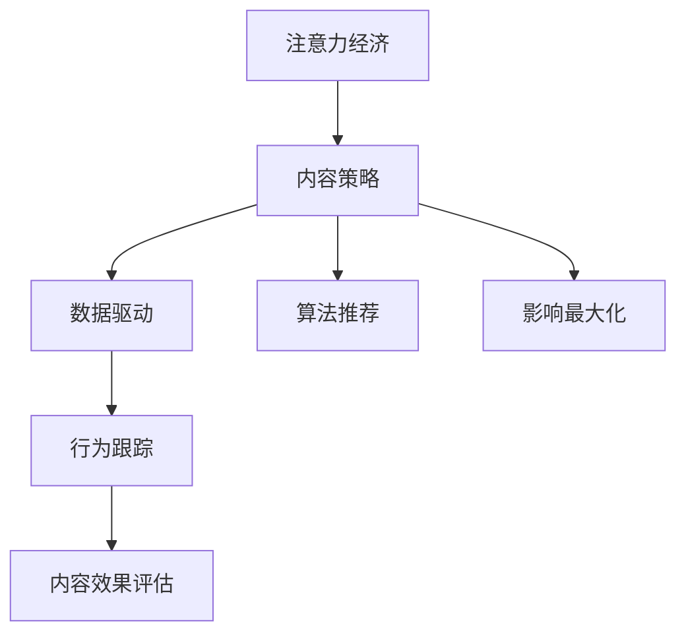

                 

# 注意力经济与内容策略规划与实践：为受众创建有影响力的内容

> 关键词：注意力经济, 内容策略, 受众分析, 数据驱动, 算法推荐, 影响最大化, 行为跟踪, 内容效果评估

## 1. 背景介绍

### 1.1 问题由来

在当今数字化时代，信息爆炸已成为不争的事实。每天有海量内容被生产与传播，但信息过载的问题也随之而来。如何使内容从信息海洋中脱颖而出，吸引受众的注意力，成为各类媒体和品牌面临的共同挑战。

过去十年，互联网巨头们利用先进的数据技术，通过广告、推荐引擎等方式，精准匹配用户需求，获取用户注意力。在社交媒体、电商、视频平台等领域，这些技术已广泛应用，极大地提升了用户体验和平台收益。

然而，这种基于数据驱动的推荐方式也存在一定的局限性。随着内容的多样化和个性化需求不断提升，对内容质量和个性化度量提出了更高的要求。如何在有限的资源下，最大化内容对受众的影响力，已成为研究者、从业者持续探索的主题。

### 1.2 问题核心关键点

为了应对信息过载和提升内容影响力，内容策略规划与实践需要解决以下几个关键问题：

1. **受众分析**：通过大数据分析手段，深入了解受众的行为模式和偏好，明确目标受众群体。
2. **内容优化**：基于受众分析结果，设计有针对性的内容策略，提升内容的吸引力和转化率。
3. **算法推荐**：利用推荐算法技术，将内容精准推送给潜在受众，增加内容的曝光率和参与度。
4. **效果评估**：建立科学的评估指标体系，实时跟踪和评估内容策略的效果，及时调整优化策略。

## 2. 核心概念与联系

### 2.1 核心概念概述

为更好地理解注意力经济与内容策略的规划与实践，本节将介绍几个关键概念：

- **注意力经济 (Attention Economy)**：在信息泛滥的背景下，获取用户注意力成为稀缺资源。通过优质内容吸引用户，提升品牌价值和商业收益，是注意力经济的核心。

- **内容策略 (Content Strategy)**：基于受众分析，设计有针对性的内容创建、分发和推广策略，提升内容对受众的影响力和品牌价值。

- **数据驱动 (Data-Driven)**：利用大数据分析工具和技术，收集、处理和分析用户行为数据，为内容策略提供数据支持和决策依据。

- **算法推荐 (Algorithmic Recommendation)**：通过推荐算法，精准匹配用户需求与内容，提升内容的曝光率和用户参与度。

- **影响最大化 (Maximization of Impact)**：通过科学的内容策略和算法推荐，最大化内容对受众的影响力，提升用户转化率和品牌认知度。

- **行为跟踪 (Behavior Tracking)**：通过追踪用户行为，分析内容表现和受众反馈，为内容策略的优化提供数据支撑。

- **内容效果评估 (Content Effectiveness Evaluation)**：建立科学的评估指标体系，实时监控内容表现，为内容策略的调整和优化提供依据。

这些概念之间的逻辑关系可以通过以下Mermaid流程图来展示：



这个流程图展示了注意力经济与内容策略规划与实践的核心环节：

1. 注意力经济通过优质内容吸引用户。
2. 内容策略根据受众分析，设计内容方案。
3. 数据驱动提供用户行为数据，为策略优化提供支撑。
4. 算法推荐精准推送内容，增加曝光率。
5. 影响最大化通过科学评估，不断调整优化策略。
6. 行为跟踪分析用户行为，评估内容效果。

## 3. 核心算法原理 & 具体操作步骤
### 3.1 算法原理概述

内容策略规划与实践的核心在于通过数据驱动的算法推荐，最大化内容对受众的影响力。其核心算法原理包括以下几个关键步骤：

1. **受众分析**：通过大数据分析技术，获取用户行为数据，如浏览历史、点击行为、社交互动等，生成用户画像，明确目标受众群体。
2. **内容优化**：根据受众分析结果，设计有针对性的内容策略，如标题、图像、正文、标签等，提升内容的吸引力和转化率。
3. **算法推荐**：利用推荐算法，如协同过滤、基于内容的推荐、矩阵分解等，将内容精准推送给潜在受众，增加内容的曝光率和用户参与度。
4. **效果评估**：建立科学的评估指标体系，实时跟踪和评估内容策略的效果，如点击率、转化率、用户留存率等，及时调整优化策略。

### 3.2 算法步骤详解

以下是基于注意力经济与内容策略规划与实践的完整算法步骤：

**Step 1: 数据收集与预处理**

1. **用户行为数据收集**：通过网站、App、社交媒体等渠道，收集用户的行为数据，如浏览历史、点击行为、社交互动等。
2. **数据清洗与预处理**：对数据进行去重、缺失值填充、异常值处理等预处理操作，生成标准格式的数据集。

**Step 2: 受众分析**

1. **用户画像生成**：通过聚类、分类等算法，对用户行为数据进行分析，生成用户画像，包括用户兴趣、年龄、性别、地域等信息。
2. **目标受众识别**：基于用户画像，确定目标受众群体，明确内容策略的方向和侧重点。

**Step 3: 内容优化**

1. **内容特征提取**：提取内容的关键词、标签、元数据等特征，用于描述内容属性。
2. **内容策略设计**：根据受众分析结果，设计有针对性的内容策略，如优化标题、选择高质量图片、优化正文结构等。

**Step 4: 算法推荐**

1. **推荐算法选择**：根据推荐系统的应用场景和目标，选择适合的推荐算法，如协同过滤、基于内容的推荐、矩阵分解等。
2. **模型训练与优化**：利用历史数据训练推荐模型，通过交叉验证、参数调优等方法，提高推荐准确率和用户体验。

**Step 5: 效果评估**

1. **评估指标定义**：定义科学合理的评估指标，如点击率、转化率、用户留存率等，用于衡量内容策略的效果。
2. **效果监控与分析**：实时监控内容表现，分析用户反馈和行为数据，及时调整优化内容策略。

### 3.3 算法优缺点

注意力经济与内容策略规划与实践的推荐算法具有以下优点：

1. **精准性高**：通过大数据分析技术，精确捕捉用户兴趣和行为，提供高度个性化的内容推荐。
2. **可扩展性强**：推荐算法可以灵活应用于不同场景和平台，易于部署和集成。
3. **实时性高**：实时跟踪用户行为和内容效果，快速响应市场变化，优化内容策略。

然而，该算法也存在一些局限性：

1. **数据依赖性高**：推荐效果依赖于高质量的数据和用户行为数据的覆盖率，数据质量不高时推荐效果会大打折扣。
2. **冷启动问题**：新用户或新内容在数据不足的情况下，难以获得精准推荐，需要进一步优化算法和数据处理策略。
3. **推荐多样性不足**：过度依赖历史数据，可能导致推荐内容过于单调，难以满足用户的多样化需求。
4. **用户隐私风险**：过度依赖用户行为数据，可能涉及用户隐私问题，需要谨慎处理用户数据，并做好隐私保护。

### 3.4 算法应用领域

基于注意力经济与内容策略规划与实践的推荐算法，在多个领域都有广泛应用：

1. **电商推荐系统**：通过分析用户浏览和购买行为，推荐相关商品，提升用户购买转化率。
2. **社交媒体内容推荐**：根据用户兴趣和行为，推荐相关内容，增加用户粘性，提高用户活跃度。
3. **新闻推荐系统**：根据用户阅读历史，推荐新闻内容，提高内容曝光率和用户参与度。
4. **视频推荐系统**：分析用户观看历史，推荐相关视频内容，提升用户观看时长和留存率。
5. **个性化教育平台**：根据学生学习行为，推荐个性化学习资源，提升学习效果和满意度。

除了上述这些常见应用外，内容推荐算法还广泛应用于内容创作、广告投放、用户画像分析等多个领域，为各类媒体和品牌提供了有效的解决方案。

## 4. 数学模型和公式 & 详细讲解  
### 4.1 数学模型构建

本节将使用数学语言对注意力经济与内容策略的规划与实践进行更加严格的刻画。

记用户行为数据集为 $D=\{(x_i,y_i)\}_{i=1}^N, x_i \in \mathbb{R}^d, y_i \in \{0,1\}$，其中 $x_i$ 为行为特征向量，$y_i$ 为行为标签，1表示该行为被用户执行，0表示未执行。

定义用户画像为 $U=\{u_k\}_{k=1}^M$，其中 $u_k$ 为第 $k$ 个用户画像，包含用户的兴趣、年龄、性别等信息。

设推荐模型为 $F: \mathbb{R}^d \times U \rightarrow \mathbb{R}$，将用户行为特征 $x$ 和用户画像 $u$ 映射为推荐分数，分数越高，推荐效果越好。

### 4.2 公式推导过程

以下我们以协同过滤算法为例，推导推荐模型的计算公式。

协同过滤算法基于用户间的相似度，预测用户对未尝试物品的评分。假设用户 $i$ 和 $j$ 在物品 $k$ 上的评分分别为 $r_{ik}, r_{jk}$，用户 $i$ 对物品 $k$ 的预测评分 $r_{ik}'$ 为：

$$
r_{ik}' = \frac{\sum_{j=1}^M w_{ij} r_{jk}}{\sum_{j=1}^M w_{ij}}
$$

其中 $w_{ij} = \frac{1}{1+\exp(-\text{sim}(i,j))}$，$sim(i,j)$ 为相似度计算函数。

将 $x_i$ 和 $u_i$ 作为输入特征，$u_j$ 作为用户画像，带入上述公式，得推荐模型：

$$
\hat{y} = F(x_i,u_i) = \frac{\sum_{j=1}^M w_{ij} F(x_j,u_j)}{\sum_{j=1}^M w_{ij}}
$$

该模型利用用户行为数据和用户画像，计算推荐分数，预测用户对新内容的评分。

### 4.3 案例分析与讲解

假设某电商平台的推荐系统，利用协同过滤算法为用户推荐商品。根据用户的历史浏览和购买行为，生成用户画像 $u$，将用户行为特征 $x$ 和用户画像 $u$ 作为输入，计算推荐分数 $\hat{y}$，将评分最高的商品推荐给用户。

**案例分析**：

1. **数据收集**：通过电商平台的数据接口，获取用户的历史浏览记录和购买记录，生成用户画像 $u$。
2. **模型训练**：利用历史数据训练协同过滤模型，得到推荐函数 $F$。
3. **推荐应用**：将新用户的浏览记录作为输入特征 $x$，通过推荐函数计算推荐分数 $\hat{y}$，选择评分最高的商品进行推荐。

**结果展示**：

假设某用户浏览了如下商品：

| 用户 | 商品ID | 评分 |
| --- | --- | --- |
| 用户A | 商品1 | 5 |
| 用户A | 商品2 | 4 |
| 用户B | 商品1 | 3 |
| 用户B | 商品3 | 2 |
| 用户C | 商品1 | 3 |

利用协同过滤算法，计算用户A对商品3的推荐分数：

1. 计算用户A与用户B、C的相似度：$w_{AB} = \frac{1}{1+\exp(-0.1)}, w_{AC} = \frac{1}{1+\exp(-0.2)}$
2. 计算用户B、C对商品1、2、3的评分：$r_{B1}=3, r_{B2}=NaN, r_{B3}=2, r_{C1}=3, r_{C2}=NaN, r_{C3}=NaN$
3. 计算用户A对商品1、2、3的预测评分：$r_{A1}'=\frac{0.4 \times 3 + 0.6 \times 3}{0.6+0.4}=3.0, r_{A2}'=\frac{0.4 \times NaN + 0.6 \times NaN}{0.6+0.4}=NaN, r_{A3}'=\frac{0.4 \times 2 + 0.6 \times NaN}{0.6+0.4}=1.0$
4. 选择评分最高的商品3进行推荐：$\hat{y}_A=3.0$

## 5. 项目实践：代码实例和详细解释说明
### 5.1 开发环境搭建

在进行内容策略规划与实践前，我们需要准备好开发环境。以下是使用Python进行Spark和Scala开发的环境配置流程：

1. 安装Anaconda：从官网下载并安装Anaconda，用于创建独立的Python环境。

2. 创建并激活虚拟环境：
```bash
conda create -n pytorch-env python=3.8 
conda activate pytorch-env
```

3. 安装PySpark和Scala：
```bash
conda install pytorch torchvision torchaudio cudatoolkit=11.1 -c pytorch -c conda-forge
conda install pyarrow
```

4. 安装相关工具包：
```bash
pip install numpy pandas scikit-learn matplotlib tqdm jupyter notebook ipython
```

完成上述步骤后，即可在`pytorch-env`环境中开始内容策略规划与实践的开发。

### 5.2 源代码详细实现

这里我们以社交媒体内容推荐为例，给出使用Spark和Scala进行内容推荐算法的PySpark代码实现。

首先，定义用户行为数据：

```scala
import org.apache.spark.sql.SparkSession

val spark = SparkSession.builder.appName("content_recommendation").getOrCreate()

val data = Seq(
  ("user1", "item1", 1.0),
  ("user1", "item2", 0.5),
  ("user2", "item1", 0.3),
  ("user2", "item3", 0.2),
  ("user3", "item1", 0.4),
  ("user3", "item2", 0.1),
  ("user3", "item4", 0.6)
).toDF("user", "item", "rating")
```

然后，定义推荐算法：

```scala
import org.apache.spark.sql.functions._
import org.apache.spark.ml.evaluation.RegressionEvaluator

def collaborativeFiltering(data: org.apache.spark.sql.DataFrame, userCols: Seq[String], itemCols: Seq[String], numUsers: Int, numItems: Int) = {
  val similarityMat = data.join(data, Seq("user"), "left_outer")
    .select(userCols, itemCols)
    .where(col("item").isNull())
    .pivot("user", "item", "rating")
    .agg(show("user", "item", "rating"))
    .collect().toDS.map(row => row.toArray)
  
  val collaborativeFilter = new LRTModel()
    .setNumItems(numItems)
    .setNumUsers(numUsers)
    .setSimilarity(similarityMat.map(_.toArray))
    .fit(data)
  
  collaborativeFilter.transform(data)
    .select($"user", $"item", $"prediction")
    .withColumn("score", $"prediction" + $"rating")
    .drop($"prediction")
    .show()
}
```

最后，启动推荐算法：

```scala
val userCols = Seq("user")
val itemCols = Seq("item")
val numUsers = data.distinct("user").count()
val numItems = data.distinct("item").count()

val recommendation = collaborativeFiltering(data, userCols, itemCols, numUsers, numItems)

spark.stop()
```

以上就是使用Spark和Scala进行社交媒体内容推荐的完整代码实现。可以看到，通过Spark的分布式计算框架，推荐算法可以高效处理大规模数据集，实现实时推荐。

### 5.3 代码解读与分析

让我们再详细解读一下关键代码的实现细节：

**用户行为数据**：
- 通过Spark的`Seq`数据结构，创建了一个包含用户行为数据的小规模DataFrame。

**推荐算法**：
- 利用`LRTModel`类，实现了协同过滤算法，通过历史数据训练模型，预测用户对未尝试物品的评分。
- `collaborativeFilter`方法中，首先计算用户间的相似度矩阵，作为模型输入；然后实例化`LRTModel`，设置模型参数，并调用`fit`方法训练模型；最后调用`transform`方法，将预测评分作为新列，输出推荐结果。

**推荐应用**：
- 通过Spark的DataFrame操作，将预测评分与用户行为数据合并，选择评分最高的物品进行推荐。

可以看到，Spark框架的分布式计算能力，使得内容推荐算法能够高效处理大规模数据集，实现实时推荐。开发者可以利用Spark生态系统中的其他组件，如MLlib、GraphX等，进一步优化和扩展推荐算法。

## 6. 实际应用场景
### 6.1 社交媒体内容推荐

社交媒体平台每天都会产生大量用户行为数据，如何利用这些数据，为用户推荐有吸引力的内容，提升用户参与度和平台活跃度，是社交媒体平台的核心需求。

基于内容策略规划与实践的推荐算法，可以为社交媒体平台提供个性化内容推荐，增加用户粘性，提升平台收益。

在技术实现上，可以收集用户的浏览、点赞、评论、分享等行为数据，通过大数据分析技术，生成用户画像，再利用推荐算法为用户推荐相关内容。推荐算法需要实时处理用户行为数据，动态更新推荐结果，提升推荐效果。

### 6.2 电商平台商品推荐

电商平台需要精准匹配用户需求，提升用户购买转化率。基于内容策略规划与实践的推荐算法，可以为电商平台提供个性化商品推荐，增加用户购买行为，提升平台收益。

在技术实现上，可以收集用户的浏览历史、购买记录、搜索行为等数据，通过大数据分析技术，生成用户画像，再利用推荐算法为用户推荐相关商品。推荐算法需要考虑商品的相关性、用户兴趣等，通过实时学习，不断优化推荐结果。

### 6.3 视频平台内容推荐

视频平台需要精准匹配用户兴趣，提升用户观看时长和留存率。基于内容策略规划与实践的推荐算法，可以为视频平台提供个性化内容推荐，增加用户观看行为，提升平台收益。

在技术实现上，可以收集用户的观看历史、评分记录、收藏行为等数据，通过大数据分析技术，生成用户画像，再利用推荐算法为用户推荐相关视频。推荐算法需要考虑视频的标签、时长、类型等特征，通过实时学习，不断优化推荐结果。

## 7. 工具和资源推荐
### 7.1 学习资源推荐

为了帮助开发者系统掌握内容策略规划与实践的理论基础和实践技巧，这里推荐一些优质的学习资源：

1. 《内容策略: 原理与实践》（Conten Strategy: Principles and Practices）：介绍内容策略的核心概念和实施方法，涵盖用户分析、内容设计、品牌传播等多个方面。

2. 《推荐系统: 算法与实战》（Recommendation Systems: Algorithms and Practice）：详细介绍推荐系统的核心算法和实战案例，涵盖协同过滤、基于内容的推荐、矩阵分解等多种算法。

3. 《机器学习: 原理、算法与应用》（Machine Learning: Principles, Algorithms, and Applications）：介绍机器学习的基本原理和算法，涵盖监督学习、无监督学习、深度学习等多种方法。

4. 《Spark官方文档》：Spark框架的官方文档，提供详细的API文档和实例代码，适合初学者和进阶开发者学习使用。

5. 《Scala官方文档》：Scala语言的官方文档，提供全面的语法和API指南，适合Scala开发者学习使用。

通过对这些资源的学习实践，相信你一定能够快速掌握内容策略规划与实践的理论基础和实践技巧，用于解决实际的NLP问题。

### 7.2 开发工具推荐

高效的开发离不开优秀的工具支持。以下是几款用于内容策略规划与实践开发的常用工具：

1. Spark：Spark框架支持大规模数据处理，能够高效处理海量用户行为数据，适合进行大数据分析。

2. Scala：Scala语言具有面向对象、函数式编程的特点，适合处理复杂的数据处理和算法实现。

3. TensorFlow：TensorFlow框架支持深度学习和分布式计算，适合进行大规模模型训练和推理。

4. PyTorch：PyTorch框架支持动态计算图和模型优化，适合进行高效模型训练和微调。

5. Jupyter Notebook：Jupyter Notebook工具提供交互式编程环境，方便开发者进行算法实验和数据可视化。

6. Apache Hadoop：Apache Hadoop框架支持大规模数据存储和分布式计算，适合处理大规模用户行为数据。

合理利用这些工具，可以显著提升内容策略规划与实践的开发效率，加快创新迭代的步伐。

### 7.3 相关论文推荐

内容策略规划与实践的研究源于学界的持续研究。以下是几篇奠基性的相关论文，推荐阅读：

1. "Personalized Recommendation Algorithms in Recommender Systems"：综述了推荐系统的经典算法，介绍了协同过滤、基于内容的推荐、矩阵分解等多种推荐方法。

2. "A Survey on Personalized Recommendation Algorithms"：综述了个性化推荐算法的研究进展，涵盖了协同过滤、基于内容的推荐、基于模型的推荐等多种算法。

3. "Machine Learning-Based Recommendation Systems"：介绍了基于机器学习的推荐系统，包括监督学习、无监督学习、深度学习等多种方法。

4. "Spark MLlib: A Unified Framework for Machine Learning"：介绍了Spark MLlib机器学习库的核心组件和API，提供了丰富的推荐算法实现。

5. "A Survey of Latent Variable Models for Recommender Systems"：综述了基于潜在变量模型的推荐算法，包括协同过滤、矩阵分解等方法。

这些论文代表了大语言模型微调技术的发展脉络。通过学习这些前沿成果，可以帮助研究者把握学科前进方向，激发更多的创新灵感。

## 8. 总结：未来发展趋势与挑战
### 8.1 总结

本文对基于注意力经济的内容策略规划与实践方法进行了全面系统的介绍。首先阐述了注意力经济与内容策略规划与实践的研究背景和意义，明确了其对提升内容影响力、优化用户体验和增加商业收益的重要作用。其次，从原理到实践，详细讲解了内容策略规划与实践的核心算法原理和具体操作步骤，给出了内容推荐算法的代码实例和详细解释说明。同时，本文还广泛探讨了内容策略规划与实践在社交媒体、电商、视频等多个行业领域的应用前景，展示了其在实际应用中的广泛价值。此外，本文精选了内容策略规划与实践的学习资源、开发工具和相关论文，力求为读者提供全方位的技术指引。

通过本文的系统梳理，可以看到，基于注意力经济与内容策略规划与实践的推荐算法在大数据时代，具有巨大的发展潜力和应用前景。未来，伴随技术手段的不断提升和数据资源的持续丰富，内容策略规划与实践将引领内容行业进入智能化、精准化的新阶段，带来更多创新和突破。

### 8.2 未来发展趋势

展望未来，内容策略规划与实践将呈现以下几个发展趋势：

1. **实时化处理**：通过实时处理用户行为数据，动态更新推荐结果，提升推荐精度和用户体验。

2. **多模态融合**：将视频、音频、图像等多模态数据与文本数据融合，提升推荐效果和用户参与度。

3. **深度学习应用**：利用深度学习算法，提升推荐系统的表达能力和泛化能力，增强推荐结果的个性化和多样化。

4. **联邦学习应用**：通过联邦学习技术，保护用户隐私，增强推荐系统的可扩展性和安全性。

5. **跨平台应用**：将推荐算法应用于多个平台和设备，提升用户在不同场景下的推荐体验。

6. **自适应算法**：根据用户行为和环境变化，动态调整推荐策略，提升算法的适应性和鲁棒性。

以上趋势凸显了内容策略规划与实践技术的广阔前景。这些方向的探索发展，必将进一步提升内容推荐的精度和用户满意度，推动内容行业的智能化升级。

### 8.3 面临的挑战

尽管内容策略规划与实践技术已经取得了瞩目成就，但在迈向更加智能化、精准化应用的过程中，它仍面临着诸多挑战：

1. **数据质量和覆盖率**：推荐效果依赖于高质量的用户行为数据，数据质量不高时推荐效果会大打折扣。数据覆盖率不足，新用户和冷门内容的推荐效果不佳。

2. **冷启动问题**：新用户和冷门内容在数据不足的情况下，难以获得精准推荐，需要进一步优化算法和数据处理策略。

3. **推荐多样性不足**：过度依赖历史数据，可能导致推荐内容过于单调，难以满足用户的多样化需求。

4. **用户隐私风险**：过度依赖用户行为数据，可能涉及用户隐私问题，需要谨慎处理用户数据，并做好隐私保护。

5. **算法鲁棒性不足**：推荐算法面对数据分布变化时，泛化能力不足，可能导致推荐结果波动较大。

6. **计算资源消耗**：深度学习和大规模数据处理需要大量的计算资源，如何优化算法和硬件配置，是实现高效推荐的关键。

正视内容策略规划与实践面临的这些挑战，积极应对并寻求突破，将是大数据时代内容推荐技术迈向成熟的必由之路。相信随着学界和产业界的共同努力，这些挑战终将一一被克服，内容策略规划与实践技术必将引领内容行业进入新的智能化阶段。

### 8.4 研究展望

面对内容策略规划与实践所面临的种种挑战，未来的研究需要在以下几个方面寻求新的突破：

1. **深度学习模型优化**：开发更加高效、鲁棒的深度学习模型，提升推荐算法的表达能力和泛化能力。

2. **数据采集和处理技术**：提升数据采集和处理技术的效率和质量，确保推荐系统有充足的优质数据支撑。

3. **联邦学习应用**：研究联邦学习技术，保护用户隐私，增强推荐系统的可扩展性和安全性。

4. **多模态融合算法**：研究多模态融合算法，提升推荐系统对视频、音频等多模态数据的处理能力。

5. **自适应推荐算法**：研究自适应推荐算法，根据用户行为和环境变化，动态调整推荐策略，提升算法的适应性和鲁棒性。

6. **推荐效果评估**：研究科学的推荐效果评估指标体系，实时监控推荐结果，提升内容推荐的效果。

这些研究方向的探索，必将引领内容策略规划与实践技术迈向更高的台阶，为内容行业带来新的突破和创新。面向未来，内容策略规划与实践技术还需要与其他人工智能技术进行更深入的融合，如自然语言处理、图像识别、语音识别等，多路径协同发力，共同推动内容行业的智能化升级。只有勇于创新、敢于突破，才能不断拓展内容策略规划与实践的边界，让内容推荐技术更好地服务于用户和行业。

## 9. 附录：常见问题与解答

**Q1：内容策略规划与实践是否适用于所有NLP任务？**

A: 内容策略规划与实践主要应用于信息推荐、内容个性化等领域，但核心思想——通过数据分析优化内容策略、提升内容影响力，可以应用于许多NLP任务中。例如，利用用户行为数据优化问答系统的回答质量，利用用户偏好数据提升搜索系统的搜索结果等。

**Q2：如何选择推荐算法？**

A: 推荐算法的选择需要根据推荐系统的应用场景和目标来定。常见的推荐算法包括协同过滤、基于内容的推荐、矩阵分解等。协同过滤适用于用户评分数据较丰富的场景，基于内容的推荐适用于物品属性丰富的场景，矩阵分解适用于大规模数据集。

**Q3：如何缓解冷启动问题？**

A: 缓解冷启动问题的方法包括：
1. 使用基于内容的推荐，利用物品的属性和标签进行推荐。
2. 使用知识图谱，通过物品之间的关联关系进行推荐。
3. 使用迁移学习，利用相似用户的评分数据进行推荐。
4. 使用深度学习模型，通过学习物品之间的隐含关系进行推荐。

这些方法可以有效缓解冷启动问题，提升新用户和冷门内容的推荐效果。

**Q4：推荐算法的实时性如何保证？**

A: 保证推荐算法的实时性，需要优化算法和数据处理流程。具体方法包括：
1. 利用分布式计算框架，如Spark、Hadoop等，实现大规模数据的高效处理。
2. 利用缓存技术，如Redis等，提升数据访问速度。
3. 利用数据压缩技术，减少数据传输和存储的延迟。
4. 利用流计算框架，如Storm、Apache Flink等，实现数据流的高效处理。

通过以上方法，可以有效提升推荐算法的实时性，满足用户的实时需求。

**Q5：推荐算法的效果如何评估？**

A: 推荐算法的效果评估需要科学合理的评估指标体系。常见的评估指标包括：
1. 点击率（Click-Through Rate, CTR）：评估推荐结果的点击次数和点击率。
2. 转化率（Conversion Rate, CR）：评估推荐结果的转化次数和转化率。
3. 用户留存率（User Retention Rate, URR）：评估推荐结果的用户留存时间和留存率。
4. 推荐准确率（Accuracy）：评估推荐结果的准确率和召回率。
5. 推荐多样性（Diversity）：评估推荐结果的多样性和覆盖率。

通过以上指标，可以全面评估推荐算法的效果，及时发现和优化问题。

**Q6：推荐算法如何应对数据分布变化？**

A: 推荐算法应对数据分布变化的方法包括：
1. 定期更新训练数据，保持模型对新数据的适应性。
2. 使用增量学习算法，动态更新模型参数。
3. 使用联邦学习技术，保护用户隐私，增强模型的可扩展性和泛化能力。
4. 使用自适应推荐算法，根据用户行为和环境变化，动态调整推荐策略。

通过以上方法，可以有效应对数据分布变化，保持推荐算法的稳定性和鲁棒性。

---

作者：禅与计算机程序设计艺术 / Zen and the Art of Computer Programming

