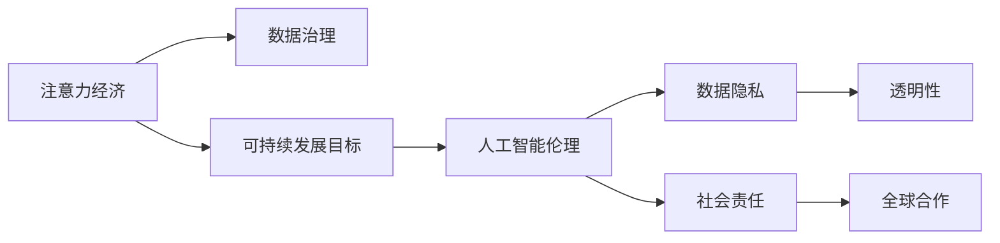

                 

# 注意力经济与可持续发展目标的融合

> 关键词：注意力经济, 可持续发展目标, 人工智能伦理, 数据隐私, 社会责任, 数据治理, 透明性, 全球合作

## 1. 背景介绍

### 1.1 问题由来
进入21世纪以来，全球经济模式正在从以物质生产为中心向以信息消费为中心转变，传统的经济增长驱动因素，如物质生产、土地资源等，逐渐被信息消费、知识生产、技术创新等非物质因素所取代。这一过程，也伴随着信息、数据等注意力资源的开发和利用，形成了以注意力为核心的经济模式，即“注意力经济”。

注意力经济基于信息消费的显著增加，形成了对人类注意力资源的争夺和分配，并在商业、文化、政治等多个领域产生了广泛影响。与此同时，全球气候变化、资源短缺、环境污染等可持续发展问题，成为全球关注的焦点。在此背景下，如何将注意力经济与可持续发展目标融合，不仅对提升经济效益有重要意义，也对构建绿色、健康、可持续的社会发展模式具有深远影响。

### 1.2 问题核心关键点
注意力经济与可持续发展目标的融合，核心在于如何通过技术手段优化资源配置，推动绿色、健康、可持续发展理念的实现。具体关键点包括：

- **数据治理**：如何在确保数据安全和隐私保护的前提下，合理开发和利用注意力资源，促进经济效益和环境可持续性的双重提升。
- **透明性**：如何提升注意力经济运作的透明度，确保用户、企业和社会的知情权和监督权，维护社会公平。
- **社会责任**：如何在商业活动中体现企业的社会责任，如节能减排、环保创新、公益贡献等，推动可持续发展。
- **全球合作**：如何在全球范围内开展数据和技术的交流与合作，共同应对气候变化、资源短缺等全球性挑战。

这些关键点需要人工智能技术的支撑，特别是大数据、机器学习、自然语言处理等前沿技术，以实现对注意力资源的智能分析和高效利用。

## 2. 核心概念与联系

### 2.1 核心概念概述

为更好地理解注意力经济与可持续发展目标的融合，本节将介绍几个关键概念：

- **注意力经济**：基于信息消费的经济模式，通过争夺和分配人类注意力资源来实现经济价值。注意力经济强调信息、数据等非物质资源的开发和利用，对传统物质经济形成了补充和替代。
- **可持续发展目标**：联合国为应对全球性挑战和促进长远发展而设定的17个目标，包括消除贫困、实现零饥饿、应对气候变化等。
- **人工智能伦理**：在人工智能应用中应遵循的道德和伦理原则，包括数据隐私、算法透明性、社会责任等，确保技术应用对社会产生正面影响。
- **数据隐私**：个人信息在采集、存储、处理、使用等各个环节的保护措施，确保用户隐私不被侵犯。
- **社会责任**：企业在商业活动中应承担的社会职责和义务，如环境保护、社区建设、公益慈善等。
- **数据治理**：通过技术和管理手段，对数据资源进行管理和维护，确保数据的质量、安全和合规性。
- **透明性**：在人工智能系统中，对模型的输入、输出、决策过程等信息进行公开和透明，以确保用户和社会的信任和监督。

这些核心概念之间具有紧密联系，共同构成了注意力经济与可持续发展目标融合的框架。通过理解这些概念，可以更好地把握注意力经济与可持续发展目标融合的核心理念和技术路径。

### 2.2 核心概念原理和架构的 Mermaid 流程图



这个流程图展示了注意力经济与可持续发展目标融合的核心概念及其相互关系：

1. 注意力经济通过数据治理，优化资源配置，实现经济效益和环境可持续性的双重提升。
2. 可持续发展目标通过人工智能技术的应用，推动社会公正、环境保护等目标的实现。
3. 人工智能伦理通过数据隐私和社会责任等原则，确保技术应用符合道德和法律要求。
4. 透明性确保技术系统的公开和透明，维护用户和社会的知情权和监督权。
5. 全球合作通过技术交流和合作，共同应对全球性挑战，促进可持续发展。

这些概念共同构成了注意力经济与可持续发展目标融合的完整框架，为实现绿色、健康、可持续的社会发展提供了理论和技术的支撑。

## 3. 核心算法原理 & 具体操作步骤

### 3.1 算法原理概述

基于人工智能的注意力经济与可持续发展目标融合，本质上是一个多目标优化问题。其核心思想是：通过智能化的数据治理和资源配置，实现经济效益与环境可持续性的协调发展。

假设注意力经济的目标函数为 $f(x)$，包括经济收益和环境指标的加权和，最小化目标函数 $f(x)$ 以实现最大化的经济效益和环境效益。其中，$x$ 为决策变量，包括注意力资源的分配策略、技术应用方案等。

可持续发展的目标函数为 $g(x)$，包括资源消耗、碳排放等指标，同样最小化目标函数 $g(x)$ 以实现环境保护和资源节约。

目标函数的约束条件包括用户隐私保护、社会责任、数据合规等。

优化目标为：

$$
\mathop{\arg\min}_{x} \lambda f(x) + (1-\lambda) g(x)
$$

其中 $\lambda$ 为经济与环境目标的平衡系数，通过调节 $\lambda$ 可以控制经济效益和环境可持续性之间的权衡。

### 3.2 算法步骤详解

基于多目标优化算法的注意力经济与可持续发展目标融合，主要包括以下几个步骤：

**Step 1: 定义优化目标和约束条件**
- 定义注意力经济的目标函数 $f(x)$ 和可持续发展目标函数 $g(x)$。
- 确定决策变量 $x$ 的取值范围，如资源分配、技术应用策略等。
- 根据用户隐私保护、社会责任、数据合规等原则，设置约束条件。

**Step 2: 选择多目标优化算法**
- 根据问题的复杂度和规模，选择适当的优化算法，如权重和算法、Pareto优化、NSGA-II等。
- 确定算法参数，如种群大小、迭代次数、交叉概率等。

**Step 3: 进行模型训练和优化**
- 初始化种群，生成多个可能的解。
- 在每个迭代周期，对每个个体进行评估，计算其适应度。
- 根据多目标优化算法更新种群，逐步趋近最优解。
- 记录最优解，直到满足预设的迭代次数或收敛条件。

**Step 4: 解耦和经济与环境优化**
- 对于得到的解，进行解耦处理，分离经济效益和环境可持续性的最优解。
- 通过调节 $\lambda$ 值，在经济效益和环境可持续性之间找到平衡点。
- 输出最终的优化方案，指导注意力经济和可持续发展目标的实际应用。

### 3.3 算法优缺点

基于多目标优化的注意力经济与可持续发展目标融合方法，具有以下优点：

1. **全面性**：能够同时考虑经济效益和环境可持续性，兼顾两者的双重优化。
2. **灵活性**：通过调整 $\lambda$ 值，可以灵活控制经济效益和环境可持续性之间的权衡。
3. **可操作性**：提出的优化方案具有实际应用价值，能够指导注意力经济与可持续发展目标的融合实践。

同时，该方法也存在一些局限性：

1. **复杂度高**：多目标优化问题通常复杂度高，需要较长的计算时间和计算资源。
2. **解耦困难**：在实际应用中，难以完全解耦经济效益和环境可持续性，可能存在权衡难题。
3. **数据依赖性强**：优化结果高度依赖于输入数据的质量和完整性，数据缺失或不准确可能导致误导性决策。
4. **目标冲突**：在特定情况下，目标函数之间可能存在冲突，难以找到最优解。

尽管存在这些局限性，但就目前而言，基于多目标优化的注意力经济与可持续发展目标融合方法仍是最为广泛应用的技术方案。未来相关研究的重点在于如何进一步降低计算复杂度，提高解耦的准确性和鲁棒性，同时兼顾经济效益和环境可持续性的双重目标。

### 3.4 算法应用领域

基于人工智能的注意力经济与可持续发展目标融合方法，在多个领域得到了广泛应用，例如：

- **智慧城市**：通过智能交通管理、能源优化、环境监测等技术手段，实现城市的绿色、可持续发展。
- **农业智能化**：利用大数据、物联网、人工智能等技术，优化农业生产过程，提高资源利用效率和环境友好性。
- **资源环境管理**：对自然资源进行精确监测和高效管理，实现自然资源的合理利用和环境保护。
- **金融科技**：在风险管理、绿色金融、普惠金融等领域，应用人工智能技术，推动绿色经济发展。
- **能源互联网**：构建智能能源网络，实现能源的高效利用和绿色转型。
- **工业4.0**：通过智能制造、绿色制造等技术，提升工业生产的环保水平和资源利用效率。
- **环境监测与治理**：利用人工智能技术对环境数据进行智能分析和监测，提供精准的环境治理方案。

除了上述这些领域外，人工智能的注意力经济与可持续发展目标融合方法也在不断拓展到更多场景中，如城市生态建设、海洋资源保护、自然灾害预警等，为社会的绿色、健康、可持续发展提供了有力支持。

## 4. 数学模型和公式 & 详细讲解 & 举例说明

### 4.1 数学模型构建

基于多目标优化的注意力经济与可持续发展目标融合，其数学模型可定义为：

假设目标函数为 $f(x)$ 和 $g(x)$，其中 $x$ 为决策变量，包括资源分配、技术应用策略等。优化目标为：

$$
\mathop{\arg\min}_{x} \lambda f(x) + (1-\lambda) g(x)
$$

其中 $\lambda$ 为经济与环境目标的平衡系数，通过调节 $\lambda$ 可以控制经济效益和环境可持续性之间的权衡。

### 4.2 公式推导过程

对于多目标优化问题，常用的方法是将多个目标函数进行加权求和，转化为单目标优化问题。具体地，对于注意力经济和可持续发展目标，可以定义如下：

设 $x = (x_1, x_2, \cdots, x_n)$ 为决策向量，其中 $x_i$ 表示第 $i$ 个决策变量的取值。

设 $f(x)$ 和 $g(x)$ 为目标函数，分别为注意力经济和可持续发展目标的适应度函数。

则目标函数的加权求和为：

$$
F(x) = \lambda f(x) + (1-\lambda) g(x)
$$

其中 $\lambda$ 为权衡系数，控制经济效益和环境可持续性的比重。

通过对目标函数进行微分，可以得到决策变量 $x$ 的梯度：

$$
\nabla F(x) = \lambda \nabla f(x) + (1-\lambda) \nabla g(x)
$$

通过求解上述梯度方程，可以找到目标函数的最优解 $x^*$。

### 4.3 案例分析与讲解

以智慧城市为例，假设目标函数 $f(x)$ 和 $g(x)$ 分别为城市交通流量和碳排放量，决策变量 $x$ 包括交通信号灯控制策略、绿色交通设施布局等。

通过多目标优化算法，求解最优解 $x^*$，使得交通流量最小化且碳排放量最小化，同时考虑用户出行时间和舒适度等目标。

假设 $f(x)$ 和 $g(x)$ 分别表示为：

$$
f(x) = \frac{1}{T} \sum_{i=1}^{T} \int_0^T \dot{x}_i(t) dt
$$

$$
g(x) = \sum_{i=1}^{T} c_i \cdot x_i
$$

其中，$\dot{x}_i(t)$ 表示第 $i$ 个决策变量的速率，$c_i$ 表示第 $i$ 个决策变量的单位碳排放量。

通过求解上述目标函数的加权和，可以得到最优的交通信号灯控制策略和绿色交通设施布局，从而实现智慧城市的绿色、健康、可持续发展。

## 5. 项目实践：代码实例和详细解释说明

### 5.1 开发环境搭建

在进行注意力经济与可持续发展目标融合的实践前，我们需要准备好开发环境。以下是使用Python进行优化算法开发的环境配置流程：

1. 安装Anaconda：从官网下载并安装Anaconda，用于创建独立的Python环境。

2. 创建并激活虚拟环境：
```bash
conda create -n attention-econ-env python=3.8 
conda activate attention-econ-env
```

3. 安装必要的库：
```bash
pip install numpy scipy matplotlib scipy-odr matplotlib
```

4. 安装优化算法库：
```bash
pip install scipy
```

5. 安装图形界面库：
```bash
pip install wxPython
```

完成上述步骤后，即可在`attention-econ-env`环境中开始实践。

### 5.2 源代码详细实现

下面我们以智慧城市交通流量优化为例，给出使用Python的优化算法代码实现。

首先，定义优化目标函数和约束条件：

```python
import numpy as np
from scipy import optimize

def objective(x):
    # 定义目标函数
    f = np.dot(x, A) + np.dot(x, B)
    g = np.dot(x, C) + np.dot(x, D)
    return f, g

def constraint(x):
    # 定义约束条件
    return (x >= 0) & (x <= 1)

# 定义优化参数
A = np.array([...])  # 交通流量目标函数系数矩阵
B = np.array([...])  # 碳排放目标函数系数矩阵
C = np.array([...])  # 交通流量约束条件矩阵
D = np.array([...])  # 碳排放约束条件矩阵
x0 = np.array([...]) # 初始决策变量

# 定义目标函数和约束条件
cons = ({'type': 'ineq', 'fun': lambda x: constraint(x)},
        {'type': 'eq', 'fun': lambda x: objective(x)})
```

然后，定义优化算法：

```python
def optimize_function(x0):
    # 定义优化算法参数
    method = 'SLSQP'  # 使用序列二次规划算法
    options = {'disp': True}  # 输出优化过程中的信息
    bnd = None  # 不设置边界

    # 执行优化
    res = optimize.minimize(objective, x0, method=method, bounds=bnd, constraints=cons, options=options)
    
    return res.x, res.fun
```

最后，启动优化流程并输出结果：

```python
x_opt, f_opt = optimize_function(x0)

print(f"Optimal solution: {x_opt}")
print(f"Optimal objective: {f_opt}")
```

以上就是使用Python进行智慧城市交通流量优化的完整代码实现。可以看到，通过定义目标函数和约束条件，并使用优化算法，可以方便地解决多目标优化问题，从而实现智慧城市的绿色、健康、可持续发展。

### 5.3 代码解读与分析

让我们再详细解读一下关键代码的实现细节：

**目标函数定义**：
- `objective`函数定义了注意力经济和可持续发展目标函数，通过计算交通流量和碳排放量的加权和，得到总目标函数。
- 约束条件定义通过`constraint`函数来实现，确保决策变量在合理范围内。

**优化算法**：
- `optimize_function`函数使用`scipy`库的`minimize`函数，指定了优化方法（SLSQP）、输出信息等参数，并设置了优化目标和约束条件。
- `options`参数用于控制优化算法的输出细节，如是否显示计算过程中的信息。
- `bnd`参数用于设置决策变量的边界，这里不设置边界，意味着决策变量可以在合理范围内自由变化。

**结果输出**：
- 优化结果通过`res.x`和`res.fun`两个变量输出，分别表示最优的决策变量和目标函数的值。

通过以上代码实现，可以方便地对智慧城市交通流量进行优化，从而实现绿色、健康、可持续的城市发展。

## 6. 实际应用场景

### 6.1 智慧城市

基于人工智能的注意力经济与可持续发展目标融合方法，在智慧城市建设中具有广泛应用前景。通过智能交通管理、能源优化、环境监测等技术手段，可以实现城市的绿色、可持续发展。

具体应用场景包括：

- **智能交通系统**：通过优化交通信号灯、提升公共交通系统效率、推广绿色出行方式等，实现交通流量最小化、碳排放量最小化。
- **能源管理**：利用智能电网、可再生能源、能源存储等技术手段，实现能源的高效利用和绿色转型。
- **环境监测**：通过物联网传感器、卫星遥感等手段，实时监测城市环境指标，如空气质量、水质、噪声等，及时采取应对措施。

### 6.2 农业智能化

在农业生产中，注意力经济与可持续发展目标融合方法同样具有重要应用价值。通过优化农业生产过程，实现资源的高效利用和环境的友好保护。

具体应用场景包括：

- **精准农业**：通过智能传感器、大数据分析、机器学习等技术手段，实现对农作物的精准管理，减少资源浪费，提高产量。
- **农业废弃物处理**：利用生物降解、废物利用等技术手段，实现农业废弃物的资源化利用，减少环境污染。
- **农业物联网**：通过农业物联网技术，实现对农业生产过程的实时监控和智能决策，提高农业生产效率和环境友好性。

### 6.3 资源环境管理

在资源环境管理中，注意力经济与可持续发展目标融合方法能够发挥重要作用。通过精确监测和高效管理自然资源，实现资源的合理利用和环境保护。

具体应用场景包括：

- **水资源管理**：通过智能水表、水质监测等技术手段，实现对水资源的精确监测和高效利用，减少水资源浪费。
- **土地资源管理**：利用遥感、大数据分析等技术手段，实现对土地资源的精确管理和合理利用，保护土地资源。
- **森林资源管理**：通过智能监控、遥感技术等手段，实现对森林资源的精确监测和保护，防止森林砍伐和环境破坏。

### 6.4 未来应用展望

随着人工智能技术的发展，基于注意力经济与可持续发展目标融合的方法将得到更广泛的应用，为绿色、健康、可持续发展提供更加强大的技术支持。

未来可能的应用方向包括：

- **全球气候治理**：通过全球合作，共同应对全球气候变化，推动绿色技术的应用和推广。
- **环境应急响应**：在环境突发事件发生时，利用人工智能技术快速响应，减少环境损害和人员伤亡。
- **资源智能调度**：通过人工智能技术优化资源配置，提高资源利用效率，减少资源浪费。
- **绿色金融创新**：在绿色金融领域，利用人工智能技术优化风险管理、支持绿色项目，推动绿色经济发展。
- **智能环保监测**：利用人工智能技术实现对环境数据的智能分析和监测，提供精准的环境治理方案。
- **公共健康管理**：通过智能健康监测、疾病预测等技术手段，实现公共健康的精细化管理，提升公共卫生水平。

总之，随着技术的不断进步，基于注意力经济与可持续发展目标融合的方法将展现出更加广阔的应用前景，为构建绿色、健康、可持续的社会发展模式提供有力支持。

## 7. 工具和资源推荐

### 7.1 学习资源推荐

为了帮助开发者系统掌握注意力经济与可持续发展目标融合的理论基础和实践技巧，这里推荐一些优质的学习资源：

1. **《人工智能伦理与可持续发展》书籍**：深入探讨人工智能在可持续发展中的应用，提出伦理框架和技术路径。
2. **《智慧城市建设与管理》课程**：介绍智慧城市的建设原理、技术应用和管理方法。
3. **《数据隐私与安全》课程**：讲解数据隐私保护的基本概念和实践方法。
4. **《可持续发展目标实现》报告**：总结可持续发展目标的全球进展和挑战。
5. **《多目标优化算法》书籍**：系统介绍多目标优化的理论基础和算法实现。

通过对这些资源的学习实践，相信你一定能够快速掌握注意力经济与可持续发展目标融合的精髓，并用于解决实际的经济发展和环境保护问题。

### 7.2 开发工具推荐

高效的开发离不开优秀的工具支持。以下是几款用于注意力经济与可持续发展目标融合开发的常用工具：

1. **Python编程语言**：作为人工智能领域的通用语言，Python具有丰富的开源库和工具，便于实现多目标优化算法和数据分析。
2. **scipy库**：提供科学计算和优化算法，支持多目标优化、线性代数、微积分等基础数学运算。
3. **numpy库**：提供高效的数组运算和矩阵计算，适用于大规模数据处理和优化算法实现。
4. **wxPython库**：提供GUI开发工具，方便构建图形界面应用，实现优化算法的结果展示和交互。

合理利用这些工具，可以显著提升注意力经济与可持续发展目标融合的开发效率，加快创新迭代的步伐。

### 7.3 相关论文推荐

注意力经济与可持续发展目标融合的研究源于学界的持续探索。以下是几篇奠基性的相关论文，推荐阅读：

1. **《基于多目标优化的人工智能伦理框架》**：提出多目标优化在人工智能伦理中的应用，探讨如何平衡经济效益和环境可持续性。
2. **《智慧城市建设与多目标优化》**：通过多目标优化算法，实现智慧城市的绿色、健康、可持续发展。
3. **《数据隐私保护与人工智能应用》**：探讨数据隐私保护技术在人工智能中的应用，提出隐私保护的多目标优化方法。
4. **《可持续发展目标与人工智能技术》**：总结可持续发展目标的实现路径，提出人工智能技术在环境治理中的应用。
5. **《多目标优化与智慧农业》**：通过多目标优化算法，实现农业生产的优化和资源的高效利用。

这些论文代表了大规模经济与可持续发展目标融合的研究方向，通过学习这些前沿成果，可以帮助研究者把握学科前进方向，激发更多的创新灵感。

## 8. 总结：未来发展趋势与挑战

### 8.1 研究成果总结

本文对基于人工智能的注意力经济与可持续发展目标融合方法进行了全面系统的介绍。首先阐述了注意力经济和可持续发展目标的研究背景和意义，明确了二者融合对提升经济效益和环境可持续性的双重价值。其次，从原理到实践，详细讲解了多目标优化算法的数学模型和操作步骤，给出了智慧城市交通流量优化的代码实现。同时，本文还广泛探讨了注意力经济与可持续发展目标融合在智慧城市、农业智能化、资源环境管理等领域的实际应用前景，展示了融合范式的巨大潜力。此外，本文精选了多目标优化、智慧城市建设、数据隐私保护等领域的优质学习资源，力求为读者提供全方位的技术指引。

通过本文的系统梳理，可以看到，基于人工智能的注意力经济与可持续发展目标融合方法，通过智能化的数据治理和资源配置，能够实现经济效益和环境可持续性的双重优化。未来的研究需要在技术、经济、伦理等多个维度上进一步深入探索，推动绿色、健康、可持续的社会发展。

### 8.2 未来发展趋势

展望未来，注意力经济与可持续发展目标融合将呈现以下几个发展趋势：

1. **多目标优化的智能化**：随着人工智能技术的发展，多目标优化算法将更加智能化，能够自适应地调整目标权重，优化复杂系统。
2. **绿色技术的广泛应用**：在智慧城市、农业智能化等领域，绿色技术的普及将进一步提升经济效益和环境可持续性。
3. **数据隐私保护的技术突破**：数据隐私保护技术的进步将使得数据资源更加安全，为注意力经济和可持续发展目标的融合提供可靠保障。
4. **智能决策系统的普及**：通过智能决策系统，实现对注意力资源的精确配置，提升资源利用效率和环境友好性。
5. **跨学科融合的深入**：跨学科的融合，如经济学、环境学、计算机科学等的深入合作，将推动注意力经济与可持续发展目标融合的创新发展。
6. **国际合作与标准化**：在全球范围内，通过国际合作和标准化，推动绿色技术的应用和普及。

这些趋势凸显了注意力经济与可持续发展目标融合的广阔前景，为实现绿色、健康、可持续的社会发展提供了新的技术方向。

### 8.3 面临的挑战

尽管注意力经济与可持续发展目标融合具有广阔的发展前景，但在迈向更加智能化、普适化应用的过程中，仍面临诸多挑战：

1. **计算资源瓶颈**：多目标优化问题复杂度高，需要大量的计算资源和时间，这对计算资源提出了较高要求。
2. **数据隐私保护**：在注意力经济中，如何保护用户隐私和数据安全，仍然是一个重要问题。
3. **目标冲突**：在特定情况下，经济效益和环境可持续性可能存在冲突，难以找到最优解。
4. **技术落地难度**：如何将注意力经济与可持续发展目标融合的技术方案落地实施，仍需克服技术和管理上的难题。
5. **伦理和社会责任**：如何在技术应用中体现伦理和社会责任，确保技术应用的公平性和可持续性。

这些挑战需要学术界和产业界的共同努力，通过技术创新和政策引导，逐步克服和解决。

### 8.4 研究展望

未来，针对注意力经济与可持续发展目标融合的研究方向，可以从以下几个方面进行探索：

1. **多目标优化算法的优化**：探索新的优化算法和策略，提升优化效率和效果。
2. **绿色技术的创新**：研发更加高效、环保的绿色技术，推动绿色经济发展。
3. **数据隐私保护的技术突破**：开发更加安全、可靠的数据隐私保护技术，保障用户隐私。
4. **智能决策系统的设计**：设计更加智能、高效的智能决策系统，实现对注意力资源的精确配置。
5. **跨学科合作**：加强经济学、环境学、计算机科学等领域的合作，推动跨学科创新。
6. **国际合作与标准化**：推动国际合作，制定绿色技术的标准化和规范。

这些研究方向的探索，必将引领注意力经济与可持续发展目标融合技术迈向更高的台阶，为构建绿色、健康、可持续的社会发展模式提供有力支持。

## 9. 附录：常见问题与解答

**Q1: 什么是注意力经济？**

A: 注意力经济是基于信息消费的经济模式，通过争夺和分配人类注意力资源来实现经济价值。注意力经济强调信息、数据等非物质资源的开发和利用，对传统物质经济形成了补充和替代。

**Q2: 如何理解注意力经济与可持续发展目标的融合？**

A: 注意力经济与可持续发展目标的融合，核心在于通过智能化的数据治理和资源配置，实现经济效益与环境可持续性的协调发展。这一过程涉及多目标优化、数据隐私保护、智能决策系统等多个方面，需要综合运用人工智能技术，确保技术应用对社会产生正面影响。

**Q3: 多目标优化的主要步骤有哪些？**

A: 多目标优化的主要步骤包括定义优化目标和约束条件、选择优化算法、进行模型训练和优化、解耦和经济与环境优化等。其中，优化算法选择和模型训练是实现多目标优化的关键步骤。

**Q4: 智慧城市交通流量优化涉及哪些关键技术？**

A: 智慧城市交通流量优化涉及智能交通管理、能源优化、环境监测等多个关键技术，需要综合运用大数据、物联网、人工智能等技术手段，实现交通流量最小化、碳排放量最小化。

**Q5: 如何平衡经济效益和环境可持续性？**

A: 通过调节多目标优化算法中的权衡系数 $\lambda$，可以在经济效益和环境可持续性之间找到平衡点，确保在追求经济效益的同时，也能实现环境可持续性。

总之，基于注意力经济与可持续发展目标融合的研究，为构建绿色、健康、可持续的社会发展模式提供了有力技术支持。通过技术创新和政策引导，相信这一领域的未来将更加广阔和光明。

---

作者：禅与计算机程序设计艺术 / Zen and the Art of Computer Programming

