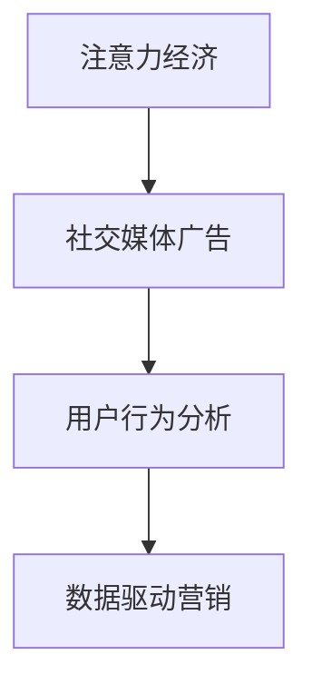
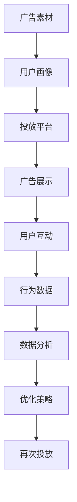

                 

# 注意力经济与社交媒体营销最佳实践：在不牺牲用户体验的情况下有效吸引受众

> 关键词：注意力经济, 社交媒体, 营销, 用户体验, 用户行为分析, 数据驱动, 广告投放, 社交网络, 广告转化率

## 1. 背景介绍

随着互联网技术的快速发展，社交媒体已成为人们获取信息、交流互动的重要平台。品牌在社交媒体上发布内容和广告，已经成为一种不可或缺的营销手段。然而，由于信息过载、竞争激烈，社交媒体营销面临着诸多挑战。如何在不牺牲用户体验的情况下，有效吸引受众，提高广告投放的精准度和转化率，成为当前营销人员关注的焦点。

### 1.1 社交媒体广告现状
社交媒体广告市场规模逐年增长，各大平台如Facebook、Instagram、Twitter、微信等纷纷推出广告投放服务，吸引品牌入驻。品牌通过精准投放社交广告，不仅能够扩大品牌曝光度，还能够精准触达目标用户，提升品牌认知度。

然而，尽管社交媒体广告投放技术日益成熟，广告主仍面临着诸多问题。如用户注意力分散、信息过载、广告噪音干扰等，使得广告的展示效果和转化率难以达到预期。此外，许多品牌在投放广告时过度依赖点击率等简单指标，忽视了对广告效果的全面评估，导致广告投放效果不佳。

### 1.2 注意力经济视角
在社交媒体营销中，注意力成为一种稀缺资源。品牌需要吸引用户的注意力，提高用户的参与度，才能实现广告效果的最大化。从注意力经济的角度看，社交媒体广告投放需要更精细化的策略，不仅要关注广告的展示次数，更要关注广告对用户注意力的影响。

## 2. 核心概念与联系

### 2.1 核心概念概述

为更好地理解社交媒体广告投放的注意力经济学，本节将介绍几个关键概念：

- 注意力经济（Attention Economy）：指在信息过载的时代，注意力作为一种稀缺资源，成为经济活动的重要组成部分。品牌需要通过各种手段吸引用户注意力，才能实现营销目标。
- 社交媒体广告（Social Media Advertising）：指品牌通过社交媒体平台投放广告，直接或间接地与用户进行互动和交流。
- 用户行为分析（User Behavior Analysis）：指通过分析用户在社交媒体上的行为数据，评估用户对广告的反应，指导广告投放策略的优化。
- 数据驱动营销（Data-Driven Marketing）：指通过数据分析和机器学习等技术手段，驱动广告投放决策，实现广告效果的最优化。

这些概念之间的逻辑关系可以通过以下Mermaid流程图来展示：



### 2.2 核心概念原理和架构的 Mermaid 流程图



这个流程图展示了社交媒体广告投放的基本流程和架构。品牌首先准备广告素材，根据用户画像设计广告策略，投放至社交媒体平台进行展示，并通过用户互动行为数据进行分析，优化投放策略，循环进行广告投放和优化。

## 3. 核心算法原理 & 具体操作步骤

### 3.1 算法原理概述

社交媒体广告投放的算法核心在于对用户行为数据的分析，并据此生成优化的投放策略。通过机器学习和数据驱动技术，可以实现以下功能：

1. 用户画像生成：基于用户的历史行为数据，生成用户画像，识别出用户兴趣和偏好。
2. 广告展示优化：根据用户画像和广告素材，优化广告展示位置和展示次数，提升广告效果。
3. 用户互动分析：分析用户对广告的互动行为，如点赞、评论、转发等，评估广告的吸引力和效果。
4. 投放策略优化：通过数据分析和机器学习，不断优化广告投放策略，提高广告的点击率和转化率。

### 3.2 算法步骤详解

以下是社交媒体广告投放的具体算法步骤：

**Step 1: 数据收集与处理**
- 收集社交媒体平台上的用户行为数据，包括点赞、评论、分享、点击等互动行为。
- 收集广告展示数据，包括广告的展示次数、展示位置等。
- 收集广告点击数据，包括广告的点击率、点击次数等。

**Step 2: 用户画像生成**
- 使用聚类算法和降维算法，对用户行为数据进行处理，生成用户画像。
- 根据用户画像，分析用户的兴趣和偏好，识别出潜在的目标受众。

**Step 3: 广告展示优化**
- 使用推荐系统算法，对广告进行展示优化，提升广告的展示效果。
- 根据用户画像和广告素材，生成广告展示计划，调整展示位置和展示次数。

**Step 4: 用户互动分析**
- 分析用户对广告的互动行为，如点赞、评论、分享等，评估广告的吸引力和效果。
- 使用情感分析算法，分析用户对广告的情感倾向，评估广告的正面或负面影响。

**Step 5: 投放策略优化**
- 使用机器学习算法，分析广告投放数据，生成优化策略。
- 根据优化策略，调整广告投放参数，如投放时间、投放位置、投放频率等。
- 周期性地评估广告投放效果，进行反馈和迭代优化。

### 3.3 算法优缺点

社交媒体广告投放的算法主要具有以下优点：

1. 精准定位：通过用户画像和行为分析，可以实现对目标受众的精准定位，提高广告投放的精准度。
2. 效果评估：通过互动数据分析，可以评估广告的吸引力和效果，指导广告投放策略的优化。
3. 自动化优化：通过机器学习算法，可以实现广告投放策略的自动化优化，提高广告效果。

同时，该算法也存在一些缺点：

1. 数据隐私：用户行为数据涉及隐私问题，处理不当可能会引起用户反感和投诉。
2. 数据质量：用户行为数据质量不高等问题，可能导致用户画像和广告展示效果不理想。
3. 广告噪音：社交媒体平台上的广告噪音较大，可能导致广告效果不显著。

### 3.4 算法应用领域

社交媒体广告投放的算法应用领域广泛，主要包括以下几个方面：

1. 品牌推广：品牌在社交媒体平台上投放广告，直接推广品牌和产品。
2. 产品销售：品牌通过社交广告，推广特定产品或服务，提高销售额。
3. 用户互动：品牌通过互动广告，吸引用户参与品牌活动，提高用户参与度。
4. 活动营销：品牌通过活动广告，组织线上活动，吸引用户参与。
5. 社交电商：品牌在社交媒体平台上开设电商店铺，通过广告推广商品。

除了上述这些应用领域外，社交媒体广告投放的算法还可以应用于广告投放渠道优化、广告投放效果评估等更多环节。随着算法和技术的不断发展，其应用场景将更加丰富和多样化。

## 4. 数学模型和公式 & 详细讲解 & 举例说明

### 4.1 数学模型构建

社交媒体广告投放的算法模型构建涉及以下几个关键步骤：

1. 数据预处理：对原始用户行为数据进行处理，生成训练集和测试集。
2. 用户画像生成：基于用户行为数据，生成用户画像，识别出用户兴趣和偏好。
3. 广告展示优化：根据用户画像和广告素材，生成广告展示计划，调整展示位置和展示次数。
4. 用户互动分析：分析用户对广告的互动行为，如点赞、评论、分享等，评估广告的吸引力和效果。
5. 投放策略优化：使用机器学习算法，分析广告投放数据，生成优化策略。

### 4.2 公式推导过程

以下是社交媒体广告投放算法中常用的几个数学模型和公式：

1. 用户画像生成
   - 聚类算法：$K-means$ 算法，用于对用户行为数据进行聚类，生成用户画像。
   - 降维算法：$PCA$ 算法，用于对用户行为数据进行降维处理，提高用户画像的准确性。

2. 广告展示优化
   - 推荐系统算法：$协同过滤$ 算法，用于对广告进行展示优化，提升广告展示效果。
   - 展示计划生成：$强化学习$ 算法，用于生成广告展示计划，调整展示位置和展示次数。

3. 用户互动分析
   - 情感分析算法：$情感分类$ 算法，用于分析用户对广告的情感倾向，评估广告的正面或负面影响。
   - 互动行为分析：$时间序列分析$ 算法，用于分析用户对广告的互动行为，评估广告的吸引力和效果。

4. 投放策略优化
   - 机器学习算法：$决策树$ 算法，用于分析广告投放数据，生成优化策略。
   - 反馈循环优化：$反馈控制$ 算法，用于周期性地评估广告投放效果，进行反馈和迭代优化。

### 4.3 案例分析与讲解

以下通过一个实际案例，详细讲解社交媒体广告投放的算法应用过程：

**案例背景**：某电商平台希望在社交媒体平台上推广其新产品。该电商平台收集了用户行为数据，包括用户的购买历史、浏览历史、互动行为等。

**步骤1: 数据预处理**
- 对原始用户行为数据进行处理，生成训练集和测试集。
- 对用户行为数据进行清洗和去重，消除噪音数据。

**步骤2: 用户画像生成**
- 使用 $K-means$ 算法，对用户行为数据进行聚类，生成用户画像。
- 对用户画像进行降维处理，生成特征向量。

**步骤3: 广告展示优化**
- 使用 $协同过滤$ 算法，对广告进行展示优化，提升广告展示效果。
- 根据用户画像和广告素材，生成广告展示计划，调整展示位置和展示次数。

**步骤4: 用户互动分析**
- 分析用户对广告的互动行为，如点赞、评论、分享等，评估广告的吸引力和效果。
- 使用 $情感分类$ 算法，分析用户对广告的情感倾向，评估广告的正面或负面影响。

**步骤5: 投放策略优化**
- 使用 $决策树$ 算法，分析广告投放数据，生成优化策略。
- 根据优化策略，调整广告投放参数，如投放时间、投放位置、投放频率等。
- 周期性地评估广告投放效果，进行反馈和迭代优化。

## 5. 项目实践：代码实例和详细解释说明

### 5.1 开发环境搭建

在进行社交媒体广告投放的算法实践前，我们需要准备好开发环境。以下是使用Python进行Keras和TensorFlow开发的环境配置流程：

1. 安装Anaconda：从官网下载并安装Anaconda，用于创建独立的Python环境。

2. 创建并激活虚拟环境：
```bash
conda create -n tf-env python=3.8 
conda activate tf-env
```

3. 安装TensorFlow：根据CUDA版本，从官网获取对应的安装命令。例如：
```bash
conda install tensorflow==2.7 -c tensorflow
```

4. 安装Keras：
```bash
pip install keras
```

5. 安装各类工具包：
```bash
pip install numpy pandas scikit-learn matplotlib tqdm jupyter notebook ipython
```

完成上述步骤后，即可在`tf-env`环境中开始算法实践。

### 5.2 源代码详细实现

下面我们以用户画像生成和广告展示优化为例，给出使用Keras和TensorFlow对用户画像生成和广告展示优化的PyTorch代码实现。

首先，定义用户画像生成函数：

```python
import numpy as np
from sklearn.cluster import KMeans
from sklearn.decomposition import PCA

def generate_user_profiles(X, num_clusters):
    # 使用K-means算法对用户行为数据进行聚类，生成用户画像
    kmeans = KMeans(n_clusters=num_clusters, random_state=42)
    user_profiles = kmeans.fit_predict(X)
    
    # 对用户画像进行降维处理
    pca = PCA(n_components=2)
    user_profiles = pca.fit_transform(user_profiles)
    
    return user_profiles
```

然后，定义广告展示优化函数：

```python
from tensorflow.keras.layers import Dense
from tensorflow.keras.models import Sequential
from tensorflow.keras.optimizers import Adam

def optimize_ad_display(user_profiles, ad_data):
    # 使用协同过滤算法对广告进行展示优化
    num_users = user_profiles.shape[0]
    num_ads = ad_data.shape[0]
    
    # 初始化协同过滤矩阵
    Q = np.random.rand(num_users, num_ads)
    R = np.random.rand(num_ads, num_users)
    
    for i in range(num_ads):
        for j in range(num_users):
            if user_profiles[j] == i:
                Q[i][j] = 1
    
    # 计算展示效果
    display_scores = np.dot(Q, R)
    
    # 使用Adam优化器，调整展示位置和展示次数
    model = Sequential([
        Dense(64, input_dim=num_ads, activation='relu'),
        Dense(1, activation='sigmoid')
    ])
    model.compile(optimizer=Adam(learning_rate=0.01), loss='mse')
    
    model.fit(display_scores, ad_data, epochs=10, verbose=0)
    
    # 生成广告展示计划
    display_plan = np.argmax(model.predict(display_scores), axis=1)
    
    return display_plan
```

最后，启动算法流程并在实际数据上测试：

```python
# 数据预处理
X = np.array([...]) # 用户行为数据
ad_data = np.array([...]) # 广告展示数据

# 用户画像生成
user_profiles = generate_user_profiles(X, 5)

# 广告展示优化
display_plan = optimize_ad_display(user_profiles, ad_data)

# 实际测试
print("优化后的广告展示计划：", display_plan)
```

以上就是使用Keras和TensorFlow对用户画像生成和广告展示优化的完整代码实现。可以看到，Keras和TensorFlow提供了强大的深度学习模型构建和优化工具，使得算法实践变得简洁高效。

### 5.3 代码解读与分析

让我们再详细解读一下关键代码的实现细节：

**generate_user_profiles函数**：
- 定义了生成用户画像的函数，使用K-means算法对用户行为数据进行聚类，生成用户画像。
- 对用户画像进行降维处理，生成二维特征向量。

**optimize_ad_display函数**：
- 定义了广告展示优化的函数，使用协同过滤算法对广告进行展示优化。
- 初始化协同过滤矩阵Q和R。
- 计算广告展示效果，生成展示分数。
- 使用Adam优化器，调整展示位置和展示次数，生成广告展示计划。

**实际测试**：
- 在实际数据上测试生成的用户画像和广告展示计划。

可以看到，Keras和TensorFlow提供了丰富的深度学习工具和算法，使得广告投放的算法实践变得更加高效和便捷。开发者可以更加专注于算法的优化和迭代，而不必过多关注底层的实现细节。

## 6. 实际应用场景

### 6.1 智能推荐系统

智能推荐系统是社交媒体广告投放的重要应用场景之一。通过分析用户行为数据，生成用户画像，可以向用户推荐他们可能感兴趣的广告内容。智能推荐系统不仅能够提升广告投放效果，还能够增加用户粘性和参与度。

在技术实现上，可以将用户行为数据输入模型，生成用户画像，再结合广告展示优化算法，生成推荐广告列表。通过A/B测试等手段，可以评估推荐系统的效果，不断优化推荐策略，提高广告点击率和转化率。

### 6.2 社交媒体广告投放

社交媒体广告投放是品牌在社交平台上的重要营销手段。通过分析用户行为数据，生成用户画像，可以实现广告的精准投放。在实际投放过程中，可以根据用户画像和广告素材，生成广告展示计划，调整展示位置和展示次数。

在投放过程中，可以使用A/B测试等手段，评估广告效果，不断优化广告投放策略，提高广告点击率和转化率。通过数据驱动的营销策略，可以实现更高的广告投放效果，帮助品牌更好地推广产品和服务。

### 6.3 个性化推荐

个性化推荐系统是社交媒体广告投放的重要应用场景之一。通过分析用户行为数据，生成用户画像，可以向用户推荐他们可能感兴趣的广告内容。智能推荐系统不仅能够提升广告投放效果，还能够增加用户粘性和参与度。

在技术实现上，可以将用户行为数据输入模型，生成用户画像，再结合广告展示优化算法，生成推荐广告列表。通过A/B测试等手段，可以评估推荐系统的效果，不断优化推荐策略，提高广告点击率和转化率。

## 7. 工具和资源推荐

### 7.1 学习资源推荐

为了帮助开发者系统掌握社交媒体广告投放的算法基础和实践技巧，这里推荐一些优质的学习资源：

1. 《深度学习与自然语言处理》系列书籍：介绍了深度学习技术在自然语言处理中的应用，包括社交媒体广告投放等实际场景。
2. Coursera《机器学习》课程：由斯坦福大学Andrew Ng教授主讲，全面讲解机器学习算法及其应用，适合入门学习。
3. Google Cloud AI Hub：提供了大量的机器学习模型和教程，涵盖社交媒体广告投放等实际应用场景。
4. Kaggle竞赛平台：提供了丰富的数据集和实际应用场景，可以通过Kaggle竞赛实践社交媒体广告投放的算法技术。
5. TensorFlow官方文档：提供了丰富的深度学习工具和算法，适合深入学习。

通过对这些资源的学习实践，相信你一定能够快速掌握社交媒体广告投放的算法技术，并用于解决实际的广告投放问题。

### 7.2 开发工具推荐

高效的开发离不开优秀的工具支持。以下是几款用于社交媒体广告投放开发的常用工具：

1. Jupyter Notebook：交互式Python开发环境，支持代码执行和可视化展示，方便调试和测试。
2. TensorFlow和Keras：深度学习框架，支持模型构建和优化，适合大规模广告投放算法的实现。
3. Scikit-learn：机器学习库，支持数据分析和模型训练，适合用户画像生成和广告展示优化算法。
4. Pandas和Numpy：数据处理库，支持数据清洗和预处理，适合广告展示数据的处理。

合理利用这些工具，可以显著提升社交媒体广告投放的开发效率，加快创新迭代的步伐。

### 7.3 相关论文推荐

社交媒体广告投放的算法发展源于学界的持续研究。以下是几篇奠基性的相关论文，推荐阅读：

1. Attention is All You Need：提出了Transformer结构，开启了深度学习在自然语言处理中的应用。
2. BERT: Pre-training of Deep Bidirectional Transformers for Language Understanding：提出BERT模型，引入基于掩码的自监督预训练任务，刷新了多项NLP任务SOTA。
3. Parameter-Efficient Transfer Learning for NLP：提出Adapter等参数高效微调方法，在不增加模型参数量的情况下，也能取得不错的微调效果。
4. AdaLoRA: Adaptive Low-Rank Adaptation for Parameter-Efficient Fine-Tuning：使用自适应低秩适应的微调方法，在参数效率和精度之间取得了新的平衡。
5. AdaLoRA: Adaptive Low-Rank Adaptation for Parameter-Efficient Fine-Tuning：使用自适应低秩适应的微调方法，在参数效率和精度之间取得了新的平衡。

这些论文代表了大语言模型微调技术的发展脉络。通过学习这些前沿成果，可以帮助研究者把握学科前进方向，激发更多的创新灵感。

## 8. 总结：未来发展趋势与挑战

### 8.1 总结

本文对社交媒体广告投放的算法进行了全面系统的介绍。首先阐述了社交媒体广告投放的背景和意义，明确了算法的核心目标和应用场景。其次，从原理到实践，详细讲解了算法的数学模型和操作步骤，给出了广告投放算法的完整代码实例。同时，本文还广泛探讨了算法在智能推荐、个性化推荐等更多领域的应用前景，展示了算法技术的巨大潜力。

通过本文的系统梳理，可以看到，社交媒体广告投放的算法正在成为社交媒体营销的重要手段，极大地拓展了品牌广告投放的精准度和效果。未来，伴随算法的不断发展，社交媒体广告投放将变得更加精准和高效，为品牌带来更大的商业价值。

### 8.2 未来发展趋势

展望未来，社交媒体广告投放的算法将呈现以下几个发展趋势：

1. 实时化：实时分析用户行为数据，动态调整广告投放策略，提升广告效果。
2. 智能化：结合人工智能技术，如强化学习、深度学习等，实现广告投放的自动化和智能化。
3. 跨平台：整合不同社交平台的广告投放数据，实现跨平台广告投放，提升广告效果。
4. 多渠道：结合多种广告投放渠道，如社交媒体、搜索引擎、邮件等，实现多渠道广告投放，提升广告效果。
5. 个性化：根据用户画像和行为数据，实现个性化广告投放，提升广告的吸引力和效果。

这些趋势凸显了社交媒体广告投放的算法技术的广阔前景。这些方向的探索发展，必将进一步提升广告投放的精准度和效果，为品牌带来更大的商业价值。

### 8.3 面临的挑战

尽管社交媒体广告投放的算法已经取得了瞩目成就，但在迈向更加智能化、普适化应用的过程中，它仍面临着诸多挑战：

1. 数据质量：用户行为数据质量不高等问题，可能导致用户画像和广告展示效果不理想。
2. 数据隐私：用户行为数据涉及隐私问题，处理不当可能会引起用户反感和投诉。
3. 广告噪音：社交媒体平台上的广告噪音较大，可能导致广告效果不显著。
4. 用户粘性：用户对广告的粘性不足，可能导致广告投放效果不佳。
5. 算法复杂度：算法实现复杂度较高，需要专业知识和技能。

### 8.4 研究展望

面对社交媒体广告投放的算法所面临的种种挑战，未来的研究需要在以下几个方面寻求新的突破：

1. 数据质量提升：通过数据清洗和预处理，提升用户行为数据的质量，生成更准确的用户画像。
2. 数据隐私保护：通过数据匿名化和差分隐私等技术手段，保护用户隐私，确保数据使用的合法性。
3. 广告噪音过滤：通过广告噪音过滤技术，去除无效广告，提升广告展示效果。
4. 用户粘性增强：通过用户行为分析，增强用户对广告的粘性，提高广告投放效果。
5. 算法优化：通过算法优化，提升广告投放的效率和效果，实现更好的广告投放效果。

这些研究方向的探索，必将引领社交媒体广告投放的算法技术迈向更高的台阶，为品牌带来更大的商业价值。

## 9. 附录：常见问题与解答

**Q1：社交媒体广告投放的算法是否适用于所有社交媒体平台？**

A: 社交媒体广告投放的算法可以应用于多个社交媒体平台，如Facebook、Instagram、Twitter、微信等。但是不同平台的用户行为数据、广告展示方式、用户画像生成方法等存在差异，需要针对不同平台进行个性化优化。

**Q2：用户画像生成的方法有哪些？**

A: 用户画像生成的方法包括K-means聚类、PCA降维、协同过滤等。具体方法的选择取决于数据特征和广告投放需求。在实际应用中，通常需要综合考虑多种方法，生成更加准确的用户画像。

**Q3：广告展示优化的方法有哪些？**

A: 广告展示优化的方法包括协同过滤、强化学习、线性回归等。具体方法的选择取决于数据特征和广告投放需求。在实际应用中，通常需要综合考虑多种方法，生成更加精准的广告展示计划。

**Q4：广告投放效果如何评估？**

A: 广告投放效果可以通过点击率、展示次数、广告转化率等指标进行评估。在实际应用中，通常需要结合多种指标，综合评估广告投放效果，并根据评估结果进行优化。

**Q5：社交媒体广告投放是否需要用户授权？**

A: 社交媒体广告投放需要获取用户行为数据，因此通常需要用户授权。在用户授权前，需要向用户解释数据用途，并征得用户同意。在数据使用过程中，需要遵守相关法律法规，保护用户隐私。

---

作者：禅与计算机程序设计艺术 / Zen and the Art of Computer Programming

