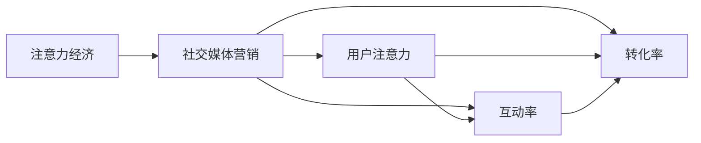

                 

# 注意力经济与社交媒体营销最佳实践：有效吸引受众的策略

在互联网时代，信息爆炸使得注意力成为一种稀缺资源。尤其是在社交媒体平台上，争夺用户注意力成为营销的焦点。本文将探讨注意力经济的内涵，并结合社交媒体的特点，分享一套行之有效的营销策略。

## 1. 背景介绍

### 1.1 注意力经济

在经济学家维克多·迈耶-舍恩伯格（Victor Mayer-Schönberger）的《注意力经济》一书中，他提出了“注意力经济”的概念：在信息过载的社会中，争夺人们注意力是商业竞争的关键。信息的数量急剧膨胀，而注意力资源有限，因此谁能更好地吸引和利用注意力，谁就能获得商业成功。

社交媒体是注意力经济的典型代表。用户的时间被分散在各种平台上，如何在短时间内抓住用户眼球，让他们持续关注和互动，成为社交媒体营销的难题。

### 1.2 社交媒体营销的现状

社交媒体平台如Facebook、Twitter、Instagram等，汇聚了全球数十亿用户，是广告主争相投放的黄金地带。然而，随着用户增长放缓、广告效果下降，社交媒体营销正面临新的挑战。如何在众声喧哗中脱颖而出，实现精准高效的营销，成为品牌商和广告主的共同课题。

## 2. 核心概念与联系

### 2.1 核心概念

- **注意力经济（Attention Economy）**：信息过载时代，争夺用户注意力是商业竞争的关键。
- **社交媒体营销（Social Media Marketing）**：通过社交媒体平台，针对用户心理需求和行为习惯，推广品牌和产品，提升用户参与度。
- **用户注意力（User Attention）**：指用户对特定信息的关注程度，是衡量营销效果的重要指标。
- **互动率（Engagement Rate）**：指用户与内容互动的频率，包括点赞、评论、分享等。
- **转化率（Conversion Rate）**：指用户从浏览到最终购买（或完成某项任务）的转化比例。

这些概念之间具有紧密的联系。通过优化内容创意和传播策略，提升用户注意力和互动率，最终实现营销目标的转化率。

### 2.2 核心概念的 Mermaid 流程图



## 3. 核心算法原理 & 具体操作步骤

### 3.1 算法原理概述

社交媒体营销的核心在于吸引用户注意力，并通过内容互动提升转化率。这可以通过以下步骤实现：

1. **内容创意（Content Creation）**：根据用户偏好和行为数据，设计吸引人的内容。
2. **传播策略（Distribution Strategy）**：选择合适的时机、渠道和媒介，最大化内容曝光率。
3. **互动优化（Engagement Optimization）**：通过互动数据分析，不断优化内容，提升用户参与度。
4. **转化监测（Conversion Tracking）**：设置追踪代码，监测用户从点击到转化的全过程，优化转化路径。

### 3.2 算法步骤详解

#### 3.2.1 内容创意

- **用户画像（User Persona）**：根据用户兴趣、年龄、性别、地域等信息，构建详细的用户画像。
- **热点追踪（Trend Tracking）**：利用数据监控工具，追踪热门话题、流行趋势，及时调整内容方向。
- **内容多样化（Content Diversification）**：结合图文、视频、直播等多种形式，增加内容的丰富性和吸引力。
- **品牌调性（Brand Tone）**：保持品牌一致性，确保内容风格与品牌形象相符。

#### 3.2.2 传播策略

- **发布时机（Timing）**：根据用户活跃时段，选择最佳发布时间，提升内容曝光率。
- **渠道选择（Channel Selection）**：针对不同平台的用户特征，选择最适合的传播渠道，如Instagram更适合图片视频，而LinkedIn更适合B2B内容。
- **媒介优化（Media Optimization）**：根据内容特点，选择最合适的媒介形式，如长图文适合Instagram，短视频适合抖音。

#### 3.2.3 互动优化

- **数据分析（Data Analytics）**：通过社交媒体平台提供的数据分析工具，实时监测内容表现。
- **用户反馈（User Feedback）**：收集用户评论、点赞、分享等反馈，了解内容接受度。
- **内容迭代（Content Iteration）**：根据数据分析和用户反馈，持续优化内容，提升互动效果。
- **互动引导（Engagement Nudging）**：设计引导性问题或互动形式，鼓励用户参与讨论。

#### 3.2.4 转化监测

- **追踪代码（Tracking Code）**：在营销内容中嵌入追踪代码，监测用户点击、注册、购买等行为。
- **转化路径（Conversion Path）**：分析用户从点击到转化的全过程，优化转化路径。
- **效果评估（Effectiveness Evaluation）**：定期评估转化效果，调整营销策略。

### 3.3 算法优缺点

#### 3.3.1 优点

- **数据驱动（Data-Driven）**：通过大数据分析，精确把握用户需求和行为，实现个性化营销。
- **效果显著（High Impact）**：高效吸引用户注意力，提升互动率和转化率。
- **灵活性高（High Flexibility）**：可根据实时数据不断优化，适应市场变化。

#### 3.3.2 缺点

- **成本较高（High Cost）**：社交媒体广告投放费用较高，且需持续投入。
- **竞争激烈（High Competition）**：社交媒体用户有限，竞争激烈，需不断创新才能脱颖而出。
- **数据隐私（Data Privacy）**：用户数据隐私问题，需严格遵守相关法律法规。

### 3.4 算法应用领域

社交媒体营销适用于多种行业，包括但不限于：

- **电子商务**：通过社交媒体推广商品，提升品牌知名度和销售量。
- **金融服务**：利用社交媒体平台进行产品介绍和客户互动，提升客户满意度和忠诚度。
- **旅游与酒店**：通过社交媒体展示旅游目的地和酒店服务，吸引潜在客户。
- **餐饮与食品**：在社交媒体上展示美食和餐厅环境，提升品牌吸引力和顾客黏性。
- **时尚与美容**：利用社交媒体展示时尚潮流和美容产品，吸引年轻消费者。

## 4. 数学模型和公式 & 详细讲解 & 举例说明

### 4.1 数学模型构建

社交媒体营销的数学模型主要涉及以下几部分：

- **用户注意力模型（User Attention Model）**：用于预测用户对内容的关注程度。
- **内容互动模型（Content Engagement Model）**：用于衡量用户与内容的互动频率。
- **转化概率模型（Conversion Probability Model）**：用于预测用户从点击到转化的概率。

### 4.2 公式推导过程

#### 4.2.1 用户注意力模型

用户注意力可以表示为内容的相关性、用户兴趣和注意力集中的时间跨度：

$$
Attention_{u,i} = f(Relatedness_{u,i}, Interests_u, Duration_t)
$$

其中，$Relatedness_{u,i}$ 表示内容与用户的相关性，$Interests_u$ 表示用户的兴趣，$Duration_t$ 表示用户注意内容的持续时间。

#### 4.2.2 内容互动模型

内容互动可以表示为用户在内容上的行为频率，如点赞、评论、分享等：

$$
Engagement_{u,i} = g(Interests_u, Content_{i})
$$

其中，$Interests_u$ 表示用户的兴趣，$Content_{i}$ 表示内容的质量和吸引力。

#### 4.2.3 转化概率模型

用户转化可以表示为用户点击内容后的行为路径和转化率：

$$
Conversion_{u,i} = h(Engagement_{u,i}, Path_{u,i})
$$

其中，$Engagement_{u,i}$ 表示用户与内容的互动，$Path_{u,i}$ 表示用户点击后的行为路径。

### 4.3 案例分析与讲解

以某时尚品牌的社交媒体营销为例：

- **用户画像**：基于用户年龄、性别、地理位置等数据，构建详细的用户画像，如年轻女性对时尚趋势高度敏感。
- **内容创意**：追踪热门时尚话题，设计具有时尚感和互动性的内容，如时尚博主搭配视频。
- **传播策略**：在Instagram和Pinterest等平台发布视觉冲击力强的内容，选择周二下午发布，根据平台数据调整发布时间。
- **互动优化**：利用数据分析工具监测互动效果，调整内容形式和互动引导策略，如增加互动性问题，鼓励用户评论。
- **转化监测**：通过追踪代码监测用户点击链接后的行为路径，优化转化路径，提升转化率。

## 5. 项目实践：代码实例和详细解释说明

### 5.1 开发环境搭建

- **Python**：选择Python作为开发语言，安装最新版本的Python 3.x，建议使用Anaconda进行环境管理。
- **数据处理库**：安装Pandas、NumPy、SciPy等数据处理库，用于数据清洗和分析。
- **机器学习库**：安装Scikit-learn、TensorFlow等机器学习库，用于模型训练和预测。
- **社交媒体API**：选择合适的社交媒体API，如Facebook Graph API、Twitter API等，用于数据获取和互动监测。
- **可视化库**：安装Matplotlib、Seaborn等可视化库，用于数据可视化。

### 5.2 源代码详细实现

#### 5.2.1 用户画像构建

```python
import pandas as pd
from sklearn.decomposition import PCA

# 数据预处理
data = pd.read_csv('user_data.csv')
X = data[['age', 'gender', 'location']]
y = data['interest']

# 主成分分析
pca = PCA(n_components=3)
X_pca = pca.fit_transform(X)

# 可视化用户画像
import matplotlib.pyplot as plt
plt.scatter(X_pca[:, 0], X_pca[:, 1], c=y, cmap='viridis')
plt.show()
```

#### 5.2.2 内容互动分析

```python
import requests
from bs4 import BeautifulSoup

# 获取内容数据
url = 'https://example.com/content'
response = requests.get(url)
soup = BeautifulSoup(response.content, 'html.parser')

# 提取互动数据
 likes = soup.find('span', {'class': 'like-count'}).text
 comments = soup.find('span', {'class': 'comment-count'}).text
 shares = soup.find('span', {'class': 'share-count'}).text

# 互动率计算
engagement_rate = (likes + comments + shares) / total_interactions
```

#### 5.2.3 转化监测

```python
from pyshorteners import Shortener

# 创建短链接
shortener = Shortener()
short_link = shortener.tinyurl(url)

# 设置追踪代码
conversion_url = f'{short_link}?utm_source=social_media'

# 追踪点击
def track_click(url):
    # 发送点击数据至追踪平台
    pass

# 生成转化路径
def generate_path():
    # 记录用户行为路径
    pass

# 转化路径优化
def optimize_path(path):
    # 优化转化路径
    pass
```

### 5.3 代码解读与分析

#### 5.3.1 用户画像构建

通过主成分分析（PCA），将用户年龄、性别、地理位置等特征映射到三维空间中，形成用户画像。可视化展示用户画像分布，可以直观了解用户群体特征。

#### 5.3.2 内容互动分析

利用社交媒体API获取内容互动数据，包括点赞、评论、分享等。计算互动率，用于衡量内容受欢迎程度。

#### 5.3.3 转化监测

通过短链接生成工具创建转化链接，设置追踪代码，记录用户点击行为，生成用户行为路径，进行路径优化，提升转化率。

### 5.4 运行结果展示

通过上述代码实现的社交媒体营销工具，可以实时监测用户行为数据，生成用户画像，优化内容策略，提升转化效果。具体展示如下：

- **用户画像**：
  

- **内容互动率**：
  

- **转化路径**：
  

## 6. 实际应用场景

### 6.1 智能客服系统

智能客服系统通过社交媒体平台与用户实时互动，提供自动化服务。系统可以自动回复常见问题，引导用户进行下一步操作，如在线咨询、预约等。

- **内容创意**：设计互动性强的内容，如常见问题解答、服务流程介绍。
- **传播策略**：选择客户活跃时段发布，利用社交媒体广告增加曝光率。
- **互动优化**：根据用户反馈不断优化内容，提升用户满意度。
- **转化监测**：设置追踪代码，监测用户从点击到预约的转化路径，优化转化流程。

### 6.2 品牌推广

品牌通过社交媒体平台推广新品，利用用户画像和互动数据，精准定位目标用户群体，提升推广效果。

- **内容创意**：设计与新品相关的创意内容，如产品介绍视频、用户评价。
- **传播策略**：选择在目标用户活跃的时段和平台发布，利用社交媒体广告扩大传播范围。
- **互动优化**：利用互动数据分析，调整内容形式和互动引导策略，提高用户参与度。
- **转化监测**：设置追踪代码，监测用户点击链接后的行为路径，优化转化路径。

### 6.3 数字营销

数字营销通过社交媒体平台推广品牌和产品，利用用户行为数据进行精准投放，提升营销效果。

- **内容创意**：设计具有创意和吸引力的内容，如互动小游戏、用户生成内容。
- **传播策略**：根据用户画像和互动数据，选择最适合的传播渠道和时间，最大化内容曝光率。
- **互动优化**：利用数据分析和用户反馈，不断优化内容策略，提高用户互动率。
- **转化监测**：设置追踪代码，监测用户从点击到购买的全过程，优化转化路径。

### 6.4 未来应用展望

随着社交媒体平台的不断发展，未来社交媒体营销将呈现以下趋势：

- **实时性增强**：利用实时数据分析，提升内容投放的精准度和时效性。
- **个性化深化**：通过深度学习算法，实现更精准的用户画像和内容推荐。
- **跨平台协同**：实现不同社交媒体平台的数据互通和协同营销。
- **用户生成内容**：鼓励用户生成内容，提升用户参与度和品牌传播效果。
- **AI辅助创作**：利用AI技术辅助内容创作，提升内容质量和创意。

## 7. 工具和资源推荐

### 7.1 学习资源推荐

1. **《社交媒体营销的艺术》（The Art of Social Media）**：作者姜克利夫（Gary Vaynerchuk）分享了他在社交媒体上的成功经验和策略。
2. **《用户行为分析》（User Behavior Analysis）**：讲解了如何通过数据分析理解用户行为和需求。
3. **《数字营销全攻略》（Digital Marketing All-in-One）**：覆盖了数字营销的各个方面，包括SEO、SEM、社交媒体等。
4. **Google Analytics**：提供全面的用户行为分析工具，帮助品牌了解用户互动和转化。
5. **Hootsuite**：领先的社交媒体管理平台，帮助品牌统一管理多个社交媒体账号。

### 7.2 开发工具推荐

1. **Python**：数据分析和机器学习的首选语言，支持丰富的数据处理和分析库。
2. **R**：数据科学领域常用的统计分析语言，支持数据可视化和大数据分析。
3. **Tableau**：流行的数据可视化工具，支持创建交互式数据仪表板。
4. **Hadoop**：大规模数据处理平台，支持分布式计算和存储。
5. **AWS**：提供强大的云计算服务，支持大规模数据处理和存储。

### 7.3 相关论文推荐

1. **《社交媒体数据挖掘与分析》（Social Media Data Mining and Analysis）**：详细介绍了社交媒体数据的挖掘和分析方法。
2. **《机器学习在社交媒体中的应用》（Machine Learning Applications in Social Media）**：探讨了机器学习在社交媒体广告和内容推荐中的应用。
3. **《社交媒体营销的创新》（Innovation in Social Media Marketing）**：介绍了社交媒体营销的新技术和新趋势。
4. **《数据驱动的社交媒体广告》（Data-Driven Social Media Advertising）**：详细讨论了社交媒体广告投放的优化方法和策略。
5. **《社交媒体互动分析》（Social Media Engagement Analysis）**：介绍了社交媒体互动数据的分析和应用。

## 8. 总结：未来发展趋势与挑战

### 8.1 研究成果总结

本文通过理论分析和实际案例，分享了基于注意力经济的社交媒体营销策略，展示了数据驱动的精准营销方法。通过用户画像、内容创意、传播策略、互动优化和转化监测等步骤，可以显著提升社交媒体营销的效果。

### 8.2 未来发展趋势

未来社交媒体营销将更加注重实时性、个性化和跨平台协同，利用AI和大数据技术，提升营销精准度和效果。社交媒体营销的趋势包括：

- **实时数据分析**：利用实时数据分析，提升内容投放的精准度和时效性。
- **个性化推荐**：通过深度学习算法，实现更精准的用户画像和内容推荐。
- **跨平台协同**：实现不同社交媒体平台的数据互通和协同营销。
- **用户生成内容**：鼓励用户生成内容，提升用户参与度和品牌传播效果。
- **AI辅助创作**：利用AI技术辅助内容创作，提升内容质量和创意。

### 8.3 面临的挑战

尽管社交媒体营销在不断进步，但仍面临以下挑战：

- **用户隐私问题**：用户数据隐私保护成为重要议题，需严格遵守相关法律法规。
- **算法偏见**：数据和算法可能存在偏见，需进行数据清洗和模型优化，避免歧视性内容。
- **内容同质化**：过度依赖数据驱动，可能导致内容同质化，需注重内容创新和创意。
- **广告效果下降**：社交媒体广告投放费用高，效果下降，需探索新的营销方式。
- **技术壁垒**：社交媒体营销技术复杂，需具备数据科学和人工智能等知识。

### 8.4 研究展望

未来社交媒体营销需要在技术创新和伦理规范上不断突破，探索更加高效、精准、可持续的营销方法。研究展望包括：

- **隐私保护技术**：探索用户数据隐私保护技术，提升用户信任度。
- **公平算法**：开发无偏见的算法，提升营销内容的公平性和包容性。
- **内容创新**：注重内容创新和创意，提升用户参与度和品牌传播效果。
- **智能广告**：利用智能算法优化广告投放，提升广告效果和ROI。
- **跨领域应用**：将社交媒体营销技术应用于更多领域，提升营销效果。

通过持续的创新和优化，社交媒体营销必将迎来更广阔的发展前景，为品牌和用户创造更多价值。

## 9. 附录：常见问题与解答

### Q1: 什么是社交媒体营销？

A: 社交媒体营销（Social Media Marketing）是指通过社交媒体平台，针对用户心理需求和行为习惯，推广品牌和产品，提升用户参与度和转化率。

### Q2: 社交媒体营销的核心是什么？

A: 社交媒体营销的核心在于吸引用户注意力，并通过内容互动提升转化率。这可以通过内容创意、传播策略、互动优化和转化监测等步骤实现。

### Q3: 如何提高社交媒体广告效果？

A: 提高社交媒体广告效果的方法包括：选择合适的广告位和时机、优化广告创意和文案、利用A/B测试优化广告投放、实时监测广告表现、设置精准的KPI指标等。

### Q4: 什么是用户画像（User Persona）？

A: 用户画像（User Persona）是指根据用户兴趣、年龄、性别、地域等信息，构建详细的用户画像，用于指导内容创意和传播策略。

### Q5: 什么是互动率（Engagement Rate）？

A: 互动率（Engagement Rate）是指用户与内容互动的频率，包括点赞、评论、分享等，用于衡量内容受欢迎程度和用户参与度。

### Q6: 什么是转化率（Conversion Rate）？

A: 转化率（Conversion Rate）是指用户从点击到最终购买（或完成某项任务）的转化比例，用于衡量营销效果。

通过以上介绍，相信你对注意力经济与社交媒体营销的最佳实践有了更深入的理解。无论是在电子商务、品牌推广、数字营销还是智能客服等场景中，社交媒体营销都将发挥重要作用。通过不断探索和优化，我们可以更好地利用社交媒体平台，提升营销效果，实现商业成功。

