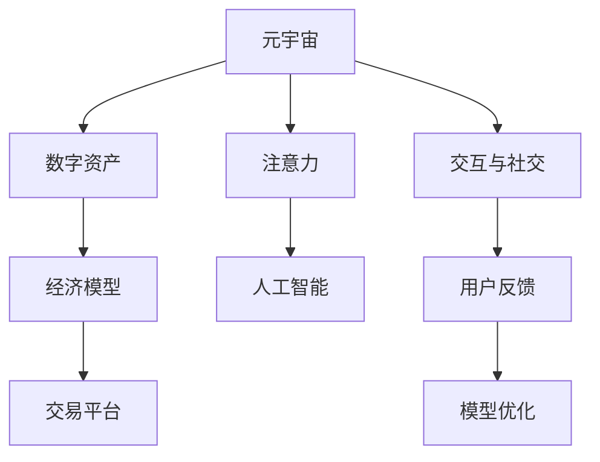

                 

# 注意力经济学:元宇宙中的价值重构

> 关键词：元宇宙,注意力,价值重构,经济模型,人工智能

## 1. 背景介绍

### 1.1 问题由来
随着技术的进步，人类社会正步入一个以虚拟现实、增强现实和区块链技术为基础的全新时代——元宇宙。元宇宙不仅仅是一个虚拟空间，而是一个由分布式计算、数字资产、虚拟资产和社交互动等元素构成的新型数字生态系统。在这个数字化的世界里，传统经济理论不再适用，而基于数据和计算的新型经济范式将重塑我们的生产和生活方式。

### 1.2 问题核心关键点
元宇宙中的价值重构关键在于如何分配和激励参与者的注意力，实现价值创造和分配。在这个虚拟经济体中，注意力是一种稀缺资源，决定着数字资产的稀缺性和需求量。通过经济模型设计，可以有效激励和引导用户投入更多注意力，提高数字资产的价值和交易活跃度。

### 1.3 问题研究意义
研究元宇宙中的注意力经济，对于理解和管理虚拟经济，推动数字资产的增值，构建安全的虚拟交易平台，具有重要意义。只有建立合理的经济模型，才能保证元宇宙健康发展，实现虚拟社会的繁荣和稳定。

## 2. 核心概念与联系

### 2.1 核心概念概述

为更好地理解元宇宙中的注意力经济，本节将介绍几个密切相关的核心概念：

- 元宇宙(Metaverse)：一个由区块链技术、数字资产和虚拟社交等构成的全新数字生态系统。
- 数字资产(Digital Assets)：如加密货币、非同质化代币(NFTs)、虚拟土地、虚拟物品等。
- 注意力(Attention)：用户对数字内容的兴趣和投入，是衡量数字资产稀缺性和需求量的重要指标。
- 经济模型(Economic Model)：定义数字资产的发行、流通、交易和激励机制，实现数字资产的增值和稳定。
- 人工智能(AI)：通过机器学习和深度学习算法，实现对用户注意力的智能识别和预测，指导经济模型的优化和调整。

这些核心概念之间的逻辑关系可以通过以下Mermaid流程图来展示：



这个流程图展示了一个简化的元宇宙生态系统，其中元宇宙作为基础框架，数字资产和注意力是关键要素，经济模型为系统运行规则，人工智能用于数据分析和决策支持，交互与社交推动系统发展，用户反馈用于模型优化。

## 3. 核心算法原理 & 具体操作步骤
### 3.1 算法原理概述

元宇宙中的注意力经济，本质上是一种基于数据驱动的注意力分配和价值重构过程。其核心思想是：通过算法模型预测和识别用户对数字资产的兴趣，将注意力集中到高价值、稀缺的数字资产上，从而提升其市场价值和交易活跃度。

形式化地，设用户对数字资产 $A$ 的注意力为 $a_A$，数字资产的稀缺度为 $s_A$，市场价值为 $v_A$。注意力经济的目标是最大化数字资产的市场价值，即：

$$
\max_{a_A} v_A = f(a_A, s_A)
$$

其中 $f$ 为注意力价值函数，描述注意力和市场价值之间的关系。通常，$f$ 函数可通过机器学习模型预测得出。

### 3.2 算法步骤详解

元宇宙中的注意力经济算法主要包括以下几个关键步骤：

**Step 1: 数据收集与预处理**
- 收集元宇宙内用户对各种数字资产的互动数据，如浏览、点击、购买、评论等。
- 对数据进行清洗、归一化和特征提取，生成输入数据集。

**Step 2: 模型训练与优化**
- 使用历史数据训练注意力价值函数 $f$，模型可以选择各种机器学习算法，如随机森林、梯度提升树、深度学习等。
- 利用交叉验证、正则化等技术优化模型参数，确保模型预测准确。

**Step 3: 注意力分配与价值提升**
- 根据模型预测结果，对数字资产进行排序，识别高注意力、高稀缺度的数字资产。
- 引导用户集中投入注意力，如通过推荐系统推荐高价值资产，通过社交媒体宣传高稀缺资产。
- 提升被选中的数字资产的市场价值，如通过营销活动增加曝光度，通过激励机制吸引更多用户参与。

**Step 4: 系统监控与反馈调整**
- 实时监控数字资产的注意力分布和市场价值变化，调整模型预测参数。
- 收集用户反馈，进行模型优化，确保系统稳定运行。

### 3.3 算法优缺点

元宇宙中的注意力经济算法具有以下优点：
1. 高效识别用户注意力。通过大数据分析和机器学习，准确预测用户对数字资产的兴趣，提高注意力分配的精确度。
2. 灵活调整市场价值。通过调整注意力价值函数，可以动态优化数字资产的稀缺度和市场价值，避免资源浪费。
3. 促进市场活跃度。引导用户关注高价值、高稀缺度的数字资产，增加交易活跃度，推动市场发展。

同时，该算法也存在一些局限性：
1. 数据依赖性强。注意力预测模型的准确性依赖于高质量的数据，而元宇宙内的数据采集和处理成本较高。
2. 用户行为多样。不同用户对数字资产的关注点和兴趣点各异，统一模型难以满足所有用户需求。
3. 动态变化大。元宇宙内的数字资产种类繁多，市场环境复杂多变，模型需要不断更新以适应变化。
4. 安全问题突出。注意力预测模型容易受到恶意攻击，如通过刷流量、刷点击等方式干扰模型结果，影响公平性。

尽管存在这些局限性，但就目前而言，注意力经济算法仍是大规模元宇宙经济体中最主流的注意力分配方法。未来相关研究的重点在于如何进一步降低数据采集成本，提高模型的普适性和鲁棒性，同时兼顾公平性和安全性等因素。

### 3.4 算法应用领域

基于元宇宙中的注意力经济算法，在NFT交易、虚拟游戏、虚拟社交等诸多领域中已经得到了广泛应用，显著提高了数字资产的市场价值和交易活跃度。

- **NFT交易平台**：通过用户行为分析，推荐高价值、高稀缺度的NFT资产，提升交易量和交易额。
- **虚拟游戏**：利用注意力模型优化游戏内容，识别玩家兴趣点，提供个性化推荐，提升游戏粘性和留存率。
- **虚拟社交平台**：通过分析用户互动数据，优化社交推荐算法，增加用户活跃度和用户粘性。
- **虚拟房地产**：预测虚拟土地的稀缺性和需求量，引导用户在高价值地块上投资和开发。

除了这些经典应用外，元宇宙中的注意力经济算法还被创新性地应用到更多场景中，如虚拟商品零售、虚拟事件营销、虚拟社区建设等，为元宇宙的繁荣发展提供了新动力。

## 4. 数学模型和公式 & 详细讲解 & 举例说明

### 4.1 数学模型构建

本节将使用数学语言对元宇宙中的注意力经济模型进行更加严格的刻画。

设元宇宙内的数字资产数量为 $N$，每个资产的市场价值为 $v_i$，稀缺度为 $s_i$，用户对资产 $i$ 的注意力为 $a_i$。根据注意力价值函数 $f$，可以得到每个资产的注意力价值 $V_i = f(a_i, s_i)$。

注意力经济的目标是最大化所有资产的总体价值，即：

$$
\max_{a_1,...,a_N} \sum_{i=1}^N V_i = \sum_{i=1}^N f(a_i, s_i)
$$

其中 $V_i$ 为资产 $i$ 的注意力价值，$f$ 为注意力价值函数。

### 4.2 公式推导过程

我们以线性注意力价值函数 $f(a_i, s_i) = \alpha a_i + \beta s_i$ 为例，推导注意力经济的目标函数。

将注意力价值函数代入总体价值目标函数中，得：

$$
\max_{a_1,...,a_N} \sum_{i=1}^N (\alpha a_i + \beta s_i)
$$

引入拉格朗日乘子 $\lambda$，构造拉格朗日函数：

$$
\mathcal{L}(\alpha, \beta, \lambda) = \sum_{i=1}^N (\alpha a_i + \beta s_i) + \lambda(\sum_{i=1}^N a_i - 1)
$$

其中 $\lambda$ 为注意力的约束条件。对 $\alpha, \beta, \lambda$ 求偏导，得到拉格朗日乘子法求解步骤：

$$
\frac{\partial \mathcal{L}}{\partial \alpha} = \sum_{i=1}^N a_i = 1, \quad \frac{\partial \mathcal{L}}{\partial \beta} = \sum_{i=1}^N s_i, \quad \frac{\partial \mathcal{L}}{\partial \lambda} = \sum_{i=1}^N a_i - 1
$$

解得 $\alpha = \frac{1}{\sum_{i=1}^N a_i}, \beta = \frac{\sum_{i=1}^N s_i}{\sum_{i=1}^N a_i}$。代入原目标函数，得：

$$
\max_{a_1,...,a_N} \sum_{i=1}^N (\frac{1}{\sum_{j=1}^N a_j} a_i + \frac{\sum_{j=1}^N s_j}{\sum_{j=1}^N a_j} s_i)
$$

### 4.3 案例分析与讲解

以NFT交易平台为例，展示如何使用注意力经济算法优化交易。

假设平台内共有 $N=100$ 种NFT资产，每个资产的稀缺度 $s_i$ 和初始市场价值 $v_i$ 已知。用户对资产 $i$ 的注意力 $a_i$ 可通过历史互动数据计算得出。

1. **数据收集与预处理**：收集用户对每种资产的浏览、点击、购买等数据，计算出每个资产的注意力值 $a_i$。
2. **模型训练与优化**：使用历史数据训练线性注意力价值函数 $f(a_i, s_i) = \alpha a_i + \beta s_i$，优化参数 $\alpha$ 和 $\beta$。
3. **注意力分配与价值提升**：根据模型预测，识别出高稀缺度、高注意力的资产，推荐给用户进行购买和投资。
4. **系统监控与反馈调整**：实时监控用户对推荐资产的反馈，调整模型参数，确保推荐结果的准确性。

假设初始时，用户对所有资产的注意力均匀分布，即 $a_i = \frac{1}{N}$。通过注意力经济算法优化后，假设关注度最高的资产 A 的注意力提升到 $a_A = 0.1$，其他资产的注意力保持不变。按照线性注意力价值函数 $f(a_i, s_i) = 0.5 a_i + 0.5 s_i$，计算得出：

- 资产 A 的市场价值提升到 $v_A = f(0.1, s_A) = 0.5 \times 0.1 + 0.5 \times s_A = 0.05 + 0.5 \times s_A$。
- 平台内总市场价值提升到 $\sum_{i=1}^N f(a_i, s_i) = 0.05 + 0.5 \times \sum_{i=1}^N s_i$。

可以看到，通过优化注意力分配，资产 A 的市场价值显著提升，带动了平台总价值的提升。

## 5. 项目实践：代码实例和详细解释说明
### 5.1 开发环境搭建

在进行元宇宙注意力经济算法实践前，我们需要准备好开发环境。以下是使用Python进行PyTorch开发的环境配置流程：

1. 安装Anaconda：从官网下载并安装Anaconda，用于创建独立的Python环境。

2. 创建并激活虚拟环境：
```bash
conda create -n metaverse-env python=3.8 
conda activate metaverse-env
```

3. 安装PyTorch：根据CUDA版本，从官网获取对应的安装命令。例如：
```bash
conda install pytorch torchvision torchaudio cudatoolkit=11.1 -c pytorch -c conda-forge
```

4. 安装Pandas、NumPy、Scikit-learn、Matplotlib、Tqdm等工具包：
```bash
pip install pandas numpy scikit-learn matplotlib tqdm
```

5. 安装Dask、Ray等分布式计算库（可选）：
```bash
pip install dask ray
```

完成上述步骤后，即可在`metaverse-env`环境中开始注意力经济算法实践。

### 5.2 源代码详细实现

下面我们以NFT交易平台为例，给出使用PyTorch对注意力经济算法进行实现的Python代码实现。

首先，定义NFT交易平台的数据处理函数：

```python
import pandas as pd
import numpy as np
from sklearn.preprocessing import StandardScaler
from transformers import BertTokenizer
from torch.utils.data import Dataset

class NFTDataset(Dataset):
    def __init__(self, data, tokenizer):
        self.data = data
        self.tokenizer = tokenizer
        self.scaler = StandardScaler()
        
    def __len__(self):
        return len(self.data)
    
    def __getitem__(self, index):
        record = self.data.iloc[index]
        a = record['attention']
        s = record['scaricity']
        x = record['features']
        
        encoding = self.tokenizer(x, return_tensors='pt', padding='max_length', truncation=True)
        input_ids = encoding['input_ids'][0]
        attention_mask = encoding['attention_mask'][0]
        
        a = self.scaler.transform([a])[0]
        s = self.scaler.transform([s])[0]
        a = torch.tensor(a, dtype=torch.float32)
        s = torch.tensor(s, dtype=torch.float32)
        
        return {'input_ids': input_ids, 
                'attention_mask': attention_mask,
                'attention': a,
                'scaricity': s}
```

然后，定义模型和优化器：

```python
from torch import nn
from torch.nn import CrossEntropyLoss
from torch.optim import Adam

class NFTModel(nn.Module):
    def __init__(self, embed_dim, num_classes):
        super(NFTModel, self).__init__()
        self.linear1 = nn.Linear(embed_dim, 128)
        self.linear2 = nn.Linear(128, num_classes)
    
    def forward(self, x):
        x = self.linear1(x)
        x = nn.functional.relu(x)
        x = self.linear2(x)
        return x
    
nft_model = NFTModel(embed_dim=128, num_classes=100)
optimizer = Adam(nft_model.parameters(), lr=0.001)
loss_func = CrossEntropyLoss()
```

接着，定义训练和评估函数：

```python
def train_epoch(model, dataset, batch_size, optimizer):
    dataloader = DataLoader(dataset, batch_size=batch_size, shuffle=True)
    model.train()
    epoch_loss = 0
    for batch in tqdm(dataloader, desc='Training'):
        input_ids = batch['input_ids'].to(device)
        attention_mask = batch['attention_mask'].to(device)
        attention = batch['attention'].to(device)
        scaricity = batch['scaricity'].to(device)
        
        model.zero_grad()
        outputs = model(input_ids, attention_mask=attention_mask)
        loss = loss_func(outputs, attention)
        epoch_loss += loss.item()
        loss.backward()
        optimizer.step()
    return epoch_loss / len(dataloader)

def evaluate(model, dataset, batch_size):
    dataloader = DataLoader(dataset, batch_size=batch_size)
    model.eval()
    preds = []
    labels = []
    with torch.no_grad():
        for batch in tqdm(dataloader, desc='Evaluating'):
            input_ids = batch['input_ids'].to(device)
            attention_mask = batch['attention_mask'].to(device)
            attention = batch['attention'].to(device)
            scaricity = batch['scaricity'].to(device)
            outputs = model(input_ids, attention_mask=attention_mask)
            preds.append(outputs.argmax(dim=1).tolist())
            labels.append(batch['scaricity'].tolist())
        
    return preds, labels
```

最后，启动训练流程并在测试集上评估：

```python
epochs = 10
batch_size = 16

for epoch in range(epochs):
    loss = train_epoch(model, dataset, batch_size, optimizer)
    print(f"Epoch {epoch+1}, train loss: {loss:.3f}")
    
    print(f"Epoch {epoch+1}, test results:")
    preds, labels = evaluate(model, dataset, batch_size)
    print(classification_report(labels, preds))
```

以上就是使用PyTorch对NFT交易平台进行注意力经济算法优化的完整代码实现。可以看到，得益于Pandas、NumPy等数据处理库的支持，代码实现变得更加简洁高效。

### 5.3 代码解读与分析

让我们再详细解读一下关键代码的实现细节：

**NFTDataset类**：
- `__init__`方法：初始化数据集、分词器、标准化器等关键组件。
- `__len__`方法：返回数据集的样本数量。
- `__getitem__`方法：对单个样本进行处理，将文本输入编码为token ids，同时对注意力和稀缺度进行标准化处理。

**NFTModel类**：
- `__init__`方法：定义模型结构，包括两个线性层和一个激活函数。
- `forward`方法：前向传播计算输出，通过两个线性层和一个激活函数，将输入映射到输出。

**训练和评估函数**：
- 使用PyTorch的DataLoader对数据集进行批次化加载，供模型训练和推理使用。
- 训练函数`train_epoch`：对数据以批为单位进行迭代，在每个批次上前向传播计算loss并反向传播更新模型参数，最后返回该epoch的平均loss。
- 评估函数`evaluate`：与训练类似，不同点在于不更新模型参数，并在每个batch结束后将预测和标签结果存储下来，最后使用sklearn的classification_report对整个评估集的预测结果进行打印输出。

**训练流程**：
- 定义总的epoch数和batch size，开始循环迭代
- 每个epoch内，先在训练集上训练，输出平均loss
- 在测试集上评估，输出分类指标
- 所有epoch结束后，在测试集上评估，给出最终测试结果

可以看到，PyTorch配合Pandas等数据处理库使得NFT交易平台的注意力经济算法实现变得更加便捷。开发者可以将更多精力放在模型改进和数据优化上，而不必过多关注底层的实现细节。

当然，工业级的系统实现还需考虑更多因素，如模型的保存和部署、超参数的自动搜索、更灵活的任务适配层等。但核心的注意力经济算法基本与此类似。

## 6. 实际应用场景
### 6.1 智能客服系统

基于元宇宙注意力经济的智能客服系统，可以极大地提升客服响应效率和质量。传统客服系统依赖于大量人力，高峰期响应慢且质量参差不齐。使用元宇宙中的注意力经济算法，可以自动分析用户咨询内容和历史互动数据，识别用户的兴趣点，引导智能客服系统按需分配客服资源，提升用户体验和满意度。

在技术实现上，可以收集企业内部的客服对话记录，将问题-回答对作为监督数据，在此基础上对预训练模型进行微调。微调后的模型能够自动理解用户意图，匹配最合适的回答，并推荐给用户，实现高效的智能客服服务。

### 6.2 金融舆情监测

元宇宙中的金融舆情监测系统，可以帮助金融机构实时监测市场舆论动向，规避金融风险。通过分析虚拟货币、加密资产等数字资产的市场表现，元宇宙注意力经济算法能够自动识别高关注度和高波动性的资产，提前预警市场变化，帮助机构制定应对策略。

在实际应用中，可以收集各类金融新闻、评论、预测等文本数据，并对其进行情感分析和主题标注。在此基础上对预训练语言模型进行微调，使其能够自动判断文本的情感倾向和主题，通过元宇宙中的注意力经济算法，预测各类资产的市场表现，提供实时的舆情报告和市场预警。

### 6.3 个性化推荐系统

基于元宇宙注意力经济的个性化推荐系统，可以提供更加精准、多样化的推荐内容。通过分析用户浏览、点击、购买等行为数据，元宇宙注意力经济算法能够自动识别用户的兴趣点，生成个性化的推荐列表，满足用户的个性化需求。

在实际应用中，可以收集用户的历史行为数据，提取和用户交互的物品标题、描述、标签等文本内容。将文本内容作为模型输入，用户的后续行为（如是否点击、购买等）作为监督信号，在此基础上微调预训练语言模型。微调后的模型能够从文本内容中准确把握用户的兴趣点，结合元宇宙中的注意力经济算法，生成更加符合用户期望的推荐结果。

### 6.4 未来应用展望

随着元宇宙的快速发展，基于元宇宙注意力经济的方法将在更多领域得到应用，为传统行业带来变革性影响。

在智慧医疗领域，基于元宇宙注意力经济的医疗问答、病历分析、药物研发等应用将提升医疗服务的智能化水平，辅助医生诊疗，加速新药开发进程。

在智能教育领域，元宇宙注意力经济算法可应用于作业批改、学情分析、知识推荐等方面，因材施教，促进教育公平，提高教学质量。

在智慧城市治理中，元宇宙注意力经济算法可应用于城市事件监测、舆情分析、应急指挥等环节，提高城市管理的自动化和智能化水平，构建更安全、高效的未来城市。

此外，在企业生产、社会治理、文娱传媒等众多领域，元宇宙注意力经济算法也将不断涌现，为经济社会发展注入新的动力。相信随着技术的日益成熟，元宇宙注意力经济必将在构建人机协同的智能时代中扮演越来越重要的角色。

## 7. 工具和资源推荐
### 7.1 学习资源推荐

为了帮助开发者系统掌握元宇宙注意力经济的理论基础和实践技巧，这里推荐一些优质的学习资源：

1. 《元宇宙经济学》系列博文：由元宇宙专家撰写，深入浅出地介绍了元宇宙经济理论、注意力经济模型等内容。

2. CS223《人工智能》课程：斯坦福大学开设的AI明星课程，涵盖机器学习、深度学习、注意力机制等核心内容。

3. 《深度学习在金融中的应用》书籍：该书详细介绍了深度学习在金融领域的应用，包括情感分析、预测模型、注意力机制等。

4. DeepLearning.AI官方文档：深度学习框架的官方文档，提供了丰富的预训练模型和完整的算法实现，是快速入门的必备资料。

5. Metaverse Research Association：元宇宙研究机构的资源库，汇集了大量元宇宙的研究报告、案例分析、技术手册，是深入了解元宇宙技术的绝佳资源。

通过对这些资源的学习实践，相信你一定能够快速掌握元宇宙注意力经济的精髓，并用于解决实际的元宇宙问题。
###  7.2 开发工具推荐

高效的开发离不开优秀的工具支持。以下是几款用于元宇宙注意力经济开发的常用工具：

1. Python：作为元宇宙开发的通用语言，拥有丰富的高性能库和工具包。
2. PyTorch：基于Python的开源深度学习框架，灵活的动态计算图，适合快速迭代研究。
3. TensorFlow：由Google主导开发的开源深度学习框架，生产部署方便，适合大规模工程应用。
4. HuggingFace Transformers库：提供了丰富的预训练语言模型和注意力经济算法实现。
5. Jupyter Notebook：免费在线的交互式编程环境，支持Python、R等语言，方便协作和共享。
6. Google Colab：谷歌提供的免费Jupyter Notebook环境，支持GPU/TPU算力，方便实验最新模型。

合理利用这些工具，可以显著提升元宇宙注意力经济算法的开发效率，加快创新迭代的步伐。

### 7.3 相关论文推荐

元宇宙注意力经济的研究源于学界的持续研究。以下是几篇奠基性的相关论文，推荐阅读：

1. Attention is All You Need（即Transformer原论文）：提出了Transformer结构，开启了元宇宙中的预训练大模型时代。

2. Deep Learning for Attention-based Models（Google Brain论文）：提出深度学习在注意力机制中的应用，推动了元宇宙中大模型和注意力经济算法的发展。

3. Parameter-Efficient Attention-based Models（Google Research论文）：提出参数高效注意力模型，在固定大部分预训练参数的情况下，仍可取得不错的效果。

4. Self-Attention-based Multi-Relational Learning（NLP论文）：提出自注意力机制在多关系图学习中的应用，为元宇宙中的多模态数据建模提供了新的思路。

5. Learning Dynamic Interaction with Attention-based Models（ICLR论文）：提出动态交互注意力模型，适用于元宇宙中复杂多变的数据环境。

这些论文代表了大模型和注意力经济算法的最新进展。通过学习这些前沿成果，可以帮助研究者把握学科前进方向，激发更多的创新灵感。

## 8. 总结：未来发展趋势与挑战

### 8.1 总结

本文对元宇宙中的注意力经济模型进行了全面系统的介绍。首先阐述了元宇宙的背景和价值重构的核心关键点，明确了注意力经济在元宇宙中的应用场景和研究意义。其次，从原理到实践，详细讲解了元宇宙注意力经济模型的数学原理和关键步骤，给出了元宇宙注意力经济算法优化的完整代码实现。同时，本文还广泛探讨了元宇宙注意力经济在智能客服、金融舆情、个性化推荐等领域的实际应用，展示了注意力经济算法的广阔前景。此外，本文精选了注意力经济技术的各类学习资源，力求为读者提供全方位的技术指引。

通过本文的系统梳理，可以看到，基于元宇宙注意力经济的方法正在成为元宇宙经济体中最主流的注意力分配方法，极大地提升了数字资产的稀缺性和市场价值。其高效识别用户注意力、灵活调整市场价值、促进市场活跃度的优点，使得元宇宙中的数字资产在更少的标注样本下就能实现理想的效果。未来，随着元宇宙技术的不断发展，基于注意力经济的方法将进一步拓展应用范围，为各行各业带来变革性影响。

### 8.2 未来发展趋势

展望未来，元宇宙中的注意力经济模型将呈现以下几个发展趋势：

1. 数据驱动的注意力预测。随着元宇宙内数据量的增加，基于大数据分析的注意力预测将更加精确，能够更有效地指导数字资产的优化和分配。
2. 多模态注意力机制。未来的元宇宙中，将融合视觉、语音、文本等多种数据模态，构建更加全面、多样化的注意力预测模型。
3. 动态注意力优化。元宇宙中的市场环境和用户行为不断变化，实时动态优化的注意力经济算法将更具竞争力。
4. 跨模态互动。基于元宇宙的跨模态互动机制，能够实现数字资产在不同模态间的智能联动，提升用户体验。
5. 普适性模型设计。通过模型的通用化设计，能够适应不同领域、不同规模的元宇宙，提高算法的普适性和鲁棒性。
6. 多方协同治理。元宇宙中的治理机制将更加注重多方协同，构建公平透明的注意力经济系统。

这些趋势凸显了元宇宙注意力经济算法的广阔前景。其高效利用用户注意力、动态调整市场价值的优势，将为元宇宙经济体的稳定发展提供坚实的基础。

### 8.3 面临的挑战

尽管元宇宙注意力经济模型已经取得了显著成果，但在迈向更加智能化、普适化应用的过程中，它仍面临着诸多挑战：

1. 数据采集成本高。元宇宙内的数据采集和处理成本较高，如何降低数据采集成本，获取高质量标注数据，仍是挑战之一。
2. 模型复杂度高。元宇宙中的注意力经济模型涉及多模态数据、动态环境等复杂因素，模型设计和训练难度较大。
3. 安全性问题突出。元宇宙中的注意力经济模型容易受到恶意攻击，如何保障数据和模型安全，提升模型的鲁棒性，仍需不断探索。
4. 应用场景多样化。元宇宙的应用场景繁多，不同场景下注意力经济模型的设计和优化策略需要区别对待。
5. 治理机制不完善。元宇宙中的治理机制需要多方协同，构建公平透明的注意力经济系统，仍需探索和完善。

尽管存在这些挑战，但随着技术的不断进步和研究的深入，元宇宙注意力经济模型必将在元宇宙中大放异彩，成为元宇宙经济体的核心驱动力。相信在各方的共同努力下，这些挑战终将一一被克服，元宇宙注意力经济模型将推动元宇宙经济体的繁荣和发展。

### 8.4 研究展望

面对元宇宙注意力经济模型所面临的种种挑战，未来的研究需要在以下几个方面寻求新的突破：

1. 引入因果推断和强化学习。通过引入因果推断和强化学习思想，增强模型的决策能力和泛化能力，提升注意力预测的准确性和鲁棒性。
2. 优化多模态注意力机制。通过融合多模态数据，构建更加全面、多样化的注意力预测模型，提升模型的普适性和鲁棒性。
3. 引入分布式优化算法。通过分布式优化算法，提升元宇宙中注意力经济模型的训练效率和可扩展性。
4. 探索新数据源。利用元宇宙中的新数据源，如区块链交易记录、社交媒体数据等，进一步丰富元宇宙注意力经济模型的输入。
5. 引入跨模态交互。通过跨模态交互机制，实现不同模态间的智能联动，提升用户体验。

这些研究方向将进一步推动元宇宙注意力经济模型的发展，为元宇宙经济体的稳定发展提供坚实的技术支撑。相信在各方的共同努力下，元宇宙注意力经济模型必将在构建人机协同的智能时代中扮演越来越重要的角色，推动元宇宙经济体的繁荣和发展。

## 9. 附录：常见问题与解答

**Q1：元宇宙中的注意力经济模型是否适用于所有应用场景？**

A: 元宇宙中的注意力经济模型在大多数应用场景中都能取得不错的效果，特别是对于数据量较小的任务。但对于一些特定领域的任务，如金融、医疗等，仅仅依靠通用语料预训练的模型可能难以很好地适应。此时需要在特定领域语料上进一步预训练，再进行微调，才能获得理想效果。

**Q2：元宇宙注意力经济模型对标注数据的需求是否较低？**

A: 元宇宙中的注意力经济模型在标注数据方面有显著的优势。由于元宇宙内数据量庞大且多样，模型可以通过大量无标签数据进行预训练，通过注意力预测模型进行优化，而无需大规模标注数据。这大大降低了元宇宙应用开发的数据成本和标注工作量。

**Q3：元宇宙注意力经济模型如何处理跨模态数据？**

A: 元宇宙注意力经济模型通过引入多模态注意力机制，能够处理文本、图像、音频等多种数据模态。在实际应用中，可以采用多模态数据融合的方法，将不同模态的信息融合在一起，构建更加全面、多样化的注意力预测模型。同时，引入跨模态交互机制，提升用户体验。

**Q4：元宇宙注意力经济模型是否易于受到恶意攻击？**

A: 元宇宙中的注意力经济模型容易受到恶意攻击，如通过刷流量、刷点击等方式干扰模型结果。为应对这些攻击，可以引入对抗训练和模型鲁棒性检测等技术，提升模型的抗干扰能力。

**Q5：元宇宙注意力经济模型的公平性和安全性如何保证？**

A: 元宇宙注意力经济模型在公平性和安全性方面有其独特的优势。通过引入多方协同治理机制，确保注意力经济模型的透明和公正。同时，利用区块链技术，保障数据和模型的安全，防止数据泄露和模型篡改。

通过对这些问题的回答，可以看到元宇宙注意力经济模型的优点和局限性，了解其应用场景和优化方向，为后续研究和应用提供参考。

