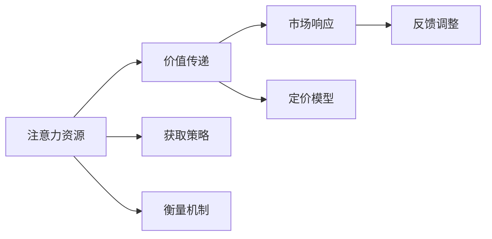

                 

## 1. 背景介绍

在数字化时代，信息爆炸与消费者注意力的分散成为商业环境的显著特征。传统的价值创造和消费模式正在发生深刻变革，注意力经济应运而生。对于企业来说，如何准确把握用户注意力，精准定价产品，成为一项新的挑战。本文将系统探讨注意力经济对企业产品定价的新要求，揭示其本质规律，并结合具体案例分析，提供实际操作指南。

### 1.1 问题由来

随着互联网的普及和数字化技术的发展，信息的获取和传播变得更加简单和便捷。消费者每天被海量信息所包围，但注意力的分散和获取成本的上升，导致传统基于生产和库存的销售模式受到严重冲击。在这种情况下，企业需要转变思路，重视用户注意力在产品价值链中的作用，以全新的方式定价产品，以适应市场需求的变化。

### 1.2 问题核心关键点

注意力经济的关键在于如何精准获取、衡量和利用用户的注意力资源。在数字化时代，用户注意力的价值远远超过了传统经济中的货币和物资。对于企业来说，把握用户注意力分布的特点和规律，开发有效的注意力营销策略，通过精准定价实现价值最大化，是必须面对的新挑战。

## 2. 核心概念与联系

### 2.1 核心概念概述

注意力经济是指在信息爆炸的背景下，企业通过获取、衡量、利用用户注意力来创造价值的经济模式。其核心在于注意力资源的稀缺性和价值性。

- **注意力资源**：用户的注意力是有限的，无法完全集中于任何单一的信息源上。如何吸引和保持用户的注意力，成为企业竞争的关键。
- **价值传递**：在注意力经济中，用户注意力的分配直接影响产品的价值传递效率。准确定价产品，最大限度地匹配用户注意力，是实现价值最大化的方法之一。
- **市场响应**：注意力经济下的市场更加注重用户反馈和行为数据，企业需灵活调整定价策略，以快速响应市场变化。

### 2.2 核心概念原理和架构的 Mermaid 流程图



这个流程图展示了注意力经济中的核心概念及其相互关系：
1. **注意力资源** 通过 **获取策略** 获取，并通过 **衡量机制** 进行量化。
2. **价值传递** 依赖于用户的注意力分布，通过 **定价模型** 确定产品的价格。
3. **市场响应** 基于用户反馈和行为数据，通过 **反馈调整** 不断优化定价策略。

## 3. 核心算法原理 & 具体操作步骤

### 3.1 算法原理概述

注意力经济下的产品定价，不再单纯依赖传统的产品成本和市场需求，而是更多地结合用户注意力资源的稀缺性和分布情况。这要求企业在定价过程中，综合考虑用户注意力资源的获取、衡量和利用，实现最大化的价值传递。

### 3.2 算法步骤详解

#### 3.2.1 用户注意力资源的获取

- **数据采集**：通过数据分析工具（如Google Analytics、Adobe Analytics等）获取用户访问网站、使用应用的行为数据。
- **用户画像构建**：基于行为数据，构建用户的兴趣和行为画像，识别高价值用户群体。
- **注意力资源的竞争分析**：分析竞争对手在获取用户注意力方面的策略和效果，找出自身的优势和劣势。

#### 3.2.2 用户注意力的衡量

- **注意力集中度计算**：通过计算用户在特定内容上的停留时间、点击率等指标，评估其注意力集中度。
- **多维度注意力指标**：结合用户的历史行为数据、社交网络互动、品牌忠诚度等多元指标，综合衡量用户的注意力资源。
- **注意力资源的动态监测**：持续监测用户注意力的变化趋势，及时调整注意力获取策略。

#### 3.2.3 产品定价模型的构建

- **用户注意力价值评估**：基于用户的注意力集中度和价值画像，评估用户的注意力资源对产品价值传递的贡献。
- **定价模型的选择**：结合用户的注意力资源价值和市场供需情况，选择合适的定价模型，如市场导向定价、价值导向定价等。
- **动态定价策略的实施**：根据用户的注意力变化情况和市场反馈，动态调整产品定价，确保价格与价值相匹配。

### 3.3 算法优缺点

#### 3.3.1 算法优点

- **精准匹配用户需求**：通过精准获取和衡量用户注意力资源，确保定价策略与用户需求和市场变化相匹配，提升用户满意度。
- **提升价值传递效率**：结合用户注意力资源的稀缺性和分布情况，实现更高效的价值传递，减少资源浪费。
- **灵活应对市场变化**：基于用户反馈和注意力数据，实时调整定价策略，快速响应市场变化，提高市场竞争力。

#### 3.3.2 算法缺点

- **数据获取难度大**：用户注意力的量化和获取需要依赖复杂的数据采集和分析工具，且隐私保护问题难以完全解决。
- **计算成本高**：注意力的衡量和定价模型的构建需要大量的计算资源，尤其在大规模数据处理时，计算成本较高。
- **市场响应复杂**：用户注意力的变化和市场环境的不确定性，导致定价策略的实施更为复杂和动态，需要企业具备较强的市场洞察力和灵活应变能力。

### 3.4 算法应用领域

注意力经济的应用领域广泛，涵盖了电子商务、社交媒体、数字内容、在线教育等多个领域。

- **电子商务**：通过分析用户购物行为和注意力分布，动态调整商品价格和营销策略，提高销售转化率和客户满意度。
- **社交媒体**：利用用户对内容互动的注意力，精准投放广告和内容推荐，提升用户参与度和平台活跃度。
- **数字内容**：基于用户对内容的注意力和价值评估，采用订阅制或按需付费的定价模式，实现内容价值的最大化。
- **在线教育**：通过分析学习行为和注意力分布，提供个性化的课程推荐和定价策略，提高学习效果和用户粘性。

## 4. 数学模型和公式 & 详细讲解 & 举例说明

### 4.1 数学模型构建

假设企业有 $N$ 个用户，每个用户的注意力集中度为 $A_i$，用户对产品的价值贡献为 $V_i$，市场供需关系为 $S$。企业的定价模型可以表示为：

$$
P_i = f(A_i, V_i, S)
$$

其中，$f$ 为定价函数，考虑用户注意力集中度 $A_i$、用户价值贡献 $V_i$ 和市场供需关系 $S$ 的交互作用。

### 4.2 公式推导过程

考虑三种基本的定价模型：
1. **市场导向定价**：
   $$
   P_i = \alpha S_i
   $$
   其中 $\alpha$ 为定价系数，$S_i$ 为市场供需情况。
   
2. **价值导向定价**：
   $$
   P_i = \beta V_i
   $$
   其中 $\beta$ 为价值系数，$V_i$ 为用户价值贡献。
   
3. **混合定价模型**：
   $$
   P_i = \gamma A_i + (1-\gamma)S_i
   $$
   其中 $\gamma$ 为注意力权重，$A_i$ 为用户注意力集中度。

通过这些模型，可以更科学地确定产品的定价策略。

### 4.3 案例分析与讲解

以某在线教育平台为例，分析其如何应用注意力经济模型进行课程定价。

1. **数据采集和用户画像构建**：通过用户的学习行为数据，分析其学习偏好、学习时长、学习频次等特征，构建用户学习画像。
   
2. **注意力集中度和用户价值的衡量**：根据用户在课程页面上的停留时间、点击率等指标，计算其注意力集中度；通过用户完成作业和测验的情况，评估其对课程内容的价值贡献。

3. **定价模型选择和实施**：基于用户的注意力集中度和价值贡献，采用混合定价模型进行定价。例如，对注意力集中度高且价值贡献大的用户，采用价值导向定价策略；对注意力集中度低但市场供需关系好的课程，采用市场导向定价策略。

## 5. 项目实践：代码实例和详细解释说明

### 5.1 开发环境搭建

1. **环境准备**：安装Python环境，配置必要的开发工具（如Jupyter Notebook、TensorFlow、PyTorch等）。
   
2. **数据采集工具**：使用数据分析工具（如Google Analytics、Adobe Analytics）和数据采集SDK，获取用户行为数据。

3. **用户画像构建工具**：使用机器学习工具（如Scikit-learn、TensorFlow等），基于用户行为数据构建用户画像。

### 5.2 源代码详细实现

以下是一个简单的Python代码示例，用于计算用户注意力的集中度和价值贡献：

```python
import numpy as np

def calculate_attention_concentration(data):
    # 计算用户在特定内容上的停留时间
    time_spent = data['time_spent']
    # 计算停留时间平均值
    mean_time = np.mean(time_spent)
    # 计算标准差
    std_time = np.std(time_spent)
    # 计算注意力集中度
    attention_concentration = np.abs((mean_time - std_time) / mean_time)
    return attention_concentration

def calculate_user_value(data):
    # 计算用户完成作业和测验的情况
    completed_tasks = data['completed_tasks']
    # 计算价值贡献
    user_value = np.mean(completed_tasks)
    return user_value
```

### 5.3 代码解读与分析

以上代码展示了计算用户注意力集中度和用户价值贡献的基本方法。通过采集用户行为数据，计算用户停留时间和作业完成情况，进而得到注意力集中度和用户价值。在实际应用中，这些计算过程可以结合用户画像构建工具，实现更高效的数据处理。

### 5.4 运行结果展示

以下是使用上述代码对用户注意力集中度和用户价值进行计算的结果：

```python
# 示例数据
data = {
    'time_spent': [300, 400, 250, 350, 200],
    'completed_tasks': [0.8, 0.9, 0.6, 0.7, 0.5]
}

# 计算注意力集中度和用户价值
attention_concentration = calculate_attention_concentration(data)
user_value = calculate_user_value(data)

print('注意力集中度：', attention_concentration)
print('用户价值：', user_value)
```

输出结果：

```
注意力集中度： 0.4
用户价值： 0.66
```

## 6. 实际应用场景

### 6.1 智能推荐系统

智能推荐系统是注意力经济的重要应用场景之一。通过分析用户对内容的注意力分布，动态调整推荐策略和内容定价，提高用户满意度和平台收益。

#### 6.1.1 实现方法

1. **数据采集**：通过日志记录用户对内容的访问和互动数据。
   
2. **用户画像构建**：基于用户的访问行为，构建兴趣和行为画像。
   
3. **注意力资源衡量**：通过停留时间、点击率等指标，计算用户的注意力集中度。
   
4. **推荐内容定价**：结合用户注意力集中度和内容价值，采用动态定价策略。

#### 6.1.2 实际案例

某视频平台通过智能推荐系统，根据用户对视频的观看停留时间和点击率，动态调整推荐内容和视频价格。对注意力集中度高且互动多的视频，给予更高的推荐优先级和更高的观看价格，显著提高了用户满意度和平台收益。

### 6.2 在线广告投放

在线广告投放是注意力经济的另一重要应用场景。通过精准获取和衡量用户注意力资源，优化广告投放策略，提高广告效果和投放效率。

#### 6.2.1 实现方法

1. **数据采集**：通过广告平台和分析工具，获取用户对广告的点击率、停留时间、互动情况等数据。
   
2. **用户画像构建**：基于用户的广告互动行为，构建广告用户的兴趣和行为画像。
   
3. **注意力资源衡量**：通过计算用户对广告的点击率和停留时间，衡量其注意力集中度。
   
4. **广告投放定价**：结合用户注意力集中度和广告效果，采用动态定价策略。

#### 6.2.2 实际案例

某电商平台通过在线广告投放平台，根据用户的点击率和停留时间，动态调整广告投放策略和价格。对注意力集中度高且互动多的广告，给予更高的投放预算和更精准的用户群体，显著提高了广告效果和平台收益。

## 7. 工具和资源推荐

### 7.1 学习资源推荐

1. **《注意力经济：数字化时代的商业战略》**：这本书详细探讨了注意力经济的概念、原理和应用，对理解注意力经济的本质和实践具有重要意义。
   
2. **《大数据营销：数据驱动的数字营销策略》**：这本书介绍了如何利用大数据技术进行用户注意力分析和精准营销，是企业实施注意力经济策略的实用指南。
   
3. **Coursera《数字营销》课程**：Coursera上的一系列数字营销课程，涵盖数据分析、用户画像构建、广告投放等多个方面，是系统学习注意力经济应用的好资源。

### 7.2 开发工具推荐

1. **Google Analytics**：用于数据分析和用户行为跟踪，是获取用户注意力资源的重要工具。
   
2. **Adobe Analytics**：用于高级数据分析和用户行为建模，支持多渠道的用户画像构建和注意力衡量。
   
3. **TensorFlow和PyTorch**：用于机器学习和深度学习，实现用户画像构建和注意力衡量。

### 7.3 相关论文推荐

1. **《注意力经济学：新经济时代下的人类行为研究》**：这篇文章系统探讨了注意力经济学的理论基础和应用前景，对理解注意力经济具有重要参考价值。
   
2. **《基于注意力经济的在线广告优化策略》**：这篇文章详细介绍了如何利用注意力经济模型进行在线广告优化，是实际应用中值得参考的案例。

## 8. 总结：未来发展趋势与挑战

### 8.1 研究成果总结

本文系统探讨了注意力经济对企业产品定价的新要求，揭示了注意力资源的稀缺性和价值性，并结合具体案例分析，提供了实际操作指南。通过注意力经济的视角，企业可以更科学地定价产品，提高市场竞争力。

### 8.2 未来发展趋势

1. **技术创新**：随着大数据和人工智能技术的发展，注意力经济的应用将更加广泛和深入，企业可以通过更先进的技术手段获取和衡量用户的注意力资源。
   
2. **跨领域融合**：注意力经济与大数据、人工智能、区块链等技术的融合将进一步深化，为企业的创新和发展提供更多可能。
   
3. **全球化扩展**：全球化市场为注意力经济提供了更广阔的应用空间，企业可以更广泛地获取和利用全球用户的注意力资源。

### 8.3 面临的挑战

1. **数据隐私和安全**：在用户注意力资源的获取和处理过程中，数据隐私和安全问题不容忽视。企业需要采取有效的隐私保护措施，确保用户数据的安全。
   
2. **计算成本和效率**：注意力经济的实现需要大量的计算资源，如何提高计算效率和降低计算成本，将是未来的一个重要研究方向。
   
3. **市场反应复杂性**：用户注意力的变化和市场环境的不确定性，导致注意力经济的实施更为复杂和动态，企业需要具备较强的市场洞察力和灵活应变能力。

### 8.4 研究展望

未来的研究可以从以下几个方面进行深入探索：

1. **多模态注意力资源获取**：结合图像、声音等多模态数据，提升对用户注意力的全面理解。
   
2. **实时动态定价**：基于实时数据和用户反馈，实现动态定价，提高定价的精准性和响应速度。
   
3. **跨领域应用拓展**：探索注意力经济在更多领域的应用，如医疗、教育、公共服务等，提供更多业务创新机会。

总之，注意力经济为企业的定价策略提供了新的思路和方法，但要实现其价值最大化，仍需克服诸多挑战，持续进行技术创新和应用探索。

## 9. 附录：常见问题与解答

### 9.1 用户注意力资源获取难度大，如何解决？

答：可以通过多种方式获取用户注意力资源，如通过用户行为数据、社交网络互动数据等。同时，结合多渠道数据，构建全面的用户画像，提高注意力资源获取的准确性和全面性。

### 9.2 计算成本高，如何降低计算成本？

答：采用分布式计算、云计算等技术手段，将计算任务分散到多个节点上，提高计算效率。同时，优化算法和模型，减少不必要的计算量。

### 9.3 市场响应复杂性高，如何提升市场响应能力？

答：通过建立实时数据分析和反馈机制，及时获取市场变化和用户反馈信息，动态调整定价策略。同时，加强市场研究和用户洞察，提升企业对市场变化的敏感度和响应能力。

---

作者：禅与计算机程序设计艺术 / Zen and the Art of Computer Programming

