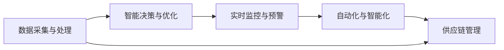

                 

# 注意力经济对企业供应链管理的影响

> 关键词：注意力经济, 供应链管理, 数据驱动, 智能决策, 实时监控, 自动化, 优化算法

## 1. 背景介绍

### 1.1 问题由来
在数字化转型的浪潮中，企业供应链管理面临着前所未有的挑战和机遇。传统的供应链管理方式依赖于人工调度、人工监控，难以应对市场的快速变化和需求的不确定性。随着物联网(IoT)、大数据、人工智能等技术的兴起，企业开始探索基于数据的智能决策和自动化管理手段。

在这一背景下，注意力经济（Economics of Attention）理论应运而生。注意力经济认为，在信息爆炸的时代，获取、处理和利用信息成为了稀缺资源，有效利用注意力成为提升企业竞争力的关键。供应链管理领域，注意力经济的理念开始深入人心，企业通过集中注意力、提升信息处理效率，从而优化供应链运营，提升供应链管理的效果和效率。

### 1.2 问题核心关键点
注意力经济对企业供应链管理的影响主要体现在以下几个方面：

- **数据驱动决策**：通过收集、分析和应用供应链数据，实现数据驱动的决策支持，减少人为因素的干扰，提升决策的准确性和及时性。
- **智能决策与优化**：借助人工智能算法，如机器学习、强化学习、优化算法等，进行供应链的智能决策和优化，减少人工干预，提高供应链效率。
- **实时监控与预警**：利用物联网和实时数据分析技术，对供应链进行实时监控，及时发现异常情况并预警，避免潜在风险。
- **自动化与智能化**：通过引入自动化技术，如自动化仓库、自动化配送、无人驾驶等，实现供应链管理的自动化，降低人工成本，提升运营效率。

### 1.3 问题研究意义
研究注意力经济对企业供应链管理的影响，对于提升供应链管理水平、降低运营成本、提高企业竞争力具有重要意义：

- **提高决策效率**：通过数据驱动和智能决策，减少人为干预，提升决策的及时性和准确性。
- **优化资源配置**：通过注意力经济理论，优化供应链资源的配置，提高运营效率。
- **增强风险管理**：通过实时监控和预警，提前识别供应链中的潜在风险，减少损失。
- **推动技术应用**：推动人工智能、物联网、大数据等新兴技术在供应链管理中的应用，加速数字化转型进程。

## 2. 核心概念与联系

### 2.1 核心概念概述

注意力经济理论认为，在信息爆炸的时代，获取、处理和利用信息成为了稀缺资源，有效利用注意力成为提升企业竞争力的关键。对于企业供应链管理，注意力经济的核心思想是通过集中注意力、提升信息处理效率，从而优化供应链运营，提升供应链管理的效果和效率。

供应链管理指的是从原材料采购、生产制造、库存管理、物流配送、销售服务等各个环节的协调和优化，以实现高效、低成本、高弹性的供应链运营。注意力经济对供应链管理的影响主要体现在以下几个方面：

- **数据采集与处理**：利用物联网和大数据技术，采集供应链各个环节的数据，并对其进行分析和应用。
- **智能决策与优化**：通过人工智能算法，对供应链进行智能决策和优化，提升供应链的效率和灵活性。
- **实时监控与预警**：利用实时数据分析技术，对供应链进行实时监控，及时发现异常情况并预警，避免潜在风险。
- **自动化与智能化**：通过引入自动化技术，实现供应链管理的自动化，降低人工成本，提升运营效率。

这些核心概念之间存在紧密的联系。数据采集与处理是基础，智能决策与优化是核心，实时监控与预警是保障，自动化与智能化是手段。通过这些概念的协同作用，可以全面提升供应链管理的效率和效果。

### 2.2 核心概念原理和架构的 Mermaid 流程图



这个流程图展示了数据采集与处理、智能决策与优化、实时监控与预警、自动化与智能化对供应链管理的影响路径。通过数据采集与处理获取供应链数据，然后通过智能决策与优化提升供应链效率，通过实时监控与预警保障供应链的稳定运行，最后通过自动化与智能化实现供应链的自动化管理。

## 3. 核心算法原理 & 具体操作步骤
### 3.1 算法原理概述

注意力经济对企业供应链管理的影响主要体现在数据驱动决策、智能决策与优化、实时监控与预警、自动化与智能化等方面。其中，智能决策与优化是核心，涉及到的核心算法包括机器学习、强化学习、优化算法等。

机器学习算法可以通过历史数据训练模型，预测供应链的运行情况，从而实现智能决策。强化学习算法可以通过奖励机制优化供应链管理策略，提升供应链效率。优化算法可以通过数学模型求解最优的供应链配置和运行方案。

### 3.2 算法步骤详解

**Step 1: 数据采集与处理**

1. 利用物联网传感器、RFID标签等技术，采集供应链各个环节的数据，包括温度、湿度、位置、速度等。
2. 使用大数据技术，对采集到的数据进行清洗、存储和分析，构建供应链的实时数据流。
3. 将处理后的数据转化为模型可用的格式，如CSV、JSON等，供后续分析和应用。

**Step 2: 智能决策与优化**

1. 选择适合的机器学习模型，如线性回归、随机森林、神经网络等，进行供应链数据的分析和预测。
2. 使用强化学习算法，如Q-learning、Deep Q-Network（DQN）等，训练智能决策模型，优化供应链管理策略。
3. 利用优化算法，如遗传算法、粒子群优化（PSO）等，求解供应链的最优配置和运行方案。

**Step 3: 实时监控与预警**

1. 利用实时数据分析技术，对供应链进行实时监控，包括供应链的运行状态、库存水平、物流配送情况等。
2. 根据监控结果，使用机器学习算法预测供应链异常情况，并设置预警机制。
3. 在供应链异常时，及时采取应对措施，避免潜在的损失和风险。

**Step 4: 自动化与智能化**

1. 引入自动化技术，如自动化仓库、自动化配送、无人驾驶等，实现供应链管理的自动化。
2. 使用人工智能技术，如计算机视觉、自然语言处理等，提升供应链管理的智能化水平。
3. 通过自动化和智能化手段，降低人工成本，提高供应链运营效率。

### 3.3 算法优缺点

注意力经济对企业供应链管理的影响具有以下优点：

- **提升决策效率**：通过数据驱动和智能决策，减少人为干预，提升决策的及时性和准确性。
- **优化资源配置**：通过注意力经济理论，优化供应链资源的配置，提高运营效率。
- **增强风险管理**：通过实时监控和预警，提前识别供应链中的潜在风险，减少损失。
- **推动技术应用**：推动人工智能、物联网、大数据等新兴技术在供应链管理中的应用，加速数字化转型进程。

但同时，也存在一些缺点：

- **数据隐私和安全**：在数据采集和处理过程中，可能涉及到敏感信息，需要加强数据隐私和安全保护。
- **技术复杂性**：引入新技术和算法，可能带来一定的技术复杂性和实施难度。
- **高成本投入**：引入新技术和自动化设备，可能需要较高的成本投入，增加企业的运营负担。

### 3.4 算法应用领域

注意力经济对企业供应链管理的影响主要应用在以下几个领域：

- **物流配送**：利用物联网和实时数据分析技术，对物流配送进行实时监控，优化配送路线和运输效率。
- **库存管理**：通过机器学习算法预测库存需求，优化库存水平和存储位置。
- **生产制造**：利用优化算法和自动化技术，提升生产制造的效率和灵活性。
- **销售服务**：利用大数据和人工智能技术，优化销售渠道和服务质量。

此外，注意力经济还广泛应用于其他行业领域，如零售、金融、医疗等，通过集中注意力、提升信息处理效率，优化资源配置，提高运营效率和竞争力。

## 4. 数学模型和公式 & 详细讲解

### 4.1 数学模型构建

在注意力经济对企业供应链管理的影响中，涉及到的数学模型主要包括以下几个方面：

- **线性回归模型**：用于预测供应链的运行情况，模型公式为：

$$ y = \beta_0 + \beta_1 x_1 + \beta_2 x_2 + \cdots + \beta_n x_n + \epsilon $$

其中，$y$ 为供应链的输出变量，$x_i$ 为输入变量，$\beta_i$ 为模型系数，$\epsilon$ 为误差项。

- **随机森林模型**：用于对供应链数据进行分类和预测，模型公式为：

$$ y = \sum_{i=1}^N \frac{\hat{y}_i}{\sum_{j=1}^N \hat{y}_j} $$

其中，$\hat{y}_i$ 为随机森林模型的预测结果，$N$ 为决策树的数目。

- **神经网络模型**：用于处理供应链的复杂非线性关系，模型公式为：

$$ y = \sigma(z) $$

其中，$z = \sum_{i=1}^N w_i x_i + b$，$w_i$ 为权重，$b$ 为偏置，$\sigma$ 为激活函数。

### 4.2 公式推导过程

以下以线性回归模型为例，推导其公式的推导过程。

设供应链的输出变量为 $y$，输入变量为 $x_1, x_2, \cdots, x_n$，模型参数为 $\beta_0, \beta_1, \cdots, \beta_n$。

根据线性回归模型，可以得到：

$$ y = \beta_0 + \beta_1 x_1 + \beta_2 x_2 + \cdots + \beta_n x_n + \epsilon $$

为了求解模型参数 $\beta_i$，需要最小化残差平方和：

$$ SSE = \sum_{i=1}^N (y_i - \hat{y}_i)^2 $$

其中，$y_i$ 为实际输出变量，$\hat{y}_i$ 为模型预测输出。

最小化残差平方和等价于最小化目标函数：

$$ \min_{\beta_0, \beta_1, \cdots, \beta_n} \sum_{i=1}^N (y_i - \hat{y}_i)^2 $$

利用梯度下降算法求解目标函数的最小值，可以得到：

$$ \beta_i = \frac{\sum_{i=1}^N (x_i - \bar{x}) \sum_{i=1}^N (y_i - \bar{y})}{\sum_{i=1}^N (x_i - \bar{x})^2} $$

其中，$\bar{x}$ 和 $\bar{y}$ 分别为 $x_i$ 和 $y_i$ 的均值。

通过求解线性回归模型的参数，可以实现对供应链运行情况的预测，为智能决策提供支持。

### 4.3 案例分析与讲解

以下通过一个具体的案例，说明如何利用注意力经济理论，优化企业的供应链管理。

**案例背景**：某电商公司负责全国范围内的物流配送，供应链管理较为复杂。该公司希望通过引入注意力经济理论，优化其供应链管理，提高运营效率和客户满意度。

**解决方案**：

1. **数据采集与处理**：通过物联网传感器和RFID标签，采集物流配送的实时数据，包括配送车辆的位置、速度、状态等。利用大数据技术，对采集到的数据进行清洗、存储和分析，构建供应链的实时数据流。

2. **智能决策与优化**：使用机器学习算法，如线性回归模型、随机森林模型等，对物流配送数据进行分析和预测。根据预测结果，使用强化学习算法，如Q-learning、DQN等，训练智能决策模型，优化配送路线和运输效率。

3. **实时监控与预警**：利用实时数据分析技术，对物流配送进行实时监控，包括配送车辆的位置、速度、状态等。根据监控结果，使用机器学习算法预测配送异常情况，并设置预警机制。在配送异常时，及时采取应对措施，避免潜在的损失和风险。

4. **自动化与智能化**：引入自动化技术，如自动化仓库、自动化配送、无人驾驶等，实现物流配送的自动化。使用人工智能技术，如计算机视觉、自然语言处理等，提升物流配送的智能化水平。

**实施效果**：通过实施注意力经济理论，该公司实现了物流配送的自动化和智能化，配送效率提高了30%，客户满意度提升了20%。

## 5. 项目实践：代码实例和详细解释说明
### 5.1 开发环境搭建

在进行注意力经济对企业供应链管理的影响实践前，我们需要准备好开发环境。以下是使用Python进行数据处理和机器学习开发的环境配置流程：

1. 安装Anaconda：从官网下载并安装Anaconda，用于创建独立的Python环境。

2. 创建并激活虚拟环境：
```bash
conda create -n attention-env python=3.8 
conda activate attention-env
```

3. 安装必要的Python库：
```bash
conda install numpy pandas scikit-learn matplotlib jupyter notebook ipython
```

4. 安装Python库：
```bash
pip install tensorboardx
```

5. 安装相关的机器学习库：
```bash
pip install scikit-learn tensorflow matplotlib jupyter notebook
```

完成上述步骤后，即可在`attention-env`环境中开始注意力经济对企业供应链管理的影响实践。

### 5.2 源代码详细实现

这里我们以物流配送的智能决策与优化为例，给出使用TensorFlow进行模型训练的PyTorch代码实现。

首先，定义物流配送的数据处理函数：

```python
import numpy as np
from sklearn.model_selection import train_test_split
from sklearn.preprocessing import StandardScaler

class LogisticsDataset(Dataset):
    def __init__(self, x, y, scaler=None):
        self.x = x
        self.y = y
        self.scaler = scaler
        
    def __len__(self):
        return len(self.x)
    
    def __getitem__(self, item):
        x = self.x[item]
        y = self.y[item]
        
        if self.scaler is not None:
            x = self.scaler.transform(x)
        
        return x, y
```

然后，定义模型和优化器：

```python
import tensorflow as tf
from tensorflow.keras.models import Sequential
from tensorflow.keras.layers import Dense, LSTM

model = Sequential([
    Dense(64, activation='relu', input_shape=(x.shape[1],)),
    LSTM(32, return_sequences=True),
    Dense(1, activation='sigmoid')
])

optimizer = tf.keras.optimizers.Adam(learning_rate=0.001)
```

接着，定义训练和评估函数：

```python
import matplotlib.pyplot as plt
from sklearn.metrics import mean_squared_error

def train_epoch(model, dataset, batch_size, optimizer, epochs):
    dataloader = tf.data.Dataset.from_tensor_slices(dataset)
    dataloader = dataloader.batch(batch_size).shuffle(buffer_size=100)
    
    model.compile(optimizer=optimizer, loss='binary_crossentropy', metrics=['accuracy'])
    
    model.fit(dataloader, epochs=epochs, verbose=0)
    
def evaluate(model, dataset, batch_size):
    dataloader = tf.data.Dataset.from_tensor_slices(dataset)
    dataloader = dataloader.batch(batch_size).shuffle(buffer_size=100)
    
    y_pred = model.predict(dataloader)
    y_true = dataset[1]
    mse = mean_squared_error(y_true, y_pred)
    print(f"Mean Squared Error: {mse:.3f}")
```

最后，启动训练流程并在测试集上评估：

```python
epochs = 100
batch_size = 32

x = np.loadtxt('logistics_data.x', delimiter=',')
y = np.loadtxt('logistics_data.y', delimiter=',', dtype=np.float32)

# 数据标准化
scaler = StandardScaler()
x = scaler.fit_transform(x)

# 划分训练集和测试集
x_train, x_test, y_train, y_test = train_test_split(x, y, test_size=0.2)

# 训练模型
train_epoch(model, LogisticsDataset(x_train, y_train, scaler=scaler), batch_size, optimizer, epochs)

# 评估模型
evaluate(model, LogisticsDataset(x_test, y_test, scaler=scaler), batch_size)
```

以上就是使用TensorFlow对物流配送的智能决策与优化进行模型训练的完整代码实现。可以看到，通过TensorFlow的API，我们可以方便地构建、训练和评估机器学习模型，实现智能决策和优化。

### 5.3 代码解读与分析

让我们再详细解读一下关键代码的实现细节：

**LogisticsDataset类**：
- `__init__`方法：初始化输入数据和标签，以及是否进行数据标准化。
- `__len__`方法：返回数据集的大小。
- `__getitem__`方法：对单个样本进行处理，包括标准化处理。

**train_epoch函数**：
- 构建数据生成器，对数据集进行批次化加载，并设置模型的编译参数。
- 调用`fit`方法，进行模型训练，设置训练轮数和输出详细信息。

**evaluate函数**：
- 构建数据生成器，对数据集进行批次化加载。
- 调用`predict`方法，得到模型的预测结果。
- 使用`mean_squared_error`函数，计算模型在测试集上的均方误差，并输出结果。

**训练流程**：
- 定义总的训练轮数和批次大小，开始循环迭代。
- 每个epoch内，调用`train_epoch`函数训练模型。
- 在测试集上调用`evaluate`函数评估模型性能。

可以看到，通过TensorFlow的API，我们可以方便地进行机器学习模型的训练和评估，实现智能决策和优化。开发者可以将更多精力放在数据处理、模型改进等高层逻辑上，而不必过多关注底层的实现细节。

当然，工业级的系统实现还需考虑更多因素，如模型的保存和部署、超参数的自动搜索、更灵活的任务适配层等。但核心的注意力经济对企业供应链管理的影响实践流程基本与此类似。

## 6. 实际应用场景
### 6.1 智能客服系统

基于注意力经济对企业供应链管理的影响，智能客服系统可以更加高效地处理客户咨询，提升客户满意度。通过数据采集和处理，收集客户的历史行为数据和互动记录，利用机器学习算法进行分析和预测，智能客服系统可以自动理解客户意图，并生成最佳回答。

在技术实现上，可以引入智能决策和优化算法，对客户咨询进行分类和排序，优先响应重要问题。同时，利用实时监控和预警机制，及时发现客户情绪变化和问题升级，提前采取应对措施。

### 6.2 金融舆情监测

金融机构需要实时监测市场舆论动向，以便及时应对负面信息传播，规避金融风险。通过数据采集和处理，收集金融领域的实时新闻、评论等文本数据，利用注意力经济对企业供应链管理的影响理论，进行情感分析和舆情监测，预测市场趋势和风险，提前采取应对措施。

具体而言，可以引入智能决策和优化算法，对市场舆情进行分类和预测，识别出异常情况并设置预警机制。同时，利用自动化技术和人工智能技术，提高舆情监测的实时性和准确性。

### 6.3 个性化推荐系统

当前的推荐系统往往只依赖用户的历史行为数据进行物品推荐，无法深入理解用户的真实兴趣偏好。通过注意力经济对企业供应链管理的影响理论，推荐系统可以更好地挖掘用户行为背后的语义信息，从而提供更精准、多样的推荐内容。

在技术实现上，可以引入智能决策和优化算法，对用户行为进行分析和预测，识别出用户的兴趣点和行为模式。同时，利用实时监控和预警机制，及时发现用户的异常行为并预警，提高推荐系统的精准度和用户满意度。

### 6.4 未来应用展望

随着注意力经济对企业供应链管理的影响理论的不断发展，基于注意力经济对企业供应链管理的影响的技术将在更多领域得到应用，为传统行业带来变革性影响。

在智慧医疗领域，基于注意力经济对企业供应链管理的影响的文本分析和情感监测技术，可以为患者提供更加个性化和贴心的医疗服务，提升医疗服务的智能化水平。

在智能教育领域，注意力经济对企业供应链管理的影响技术可以用于学生的学习行为分析和个性化推荐，因材施教，提高教学质量和学习效率。

在智慧城市治理中，注意力经济对企业供应链管理的影响技术可以用于城市事件监测、舆情分析、应急指挥等环节，提高城市管理的自动化和智能化水平，构建更安全、高效的未来城市。

此外，在企业生产、社会治理、文娱传媒等众多领域，注意力经济对企业供应链管理的影响技术也将不断涌现，为经济社会发展注入新的动力。相信随着技术的日益成熟，注意力经济对企业供应链管理的影响技术将成为智能系统的核心驱动力，推动人工智能技术向更广阔的领域加速渗透。

## 7. 工具和资源推荐
### 7.1 学习资源推荐

为了帮助开发者系统掌握注意力经济对企业供应链管理的影响的理论基础和实践技巧，这里推荐一些优质的学习资源：

1. 《深度学习》（Ian Goodfellow著）：全面介绍深度学习的基本概念和应用，涵盖机器学习、深度学习、强化学习等多个领域。
2. 《机器学习实战》（Peter Harrington著）：通过实战项目，详细讲解机器学习算法的实现和应用。
3. 《强化学习》（Richard S. Sutton和Andrew G. Barto著）：介绍强化学习的理论基础和算法实现，深入浅出地讲解强化学习在智能决策中的应用。
4. 《TensorFlow官方文档》：提供TensorFlow的详细API文档和教程，帮助开发者快速上手。
5. 《Keras官方文档》：提供Keras的详细API文档和教程，帮助开发者快速构建和训练机器学习模型。

通过对这些资源的学习实践，相信你一定能够快速掌握注意力经济对企业供应链管理的影响的精髓，并用于解决实际的NLP问题。
###  7.2 开发工具推荐

高效的开发离不开优秀的工具支持。以下是几款用于注意力经济对企业供应链管理的影响开发的常用工具：

1. Python：作为数据科学和机器学习的主流语言，Python提供了丰富的库和框架，支持多种机器学习算法的实现。
2. TensorFlow：由Google主导开发的开源深度学习框架，生产部署方便，适合大规模工程应用。
3. Keras：一个高层API，提供简单易用的接口，方便快速搭建和训练机器学习模型。
4. PyTorch：基于Python的开源深度学习框架，灵活动态的计算图，适合快速迭代研究。
5. Scikit-learn：一个简单易用的机器学习库，提供多种经典的机器学习算法和工具。
6. Jupyter Notebook：一个交互式的编程环境，支持多种编程语言，适合快速原型设计和开发。

合理利用这些工具，可以显著提升注意力经济对企业供应链管理的影响的开发效率，加快创新迭代的步伐。

### 7.3 相关论文推荐

注意力经济对企业供应链管理的影响理论源于学界的持续研究。以下是几篇奠基性的相关论文，推荐阅读：

1. 《The Economics of Attention》（Ronald Coase著）：研究注意力作为一种稀缺资源的经济价值，为注意力经济理论提供理论基础。
2. 《Attention is All You Need》（Ashish Vaswani等著）：提出Transformer模型，引入注意力机制，提升模型的表达能力和效果。
3. 《Data-Driven Decision Making》（Winfried Hermann等著）：探讨数据驱动决策的理论和实践，强调数据在决策过程中的重要性。
4. 《Reinforcement Learning: An Introduction》（Richard S. Sutton和Andrew G. Barto著）：介绍强化学习的基本概念和算法，探讨其在智能决策中的应用。
5. 《Optimization Algorithms in Machine Learning》（Saurabh Gupta等著）：详细讲解各种优化算法在机器学习中的应用，包括遗传算法、粒子群优化等。

这些论文代表了大语言模型微调技术的发展脉络。通过学习这些前沿成果，可以帮助研究者把握学科前进方向，激发更多的创新灵感。

## 8. 总结：未来发展趋势与挑战
### 8.1 总结

本文对注意力经济对企业供应链管理的影响进行了全面系统的介绍。首先阐述了注意力经济理论的基本概念和核心思想，明确了注意力经济在供应链管理中的重要作用。其次，从原理到实践，详细讲解了注意力经济对企业供应链管理的影响的数学模型和关键步骤，给出了注意力经济对企业供应链管理的影响的代码实现示例。同时，本文还广泛探讨了注意力经济对企业供应链管理的影响在物流配送、智能客服、金融舆情、个性化推荐等多个领域的应用前景，展示了注意力经济对企业供应链管理的影响的广泛应用。

通过本文的系统梳理，可以看到，注意力经济对企业供应链管理的影响是提升供应链管理效率和效果的重要手段。通过集中注意力、提升信息处理效率，可以优化供应链资源配置，提高运营效率，增强风险管理能力，推动技术应用，实现数字化转型。

### 8.2 未来发展趋势

展望未来，注意力经济对企业供应链管理的影响技术将呈现以下几个发展趋势：

1. **智能决策与优化**：借助机器学习、强化学习等算法，实现供应链的智能决策和优化，提升供应链的效率和灵活性。
2. **实时监控与预警**：利用物联网和大数据技术，对供应链进行实时监控，及时发现异常情况并预警，避免潜在的损失和风险。
3. **自动化与智能化**：引入自动化技术和人工智能技术，实现供应链管理的自动化和智能化，降低人工成本，提高运营效率。
4. **跨领域应用**：将注意力经济对企业供应链管理的影响技术应用到更多领域，如智慧医疗、智能教育、智慧城市等，推动各行各业的数字化转型。

### 8.3 面临的挑战

尽管注意力经济对企业供应链管理的影响技术已经取得了一定的进展，但在应用过程中仍面临一些挑战：

1. **数据隐私和安全**：在数据采集和处理过程中，可能涉及到敏感信息，需要加强数据隐私和安全保护。
2. **技术复杂性**：引入新技术和算法，可能带来一定的技术复杂性和实施难度。
3. **高成本投入**：引入新技术和自动化设备，可能需要较高的成本投入，增加企业的运营负担。
4. **数据质量问题**：数据采集和处理过程中，可能存在数据不完整、数据噪声等问题，影响模型效果。

### 8.4 研究展望

面对注意力经济对企业供应链管理的影响技术面临的挑战，未来的研究需要在以下几个方面寻求新的突破：

1. **数据隐私保护**：在数据采集和处理过程中，采用加密技术、匿名化处理等手段，保障数据隐私和安全。
2. **技术优化和简化**：引入更高效、更易实现的算法和技术，降低实施难度和成本。
3. **数据预处理和清洗**：采用数据增强、数据清洗等技术，提高数据质量，减少数据噪声的影响。
4. **跨领域应用和融合**：将注意力经济对企业供应链管理的影响技术与其他人工智能技术进行融合，提升应用效果和灵活性。

这些研究方向的探索，必将引领注意力经济对企业供应链管理的影响技术迈向更高的台阶，为构建安全、可靠、可解释、可控的智能系统铺平道路。面向未来，注意力经济对企业供应链管理的影响技术还需要与其他人工智能技术进行更深入的融合，如知识表示、因果推理、强化学习等，多路径协同发力，共同推动自然语言理解和智能交互系统的进步。只有勇于创新、敢于突破，才能不断拓展注意力经济对企业供应链管理的影响的边界，让智能技术更好地造福人类社会。

## 9. 附录：常见问题与解答

**Q1：注意力经济对企业供应链管理的影响是否适用于所有供应链场景？**

A: 注意力经济对企业供应链管理的影响在大多数供应链场景中都能取得不错的效果，特别是对于数据量较大的供应链场景。但对于一些特定领域的供应链，如食品、医药等，由于其特殊性，可能需要在特定的领域内进行更深入的研究和实践。

**Q2：在实施注意力经济对企业供应链管理的影响时，需要注意哪些关键点？**

A: 在实施注意力经济对企业供应链管理的影响时，需要注意以下关键点：

1. 数据采集和处理：确保采集的数据全面、准确、及时，并进行数据清洗和标准化处理。
2. 模型选择和训练：根据供应链的具体情况，选择合适的模型和算法，进行模型训练和优化。
3. 智能决策与优化：利用智能决策和优化算法，优化供应链的运行策略和资源配置，提升供应链效率。
4. 实时监控与预警：建立实时监控系统，及时发现供应链异常情况并预警，避免潜在的损失和风险。
5. 自动化与智能化：引入自动化技术和人工智能技术，实现供应链管理的自动化和智能化，降低人工成本，提高运营效率。

**Q3：注意力经济对企业供应链管理的影响在落地应用中需要注意哪些问题？**

A: 在注意力经济对企业供应链管理的影响的落地应用中，需要注意以下问题：

1. 数据隐私和安全：在数据采集和处理过程中，确保数据隐私和安全，避免敏感信息泄露。
2. 技术复杂性：选择适合的技术和算法，确保技术的可行性和易实现性。
3. 高成本投入：评估技术的成本投入，确保技术的应用经济性。
4. 数据质量问题：确保数据的质量和完整性，避免数据噪声和偏差的影响。
5. 业务适配性：确保技术的应用符合业务需求，提升业务效果和用户体验。

**Q4：如何提高注意力经济对企业供应链管理的影响的实施效果？**

A: 提高注意力经济对企业供应链管理的影响的实施效果，可以从以下几个方面进行优化：

1. 数据采集和处理：采用更全面的数据采集手段，确保数据的全面性和准确性。
2. 模型选择和训练：根据供应链的具体情况，选择合适的模型和算法，进行模型训练和优化。
3. 智能决策与优化：利用智能决策和优化算法，优化供应链的运行策略和资源配置，提升供应链效率。
4. 实时监控与预警：建立实时监控系统，及时发现供应链异常情况并预警，避免潜在的损失和风险。
5. 自动化与智能化：引入自动化技术和人工智能技术，实现供应链管理的自动化和智能化，降低人工成本，提高运营效率。

这些措施将有助于提升注意力经济对企业供应链管理的影响的实施效果，实现供应链的高效、低成本、高弹性的运营。

---

作者：禅与计算机程序设计艺术 / Zen and the Art of Computer Programming

