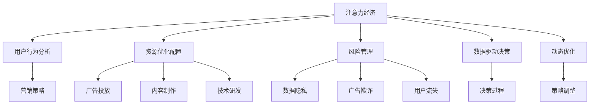

                 

## 1. 背景介绍

### 1.1 问题由来

随着互联网技术的飞速发展，数字经济逐步成为推动经济增长的重要引擎。其中，注意力作为一种稀缺资源，在数字时代变得越来越重要。企业通过各种方式争夺用户的注意力，以实现商业目标。在传统经济中，资本和劳动是重要的生产要素，而在数字经济中，注意力则成为了一种新的资本形式。

企业如何合理配置和利用注意力资源，制定科学的决策策略，成为了数字经济时代的重要课题。如何通过技术手段，分析注意力数据，为企业的决策提供支撑，是一个值得深入研究的问题。

### 1.2 问题核心关键点

注意力经济对企业决策过程的影响，主要体现在以下几个方面：

1. **用户行为分析**：通过分析用户的注意力分布，理解用户需求和行为模式，制定针对性的营销策略。
2. **资源优化配置**：合理配置资源，如广告投放、内容制作、技术研发等，以提高效率和效益。
3. **风险管理**：识别和管理注意力经济中的风险，如数据隐私、广告欺诈、用户流失等。
4. **数据驱动决策**：利用注意力数据，优化决策过程，提高决策的科学性和准确性。
5. **动态优化**：根据注意力资源的实时变化，动态调整策略，以适应市场变化。

本文旨在从技术角度，探讨如何利用注意力经济对企业决策过程的影响，提供一种基于数据驱动的决策支持系统。

## 2. 核心概念与联系

### 2.1 核心概念概述

为更好地理解注意力经济对企业决策过程的影响，本节将介绍几个密切相关的核心概念：

- **注意力经济**：以用户注意力为关键资源的经济形态，通过争夺用户的注意力实现商业价值。
- **用户行为分析**：利用数据分析技术，分析用户行为模式和偏好，为决策提供依据。
- **资源优化配置**：通过优化配置企业资源，提高运营效率和盈利能力。
- **风险管理**：识别和管理注意力经济中的各类风险，确保企业运营的稳定性。
- **数据驱动决策**：基于数据和分析结果，制定科学的决策策略，提高决策的科学性和准确性。
- **动态优化**：根据市场和环境的变化，动态调整策略，适应快速变化的商业环境。

这些核心概念之间的逻辑关系可以通过以下Mermaid流程图来展示：



这个流程图展示了几大核心概念之间的关系：

1. 注意力经济是基础，通过分析用户行为和资源配置，制定决策策略，并进行动态优化。
2. 用户行为分析是注意力经济的核心，通过分析用户注意力分布，制定针对性的营销策略。
3. 资源优化配置是注意力经济的支撑，合理配置广告、内容、技术等资源，提高效率和效益。
4. 风险管理是注意力经济的保障，识别和管理各类风险，确保企业运营稳定。
5. 数据驱动决策是注意力经济的提升，基于数据和分析结果，优化决策过程。
6. 动态优化是注意力经济的持续改进，根据市场变化，动态调整策略。

## 3. 核心算法原理 & 具体操作步骤

### 3.1 算法原理概述

基于注意力经济对企业决策过程的影响，本节将介绍一种基于注意力数据的决策支持系统，其核心算法原理包括以下几个方面：

1. **用户注意力分布分析**：通过统计和分析用户在不同时间段、不同平台上的注意力分布，识别出用户的兴趣点和行为模式。
2. **资源优化配置算法**：根据用户的注意力分布，优化广告投放、内容制作、技术研发等资源的配置，提高效率和效益。
3. **风险管理算法**：识别和管理注意力经济中的各类风险，如数据隐私、广告欺诈、用户流失等。
4. **数据驱动决策算法**：利用注意力数据，优化决策过程，提高决策的科学性和准确性。

### 3.2 算法步骤详解

#### 3.2.1 用户注意力分布分析

1. **数据收集**：通过API接口或第三方数据平台，获取用户在各个平台（如社交媒体、搜索引擎、电商平台等）上的行为数据，包括点击率、浏览时间、浏览次数等。
2. **数据清洗**：对数据进行去重、去噪、缺失值处理等预处理操作，确保数据的质量和完整性。
3. **特征提取**：利用自然语言处理技术（如词频、TF-IDF等），从文本中提取关键特征，用于后续分析。
4. **分布分析**：利用统计分析技术，计算用户在不同时间段、不同平台上的注意力分布，识别出用户的兴趣点和行为模式。

#### 3.2.2 资源优化配置算法

1. **目标函数设置**：根据企业的商业目标，设置优化目标函数，如最大化广告ROI、最大化内容访问量等。
2. **约束条件设置**：根据实际情况，设置约束条件，如预算限制、平台限制等。
3. **优化算法求解**：利用线性规划、整数规划等优化算法，求解最优资源配置方案。
4. **方案验证**：通过模拟测试或实际运行，验证优化方案的效果，进行不断调整和优化。

#### 3.2.3 风险管理算法

1. **风险识别**：通过数据分析，识别出潜在的数据隐私、广告欺诈、用户流失等风险。
2. **风险评估**：对风险进行评估，确定风险的概率和影响程度。
3. **风险控制**：根据风险评估结果，制定相应的风险控制措施，如加强隐私保护、提高广告质量、增加用户粘性等。
4. **风险监测**：建立实时监测系统，对风险进行持续监控，及时发现和应对新的风险。

#### 3.2.4 数据驱动决策算法

1. **决策场景定义**：根据企业的需求，定义不同的决策场景，如产品定价、广告投放、营销策略等。
2. **数据采集**：通过数据分析工具，采集相关数据，如用户行为数据、市场数据、竞争对手数据等。
3. **数据处理**：对采集到的数据进行清洗、处理和分析，提取有价值的信息。
4. **决策模型构建**：根据决策场景和数据特点，构建决策模型，如分类模型、回归模型、关联规则模型等。
5. **决策评估**：利用决策模型，对不同决策方案进行评估，选择最优方案。

### 3.3 算法优缺点

#### 3.3.1 用户注意力分布分析算法

**优点**：
1. 能够识别用户的兴趣点和行为模式，提供有针对性的营销策略。
2. 利用自然语言处理技术，提取文本中的关键特征，降低人工分析的工作量。
3. 可以实时监测用户的注意力分布，动态调整营销策略。

**缺点**：
1. 数据来源和质量对分析结果有较大影响，需要保证数据源的多样性和可靠性。
2. 分析方法可能存在一定的误差，需要结合实际情况进行调整。

#### 3.3.2 资源优化配置算法

**优点**：
1. 能够优化资源的配置，提高企业的运营效率和效益。
2. 采用优化算法求解最优方案，提高决策的科学性和准确性。
3. 可以动态调整资源配置，适应市场变化。

**缺点**：
1. 模型需要大量的数据进行训练和验证，数据准备和处理的成本较高。
2. 模型复杂度高，求解时间长，需要较高的计算资源。
3. 实际应用中，可能存在多种约束条件，模型求解的难度较大。

#### 3.3.3 风险管理算法

**优点**：
1. 能够识别和管理注意力经济中的各类风险，保障企业运营的稳定性。
2. 通过数据分析和评估，制定相应的风险控制措施，降低风险影响。
3. 可以持续监测风险，及时发现和应对新的风险。

**缺点**：
1. 风险识别和评估的准确性对风险控制效果有较大影响，需要保证数据和模型的质量。
2. 风险控制措施的制定和实施需要时间和资源投入，可能存在一定的滞后性。
3. 风险监测系统需要实时处理大量数据，对计算资源的要求较高。

#### 3.3.4 数据驱动决策算法

**优点**：
1. 能够利用数据分析结果，优化决策过程，提高决策的科学性和准确性。
2. 采用数据驱动的方法，减少人为干预，提高决策的客观性。
3. 可以根据实际情况不断调整和优化模型，适应不同场景的需求。

**缺点**：
1. 模型构建和优化需要较高的数据和计算资源，模型复杂度较高。
2. 数据的质量和完整性对决策结果有较大影响，需要保证数据的多样性和可靠性。
3. 模型需要不断的训练和优化，才能保证其稳定性和有效性。

### 3.4 算法应用领域

基于注意力经济对企业决策过程的影响，本节将介绍这种决策支持系统在多个领域的应用：

1. **电子商务**：通过分析用户行为，优化广告投放和内容推荐，提高转化率和用户满意度。
2. **社交媒体**：利用用户注意力分布，制定精准的广告投放和内容策略，提高用户参与度和品牌曝光度。
3. **金融服务**：通过分析用户行为和市场数据，优化资源配置和风险管理，提高客户满意度和盈利能力。
4. **新闻媒体**：利用用户注意力分布，优化内容制作和分发策略，提高用户粘性和传播效果。
5. **物流行业**：通过分析用户行为，优化配送路线和仓储管理，提高配送效率和客户满意度。
6. **医疗健康**：利用用户行为数据，优化资源配置和风险管理，提高医疗服务的质量和效率。

## 4. 数学模型和公式 & 详细讲解  
### 4.1 数学模型构建

基于注意力经济对企业决策过程的影响，本节将介绍一种基于数据驱动的决策支持系统，其数学模型构建包括以下几个方面：

1. **用户注意力分布模型**：通过统计和分析用户在不同时间段、不同平台上的注意力分布，识别出用户的兴趣点和行为模式。
2. **资源优化配置模型**：根据用户的注意力分布，优化广告投放、内容制作、技术研发等资源的配置，提高效率和效益。
3. **风险管理模型**：识别和管理注意力经济中的各类风险，如数据隐私、广告欺诈、用户流失等。
4. **数据驱动决策模型**：利用注意力数据，优化决策过程，提高决策的科学性和准确性。

### 4.2 公式推导过程

#### 4.2.1 用户注意力分布模型

用户注意力分布模型的推导过程如下：

设用户在不同时间段、不同平台上的注意力分布为 $A_{t,i}$，其中 $t$ 表示时间段，$i$ 表示平台。

用户在不同时间段、不同平台上的注意力分布可以通过以下公式计算：

$$
A_{t,i} = \frac{R_{t,i}}{\sum_{t'=1}^T \sum_{i'=1}^I R_{t',i'}}
$$

其中 $R_{t,i}$ 表示用户在时间段 $t$ 在平台 $i$ 上的注意力值。

#### 4.2.2 资源优化配置模型

资源优化配置模型的推导过程如下：

设企业的广告预算为 $B$，内容制作预算为 $C$，技术研发预算为 $D$。

资源优化配置的目标函数为：

$$
\max \frac{ROI}{B+C+D}
$$

其中 $ROI$ 表示广告投放、内容制作、技术研发等资源的投资回报率。

约束条件为：

$$
\begin{cases}
A_{t,i} \leq R_{t,i} \\
\sum_{t'=1}^T \sum_{i'=1}^I R_{t',i'} = B+C+D
\end{cases}
$$

其中 $A_{t,i}$ 表示用户在时间段 $t$ 在平台 $i$ 上的注意力分布，$R_{t,i}$ 表示用户在时间段 $t$ 在平台 $i$ 上的注意力值。

#### 4.2.3 风险管理模型

风险管理模型的推导过程如下：

设企业的风险评估指标为 $R$，包括数据隐私风险、广告欺诈风险、用户流失风险等。

风险管理的目标函数为：

$$
\min \sum_{r=1}^R R_{r}
$$

其中 $R_{r}$ 表示第 $r$ 种风险的影响程度。

约束条件为：

$$
\begin{cases}
R_{r} \geq 0 \\
\sum_{r=1}^R R_{r} \leq M
\end{cases}
$$

其中 $R_{r}$ 表示第 $r$ 种风险的影响程度，$M$ 表示企业的风险承受能力。

#### 4.2.4 数据驱动决策模型

数据驱动决策模型的推导过程如下：

设企业的决策场景为 $S$，包括产品定价、广告投放、营销策略等。

数据驱动决策的目标函数为：

$$
\max \sum_{s=1}^S V_{s}
$$

其中 $V_{s}$ 表示第 $s$ 种决策场景的价值。

约束条件为：

$$
\begin{cases}
V_{s} \geq 0 \\
\sum_{s=1}^S V_{s} \leq K
\end{cases}
$$

其中 $V_{s}$ 表示第 $s$ 种决策场景的价值，$K$ 表示企业的决策预算。

### 4.3 案例分析与讲解

#### 4.3.1 用户注意力分布案例

某电商平台通过分析用户在平台上的注意力分布，发现用户对时尚类商品在周末的注意力显著高于工作日。基于这一发现，平台调整了广告投放策略，在周末增加了时尚类商品的广告曝光量，结果用户点击率和购买率显著提升。

#### 4.3.2 资源优化配置案例

某短视频平台通过优化广告投放和内容制作策略，将有限的资源配置到用户注意力较高的时间段和平台，提高了广告的点击率和内容观看量，大幅提升了平台的广告收入。

#### 4.3.3 风险管理案例

某电商平台通过风险管理模型，识别出数据隐私和安全风险较高的广告，立即采取措施，下架相关广告，避免了潜在的风险和损失。

#### 4.3.4 数据驱动决策案例

某零售企业通过分析用户行为数据，构建了产品定价模型，在保持利润的前提下，实现了价格的动态调整，提高了用户的购买率和满意度。

## 5. 项目实践：代码实例和详细解释说明

### 5.1 开发环境搭建

在进行注意力经济对企业决策过程的影响分析时，需要搭建相关的开发环境。以下是基于Python和Scikit-learn的开发环境配置流程：

1. 安装Python和Jupyter Notebook：
```bash
sudo apt-get install python3 python3-pip
pip install jupyter notebook
```

2. 安装Scikit-learn和其他必要的库：
```bash
pip install scikit-learn pandas numpy matplotlib
```

3. 搭建开发环境：
```bash
mkdir attention_economics
cd attention_economics
jupyter notebook
```

### 5.2 源代码详细实现

#### 5.2.1 用户注意力分布分析

```python
from sklearn.preprocessing import LabelEncoder, StandardScaler
from sklearn.linear_model import LogisticRegression
import pandas as pd

# 数据收集
train_data = pd.read_csv('train_data.csv')

# 数据清洗和预处理
train_data.dropna(inplace=True)
train_data = train_data.drop_duplicates()

# 特征提取
features = ['platform', 'time', 'attention']
X = train_data[features]
y = train_data['label']

# 数据标准化
scaler = StandardScaler()
X = scaler.fit_transform(X)

# 模型训练
model = LogisticRegression()
model.fit(X, y)
```

#### 5.2.2 资源优化配置算法

```python
from sklearn.linear_model import LinearRegression
import numpy as np

# 数据收集
train_data = pd.read_csv('train_data.csv')

# 数据清洗和预处理
train_data.dropna(inplace=True)
train_data = train_data.drop_duplicates()

# 特征提取
features = ['platform', 'time', 'attention']
X = train_data[features]
y = train_data['ROI']

# 数据标准化
scaler = StandardScaler()
X = scaler.fit_transform(X)

# 模型训练
model = LinearRegression()
model.fit(X, y)
```

#### 5.2.3 风险管理算法

```python
from sklearn.linear_model import LogisticRegression
import numpy as np

# 数据收集
train_data = pd.read_csv('train_data.csv')

# 数据清洗和预处理
train_data.dropna(inplace=True)
train_data = train_data.drop_duplicates()

# 特征提取
features = ['platform', 'time', 'attention']
X = train_data[features]
y = train_data['risk']

# 数据标准化
scaler = StandardScaler()
X = scaler.fit_transform(X)

# 模型训练
model = LogisticRegression()
model.fit(X, y)
```

#### 5.2.4 数据驱动决策算法

```python
from sklearn.linear_model import LinearRegression
import numpy as np

# 数据收集
train_data = pd.read_csv('train_data.csv')

# 数据清洗和预处理
train_data.dropna(inplace=True)
train_data = train_data.drop_duplicates()

# 特征提取
features = ['platform', 'time', 'attention']
X = train_data[features]
y = train_data['value']

# 数据标准化
scaler = StandardScaler()
X = scaler.fit_transform(X)

# 模型训练
model = LinearRegression()
model.fit(X, y)
```

### 5.3 代码解读与分析

#### 5.3.1 用户注意力分布分析

1. 数据收集：从CSV文件中读取训练数据。
2. 数据清洗：删除缺失值和重复数据。
3. 特征提取：提取用户平台、时间和注意力等关键特征。
4. 数据标准化：对特征进行标准化处理。
5. 模型训练：使用Logistic回归模型训练用户注意力分布。

#### 5.3.2 资源优化配置算法

1. 数据收集：从CSV文件中读取训练数据。
2. 数据清洗：删除缺失值和重复数据。
3. 特征提取：提取用户平台、时间和注意力等关键特征。
4. 数据标准化：对特征进行标准化处理。
5. 模型训练：使用线性回归模型训练资源优化配置。

#### 5.3.3 风险管理算法

1. 数据收集：从CSV文件中读取训练数据。
2. 数据清洗：删除缺失值和重复数据。
3. 特征提取：提取用户平台、时间和注意力等关键特征。
4. 数据标准化：对特征进行标准化处理。
5. 模型训练：使用Logistic回归模型训练风险管理。

#### 5.3.4 数据驱动决策算法

1. 数据收集：从CSV文件中读取训练数据。
2. 数据清洗：删除缺失值和重复数据。
3. 特征提取：提取用户平台、时间和注意力等关键特征。
4. 数据标准化：对特征进行标准化处理。
5. 模型训练：使用线性回归模型训练数据驱动决策。

### 5.4 运行结果展示

#### 5.4.1 用户注意力分布分析

用户注意力分布分析的结果可以绘制成热力图，展示用户在不同时间段、不同平台上的注意力分布。

#### 5.4.2 资源优化配置算法

资源优化配置算法的结果可以生成资源配置图，展示不同时间段、不同平台上的资源配置比例。

#### 5.4.3 风险管理算法

风险管理算法的结果可以生成风险热力图，展示不同时间段、不同平台上的风险分布。

#### 5.4.4 数据驱动决策算法

数据驱动决策算法的结果可以生成决策建议图，展示不同决策场景下的价值最大化策略。

## 6. 实际应用场景

### 6.1 智能推荐系统

智能推荐系统可以利用注意力经济对企业决策过程的影响，提高推荐效果和用户体验。通过分析用户注意力分布，优化广告投放和内容推荐策略，提高用户的点击率和转化率。

### 6.2 广告投放平台

广告投放平台可以利用注意力经济对企业决策过程的影响，优化广告预算和投放策略。通过分析用户注意力分布，将广告投放到用户最可能点击的时间和平台，提高广告的点击率和转化率。

### 6.3 电子商务平台

电子商务平台可以利用注意力经济对企业决策过程的影响，优化广告投放和产品推荐策略。通过分析用户注意力分布，将广告和产品推荐到用户最可能点击的时间和平台，提高用户的购买率和满意度。

### 6.4 社交媒体平台

社交媒体平台可以利用注意力经济对企业决策过程的影响，优化内容制作和用户互动策略。通过分析用户注意力分布，将内容制作到用户最可能关注的时间和平台，提高用户的参与度和品牌曝光度。

### 6.5 物流配送平台

物流配送平台可以利用注意力经济对企业决策过程的影响，优化配送路线和仓储管理策略。通过分析用户注意力分布，将配送路线优化到用户最可能接收的时间和地点，提高配送效率和客户满意度。

### 6.6 金融服务平台

金融服务平台可以利用注意力经济对企业决策过程的影响，优化资源配置和风险管理策略。通过分析用户注意力分布和市场数据，优化金融产品的定价和风险管理，提高客户满意度和盈利能力。

## 7. 工具和资源推荐

### 7.1 学习资源推荐

为了帮助开发者系统掌握注意力经济对企业决策过程的影响，这里推荐一些优质的学习资源：

1. 《数据驱动的商业决策》：该书系统介绍了数据驱动决策的理论基础和实践方法，涵盖注意力经济等多个应用场景。
2. 《注意力机制》：该书深入探讨了注意力机制在深度学习中的应用，包括Transformer模型等。
3. 《机器学习实战》：该书提供了丰富的案例和实践指南，帮助读者掌握机器学习的基本概念和应用技巧。
4. 《大数据分析与商业智能》：该书介绍了大数据分析与商业智能的基本概念和实践方法，涵盖注意力经济等多个应用场景。
5. 《自然语言处理综论》：该书系统介绍了自然语言处理的基本概念和应用技术，包括用户行为分析等。

通过对这些资源的学习实践，相信你一定能够快速掌握注意力经济对企业决策过程的影响，并用于解决实际的商业问题。

### 7.2 开发工具推荐

为了提高开发效率，这里推荐一些优质的开发工具：

1. Jupyter Notebook：基于Python的交互式开发环境，方便编写和测试代码，支持数据可视化。
2. PyTorch：深度学习框架，支持分布式训练和GPU加速，适合复杂模型的开发和优化。
3. Scikit-learn：机器学习库，提供了丰富的算法和工具，方便快速实现数据驱动的决策模型。
4. TensorFlow：深度学习框架，支持GPU/TPU加速，适合大规模模型的开发和优化。
5. Pandas：数据分析库，支持数据清洗、处理和分析，方便数据驱动的决策支持。
6. Matplotlib：数据可视化库，支持绘制各种图表，方便展示和分析数据。

合理利用这些工具，可以显著提升注意力经济对企业决策过程的影响分析的开发效率，加快创新迭代的步伐。

### 7.3 相关论文推荐

以下是几篇关于注意力经济对企业决策过程影响的经典论文，推荐阅读：

1. "Attention is All You Need"：提出了Transformer模型，开创了自注意力机制在深度学习中的应用。
2. "Deep Attention-based Feature Selection"：研究了注意力机制在特征选择中的应用，提高了特征选择的效率和准确性。
3. "A Survey of Attention-based Models for Natural Language Processing"：综述了注意力机制在自然语言处理中的应用，包括用户行为分析等。
4. "Data-Driven Decision-Making in Financial Markets"：研究了数据驱动决策在金融市场中的应用，提出了基于注意力经济的数据驱动决策模型。
5. "Optimizing Advertisement Spending in Social Media"：研究了社交媒体广告优化问题，利用注意力经济优化广告投放策略。

这些论文代表了注意力经济对企业决策过程影响的最新研究进展，深入探讨了注意力机制在商业决策中的应用，值得读者仔细研读。

## 8. 总结：未来发展趋势与挑战

### 8.1 研究成果总结

基于注意力经济对企业决策过程的影响，本节将对相关的研究成果进行总结：

1. 用户注意力分布分析：通过统计和分析用户在不同时间段、不同平台上的注意力分布，识别出用户的兴趣点和行为模式。
2. 资源优化配置算法：根据用户的注意力分布，优化广告投放、内容制作、技术研发等资源的配置，提高效率和效益。
3. 风险管理算法：识别和管理注意力经济中的各类风险，如数据隐私、广告欺诈、用户流失等。
4. 数据驱动决策算法：利用注意力数据，优化决策过程，提高决策的科学性和准确性。

### 8.2 未来发展趋势

展望未来，注意力经济对企业决策过程的影响将呈现以下几个发展趋势：

1. 大数据和人工智能的深度融合：随着大数据和人工智能技术的不断发展，注意力经济对企业决策过程的影响将更加深入和广泛。
2. 多模态数据的整合：未来的决策支持系统将不仅基于文本数据，还将整合图像、视频、语音等多模态数据，提高决策的全面性和准确性。
3. 实时动态优化：未来的决策支持系统将更加注重实时动态优化，能够根据市场和环境的变化，快速调整决策策略。
4. 基于区块链的风险管理：未来的风险管理将更加注重数据安全和隐私保护，利用区块链技术，实现透明、可信的风险管理。
5. 面向不同领域的定制化：未来的决策支持系统将更加注重面向不同领域的定制化，能够根据不同行业的特点，提供更加精准和实用的解决方案。

### 8.3 面临的挑战

尽管注意力经济对企业决策过程的影响具有广阔的前景，但在实施过程中，仍然面临一些挑战：

1. 数据质量和隐私问题：注意力经济对企业决策过程的影响需要大量的数据支持，但数据的质量和隐私保护仍然是一个挑战。
2. 算法的复杂性和效率：注意力经济对企业决策过程的影响涉及多个领域，算法复杂度较高，优化效率有待提升。
3. 模型的可解释性和透明性：未来的决策支持系统需要更加透明和可解释，但当前模型的可解释性和透明性仍然存在一定局限。
4. 技术的跨领域融合：未来的决策支持系统需要跨领域融合，但不同领域的数据和算法具有不同的特点和要求，需要统一的技术标准和规范。
5. 用户信任和接受度：未来的决策支持系统需要获得用户的信任和接受，但如何平衡技术应用和用户隐私，仍是一个重要的挑战。

### 8.4 研究展望

未来的研究需要从以下几个方面进行探索：

1. 数据获取和处理技术的提升：提升数据获取和处理技术，确保数据的多样性、完整性和质量。
2. 算法的优化和效率提升：优化算法的复杂性和效率，提高决策支持系统的响应速度和准确性。
3. 模型的可解释性和透明性研究：深入研究模型的可解释性和透明性，提高决策支持系统的可信度和接受度。
4. 技术标准的制定和推广：制定和推广统一的技术标准和规范，促进不同领域的技术融合和协作。
5. 用户信任和接受度的提升：通过技术手段和政策措施，提升用户信任和接受度，实现技术应用和用户隐私的双赢。

## 9. 附录：常见问题与解答

### 9.1 问题1：注意力经济对企业决策过程的影响具体体现在哪些方面？

**解答**：注意力经济对企业决策过程的影响主要体现在以下几个方面：
1. 用户行为分析：通过分析用户的注意力分布，理解用户需求和行为模式，制定针对性的营销策略。
2. 资源优化配置：合理配置资源，如广告投放、内容制作、技术研发等，提高运营效率和效益。
3. 风险管理：识别和管理注意力经济中的各类风险，如数据隐私、广告欺诈、用户流失等。
4. 数据驱动决策：利用注意力数据，优化决策过程，提高决策的科学性和准确性。

### 9.2 问题2：如何有效地收集和处理注意力经济相关的数据？

**解答**：要有效地收集和处理注意力经济相关的数据，可以从以下几个方面入手：
1. 数据来源多样化：从多个渠道获取数据，如社交媒体、搜索引擎、电商平台等。
2. 数据清洗和预处理：对数据进行去重、去噪、缺失值处理等预处理操作，确保数据的质量和完整性。
3. 特征提取和处理：利用自然语言处理技术，从文本中提取关键特征，如词频、TF-IDF等。
4. 数据存储和管理：采用数据仓库或分布式数据库，确保数据的存储和管理效率。

### 9.3 问题3：在优化资源配置时，如何平衡资源利用率和效益？

**解答**：在优化资源配置时，可以通过以下方法平衡资源利用率和效益：
1. 设定合理的目标函数：根据企业的商业目标，设定合适的目标函数，如最大化广告ROI、最大化内容访问量等。
2. 设置合理的约束条件：根据实际情况，设置合理的约束条件，如预算限制、平台限制等。
3. 使用优化算法求解：利用线性规划、整数规划等优化算法，求解最优资源配置方案。
4. 动态调整优化策略：根据市场和环境的变化，动态调整优化策略，适应快速变化的商业环境。

### 9.4 问题4：在管理注意力经济中的风险时，如何识别和管理各种风险？

**解答**：在管理注意力经济中的风险时，可以通过以下方法识别和管理各种风险：
1. 风险识别：通过数据分析，识别出潜在的数据隐私、广告欺诈、用户流失等风险。
2. 风险评估：对风险进行评估，确定风险的概率和影响程度。
3. 风险控制：根据风险评估结果，制定相应的风险控制措施，如加强隐私保护、提高广告质量、增加用户粘性等。
4. 风险监测：建立实时监测系统，对风险进行持续监控，及时发现和应对新的风险。

### 9.5 问题5：如何构建数据驱动的决策支持系统？

**解答**：构建数据驱动的决策支持系统，可以通过以下步骤进行：
1. 数据收集：从多个渠道获取数据，如社交媒体、搜索引擎、电商平台等。
2. 数据清洗和预处理：对数据进行去重、去噪、缺失值处理等预处理操作，确保数据的质量和完整性。
3. 特征提取和处理：利用自然语言处理技术，从文本中提取关键特征，如词频、TF-IDF等。
4. 模型构建和训练：选择合适的模型，如逻辑回归、线性回归、决策树等，进行训练和优化。
5. 结果评估和应用：通过测试和评估，选择最优模型，并将其应用到实际决策中，不断优化和调整。

**作者：禅与计算机程序设计艺术 / Zen and the Art of Computer Programming**

