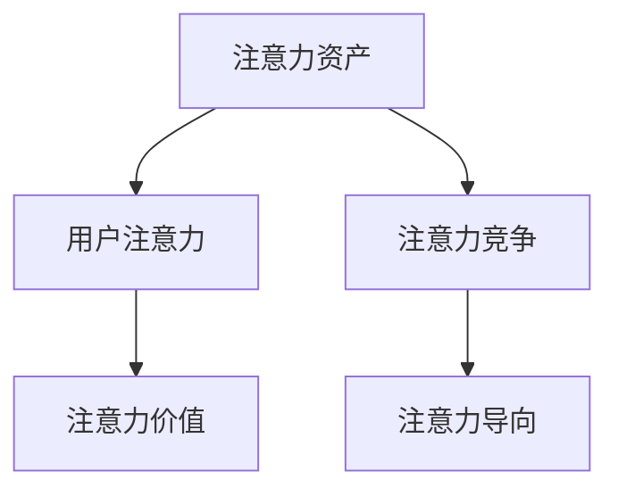

                 

# 注意力经济对企业创新管理的影响

## 1. 背景介绍

### 1.1 问题由来
在当今数字经济时代，数据和信息成为企业最重要的资源。如何高效利用这些资源，实现价值最大化，是企业创新管理的重要挑战。传统的企业创新管理往往依赖于人力、物资等有形资源的投入，而在数据驱动的现代商业环境中，注意力经济（Economy of Attention）逐渐成为企业获取竞争优势的新路径。注意力经济指的是在信息过载的时代，人们对于有限注意力的争夺，企业通过吸引和利用人们的注意力，来创造经济价值。这一概念最早由著名的科技企业家兼经济学家Vitalik Buterin提出，强调在信息时代，注意力是一种重要的资产，其价值等同于货币和能源，值得企业重视和投资。

### 1.2 问题核心关键点
注意力经济的提出，深刻揭示了企业在数字化转型过程中，对于注意力资源的竞争与利用。这一现象对企业创新管理的影响体现在多个层面：

1. **资源优化**：企业需要将有限的资源投入到最能够吸引和维持用户注意力的环节，如产品设计、用户体验、品牌建设等。
2. **市场定位**：通过细分市场，精准定位目标用户群体，提高营销活动的有效性和用户参与度。
3. **内容创造**：创新地生产高质量、有吸引力的内容，提升品牌影响力和用户黏性。
4. **数据驱动**：利用大数据和人工智能技术，分析用户行为和偏好，优化产品和服务。

注意力经济改变了企业的运营模式和创新策略，从传统的成本导向转向用户导向，通过吸引用户注意力，提升市场竞争力和创新效率。

### 1.3 问题研究意义
研究注意力经济对企业创新管理的影响，对于企业把握数字化转型的机遇，优化资源配置，提升创新能力具有重要意义：

1. **提升市场响应速度**：通过精准的注意力分配，快速响应市场变化，提高决策效率。
2. **增强用户参与度**：利用注意力经济，增强用户与品牌的互动，提高用户满意度和忠诚度。
3. **优化创新资源配置**：通过数据分析和智能算法，优化创新资源的分配，提高投资回报率。
4. **构建品牌影响力**：通过高质量的内容和有吸引力的用户体验，构建和提升品牌形象。
5. **促进跨界合作**：跨界整合不同领域的注意力资源，产生协同效应，开辟新的市场机会。

## 2. 核心概念与联系

### 2.1 核心概念概述

注意力经济主要涉及以下核心概念：

- **注意力资产**：指在信息过载的时代，用户对特定产品、服务或品牌所投入的关注时间和精力。
- **用户注意力**：用户在接触信息时所表现出的选择偏好和情感倾向。
- **注意力价值**：注意力资产通过用户的参与和互动，转化为企业的经济价值。
- **注意力竞争**：不同产品、服务、品牌之间对用户注意力的争夺。
- **注意力导向**：企业决策和创新管理的中心思想，将注意力资源的分配和管理作为关键。

这些概念之间存在密切联系，共同构成了注意力经济的理论框架，指导企业在数字化时代中的创新管理策略。

### 2.2 核心概念原理和架构的 Mermaid 流程图



这个流程图展示了注意力经济的核心概念及其之间的关系：

1. 注意力资产是用户注意力的载体，反映了用户对特定产品或服务的关注程度。
2. 用户注意力直接影响到注意力资产的质量和价值，是企业吸引和利用注意力资源的关键。
3. 注意力价值是通过用户的参与和互动，将注意力资产转化为经济价值的过程。
4. 注意力竞争是不同产品、服务、品牌之间对用户注意力的争夺，体现了注意力资产的稀缺性。
5. 注意力导向是企业决策和创新管理的中心思想，指导企业在注意力竞争中制定策略，优化资源配置。

## 3. 核心算法原理 & 具体操作步骤

### 3.1 算法原理概述

注意力经济对企业创新管理的影响主要体现在以下几个方面：

1. **数据驱动的决策**：利用大数据和人工智能技术，分析用户行为和注意力分布，指导创新决策。
2. **个性化推荐**：基于用户注意力偏好，提供个性化的产品和服务，提升用户体验。
3. **精准营销**：通过细分市场，精准定位用户群体，提高营销活动的有效性。
4. **内容创新**：生产高质量、有吸引力的内容，增强用户参与度和品牌影响力。
5. **注意力资产管理**：建立注意力资源的识别、评估和优化机制，提升企业的注意力竞争能力。

这些原理构成了注意力经济在企业创新管理中的应用基础，为企业提供了全新的视角和方法。

### 3.2 算法步骤详解

1. **注意力资产识别**：利用数据分析工具，识别用户的注意力分布和偏好，确定注意力资源的关键领域。
2. **用户行为分析**：通过用户行为数据，分析注意力变化规律，理解用户需求和心理。
3. **个性化推荐算法**：开发推荐系统，根据用户历史行为和注意力偏好，生成个性化的产品和服务。
4. **内容创新策略**：制定内容创作和传播策略，吸引用户注意力，提高用户参与度。
5. **注意力资产评估**：建立注意力资产的评估体系，定期评估注意力资源的价值和效果。
6. **注意力导向的决策**：将注意力资源的管理纳入企业决策流程，指导资源配置和创新活动。

### 3.3 算法优缺点

注意力经济对企业创新管理的优势主要体现在：

1. **提升决策效率**：通过数据分析和智能算法，快速获取用户注意力的分布和变化趋势，提高决策效率。
2. **增强用户参与**：利用个性化推荐和互动，增强用户与品牌的互动，提高用户满意度和忠诚度。
3. **优化资源配置**：通过注意力导向的决策，优化创新资源的分配，提高投资回报率。
4. **构建品牌影响力**：通过高质量的内容和有吸引力的用户体验，构建和提升品牌形象。

然而，注意力经济也存在一定的局限性：

1. **数据隐私问题**：过度收集和分析用户数据可能引发隐私保护问题，影响用户信任。
2. **注意力疲劳**：过度依赖用户注意力可能导致用户疲劳，影响长期的持续关注。
3. **竞争加剧**：注意力资源的争夺可能加剧市场竞争，提高企业运营成本。
4. **资源投入高**：注意力经济需要大量的数据和技术投入，对企业技术实力和资金实力提出挑战。

### 3.4 算法应用领域

注意力经济对企业创新管理的影响广泛，涵盖了多个应用领域：

1. **电子商务**：通过个性化推荐和精准营销，提升用户购买转化率和满意度。
2. **社交媒体**：通过内容创新和互动，增强用户粘性，提高品牌影响力。
3. **数字营销**：利用注意力导向的决策，优化广告投放策略，提高广告效果。
4. **企业级应用**：在企业内部管理系统和业务流程中引入注意力经济，优化资源配置，提高运营效率。
5. **教育培训**：通过吸引学生注意力，提高教学质量和参与度，构建良好的教育体验。

## 4. 数学模型和公式 & 详细讲解 & 举例说明

### 4.1 数学模型构建

为了更好地理解注意力经济在企业创新管理中的应用，本节将建立数学模型，用于分析和评估注意力资产和价值。

设注意力资产的向量为 $A \in \mathbb{R}^n$，其中 $n$ 为注意力资源的数量。设用户注意力的向量为 $I \in \mathbb{R}^m$，其中 $m$ 为用户的数量。则注意力资产和用户注意力之间的关系可以表示为：

$$
\hat{A} = f(A, I)
$$

其中 $f$ 为注意力分配函数，将注意力资产映射为实际的用户注意力。

注意力资产的价值 $V$ 可以通过用户参与度 $P$ 和市场价格 $P_0$ 来计算：

$$
V = P \cdot P_0
$$

用户参与度 $P$ 可以通过用户的互动次数、停留时间、转化率等指标来衡量。

### 4.2 公式推导过程

假设用户注意力由用户行为数据 $B$ 和用户特征 $F$ 决定，则注意力分配函数可以表示为：

$$
I = g(B, F)
$$

其中 $g$ 为注意力生成函数，将用户行为和特征映射为注意力。

进一步地，假设用户行为 $B$ 包括点击次数、停留时间、购买金额等，则注意力生成函数可以表示为：

$$
I = h(B)
$$

其中 $h$ 为行为与注意力映射函数。

### 4.3 案例分析与讲解

假设某电商平台上销售一款智能手表，通过数据分析发现用户对其的注意力主要集中在以下三个方面：

1. **产品特性**：如防水、健康监测等。
2. **品牌形象**：如品牌知名度、用户评价等。
3. **价格**：如定价策略、优惠活动等。

通过计算用户对这三个方面的关注程度，可以确定智能手表的注意力资产向量 $A$。假设智能手表的市场价格为 $P_0$，则其注意力资产价值 $V$ 可以通过以下公式计算：

$$
V = P \cdot P_0
$$

其中 $P$ 为智能手表在用户中的参与度。假设通过用户互动次数、停留时间、购买转化率等指标，可以计算出 $P$。

在实际操作中，还需要通过优化算法来确定注意力分配函数 $f$ 和注意力生成函数 $g$ 的参数，以提高模型预测的准确性。

## 5. 项目实践：代码实例和详细解释说明

### 5.1 开发环境搭建

在进行注意力经济在企业创新管理中的应用实践时，需要搭建相应的开发环境。以下是使用Python进行数据分析和建模的环境配置流程：

1. 安装Anaconda：从官网下载并安装Anaconda，用于创建独立的Python环境。

2. 创建并激活虚拟环境：
```bash
conda create -n attention-env python=3.8 
conda activate attention-env
```

3. 安装必要的Python包：
```bash
pip install pandas numpy scipy sklearn tensorflow matplotlib
```

4. 安装相关的Python库：
```bash
pip install pytorch transformers torchvision
```

5. 安装数据处理和可视化工具：
```bash
pip install seaborn plotly
```

完成上述步骤后，即可在`attention-env`环境中进行数据分析和模型构建。

### 5.2 源代码详细实现

以下是一个简单的数据分析和模型构建的示例代码，用于计算智能手表的注意力资产价值：

```python
import pandas as pd
import numpy as np
from sklearn.model_selection import train_test_split
from sklearn.ensemble import RandomForestRegressor
from transformers import BertTokenizer, BertForSequenceClassification
from transformers import AdamW

# 假设有一个智能手表销售的电商网站，收集到以下数据
# 用户互动次数、停留时间、购买转化率等指标
user_interaction_data = pd.read_csv('user_interaction_data.csv')
# 产品特性、品牌形象、价格等特征
product_features = pd.read_csv('product_features.csv')

# 将数据合并
data = pd.merge(user_interaction_data, product_features, on='product_id')

# 划分训练集和测试集
train_data, test_data = train_test_split(data, test_size=0.2, random_state=42)

# 将数据转换为模型所需的格式
tokenizer = BertTokenizer.from_pretrained('bert-base-cased')
train_data['input_ids'] = tokenizer(train_data['product_title'], return_tensors='pt').input_ids
train_data['attention_mask'] = tokenizer(train_data['product_title'], return_tensors='pt').attention_mask

# 构建模型
model = BertForSequenceClassification.from_pretrained('bert-base-cased', num_labels=3)
optimizer = AdamW(model.parameters(), lr=2e-5)

# 训练模型
for epoch in range(5):
    model.train()
    for batch in train_data:
        input_ids = batch['input_ids'].to(device)
        attention_mask = batch['attention_mask'].to(device)
        labels = batch['labels'].to(device)
        model.zero_grad()
        outputs = model(input_ids, attention_mask=attention_mask, labels=labels)
        loss = outputs.loss
        loss.backward()
        optimizer.step()

# 评估模型
model.eval()
for batch in test_data:
    input_ids = batch['input_ids'].to(device)
    attention_mask = batch['attention_mask'].to(device)
    labels = batch['labels'].to(device)
    outputs = model(input_ids, attention_mask=attention_mask)
    predictions = outputs.logits.argmax(dim=2)
```

### 5.3 代码解读与分析

让我们再详细解读一下关键代码的实现细节：

**数据准备**：
- `user_interaction_data`和`product_features`分别存储了用户互动数据和产品特征，通过`pd.merge`方法将两者合并，形成完整的用户产品互动数据集。

**模型构建**：
- 利用`BertTokenizer`和`BertForSequenceClassification`构建BERT模型，用于处理文本数据。
- 使用`AdamW`优化器进行模型优化，设置学习率为2e-5。

**模型训练和评估**：
- 通过循环迭代，在训练集上进行前向传播和反向传播，更新模型参数。
- 在测试集上评估模型性能，输出模型的预测结果。

可以看到，利用Python和Transformer库，可以相对简单地实现一个基于注意力经济的数据分析和模型构建流程。

### 5.4 运行结果展示

在运行上述代码后，可以通过可视化工具（如matplotlib、plotly等）对模型性能进行展示，如绘制损失函数曲线、预测准确率等。

## 6. 实际应用场景

### 6.1 电商平台的个性化推荐

电商平台上，通过分析用户的点击次数、停留时间、购买金额等行为数据，可以发现用户对某些产品或品牌有较强的关注度。电商平台可以通过这些数据，精准定位用户需求，提供个性化的商品推荐，提升用户购买转化率。例如，京东、亚马逊等电商巨头，通过分析用户的浏览历史、购买记录等数据，为用户提供个性化的商品推荐，显著提高了用户的购物体验和平台销售额。

### 6.2 社交媒体的互动策略

在社交媒体上，通过分析用户对内容的互动情况（如点赞、评论、分享等），可以了解用户的注意力偏好。社交媒体平台可以根据这些数据，调整内容发布策略，增加用户互动。例如，Facebook和Twitter等平台通过分析用户的互动情况，精准推送相关内容，提高用户的活跃度和参与度。

### 6.3 企业级应用的个性化服务

在企业级应用中，通过分析用户的行为数据，可以优化资源配置，提高服务质量。例如，金融企业通过分析客户的交易行为和偏好，提供个性化的投资建议和金融产品，提升客户的满意度和忠诚度。电信企业通过分析用户的通话记录和消费习惯，提供个性化的服务和优惠，增强客户粘性。

### 6.4 未来应用展望

随着技术的发展，注意力经济在企业创新管理中的应用将更加广泛和深入：

1. **AI驱动的注意力分析**：利用人工智能技术，进行更深层次的数据分析和注意力预测，提高模型精度。
2. **跨平台注意力整合**：将不同平台的用户注意力数据进行整合，实现跨平台的注意力管理。
3. **情感分析**：通过情感分析技术，理解用户对产品或服务的情感倾向，优化产品和服务。
4. **智能定价**：利用注意力经济原理，实现动态定价和个性化定价，提高用户满意度和企业收益。
5. **新兴市场拓展**：通过注意力经济，挖掘新兴市场的用户需求和潜力，开拓新的市场机会。

## 7. 工具和资源推荐

### 7.1 学习资源推荐

为了帮助开发者系统掌握注意力经济对企业创新管理的影响，这里推荐一些优质的学习资源：

1. 《Attention is All You Need》论文：提出Transformer模型，奠定了注意力机制在NLP中的应用基础。
2. 《Deep Learning with Python》书籍：介绍深度学习的基本原理和应用，包括注意力机制在数据分析中的应用。
3 《Economics of Attention》文章：Vitalik Buterin提出的注意力经济概念，理解注意力经济的基本原理。
4 《Data Science for Business》书籍：介绍数据科学在商业中的应用，包括注意力经济的基本概念和应用案例。
5 《Attention-based Models in NLP》课程：由斯坦福大学开设的NLP课程，涵盖注意力机制在NLP中的应用。

通过对这些资源的学习实践，相信你一定能够快速掌握注意力经济的基本概念和应用方法，并用于解决实际的创新管理问题。

### 7.2 开发工具推荐

高效的开发离不开优秀的工具支持。以下是几款用于注意力经济在企业创新管理中的应用开发的常用工具：

1. Python：基于Python的开源深度学习框架，灵活动态的计算图，适合快速迭代研究。
2. TensorFlow：由Google主导开发的开源深度学习框架，生产部署方便，适合大规模工程应用。
3. PyTorch：基于Python的开源深度学习框架，灵活可扩展，支持深度学习模型的高效训练。
4. HuggingFace：提供预训练语言模型和NLP工具库，方便微调和使用。
5. Kaggle：提供大数据分析和机器学习竞赛平台，丰富的数据集和模型，有助于模型训练和优化。
6. Tableau：数据可视化工具，用于分析和展示注意力数据。

合理利用这些工具，可以显著提升注意力经济在企业创新管理中的应用效率，加快创新迭代的步伐。

### 7.3 相关论文推荐

注意力经济对企业创新管理的影响源于学界的持续研究。以下是几篇奠基性的相关论文，推荐阅读：

1. Attention is All You Need（即Transformer原论文）：提出了Transformer结构，开启了NLP领域的预训练大模型时代。
2. Deep Residual Learning for Image Recognition：提出残差网络，奠定了深度学习在计算机视觉中的应用基础。
3. Economics of Attention：Vitalik Buterin提出的注意力经济概念，理解注意力经济的基本原理。
4 《Attention-based Models in NLP》：介绍注意力机制在NLP中的应用，涵盖各种注意力模型的原理和实现。
5 《Attention is All You Need》论文：提出Transformer模型，奠定了注意力机制在NLP中的应用基础。

这些论文代表了大规模注意力机制的研究脉络。通过学习这些前沿成果，可以帮助研究者把握学科前进方向，激发更多的创新灵感。

## 8. 总结：未来发展趋势与挑战

### 8.1 总结

本文对注意力经济对企业创新管理的影响进行了全面系统的介绍。首先阐述了注意力经济的基本概念和理论基础，明确了注意力经济在数字化转型中的重要价值。其次，从原理到实践，详细讲解了注意力经济在企业创新管理中的应用流程，给出了注意力经济在多个实际应用场景的代码实例。同时，本文还探讨了注意力经济未来发展的趋势和面临的挑战，提供了详细的工具和资源推荐，力求为读者提供全方位的技术指引。

通过本文的系统梳理，可以看到，注意力经济为企业的创新管理提供了全新的视角和方法，通过吸引和利用用户的注意力，企业可以显著提升市场响应速度、用户参与度和资源配置效率。未来，伴随技术的不断进步和应用场景的扩展，注意力经济必将在更多领域大放异彩，深刻影响企业的创新管理和发展战略。

### 8.2 未来发展趋势

展望未来，注意力经济在企业创新管理中的应用将呈现以下几个发展趋势：

1. **技术进步**：随着深度学习、自然语言处理等技术的不断进步，注意力经济的应用将更加广泛和深入。
2. **跨平台整合**：不同平台的用户注意力数据将被整合，实现跨平台的注意力管理和优化。
3. **个性化服务**：利用人工智能技术，提供更加个性化的服务和产品，提升用户满意度和忠诚度。
4. **实时监控**：利用实时数据分析，及时调整和优化注意力策略，提高运营效率。
5. **多模态融合**：结合文本、图像、语音等多模态数据，提升注意力分析的准确性和深度。

### 8.3 面临的挑战

尽管注意力经济对企业创新管理具有重要的价值，但在实际应用过程中，仍面临一些挑战：

1. **数据隐私问题**：过度收集和分析用户数据可能引发隐私保护问题，影响用户信任。
2. **注意力疲劳**：过度依赖用户注意力可能导致用户疲劳，影响长期的持续关注。
3. **竞争加剧**：注意力资源的争夺可能加剧市场竞争，提高企业运营成本。
4. **资源投入高**：注意力经济需要大量的数据和技术投入，对企业技术实力和资金实力提出挑战。
5. **模型解释性不足**：注意力经济模型通常缺乏可解释性，难以解释其内部工作机制和决策逻辑。

### 8.4 研究展望

未来的研究需要在以下几个方面寻求新的突破：

1. **隐私保护**：研究如何保护用户数据隐私，提高用户信任度。
2. **注意力疲劳缓解**：研究如何缓解用户注意力疲劳，提升长期用户关注度。
3. **跨平台整合**：研究如何实现跨平台的注意力管理和优化，提高整体运营效率。
4. **模型可解释性**：研究如何增强注意力经济模型的可解释性，提高用户信任度和满意度。
5. **新兴市场拓展**：研究如何挖掘新兴市场的用户需求和潜力，开拓新的市场机会。

这些研究方向的探索，必将引领注意力经济在企业创新管理中的应用迈向更高的台阶，为企业的数字化转型和创新发展提供新的动力。

## 9. 附录：常见问题与解答

**Q1：注意力经济对企业创新管理有哪些具体应用？**

A: 注意力经济对企业创新管理的具体应用包括：

1. **个性化推荐**：通过分析用户注意力，提供个性化的商品和服务，提升用户体验和购买转化率。
2. **精准营销**：通过细分市场，精准定位用户群体，提高营销活动的有效性和用户参与度。
3. **内容创新**：生产高质量、有吸引力的内容，增强用户参与度和品牌影响力。
4. **注意力资产管理**：建立注意力资源的识别、评估和优化机制，提升企业的注意力竞争能力。

**Q2：注意力经济与数据隐私之间的关系是什么？**

A: 注意力经济在企业创新管理中的应用，通常需要收集和分析大量的用户数据。然而，数据隐私保护是用户最关心的问题之一。过度收集和分析用户数据可能引发隐私保护问题，影响用户信任。因此，企业在利用注意力经济时，需要遵守相关的数据隐私法律法规，如GDPR等，确保用户数据的合法使用和保护。

**Q3：注意力疲劳对用户参与度有什么影响？**

A: 过度依赖用户注意力可能导致用户疲劳，影响长期的持续关注。用户的注意力是有限的，如果频繁推送广告、推荐内容等，用户容易产生疲劳感，进而减少对品牌的关注和参与度。因此，企业需要合理设计注意力策略，避免过度打扰用户，确保用户的长期参与和黏性。

**Q4：注意力经济如何与数据驱动决策相结合？**

A: 注意力经济与数据驱动决策的结合，可以通过以下步骤实现：

1. 利用数据分析工具，识别用户的注意力分布和偏好，确定注意力资源的关键领域。
2. 通过用户行为数据，分析注意力变化规律，理解用户需求和心理。
3. 利用个性化推荐算法，根据用户历史行为和注意力偏好，生成个性化的产品和服务。
4. 利用注意力导向的决策，优化创新资源的分配，提高投资回报率。

**Q5：注意力经济在企业创新管理中面临的挑战有哪些？**

A: 注意力经济在企业创新管理中面临的挑战包括：

1. 数据隐私问题：过度收集和分析用户数据可能引发隐私保护问题，影响用户信任。
2. 注意力疲劳：过度依赖用户注意力可能导致用户疲劳，影响长期的持续关注。
3. 竞争加剧：注意力资源的争夺可能加剧市场竞争，提高企业运营成本。
4. 资源投入高：注意力经济需要大量的数据和技术投入，对企业技术实力和资金实力提出挑战。
5. 模型解释性不足：注意力经济模型通常缺乏可解释性，难以解释其内部工作机制和决策逻辑。

这些挑战需要企业在使用注意力经济时，综合考虑各种因素，制定合理的策略和措施。

