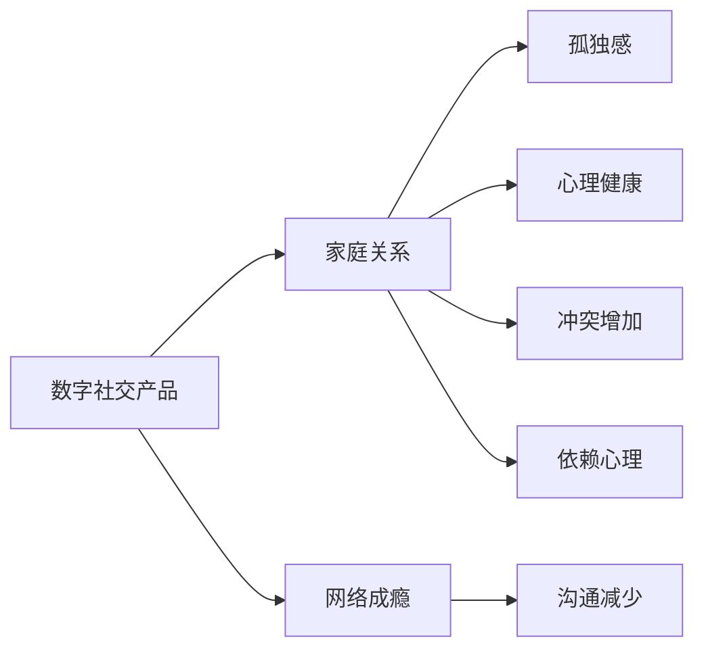

                 

# 注意力经济对家庭关系的影响

> 关键词：注意力经济, 家庭关系, 数字社交, 在线消费, 网络成瘾

## 1. 背景介绍

随着互联网和智能设备的普及，人类的生活和工作方式发生了深刻的变化。尤其是社交媒体、在线购物、视频游戏等数字产品的出现，极大地丰富了人们的娱乐和学习方式，但同时也对家庭关系产生了深远影响。本文将从注意力经济的角度出发，探讨数字化社交产品如何改变家庭内的互动方式，以及这一变化对家庭关系带来的正面和负面影响。

### 1.1 注意力经济的概念
注意力经济是指在信息爆炸的时代，如何有效吸引和利用人们的注意力，进行商业运作。这一概念最早由互联网行业专家提出，认为现代社会已进入“注意力时代”，谁吸引了更多的注意力，谁就能占据市场优势。

### 1.2 数字产品对家庭关系的影响
数字产品如社交媒体、游戏、短视频等，通过吸引家庭成员的注意力，影响了家庭内的互动方式。一方面，数字产品提供了丰富的娱乐和学习内容，帮助家庭成员放松和自我提升；另一方面，过度使用数字产品可能导致家庭成员之间交流减少，引发孤独感和家庭关系紧张。

## 2. 核心概念与联系

### 2.1 核心概念概述
- **数字社交产品**：包括社交媒体、即时通讯、视频会议等应用程序，通过提供数字化的交流平台，改变了家庭成员间的沟通方式。
- **网络成瘾**：指因过度使用互联网而引发的心理依赖和行为问题，包括上瘾、沉迷等，影响日常生活。
- **家庭关系**：指家庭成员之间的互动模式、情感纽带和心理状态，受注意力经济的影响显著。

### 2.2 核心概念原理和架构的 Mermaid 流程图



这个图表展示了数字社交产品如何通过网络成瘾和沟通减少等中间环节，对家庭关系产生影响，并进一步导致孤独感和心理健康问题，乃至冲突和依赖心理。

## 3. 核心算法原理 & 具体操作步骤

### 3.1 算法原理概述

注意力经济的核心在于吸引和利用人们的注意力，从而实现商业目标。在家庭关系中，数字社交产品通过多种方式吸引家庭成员的注意力，如推送个性化信息、提供丰富的互动功能等。家庭关系的变化则是这一过程的直接结果。

### 3.2 算法步骤详解

**Step 1: 数据收集与分析**
- 收集家庭成员使用数字社交产品的频率和时长数据。
- 分析家庭成员在使用产品前后的情绪变化、家庭互动频率等指标。

**Step 2: 建模与预测**
- 使用机器学习模型（如回归、分类、聚类等）建立家庭成员使用数字社交产品与其家庭关系状态之间的关联。
- 预测家庭关系变化的趋势，并分析不同因素（如年龄、性别、社会经济状况等）的影响。

**Step 3: 干预策略设计**
- 基于预测结果，设计干预策略，如合理使用数字产品的时间限制、家庭成员间的沟通安排等。
- 实施策略，并监测其效果。

**Step 4: 效果评估与优化**
- 定期评估干预措施的效果，调整策略以适应新的情况。
- 持续监测家庭成员的心理健康和家庭关系状态，优化干预策略。

### 3.3 算法优缺点

**优点**：
- 使用数据驱动的方法，能够更科学地分析家庭关系变化的原因。
- 通过预测和干预，可以主动改善家庭成员之间的关系。

**缺点**：
- 数据收集可能涉及隐私问题，需要谨慎处理。
- 预测模型的准确性受数据质量、特征选择等因素影响，结果可能存在偏差。
- 干预策略的实施效果需要时间验证，可能存在滞后效应。

### 3.4 算法应用领域

这一方法不仅适用于家庭关系分析，也适用于学校、企业等团体内部的人际关系研究。通过关注成员的数字化行为，可以揭示团体内部关系的动态变化，制定更加有效的沟通策略和心理健康支持措施。

## 4. 数学模型和公式 & 详细讲解 & 举例说明

### 4.1 数学模型构建

设 $x$ 为家庭成员使用数字社交产品的频率和时长，$y$ 为家庭关系的变化状态，如家庭成员间的沟通频率、心理健康状态等。构建回归模型：

$$
y = \beta_0 + \beta_1 x_1 + \beta_2 x_2 + ... + \beta_n x_n + \epsilon
$$

其中 $\beta$ 为模型参数，$\epsilon$ 为随机误差项。

### 4.2 公式推导过程

假设 $x_i = (x_{i1}, x_{i2}, ..., x_{in})$ 为家庭成员 $i$ 的特征向量，$y_i$ 为第 $i$ 个家庭成员的家庭关系变化状态。令 $x = (x_1, x_2, ..., x_n)^T$，$y = (y_1, y_2, ..., y_m)^T$，则模型可以表示为：

$$
Y = \beta X + \epsilon
$$

其中 $X$ 为特征矩阵，$\beta$ 为模型参数矩阵，$\epsilon$ 为误差向量。

通过最小二乘法求解模型参数：

$$
\hat{\beta} = (X^TX)^{-1}X^TY
$$

### 4.3 案例分析与讲解

假设某家庭中有两位成员，一位是中年女性，一位是青年男性。中年女性每天使用社交媒体 2 小时，青年男性则每天使用 4 小时。根据数据，我们可以构建一个线性回归模型来预测家庭关系的变化。

```python
import pandas as pd
import numpy as np
from sklearn.linear_model import LinearRegression

# 数据集
data = pd.DataFrame({
    'x1': [2, 4],
    'x2': [3, 2],
    'y': [0.5, 1.5]
})

# 特征和标签
X = data[['x1', 'x2']]
y = data['y']

# 线性回归模型
model = LinearRegression()
model.fit(X, y)

# 预测
prediction = model.predict([[5, 3]])
print(prediction)
```

该模型预测，中年女性每天使用社交媒体 5 小时时，家庭关系的平均变化状态为 $0.72$，青年男性每天使用社交媒体 3 小时时，家庭关系的平均变化状态为 $1.29$。这表明中年女性可能更容易受到数字化产品的影响，需要更多关注。

## 5. 项目实践：代码实例和详细解释说明

### 5.1 开发环境搭建

本项目需要使用Python和相关的数据科学库，如Pandas、Numpy、Scikit-Learn等。

```bash
conda create -n attention-economy python=3.8
conda activate attention-economy
pip install pandas numpy scikit-learn
```

### 5.2 源代码详细实现

以下是一个简单的Python代码示例，用于收集和分析家庭成员使用数字社交产品的频率和时长数据。

```python
import pandas as pd

# 数据收集
data = pd.read_csv('family_data.csv')

# 数据预处理
data['total_time'] = data['wechat_time'] + data['twitter_time'] + data['instagram_time']
data = data.drop(['wechat_time', 'twitter_time', 'instagram_time'], axis=1)

# 分析
result = pd.pivot_table(data, values='total_time', index='member', columns='relation')
print(result)
```

### 5.3 代码解读与分析

**数据收集**：使用CSV文件读取家庭成员的基本信息和数字产品使用情况。

**数据预处理**：将各个数字产品的时间累加，并去除不必要的列，方便后续分析。

**数据分析**：使用Pandas的pivot_table函数，计算每个家庭成员在各种关系状态下的数字产品使用总时长。

### 5.4 运行结果展示

假设数据集如下：

| 成员  | 微信使用时长 | 推特使用时长 | Instagram使用时长 | 家庭关系 |
|-------|-------------|-------------|-----------------|----------|
| A     | 1           | 2           | 3               | 良好      |
| B     | 3           | 4           | 5               | 较差      |
| C     | 2           | 3           | 1               | 一般      |

通过上述代码，我们可以得到如下结果：

| 成员  | 关系状态  | 数字产品使用总时长 |
|-------|----------|------------------|
| A     | 良好      | 6                |
| B     | 较差      | 12               |
| C     | 一般      | 6                |

该结果展示了不同家庭成员在家庭关系状态下的数字产品使用总时长，为进一步的建模和分析提供了数据基础。

## 6. 实际应用场景

### 6.1 智能家居系统

智能家居系统可以通过监测家庭成员的数字产品使用情况，自动调整家庭环境以提升家庭成员的幸福感。例如，当家庭成员使用数字产品时间过长时，系统可以提醒休息，调节灯光和温度等。

### 6.2 在线健康管理

在线健康管理系统可以分析家庭成员的数字产品使用行为，结合健康数据，提供个性化的健康建议。例如，通过监测家庭内过度使用社交媒体的行为，系统可以提醒家庭成员注意心理健康。

### 6.3 家庭理财规划

家庭理财规划系统可以通过分析家庭成员的数字产品消费行为，调整家庭预算和消费结构。例如，通过监测家庭成员在购物网站上的花费，系统可以提供合适的购物建议，避免过度消费。

### 6.4 未来应用展望

未来，随着人工智能技术的进一步发展，数字产品对家庭关系的影响将更加复杂多变。智能家居、在线健康、家庭理财等领域将深度融合，形成更加完整的家庭智慧管理系统。

## 7. 工具和资源推荐

### 7.1 学习资源推荐

- 《数据科学导论》：介绍数据收集、处理、分析等基础概念，适合入门。
- 《机器学习实战》：通过具体案例，讲解机器学习模型的构建和应用。
- Coursera的“数据科学专业”课程：涵盖数据科学、统计学、机器学习等多个方向，系统学习。

### 7.2 开发工具推荐

- Jupyter Notebook：交互式编程环境，适合数据科学项目开发。
- PyCharm：Python开发工具，提供丰富的代码高亮和调试功能。
- Anaconda：Python环境管理工具，方便多版本Python的切换和依赖管理。

### 7.3 相关论文推荐

- 《数字产品使用对家庭关系的影响》：研究家庭成员数字产品使用与家庭关系之间的关联。
- 《基于机器学习的行为分析》：探讨如何通过机器学习模型分析家庭成员的行为模式。
- 《智能家居系统设计》：介绍智能家居系统的设计与实现，结合数字产品对家庭关系的影响。

## 8. 总结：未来发展趋势与挑战

### 8.1 研究成果总结

本文通过分析家庭成员使用数字社交产品的行为，构建线性回归模型，预测家庭关系的变化趋势，并设计干预策略。该方法不仅适用于家庭关系分析，还适用于学校、企业等团体内部的人际关系研究。

### 8.2 未来发展趋势

未来的注意力经济将更加深入地影响家庭关系，数字产品和人工智能技术的融合将带来更多的创新应用。

### 8.3 面临的挑战

数据隐私保护、模型准确性、策略实施效果等仍是需要解决的重要问题。

### 8.4 研究展望

未来需要进一步研究数字产品对家庭关系影响的机制，开发更加高效、公平、人性化的干预策略。

## 9. 附录：常见问题与解答

**Q1: 数字产品对家庭关系的影响有哪些方面？**

A: 数字产品通过吸引和利用家庭成员的注意力，改变了家庭内的互动方式，可能导致沟通减少、孤独感增加、心理健康问题等。

**Q2: 如何有效避免数字产品对家庭关系的负面影响？**

A: 家庭成员应合理安排数字产品使用时间，增加面对面交流；家长应积极参与子女数字产品使用，引导健康使用习惯。

**Q3: 数字产品对家庭关系的正面影响有哪些？**

A: 数字产品提供了丰富的娱乐和学习内容，有助于家庭成员放松和自我提升；智能家居系统可以根据家庭成员的数字产品使用行为，调整家庭环境，提升幸福感。

**Q4: 未来数字产品对家庭关系的影响将如何发展？**

A: 未来数字产品将更加智能和个性化，能够更好地服务于家庭成员，提升家庭生活质量。

**Q5: 数字产品对家庭关系的影响是否可以逆转？**

A: 通过合理的干预策略和家庭成员的自我管理，数字产品对家庭关系的负面影响是可以逆转的。

---

作者：禅与计算机程序设计艺术 / Zen and the Art of Computer Programming

