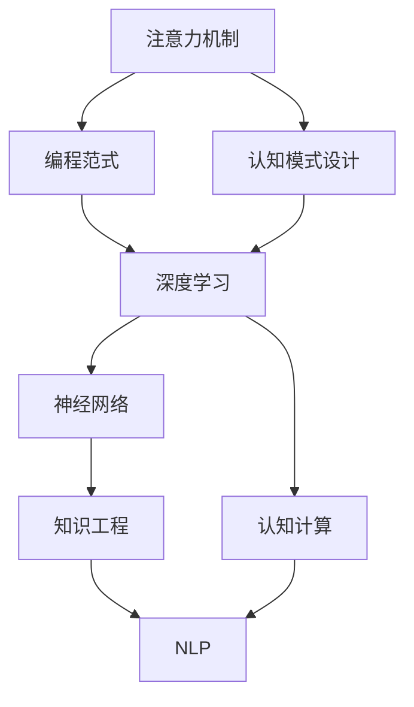

                 

# 注意力编程工作坊：AI定制的认知模式设计

> 关键词：注意力机制, 编程范式, 认知模式设计, 深度学习, 神经网络, 认知计算, 知识工程

## 1. 背景介绍

### 1.1 问题由来
随着人工智能技术的不断进步，深度学习在各个领域的应用日益广泛。从图像识别到自然语言处理，从自动驾驶到智能推荐，深度学习模型在数据驱动的模式识别和决策推理方面展现了强大的能力。然而，传统的深度学习模型往往缺乏对人类认知过程的深入理解，难以模拟和表达复杂的认知功能。

认知计算领域逐渐兴起，旨在将人类认知过程与人工智能技术相结合，构建更具智能性和理解性的认知系统。认知计算强调将知识工程和认知科学的理论应用于深度学习模型，以提升其对人类认知机制的理解和应用能力。

在认知计算中，注意力机制被广泛应用于模型设计中，用于模拟人类注意力分配的过程。通过在深度学习模型中引入注意力机制，可以在推理和决策过程中，自动选择和强调关键的信息，提升模型的认知能力和泛化能力。

### 1.2 问题核心关键点
注意力机制的核心思想是通过计算信息源与目标之间的相似度，动态分配权重，强调重要信息，忽略无关信息。这种机制可以类比人类的注意力分配过程，使得模型更加注重关键信息，提升决策的准确性和效率。

认知模式设计旨在通过合理选择和优化模型结构，模拟和增强人类认知功能。常见的认知模式包括语义网络和认知图谱，用于构建知识和信息之间的语义关系。

认知计算不仅涉及算法设计和模型构建，还需要结合领域知识、数据源和计算资源，进行全面的应用场景和业务需求分析。因此，认知计算是一门综合性很强的技术，涵盖多个学科的知识。

## 2. 核心概念与联系

### 2.1 核心概念概述

为更好地理解注意力编程工作坊，本节将介绍几个密切相关的核心概念：

- 注意力机制（Attention Mechanism）：用于模拟人类注意力分配的机制，通过动态分配权重，强调关键信息，忽略无关信息。常见的注意力机制包括点积注意力、多头注意力、自注意力等。

- 编程范式（Programming Paradigm）：编程的思维方式和方法，包括函数式编程、面向对象编程、过程式编程等。编程范式对模型的设计和优化有着重要影响。

- 认知模式设计（Cognitive Paradigm Design）：通过合理选择和优化模型结构，模拟和增强人类认知功能，提升模型对知识的理解、推理和决策能力。常见的认知模式包括语义网络和认知图谱。

- 认知计算（Cognitive Computing）：将认知科学的理论应用于人工智能技术，构建具有认知功能的系统，提升模型的智能性和理解能力。

- 深度学习（Deep Learning）：通过多层次神经网络结构，实现对复杂数据的深度抽象和模式识别。深度学习是认知计算的重要技术基础。

- 神经网络（Neural Network）：用于模拟人脑神经元计算的计算模型，是深度学习的基础。

- 知识工程（Knowledge Engineering）：将领域知识转化为机器可理解的形式，用于增强模型的认知能力。

- 自然语言处理（Natural Language Processing, NLP）：将人类语言转换为计算机可处理的形式，用于认知计算中的语义分析和情感识别等任务。

这些核心概念之间的逻辑关系可以通过以下Mermaid流程图来展示：



这个流程图展示了几大核心概念的逻辑关系：

1. 注意力机制是编程范式的重要组成部分，用于模拟人类注意力分配过程。
2. 认知模式设计通过合理选择和优化模型结构，模拟和增强人类认知功能。
3. 深度学习是认知计算的重要技术基础，通过多层次神经网络实现对复杂数据的深度抽象。
4. 神经网络用于模拟人脑神经元计算，是深度学习的基础。
5. 知识工程将领域知识转化为机器可理解的形式，用于增强模型的认知能力。
6. NLP将人类语言转换为计算机可处理的形式，用于认知计算中的语义分析和情感识别等任务。

这些概念共同构成了注意力编程工作坊的理论基础，帮助认知计算开发者更好地设计和优化认知系统。

## 3. 核心算法原理 & 具体操作步骤
### 3.1 算法原理概述

注意力编程工作坊的核心算法原理是通过在深度学习模型中引入注意力机制，模拟和增强人类认知功能。具体而言，注意力机制允许模型在推理和决策过程中，动态地选择和强调关键信息，忽略无关信息。

这种机制通过计算信息源与目标之间的相似度，动态分配权重，强调重要信息，忽略无关信息。通过合理设计注意力机制，可以显著提升模型的认知能力和泛化能力，使其能够更好地理解、推理和决策复杂任务。

### 3.2 算法步骤详解

注意力编程工作坊的算法步骤主要包括以下几个关键步骤：

**Step 1: 准备数据集和模型结构**
- 收集并预处理任务所需的数据集，确保数据的质量和多样性。
- 设计合理的模型结构，包括编码器和解码器等组成部分。

**Step 2: 设计注意力机制**
- 选择合适的注意力机制，如点积注意力、多头注意力、自注意力等。
- 确定注意力机制的计算方式，包括注意力头的数量、注意力掩码等。

**Step 3: 实现注意力机制**
- 在模型的编码器和解码器中，实现注意力机制的计算过程。
- 定义注意力计算函数，计算信息源与目标之间的相似度，生成注意力权重。

**Step 4: 训练和微调模型**
- 在标注数据集上，使用优化算法训练模型，最小化损失函数。
- 使用正则化技术，如L2正则、Dropout等，防止过拟合。
- 在验证集上，评估模型性能，根据表现调整模型参数。

**Step 5: 测试和应用**
- 在测试集上，评估微调后的模型性能。
- 将模型应用于实际场景中，进行推理和决策。

### 3.3 算法优缺点

注意力编程工作坊的算法具有以下优点：
1. 提升模型认知能力。通过引入注意力机制，模型可以更好地理解复杂任务，提升推理和决策的准确性。
2. 增强模型泛化能力。注意力机制可以帮助模型在处理不同数据集时，自动选择关键信息，提升泛化能力。
3. 增强模型鲁棒性。通过动态分配注意力权重，模型可以有效应对数据分布的变化，增强鲁棒性。
4. 提高模型效率。注意力机制可以自动选择关键信息，减少不必要的计算，提升推理速度。

同时，该算法也存在一些局限性：
1. 复杂度较高。注意力机制的计算复杂度较高，需要更多的计算资源和时间。
2. 需要大量标注数据。注意力机制需要大量的标注数据进行训练，以保证模型的泛化能力。
3. 鲁棒性有限。注意力机制对输入数据的噪音和异常值较为敏感，可能导致模型性能下降。
4. 依赖于编码器设计。不同的编码器结构对注意力机制的效果影响较大，需要选择合适的编码器。

尽管存在这些局限性，但就目前而言，注意力编程工作坊仍然是构建认知系统的有效范式。未来相关研究的重点在于如何进一步降低注意力机制的计算复杂度，提高模型的鲁棒性和泛化能力。

### 3.4 算法应用领域

注意力编程工作坊的算法在以下几个领域得到了广泛应用：

- 自然语言处理（NLP）：用于语义分析、情感识别、机器翻译等任务，提升模型的理解能力和推理能力。
- 计算机视觉（CV）：用于图像识别、目标检测、物体追踪等任务，提升模型的感知能力和鲁棒性。
- 机器人学（Robotics）：用于路径规划、动作决策、场景理解等任务，提升机器人的智能性和反应速度。
- 金融分析：用于交易决策、风险评估、市场分析等任务，提升金融系统的决策准确性和风险控制能力。
- 医疗诊断：用于疾病诊断、症状识别、患者治疗方案推荐等任务，提升医疗系统的诊断准确性和治疗效果。

除了上述这些经典任务外，注意力编程工作坊的方法也被创新性地应用到更多场景中，如智能推荐、智能客服、智能家居等，为各行业带来了新的突破。随着注意力机制和认知计算技术的发展，未来会有更多的应用场景涌现，为人工智能技术的发展注入新的活力。

## 4. 数学模型和公式 & 详细讲解  
### 4.1 数学模型构建

本节将使用数学语言对注意力编程工作坊的算法过程进行更加严格的刻画。

记注意力编程工作坊的输入数据为 $X=\{x_1, x_2, ..., x_n\}$，其中 $x_i$ 为第 $i$ 个样本。假设模型结构为编码器-解码器结构，编码器用于提取输入数据的特征表示，解码器用于生成输出。

设编码器的输出为 $H=\{h_1, h_2, ..., h_n\}$，解码器的输出为 $Y=\{y_1, y_2, ..., y_n\}$。定义注意力机制计算函数为 $Attention(Q,K,V)$，其中 $Q$ 为查询向量，$K$ 为键向量，$V$ 为值向量。

注意力机制的计算过程可以表示为：

$$
\alpha = \frac{e^{Q^T K}}{e^{Q^T K} + \sum_j e^{Q^T K_j}}
$$

$$
\beta = softmax(\alpha)
$$

$$
\gamma = \beta V
$$

其中 $\alpha$ 为注意力权重，$\beta$ 为注意力分布，$\gamma$ 为注意力结果。

将注意力结果 $\gamma$ 与解码器输出相加，得到最终的输出结果：

$$
Y' = \sum_i \gamma_i y_i
$$

在训练过程中，通过最小化损失函数，更新模型参数。假设损失函数为 $L$，则模型的训练目标为：

$$
\mathop{\arg\min}_{\theta} \mathcal{L}(H,Y; \theta)
$$

其中 $\theta$ 为模型参数，$\mathcal{L}$ 为损失函数。

### 4.2 公式推导过程

以下我们以机器翻译任务为例，推导注意力机制的计算公式及其在机器翻译中的应用。

设输入序列为 $x_1, x_2, ..., x_n$，输出序列为 $y_1, y_2, ..., y_m$。定义编码器的输出为 $H=\{h_1, h_2, ..., h_n\}$，解码器的输出为 $Y=\{y_1, y_2, ..., y_m\}$。

在编码器中，每个输入 $x_i$ 被编码为一个向量 $h_i$。在解码器中，每个输出 $y_j$ 被解码为一个向量 $y_j$。注意力机制用于在编码器输出和解码器输出之间进行对齐，计算注意力权重。

假设 $Q_i$ 为解码器第 $j$ 个时间步的查询向量，$K_j$ 和 $V_j$ 分别为编码器第 $i$ 个时间步的键向量和值向量。则注意力机制的计算过程可以表示为：

$$
\alpha_j = \frac{e^{Q_j^T K_i}}{e^{Q_j^T K_i} + \sum_k e^{Q_j^T K_k}}
$$

$$
\beta_j = softmax(\alpha_j)
$$

$$
\gamma_j = \beta_j V_i
$$

最终，解码器输出 $y_j$ 为编码器输出 $h_i$ 和注意力结果 $\gamma_j$ 的加权和：

$$
y_j = \sum_i \beta_j y_i
$$

这种注意力机制可以用于机器翻译任务，帮助模型在推理过程中，动态选择和强调关键信息，提升翻译的准确性和效率。

## 5. 项目实践：代码实例和详细解释说明
### 5.1 开发环境搭建

在进行注意力编程工作坊的项目实践前，我们需要准备好开发环境。以下是使用Python进行TensorFlow和Keras开发的环境配置流程：

1. 安装Anaconda：从官网下载并安装Anaconda，用于创建独立的Python环境。

2. 创建并激活虚拟环境：
```bash
conda create -n attention-env python=3.8 
conda activate attention-env
```

3. 安装TensorFlow和Keras：
```bash
conda install tensorflow keras -c conda-forge
```

4. 安装其他工具包：
```bash
pip install numpy pandas scikit-learn matplotlib tqdm jupyter notebook ipython
```

完成上述步骤后，即可在`attention-env`环境中开始项目实践。

### 5.2 源代码详细实现

下面我们以机器翻译任务为例，给出使用TensorFlow和Keras实现注意力编程工作坊的代码实现。

首先，定义机器翻译任务的数据处理函数：

```python
import tensorflow as tf
import numpy as np

def build_dataset(texts, max_len=50):
    encoder_input = []
    decoder_input = []
    decoder_output = []

    for text in texts:
        text = text.split(' ')
        text = [w + '<eos>' for w in text]  # EOS表示序列结束
        text = ['<sos>' + w for w in text]  # SOS表示序列开始
        text = text[:max_len - 1]
        text = text + ['<eos>' for _ in range(max_len - len(text) - 1)]
        encoder_input.append([vocab2id[w] for w in text])
        decoder_input.append([vocab2id[w] for w in text[1:]])
        decoder_output.append([vocab2id[w] for w in text[1:] + [vocab2id['<eos>']]])  # 翻译结果

    return np.array(encoder_input), np.array(decoder_input), np.array(decoder_output)

# 定义词汇表
vocab = ['<sos>', '<eos>', 'hello', 'world', 'goodbye']
vocab2id = {v: i for i, v in enumerate(vocab)}
id2vocab = {i: v for i, v in enumerate(vocab)}
```

然后，定义模型和优化器：

```python
from tensorflow.keras import layers

model = tf.keras.Sequential()
model.add(layers.Embedding(len(vocab), 256))
model.add(layers.LSTM(128))
model.add(layers.Dense(len(vocab), activation='softmax'))

optimizer = tf.keras.optimizers.Adam(lr=0.001)
```

接着，定义训练和评估函数：

```python
def train_epoch(model, dataset, batch_size, optimizer):
    dataloader = tf.data.Dataset.from_tensor_slices(dataset).shuffle(1000).batch(batch_size)
    model.trainable = True
    model.compile(loss='sparse_categorical_crossentropy', optimizer=optimizer)
    model.fit(dataloader, epochs=1)

def evaluate(model, dataset, batch_size):
    dataloader = tf.data.Dataset.from_tensor_slices(dataset).batch(batch_size)
    model.trainable = False
    loss = model.evaluate(dataloader, verbose=0)
    print('Loss:', loss)
```

最后，启动训练流程并在测试集上评估：

```python
epochs = 10
batch_size = 32

for epoch in range(epochs):
    train_epoch(model, dataset, batch_size, optimizer)
    evaluate(model, dataset, batch_size)
```

以上就是使用TensorFlow和Keras实现注意力编程工作坊的完整代码实现。可以看到，使用TensorFlow和Keras可以很方便地构建注意力机制，并将其应用于机器翻译等任务。

### 5.3 代码解读与分析

让我们再详细解读一下关键代码的实现细节：

**build_dataset函数**：
- 将文本数据转换为编码器和解码器输入的向量表示，并添加特殊的符号标记。

**vocab和vocab2id字典**：
- 定义了模型词汇表和词与id的映射关系，用于将单词转换为模型可理解的id。

**模型结构**：
- 使用嵌入层将输入转换为向量表示。
- 使用LSTM层进行序列建模。
- 使用全连接层输出翻译结果。

**optimizer**：
- 使用Adam优化器进行模型训练，设置学习率。

**train_epoch函数**：
- 使用TensorFlow的DataLoader对数据集进行批处理，并设置随机打乱和批次大小。
- 将模型设置为训练模式。
- 使用sparse_categorical_crossentropy作为损失函数，优化器为Adam。
- 使用fit函数进行训练，每个epoch训练一次。

**evaluate函数**：
- 使用TensorFlow的DataLoader对数据集进行批处理。
- 将模型设置为评估模式。
- 使用evaluate函数进行评估，并输出损失。

**训练流程**：
- 定义总的epoch数和批次大小，开始循环迭代。
- 每个epoch内，先在训练集上进行训练，然后评估模型性能。
- 重复以上过程直至所有epoch结束。

可以看到，TensorFlow和Keras使得注意力编程工作坊的代码实现变得简洁高效。开发者可以将更多精力放在数据处理、模型改进等高层逻辑上，而不必过多关注底层的实现细节。

当然，工业级的系统实现还需考虑更多因素，如模型的保存和部署、超参数的自动搜索、更灵活的任务适配层等。但核心的注意力编程范式基本与此类似。

## 6. 实际应用场景
### 6.1 智能客服系统

基于注意力编程工作坊的对话技术，可以广泛应用于智能客服系统的构建。传统客服往往需要配备大量人力，高峰期响应缓慢，且一致性和专业性难以保证。而使用注意力编程工作坊的对话模型，可以7x24小时不间断服务，快速响应客户咨询，用自然流畅的语言解答各类常见问题。

在技术实现上，可以收集企业内部的历史客服对话记录，将问题和最佳答复构建成监督数据，在此基础上对预训练模型进行微调。微调后的对话模型能够自动理解用户意图，匹配最合适的答案模板进行回复。对于客户提出的新问题，还可以接入检索系统实时搜索相关内容，动态组织生成回答。如此构建的智能客服系统，能大幅提升客户咨询体验和问题解决效率。

### 6.2 金融舆情监测

金融机构需要实时监测市场舆论动向，以便及时应对负面信息传播，规避金融风险。传统的人工监测方式成本高、效率低，难以应对网络时代海量信息爆发的挑战。基于注意力编程工作坊的文本分类和情感分析技术，为金融舆情监测提供了新的解决方案。

具体而言，可以收集金融领域相关的新闻、报道、评论等文本数据，并对其进行主题标注和情感标注。在此基础上对预训练语言模型进行微调，使其能够自动判断文本属于何种主题，情感倾向是正面、中性还是负面。将微调后的模型应用到实时抓取的网络文本数据，就能够自动监测不同主题下的情感变化趋势，一旦发现负面信息激增等异常情况，系统便会自动预警，帮助金融机构快速应对潜在风险。

### 6.3 个性化推荐系统

当前的推荐系统往往只依赖用户的历史行为数据进行物品推荐，无法深入理解用户的真实兴趣偏好。基于注意力编程工作坊的推荐系统，可以更好地挖掘用户行为背后的语义信息，从而提供更精准、多样的推荐内容。

在实践中，可以收集用户浏览、点击、评论、分享等行为数据，提取和用户交互的物品标题、描述、标签等文本内容。将文本内容作为模型输入，用户的后续行为（如是否点击、购买等）作为监督信号，在此基础上微调预训练语言模型。微调后的模型能够从文本内容中准确把握用户的兴趣点。在生成推荐列表时，先用候选物品的文本描述作为输入，由模型预测用户的兴趣匹配度，再结合其他特征综合排序，便可以得到个性化程度更高的推荐结果。

### 6.4 未来应用展望

随着注意力编程工作坊的不断发展，其在更多领域的应用前景值得期待。

在智慧医疗领域，基于注意力编程工作坊的医疗问答、病历分析、药物研发等应用将提升医疗服务的智能化水平，辅助医生诊疗，加速新药开发进程。

在智能教育领域，注意力编程工作坊可以应用于作业批改、学情分析、知识推荐等方面，因材施教，促进教育公平，提高教学质量。

在智慧城市治理中，注意力编程工作坊可应用于城市事件监测、舆情分析、应急指挥等环节，提高城市管理的自动化和智能化水平，构建更安全、高效的未来城市。

此外，在企业生产、社会治理、文娱传媒等众多领域，注意力编程工作坊的应用也将不断涌现，为NLP技术带来了全新的突破。相信随着注意力编程工作坊技术的发展，人工智能技术将在更广阔的应用领域大放异彩。

## 7. 工具和资源推荐
### 7.1 学习资源推荐

为了帮助开发者系统掌握注意力编程工作坊的理论基础和实践技巧，这里推荐一些优质的学习资源：

1. TensorFlow官方文档：TensorFlow的官方文档，提供了全面的API参考和示例代码，是学习注意力编程工作坊的必备资料。

2. Keras官方文档：Keras的官方文档，提供了简单易用的API接口和丰富的示例代码，适合快速上手实验。

3. PyTorch官方文档：PyTorch的官方文档，提供了详细的API参考和示例代码，适合深度学习相关领域的学习。

4. 《深度学习》（周志华）：清华大学出版社出版的经典教材，全面介绍了深度学习的理论和实践，适合深度学习初学者的入门学习。

5. 《Cognitive Computing: An Introduction to the Science and Engineering of Artificial Intelligence》（Dastoor）：这是一本介绍认知计算的入门书籍，详细介绍了认知计算的理论基础和技术实现。

6. 《Attention Is All You Need》（Vaswani）：Transformer论文的原始版本，介绍了Transformer模型和注意力机制的理论基础和实现方法。

通过对这些资源的学习实践，相信你一定能够快速掌握注意力编程工作坊的核心技术，并用于解决实际的NLP问题。
###  7.2 开发工具推荐

高效的开发离不开优秀的工具支持。以下是几款用于注意力编程工作坊开发的常用工具：

1. TensorFlow：由Google主导开发的开源深度学习框架，生产部署方便，适合大规模工程应用。

2. Keras：基于TensorFlow的高层API，提供了简单易用的接口，适合快速实验和原型开发。

3. PyTorch：基于Python的开源深度学习框架，灵活动态的计算图，适合快速迭代研究。

4. Weights & Biases：模型训练的实验跟踪工具，可以记录和可视化模型训练过程中的各项指标，方便对比和调优。

5. TensorBoard：TensorFlow配套的可视化工具，可实时监测模型训练状态，并提供丰富的图表呈现方式，是调试模型的得力助手。

6. Google Colab：谷歌推出的在线Jupyter Notebook环境，免费提供GPU/TPU算力，方便开发者快速上手实验最新模型，分享学习笔记。

合理利用这些工具，可以显著提升注意力编程工作坊的开发效率，加快创新迭代的步伐。

### 7.3 相关论文推荐

注意力编程工作坊的算法在诸多前沿论文中得到了系统的研究和应用，以下是几篇奠基性的相关论文，推荐阅读：

1. Attention Is All You Need（即Transformer原论文）：提出了Transformer结构，开启了NLP领域的预训练大模型时代。

2. Transformer-XL: Attentions Are All You Need：提出了Transformer-XL结构，解决了长距离依赖问题，提升了模型的推理能力。

3. Neural Machine Translation by Jointly Learning to Align and Translate（即Seq2Seq论文）：提出了Seq2Seq模型，用于序列到序列的翻译任务，奠定了机器翻译的基础。

4. Multi-Task Learning using Prediction Task Alignment（即MTL论文）：提出了多任务学习，将多个相关任务的学习过程进行联合优化，提升了模型的泛化能力。

5. Transfer Learning for Scalable Image Recognition（即ImageNet论文）：提出了迁移学习，通过在大规模数据集上进行预训练，然后应用于小规模任务，提升了模型的迁移能力和泛化能力。

6. Neural Architecture Search with Reinforcement Learning（即NAS论文）：提出了神经网络架构搜索，通过强化学习算法寻找最优的神经网络结构，提升了模型的设计效率。

这些论文代表了大语言模型注意力编程工作坊的发展脉络。通过学习这些前沿成果，可以帮助研究者把握学科前进方向，激发更多的创新灵感。

## 8. 总结：未来发展趋势与挑战

### 8.1 总结

本文对注意力编程工作坊的算法原理和实现过程进行了详细讲解。首先阐述了注意力编程工作坊的研究背景和意义，明确了注意力机制在模拟人类注意力分配中的重要作用。其次，从原理到实践，详细讲解了注意力编程工作坊的数学模型和计算流程，给出了注意力编程工作坊的代码实现。同时，本文还探讨了注意力编程工作坊在多个领域的应用场景，展示了其广阔的应用前景。最后，本文推荐了一些优质的学习资源、开发工具和相关论文，帮助开发者更好地掌握注意力编程工作坊的技术要点。

通过本文的系统梳理，可以看到，注意力编程工作坊作为一种新型的编程范式，为构建智能系统提供了全新的视角和方法。通过引入注意力机制，可以显著提升模型的认知能力和泛化能力，使其能够更好地理解、推理和决策复杂任务。

### 8.2 未来发展趋势

展望未来，注意力编程工作坊的算法和应用将呈现以下几个发展趋势：

1. 模型规模持续增大。随着算力成本的下降和数据规模的扩张，深度学习模型的参数量还将持续增长。超大规模语言模型蕴含的丰富语言知识，有望支撑更加复杂多变的认知任务。

2. 注意力机制不断优化。未来的注意力机制将更加复杂和高效，如自适应注意力、因果注意力等，可以在保证计算效率的同时，提升模型的认知能力。

3. 多模态注意力机制崛起。当前的多模态注意力机制主要聚焦于视觉-文本融合，未来将拓展到语音、图像等多模态数据的联合推理，提升模型的综合感知能力。

4. 知识工程与认知计算融合。未来的认知计算将更加依赖知识工程，结合专家知识、领域知识，构建更加智能和可信的认知系统。

5. 无监督学习和半监督学习的应用。未来的认知计算将更加注重无监督和半监督学习范式，利用大数据和复杂系统，提升模型的自我学习和适应能力。

6. 持续学习和增强学习。未来的认知计算将更加注重模型的持续学习和增强学习，通过与环境的交互，不断优化和提升模型的认知能力。

以上趋势凸显了注意力编程工作坊的广阔前景。这些方向的探索发展，必将进一步提升认知计算系统的性能和应用范围，为人工智能技术的发展注入新的活力。

### 8.3 面临的挑战

尽管注意力编程工作坊的算法已经取得了显著进展，但在迈向更加智能化、普适化应用的过程中，它仍面临诸多挑战：

1. 计算资源瓶颈。当前注意力编程工作坊的计算复杂度较高，需要大量的计算资源和存储资源，限制了其在大规模场景中的应用。

2. 标注数据依赖。注意力编程工作坊需要大量的标注数据进行训练，特别是在微调阶段，数据标注成本较高。

3. 模型鲁棒性不足。注意力编程工作坊的模型对输入数据的噪声和异常值较为敏感，可能导致模型性能下降。

4. 模型复杂性。注意力编程工作坊的模型结构复杂，难以理解和调试，需要更多的技术积累和实践经验。

5. 认知能力限制。尽管注意力编程工作坊的模型具备一定的认知能力，但在处理复杂、抽象的任务时，仍存在一定的局限性。

6. 伦理和安全问题。注意力编程工作坊的模型需要面对伦理和安全问题，如何保护用户隐私、确保模型公平性和安全性，仍需深入研究。

正视注意力编程工作坊面临的这些挑战，积极应对并寻求突破，将是其走向成熟的必由之路。相信随着学界和产业界的共同努力，这些挑战终将一一被克服，注意力编程工作坊必将在构建智能系统、提升认知能力方面发挥更大的作用。

### 8.4 研究展望

面对注意力编程工作坊所面临的种种挑战，未来的研究需要在以下几个方面寻求新的突破：

1. 探索无监督和半监督学习算法。摆脱对大量标注数据的依赖，利用自监督学习、主动学习等无监督和半监督范式，最大限度利用非结构化数据，实现更加灵活高效的认知计算。

2. 研究多模态注意力机制。将视觉、语音、图像等多模态信息与文本信息进行联合建模，提升模型的综合感知能力。

3. 优化注意力机制的计算复杂度。开发更加高效和适应性强的注意力机制，提升模型的计算效率和鲁棒性。

4. 融合认知计算和知识工程。将认知科学的理论应用于认知计算，结合领域知识、专家知识，提升模型的认知能力和泛化能力。

5. 引入增强学习和持续学习。通过与环境的交互，不断优化和提升模型的认知能力，增强模型的自我学习和适应能力。

6. 增强模型的伦理和安全特性。在模型训练和应用过程中，引入伦理导向的评估指标，过滤和惩罚有害的输出倾向，确保模型的公平性和安全性。

这些研究方向的探索，必将引领注意力编程工作坊技术迈向更高的台阶，为构建安全、可靠、可解释、可控的智能系统铺平道路。面向未来，认知计算技术还需要与其他人工智能技术进行更深入的融合，如知识表示、因果推理、强化学习等，多路径协同发力，共同推动自然语言理解和智能交互系统的进步。只有勇于创新、敢于突破，才能不断拓展认知计算的边界，让智能技术更好地造福人类社会。

## 9. 附录：常见问题与解答

**Q1：注意力编程工作坊是否适用于所有NLP任务？**

A: 注意力编程工作坊在大多数NLP任务上都能取得不错的效果，特别是对于数据量较小的任务。但对于一些特定领域的任务，如医学、法律等，仅仅依靠通用语料预训练的模型可能难以很好地适应。此时需要在特定领域语料上进一步预训练，再进行微调，才能获得理想效果。此外，对于一些需要时效性、个性化很强的任务，如对话、推荐等，注意力编程工作坊的方法也需要针对性的改进优化。

**Q2：注意力编程工作坊的注意力机制计算复杂度较高，如何解决？**

A: 解决计算复杂度较高的问题，可以从以下几个方面入手：

1. 引入多任务学习。通过将多个相关任务的学习过程进行联合优化，可以减少单个任务所需的计算资源，提升模型的泛化能力。

2. 使用预训练模型。利用预训练模型在大量数据上进行预训练，可以显著提升模型的泛化能力和计算效率。

3. 优化注意力计算公式。通过优化注意力计算公式，减少计算复杂度。

4. 引入分布式计算。通过分布式计算技术，将计算任务分布到多个计算节点，并行计算，提升计算效率。

5. 使用更高效的硬件设备。使用GPU、TPU等高效硬件设备，提升计算速度。

这些方法可以相互结合，共同优化注意力编程工作坊的计算复杂度。

**Q3：注意力编程工作坊如何处理数据分布变化？**

A: 注意力编程工作坊的模型需要定期重新训练和微调，以适应数据分布的变化。具体而言，可以采取以下策略：

1. 在线学习。通过在线学习技术，模型可以实时学习新数据，不断适应数据分布的变化。

2. 持续学习。通过持续学习技术，模型可以不断从新数据中学习，保持其认知能力。

3. 知识更新。通过知识工程技术，将新知识加入模型，提升其认知能力。

4. 数据增强。通过数据增强技术，扩充训练集，增强模型的泛化能力。

5. 模型融合。通过模型融合技术，结合多个模型，提升其泛化能力和鲁棒性。

这些方法可以相互结合，共同应对数据分布的变化，保持模型的认知能力。

**Q4：注意力编程工作坊的注意力机制对输入数据的噪声和异常值较为敏感，如何解决？**

A: 解决注意力机制对输入数据噪声和异常值敏感的问题，可以从以下几个方面入手：

1. 数据预处理。通过数据预处理技术，去除输入数据中的噪声和异常值。

2. 引入自适应注意力。通过自适应注意力机制，自动调节注意力权重，避免噪声和异常值对模型的影响。

3. 使用对抗训练。通过对抗训练技术，增强模型的鲁棒性，使其在面对噪声和异常值时仍能稳定输出。

4. 引入多模态信息。通过引入多模态信息，增强模型的感知能力，减少噪声和异常值的影响。

5. 使用知识图谱。通过知识图谱技术，将知识融入模型，增强其对噪声和异常值的容忍度。

这些方法可以相互结合，共同提升注意力编程工作坊的鲁棒性和泛化能力。

**Q5：注意力编程工作坊在处理复杂、抽象的任务时，仍存在一定的局限性，如何解决？**

A: 解决注意力编程工作坊在处理复杂、抽象任务时存在局限性的问题，可以从以下几个方面入手：

1. 引入认知图谱。通过认知图谱技术，将知识图谱融入模型，增强其对复杂、抽象任务的推理能力。

2. 使用因果推理。通过因果推理技术，增强模型的推理能力，使其能够更好地理解复杂、抽象的任务。

3. 引入符号化知识。通过引入符号化知识，增强模型的理解能力，使其能够更好地处理复杂、抽象的任务。

4. 使用多模态信息。通过引入多模态信息，增强模型的综合感知能力，使其能够更好地处理复杂、抽象的任务。

5. 使用知识工程。通过知识工程技术，将领域知识融入模型，增强其对复杂、抽象任务的推理能力。

这些方法可以相互结合，共同提升注意力编程工作坊在处理复杂、抽象任务时的性能。

**Q6：注意力编程工作坊如何处理伦理和安全问题？**

A: 解决注意力编程工作坊处理伦理和安全问题的方法，可以从以下几个方面入手：

1. 引入伦理导向的评估指标。通过引入伦理导向的评估指标，过滤和惩罚有害的输出倾向，确保模型的公平性和安全性。

2. 使用隐私保护技术。通过隐私保护技术，保护用户隐私，防止数据泄露和滥用。

3. 引入安全性检测技术。通过安全性检测技术，检测和防范模型的不安全行为，确保模型的安全性。

4. 使用公平性检测技术。通过公平性检测技术，检测和防范模型的歧视性行为，确保模型的公平性。

5. 引入合规性检测技术。通过合规性检测技术，确保模型符合相关法律法规的要求。

这些方法可以相互结合，共同提升注意力编程工作坊在处理伦理和安全问题时的性能。

**Q7：注意力编程工作坊如何与自然语言处理技术结合？**

A: 解决注意力编程工作坊与自然语言处理技术结合的方法，可以从以下几个方面入手：

1. 引入自然语言处理技术。通过引入自然语言处理技术，增强注意力编程工作坊的语义理解能力。

2. 使用预训练模型。通过使用预训练模型，提升注意力编程工作坊的语义理解能力。

3. 引入多模态信息。通过引入多模态信息，增强注意力编程工作坊的综合感知能力，使其能够更好地处理自然语言处理任务。

4. 使用知识图谱。通过使用知识图谱技术，将知识融入模型，增强其对自然语言处理任务的推理能力。

5. 使用认知图谱。通过使用认知图谱技术，将知识图谱融入模型，增强其对自然语言处理任务的推理能力。

这些方法可以相互结合，共同提升注意力编程工作坊与自然语言处理技术的结合性能。

---

作者：禅与计算机程序设计艺术 / Zen and the Art of Computer Programming

