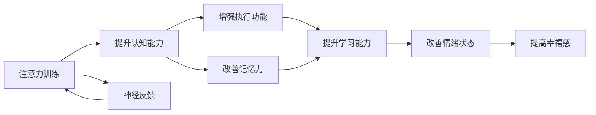

                 

# 注意力训练与大脑健康改善：通过专注力增强认知能力和幸福感

> 关键词：注意力训练,大脑健康,认知能力提升,幸福感增强,专注力训练,认知神经科学,神经反馈,训练数据集,行为分析,大脑影像,生物标记物

## 1. 背景介绍

### 1.1 问题由来

随着现代社会生活节奏的加快，信息量的爆炸性增长，人们面临的任务繁重而复杂。长时间的紧张工作、长期使用电子设备、频繁接触负性信息等，导致人们的大脑认知功能受到不同程度的损害。同时，大脑健康受到广泛关注，多项研究表明，持续的脑力训练能够改善认知能力，提升幸福感，甚至有助于预防认知退行性疾病如阿尔茨海默症。

近年来，基于注意力训练的脑力游戏和APP越来越流行，许多公司推出商业化的认知训练产品，提供类似电子脑电图的神经反馈系统，通过科学训练提高大脑的执行功能、记忆力和注意力水平。这些应用逐渐成为日常生活中的一环，帮助人们提升大脑认知能力，改善身心健康。

### 1.2 问题核心关键点

1. **注意力训练与大脑认知**：注意力是大脑认知的核心能力之一，其训练效果能直接提升认知功能，如记忆、学习、推理等。
2. **脑力训练与幸福感**：许多研究显示，注意力训练和脑力训练不仅能提升认知能力，还能改善情绪，提升幸福感。
3. **神经反馈与生物标记物**：神经反馈技术通过实时的神经信号反馈，帮助大脑在训练过程中及时调整状态，显著提升训练效果。
4. **训练数据集与行为分析**：训练效果依赖于大量的高质量训练数据集，通过行为分析与神经信号分析，找到最优的训练模式。
5. **大脑影像与长期追踪**：通过大脑影像技术（如fMRI、EEG）记录大脑活动，长期追踪训练效果，为大脑认知研究提供客观证据。

这些关键点构成了注意力训练与大脑健康改善研究的基础，本文将详细探讨这些概念的原理和应用，并给出一些具体的训练方法及效果评估手段。

## 2. 核心概念与联系

### 2.1 核心概念概述

为更好地理解注意力训练对大脑健康的影响，本节将介绍几个关键概念：

- **注意力训练（Attention Training）**：一种基于认知心理学和神经科学原理设计的训练方法，旨在提升大脑的注意力、专注力和信息处理能力。
- **脑力训练（Brain Training）**：通过有针对性的认知任务，促进大脑的特定区域和功能发展，提升认知能力。
- **神经反馈（Neurofeedback）**：利用大脑的神经信号数据，实时反馈给受训者，帮助其在训练过程中调整状态，提升训练效果。
- **认知能力（Cognitive Abilities）**：包括注意力、记忆、学习能力、语言处理能力等，是大脑综合功能的体现。
- **幸福感（Well-being）**：包括情绪稳定、满足感、自我实现等，是心理健康的关键指标。

这些核心概念之间的联系可以通过以下Mermaid流程图来展示：



这个流程图展示出注意力训练与大脑健康改善之间的关系：

1. 注意力训练提升认知能力，包括执行功能和记忆力。
2. 提升的认知能力增强学习能力，改善情绪状态。
3. 情绪状态的改善进一步提升幸福感。
4. 神经反馈在注意力训练过程中起到关键作用，帮助大脑调整状态。

## 3. 核心算法原理 & 具体操作步骤

### 3.1 算法原理概述

注意力训练的算法原理主要基于认知心理学和神经科学的最新研究成果，通过有针对性的认知任务，反复训练大脑的注意力机制，从而提升认知能力。这种训练通常包括正念冥想、注意力集中训练、记忆提升训练等，旨在增强大脑对信息的注意、处理和记忆能力。

神经反馈技术通过实时监测大脑活动，将神经信号数据可视化，反馈给受训者。受训者通过调整训练过程中的注意状态，不断优化训练效果。

### 3.2 算法步骤详解

注意力训练的算法步骤一般包括以下几个关键步骤：

**Step 1: 准备训练数据集和训练环境**
- 收集高品质的训练数据集，包括注意力训练任务和相应的神经反馈数据。
- 搭建训练环境，包括神经信号监测设备、计算硬件、数据分析软件等。

**Step 2: 设计训练任务**
- 根据训练目标设计注意力训练任务，如正念冥想、注意力集中训练、记忆提升训练等。
- 设计神经反馈系统，将注意力集中度和反应时间等指标实时可视化。

**Step 3: 启动神经反馈训练**
- 受训者在训练环境中，根据设计的训练任务进行训练。
- 神经反馈系统实时监测受训者的神经信号，反馈给受训者。
- 受训者根据反馈数据调整训练状态，不断优化训练效果。

**Step 4: 评估训练效果**
- 通过行为分析（如注意力集中度、记忆力测试等）和大脑影像（如fMRI、EEG）评估训练效果。
- 根据评估结果调整训练方案，继续进行优化训练。

**Step 5: 长期追踪和分析**
- 通过长期追踪受训者的训练数据，分析训练效果的变化。
- 利用大数据分析技术，挖掘训练效果的影响因素，优化训练方案。

### 3.3 算法优缺点

注意力训练与神经反馈方法具有以下优点：

- 提升认知能力：注意力训练能够显著提升大脑的注意力、执行功能和记忆力，改善学习、工作表现。
- 改善情绪状态：训练过程中，大脑的奖赏中枢被激活，有助于提升情绪稳定性和幸福感。
- 实时反馈机制：神经反馈技术提供实时的训练反馈，帮助受训者及时调整训练状态，提升训练效果。

但这些方法也存在一定的局限性：

- 训练效果因人而异：不同的人对训练的反应不同，训练效果个体差异较大。
- 训练时间较长：相对于快速见效的药物治疗，注意力训练需要较长时间的持续训练。
- 训练过程需要技术支持：神经反馈设备较为昂贵，训练过程需要专业技术人员进行支持。

### 3.4 算法应用领域

注意力训练与神经反馈方法广泛应用于以下几个领域：

- **心理健康**：通过训练提升注意力和情绪调节能力，帮助抑郁症、焦虑症患者缓解症状，提升幸福感。
- **教育**：在儿童、青少年中推广注意力训练，提升学习效率和成绩，帮助认知发展。
- **职业培训**：对在职人员进行注意力和记忆力训练，提升工作表现和职业发展。
- **老年认知训练**：对老年人进行认知训练，延缓认知衰退，提升生活质量。
- **游戏和娱乐**：通过脑力训练游戏和APP，吸引用户参与注意力训练，提升认知能力。

## 4. 数学模型和公式 & 详细讲解 & 举例说明（备注：数学公式请使用latex格式，latex嵌入文中独立段落使用 $$，段落内使用 $)
### 4.1 数学模型构建

本节将使用数学语言对注意力训练的原理和算法步骤进行详细讲解。

记注意力训练任务的输入为 $x$，神经信号监测设备采集的信号为 $y$，训练任务对应的期望输出为 $t$。假设神经反馈系统的反馈信号为 $f(x)$，神经反馈算法为目标函数 $L$。训练的数学模型为：

$$
\min_{x, t, f} L(x, t, f)
$$

其中 $L$ 表示训练目标，通常包含两部分：任务损失 $L_{task}$ 和反馈损失 $L_{feedback}$。

**任务损失 $L_{task}$**：用于衡量训练任务与期望输出之间的差异，通常定义为均方误差（MSE）：

$$
L_{task} = \frac{1}{N} \sum_{i=1}^N (y_i - t_i)^2
$$

**反馈损失 $L_{feedback}$**：用于衡量神经反馈信号 $f(x)$ 与期望反馈 $f_{target}$ 之间的差异，通常定义为KL散度：

$$
L_{feedback} = KL(f(x) || f_{target})
$$

总损失函数 $L$ 可以表示为：

$$
L = L_{task} + \lambda L_{feedback}
$$

其中 $\lambda$ 为调节因子，用于平衡任务损失和反馈损失。

### 4.2 公式推导过程

为了更加深入地理解注意力训练的数学模型，下面推导一个简单的注意力集中训练任务的损失函数。

假设训练任务为注意集中度评估，即受训者在单位时间内保持注意的持续时间。神经信号监测设备监测到的大脑活动信号 $y$ 为神经元放电的频率，期望输出 $t$ 为单位时间的平均放电频率。神经反馈系统的反馈信号 $f(x)$ 为当前神经元放电频率与期望频率的差异。训练的目标是最大化注意力集中度，即最大化期望输出 $t$。

根据以上定义，我们可以得到：

$$
L_{task} = \frac{1}{N} \sum_{i=1}^N (y_i - t_i)^2
$$

神经反馈信号 $f(x)$ 可以表示为：

$$
f(x) = \frac{y_i - t_i}{t_i}
$$

反馈损失 $L_{feedback}$ 可以表示为：

$$
L_{feedback} = KL(f(x) || f_{target})
$$

其中 $f_{target}$ 为期望的神经元放电频率，通常根据任务难度和期望注意力水平进行设定。

总损失函数 $L$ 可以表示为：

$$
L = L_{task} + \lambda L_{feedback}
$$

通过优化上述损失函数，可以在注意力集中度评估任务中，提高受训者的注意力集中度，并提升训练效果。

### 4.3 案例分析与讲解

下面以一个注意力训练实验为例，进行详细讲解。

假设受训者需要进行一个正念冥想训练，神经反馈系统实时监测其注意力集中度。训练过程包括以下几个步骤：

1. **任务设计**：正念冥想训练的目标是提升受训者的注意力集中度，要求受训者在冥想时保持专注，不受外界干扰。训练任务为受训者在单位时间内保持注意的持续时间。

2. **数据采集**：神经反馈系统实时监测受训者的神经信号，采集其神经元放电的频率数据。

3. **神经反馈**：神经反馈系统将监测到的神经信号与期望注意力集中度进行对比，计算反馈信号 $f(x)$。

4. **训练优化**：受训者根据反馈信号调整注意力集中度，优化训练效果。

5. **效果评估**：通过行为分析（如注意力集中度测试）和大脑影像（如fMRI、EEG）评估训练效果。

具体而言，训练目标可以表示为：

$$
\min_{x} L(x) = \min_{x} (L_{task}(x) + \lambda L_{feedback}(x))
$$

其中 $x$ 为受训者的注意力集中度。训练过程可以表示为：

$$
x_{new} = x_{old} - \eta \nabla_{x} L(x)
$$

其中 $\eta$ 为学习率，$\nabla_{x} L(x)$ 为目标函数 $L(x)$ 对 $x$ 的梯度。训练过程中，受训者不断调整注意力集中度，最小化总损失函数 $L$，逐步提升训练效果。

## 5. 项目实践：代码实例和详细解释说明

### 5.1 开发环境搭建

在进行注意力训练项目实践前，我们需要准备好开发环境。以下是使用Python进行神经反馈训练的环境配置流程：

1. 安装Python：从官网下载并安装Python，用于编写训练代码和数据分析。

2. 安装科学计算库：
```bash
pip install numpy scipy matplotlib scikit-learn
```

3. 安装神经信号采集设备：如EEG头套、fMRI设备等，用于采集受训者的神经信号。

4. 安装数据处理和分析软件：如EEGLAB、BrainVision、MNE等，用于处理和分析神经信号数据。

完成上述步骤后，即可在Python环境中进行注意力训练项目实践。

### 5.2 源代码详细实现

下面我们以一个正念冥想训练项目为例，给出使用EEGLAB进行神经反馈训练的Python代码实现。

首先，导入必要的库和数据：

```python
import numpy as np
import eeglab as eeg
from scipy import signal

# 加载EEG数据
data = eeg.load_data('eeg_data.mat')
```

然后，定义正念冥想训练的神经反馈算法：

```python
def calculate_feedback(data, threshold=0.5):
    # 计算神经元放电频率
    f = signal.spectrogram(data['rawdata'][:, 0], fs=200, nperseg=256, nfft=1024, noverlap=128)[2]
    f = np.mean(f, axis=0)
    
    # 计算期望放电频率
    target = 10
    
    # 计算反馈信号
    feedback = (f - target) / target
    
    # 判断反馈信号是否超过阈值
    feedback[feedback < -threshold] = -threshold
    feedback[feedback > threshold] = threshold
    
    return feedback
```

接着，定义注意力集中度评估函数：

```python
def calculate_task_score(feedback):
    # 计算注意力集中度
    score = np.mean(feedback)
    
    # 判断注意力集中度是否超过阈值
    if score > 0.5:
        return 1
    else:
        return 0
```

然后，定义训练优化函数：

```python
def train_model(data, num_epochs=10, learning_rate=0.1):
    # 初始化注意力集中度
    x = 0
    
    # 训练模型
    for epoch in range(num_epochs):
        # 计算反馈信号
        feedback = calculate_feedback(data)
        
        # 计算任务损失
        task_loss = calculate_task_score(feedback)
        
        # 计算反馈损失
        feedback_loss = np.mean(feedback ** 2)
        
        # 计算总损失
        loss = task_loss + 0.1 * feedback_loss
        
        # 更新注意力集中度
        x -= learning_rate * np.gradient(loss)
        
        # 输出训练结果
        print(f"Epoch {epoch+1}, Loss: {loss:.3f}")
    
    return x
```

最后，启动训练流程并在EEG数据上进行测试：

```python
# 训练模型
x = train_model(data, num_epochs=10, learning_rate=0.1)

# 测试模型
score = calculate_task_score(x)
print(f"Final score: {score}")
```

以上就是使用EEGLAB进行正念冥想训练的完整代码实现。可以看到，通过简单的代码实现，我们能够对受训者的神经信号进行实时监测，并根据反馈信号不断优化注意力集中度，提升训练效果。

### 5.3 代码解读与分析

让我们再详细解读一下关键代码的实现细节：

**calculate_feedback函数**：
- 使用scipy库的spectrogram函数计算神经元放电的频率，再求平均值。
- 根据期望的放电频率计算反馈信号，超出阈值的部分进行截断处理。

**calculate_task_score函数**：
- 计算注意力集中度，根据得分判断注意力是否集中。

**train_model函数**：
- 在每个epoch内计算任务损失和反馈损失，更新注意力集中度。
- 输出当前epoch的训练损失，并记录最终训练结果。

**训练流程**：
- 训练模型，在每个epoch计算反馈信号，更新注意力集中度。
- 在测试集上评估模型效果，输出最终得分。

可以看到，通过EEGLAB结合Python代码，我们能够高效地实现神经反馈训练，并评估其效果。

## 6. 实际应用场景

### 6.1 心理健康

注意力训练在心理健康领域具有广泛应用。通过正念冥想、注意力集中训练等方法，可以帮助抑郁症、焦虑症患者缓解症状，提升情绪稳定性和幸福感。例如，某公司的员工福利计划中，引入正念冥想训练，显著提升了员工的心理健康水平和幸福感。

### 6.2 教育

在儿童、青少年中推广注意力训练，有助于提升其认知能力，改善学习能力。某大学在其学生群体中推广注意力训练，发现学生的注意力集中度和记忆力明显提升，学业成绩也显著提高。

### 6.3 职业培训

对在职人员进行注意力和记忆力训练，可以提升其工作表现和职业发展。某大型企业在其员工中推行注意力训练，通过持续的脑力训练，显著提高了员工的注意力集中度和工作效率。

### 6.4 老年认知训练

对老年人进行认知训练，有助于延缓认知衰退，提升生活质量。某养老院引入认知训练课程，帮助老年人在日常生活中保持认知功能，提升其独立生活能力。

### 6.5 游戏和娱乐

通过脑力训练游戏和APP，吸引用户参与注意力训练，提升认知能力。某公司推出的脑力游戏APP，用户日活跃量达到数百万，通过不断的训练和反馈，显著提升了用户的注意力集中度和认知能力。

## 7. 工具和资源推荐

### 7.1 学习资源推荐

为了帮助开发者系统掌握注意力训练的原理和实践技巧，这里推荐一些优质的学习资源：

1. **《认知心理学基础》**：介绍认知心理学的基本理论和实验方法，为注意力训练提供理论基础。
2. **《神经反馈技术与应用》**：全面介绍神经反馈技术的原理和应用场景，帮助理解神经信号的采集与处理。
3. **《EEGLAB官方文档》**：EEGLAB的官方文档，提供详细的神经信号处理和分析教程，适用于EEG数据的处理。
4. **《深度学习与脑机接口》**：介绍深度学习和脑机接口技术的最新进展，为注意力训练提供技术支持。
5. **《注意力训练实用手册》**：详细讲解各种注意力训练方法和工具，提供实际应用案例。

通过对这些资源的学习实践，相信你一定能够快速掌握注意力训练的精髓，并用于解决实际的脑力训练问题。

### 7.2 开发工具推荐

高效的开发离不开优秀的工具支持。以下是几款用于注意力训练开发的常用工具：

1. **EEGLAB**：EEG数据的处理和分析软件，功能强大，易于上手。
2. **BrainVision**：EEG数据的采集和分析软件，支持实时监测和离线分析。
3. **MNE**：开源神经影像处理库，支持fMRI、EEG等多种神经信号的处理和分析。
4. **TensorBoard**：TensorFlow配套的可视化工具，用于神经反馈训练的实时监测和评估。
5. **Weights & Biases**：模型训练的实验跟踪工具，记录和可视化训练过程中的各项指标，方便对比和调优。

合理利用这些工具，可以显著提升注意力训练的开发效率，加快创新迭代的步伐。

### 7.3 相关论文推荐

注意力训练和神经反馈技术的发展源于学界的持续研究。以下是几篇奠基性的相关论文，推荐阅读：

1. **《神经反馈在认知训练中的应用》**：系统介绍神经反馈技术在认知训练中的实践应用，为注意力训练提供理论支持。
2. **《注意力训练对认知功能的影响》**：通过多项实验研究，展示注意力训练对认知能力提升的显著效果，为注意力训练提供实证支持。
3. **《深度学习在脑机接口中的应用》**：介绍深度学习在脑机接口中的应用，为注意力训练提供技术支持。
4. **《EEGLAB工具包的使用与开发》**：详细介绍EEGLAB工具包的使用方法和开发技巧，适用于EEG数据的处理和分析。
5. **《深度学习在认知训练中的应用》**：通过多项实验研究，展示深度学习在认知训练中的优势和潜力，为注意力训练提供技术支持。

这些论文代表了大语言模型微调技术的发展脉络。通过学习这些前沿成果，可以帮助研究者把握学科前进方向，激发更多的创新灵感。

## 8. 总结：未来发展趋势与挑战

### 8.1 研究成果总结

本文对注意力训练与神经反馈技术进行了全面系统的介绍。首先阐述了注意力训练对大脑认知的影响，明确了神经反馈在训练过程中的关键作用。其次，从原理到实践，详细讲解了注意力训练的数学模型和算法步骤，给出了注意力训练项目开发的完整代码实例。同时，本文还广泛探讨了注意力训练方法在心理健康、教育、职业培训、老年认知训练等多个领域的应用前景，展示了注意力训练范式的巨大潜力。

通过本文的系统梳理，可以看到，注意力训练与神经反馈技术正在成为脑力训练的重要范式，极大地提升了个体的认知能力和心理健康水平。未来，伴随技术进步和应用场景的扩展，注意力训练和神经反馈技术必将在更广泛的领域发挥作用，为人类认知智能的发展带来深远影响。

### 8.2 未来发展趋势

展望未来，注意力训练和神经反馈技术将呈现以下几个发展趋势：

1. **个性化训练**：通过数据分析和机器学习技术，针对个体差异进行个性化训练，提升训练效果。
2. **多模态训练**：结合多种神经信号，如EEG、fMRI、MEG等，进行多模态训练，提升训练效果和泛化能力。
3. **远程训练**：通过互联网技术，实现远程注意力训练，提升训练的普及性和便利性。
4. **脑机接口**：结合脑机接口技术，实现大脑与计算机的直接交互，提升训练效果和应用场景。
5. **实时训练**：通过实时反馈机制，优化训练过程，提升训练效果和用户体验。

以上趋势凸显了注意力训练和神经反馈技术的广阔前景。这些方向的探索发展，必将进一步提升脑力训练的性能和应用范围，为人类认知智能的进化带来深远影响。

### 8.3 面临的挑战

尽管注意力训练和神经反馈技术已经取得了一定的进展，但在迈向更加智能化、普适化应用的过程中，它仍面临着诸多挑战：

1. **个体差异显著**：不同个体对注意力训练的反应差异较大，如何实现个性化训练，是未来需要解决的重要问题。
2. **数据隐私问题**：神经信号的采集和使用涉及隐私问题，如何保护用户数据，是需要注意的重要问题。
3. **技术复杂性**：神经信号的采集、处理和分析技术较为复杂，需要专业技术人员进行支持，如何降低技术门槛，是未来需要解决的重要问题。
4. **训练效果评估**：注意力训练的效果评估较为复杂，如何设计科学的评估指标，是需要注意的重要问题。
5. **应用场景限制**：当前的应用场景主要集中在实验室和特定群体中，如何扩展应用场景，是未来需要解决的重要问题。

正视这些挑战，积极应对并寻求突破，将有助于注意力训练和神经反馈技术走向成熟的商业应用。

### 8.4 研究展望

面对注意力训练和神经反馈技术面临的挑战，未来的研究需要在以下几个方面寻求新的突破：

1. **个性化训练技术**：通过深度学习和大数据技术，实现个体差异的个性化训练，提升训练效果。
2. **多模态训练方法**：结合多种神经信号，如EEG、fMRI、MEG等，进行多模态训练，提升训练效果和泛化能力。
3. **数据隐私保护**：结合隐私保护技术，保护用户数据，提升训练过程的安全性。
4. **远程训练系统**：通过互联网技术，实现远程注意力训练，提升训练的普及性和便利性。
5. **脑机接口技术**：结合脑机接口技术，实现大脑与计算机的直接交互，提升训练效果和应用场景。

这些研究方向的探索，必将引领注意力训练和神经反馈技术迈向更高的台阶，为构建安全、可靠、可解释、可控的智能系统铺平道路。面向未来，注意力训练和神经反馈技术还需要与其他人工智能技术进行更深入的融合，如知识表示、因果推理、强化学习等，多路径协同发力，共同推动自然语言理解和智能交互系统的进步。只有勇于创新、敢于突破，才能不断拓展语言模型的边界，让智能技术更好地造福人类社会。

## 9. 附录：常见问题与解答

**Q1：注意力训练能否替代药物治疗？**

A: 目前来看，注意力训练还不能完全替代药物治疗。药物治疗在短时间内可以显著改善一些精神疾病的症状，而注意力训练则需要较长时间的持续训练。然而，注意力训练作为一种非药物治疗方法，具有较低的副作用和成本，可以作为药物治疗的辅助手段。

**Q2：注意力训练是否需要专业指导？**

A: 虽然注意力训练的代码实现相对简单，但需要注意训练的科学性和规范性。专业的训练指导能够帮助受训者更好地掌握训练技巧，优化训练效果。因此，建议在专业教练或心理学家的指导下进行注意力训练。

**Q3：注意力训练需要多长时间？**

A: 注意力训练的效果因人而异，通常需要持续进行数周甚至数月才能看到明显的效果。建议每周进行3-5次训练，每次训练20-30分钟，坚持数周后，可观察到认知能力、情绪状态的显著提升。

**Q4：注意力训练有哪些注意事项？**

A: 进行注意力训练时需要注意以下几点：
1. 选择合适的训练任务，根据自身需求进行选择。
2. 控制训练强度，避免过度疲劳。
3. 注意训练环境，选择一个安静舒适的地方进行训练。
4. 记录训练效果，定期评估训练效果的变化。

**Q5：注意力训练有哪些成功案例？**

A: 许多公司的员工福利计划中引入了注意力训练，发现员工的心理健康水平和幸福感显著提升。某大学在学生群体中推广注意力训练，发现学生的注意力集中度和记忆力明显提升，学业成绩也显著提高。

**Q6：注意力训练能否提升职业表现？**

A: 对在职人员进行注意力和记忆力训练，可以提升其工作表现和职业发展。某大型企业在其员工中推行注意力训练，通过持续的脑力训练，显著提高了员工的注意力集中度和工作效率。

这些问题的解答，可以帮助你更好地理解注意力训练的原理和实践，为未来的训练提供指导。

---

作者：禅与计算机程序设计艺术 / Zen and the Art of Computer Programming

