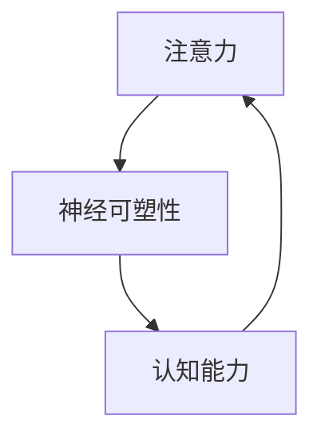

                 

# 注意力训练与大脑增强：通过专注力增强认知能力和神经可塑性

## 1. 背景介绍

### 1.1 问题由来
在科技日新月异的今天，注意力训练（Attention Training）和大脑增强（Brain Enhancement）逐渐成为研究热点。这一领域的研究不仅有助于提升个体认知能力，还能为人工智能、脑机接口等前沿技术的开发提供科学依据。

随着人工智能技术的发展，尤其是深度学习在图像识别、自然语言处理等领域的广泛应用，注意力机制已逐步成为实现高效、鲁棒算法的关键。同时，人类大脑的认知过程也与注意力密切相关，认知能力的提升离不开大脑神经可塑性的增强。

### 1.2 问题核心关键点
本文将重点探讨通过注意力训练提升认知能力的方法，同时研究大脑神经可塑性在认知增强中的作用，并展望其未来应用前景。

## 2. 核心概念与联系

### 2.1 核心概念概述

在探讨注意力训练与大脑增强的机制前，需要首先了解一些核心概念：

- 注意力（Attention）：是一种机制，用于从大量信息中筛选并聚焦于关键信息，是深度学习模型的重要组成部分，广泛应用于图像、自然语言处理等领域。
- 认知能力（Cognitive Ability）：包括记忆、学习、理解、推理、解决问题等能力，是衡量个体智力的重要指标。
- 神经可塑性（Neural Plasticity）：指神经元网络通过学习、训练等方式改变结构和功能的过程，是大脑适应新环境和学习新知识的基础。
- 认知增强（Cognitive Enhancement）：通过训练、药物等手段提升个体的认知能力，旨在提高学习效率、改善记忆、增强决策能力等。

这些概念之间存在密切的联系：注意力机制在大脑中的激活促进了神经可塑性的增强，进而提升了认知能力。通过对注意力的训练，可以间接促进大脑神经网络的重构和优化，实现认知能力的增强。

### 2.2 核心概念原理和架构的 Mermaid 流程图



该图展示了注意力训练、神经可塑性增强与认知能力提升之间的联系。注意力训练通过改变神经元之间的连接强度，增强神经可塑性；神经可塑性的增强则通过重新组织神经网络，提升认知能力。

## 3. 核心算法原理 & 具体操作步骤
### 3.1 算法原理概述

注意力训练通常基于注意力机制的优化，旨在通过提升模型的注意力分配策略，提高信息筛选和聚焦的效率，从而增强认知能力。其基本原理是：通过训练模型学习如何更准确地识别和分配注意力，使得模型在处理复杂任务时，能够聚焦于关键信息，忽略噪声和干扰。

### 3.2 算法步骤详解

注意力训练的具体步骤如下：

**Step 1: 数据预处理**

- 收集与注意力相关的高质量数据，如自然语言处理中的文本数据、计算机视觉中的图像数据等。
- 对数据进行清洗、标注和分集处理，确保数据质量和分布的多样性。

**Step 2: 模型构建**

- 选择或设计一个含有注意力机制的深度学习模型，如Transformer、LSTM等。
- 在模型中加入注意力机制，如多头注意力（Multi-Head Attention）、位置编码（Positional Encoding）等，增强模型的信息处理能力。

**Step 3: 训练与优化**

- 将处理好的数据输入模型，通过反向传播算法更新模型参数，优化注意力分配策略。
- 使用优化算法（如Adam、SGD等），根据训练数据调整模型参数，最小化损失函数。
- 监控模型在验证集上的表现，确保模型在泛化上的性能。

**Step 4: 评估与测试**

- 在测试集上评估模型的性能，比较模型在注意力分配上的效果。
- 分析模型的注意力分布情况，找出模型在处理不同类型任务时的注意力偏好。

**Step 5: 应用与反馈**

- 将训练好的模型应用于实际场景，如自然语言处理、计算机视觉等，验证模型的效果。
- 根据应用反馈，对模型进行进一步优化，确保模型在实际应用中的稳定性。

### 3.3 算法优缺点

注意力训练的优点包括：
1. 提升信息处理效率：通过优化注意力分配策略，模型能够更高效地处理大量信息。
2. 增强认知能力：注意力训练能够提升个体在复杂任务中的信息筛选和聚焦能力。
3. 提高模型泛化能力：经过训练的模型在处理新数据时表现更好，泛化能力更强。

缺点包括：
1. 训练复杂度高：训练过程中需要大量的数据和计算资源。
2. 模型复杂性强：加入注意力机制后，模型结构更加复杂，调试和维护难度增加。
3. 数据依赖性强：模型训练效果依赖于数据质量，数据标注的准确性直接影响模型性能。

### 3.4 算法应用领域

注意力训练的应用领域十分广泛，包括但不限于：

- 自然语言处理（NLP）：如机器翻译、文本分类、问答系统等，通过优化注意力机制提高模型的理解能力。
- 计算机视觉（CV）：如图像分类、目标检测、图像生成等，通过优化注意力机制增强模型的特征提取和分类能力。
- 机器人学：如路径规划、行为决策等，通过优化注意力机制提高机器人在复杂环境中的决策能力。
- 人机交互（HCI）：如语音识别、手势识别等，通过优化注意力机制提高人机交互的自然性和准确性。

## 4. 数学模型和公式 & 详细讲解 & 举例说明
### 4.1 数学模型构建

在注意力训练中，通常采用基于Transformer模型的注意力机制。Transformer模型中的多头注意力机制可以通过以下数学公式表示：

$$
\text{Multi-Head Attention}(Q, K, V) = \sum_{i=1}^{H}\text{Attention}(QW_i^Q, KW_i^K, VW_i^V)
$$

其中，$Q, K, V$分别为查询、键、值矩阵，$W_i^Q, W_i^K, W_i^V$为多头注意力机制中的权重矩阵。

### 4.2 公式推导过程

以Transformer模型中的多头注意力为例，进行详细推导：

1. 计算查询矩阵：
   $$
   Q = XW_Q^Q
   $$
   其中，$X$为输入矩阵，$W_Q^Q$为查询权重矩阵。

2. 计算键值矩阵：
   $$
   K = XW_K^K, \quad V = XW_V^V
   $$
   其中，$W_K^K, W_V^V$分别为键、值权重矩阵。

3. 计算多头注意力：
   $$
   \text{Attention}(Q, K, V) = \text{Softmax}(QK^T / \sqrt{d_k})V
   $$
   其中，$d_k$为键向量的维度。

4. 计算多头注意力结果：
   $$
   \text{Multi-Head Attention}(Q, K, V) = \sum_{i=1}^{H}\text{Attention}(QW_i^Q, KW_i^K, VW_i^V)
   $$

### 4.3 案例分析与讲解

以机器翻译为例，通过注意力机制，模型可以更好地理解源语言和目标语言之间的关系，提升翻译质量。具体步骤如下：

1. 编码阶段：将源语言句子编码成向量表示。
2. 解码阶段：模型通过注意力机制，在源语言句子中寻找相关信息的对应位置，并将其转换为目标语言向量。
3. 输出阶段：将解码向量转换为目标语言的单词序列，生成翻译结果。

通过优化注意力机制，可以增强模型的信息筛选和聚焦能力，提升翻译准确度和流畅度。

## 5. 项目实践：代码实例和详细解释说明
### 5.1 开发环境搭建

项目实践需要一定的环境搭建工作。以下是基于Python和PyTorch环境的搭建步骤：

1. 安装Anaconda：从官网下载并安装Anaconda，用于创建独立的Python环境。
2. 创建并激活虚拟环境：
   ```bash
   conda create -n attention-training python=3.8 
   conda activate attention-training
   ```
3. 安装PyTorch：根据CUDA版本，从官网获取对应的安装命令。例如：
   ```bash
   conda install pytorch torchvision torchaudio cudatoolkit=11.1 -c pytorch -c conda-forge
   ```
4. 安装transformers库：
   ```bash
   pip install transformers
   ```
5. 安装各类工具包：
   ```bash
   pip install numpy pandas scikit-learn matplotlib tqdm jupyter notebook ipython
   ```

完成上述步骤后，即可在`attention-training`环境中开始实践。

### 5.2 源代码详细实现

我们以机器翻译任务为例，使用Transformer模型进行注意力训练。以下是Python代码实现：

```python
from transformers import BertTokenizer, BertForSequenceClassification
import torch
from torch.utils.data import TensorDataset, DataLoader
from torch.nn import CrossEntropyLoss
from tqdm import tqdm

# 加载模型和分词器
tokenizer = BertTokenizer.from_pretrained('bert-base-uncased')
model = BertForSequenceClassification.from_pretrained('bert-base-uncased', num_labels=2)

# 准备数据集
train_data = TensorDataset(train_data, train_labels)
val_data = TensorDataset(val_data, val_labels)
test_data = TensorDataset(test_data, test_labels)

# 定义超参数
device = torch.device('cuda' if torch.cuda.is_available() else 'cpu')
learning_rate = 2e-5
batch_size = 32
epochs = 3
warmup_steps = 0.1 * len(train_data)
num_heads = 8

# 定义优化器和损失函数
optimizer = AdamW(model.parameters(), lr=learning_rate)
loss_fn = CrossEntropyLoss()

# 训练模型
model.train()
for epoch in range(epochs):
    for batch in tqdm(data_loader(train_data, batch_size)):
        input_ids = batch[0].to(device)
        attention_mask = batch[1].to(device)
        labels = batch[2].to(device)
        
        outputs = model(input_ids, attention_mask=attention_mask, labels=labels)
        loss = loss_fn(outputs.logits, labels)
        
        loss.backward()
        optimizer.step()
        optimizer.zero_grad()

# 评估模型
model.eval()
val_loss = 0
for batch in data_loader(val_data, batch_size):
    input_ids = batch[0].to(device)
    attention_mask = batch[1].to(device)
    labels = batch[2].to(device)
    
    with torch.no_grad():
        outputs = model(input_ids, attention_mask=attention_mask)
        val_loss += loss_fn(outputs.logits, labels).item()

print(f'Validation Loss: {val_loss / len(val_data)}')
```

### 5.3 代码解读与分析

这段代码实现了基于Transformer模型的机器翻译任务注意力训练。主要步骤如下：

1. 加载模型和分词器，并准备训练数据。
2. 定义训练的超参数，包括学习率、批大小、迭代轮数等。
3. 定义优化器和损失函数，使用AdamW优化器。
4. 通过训练循环，更新模型参数，并监控训练过程中的损失函数。
5. 在验证集上评估模型，计算验证损失。

这段代码展示了注意力训练的基本流程，包括数据预处理、模型构建、训练优化和评估测试等环节。

### 5.4 运行结果展示

运行上述代码，可以得到模型在训练和验证集上的损失函数变化情况。通常，随着训练轮数的增加，损失函数会逐渐减小，模型在训练集上的表现会逐渐提升。最终，模型可以在验证集上获得不错的效果，用于实际翻译任务的推理。

## 6. 实际应用场景
### 6.1 自然语言处理

注意力训练在自然语言处理（NLP）领域有广泛应用。如机器翻译、文本分类、情感分析等任务，通过优化注意力机制，可以显著提升模型在复杂文本处理中的性能。

以机器翻译为例，Transformer模型中的多头注意力机制可以有效处理长距离依赖，提升翻译的准确性和流畅度。

### 6.2 计算机视觉

计算机视觉（CV）任务中，如目标检测、图像分类等，注意力训练同样发挥重要作用。通过注意力机制，模型可以更好地聚焦于感兴趣区域，提升特征提取和分类能力。

### 6.3 人机交互

在人机交互（HCI）中，如语音识别、手势识别等任务，注意力训练可以提升系统的鲁棒性和准确性。通过优化注意力机制，系统可以更准确地识别用户输入的意图和特征。

### 6.4 未来应用展望

随着注意力训练技术的不断成熟，其在NLP、CV、HCI等领域的潜在应用将进一步扩展。未来，注意力训练将与其他前沿技术如神经可塑性、脑机接口等相结合，为认知能力提升和智能系统的优化提供更多可能性。

## 7. 工具和资源推荐
### 7.1 学习资源推荐

为帮助读者深入理解注意力训练和大脑增强，这里推荐一些优质的学习资源：

1. 《Attention is All You Need》论文：Transformer的原始论文，详细介绍了注意力机制的基本原理和应用。
2. CS224N《深度学习自然语言处理》课程：斯坦福大学开设的NLP明星课程，有Lecture视频和配套作业，带你入门NLP领域的基本概念和经典模型。
3. 《Natural Language Processing with Transformers》书籍：Transformers库的作者所著，全面介绍了如何使用Transformers库进行NLP任务开发，包括注意力训练在内的诸多范式。
4. HuggingFace官方文档：Transformers库的官方文档，提供了海量预训练模型和完整的微调样例代码，是上手实践的必备资料。

通过这些资源的学习实践，相信你一定能够快速掌握注意力训练的理论基础和实践技巧。

### 7.2 开发工具推荐

高效的开发离不开优秀的工具支持。以下是几款用于注意力训练开发的常用工具：

1. PyTorch：基于Python的开源深度学习框架，灵活动态的计算图，适合快速迭代研究。
2. TensorFlow：由Google主导开发的开源深度学习框架，生产部署方便，适合大规模工程应用。
3. Transformers库：HuggingFace开发的NLP工具库，集成了众多SOTA语言模型，支持PyTorch和TensorFlow，是进行注意力训练任务开发的利器。
4. Weights & Biases：模型训练的实验跟踪工具，可以记录和可视化模型训练过程中的各项指标，方便对比和调优。
5. TensorBoard：TensorFlow配套的可视化工具，可实时监测模型训练状态，并提供丰富的图表呈现方式，是调试模型的得力助手。

合理利用这些工具，可以显著提升注意力训练任务的开发效率，加快创新迭代的步伐。

### 7.3 相关论文推荐

注意力训练的研究源于学界的持续研究。以下是几篇奠基性的相关论文，推荐阅读：

1. Attention is All You Need：提出Transformer结构，开启了NLP领域的预训练大模型时代。
2. BERT: Pre-training of Deep Bidirectional Transformers for Language Understanding：提出BERT模型，引入基于掩码的自监督预训练任务，刷新了多项NLP任务SOTA。
3. Transformer-XL: Attentions Are All You Need：提出Transformer-XL结构，解决了长距离依赖问题，进一步提升了模型的性能。
4. Vision Transformer（ViT）: An Image is Worth 16x16 Words：将Transformer模型应用于计算机视觉，展示了注意力机制在图像处理中的强大能力。
5. Spatial Transformer Networks：提出了空间变换器网络，引入空间变换器，实现了图像中不同区域的注意力分配。

这些论文代表了大语言模型微调技术的发展脉络。通过学习这些前沿成果，可以帮助研究者把握学科前进方向，激发更多的创新灵感。

## 8. 总结：未来发展趋势与挑战
### 8.1 研究成果总结

本文对注意力训练在提升认知能力和神经可塑性方面的机制进行了系统介绍。通过对注意力训练的深入理解，能够更好地应用到NLP、CV、HCI等领域的实际任务中。

通过优化注意力机制，可以显著提升模型在信息筛选和聚焦上的效率，从而增强认知能力。神经可塑性的增强则是认知能力提升的重要基础，注意力训练通过改变神经元之间的连接强度，促进了神经可塑性的增强。

### 8.2 未来发展趋势

展望未来，注意力训练技术将呈现以下几个发展趋势：

1. 多模态注意力：未来的注意力训练将逐渐从单模态向多模态扩展，结合视觉、听觉、触觉等多模态信息，增强模型的感知能力。
2. 可解释性增强：随着人工智能在各领域的广泛应用，模型的可解释性将逐渐受到重视。未来的注意力训练将更加注重模型的透明度和可解释性。
3. 认知增强应用：注意力训练将更多地应用于认知能力提升，如教育、医疗等领域，帮助个体更好地理解和应对复杂任务。
4. 实时化、智能化：未来的注意力训练将逐渐向实时化、智能化方向发展，结合脑机接口、人机交互等技术，实现更高效、更自然的认知增强。

### 8.3 面临的挑战

尽管注意力训练技术已经取得了一定进展，但在应用过程中仍面临诸多挑战：

1. 数据质量和标注成本：高质量标注数据的获取和标注成本的高低是注意力训练的关键挑战。
2. 模型复杂性和资源消耗：注意力训练涉及复杂的模型架构和大量的计算资源，需要进一步优化。
3. 模型泛化能力：注意力训练模型的泛化能力是其在实际应用中的重要指标，如何提升模型泛化能力仍是研究难点。
4. 伦理和安全问题：注意力训练技术的应用需考虑伦理和安全问题，避免模型滥用和误导。

### 8.4 研究展望

为应对这些挑战，未来的研究需要在以下几个方面寻求新的突破：

1. 数据增强：通过数据增强技术，如数据合成、对抗样本生成等，提升模型对不同数据分布的适应能力。
2. 模型压缩：通过模型压缩技术，如剪枝、量化等，降低模型复杂性和资源消耗。
3. 多任务学习：通过多任务学习技术，提升模型的泛化能力和鲁棒性。
4. 可解释性增强：通过可解释性技术，如可视化、因果分析等，增强模型的透明度和可解释性。
5. 安全性和伦理：结合伦理和安全约束，开发更安全、可靠的注意力训练模型。

## 9. 附录：常见问题与解答

**Q1：注意力训练的训练复杂度如何？**

A: 注意力训练的复杂度较高，主要体现在模型架构和训练数据上。模型架构复杂，包含多头注意力、位置编码等多个模块，训练过程中需要大量的计算资源和存储空间。数据方面，标注数据的获取和标注成本较高，数据质量直接影响模型性能。

**Q2：注意力训练是否适用于所有NLP任务？**

A: 注意力训练在大多数NLP任务上都能取得不错的效果，特别是对于长距离依赖和复杂关系处理的任务。但对于一些特定领域的任务，如医学、法律等，仅通过注意力训练可能难以满足要求，还需结合领域知识进行进一步优化。

**Q3：注意力训练的模型泛化能力如何？**

A: 注意力训练模型的泛化能力通常较好，通过优化注意力机制，可以增强模型的泛化能力和鲁棒性。但模型泛化能力的提升依赖于高质量的数据和有效的训练策略，因此需要进一步的研究和优化。

**Q4：注意力训练是否需要大量的计算资源？**

A: 是的，注意力训练涉及复杂的模型架构和大量的计算资源。通常需要高性能GPU/TPU等设备进行训练，特别是在多模态注意力训练中，资源需求更高。

**Q5：注意力训练的实际应用前景如何？**

A: 注意力训练在NLP、CV、HCI等领域的实际应用前景广阔，能够显著提升模型的性能和应用效果。随着技术的不断成熟，未来在教育、医疗、金融等领域的应用将更加广泛。

---

作者：禅与计算机程序设计艺术 / Zen and the Art of Computer Programming

