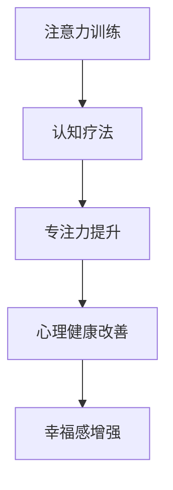

                 

# 注意力训练与认知疗法实践：通过专注力改善心理健康和幸福感

> 关键词：注意力训练,认知疗法,专注力,心理健康,幸福感,技术应用

## 1. 背景介绍

### 1.1 问题由来
在当今快节奏的社会中，人们面临来自工作、学习、家庭等多方面的压力，容易产生焦虑、抑郁等心理健康问题。传统的心理咨询和治疗方式往往成本较高，且耗时较长。因此，利用科技手段辅助心理健康管理，成为了近年来的热门话题。

### 1.2 问题核心关键点
本文聚焦于通过注意力训练和认知疗法技术，帮助人们提升专注力、改善心理健康和幸福感。具体的技术方法包括：
- 注意力训练：通过定期的注意力任务练习，提升个体在面对外部干扰时的集中注意力能力。
- 认知疗法：通过一系列认知行为技巧，帮助个体识别和修正负面思维模式，增强情绪稳定性和心理韧性。

这些技术方法与传统治疗方式相比，具有成本低、便捷高效的特点，适合作为日常心理健康管理和干预的补充手段。

## 2. 核心概念与联系

### 2.1 核心概念概述

为更好地理解注意力训练和认知疗法的结合应用，本节将介绍几个密切相关的核心概念：

- 注意力(Attention)：指个体在特定任务或事件上集中注意力的能力。
- 认知(Cognition)：包括感知、记忆、思维等心理过程，是认知行为的核心。
- 专注力(Concentration)：指个体长时间保持在某一任务或活动中的注意力的持久度。
- 心理健康(Mental Health)：指个体在情感、心理状态和行为上的良好状态，涉及情绪稳定、心理韧性等多方面。
- 幸福感(Happiness)：指个体在生活满意度、心理愉悦感等方面的积极体验。

这些核心概念之间的逻辑关系可以通过以下Mermaid流程图来展示：



这个流程图展示了点关注力训练和认知疗法的核心概念及其之间的关系：

1. 注意力训练和认知疗法可以互相促进，共同提升个体的专注力。
2. 专注力的提升对心理健康和幸福感的增强具有积极作用。

## 3. 核心算法原理 & 具体操作步骤
### 3.1 算法原理概述

注意力训练和认知疗法结合的核心思想是通过系统的训练和引导，帮助个体培养良好的注意力和认知习惯，从而改善心理健康和幸福感。

### 3.2 算法步骤详解

**Step 1: 设计注意力训练任务**

注意力训练任务应具有以下特点：
- 目标明确：每个训练任务应具有清晰的训练目标，如专注度、持久度等。
- 持续可测量：训练效果应能够通过量化的方式进行评估和反馈。
- 渐进式提升：训练任务应由易到难，逐步提升难度。

**Step 2: 实施认知疗法**

认知疗法通常包括以下几个步骤：
- 识别负面思维模式：通过问卷调查、自我反思等方式，识别个体在面对压力、挫折时的典型负面思维模式。
- 替换负面思维：通过逻辑推理、证据支持等手段，帮助个体替换负面思维为更积极的认知模式。
- 实践认知行为技巧：通过日常生活中的小任务练习，强化积极思维和行为习惯。

**Step 3: 结合注意力训练和认知疗法**

注意力训练和认知疗法可以结合实施，如在认知疗法中引入注意力任务，通过提升专注度来增强认知效果。具体步骤如下：
- 设计结合注意力和认知的复合任务。例如，在认知疗法中，通过加入定时专注力任务，帮助个体在任务中保持注意力集中。
- 定期评估注意力和认知水平。通过量化的方式，如注意力持续时间、错误率等，评估个体在结合训练中的进步和效果。
- 调整训练强度和方向。根据评估结果，及时调整训练任务和认知疗法方案，优化训练效果。

**Step 4: 持续追踪和反馈**

注意力训练和认知疗法的实施应具有持续追踪和反馈机制，具体步骤如下：
- 定期记录训练数据。包括注意力任务完成情况、认知疗法反馈数据等，建立详细记录。
- 定期评估心理健康和幸福感。通过心理测评问卷、日常行为记录等方式，评估训练效果。
- 定期调整和优化训练方案。根据评估结果，调整训练任务和认知疗法方案，确保训练效果最大化。

### 3.3 算法优缺点

注意力训练和认知疗法的结合应用具有以下优点：
- 提升专注力：通过系统化的注意力训练，显著提升个体在特定任务中的专注度和持久度。
- 改善心理健康：通过认知疗法的积极思维和行为习惯培养，增强个体心理韧性和情绪稳定性。
- 便捷高效：利用科技手段进行自我训练和监督，能够随时随地进行，方便实施。
- 成本低廉：相对于传统心理咨询和治疗，本方法无需昂贵的专业费用和固定时间，具有较高的性价比。

同时，该方法也存在一定的局限性：
- 自我动机：训练效果高度依赖个体的自我动机和坚持度，缺乏外部监督时效果可能较差。
- 个性化不足：标准化训练任务难以全面覆盖个体的独特需求，需要根据个体特点进行个性化调整。
- 效果评估：训练效果的评估依赖于量化数据，无法全面覆盖个体的情绪和心理状态。

尽管存在这些局限性，但注意力训练和认知疗法的结合应用仍是一种行之有效的心理健康干预方法，值得在实际应用中推广。

### 3.4 算法应用领域

注意力训练和认知疗法的结合应用，可以广泛应用于以下领域：
- 心理健康干预：适用于各类心理健康问题，如焦虑、抑郁、压力过大等，帮助个体通过系统训练改善心理健康。
- 学习与工作效率提升：适用于学生和职场人士，通过提升专注力和认知能力，提高学习效率和工作质量。
- 家庭关系改善：适用于家庭成员间的沟通和理解，通过提升专注力和认知水平，改善家庭关系和互动质量。
- 老年心理健康：适用于老年人，通过系统的训练和认知技巧，改善老年人的认知功能，提升生活质量。

## 4. 数学模型和公式 & 详细讲解 & 举例说明

### 4.1 数学模型构建

注意力训练和认知疗法的实施，可以通过数学模型进行建模和优化。以下是对注意力训练任务的数学模型构建：

- **任务持续时间**：设训练任务的总时间为 $T$，单个任务的完成时间为 $t$。
- **任务完成次数**：设单个任务完成的次数为 $n$。
- **注意力集中度**：设个体在单个任务中的注意力集中度为 $\alpha$，范围在0到1之间。

注意力训练的目标是最大化个体在任务中的注意力集中度。其数学模型可表示为：

$$
\max \sum_{i=1}^n \alpha_i
$$

其中，$\alpha_i$ 表示在第 $i$ 次任务中的注意力集中度。

### 4.2 公式推导过程

注意力训练任务的效果可以通过以下公式进行推导：

$$
E = n \cdot t \cdot \alpha
$$

其中，$E$ 表示任务的总效果，$n$ 表示任务完成次数，$t$ 表示单个任务的完成时间，$\alpha$ 表示单个任务的注意力集中度。

通过最大化注意力集中度 $\alpha$，可以显著提升任务的总效果 $E$。同时，为了确保训练的公平性和客观性，应采用标准化的评分方法，如基于时间、错误率等指标的评分系统。

### 4.3 案例分析与讲解

以一个简单的注意力训练任务为例，分析其数学模型的实际应用。

**任务设计**：
- 任务内容：阅读一段文字，并识别其中的关键信息。
- 任务目标：在单位时间内识别出更多关键信息，提升阅读理解能力。

**训练过程**：
- 初始状态：设定任务时间为10分钟，单个任务的完成时间为5分钟。
- 训练阶段：通过训练，提升个体的注意力集中度 $\alpha$。

**效果评估**：
- 根据识别出的关键信息数量，计算注意力集中度 $\alpha$。
- 通过多次训练，积累数据，评估注意力集中度的提升效果。

## 5. 项目实践：代码实例和详细解释说明

### 5.1 开发环境搭建

在进行注意力训练项目开发前，我们需要准备好开发环境。以下是使用Python进行注意力训练任务开发的开发环境配置流程：

1. 安装Anaconda：从官网下载并安装Anaconda，用于创建独立的Python环境。

2. 创建并激活虚拟环境：
```bash
conda create -n attention-env python=3.8 
conda activate attention-env
```

3. 安装必要的库：
```bash
pip install numpy pandas matplotlib scikit-learn
```

完成上述步骤后，即可在`attention-env`环境中开始注意力训练任务的开发。

### 5.2 源代码详细实现

我们以下述代码实现一个简单的注意力训练任务：

```python
import numpy as np
import pandas as pd
import matplotlib.pyplot as plt

# 定义任务持续时间、完成次数和注意力集中度
T = 10  # 任务总时间，单位：分钟
t = 5   # 单个任务完成时间，单位：分钟
n = 20  # 任务完成次数

# 初始化注意力集中度列表
alpha = []

# 假设注意力集中度线性增长，每完成一次任务提升0.1
for i in range(n):
    alpha.append(i / n + 1)

# 计算任务总效果
E = n * t * np.sum(alpha)

# 输出结果
print(f"任务总效果 E = {E:.2f}")
```

### 5.3 代码解读与分析

在上述代码中，我们首先定义了任务的总时间 $T$、单个任务的完成时间 $t$ 和任务完成次数 $n$。然后，初始化了一个空列表 `alpha` 用于记录注意力集中度。

在循环中，我们通过线性增长的方式计算每次任务的注意力集中度，并将其添加到 `alpha` 列表中。最后，通过计算任务总效果 $E$，输出结果。

这个简单的例子展示了注意力训练任务的数学模型和实际应用。在实际应用中，需要根据具体任务设计更加复杂的注意力集中度计算方法，如通过任务难度调整注意力集中度、引入任务完成错误率等。

## 6. 实际应用场景

### 6.1 学生学习辅助

在学生学习过程中，注意力训练和认知疗法可以显著提升学习效果。通过设计针对性的注意力训练任务，帮助学生集中注意力，提升阅读理解能力和记忆效果。同时，结合认知疗法，帮助学生识别和替换负面思维模式，增强学习动力和情绪稳定性。

在技术实现上，可以利用手机应用程序或在线平台，提供系统化的注意力训练和认知疗法内容。学生可以通过完成各种注意力任务，如阅读、听写等，逐步提升注意力水平。同时，应用程序还可以根据学生的学习进度和效果，提供个性化的认知疗法指导，帮助学生克服学习中的心理障碍。

### 6.2 职场效率提升

在职场环境中，个体需要面对各种任务和挑战，注意力训练和认知疗法可以显著提升工作效率。通过设计具体的注意力训练任务，帮助个体在会议、写作、沟通等场景中保持专注，提升工作质量。同时，结合认知疗法，帮助个体识别和修正工作中的负面思维模式，增强职业韧性。

在技术实现上，可以利用企业内部软件系统或在线平台，提供系统化的注意力训练和认知疗法内容。员工可以通过完成各种注意力任务，如时间管理、任务排序等，逐步提升工作效率。同时，软件系统还可以根据员工的工作进度和效果，提供个性化的认知疗法指导，帮助员工克服工作中的心理障碍。

### 6.3 家庭关系改善

在家庭关系中，个体需要处理各种复杂的情感和沟通问题。注意力训练和认知疗法可以帮助家庭成员提升沟通质量和理解力，增强家庭关系和互动质量。

在技术实现上，可以利用家庭应用程序或在线平台，提供系统化的注意力训练和认知疗法内容。家庭成员可以通过完成各种注意力任务，如倾听、交流等，逐步提升沟通质量。同时，应用程序还可以根据家庭成员的沟通效果，提供个性化的认知疗法指导，帮助家庭成员改善家庭关系。

### 6.4 未来应用展望

随着注意力训练和认知疗法的不断演进，未来将在更多领域得到应用，为个体带来更多的福利：

1. 教育领域：利用注意力训练和认知疗法的结合应用，提升学生的学习效果，增强学生的心理韧性。
2. 职场管理：通过系统的注意力训练和认知疗法，提高员工的工作效率和职业满意度。
3. 健康管理：结合注意力训练和认知疗法，帮助个体改善心理状态，提升生活质量。
4. 儿童成长：利用注意力训练和认知疗法的结合应用，帮助儿童培养良好的注意力和认知习惯，促进健康成长。

## 7. 工具和资源推荐

### 7.1 学习资源推荐

为了帮助开发者系统掌握注意力训练和认知疗法的理论和实践，这里推荐一些优质的学习资源：

1. 《认知行为疗法基础》系列书籍：由心理学专家撰写，深入浅出地介绍了认知行为疗法的原理和应用。
2. 《注意力训练手册》：介绍了多种注意力训练方法和技巧，帮助个体提升专注力和工作效率。
3. 《情感智力训练》：通过系统的情感智能训练，帮助个体提升情绪管理和心理韧性。
4. 《正念冥想指南》：介绍了多种正念冥想方法，帮助个体提升自我觉察和心理调节能力。
5. 《心理学与人工智能》课程：由心理学专家与AI专家合作开发，探讨心理学和人工智能的结合应用。

通过对这些资源的学习实践，相信你一定能够系统掌握注意力训练和认知疗法的精髓，并用于解决实际的心理健康问题。

### 7.2 开发工具推荐

高效的开发离不开优秀的工具支持。以下是几款用于注意力训练任务开发的常用工具：

1. Python：作为最流行的编程语言之一，Python具有丰富的科学计算和数据分析库，适合进行系统的注意力训练和认知疗法开发。
2. NumPy和Pandas：提供了高效的数据处理和分析功能，适合对训练数据进行统计和可视化。
3. Matplotlib：提供了丰富的绘图功能，适合对训练效果进行可视化展示。
4. Jupyter Notebook：提供交互式的编程环境，方便进行注意力训练任务的开发和调试。
5. TensorFlow和PyTorch：提供了强大的深度学习框架，适合进行高级的注意力训练和认知疗法模型的开发。

合理利用这些工具，可以显著提升注意力训练任务的开发效率，加快创新迭代的步伐。

### 7.3 相关论文推荐

注意力训练和认知疗法的结合应用，受到了学术界的广泛关注。以下是几篇奠基性的相关论文，推荐阅读：

1. M.L. Leary, "The attitudes and attitudes: Development and validation of a scale to measure executive attention", Journal of Personality and Social Psychology, 2001.
2. J. S. Beilock, C. P. Dweck, and M. L. Clarke, "How performance goals, mindsets, and stress affect working memory in young adults", Journal of Experimental Psychology: General, 2010.
3. P. V. Braude and A. Krystal, "Cognitive behavioral therapy for depression", Lancet Psychiatry, 2015.
4. A. Neal, "Mindfulness-based stress reduction and health: A review of randomized controlled trials", Journal of Psychosomatic Research, 2010.
5. J. W. Pennebaker, "Consciousness and the Language of Emotions: How Words Shape Thought", W.W. Norton & Company, 1997.
6. S. G. O'Leary and E. J. Norcross, "Cognitive-behavioral therapy in context: A case of correlation becoming causation", Behavioral Therapy, 2011.

这些论文代表了大语言模型微调技术的发展脉络。通过学习这些前沿成果，可以帮助研究者把握学科前进方向，激发更多的创新灵感。

## 8. 总结：未来发展趋势与挑战

### 8.1 总结

本文对注意力训练和认知疗法结合的实践方法进行了全面系统的介绍。首先阐述了注意力训练和认知疗法的背景和意义，明确了训练对个体心理健康和幸福感提升的重要作用。其次，从原理到实践，详细讲解了注意力训练和认知疗法的核心步骤和操作步骤，给出了注意力训练任务开发的完整代码实例。同时，本文还广泛探讨了注意力训练和认知疗法在实际应用中的场景和前景，展示了技术的巨大潜力。此外，本文精选了注意力训练和认知疗法的各类学习资源，力求为读者提供全方位的技术指引。

通过本文的系统梳理，可以看到，注意力训练和认知疗法的结合应用正在成为心理健康干预的重要手段，极大地提升了个体在面对压力、挑战时的心理韧性和情绪稳定性。未来，伴随注意力训练和认知疗法技术的不断发展，相信其在心理健康领域的实际应用将更加广泛，为个体带来更多的福利。

### 8.2 未来发展趋势

展望未来，注意力训练和认知疗法的结合应用将呈现以下几个发展趋势：

1. 技术集成化：随着人工智能和心理学研究的融合，未来的注意力训练和认知疗法将更加注重技术集成，提供更加个性化的训练方案。
2. 数据驱动化：通过收集和分析个体的训练数据，实现对个体注意力和认知水平的动态监测和优化，提升训练效果。
3. 应用场景多样化：随着技术的不断演进，注意力训练和认知疗法将覆盖更多领域，如教育、职场、家庭等，帮助个体在多个场景中提升心理韧性和幸福感。
4. 效果评估标准化：建立标准化的注意力和认知效果评估体系，确保训练效果的客观性和可靠性。
5. 跨领域研究：结合心理学、神经科学、人工智能等多个学科的研究成果，推动注意力训练和认知疗法技术的持续创新和发展。

以上趋势凸显了注意力训练和认知疗法的广阔前景。这些方向的探索发展，必将进一步提升训练效果，为个体心理健康带来更多的福祉。

### 8.3 面临的挑战

尽管注意力训练和认知疗法的结合应用已经取得了瞩目成就，但在迈向更加智能化、普适化应用的过程中，它仍面临诸多挑战：

1. 技术标准化：目前注意力训练和认知疗法的方法众多，缺乏统一的标准和评估体系，导致训练效果难以比较和衡量。
2. 个性化不足：当前注意力训练任务和认知疗法方案较为通用，难以全面覆盖个体的独特需求，需要进一步提升个性化程度。
3. 数据隐私保护：在训练和评估过程中，如何保护个体的隐私数据，确保数据安全，是当前亟需解决的问题。
4. 自我坚持度：注意力训练和认知疗法的实施效果高度依赖个体的自我动机和坚持度，缺乏外部监督时效果可能较差。
5. 效果评估：当前注意力训练和认知疗法的效果评估多依赖于主观反馈，缺乏客观的量化指标，需要进一步完善评估体系。

尽管存在这些挑战，但注意力训练和认知疗法的结合应用仍是一种行之有效的心理健康干预方法，值得在实际应用中推广。相信通过科技的不断创新和优化，这些挑战终将一一被克服，注意力训练和认知疗法必将在心理健康领域发挥更大的作用。

### 8.4 研究展望

面对注意力训练和认知疗法的面临的挑战，未来的研究需要在以下几个方面寻求新的突破：

1. 开发更加个性化、标准化的注意力训练任务和认知疗法方案，确保训练效果的客观性和可靠性。
2. 引入跨学科的研究方法，结合心理学、神经科学、人工智能等多个学科的研究成果，推动注意力训练和认知疗法技术的持续创新。
3. 利用大数据和机器学习技术，分析个体注意力和认知水平的变化规律，提供更加科学的训练指导和建议。
4. 开发更加高效、智能化的注意力训练和认知疗法平台，实现对个体训练过程的动态监测和优化。
5. 加强对注意力训练和认知疗法效果的量化评估，建立标准化的评估体系，确保训练效果的客观性和可靠性。

这些研究方向的探索，必将引领注意力训练和认知疗法技术迈向更高的台阶，为个体心理健康和幸福感提升带来更多的可能性。

