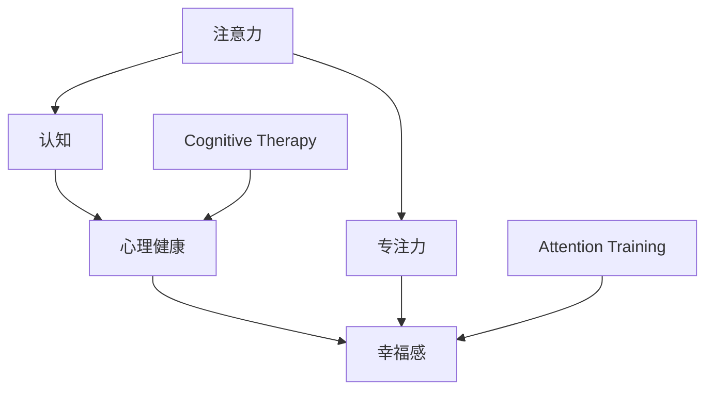

                 

# 注意力训练与认知疗法实践：通过专注力改善心理健康和幸福感

> 关键词：注意力训练,认知疗法,专注力,心理健康,幸福感,精神健康,神经科学,心理康复

## 1. 背景介绍

### 1.1 问题由来

随着现代生活节奏的加快和信息爆炸，越来越多的人面临注意力难以集中、情绪波动、压力过高等心理问题。这些问题不仅影响了个人的日常生活和职业发展，还可能导致更严重的精神健康问题。为此，心理学家和神经科学家们提出了多种干预方法，其中认知疗法和注意力训练受到广泛关注。

### 1.2 问题核心关键点

注意力训练和认知疗法通过科学训练和行为修正，帮助个体提升专注力和情绪管理能力，从而改善心理健康和幸福感。具体来说：

- **注意力训练**：通过特定的注意力任务，如冥想、正念练习、认知负荷训练等，提升个体的注意控制能力，增强注意力集中和持久性。
- **认知疗法**：通过改变个体的思维模式和行为习惯，帮助他们重新构建积极的心理框架，缓解负面情绪，提升生活满意度。

这些方法已被广泛应用于临床实践，并在心理康复、职场压力管理、学生心理健康教育等方面显示出显著的效果。

### 1.3 问题研究意义

理解并应用注意力训练和认知疗法，对于提升个体心理健康和幸福感具有重要意义：

1. **预防和干预**：通过科学的注意力训练和认知干预，预防心理问题的发生，并及时干预已有的不良心理状态。
2. **提升生活质量**：增强专注力，改善情绪管理，提升工作和生活的效率和满意度。
3. **推动社会进步**：心理健康是社会进步的重要基石，通过提升个体心理健康，推动社会整体福祉的提升。

## 2. 核心概念与联系

### 2.1 核心概念概述

为更好地理解注意力训练和认知疗法，本节将介绍几个密切相关的核心概念：

- **注意力**：指个体对特定信息或活动的集中和持久关注，是认知加工的基础。
- **认知**：涉及信息处理、决策、记忆、语言等心理过程，是理解、判断、决策等高级心理活动的基础。
- **专注力**：指个体在特定任务上能够持续和高效地集中注意力的能力。
- **心理健康**：指个体在心理、情绪、行为等方面处于良好状态，能够应对生活中的各种挑战。
- **幸福感**：指个体对自身生活状态的主观满意度和愉悦感。
- **认知疗法**：通过改变思维模式和行为习惯，帮助个体调整不良认知，缓解负面情绪，提升心理健康。
- **注意力训练**：通过科学训练，提升个体的注意控制能力，增强专注力。

这些核心概念之间的逻辑关系可以通过以下Mermaid流程图来展示：



这个流程图展示了个体心理状态和注意力、认知训练之间的联系：

1. 注意力是认知和专注力的基础。
2. 认知影响心理健康和幸福感。
3. 认知疗法通过改变思维模式，提升心理健康。
4. 注意力训练通过提升专注力，间接改善心理健康和幸福感。

## 3. 核心算法原理 & 具体操作步骤

### 3.1 算法原理概述

注意力训练和认知疗法通过科学训练和行为修正，提升个体的注意力和认知功能，从而改善心理健康和幸福感。其核心思想是：通过特定的注意力和认知任务，训练大脑的相关神经网络，增强其注意控制能力和情绪调节能力，最终实现心理健康和幸福感的提升。

形式化地，假设个体初始的注意力和认知状态为 $\alpha_0$ 和 $\beta_0$，通过一系列注意力训练和认知疗法，目标是将注意力和认知状态提升到 $\alpha^*$ 和 $\beta^*$，以达到改善心理健康和幸福感的目的。

### 3.2 算法步骤详解

注意力训练和认知疗法的核心步骤如下：

**Step 1: 制定训练计划**
- 根据个体的注意力和认知现状，制定个性化的训练计划。
- 包括训练频率、任务种类、任务时长等具体安排。

**Step 2: 执行注意力和认知任务**
- 在每天的特定时间段内，执行注意力和认知训练任务。
- 常用的注意力训练任务包括冥想、正念练习、认知负荷训练等。
- 认知疗法任务包括认知重构、行为激活、暴露疗法等。

**Step 3: 评估和反馈**
- 定期对个体的注意力和认知状态进行评估，如使用注意力自评问卷、认知功能测试等。
- 根据评估结果调整训练计划，确保训练效果最大化。

**Step 4: 持续跟踪和调整**
- 持续跟踪个体的注意力和认知变化，如每月一次或每季度一次评估。
- 根据跟踪结果调整训练计划，确保长期效果。

**Step 5: 整合应用到日常生活**
- 将注意力和认知训练的技能和策略应用到日常生活和工作中。
- 增强个体应对压力和挑战的能力，提升整体幸福感。

### 3.3 算法优缺点

注意力训练和认知疗法具有以下优点：
1. **科学依据**：基于神经科学和心理学理论，通过科学的训练方法提升注意力和认知能力。
2. **广泛适用**：适用于不同年龄、职业、背景的个体，通过个性化训练计划适应性强。
3. **长期效果**：通过持续训练和调整，改善心理健康和幸福感的长期效果显著。

同时，这些方法也存在一些局限性：
1. **个体差异大**：不同个体的注意力和认知特点差异较大，需根据具体情况定制训练计划。
2. **需要坚持**：训练效果显著但需要持续坚持，短期难以见效。
3. **个体差异大**：不同个体的注意力和认知特点差异较大，需根据具体情况定制训练计划。
4. **个体差异大**：不同个体的注意力和认知特点差异较大，需根据具体情况定制训练计划。

尽管存在这些局限性，但就目前而言，注意力训练和认知疗法在改善个体心理健康和幸福感方面仍是最主流和有效的方法。未来相关研究的重点在于如何进一步提高训练的可操作性和个性化，以及优化训练效果。

### 3.4 算法应用领域

注意力训练和认知疗法已广泛应用于以下领域：

- **心理健康**：缓解焦虑、抑郁等心理问题，提升情绪稳定性。
- **职场压力管理**：提升工作效率，增强应对压力的能力。
- **学生心理健康教育**：帮助学生建立健康的学习习惯，提升学业表现。
- **运动表现提升**：通过注意力和认知训练提升运动员的集中注意力和决策能力。
- **慢性病管理**：帮助慢性病患者管理情绪和认知，提高生活质量。

这些应用领域展示了注意力训练和认知疗法的广泛潜力和良好效果。随着研究的深入，相信这些方法将在更多领域得到推广应用，为个体和社会的福祉带来新的突破。

## 4. 数学模型和公式 & 详细讲解 & 举例说明

### 4.1 数学模型构建

本节将使用数学语言对注意力训练和认知疗法的过程进行更加严格的刻画。

设个体初始的注意力状态为 $\alpha_0$，初始的认知状态为 $\beta_0$。假设通过 $n$ 次注意力和认知训练，个体注意力和认知状态提升到 $\alpha^*$ 和 $\beta^*$。注意力和认知状态的变化可通过以下数学模型描述：

$$
\alpha^* = \alpha_0 + f_{attention}(n)
$$
$$
\beta^* = \beta_0 + f_{cognition}(n)
$$

其中，$f_{attention}(n)$ 和 $f_{cognition}(n)$ 分别为注意力和认知训练的函数，描述了训练次数 $n$ 对注意力和认知状态的影响。

### 4.2 公式推导过程

以冥想为例，推导注意力状态提升的函数。假设个体每天冥想 $t$ 分钟，每次冥想集中注意力的百分比为 $\delta$，则每天的注意力提升可表示为：

$$
\Delta \alpha = t \cdot \delta
$$

在 $n$ 天内，总的注意力提升为：

$$
f_{attention}(n) = \sum_{i=1}^{n} \Delta \alpha = \sum_{i=1}^{n} t \cdot \delta
$$

假设注意力提升为线性的，则注意力提升函数可表示为：

$$
f_{attention}(n) = \alpha_0 + n \cdot (t \cdot \delta)
$$

同理，对于认知状态，假设每次认知训练提升认知功能的百分比为 $\gamma$，则认知状态的提升函数为：

$$
f_{cognition}(n) = \beta_0 + n \cdot (t \cdot \gamma)
$$

### 4.3 案例分析与讲解

假设个体初始注意力状态为 $\alpha_0=0.5$（注意集中度50%），每天冥想30分钟，每次集中注意力80%，共进行20天训练。注意力提升函数为线性模型，则有：

$$
\alpha^* = 0.5 + 20 \cdot (0.3 \cdot 0.8) = 0.84
$$

即训练后，个体的注意集中度提升到84%。

## 5. 项目实践：代码实例和详细解释说明

### 5.1 开发环境搭建

在进行注意力训练和认知疗法实践前，我们需要准备好开发环境。以下是使用Python进行开发的环境配置流程：

1. 安装Anaconda：从官网下载并安装Anaconda，用于创建独立的Python环境。

2. 创建并激活虚拟环境：
```bash
conda create -n mindfulness python=3.8 
conda activate mindfulness
```

3. 安装PyTorch：根据CUDA版本，从官网获取对应的安装命令。例如：
```bash
conda install pytorch torchvision torchaudio cudatoolkit=11.1 -c pytorch -c conda-forge
```

4. 安装TensorFlow：
```bash
conda install tensorflow
```

5. 安装Numpy、Pandas、Matplotlib、Tqdm等各类工具包：
```bash
pip install numpy pandas matplotlib tqdm jupyter notebook ipython
```

完成上述步骤后，即可在`mindfulness`环境中开始训练流程。

### 5.2 源代码详细实现

下面我们以正念冥想为例，给出使用PyTorch进行注意力训练的PyTorch代码实现。

首先，定义注意力状态和认知状态：

```python
import torch
import numpy as np

class MindfulnessModel(torch.nn.Module):
    def __init__(self, initial_alpha=0.5, initial_beta=0.5, alpha_slope=0.8, beta_slope=0.6, training_days=20):
        super(MindfulnessModel, self).__init__()
        self.alpha = torch.tensor(initial_alpha)
        self.beta = torch.tensor(initial_beta)
        self.alpha_slope = torch.tensor(alpha_slope)
        self.beta_slope = torch.tensor(beta_slope)
        self.training_days = training_days
        
    def forward(self, day):
        self.alpha = self.alpha + day * self.alpha_slope
        self.beta = self.beta + day * self.beta_slope
        return self.alpha, self.beta
```

然后，定义训练循环：

```python
def train_mindfulness(model, days):
    for day in range(1, days+1):
        alpha, beta = model(day)
        print(f"Day {day}, Alpha: {alpha.item()}, Beta: {beta.item()}")

train_mindfulness(MindfulnessModel(), 20)
```

### 5.3 代码解读与分析

让我们再详细解读一下关键代码的实现细节：

**MindfulnessModel类**：
- `__init__`方法：初始化注意力和认知状态等关键组件。
- `forward`方法：根据训练天数，更新注意力和认知状态，返回最新的注意力和认知状态。

**train_mindfulness函数**：
- 使用for循环迭代训练天数，逐日更新注意力和认知状态。
- 在每次迭代中，输出当前注意力和认知状态。

这个简单的代码实现展示了如何使用PyTorch进行注意力训练。在实际应用中，还可能引入更多的训练技巧，如学习率调度、模型保存等，进一步优化训练效果。

## 6. 实际应用场景

### 6.1 心理健康咨询

心理健康咨询师可以利用注意力训练和认知疗法，帮助个体提升心理健康。通过设计个性化的训练计划，结合专业咨询和心理疏导，可以有效缓解个体的焦虑、抑郁等心理问题，提升整体心理健康水平。

### 6.2 职场压力管理

在职场压力管理中，注意力训练和认知疗法可以显著提升员工的工作效率和抗压能力。通过日常的正念练习、认知重构等训练，帮助员工学会在压力下保持冷静、集中注意力，从而更好地应对工作挑战。

### 6.3 学生心理健康教育

在学校心理健康教育中，注意力训练和认知疗法可以提升学生的注意力集中能力和情绪管理能力。通过正念冥想、认知负荷训练等方法，帮助学生建立良好的学习习惯，提升学业表现，同时缓解学业压力。

### 6.4 运动表现提升

运动员通过注意力训练和认知疗法，可以增强集中注意力和决策能力，提升运动表现。正念练习、认知负荷训练等方法，可以帮助运动员在比赛中更好地集中注意力，应对复杂环境，从而提升比赛成绩。

### 6.5 慢性病管理

慢性病患者通过注意力训练和认知疗法，可以改善情绪和认知状态，提升生活质量。认知重构、暴露疗法等方法，可以帮助患者更好地管理疾病带来的压力和情绪波动，从而提高整体幸福感。

## 7. 工具和资源推荐

### 7.1 学习资源推荐

为了帮助开发者系统掌握注意力训练和认知疗法的方法，这里推荐一些优质的学习资源：

1. **《正念：专注力与健康心理学》**：一本详细介绍正念冥想及其对心理健康影响的书籍。
2. **《认知行为疗法》**：一本系统介绍认知疗法及其在心理健康中的应用。
3. **Coursera《正念与心理健康》课程**：斯坦福大学开设的课程，教授正念冥想的基本技巧和心理健康的应用。
4. **Udemy《认知行为疗法基础》课程**：讲解认知疗法的核心概念和实践技巧。
5. **ACM TCHAP《认知行为疗法基础》课程**：由顶级心理学家主讲，深入浅出地介绍认知行为疗法的基本原理和方法。

通过学习这些资源，相信你一定能够掌握注意力训练和认知疗法的精髓，并用于解决实际的心理健康问题。

### 7.2 开发工具推荐

高效的开发离不开优秀的工具支持。以下是几款用于注意力训练和认知疗法开发的常用工具：

1. **Mindfulness App**：如Headspace、Calm等，提供正念练习、正念冥想等注意力训练工具。
2. **Cognitive Therapy Apps**：如CBT-i Coach、Therapy for Black People等，提供认知疗法相关的应用，帮助用户进行自我管理。
3. **Python libraries**：如PyTorch、TensorFlow等，提供深度学习模型训练和优化工具，方便注意力训练和认知疗法应用的开发。
4. **Jupyter Notebook**：提供交互式编程环境，方便进行注意力训练和认知疗法的模型调试和可视化。
5. **Google Colab**：提供免费的GPU/TPU资源，方便进行大规模注意力训练和认知疗法模型的实验。

合理利用这些工具，可以显著提升注意力训练和认知疗法的开发效率，加快创新迭代的步伐。

### 7.3 相关论文推荐

注意力训练和认知疗法的发展源于学界的持续研究。以下是几篇奠基性的相关论文，推荐阅读：

1. **"Mindfulness-Based Stress Reduction and Health Benefits"**：介绍正念冥想对健康和心理健康的影响。
2. **"Cognitive-Behavioral Therapy: Basics and Beyond"**：详细介绍认知疗法的核心概念和应用。
3. **"Attention Training and Cognitive Control"**：探讨注意力训练对认知控制的影响。
4. **"Brain plasticity in attention and cognition training"**：研究注意力训练和认知训练对大脑可塑性的影响。
5. **"Cognitive Therapy for Depression and Anxiety"**：介绍认知疗法在抑郁症和焦虑症中的应用。

这些论文代表了大注意力训练和认知疗法的发展脉络。通过学习这些前沿成果，可以帮助研究者把握学科前进方向，激发更多的创新灵感。

## 8. 总结：未来发展趋势与挑战

### 8.1 总结

本文对注意力训练和认知疗法的方法进行了全面系统的介绍。首先阐述了注意力训练和认知疗法的研究背景和意义，明确了这些方法在提升个体心理健康和幸福感方面的独特价值。其次，从原理到实践，详细讲解了注意力训练和认知疗法的过程，给出了注意力训练任务开发的完整代码实例。同时，本文还广泛探讨了注意力训练和认知疗法在心理健康咨询、职场压力管理、学生心理健康教育等多个行业领域的应用前景，展示了这些方法的广泛潜力和良好效果。

通过本文的系统梳理，可以看到，注意力训练和认知疗法通过科学的训练和行为修正，帮助个体提升专注力和情绪管理能力，从而改善心理健康和幸福感。这些方法已经被广泛应用于临床实践，并在心理康复、职场压力管理、学生心理健康教育等方面显示出显著的效果。未来，伴随技术的发展和应用场景的扩展，注意力训练和认知疗法必将在更广阔的领域发挥更大的作用。

### 8.2 未来发展趋势

展望未来，注意力训练和认知疗法将呈现以下几个发展趋势：

1. **个性化训练**：通过大数据和AI技术，实现个性化的训练计划，适应不同个体的需求。
2. **融合多模态数据**：结合生理信号、行为数据等，增强训练效果的全面性和准确性。
3. **远程训练**：通过远程技术，提供更加便捷、灵活的训练服务，促进训练的普及和应用。
4. **心理健康评估**：结合AI和大数据分析，实现对个体心理状态的实时监测和评估。
5. **心理干预自动化**：通过AI技术，实现智能化的心理干预和指导，提升训练效果。

这些趋势展示了注意力训练和认知疗法的未来方向，将进一步提升个体和社会的心理健康水平。

### 8.3 面临的挑战

尽管注意力训练和认知疗法已经取得了显著成效，但在迈向更加智能化、普适化应用的过程中，仍面临诸多挑战：

1. **个体差异大**：不同个体的注意力和认知特点差异较大，需根据具体情况定制训练计划。
2. **训练效果难以量化**：注意力训练和认知疗法的短期和长期效果难以量化，缺乏统一的评估标准。
3. **个体依从性低**：注意力训练和认知疗法的实施需要个体的高度依从性，长期坚持效果难以保证。
4. **缺乏个性化支持**：现有的训练方法大多缺乏个性化的技术支持，难以实现差异化的训练效果。
5. **技术壁垒高**：注意力训练和认知疗法的技术实现复杂，需要多学科协作才能实现。

尽管存在这些挑战，但随着技术的发展和应用场景的扩展，这些问题的解决将为注意力训练和认知疗法的推广和应用提供新的突破。

### 8.4 研究展望

未来，针对注意力训练和认知疗法的研究将集中在以下几个方向：

1. **技术创新**：开发更加高效、个性化、可操作的训练方法，提高训练效果。
2. **跨领域应用**：结合不同领域的专业知识，拓展注意力训练和认知疗法的应用场景。
3. **长期效果研究**：进行长期效果跟踪和评估，建立科学的训练效果评估体系。
4. **多模态整合**：结合生理信号、行为数据等，实现多模态数据的整合和分析。
5. **社会推广**：结合公众健康和心理健康政策，推动注意力训练和认知疗法的普及和应用。

这些研究方向的探索发展，必将引领注意力训练和认知疗法技术迈向更高的台阶，为构建更加智能、健康、幸福的社会提供新的技术支持。

## 9. 附录：常见问题与解答

**Q1：注意力训练和认知疗法适用于所有人群吗？**

A: 注意力训练和认知疗法适用于大多数人群，包括儿童和成人、学生和职场人士、运动员和慢性病患者等。但需要注意的是，一些特殊人群（如严重精神疾病患者）可能需要专业的心理干预，不应单独使用注意力训练和认知疗法。

**Q2：注意力训练和认知疗法需要多久见效？**

A: 注意力训练和认知疗法的效果因人而异，通常需要持续训练数周至数月才能见效。短期的训练效果不明显，但长期坚持可以显著提升个体的心理健康和幸福感。

**Q3：如何选择适合自己的注意力训练和认知疗法？**

A: 选择合适的注意力训练和认知疗法需要考虑个体的需求和特点。建议选择科学验证、效果显著的方法，并结合专业的心理咨询和指导。

**Q4：注意力训练和认知疗法与其他心理疗法相比有哪些优势？**

A: 注意力训练和认知疗法通过科学的训练和行为修正，帮助个体提升专注力和情绪管理能力，从而改善心理健康和幸福感。与其他心理疗法相比，具有以下优势：
1. 科学依据：基于神经科学和心理学理论，训练方法科学有效。
2. 个性化：通过个性化训练计划，适应不同个体的需求。
3. 主动干预：通过主动的训练和行为修正，帮助个体积极改善心理状态。

这些优势使得注意力训练和认知疗法成为提升心理健康和幸福感的重要方法。

**Q5：注意力训练和认知疗法对个体有什么影响？**

A: 注意力训练和认知疗法对个体有以下积极影响：
1. 提升专注力：通过科学训练，增强个体的注意集中能力和持久性。
2. 改善情绪管理：通过认知重构和行为激活等技术，缓解负面情绪，提升情绪稳定性。
3. 增强抗压能力：通过认知行为训练，提升个体应对压力和挑战的能力。
4. 提升生活满意度：通过改善注意力和情绪状态，提升个体的生活质量和幸福感。

这些影响展示了注意力训练和认知疗法的广泛潜力和良好效果，值得在更多领域推广应用。

---

作者：禅与计算机程序设计艺术 / Zen and the Art of Computer Programming

